```{r setup, include=FALSE}
knitr::opts_chunk$set(eval = FALSE)
```

```{r,echo=FALSE,message=FALSE,warning=FALSE}
# Set so that long lines in R will be wrapped:
knitr::opts_chunk$set(tidy.opts = list(width.cutoff = 80), tidy = TRUE)
```


# Description

This repository contains the bioinformatic analysis of the paper Zicola et al.


# Phenotypic analysis growth chamber

## R libraries

```{r}

# Plotting packages
library(tidyverse)
library(ggpubr)

# Statistics for agronomy (https://cran.r-project.org/web/packages/agricolae/agricolae.pdf)
library(agricolae)
library(multcomp)
library(multcompView)
library(emmeans)

# Plot variable correlation
library(corrplot)

# linear mixed-effects model 
library(lme4)

library(remedy)
library(styler)

```


```{r}

df <- read.delim("data/data_phenotyping_growth_chamber.txt", stringsAsFactors = T, dec = ",")

# Transform data in long format
long_df <- df %>% gather(DAS, height, DAS4:DAS22)

# Turn DAS into factor
long_df$DAS <- as.factor(long_df$DAS)

# Order DAS
long_df$DAS <- factor(long_df$DAS, levels = c("DAS4", "DAS7", "DAS10", "DAS13", "DAS16", "DAS19", "DAS22"), ordered = T)

# Order genotype
long_df$line <- factor(long_df$line, levels = c("B73", "Mo17", "B73xMo17", "b015", "B73xb015", "b131", "b131xB73", "b172", "b172xB73", "B73xb172", "m047", "m047xMo17"), ordered = T)

# Order groups
long_df$group <- factor(long_df$group, levels = c("B73", "Mo17", "B73xMo17", "B73_NIL", "B73_NIL_cross", "Mo17_NIL", "Mo17_NIL_cross"), ordered = T)

# Order categories
long_df$category <- factor(long_df$category, levels = c("B73", "Mo17", "B73xMo17", "b015", "b131", "b172", "m047"), ordered = T)

long_df$NOR <- factor(long_df$NOR, levels = c("homozygous","heterozygous"))

long_df$height <- as.numeric(long_df$height)

saveRDS(long_df, "data/data_phenotyping_growth_chamber.Rds")

```

## Plant height across time points

```{r}
df <- readRDS("data/data_phenotyping_growth_chamber.Rds")

df %>% ggbarplot("DAS", "height", fill = "line", color = "line", 
                 position = position_dodge(0.9), add = "mean_se") + 
  ylab("Plant height in cm") + xlab("Days after sowing") + 
  ggtitle("Plant height") + 
  theme(plot.title = element_text(hjust = 0.5))

```

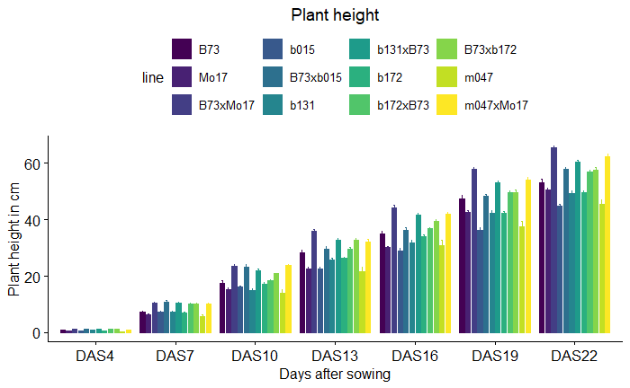

## Summary at 13 DAS

```{r}

df_DAS13 <- df %>% filter(DAS=="DAS13")

MPV <- (mean(df_DAS13[df_DAS13$line=="B73", ]$height) + mean(df_DAS13[df_DAS13$line=="Mo17", ]$height))/2


F1 <- mean(df_DAS13[df_DAS13$line=="B73xMo17", ]$height)

MPH <- ((F1-MPV)/MPV)

col <- c("#0070C0","#FF0000", "#C49A00", "#53B400", "#00C094","#00B6EB", "#A58AFF")

#ggdotplot(df_DAS13, "line", "height", color="category", add="boxplot", palette=col, size=0.7, ylab="Height in cm") + rotate_x_text(45) + geom_hline(yintercept=MPV, linetype="dashed", color = "red")


ggboxplot(df_DAS13, x="line", y="height",color="category",
          ylab="Height in cm", xlab="Genotype", add="dotplot", 
          palette=col, add.params = list(size = 1, alpha = 0.2), outlier.shape = NA) + 
      theme(axis.text.x = element_text(angle=45, hjust=1)) +  
      ggtitle("Height at 13 DAS")+  theme(plot.title = element_text(hjust = 0.5)) + 
      geom_hline(yintercept=MPV, linetype="dashed", color = "black")

```

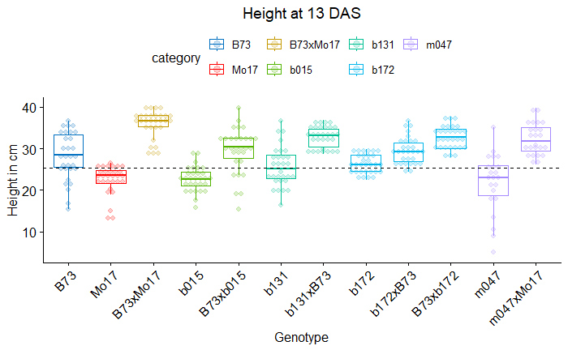


## Summary at 22 DAS

### Overview

```{r}

df_DAS22 <- df %>% filter(DAS=="DAS22")

MPV <- (mean(df_DAS22[df_DAS22$line=="B73", ]$height) + 
          mean(df_DAS22[df_DAS22$line=="Mo17", ]$height))/2

F1 <- mean(df_DAS22[df_DAS22$line=="B73xMo17", ]$height)

MPH <- ((F1-MPV)/MPV)

col <- c("#0070C0","#FF0000", "#C49A00", "#53B400", "#00C094","#00B6EB", "#A58AFF")

ggdotplot(df_DAS22, "line", "height", color="category", add="boxplot", palette=col, 
          add.params = list(size = 1, alpha = 0.2), ylab="Height in cm") + 
  rotate_x_text(45) + 
  geom_hline(yintercept=MPV, linetype="dashed", color = "black")


ggboxplot(df_DAS22, x="line", y="height", color="category", 
          ylab="Height in cm", xlab="Genotype", add="dotplot", 
          palette=col, add.params = list(size = 0.7, alpha = 0.2), outlier.shape = NA) + 
      theme(axis.text.x = element_text(angle=45, hjust=1)) +  
      ggtitle("Height at 22 DAS")+  theme(plot.title = element_text(hjust = 0.5)) + 
      geom_hline(yintercept=MPV, linetype="dashed", color = "black")

```

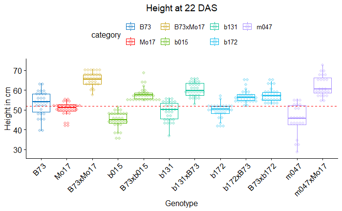

### By experiment

```{r}
col=c("#1b9e77","#d95f02","#7570b3")

ggboxplot(df_DAS22, "line", "height", color = "experiment", add="dotplot", 
          xlab="genotype", ylab="Plant height in cm", title="Plant height at 22DAS across the 3 experiments",
          palette=col, 
          add.params = list(size = 0.7, alpha = 0.2), outlier.shape = NA) + 
  rotate_x_text(45)
```

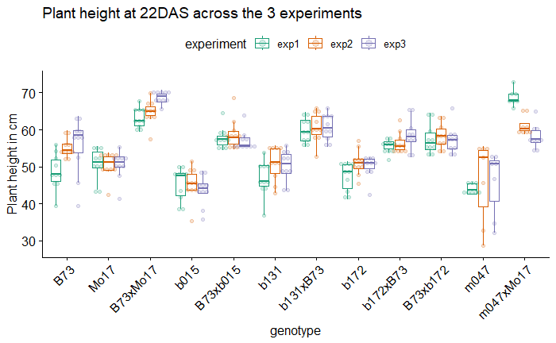

The replicated experiments are consistent across genotypes.

### Cluster by heterozygosity

```{r}

col <- c("#0070C0","#FF0000", "#C49A00", "#53B400", "#00C094","#00B6EB", "#A58AFF")

df_DAS22$category <- factor(df_DAS22$category, 
                            levels = c("B73", "Mo17","B73xMo17", "b015","b131","b172","m047"))


df_DAS22 %>% ggboxplot(x = "NOR", y = "height", ylab = "Plant height (cm)", 
                       xlab = "NOR", color = "category", add = "dotplot", 
                       palette = col, add.params = list(size=0.7, alpha = 0.2), outlier.shape = NA) + 
  theme(axis.text.x = element_text(angle = 45, hjust = 1)) + 
  ggtitle("") + theme(plot.title = element_text(hjust = 0.5)) + 
  geom_hline(yintercept = MPV, linetype = "dashed", color = "black")


```

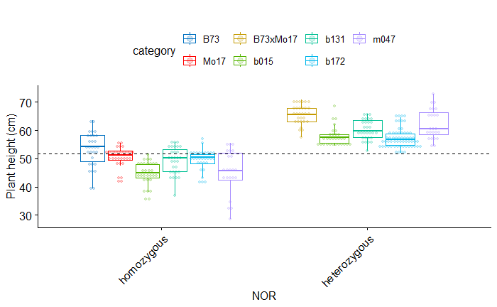

## Comparison heterozygous and homozygous NORs - 22DAS

### B73xMo17

```{r}

df_sub <- df_DAS22 %>% filter(category %in% c("Mo17", "B73","B73xMo17"))

# Uses the mixed model to adjust for confounding factors experiment
model <- lmer(height ~ NOR +
                (1 | experiment),
              data = df_sub)

# Compares genotype means on an equal footing
emm  <- emmeans(model, ~ NOR)

 # P-value
pairs(emm)

#plot(emm)

```

```
 contrast                  estimate    SE df t.ratio p.value
 heterozygous - homozygous     13.7 0.995 86  13.806  <.0001

Degrees-of-freedom method: kenward-roger 
```

### B73xb015

```{r}

df_sub <- df_DAS22 %>% filter(category %in% c("b015", "B73","B73xb015"))

# Uses the mixed model to adjust for confounding factors (year, block)
model <- lmer(height ~ NOR +
                (1 | experiment),
              data = df_sub)

# Compares genotype means on an equal footing
# Uses appropriate standard errors that reflect your field design
emm  <- emmeans(model, ~ NOR)

 # P-value
pairs(emm)

#plot(emm)

```

```
 contrast                  estimate  SE df t.ratio p.value
 homozygous - heterozygous    -8.96 1.3 86  -6.906  <.0001

Degrees-of-freedom method: kenward-roger 
```


### b131xB73

```{r}

df_sub <- df_DAS22 %>% filter(category %in% c("b131", "B73","b131xB73"))

# Uses the mixed model to adjust for confounding factors (year, block)
model <- lmer(height ~ NOR +
                (1 | experiment),
              data = df_sub)

# Compares genotype means on an equal footing
# Uses appropriate standard errors that reflect your field design
emm  <- emmeans(model, ~ NOR)

 # P-value
pairs(emm)

#plot(emm)

```

### b172xB73

```{r}

df_sub <- df_DAS22 %>% filter(category %in% c("b172", "B73","b172xB73"))

# Uses the mixed model to adjust for confounding factors (year, block)
model <- lmer(height ~ NOR +
                (1 | experiment),
              data = df_sub)

# Compares genotype means on an equal footing
# Uses appropriate standard errors that reflect your field design
emm  <- emmeans(model, ~ NOR)

 # P-value
pairs(emm)

#plot(emm)

```

```
 contrast                  estimate   SE df t.ratio p.value
 homozygous - heterozygous    -9.14 1.09 86  -8.359  <.0001

Degrees-of-freedom method: kenward-roger 
```


### B73xb172

```{r}

df_sub <- df_DAS22 %>% filter(category %in% c("b172", "B73","B73xb172"))

# Uses the mixed model to adjust for confounding factors (year, block)
model <- lmer(height ~ NOR +
                (1 | experiment),
              data = df_sub)

# Compares genotype means on an equal footing
# Uses appropriate standard errors that reflect your field design
emm  <- emmeans(model, ~ NOR)

 # P-value
pairs(emm)

#plot(emm)

```

```
 contrast                  estimate    SE  df t.ratio p.value
 homozygous - heterozygous    -5.96 0.784 116  -7.599  <.0001

Degrees-of-freedom method: kenward-roger 
```

### m047xMo17

```{r}

df_sub <- df_DAS22 %>% filter(category %in% c("m047", "Mo17","m047xMo17"))

# Uses the mixed model to adjust for confounding factors (year, block)
model <- lmer(height ~ NOR +
                (1 | experiment),
              data = df_sub)

# Compares genotype means on an equal footing
# Uses appropriate standard errors that reflect your field design
emm  <- emmeans(model, ~ NOR)

 # P-value
pairs(emm)

#plot(emm)

```

```
 contrast                  estimate   SE   df t.ratio p.value
 homozygous - heterozygous      -14 1.47 72.4  -9.534  <.0001

Degrees-of-freedom method: kenward-roger
```


## Summary Heterosis


```{r}

df_DAS22 <- df %>% filter(DAS=="DAS22")

# Function to calculate MPV
calculate_heterosis <- function(P1, P2, F1, phenotype, df){
  index_phenotype <-  which(grepl(phenotype, colnames(df)))
  MPV = ((mean(unlist(df[df$line==P1,][index_phenotype]))+mean(unlist(df[df$line==P2,][index_phenotype])))/2)
  F1 = mean(unlist(df[df$line==F1,][index_phenotype]))
  return((F1-MPV)/MPV)
}

# Create empty dataframe
df_MPH = data.frame(matrix(vector(), 6, 2,
                       dimnames=list(c(), c("hybrid","MPH_height")))
)

df_MPH$hybrid <- c("B73xMo17",
                                                "B73xb015",
                                                "b131xB73",
                                                "B73xb172",
                                                "b172xB73",
                                                "m047xMo17")

df_MPH$hybrid <- factor(df_MPH$hybrid, levels=c("B73xMo17",
                                                "B73xb015",
                                                "b131xB73",
                                                "B73xb172",
                                                "b172xB73",
                                                "m047xMo17"), ordered=T)

# Calculate MPV for each hybrid
MPH_height <- list()
MPH_height[1] <- calculate_heterosis("B73", "Mo17", "B73xMo17", "height", df_DAS22)
MPH_height[2] <- calculate_heterosis("B73", "b015", "B73xb015", "height", df_DAS22)
MPH_height[3] <- calculate_heterosis("B73", "b131", "b131xB73", "height", df_DAS22)
MPH_height[4] <- calculate_heterosis("B73", "b172", "B73xb172", "height", df_DAS22)
MPH_height[5] <- calculate_heterosis("B73", "b172", "b172xB73", "height", df_DAS22)
MPH_height[6] <- calculate_heterosis("Mo17", "m047", "m047xMo17", "height", df_DAS22)

df_MPH$MPH_height <- unlist(MPH_height)


ggbarplot(df_MPH,
  x = "hybrid", y = "MPH_height",
  fill = "#B3B3B3", 
  color="#B3B3B3",
  position = position_dodge(0.9),
  ylab = "Mid-parent heterosis (%)",
  xlab = "Hybrid", title = "Mid-parent heterosis for plant height at 22 DAS"
) +
  theme_bw() +
  scale_y_continuous(labels = scales::percent_format(accuracy = 1)) +
  theme(axis.text.x = element_text(angle = 45, hjust = 1)) + 
  theme(
    axis.text.x = element_text(color = "black"),
    axis.text.y = element_text(color = "black"),
    axis.ticks = element_line(color = "black")
  ) +
  theme(plot.title = element_text(hjust = 0.5))

```

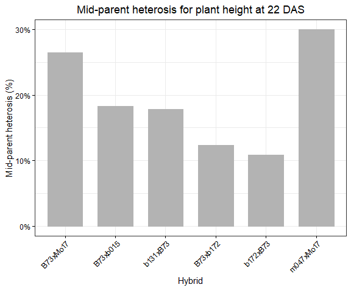

# Phenotypic analysis field trials

## Experimental design

Each block contains from 6 to 15 plants and each genotype is planted in 6 blocks. Field trials were performed in the experimental station of Reinshof (Goettingen, Germany) following standard agronomical practices for maize.

### 2022

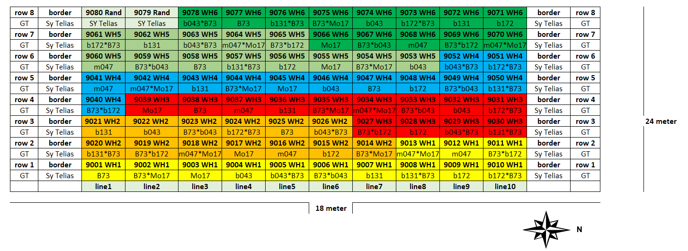

### 2024

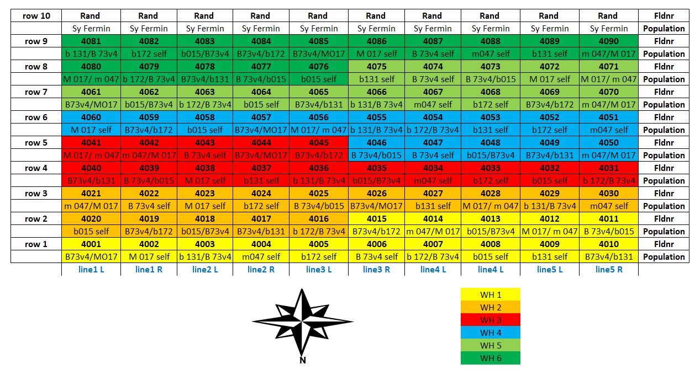
### 2025

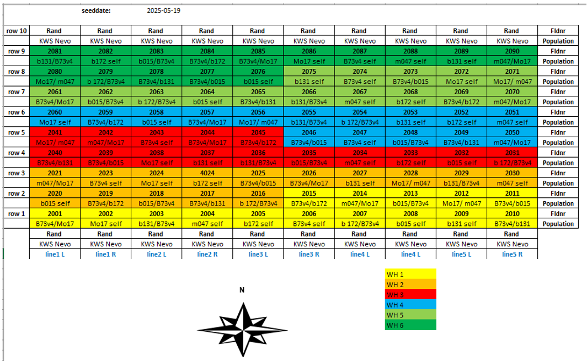

## R libraries

```{r}
# Plotting packages
library(tidyverse)
library(ggpubr)

# Statistics for agronomy
library(agricolae)
library(multcomp)
library(multcompView)
library(emmeans)

# Plot variable correlation
library(corrplot)

# linear mixed-effects model 
library(lme4)

library(remedy)
library(styler)

```

## Data

```{r}

field_data <- read.table("data/data_field_trials.txt", header = T)

field_data$genotype <- factor(field_data$genotype, 
                              levels = c("B73", "Mo17", "B73xMo17", 
                                         "b015", "b015xB73", "B73xb015", 
                                         "b131", "B73xb131", "b131xB73", 
                                         "b172", "B73xb172", "b172xB73", 
                                         "m047", "m047xMo17", "Mo17xm047"))

field_data$category <- factor(field_data$category, 
                              levels = c("B73", "Mo17", "B73xMo17", 
                                         "b015","b131","b172","m047"))

field_data$WH <- as.factor(field_data$WH)
field_data$year <- as.factor(field_data$year)
field_data$NOR <- factor(field_data$NOR, 
                         levels = c("homozygous","heterozygous"))

saveRDS(field_data, "data/field_data.Rds")

```


```{r}
field_data <- readRDS("data/field_data.Rds")
```


## Plant height at flowering


### By year

```{r}
col=c("#1b9e77","#d95f02","#7570b3")

ggboxplot(field_data, "genotype", "height_at_flowering", color = "year", add="dotplot", 
          xlab="genotype", ylab="Plant height in cm", title="Plant height at flowering across 3 years",
          palette=col, 
          add.params = list(size = 0.7, alpha = 0.2), outlier.shape = NA) + 
  rotate_x_text(45) + theme(plot.title = element_text(hjust = 0.5))

```

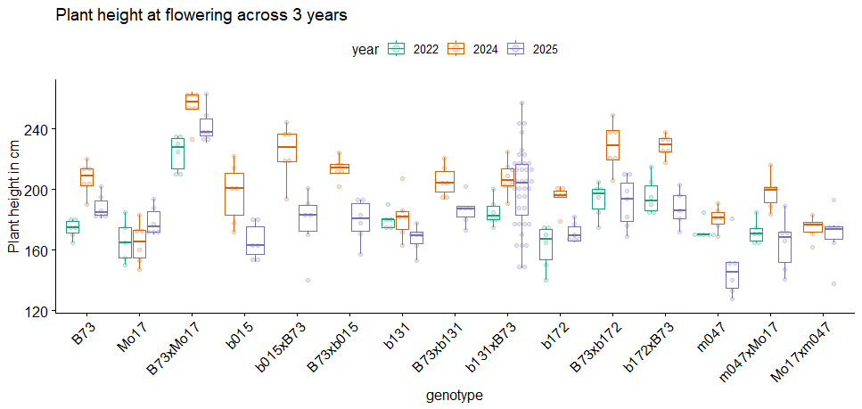


### Summary by genotype

```{r}

field_data <- readRDS("data/field_data.Rds")

MPV <- (mean(field_data[field_data$genotype=="B73",]$height_at_flowering) + mean(field_data[field_data$genotype=="Mo17",]$height_at_flowering))/2

# Color coding
col <- c("#0070C0","#FF0000", "#C49A00", "#53B400", "#00C094","#00B6EB", "#A58AFF")

field_data %>% ggboxplot(x = "genotype", y = "height_at_flowering", 
                         color = "category", ylab = "Height at flowering (cm)", 
                         xlab = "Genotype", add = "dotplot", palette = col,
                         add.params = list(size=0.7, alpha = 0.2), outlier.shape = NA) + 
  theme(axis.text.x = element_text(angle = 90, hjust = 1)) + 
  ggtitle("Height at flowering (cm)") + 
  theme(plot.title = element_text(hjust = 0.5)) + 
  geom_hline(yintercept = MPV, linetype = "dashed", color = "black")


```

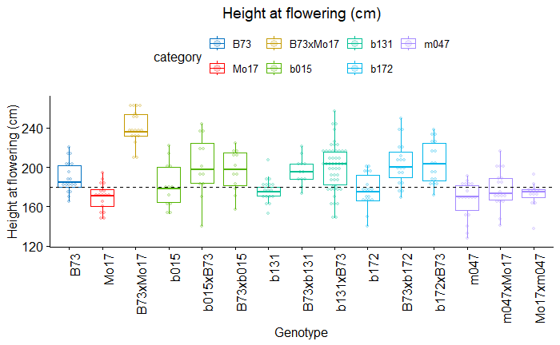

### Summary by NOR

```{r}

field_data <- readRDS("data/field_data.Rds")

MPV <- (mean(field_data[field_data$genotype=="B73",]$height_at_flowering) + mean(field_data[field_data$genotype=="Mo17",]$height_at_flowering))/2

# Color coding with F1
col <- c("#0070C0","#FF0000", "#C49A00", "#53B400", "#00C094","#00B6EB", "#A58AFF")

field_data %>% ggboxplot(x = "NOR", y = "height_at_flowering", 
                 ylab = "Height at flowering (cm)", 
                 xlab = "NOR", color="category", 
                 add = "dotplot", palette=col, 
                 add.params = list(size=0.7, alpha = 0.2), outlier.shape = NA) + 
  theme(axis.text.x = element_text(angle = 45, hjust = 1)) + 
  ggtitle("Height at flowering") + 
  theme(plot.title = element_text(hjust = 0.5)) + 
  geom_hline(yintercept = MPV, linetype = "dashed", color = "black")


```

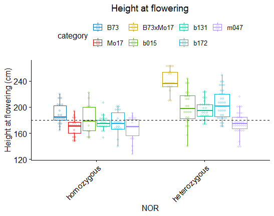


### B73xMo17

```{r}

df <- field_data %>% filter(category %in% c("Mo17", "B73","B73xMo17"))

# Uses the mixed model to adjust for confounding factors (year, block)
model <- lmer(height_at_flowering ~ NOR +
                (1 | year),
              data = df)

# Compares genotype means on an equal footing
# Uses appropriate standard errors that reflect your field design
emm  <- emmeans(model, ~ NOR)

 # P-value
pairs(emm)

```

```
 contrast                  estimate   SE df t.ratio p.value
 homozygous - heterozygous    -60.3 4.49 49 -13.449  <.0001

Degrees-of-freedom method: kenward-roger 
```


### b015

```{r}
# Subset full dataset
df <- field_data %>% filter(category %in% c("b015", "B73"))

# Uses the mixed model to adjust for confounding factors (year)
model <- lmer(height_at_flowering ~ NOR +
                (1 | year),
              data = df)

# Compares genotype means on an equal footing
emm  <- emmeans(model, ~ NOR)

 # P-value
pairs(emm)

```

```
 contrast                  estimate   SE   df t.ratio p.value
 homozygous - heterozygous    -9.35 4.45 50.8  -2.104  0.0404

Degrees-of-freedom method: kenward-roger 
```

### b131

```{r}
df <- field_data %>% filter(category %in% c("b131", "B73"))

# Uses the mixed model to adjust for confounding factors (year, block)
model <- lmer(height_at_flowering ~ NOR +
                (1 | year),
              data = df)

# Compares genotype means on an equal footing
# Uses appropriate standard errors that reflect your field design
emm  <- emmeans(model, ~ NOR)

 # P-value
pairs(emm)

```

```
 contrast                  estimate   SE   df t.ratio p.value
 homozygous - heterozygous      -10 3.28 55.2  -3.055  0.0035

Degrees-of-freedom method: kenward-roger 
```

### b172

```{r}
df <- field_data %>% filter(category %in% c("b172", "B73"))

# Uses the mixed model to adjust for confounding factors (year, block)
model <- lmer(height_at_flowering ~ NOR +
                (1 | year),
              data = df)

# Compares genotype means on an equal footing
# Uses appropriate standard errors that reflect your field design
emm  <- emmeans(model, ~ NOR)

 # P-value
pairs(emm)

```

```
 contrast                  estimate   SE df t.ratio p.value
 homozygous - heterozygous    -21.3 2.96 68  -7.192  <.0001

Degrees-of-freedom method: kenward-roger 
```

### m047

```{r}
df <- field_data %>% filter(category %in% c("m047", "Mo17"))

# Uses the mixed model to adjust for confounding factors (year, block)
model <- lmer(height_at_flowering ~ NOR +
                (1 | year),
              data = df)

# Compares genotype means on an equal footing
# Uses appropriate standard errors that reflect your field design
emm  <- emmeans(model, ~ NOR)

 # P-value
pairs(emm)
```

```
 contrast                  estimate   SE   df t.ratio p.value
 homozygous - heterozygous     -7.3 3.93 61.4  -1.855  0.0684

Degrees-of-freedom method: kenward-roger
```


## Grain yield

All plots of 10-15 plants were collected, the moisture of the grain and the grain mass was adjusted to 14.5% humidity and divided by the number of plants per plot to get a mean value of grain per plant (in grams).


### By year

```{r}
col=c("#1b9e77","#d95f02","#7570b3")

field_data %>% filter(grain_yield != 0) %>% ggboxplot("genotype", "grain_yield", color = "year", add="dotplot", 
          xlab="genotype", ylab="Grain yield per plant (g)", title="Grain yield across 3 years",
          palette=col, 
          add.params = list(size = 0.7, alpha = 0.2), outlier.shape = NA) + 
  rotate_x_text(45) + theme(plot.title = element_text(hjust = 0.5))

```

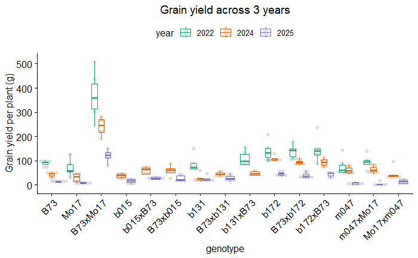


```{r}


# Color coding
col <- c("#0070C0","#FF0000", "#C49A00", "#53B400", "#00C094","#00B6EB", "#A58AFF")

df <- field_data %>% filter(year=="2025") %>% filter(grain_yield!=0)

MPV <- (mean(df[df$genotype=="B73",]$grain_yield) + mean(df[df$genotype=="Mo17",]$grain_yield))/2

 ggboxplot(df, x = "genotype", y = "grain_yield", 
                         color = "category", ylab = "Grain yield per plant (g)", 
                         xlab = "Genotype", add = "dotplot", palette = col,
                         add.params = list(size=0.7, alpha = 0.2), outlier.shape = NA) + 
  theme(axis.text.x = element_text(angle = 90, hjust = 1)) + 
  ggtitle("Grain yield") + 
  theme(plot.title = element_text(hjust = 0.5)) + 
  geom_hline(yintercept = MPV, linetype = "dashed", color = "black")


```


### Summary by genotype

```{r}

field_data <- readRDS("data/field_data.Rds")

MPV <- (mean(field_data[field_data$genotype=="B73",]$grain_yield) + mean(field_data[field_data$genotype=="Mo17",]$grain_yield))/2

# Color coding
col <- c("#0070C0","#FF0000", "#C49A00", "#53B400", "#00C094","#00B6EB", "#A58AFF")

field_data %>% ggboxplot(x = "genotype", y = "grain_yield", 
                         color = "category", ylab = "Grain yield per plant (g)", 
                         xlab = "Genotype", add = "dotplot", palette = col,
                         add.params = list(size=0.7, alpha = 0.2), outlier.shape = NA) + 
  theme(axis.text.x = element_text(angle = 90, hjust = 1)) + 
  ggtitle("Grain yield") + 
  theme(plot.title = element_text(hjust = 0.5)) + 
  geom_hline(yintercept = MPV, linetype = "dashed", color = "black")


```

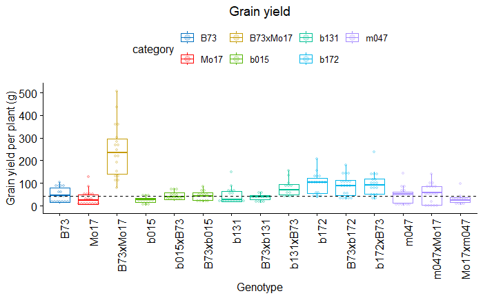

### Summary by NOR

```{r}

# Color coding
col <- c("#0070C0","#FF0000", "#C49A00", "#53B400", "#00C094","#00B6EB", "#A58AFF")

df <- field_data %>% filter(grain_yield!=0)

MPV <- (mean(df[df$genotype=="B73",]$grain_yield) + mean(df[df$genotype=="Mo17",]$grain_yield))/2

df$category <- factor(df$category, levels = c("B73", "Mo17","B73xMo17", "b015","b131","b172","m047"))

df %>% ggboxplot(x = "NOR", y = "grain_yield", 
                 ylab = "Grain yield per plant (g)", 
                 xlab = "NOR", color="category", 
                 add = "dotplot", palette=col, 
                 add.params = list(size=0.7, alpha = 0.2), outlier.shape = NA) + 
  theme(axis.text.x = element_text(angle = 45, hjust = 1)) + 
  ggtitle("Grain yield") + 
  theme(plot.title = element_text(hjust = 0.5)) + 
  geom_hline(yintercept = MPV, linetype = "dashed", color = "black")


```


### B73xMo17

```{r}

df <- field_data %>% filter(category %in% c("Mo17", "B73","B73xMo17"))

# Uses the mixed model to adjust for confounding factors (year, block)
model <- lmer(grain_yield ~ NOR +
                (1 | year),
              data = df)

# Compares genotype means on an equal footing
# Uses appropriate standard errors that reflect your field design
emm  <- emmeans(model, ~ NOR)

 # P-value
pairs(emm)

```

```
 contrast                  estimate   SE df t.ratio p.value
 homozygous - heterozygous    -60.3 4.49 49 -13.449  <.0001

Degrees-of-freedom method: kenward-roger 
```


### b015

```{r}
# Subset full dataset
df <- field_data %>% filter(category %in% c("b015", "B73"))

# Uses the mixed model to adjust for confounding factors (year)
model <- lmer(grain_yield ~ NOR +
                (1 | year),
              data = df)

# Compares genotype means on an equal footing
emm  <- emmeans(model, ~ NOR)

 # P-value
pairs(emm)

```

```
 contrast                  estimate   SE   df t.ratio p.value
 homozygous - heterozygous    -15.9 3.36 50.1  -4.738  <.0001

Degrees-of-freedom method: kenward-roger 
```

### b131

```{r}
df <- field_data %>% filter(category %in% c("b131", "B73"))

# Uses the mixed model to adjust for confounding factors (year, block)
model <- lmer(grain_yield ~ NOR +
                (1 | year),
              data = df)

# Compares genotype means on an equal footing
# Uses appropriate standard errors that reflect your field design
emm  <- emmeans(model, ~ NOR)

 # P-value
pairs(emm)

```

```
 contrast                  estimate   SE df t.ratio p.value
 homozygous - heterozygous    -13.1 4.61 55  -2.847  0.0062

Degrees-of-freedom method: kenward-rog
```

### b172

```{r}
df <- field_data %>% filter(category %in% c("b172", "B73"))

# Uses the mixed model to adjust for confounding factors (year, block)
model <- lmer(grain_yield ~ NOR +
                (1 | year),
              data = df)

# Compares genotype means on an equal footing
# Uses appropriate standard errors that reflect your field design
emm  <- emmeans(model, ~ NOR)

 # P-value
pairs(emm)

```

```
 contrast                  estimate   SE df t.ratio p.value
 homozygous - heterozygous    -19.1 6.71 68  -2.851  0.0058

Degrees-of-freedom method: kenward-roger 
```

### m047

```{r}
df <- field_data %>% filter(category %in% c("m047", "Mo17"))

# Uses the mixed model to adjust for confounding factors (year, block)
model <- lmer(grain_yield ~ NOR +
                (1 | year),
              data = df)

# Compares genotype means on an equal footing
# Uses appropriate standard errors that reflect your field design
emm  <- emmeans(model, ~ NOR)

 # P-value
pairs(emm)
```


```
contrast                  estimate   SE df t.ratio p.value
 homozygous - heterozygous    -9.04 5.48 61  -1.651  0.1040

Degrees-of-freedom method: kenward-roger
```


## Summary Heterosis


```{r}
# Function to calculate MPV
calculate_heterosis <- function(P1, P2, F1, phenotype, df){
  index_phenotype <-  which(grepl(phenotype, colnames(df)))
  MPV = ((mean(unlist(df[df$genotype==P1,][index_phenotype]))+mean(unlist(df[df$genotype==P2,][index_phenotype])))/2)
  F1 = mean(unlist(df[df$genotype==F1,][index_phenotype]))
  return((F1-MPV)/MPV)
}

# Create empty dataframe
df_MPH = data.frame(matrix(vector(), 9, 3,
                       dimnames=list(c(), c("hybrid","MPH_grain_yield", 
                                            "MPH_height_at_flowering")))
)

df_MPH$hybrid <- factor(df_MPH$hybrid, levels=c("B73xMo17","B73xb015",
                                                "b015xB73","B73xb131",
                                                "b131xB73","B73xb172",
                                                "b172xB73","Mo17xm047",
                                                "m047xMo17"), ordered=T)

# Calculate MPV for each hybrid

# Grain yield
MPH_grain_yield <- list()
MPH_grain_yield[1] <- calculate_heterosis("B73", "Mo17", "B73xMo17", "grain_yield", field_data)
MPH_grain_yield[2] <- calculate_heterosis("B73", "b015", "B73xb015", "grain_yield", field_data)
MPH_grain_yield[3] <- calculate_heterosis("B73", "b015", "b015xB73", "grain_yield", field_data)
MPH_grain_yield[4] <- calculate_heterosis("B73", "b131", "B73xb131", "grain_yield", field_data)
MPH_grain_yield[5] <- calculate_heterosis("B73", "b131", "b131xB73", "grain_yield", field_data)
MPH_grain_yield[6] <- calculate_heterosis("B73", "b172", "B73xb172", "grain_yield", field_data)
MPH_grain_yield[7] <- calculate_heterosis("B73", "b172", "b172xB73", "grain_yield", field_data)
MPH_grain_yield[8] <- calculate_heterosis("Mo17", "m047", "Mo17xm047", "grain_yield", field_data)
MPH_grain_yield[9] <- calculate_heterosis("Mo17", "m047", "m047xMo17", "grain_yield", field_data)

df_MPH$MPH_grain_yield <- unlist(MPH_grain_yield)

# Height at flowering
MPH_height_at_flowering <- list()
MPH_height_at_flowering[1] <- calculate_heterosis("B73", "Mo17", "B73xMo17", "height_at_flowering", field_data)
MPH_height_at_flowering[2] <- calculate_heterosis("B73", "b015", "B73xb015", "height_at_flowering", field_data)
MPH_height_at_flowering[3] <- calculate_heterosis("B73", "b015", "b015xB73", "height_at_flowering", field_data)
MPH_height_at_flowering[4] <- calculate_heterosis("B73", "b131", "B73xb131", "height_at_flowering", field_data)
MPH_height_at_flowering[5] <- calculate_heterosis("B73", "b131", "b131xB73", "height_at_flowering", field_data)
MPH_height_at_flowering[6] <- calculate_heterosis("B73", "b172", "B73xb172", "height_at_flowering", field_data)
MPH_height_at_flowering[7] <- calculate_heterosis("B73", "b172", "b172xB73", "height_at_flowering", field_data)
MPH_height_at_flowering[8] <- calculate_heterosis("Mo17", "m047", "Mo17xm047", "height_at_flowering", field_data)
MPH_height_at_flowering[9] <- calculate_heterosis("Mo17", "m047", "m047xMo17", "height_at_flowering", field_data)

df_MPH$MPH_height_at_flowering <- unlist(MPH_height_at_flowering)

df_MPH_long <- df_MPH %>% gather(phenotype, MPH, MPH_grain_yield:MPH_height_at_flowering)

col <-  c("#FFB90F","#556B2F")

ggbarplot(df_MPH_long,
  x = "hybrid", y = "MPH", fill = "phenotype",
  palette = col, position = position_dodge(0.9),
  ylab = "Mid-parent heterosis (%)",
  xlab = "Hybrid", title = "Mid-parent heterosis"
) +
  theme_bw() +
  scale_y_continuous(labels = scales::percent_format(accuracy = 1)) +
  theme(axis.text.x = element_text(angle = 45, hjust = 1)) + 
  theme(
    axis.text.x = element_text(color = "black"),
    axis.text.y = element_text(color = "black"),
    axis.ticks = element_line(color = "black")
  ) +
  theme(plot.title = element_text(hjust = 0.5))


```

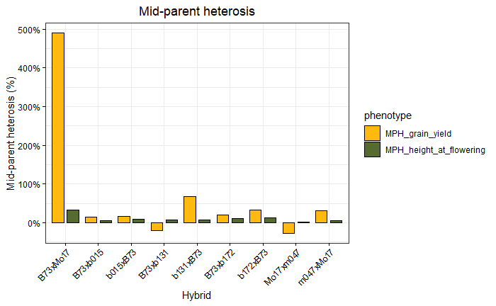


```{r}

col <-  c("#FFB90F","#556B2F")

df_MPH_long %>% filter(hybrid!="B73xMo17") %>%
ggbarplot(x = "hybrid", y = "MPH", fill="phenotype", 
          palette=col, position=position_dodge(0.9),
          ylab = "Mid-parent heterosis (%)",
          xlab="Hybrid", title="Mid-parent heterosis") +
  theme_bw() +
  scale_y_continuous(labels = scales::percent_format(accuracy = 1)) + 
  theme(axis.text.x = element_text(angle=45, hjust=1)) +  
  theme(axis.text.x = element_text(color="black"), 
      axis.text.y = element_text(color="black"),
      axis.ticks = element_line(color = "black")) + 
      theme(plot.title = element_text(hjust = 0.5))
```

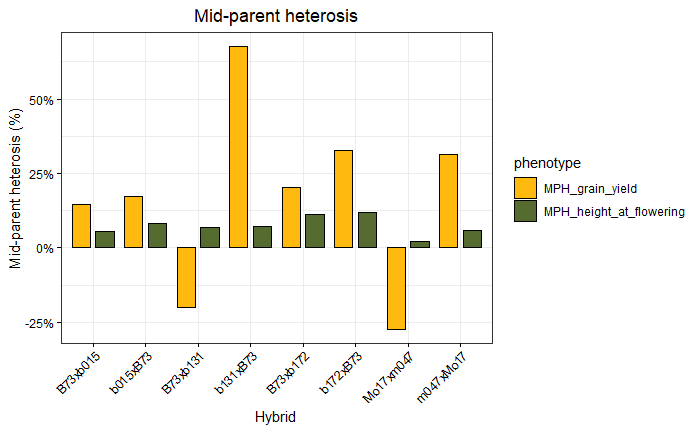

# RNA-seq analysis

## R libraries

```{r}

```


# sRNA-seq analysis


# Degradome analysis

## R libraries

```{r}

```


# Author

* **Johan Zicola** - [johanzi](https://github.com/johanzi)

# License

This project is licensed under the MIT License - see the [LICENSE](LICENSE) file for details


