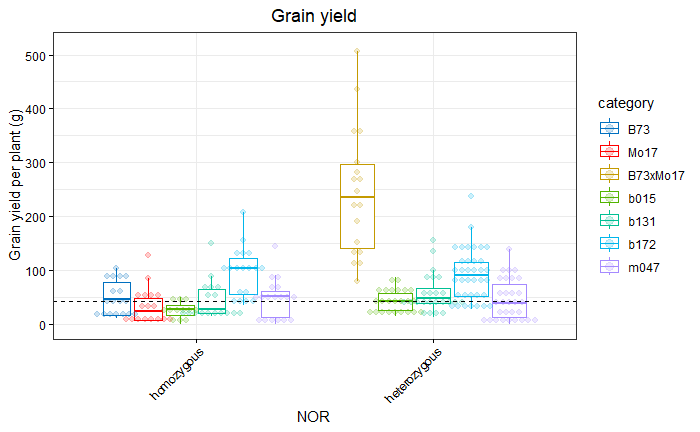

```{r setup, include=FALSE}
knitr::opts_chunk$set(eval = FALSE)
```

```{r,echo=FALSE,message=FALSE,warning=FALSE}
# Set so that long lines in R will be wrapped:
knitr::opts_chunk$set(tidy.opts = list(width.cutoff = 80), tidy = TRUE)
```


# Description

This repository contains the bioinformatic analysis of the paper Zicola et al.


# Phenotypic analysis growth chamber

Plants were grown in controlled growth chambers 


## R libraries

```{r}

# Plotting packages
library(tidyverse)
library(ggpubr)

# Statistics for agronomy (https://cran.r-project.org/web/packages/agricolae/agricolae.pdf)
library(agricolae)
library(multcomp)
library(multcompView)
library(emmeans)

# Plot variable correlation
library(corrplot)

# linear mixed-effects model 
library(lme4)

library(remedy)
library(styler)

```


```{r}

df <- read.delim("data/phenotyping/data_phenotyping_growth_chamber.txt", stringsAsFactors = T, dec = ",")

# Transform data in long format
long_df <- df %>% gather(DAS, height, DAS4:DAS22)

# Turn DAS into factor
long_df$DAS <- as.factor(long_df$DAS)

# Order DAS
long_df$DAS <- factor(long_df$DAS, levels = c("DAS4", "DAS7", "DAS10", "DAS13", "DAS16", "DAS19", "DAS22"), ordered = T)

# Order genotype
long_df$line <- factor(long_df$line, levels = c("B73", "Mo17", "B73xMo17", "b015", "B73xb015", "b131", "b131xB73", "b172", "b172xB73", "B73xb172", "m047", "m047xMo17"), ordered = T)

# Order groups
long_df$group <- factor(long_df$group, levels = c("B73", "Mo17", "B73xMo17", "B73_NIL", "B73_NIL_cross", "Mo17_NIL", "Mo17_NIL_cross"), ordered = T)

# Order categories
long_df$category <- factor(long_df$category, levels = c("B73", "Mo17", "B73xMo17", "b015", "b131", "b172", "m047"), ordered = T)

long_df$NOR <- factor(long_df$NOR, levels = c("homozygous","heterozygous"))

long_df$height <- as.numeric(long_df$height)

saveRDS(long_df, "data/phenotyping/data_phenotyping_growth_chamber.Rds")

```

## Plant height across time points

```{r}
df <- readRDS("data/phenotyping/data_phenotyping_growth_chamber.Rds")

df %>% ggbarplot("DAS", "height", fill = "line", color = "line", 
                 position = position_dodge(0.9), add = "mean_se") + 
  ylab("Plant height in cm") + xlab("Days after sowing") + 
  ggtitle("Plant height") + 
  theme(plot.title = element_text(hjust = 0.5))

```


## Summary at 13 DAS

```{r}
df <- readRDS("data/phenotyping/data_phenotyping_growth_chamber.Rds")

df_DAS13 <- df %>% filter(DAS=="DAS13")

MPV <- (mean(df_DAS13[df_DAS13$line=="B73", ]$height) + mean(df_DAS13[df_DAS13$line=="Mo17", ]$height))/2


F1 <- mean(df_DAS13[df_DAS13$line=="B73xMo17", ]$height)

MPH <- ((F1-MPV)/MPV)

col <- c("#0070C0","#FF0000", "#C49A00", "#53B400", "#00C094","#00B6EB", "#A58AFF")

#ggdotplot(df_DAS13, "line", "height", color="category", add="boxplot", palette=col, size=0.7, ylab="Height in cm") + rotate_x_text(45) + geom_hline(yintercept=MPV, linetype="dashed", color = "red")


ggboxplot(df_DAS13, x="line", y="height",color="category",
          ylab="Height in cm", xlab="Genotype", add="dotplot", 
          palette=col, add.params = list(size = 1, alpha = 0.2), outlier.shape = NA) + 
      theme(axis.text.x = element_text(angle=45, hjust=1)) +  
      ggtitle("Height at 13 DAS")+  theme(plot.title = element_text(hjust = 0.5)) + 
      geom_hline(yintercept=MPV, linetype="dashed", color = "black")  + expand_limits(y = 0)

```


## Summary at 22 DAS

### Overview

```{r}
df <- readRDS("data/phenotyping/data_phenotyping_growth_chamber.Rds")

df_DAS22 <- df %>% filter(DAS=="DAS22")

MPV <- (mean(df_DAS22[df_DAS22$line=="B73", ]$height) + 
          mean(df_DAS22[df_DAS22$line=="Mo17", ]$height))/2

F1 <- mean(df_DAS22[df_DAS22$line=="B73xMo17", ]$height)

MPH <- ((F1-MPV)/MPV)

col <- c("#0070C0","#FF0000", "#C49A00", "#53B400", "#00C094","#00B6EB", "#A58AFF")

ggdotplot(df_DAS22, "line", "height", color="category", add="boxplot", palette=col, 
          add.params = list(size = 1, alpha = 0.2), ylab="Height in cm") + 
  rotate_x_text(45) + 
  geom_hline(yintercept=MPV, linetype="dashed", color = "black")


ggboxplot(df_DAS22, x="line", y="height", color="category", 
          ylab="Height in cm", xlab="Genotype", add="dotplot", 
          palette=col, add.params = list(size = 0.7, alpha = 0.2), outlier.shape = NA) + 
      theme(axis.text.x = element_text(angle=45, hjust=1)) +  
      ggtitle("Height at 22 DAS")+  theme(plot.title = element_text(hjust = 0.5)) + 
      geom_hline(yintercept=MPV, linetype="dashed", color = "black") + expand_limits(y = 0)

```


### By experiment

```{r}
col=c("#1b9e77","#d95f02","#7570b3")

ggboxplot(df_DAS22, "line", "height", color = "experiment", add="dotplot", 
          xlab="genotype", ylab="Plant height in cm", title="Plant height at 22 DAS across the 3 experiments",
          palette=col, 
          add.params = list(size = 0.7, alpha = 0.2), outlier.shape = NA) + theme_bw() +
  rotate_x_text(45) + expand_limits(y = 0) +  theme(axis.text.x = element_text(color="black"), 
      axis.text.y = element_text(color="black"),
      axis.ticks = element_line(color = "black")) + 
      theme(plot.title = element_text(hjust = 0.5)) + 
      scale_y_continuous(labels = scales::comma_format())
```


The replicated experiments are consistent across genotypes.

### Cluster by heterozygosity

```{r}

col <- c("#0070C0","#FF0000", "#C49A00", "#53B400", "#00C094","#00B6EB", "#A58AFF")

df_DAS22$category <- factor(df_DAS22$category, 
                            levels = c("B73", "Mo17","B73xMo17", "b015","b131","b172","m047"))


df_DAS22 %>% ggboxplot(
  x = "NOR", y = "height", ylab = "Plant height (cm)", 
  xlab = "NOR", color = "category", add = "dotplot", palette = col, add.params = list(size = 0.5, alpha = 0.2), outlier.shape = NA
) + theme_bw() + expand_limits(y = 0) +
  theme(axis.text.x = element_text(angle = 45, hjust = 1)) +
  ggtitle("Plant height 22 days after sowing") + theme(plot.title = element_text(hjust = 0.5)) +
  geom_hline(yintercept = MPV, linetype = "dashed", color = "black") + theme(
    axis.text.x = element_text(color = "black"),
    axis.text.y = element_text(color = "black"),
    axis.ticks = element_line(color = "black")
  ) +
  theme(plot.title = element_text(hjust = 0.5)) +
 scale_y_continuous(labels = scales::comma_format())


```


## Comparison heterozygous and homozygous NORs - 22DAS

### B73xMo17

```{r}

df_sub <- df_DAS22 %>% filter(category %in% c("Mo17", "B73","B73xMo17"))

# Uses the mixed model to adjust for confounding factors experiment
model <- lmer(height ~ NOR +
                (1 | experiment),
              data = df_sub)

# Compares genotype means on an equal footing
emm  <- emmeans(model, ~ NOR)

 # P-value
pairs(emm)

#plot(emm)

```

```
 contrast                  estimate    SE df t.ratio p.value
 heterozygous - homozygous     13.7 0.995 86  13.806  <.0001

Degrees-of-freedom method: kenward-roger 
```

### B73xb015

```{r}

df_sub <- df_DAS22 %>% filter(category %in% c("b015", "B73","B73xb015"))

# Uses the mixed model to adjust for confounding factors (year, block)
model <- lmer(height ~ NOR +
                (1 | experiment),
              data = df_sub)

# Compares genotype means on an equal footing
# Uses appropriate standard errors that reflect your field design
emm  <- emmeans(model, ~ NOR)

 # P-value
pairs(emm)

#plot(emm)

```

```
 contrast                  estimate  SE df t.ratio p.value
 homozygous - heterozygous    -8.96 1.3 86  -6.906  <.0001

Degrees-of-freedom method: kenward-roger 
```


### b131xB73

```{r}

df_sub <- df_DAS22 %>% filter(category %in% c("b131", "B73","b131xB73"))

# Uses the mixed model to adjust for confounding factors (year, block)
model <- lmer(height ~ NOR +
                (1 | experiment),
              data = df_sub)

# Compares genotype means on an equal footing
# Uses appropriate standard errors that reflect your field design
emm  <- emmeans(model, ~ NOR)

 # P-value
pairs(emm)

#plot(emm)

```

### b172xB73

```{r}

df_sub <- df_DAS22 %>% filter(category %in% c("b172", "B73","b172xB73"))

# Uses the mixed model to adjust for confounding factors (year, block)
model <- lmer(height ~ NOR +
                (1 | experiment),
              data = df_sub)

# Compares genotype means on an equal footing
# Uses appropriate standard errors that reflect your field design
emm  <- emmeans(model, ~ NOR)

 # P-value
pairs(emm)

#plot(emm)

```

```
 contrast                  estimate   SE df t.ratio p.value
 homozygous - heterozygous    -9.14 1.09 86  -8.359  <.0001

Degrees-of-freedom method: kenward-roger 
```


### B73xb172

```{r}

df_sub <- df_DAS22 %>% filter(category %in% c("b172", "B73","B73xb172"))

# Uses the mixed model to adjust for confounding factors (year, block)
model <- lmer(height ~ NOR +
                (1 | experiment),
              data = df_sub)

# Compares genotype means on an equal footing
# Uses appropriate standard errors that reflect your field design
emm  <- emmeans(model, ~ NOR)

 # P-value
pairs(emm)

#plot(emm)

```

```
 contrast                  estimate    SE  df t.ratio p.value
 homozygous - heterozygous    -5.96 0.784 116  -7.599  <.0001

Degrees-of-freedom method: kenward-roger 
```

### m047xMo17

```{r}

df_sub <- df_DAS22 %>% filter(category %in% c("m047", "Mo17","m047xMo17"))

# Uses the mixed model to adjust for confounding factors (year, block)
model <- lmer(height ~ NOR +
                (1 | experiment),
              data = df_sub)

# Compares genotype means on an equal footing
# Uses appropriate standard errors that reflect your field design
emm  <- emmeans(model, ~ NOR)

 # P-value
pairs(emm)

#plot(emm)

```

```
 contrast                  estimate   SE   df t.ratio p.value
 homozygous - heterozygous      -14 1.47 72.4  -9.534  <.0001

Degrees-of-freedom method: kenward-roger
```


## Summary Heterosis


```{r}

df_DAS22 <- df %>% filter(DAS=="DAS22")

# Function to calculate MPV
calculate_heterosis <- function(P1, P2, F1, phenotype, df){
  index_phenotype <-  which(grepl(phenotype, colnames(df)))
  MPV = ((mean(unlist(df[df$line==P1,][index_phenotype]))+mean(unlist(df[df$line==P2,][index_phenotype])))/2)
  F1 = mean(unlist(df[df$line==F1,][index_phenotype]))
  return((F1-MPV)/MPV)
}

# Create empty dataframe
df_MPH = data.frame(matrix(vector(), 6, 2,
                       dimnames=list(c(), c("hybrid","MPH_height")))
)

df_MPH$hybrid <- c("B73xMo17",
                                                "B73xb015",
                                                "b131xB73",
                                                "B73xb172",
                                                "b172xB73",
                                                "m047xMo17")

df_MPH$hybrid <- factor(df_MPH$hybrid, levels=c("B73xMo17",
                                                "B73xb015",
                                                "b131xB73",
                                                "B73xb172",
                                                "b172xB73",
                                                "m047xMo17"), ordered=T)

# Calculate MPV for each hybrid
MPH_height <- list()
MPH_height[1] <- calculate_heterosis("B73", "Mo17", "B73xMo17", "height", df_DAS22)
MPH_height[2] <- calculate_heterosis("B73", "b015", "B73xb015", "height", df_DAS22)
MPH_height[3] <- calculate_heterosis("B73", "b131", "b131xB73", "height", df_DAS22)
MPH_height[4] <- calculate_heterosis("B73", "b172", "B73xb172", "height", df_DAS22)
MPH_height[5] <- calculate_heterosis("B73", "b172", "b172xB73", "height", df_DAS22)
MPH_height[6] <- calculate_heterosis("Mo17", "m047", "m047xMo17", "height", df_DAS22)

df_MPH$MPH_height <- unlist(MPH_height)


ggbarplot(df_MPH,
  x = "hybrid", y = "MPH_height",
  fill = "#B3B3B3", 
  color="#B3B3B3",
  position = position_dodge(0.9),
  ylab = "Mid-parent heterosis (%)",
  xlab = "Hybrid", title = "Mid-parent heterosis for plant height at 22 DAS"
) +
  theme_bw() +
  scale_y_continuous(labels = scales::percent_format(accuracy = 1)) +
  theme(axis.text.x = element_text(angle = 45, hjust = 1)) + 
  theme(
    axis.text.x = element_text(color = "black"),
    axis.text.y = element_text(color = "black"),
    axis.ticks = element_line(color = "black")
  ) +
  theme(plot.title = element_text(hjust = 0.5))

```


```{r}

df_MPH_long <- df_MPH %>% gather(phenotype, MPH, MPH_grain_yield:MPH_height_at_flowering)

df_MPH_long$phenotype <- as.factor(df_MPH_long$phenotype)

df_MPH  %>% arrange(MPH)
```


# Phenotypic analysis field trials

## Experimental design

Each block contains from 6 to 15 plants and each genotype is planted in 6 blocks. Field trials were performed in the experimental station of Reinshof (Goettingen, Germany) following standard agronomical practices for maize.

### 2022


### 2024


### 2025


## R libraries

```{r}
# Plotting packages
library(tidyverse)
library(ggpubr)

# Statistics for agronomy
library(agricolae)
library(multcomp)
library(multcompView)
library(emmeans)

# Plot variable correlation
library(corrplot)

# linear mixed-effects model 
library(lme4)

library(remedy)
library(styler)

```

## Data

```{r}

field_data <- read.table("data/phenotyping/data_field_trials.txt", header = T)

field_data$genotype <- factor(field_data$genotype, 
                              levels = c("B73", "Mo17", "B73xMo17", 
                                         "b015", "b015xB73", "B73xb015", 
                                         "b131", "B73xb131", "b131xB73", 
                                         "b172", "B73xb172", "b172xB73", 
                                         "m047", "m047xMo17", "Mo17xm047"))

field_data$category <- factor(field_data$category, 
                              levels = c("B73", "Mo17", "B73xMo17", 
                                         "b015","b131","b172","m047"))

field_data$WH <- as.factor(field_data$WH)
field_data$year <- as.factor(field_data$year)
field_data$NOR <- factor(field_data$NOR, 
                         levels = c("homozygous","heterozygous"))

saveRDS(field_data, "data/phenotyping/field_data.Rds")

```


## Plant height at flowering


### By year

```{r}
col=c("#1b9e77","#d95f02","#7570b3")

ggboxplot(field_data, "genotype", "height_at_flowering",
  color = "year", add = "dotplot",
  xlab = "genotype", ylab = "Plant height (cm)", title = "Plant height at flowering across 3 years",
  palette = col,
  add.params = list(size = 0.7, alpha = 0.2), outlier.shape = NA
) + theme_bw() + 
  rotate_x_text(45) + theme(plot.title = element_text(hjust = 0.5)) +  theme(axis.text.x = element_text(color="black"), 
      axis.text.y = element_text(color="black"),
      axis.ticks = element_line(color = "black")) + 
      theme(plot.title = element_text(hjust = 0.5)) + 
      scale_y_continuous(labels = scales::comma_format()) + expand_limits(y = 0)

```


#### 2022

```{r}

field_data <- readRDS("data/phenotyping/field_data.Rds")

field_data_sub <- field_data %>% filter(year=="2022")
  
  
MPV <- (mean(field_data_sub[field_data_sub$genotype=="B73",]$height_at_flowering) + mean(field_data_sub[field_data_sub$genotype=="Mo17",]$height_at_flowering))/2

# Color coding
col <- c("#0070C0","#FF0000", "#C49A00", "#53B400", "#00B6EB", "#A58AFF")

field_data_sub %>% ggboxplot(x = "genotype", y = "height_at_flowering", 
                         color = "category", ylab = "Height at flowering (cm)", 
                         xlab = "Genotype", add = "dotplot", palette = col,
                         add.params = list(size=0.7, alpha = 0.2), outlier.shape = NA) + theme_bw() +
  theme(axis.text.x = element_text(angle = 45, hjust = 1)) + 
  ggtitle("Height at flowering (cm) - 2022") + 
  theme(plot.title = element_text(hjust = 0.5)) + 
  geom_hline(yintercept = MPV, linetype = "dashed", color = "black", lwd=0.8) +  theme(axis.text.x = element_text(color="black"), 
      axis.text.y = element_text(color="black"),
      axis.ticks = element_line(color = "black")) + 
      theme(plot.title = element_text(hjust = 0.5)) + 
      scale_y_continuous(labels = scales::comma_format()) + expand_limits(y = 0)


```


#### 2024

```{r}

field_data <- readRDS("data/phenotyping/field_data.Rds")

field_data_sub <- field_data %>% filter(year=="2024")
  
  
MPV <- (mean(field_data_sub[field_data_sub$genotype=="B73",]$height_at_flowering) + mean(field_data_sub[field_data_sub$genotype=="Mo17",]$height_at_flowering))/2

# Color coding
col <- c("#0070C0","#FF0000", "#C49A00", "#53B400", "#00C094","#00B6EB", "#A58AFF")


field_data_sub %>% ggboxplot(x = "genotype", y = "height_at_flowering", 
                         color = "category", ylab = "Height at flowering (cm)", 
                         xlab = "Genotype", add = "dotplot", palette = col,
                         add.params = list(size=0.7, alpha = 0.2), outlier.shape = NA) + theme_bw() +
  theme(axis.text.x = element_text(angle = 45, hjust = 1)) + 
  ggtitle("Height at flowering (cm) - 2024") + 
  theme(plot.title = element_text(hjust = 0.5)) + 
  geom_hline(yintercept = MPV, linetype = "dashed", color = "black", lwd=0.8) +  theme(axis.text.x = element_text(color="black"), 
      axis.text.y = element_text(color="black"),
      axis.ticks = element_line(color = "black")) + 
      theme(plot.title = element_text(hjust = 0.5)) + 
      scale_y_continuous(labels = scales::comma_format()) + expand_limits(y = 0)

```


#### 2025

```{r}

field_data <- readRDS("data/phenotyping/field_data.Rds")

field_data_sub <- field_data %>% filter(year=="2025")
  
  
MPV <- (mean(field_data_sub[field_data_sub$genotype=="B73",]$height_at_flowering) + mean(field_data_sub[field_data_sub$genotype=="Mo17",]$height_at_flowering))/2

# Color coding
col <- c("#0070C0","#FF0000", "#C49A00", "#53B400", "#00C094","#00B6EB", "#A58AFF")

field_data_sub %>% ggboxplot(x = "genotype", y = "height_at_flowering", 
                         color = "category", ylab = "Height at flowering (cm)", 
                         xlab = "Genotype", add = "dotplot", palette = col,
                         add.params = list(size=0.7, alpha = 0.2), outlier.shape = NA) + theme_bw() +
  theme(axis.text.x = element_text(angle = 45, hjust = 1)) + 
  ggtitle("Height at flowering (cm) - 2025") + 
  theme(plot.title = element_text(hjust = 0.5)) + 
  geom_hline(yintercept = MPV, linetype = "dashed", color = "black", lwd=0.8) +  theme(axis.text.x = element_text(color="black"), 
      axis.text.y = element_text(color="black"),
      axis.ticks = element_line(color = "black")) + 
      theme(plot.title = element_text(hjust = 0.5)) + 
      scale_y_continuous(labels = scales::comma_format()) + expand_limits(y = 0)

```


### Summary by genotype


```{r}

field_data <- readRDS("data/phenotyping/field_data.Rds")

MPV <- (mean(field_data[field_data$genotype=="B73",]$height_at_flowering) + mean(field_data[field_data$genotype=="Mo17",]$height_at_flowering))/2

# Color coding
col <- c("#0070C0","#FF0000", "#C49A00", "#53B400", "#00C094","#00B6EB", "#A58AFF")

field_data %>% ggboxplot(x = "genotype", y = "height_at_flowering", 
                         color = "category", ylab = "Height at flowering (cm)", 
                         xlab = "Genotype", add = "dotplot", palette = col,
                         add.params = list(size=0.7, alpha = 0.2), outlier.shape = NA) + theme_bw() +
  theme(axis.text.x = element_text(angle = 45, hjust = 1)) + 
  ggtitle("Height at flowering (cm)") + 
  theme(plot.title = element_text(hjust = 0.5)) + 
  geom_hline(yintercept = MPV, linetype = "dashed", color = "black")+  theme(axis.text.x = element_text(color="black"), 
      axis.text.y = element_text(color="black"),
      axis.ticks = element_line(color = "black")) + 
      theme(plot.title = element_text(hjust = 0.5)) + 
      scale_y_continuous(labels = scales::comma_format()) + expand_limits(y = 0)


```


### Summary by NOR

```{r}

field_data <- readRDS("data/phenotyping/field_data.Rds")

MPV <- (mean(field_data[field_data$genotype=="B73",]$height_at_flowering) + mean(field_data[field_data$genotype=="Mo17",]$height_at_flowering))/2

# Color coding with F1
col <- c("#0070C0","#FF0000", "#C49A00", "#53B400", "#00C094","#00B6EB", "#A58AFF")

field_data %>% ggboxplot(x = "NOR", y = "height_at_flowering", 
                 ylab = "Height at flowering (cm)", 
                 xlab = "NOR", color="category", 
                 add = "dotplot", palette=col, 
                 add.params = list(size=0.7, alpha = 0.2), outlier.shape = NA) + theme_bw() +
  theme(axis.text.x = element_text(angle = 45, hjust = 1)) + 
  ggtitle("Height at flowering") + 
  theme(plot.title = element_text(hjust = 0.5)) + 
  geom_hline(yintercept = MPV, linetype = "dashed", color = "black")+  theme(axis.text.x = element_text(color="black"), 
      axis.text.y = element_text(color="black"),
      axis.ticks = element_line(color = "black")) + 
      theme(plot.title = element_text(hjust = 0.5)) + 
      scale_y_continuous(labels = scales::comma_format()) + ylim(0,300)


```


### B73xMo17

```{r}

df <- field_data %>% filter(category %in% c("Mo17", "B73","B73xMo17"))

# Uses the mixed model to adjust for confounding factors (year, block)
model <- lmer(height_at_flowering ~ NOR +
                (1 | year),
              data = df)

# Compares genotype means on an equal footing
# Uses appropriate standard errors that reflect your field design
emm  <- emmeans(model, ~ NOR)

 # P-value
pairs(emm)

```

```
 contrast                  estimate   SE df t.ratio p.value
 homozygous - heterozygous    -60.3 4.49 49 -13.449  <.0001

Degrees-of-freedom method: kenward-roger 
```


### b015

```{r}
# Subset full dataset
df <- field_data %>% filter(category %in% c("b015", "B73"))

# Uses the mixed model to adjust for confounding factors (year)
model <- lmer(height_at_flowering ~ NOR +
                (1 | year),
              data = df)

# Compares genotype means on an equal footing
emm  <- emmeans(model, ~ NOR)

 # P-value
pairs(emm)

```

```
 contrast                  estimate   SE   df t.ratio p.value
 homozygous - heterozygous    -9.35 4.45 50.8  -2.104  0.0404

Degrees-of-freedom method: kenward-roger 
```

### b131

```{r}
df <- field_data %>% filter(category %in% c("b131", "B73"))

# Uses the mixed model to adjust for confounding factors (year, block)
model <- lmer(height_at_flowering ~ NOR +
                (1 | year),
              data = df)

# Compares genotype means on an equal footing
# Uses appropriate standard errors that reflect your field design
emm  <- emmeans(model, ~ NOR)

 # P-value
pairs(emm)

```

```
 contrast                  estimate   SE   df t.ratio p.value
 homozygous - heterozygous      -10 3.28 55.2  -3.055  0.0035

Degrees-of-freedom method: kenward-roger 
```

### b172

```{r}
df <- field_data %>% filter(category %in% c("b172", "B73"))

# Uses the mixed model to adjust for confounding factors (year, block)
model <- lmer(height_at_flowering ~ NOR +
                (1 | year),
              data = df)

# Compares genotype means on an equal footing
# Uses appropriate standard errors that reflect your field design
emm  <- emmeans(model, ~ NOR)

 # P-value
pairs(emm)

```

```
 contrast                  estimate   SE df t.ratio p.value
 homozygous - heterozygous    -21.3 2.96 68  -7.192  <.0001

Degrees-of-freedom method: kenward-roger 
```

### m047

```{r}
df <- field_data %>% filter(category %in% c("m047", "Mo17"))

# Uses the mixed model to adjust for confounding factors (year, block)
model <- lmer(height_at_flowering ~ NOR +
                (1 | year),
              data = df)

# Compares genotype means on an equal footing
# Uses appropriate standard errors that reflect your field design
emm  <- emmeans(model, ~ NOR)

 # P-value
pairs(emm)
```

```
 contrast                  estimate   SE   df t.ratio p.value
 homozygous - heterozygous     -7.3 3.93 61.4  -1.855  0.0684

Degrees-of-freedom method: kenward-roger
```


## Grain yield

All plots of 10-15 plants were collected, the moisture of the grain and the grain mass was adjusted to 14.5% humidity and divided by the number of plants per plot to get a mean value of grain per plant (in grams).


### By year

```{r}
col=c("#1b9e77","#d95f02","#7570b3")

field_data %>%
  filter(grain_yield != 0) %>%
  ggboxplot("genotype", "grain_yield",
    color = "year", add = "dotplot",
    xlab = "genotype", ylab = "Grain yield per plant (g)", title = "Grain yield across 3 years",
    palette = col,
    add.params = list(size = 0.7, alpha = 0.2), outlier.shape = NA
  ) + theme_bw() +
  rotate_x_text(45) + theme(plot.title = element_text(hjust = 0.5)) + theme(
    axis.text.x = element_text(color = "black"),
    axis.text.y = element_text(color = "black"),
    axis.ticks = element_line(color = "black")
  ) +
  theme(plot.title = element_text(hjust = 0.5)) +
  scale_y_continuous(labels = scales::comma_format()) + expand_limits(y = 0)

```


```{r}


# Color coding
col <- c("#0070C0","#FF0000", "#C49A00", "#53B400", "#00C094","#00B6EB", "#A58AFF")

df <- field_data %>% filter(year=="2025") %>% filter(grain_yield!=0)

MPV <- (mean(df[df$genotype=="B73",]$grain_yield) + mean(df[df$genotype=="Mo17",]$grain_yield))/2

 ggboxplot(df, x = "genotype", y = "grain_yield", 
                         color = "category", ylab = "Grain yield per plant (g)", 
                         xlab = "Genotype", add = "dotplot", palette = col,
                         add.params = list(size=0.7, alpha = 0.2), outlier.shape = NA) + 
  theme(axis.text.x = element_text(angle = 90, hjust = 1)) + 
  ggtitle("Grain yield") + 
  theme(plot.title = element_text(hjust = 0.5)) + 
  geom_hline(yintercept = MPV, linetype = "dashed", color = "black")


```


#### 2022

```{r}

field_data <- readRDS("data/phenotyping/field_data.Rds")

field_data_sub <- field_data %>% filter(year=="2022")
  
  
MPV <- (mean(field_data_sub[field_data_sub$genotype=="B73",]$grain_yield) + mean(field_data_sub[field_data_sub$genotype=="Mo17",]$grain_yield))/2

# Color coding
col <- c("#0070C0","#FF0000", "#C49A00", "#53B400", "#00B6EB", "#A58AFF")

field_data_sub %>% ggboxplot(x = "genotype", y = "grain_yield", 
                         color = "category", ylab = "Grain yield per plant (g)", 
                         xlab = "Genotype", add = "dotplot", palette = col,
                         add.params = list(size=0.7, alpha = 0.2), outlier.shape = NA) + 
  theme(axis.text.x = element_text(angle = 45, hjust = 1)) + 
  ggtitle("Grain yield per plant (g) - 2022") + 
  theme(plot.title = element_text(hjust = 0.5)) + 
  geom_hline(yintercept = MPV, linetype = "dashed", color = "red", lwd=0.8)

```


#### 2024

```{r}

field_data <- readRDS("data/phenotyping/field_data.Rds")

field_data_sub <- field_data %>% filter(year=="2024")
  
  
MPV <- (mean(field_data_sub[field_data_sub$genotype=="B73",]$grain_yield) + mean(field_data_sub[field_data_sub$genotype=="Mo17",]$grain_yield))/2

# Color coding
col <- c("#0070C0","#FF0000", "#C49A00", "#53B400", "#00C094","#00B6EB", "#A58AFF")

field_data_sub %>% ggboxplot(x = "genotype", y = "grain_yield", 
                         color = "category", ylab = "Grain yield per plant (g)", 
                         xlab = "Genotype", add = "dotplot", palette = col,
                         add.params = list(size=0.7, alpha = 0.2), outlier.shape = NA) + 
  theme(axis.text.x = element_text(angle = 45, hjust = 1)) + 
  ggtitle("Grain yield per plant (g) - 2024") + 
  theme(plot.title = element_text(hjust = 0.5)) + 
  geom_hline(yintercept = MPV, linetype = "dashed", color = "red", lwd=0.8)


```


#### 2025

```{r}

field_data <- readRDS("data/phenotyping/field_data.Rds")

field_data_sub <- field_data %>% filter(year=="2025")
  
  
MPV <- (mean(field_data_sub[field_data_sub$genotype=="B73",]$grain_yield) + mean(field_data_sub[field_data_sub$genotype=="Mo17",]$grain_yield))/2

# Color coding
col <- c("#0070C0","#FF0000", "#C49A00", "#53B400", "#00C094","#00B6EB", "#A58AFF")

field_data_sub %>% ggboxplot(x = "genotype", y = "grain_yield", 
                         color = "category", ylab = "Height at flowering (cm)", 
                         xlab = "Genotype", add = "dotplot", palette = col,
                         add.params = list(size=0.7, alpha = 0.2), outlier.shape = NA) + 
  theme(axis.text.x = element_text(angle = 45, hjust = 1)) + 
  ggtitle("Grain yield per plant (g) - 2025") + 
  theme(plot.title = element_text(hjust = 0.5)) + 
  geom_hline(yintercept = MPV, linetype = "dashed", color = "red", lwd=0.8)

```


### Summary by genotype

```{r}

field_data <- readRDS("data/phenotyping/field_data.Rds")

MPV <- (mean(field_data[field_data$genotype=="B73",]$grain_yield) + mean(field_data[field_data$genotype=="Mo17",]$grain_yield))/2

# Color coding
col <- c("#0070C0","#FF0000", "#C49A00", "#53B400", "#00C094","#00B6EB", "#A58AFF")

field_data %>% ggboxplot(x = "genotype", y = "grain_yield", 
                         color = "category", ylab = "Grain yield per plant (g)", 
                         xlab = "Genotype", add = "dotplot", palette = col,
                         add.params = list(size=0.7, alpha = 0.2), outlier.shape = NA) + 
  theme(axis.text.x = element_text(angle = 90, hjust = 1)) + 
  ggtitle("Grain yield") + 
  theme(plot.title = element_text(hjust = 0.5)) + 
  geom_hline(yintercept = MPV, linetype = "dashed", color = "black")


```


### Summary by NOR

```{r}

# Color coding
col <- c("#0070C0","#FF0000", "#C49A00", "#53B400", "#00C094","#00B6EB", "#A58AFF")

df <- field_data %>% filter(grain_yield!=0)

MPV <- (mean(df[df$genotype=="B73",]$grain_yield) + mean(df[df$genotype=="Mo17",]$grain_yield))/2

df$category <- factor(df$category, levels = c("B73", "Mo17","B73xMo17", "b015","b131","b172","m047"))

field_data %>% ggboxplot(x = "NOR", y = "grain_yield", 
                 ylab = "Grain yield per plant (g)", 
                 xlab = "NOR", color="category", 
                 add = "dotplot", palette=col, 
                 add.params = list(size=0.7, alpha = 0.2), outlier.shape = NA) + theme_bw() +
  theme(axis.text.x = element_text(angle = 45, hjust = 1)) + 
  ggtitle("Grain yield") + 
  theme(plot.title = element_text(hjust = 0.5)) + 
  geom_hline(yintercept = MPV, linetype = "dashed", color = "black")+  theme(axis.text.x = element_text(color="black"), 
      axis.text.y = element_text(color="black"),
      axis.ticks = element_line(color = "black")) + 
      theme(plot.title = element_text(hjust = 0.5)) + 
      scale_y_continuous(labels = scales::comma_format())


```



### B73xMo17

```{r}

df <- field_data %>% filter(category %in% c("Mo17", "B73","B73xMo17"))

# Uses the mixed model to adjust for confounding factors (year, block)
model <- lmer(grain_yield ~ NOR +
                (1 | year),
              data = df)

# Compares genotype means on an equal footing
# Uses appropriate standard errors that reflect your field design
emm  <- emmeans(model, ~ NOR)

 # P-value
pairs(emm)

```

```
 contrast                  estimate   SE df t.ratio p.value
 homozygous - heterozygous    -60.3 4.49 49 -13.449  <.0001

Degrees-of-freedom method: kenward-roger 
```

### b015

```{r}
# Subset full dataset
df <- field_data %>% filter(category %in% c("b015", "B73"))

# Uses the mixed model to adjust for confounding factors (year)
model <- lmer(grain_yield ~ NOR +
                (1 | year),
              data = df)

# Compares genotype means on an equal footing
emm  <- emmeans(model, ~ NOR)

 # P-value
pairs(emm)

```

```
 contrast                  estimate   SE   df t.ratio p.value
 homozygous - heterozygous    -15.9 3.36 50.1  -4.738  <.0001

Degrees-of-freedom method: kenward-roger 
```

### b131

```{r}
df <- field_data %>% filter(category %in% c("b131", "B73"))

# Uses the mixed model to adjust for confounding factors (year, block)
model <- lmer(grain_yield ~ NOR +
                (1 | year),
              data = df)

# Compares genotype means on an equal footing
# Uses appropriate standard errors that reflect your field design
emm  <- emmeans(model, ~ NOR)

 # P-value
pairs(emm)

```

```
 contrast                  estimate   SE df t.ratio p.value
 homozygous - heterozygous    -13.1 4.61 55  -2.847  0.0062

Degrees-of-freedom method: kenward-rog
```

### b172

```{r}
df <- field_data %>% filter(category %in% c("b172", "B73"))

# Uses the mixed model to adjust for confounding factors (year, block)
model <- lmer(grain_yield ~ NOR +
                (1 | year),
              data = df)

# Compares genotype means on an equal footing
# Uses appropriate standard errors that reflect your field design
emm  <- emmeans(model, ~ NOR)

 # P-value
pairs(emm)

```

```
 contrast                  estimate   SE df t.ratio p.value
 homozygous - heterozygous    -19.1 6.71 68  -2.851  0.0058

Degrees-of-freedom method: kenward-roger 
```

### m047

```{r}
df <- field_data %>% filter(category %in% c("m047", "Mo17"))

# Uses the mixed model to adjust for confounding factors (year, block)
model <- lmer(grain_yield ~ NOR +
                (1 | year),
              data = df)

# Compares genotype means on an equal footing
# Uses appropriate standard errors that reflect your field design
emm  <- emmeans(model, ~ NOR)

 # P-value
pairs(emm)
```

```
contrast                  estimate   SE df t.ratio p.value
 homozygous - heterozygous    -9.04 5.48 61  -1.651  0.1040

Degrees-of-freedom method: kenward-roger
```
## Summary Heterosis

```{r}

# Function to calculate MPV
calculate_heterosis <- function(P1, P2, F1, phenotype, df){
  index_phenotype <-  which(grepl(phenotype, colnames(df)))
  MPV = ((mean(unlist(df[df$genotype==P1,][index_phenotype]))+mean(unlist(df[df$genotype==P2,][index_phenotype])))/2)
  F1 = mean(unlist(df[df$genotype==F1,][index_phenotype]))
  return((F1-MPV)/MPV)
}

# Create empty dataframe
df_MPH = data.frame(matrix(vector(), 9, 3,
                       dimnames=list(c(), c("hybrid","MPH_grain_yield", 
                                            "MPH_height_at_flowering")))
)


df_MPH$hybrid <- c("B73xMo17","B73xb015",
                  "b015xB73","B73xb131",
                  "b131xB73","B73xb172",
                  "b172xB73","Mo17xm047",
                  "m047xMo17")


df_MPH$hybrid <- factor(df_MPH$hybrid, levels=c("B73xMo17","B73xb015",
                                                "b015xB73","B73xb131",
                                                "b131xB73","B73xb172",
                                                "b172xB73","Mo17xm047",
                                                "m047xMo17"), ordered=T)

# Calculate MPV for each hybrid

# Grain yield
MPH_grain_yield <- list()
MPH_grain_yield[1] <- calculate_heterosis("B73", "Mo17", "B73xMo17", "grain_yield", field_data)
MPH_grain_yield[2] <- calculate_heterosis("B73", "b015", "B73xb015", "grain_yield", field_data)
MPH_grain_yield[3] <- calculate_heterosis("B73", "b015", "b015xB73", "grain_yield", field_data)
MPH_grain_yield[4] <- calculate_heterosis("B73", "b131", "B73xb131", "grain_yield", field_data)
MPH_grain_yield[5] <- calculate_heterosis("B73", "b131", "b131xB73", "grain_yield", field_data)
MPH_grain_yield[6] <- calculate_heterosis("B73", "b172", "B73xb172", "grain_yield", field_data)
MPH_grain_yield[7] <- calculate_heterosis("B73", "b172", "b172xB73", "grain_yield", field_data)
MPH_grain_yield[8] <- calculate_heterosis("Mo17", "m047", "Mo17xm047", "grain_yield", field_data)
MPH_grain_yield[9] <- calculate_heterosis("Mo17", "m047", "m047xMo17", "grain_yield", field_data)

df_MPH$MPH_grain_yield <- unlist(MPH_grain_yield)

# Height at flowering
MPH_height_at_flowering <- list()
MPH_height_at_flowering[1] <- calculate_heterosis("B73", "Mo17", "B73xMo17", "height_at_flowering", field_data)
MPH_height_at_flowering[2] <- calculate_heterosis("B73", "b015", "B73xb015", "height_at_flowering", field_data)
MPH_height_at_flowering[3] <- calculate_heterosis("B73", "b015", "b015xB73", "height_at_flowering", field_data)
MPH_height_at_flowering[4] <- calculate_heterosis("B73", "b131", "B73xb131", "height_at_flowering", field_data)
MPH_height_at_flowering[5] <- calculate_heterosis("B73", "b131", "b131xB73", "height_at_flowering", field_data)
MPH_height_at_flowering[6] <- calculate_heterosis("B73", "b172", "B73xb172", "height_at_flowering", field_data)
MPH_height_at_flowering[7] <- calculate_heterosis("B73", "b172", "b172xB73", "height_at_flowering", field_data)
MPH_height_at_flowering[8] <- calculate_heterosis("Mo17", "m047", "Mo17xm047", "height_at_flowering", field_data)
MPH_height_at_flowering[9] <- calculate_heterosis("Mo17", "m047", "m047xMo17", "height_at_flowering", field_data)

df_MPH$MPH_height_at_flowering <- unlist(MPH_height_at_flowering)

df_MPH_long <- df_MPH %>% gather(phenotype, MPH, MPH_grain_yield:MPH_height_at_flowering)

df_MPH_long$phenotype <- as.factor(df_MPH_long$phenotype)

col <-  c("#FFB90F","#556B2F")

ggbarplot(df_MPH_long,
  x = "hybrid", y = "MPH", fill = "phenotype",
  palette = col, position = position_dodge(0.9),
  ylab = "Mid-parent heterosis (%)",
  xlab = "Hybrid", title = "Mid-parent heterosis"
) +
  theme_bw() +
  scale_y_continuous(labels = scales::percent_format(accuracy = 1)) +
  theme(axis.text.x = element_text(angle = 45, hjust = 1)) + 
  theme(
    axis.text.x = element_text(color = "black"),
    axis.text.y = element_text(color = "black"),
    axis.ticks = element_line(color = "black")
  ) +
  theme(plot.title = element_text(hjust = 0.5))


```


```{r}

col <-  c("#FFB90F","#556B2F")

df_MPH_long %>% filter(hybrid!="B73xMo17") %>%
ggbarplot(x = "hybrid", y = "MPH", fill="phenotype", 
          palette=col, position=position_dodge(0.9),
          ylab = "Mid-parent heterosis (%)",
          xlab="Hybrid", title="Mid-parent heterosis") +
  theme_bw() +
  scale_y_continuous(labels = scales::percent_format(accuracy = 1)) + 
  theme(axis.text.x = element_text(angle=45, hjust=1)) +  
  theme(axis.text.x = element_text(color="black"), 
      axis.text.y = element_text(color="black"),
      axis.ticks = element_line(color = "black")) + 
      theme(plot.title = element_text(hjust = 0.5))
```


```{r}
df_MPH_long %>% filter(hybrid!="B73xMo17") %>% group_by(phenotype) %>%  summarize(mean_MPH=mean(MPH), sd=sd(MPH))
```

0.122


```{r}

df_MPH_long %>% filter(phenotype =="MPH_height_at_flowering") %>% arrange(MPH)
df_MPH_long %>% filter(phenotype =="MPH_grain_yield") %>% arrange(MPH)


df_MPH_long %>% filter(hybrid!="B73xMo17" & phenotype =="MPH_height_at_flowering") %>% arrange(MPH)
df_MPH_long %>% filter(hybrid!="B73xMo17" & phenotype =="MPH_grain_yield") %>% arrange(MPH)
```


```{r}
df_MPH_long %>% filter(hybrid=="B73xMo17") %>% group_by(phenotype) %>%  summarize(mean_MPH=mean(MPH), sd=sd(MPH))
```

Top NILs crosses compare to canonical F1

0.12/0.33 => 36% full heterosis

0.67/4.89 => 14%

490% heterosis for grain yield vs 17% for NOR NILs (17/490 = 3.5%)

33% heterosis for plant height vs 7.5% (7.5/33 = 22%)

# ##################
# RNA-seq analysis
# #################

## Data

NEBNext Ultra II Directional RNA Library Prep Kit (NEB #E7760). Three repetitions of each sample, paired-end reads (use the option "rna-strandness RF" in HISAT2).


```{bash, eval=FALSE}
# Location fastq files
/mnt/ceph-hdd/projects/scc_uanp_scholten/data/ngs_data/BGI_data/F22FTSEUHT1495_LIBfbksR_mRNA_sRNA_degradome_johan_doga/F22FTSEUHT1495_LIBfbksR_PE100
```


## R libraries


```{r}
library(tidyverse)
library(ggpubr)
library(gghighlight)
library(DESeq2)
library(Biostrings)
library(viridis)
library(tximport)

fasta_to_df <- function(path){
  fasta = readLines(path)
  ids = grepl(">", fasta)
  f = data.frame(
    id = sub(">", "", fasta[ids]),
    sequence = tapply(fasta[!ids], cumsum(ids)[!ids], function(x) {
      paste(x, collapse = "")
    }))
  return(f)
}

make_fasta <-  function(vector_sequence, path_output, sequence_names){
  if(is.vector(vector_sequence)){
    len_seq <- length(vector_sequence)
    Xfasta <- character(len_seq * 2)
    if(missing(sequence_names)){
      Xfasta[c(TRUE, FALSE)] <- paste0(">seq", 1:len_seq)
    } else {
      Xfasta[c(TRUE, FALSE)] <- sequence_names
    }
    Xfasta[c(FALSE, TRUE)] <- as.character(vector_sequence)
    writeLines(Xfasta, path_output)
  } 
  else {
      stop("Argument is not a vector")
    }
}

# Source function for GO analysis

source("P:/git_repositories/GOMAP_maize_B73_NAM5/go_functions.R", chdir = T)
```


## Quality check

```{bash, eval=FALSE}

#!/bin/bash
#
#SBATCH --job-name=fastqc
#SBATCH --partition=medium
#SBATCH --nodes=1
#SBATCH --mem=4Gb
#SBATCH --cpus-per-task=12
#SBATCH --output=output_fastqc/slurm.%A.%a.out
#SBATCH --error=output_fastqc/slurm.%A.%a.err
#SBATCH --partition=medium
#SBATCH --time=48:00:00
#SBATCH --array=1-72

module load fastqc

i=$(\ls -1 *gz | sed -n ${SLURM_ARRAY_TASK_ID}p)

fastqc -t 12 -o output_fastqc $i

```


## Salmon mapping

### Creating Salmon indexes

```{bash, eval=FALSE}

cd /usr/users/zicola/genomes/maize_B73/B73_NAM5/mapping_index_salmon

# Get fasta file of the genome assemblies
server="http://ftp.ensemblgenomes.org/pub/plants/release-51"

wget ${server}/fasta/zea_mays/dna/Zea_mays.Zm-B73-REFERENCE-NAM-5.0.dna.toplevel.fa.gz

gunzip Zea_mays.Zm-B73-REFERENCE-NAM-5.0.dna.toplevel.fa.gz

samtools index Zea_mays.Zm-B73-REFERENCE-NAM-5.0.dna.toplevel.fa

# Create decoys.txt
cut -f1 Zea_mays.Zm-B73-REFERENCE-NAM-5.0.dna.toplevel.fa.fai > decoys.txt

# Get cDNA sequences
wget ${server}//fasta/zea_mays/cdna/Zea_mays.Zm-B73-REFERENCE-NAM-5.0.cdna.all.fa.gz

gunzip Zea_mays.Zm-B73-REFERENCE-NAM-5.0.cdna.all.fa.gz

# Merge all fasta files and remove extra informations from the headers
cat Zea_mays.Zm-B73-REFERENCE-NAM-5.0.cdna.all.fa Zea_mays.Zm-B73-REFERENCE-NAM-5.0.dna.toplevel.fa | cut -d' ' -f1 > B73_NAM5_index.fasta

```


```{bash, eval=FALSE}
#!/bin/bash
#SBATCH --job-name=build_index_salmon
#SBATCH --partition=medium
#SBATCH --mem=60G
#SBATCH --time=05:00:00
#SBATCH --cpus-per-task=8
#SBATCH --output=slurm/%x.%j.out
#SBATCH --error=slurm/%x.%j.err
#SBATCH --mail-type=END
#SBATCH --mail-user=johan.zicola@uni-goettingen.de

module load salmon/1.10.2

salmon index -t B73_NAM5_index.fasta -p 8 -i B73_NAM5_index --decoys decoys.txt

```

It took 30 minutes with 60 Gb RAM and 8 threads.

Create a tx2gene file (transcript id in 1st column and gene id in second column, header names are not important).

```{bash, eval=FALSE}

samtools faidx Zea_mays.Zm-B73-REFERENCE-NAM-5.0.cdna.all.fa
paste tx gene > tx2gene.txt
rm tx gene

```

### Mapping

```{bash, eval=FALSE}
# Old location
cd /usr/users/npghpc/data/NGS_data/BGI_data/F22FTSEUHT1495_LIBfbksR_mRNA_sRNA_degradome_johan_doga/F22FTSEUHT1495_LIBfbksR_PE100

# New location
cd /mnt/ceph-hdd/projects/scc_uanp_scholten/data/ngs_data/BGI_data/F22FTSEUHT1495_LIBfbksR_mRNA_sRNA_degradome_johan_doga/F22FTSEUHT1495_LIBfbksR_PE100

```


```{bash, eval=FALSE}
#!/bin/bash
#SBATCH --job-name=salmon_mapping
#SBATCH --cpus-per-task=12
#SBATCH --partition=medium
#SBATCH --mem=30G
#SBATCH --time=00:40:00
#SBATCH -o slurm/%x.%a.%j.out
#SBATCH -e slurm/%x.%a.%j.err
#SBATCH --mail-type=END
#SBATCH --mail-user=johan.zicola@uni-goettingen.de
#SBATCH --array=1-36

module load gcc/14.2.0 openmpi/4.1.7 salmon/1.10.3

sample_id=$(sed -n ${SLURM_ARRAY_TASK_ID}p sample_id.txt)
fastq1="raw_data/${sample_id}/${sample_id}_L1_1.fq.gz"
fastq2="raw_data/${sample_id}/${sample_id}_L1_2.fq.gz"

path_index="/usr/users/zicola/genomes/maize_B73/B73_NAM5/mapping_index_salmon/B73_NAM5_index"
output_dir="/usr/users/npghpc/data/NGS_data/BGI_data/F22FTSEUHT1495_LIBfbksR_mRNA_sRNA_degradome_johan_doga/F22FTSEUHT1495_LIBfbksR_PE100/salmon_mapping"

salmon quant -p 12 --libType A -i $path_index -1 $fastq1 -2 $fastq2 \
  -o ${output_dir}/$sample_id --validateMappings --gcBias

``` 

The mapping took around 4-5 min.

Library type as automatically defined as ISR by Salmon

```{bash, eval=FALSE}
find salmon_mapping -name "*log" -exec grep "likely library" {} \;
```

### Mapping rate

```{bash, eval=FALSE}

find salmon_mapping -name "salmon_quant.log" -exec echo {} \; -exec grep "Mapping rate" {} \;   > mapping_rate.txt

```

The mapping rate is from 37.55% (B73xb172_3) to 88% (b172_3) (35/36 samples > 82%)

The sample with low mapping rate is B73xb172_3. Perhaps there is contamination in this sample?

### Check contamination with FastQ-screen

https://www.bioinformatics.babraham.ac.uk/projects/fastq_screen/

Doc: https://stevenwingett.github.io/FastQ-Screen/

```{bash, eval=FALSE}

wget https://github.com/StevenWingett/FastQ-Screen/archive/refs/tags/v0.16.0.tar.gz

tar zxvf FastQ-Screen-0.16.0.tar.gz

cd FastQ-Screen-0.16.0

# Confi file (see video https://www.youtube.com/watch?v=WqiKPRxHzNU&ab_channel=BabrahamBioinf)

cp cp fastq_screen.conf.example fastq_screen.conf

vim fastq_screen.conf
# Add path dabase in ~/data

# Get example
https://www.bioinformatics.babraham.ac.uk/projects/fastq_screen/fastq_screen_test_dataset.tar.gz

tar zxvf fastq_screen_test_dataset.tar.gz


# Get genomes bowtie2 indexes (list in https://www.bioinformatics.babraham.ac.uk/projects/fastq_screen/Genome_Data/FastQ_Screen_Genomes/)
./fastq_screen --get_genomes

# There are 10 genomes, then vectors, adaptors, PhIX, Lamba, rRNA sequences

# Adjust fastq_screen.conf based on https://www.bioinformatics.babraham.ac.uk/projects/fastq_screen/Genome_Data/FastQ_Screen_Genomes/fastq_screen.conf
# and replace [FastQ_Screen_Genomes_Path] by /usr/users/zicola/bin/FastQ-Screen-0.16.0/FastQ_Screen_Genomes/

# Add BOWTIE2 /sw/rev/25.04/cascadelake_opx_rocky8/linux-rocky8-cascadelake/gcc-14.2.0/bowtie2-2.5.4-ybfzsnsjgizzurcttrotmrahh4nasnd7/bin/bowtie2

# Load bowtie2 before running fastq_screen
module load gcc/14.2.0 bowtie2/2.5.4

# Do test with the toydataset
./fastq_screen --aligner bowtie2 fastq_screen_test_dataset/fqs_test_dataset.fastq.gz


```


```{bash, eval=FALSE}
Using fastq_screen v0.16.0
Reading configuration from '/home/uni08/zicola/bin/FastQ-Screen-0.16.0/fastq_screen.conf'
Using '/sw/rev/25.04/cascadelake_opx_rocky8/linux-rocky8-cascadelake/gcc-14.2.0/bowtie2-2.5.4-ybfzsnsjgizzurcttrotmrahh4nasnd7/bin/bowtie2' as Bowtie 2 path
Adding database Human
Adding database Mouse
Adding database Rat
Adding database Drosophila
Adding database Worm
Adding database Yeast
Adding database Arabidopsis
Adding database Ecoli
Adding database rRNA
Adding database MT
Adding database PhiX
Adding database Lambda
Adding database Vectors
Adding database Adapters
Using 8 threads for searches
Option --subset set to 100000 reads
Processing fqs_test_dataset.fastq.gz
Counting sequences in fqs_test_dataset.fastq.gz
Not making subset of 100000 since 1000 actual sequences is too low or close enough
Searching fqs_test_dataset.fastq.gz_temp_subset.fastq against Human
Searching fqs_test_dataset.fastq.gz_temp_subset.fastq against Mouse
Searching fqs_test_dataset.fastq.gz_temp_subset.fastq against Rat
Searching fqs_test_dataset.fastq.gz_temp_subset.fastq against Drosophila
Searching fqs_test_dataset.fastq.gz_temp_subset.fastq against Worm
Searching fqs_test_dataset.fastq.gz_temp_subset.fastq against Yeast
Searching fqs_test_dataset.fastq.gz_temp_subset.fastq against Arabidopsis
Searching fqs_test_dataset.fastq.gz_temp_subset.fastq against Ecoli
Searching fqs_test_dataset.fastq.gz_temp_subset.fastq against rRNA
Searching fqs_test_dataset.fastq.gz_temp_subset.fastq against MT
Searching fqs_test_dataset.fastq.gz_temp_subset.fastq against PhiX
Searching fqs_test_dataset.fastq.gz_temp_subset.fastq against Lambda
Searching fqs_test_dataset.fastq.gz_temp_subset.fastq against Vectors
Searching fqs_test_dataset.fastq.gz_temp_subset.fastq against Adapters
Perl module GD::Graph::bars not installed, skipping charts
Processing complete

```

(Actually optional) I also need to install GD perl module but I get again this gcc compiler issue with the annobin missing plugin (already discussed in thread on Element:)

```
Hi Johan,
we stopped installing the local gcc from Rocky 8, since it is quite old and most people want to use newer versions. Spack provides more recent versions that can better optimize for our hardware.
I can't say how much effort it would be to add annobin, if that can work as an independent module or if it would need to be integrated into the gcc modules or might even require a recompile of gcc. Changing our current compilers would very likely be a huge effort and would invalidate all or most of the finetuning and testing our software team had to do with the current modules.
I think it would be easiest if you installed it in your home directory via the spack-user module.
```


No container available yet (https://github.com/StevenWingett/FastQ-Screen/issues/21)

```{bash, eval=FALSE}
cd /usr/users/zicola/PROJECTS/NOR_NIL_RNAseq/data/conta_check_B73xb172_3

module load gcc/14.2.0 bowtie2/2.5.4

srun -p medium --time=00:20:00 --cpus-per-task=8 /usr/users/zicola/bin/FastQ-Screen-0.16.0/fastq_screen --conf /usr/users/zicola/bin/FastQ-Screen-0.16.0/fastq_screen.conf --aligner bowtie2 /usr/users/npghpc/data/NGS_data/BGI_data/F22FTSEUHT1495_LIBfbksR_mRNA_sRNA_degradome_johan_doga/F22FTSEUHT1495_LIBfbksR_PE100/raw_data/B73xb172_3/B73xb172_3_L1_1.fq.gz

```


Compare with a sample with high mapping rate (b015_1)

```{r}

module load gcc/14.2.0 bowtie2/2.5.4

srun -p medium --time=00:20:00 --cpus-per-task=8 /usr/users/zicola/bin/FastQ-Screen-0.16.0/fastq_screen --conf /usr/users/zicola/bin/FastQ-Screen-0.16.0/fastq_screen.conf --aligner bowtie2 /usr/users/npghpc/data/NGS_data/BGI_data/F22FTSEUHT1495_LIBfbksR_mRNA_sRNA_degradome_johan_doga/F22FTSEUHT1495_LIBfbksR_PE100/raw_data/b015_1/b015_1_L1_1.fq.gz
```


## Import data in DESeq2

```{bash, eval=FALSE}
# Copy quant file in project folder
cp -r /usr/users/npghpc/data/NGS_data/BGI_data/F22FTSEUHT1495_LIBfbksR_mRNA_sRNA_degradome_johan_doga/F22FTSEUHT1495_LIBfbksR_PE100/salmon_mapping /usr/users/zicola/PROJECTS/NOR_NIL_RNAseq/data

```


```{r }
# Upload the coldata file for all experiment
coldata <- read.table ("data/coldata.txt", header=T)

# Convert variables as factor
coldata[] <- lapply(coldata, as.factor)

# Import tx2gene file
tx2gene <- read.table("data/tx2gene.txt", quote="\"", comment.char="")

# Path to quant.sf files
files <- file.path("data/salmon_mapping", coldata$sample, "quant.sf")
names(files) <- coldata$sample
all(file.exists(files))

# Import salmon data
txi <- tximport(files, type="salmon", tx2gene=tx2gene)

saveRDS(txi, "data/txi.rds")

#txi_df <- as.data.frame(txi)

```

## PCA

```{r }

txi <- readRDS("data/txi.rds")

# Create a DESeq2 matrix
dds <- DESeqDataSetFromTximport(txi,
                  colData = coldata,
                  design = ~ 1)

# Variance stabilizing transformation
vsd <- vst(dds, blind=TRUE)

# Create PCA
pcaData <- plotPCA(vsd, intgroup=c("sample", "NOR"), returnData=TRUE)

# Get percentage variation
percentVar <- round(100 * attr(pcaData, "percentVar"))

ggplot(pcaData, aes(PC1, PC2, color=NOR, label = sample)) +
    xlab(paste0("PC1: ",percentVar[1],"% variance")) +
    ylab(paste0("PC2: ",percentVar[2],"% variance")) +  
    theme_bw() + geom_text(size = 3)

```


Replicates cluster tightly together.

## HISAT2

### Index

```{bash, eval=FALSE}

wget https://raw.githubusercontent.com/DaehwanKimLab/hisat2/master/hisat2_extract_splice_sites.py
wget https://raw.githubusercontent.com/DaehwanKimLab/hisat2/master/hisat2_extract_exons.py
cp ../Zea_mays.Zm-B73-REFERENCE-NAM-5.0.51.gtf .

python hisat2_extract_exons.py Zea_mays.Zm-B73-REFERENCE-NAM-5.0.51.gtf > Zea_mays.Zm-B73-REFERENCE-NAM-5.0.51.exon

python hisat2_extract_splice_sites.py Zea_mays.Zm-B73-REFERENCE-NAM-5.0.51.gtf > Zea_mays.Zm-B73-REFERENCE-NAM-5.0.51.ss

module load hisat2

srun --time=48:00:00 --mem=200G --cpus-per-task=16 hisat2-build -p 16 --exon Zea_mays.Zm-B73-REFERENCE-NAM-5.0.51.exon --ss Zea_mays.Zm-B73-REFERENCE-NAM-5.0.51.ss ../Zea_mays.Zm-B73-REFERENCE-NAM-5.0.dna.toplevel.fa B73_NAM5

```

### Mapping

```{bash, eval=FALSE}
while read i; do
  read1="${i}_1.fq.gz"
  read2="${i}_2.fq.gz"
  output_name=$(basename $i | cut -d_ -f1-2)
  echo "hisat2 -p 12 --rf --dta -x reference_genome/B73_NAM5 -1 $read1 -2 $read2 | samtools view -bS -F 4 - | samtools sort - -o mapped_bam/${output_name}.bam"
  hisat2 -p 12 --rf --dta -x reference_genome/B73_NAM5 -1 $read1 -2 $read2 | samtools view -bS -F 4 - | samtools sort - -o mapped_bam/${output_name}.bam
done <<<$(find raw_fastq -name "*fq.gz" | cut -d_ -f1-5 | sort | uniq)
```


### Read count

```{bash, eval=FALSE}
conda install htseq

# Convert bam to sam read sorted
for i in *bam; do
  samtools sort -n $i -o ${i%.*}.sorted.sam # -M to sort by position (coordinate), -n to sort by name
done 

# Count on each file
for i in *sam; do
  if [ -e ${i%.*}.count ]; then
    echo "${i%.*}.count already exist, skip $i" 
  else
    htseq-count -f sam -r name -s reverse $i /media/kamelin/Data/NOR_maize_project/RNA-seq/reference_genome/Zea_mays.Zm-B73-REFERENCE-NAM-5.0.51.sorted.gtf > ${i%.*}.count 
  fi
done

```

Now we need to merge the reads to one file using a bash merge script. 

Get script from Johan's Git:
```{bash, eval=FALSE}
wget https://raw.githubusercontent.com/johanzi/RNA-seq_pipeline/master/merge_counts.sh
```

Create list_file_counts.txt and sample_names.txt file, use the library code for sample names.
```{bash, eval=FALSE}
for i in *count; do
  echo $i >> list_file_counts.txt
  echo $i | cut -d. -f1 >> sample_names.txt
done
```

Merge created files.
```{bash, eval=FALSE}
bash merge_counts.sh list_file_counts.txt sample_names.txt > cts.txt # txt file for counts matrix
```


### PCA

```{r}
cts <- read.delim("data/dennis_data/cts.txt", row.names=1)

# Sample

coldata <- read.delim("data/coldata.txt")

all(colnames(cts) == coldata$sample)


dds <- DESeqDataSetFromMatrix(countData = cts,
                              colData = coldata,
                              design= ~ 1)

# Variance stabilizing transformation
vsd <- vst(dds, blind=TRUE)

# Create PCA
pcaData <- plotPCA(vsd, intgroup=c("sample", "genotype"), returnData=TRUE)

# Get percentage variation
percentVar <- round(100 * attr(pcaData, "percentVar"))

ggplot(pcaData, aes(PC1, PC2, color=genotype, label = sample)) +
    xlab(paste0("PC1: ",percentVar[1],"% variance")) +
    ylab(paste0("PC2: ",percentVar[2],"% variance")) +  
    theme_bw() + geom_text(size = 4)

```


## Genes differentially expressed

### Homozygous vs heterozygous NORs


```{r}


```


# GO analysis

## GO Top 5% non-additive genes NILs without b015

```{r}

gene_ID <- read.delim("data/venn_overlap_top5_all.txt", header=F)
# 1077

list_ego_results <- ego_analysis(gene_ID$V1)

lapply(list_ego_results, function(x) sum(x@result$p.adjust < 0.05))

#$ego_BP
#[1] 305

#$ego_CC
#[1] 45

#$ego_MF
#[1] 40

df_ego_analysis <- enrichResult2dataframe(list_ego_results)

df_ego_analysis_significant <- df_ego_analysis %>% dplyr::filter(p.adjust < 0.05)

write_delim(df_ego_analysis_significant, 
            "data/df_ego_analysis_significant_1077_NA_genes.txt", delim="\t")

df_ego_analysis_significant <- read.delim("data/df_ego_analysis_significant_1077_NA_genes.txt", header=T)


df_ego_analysis_significant %>% filter(ontology=="BP") %>% arrange(qvalue) %>% 
  head(10) %>% 
  mutate(Description = fct_reorder(Description, FoldEnrich)) %>%
  ggplot(aes(x=FoldEnrich, y=Description, color=-log10(qvalue))) +
  geom_point(aes(size = Count))  + xlab("Fold enrichment") + 
  ylab("GO term") + 
  ggtitle("BP GO enrichment 1077 genes") +
  theme_bw() +
  theme(axis.text.x = element_text(color="black"),
        axis.text.y = element_text(color="black"),
        axis.ticks = element_line(color = "black")) +
  theme(plot.title = element_text(hjust = 0.5)) +
  scale_size_area(max_size = 10) +
  scale_color_viridis()


df_ego_analysis_significant %>% filter(ontology=="MF") %>% arrange(qvalue) %>% 
  head(10) %>% 
  mutate(Description = fct_reorder(Description, FoldEnrich)) %>%
  ggplot(aes(x=FoldEnrich, y=Description, color=-log10(qvalue))) +
  geom_point(aes(size = Count))  + xlab("Fold enrichment") + 
  ylab("GO term") + 
  ggtitle("MF GO enrichment 1077 genes") +
  theme_bw() +
  theme(axis.text.x = element_text(color="black"),
        axis.text.y = element_text(color="black"),
        axis.ticks = element_line(color = "black")) +
  theme(plot.title = element_text(hjust = 0.5)) +
  scale_size_area(max_size = 10) +
  scale_color_viridis()

df_ego_analysis_significant %>% filter(ontology=="CC") %>% arrange(qvalue) %>% 
  head(10) %>% 
  mutate(Description = fct_reorder(Description, FoldEnrich)) %>%
  ggplot(aes(x=FoldEnrich, y=Description, color=-log10(qvalue))) +
  geom_point(aes(size = Count))  + xlab("Fold enrichment") + 
  ylab("GO term") + 
  ggtitle("CC GO enrichment 1077 genes") +
  theme_bw() +
  theme(axis.text.x = element_text(color="black"),
        axis.text.y = element_text(color="black"),
        axis.ticks = element_line(color = "black")) +
  theme(plot.title = element_text(hjust = 0.5)) +
  scale_size_area(max_size = 10) +
  scale_color_viridis()


```


## GO Top 5% non-additive genes all B73 NILs (incl. b015)


```{r}

gene_ID <- read.delim("data/venn_overlap_top5_all_B73_like.txt", header=F)
# 683

list_ego_results <- ego_analysis(gene_ID$V1)

lapply(list_ego_results, function(x) sum(x@result$p.adjust < 0.05))

#$ego_BP
#[1] 176

#$ego_CC
#[1] 34

#$ego_MF
#[1] 28

df_ego_analysis <- enrichResult2dataframe(list_ego_results)

df_ego_analysis_significant <- df_ego_analysis %>% dplyr::filter(p.adjust < 0.05)

write_delim(df_ego_analysis_significant, 
            "data/df_ego_analysis_significant_683_NA_genes.txt", delim="\t")

df_ego_analysis_significant <- read.delim("data/df_ego_analysis_significant_683_NA_genes.txt", header=T)

# Select only GO term ID and adjusted pvalue
df_ego_analysis_significant_revigo <- df_ego_analysis_significant %>% dplyr::select(ID, p.adjust)

# Export the new dataframe into a text file
write_delim(df_ego_analysis_significant_revigo, "data/df_ego_analysis_significant_revigo.txt", delim="\t", col_names = F)

df_ego_analysis_significant %>% filter(ontology=="BP") %>% arrange(qvalue) %>% 
  head(10) %>% 
  mutate(Description = fct_reorder(Description, FoldEnrich)) %>%
  ggplot(aes(x=FoldEnrich, y=Description, color=-log10(qvalue))) +
  geom_point(aes(size = Count))  + xlab("Fold enrichment") + 
  ylab("GO term") + 
  ggtitle("BP GO enrichment 683 genes") +
  theme_bw() +
  theme(axis.text.x = element_text(color="black"),
        axis.text.y = element_text(color="black"),
        axis.ticks = element_line(color = "black")) +
  theme(plot.title = element_text(hjust = 0.5)) +
  scale_size_area(max_size = 10) +
  scale_color_viridis()


df_ego_analysis_significant %>% filter(ontology=="BP") %>% arrange(qvalue) %>% 
  head(8) %>% 
  mutate(Description = fct_reorder(Description, FoldEnrich)) %>%
  ggplot(aes(x=FoldEnrich, y=Description, color=-log10(qvalue))) +
  geom_point(aes(size = Count))  + xlab("Fold enrichment") + 
  ylab("GO term") + 
  ggtitle("BP GO enrichment 683 genes") +
  theme_bw() +
  theme(axis.text.x = element_text(color="black"),
        axis.text.y = element_text(color="black"),
        axis.ticks = element_line(color = "black")) +
  theme(plot.title = element_text(hjust = 0.5)) +
  scale_size_area(max_size = 10) +
  scale_color_viridis()

df_ego_analysis_significant %>% filter(ontology=="MF") %>% arrange(qvalue) %>% 
  head(10) %>% 
  mutate(Description = fct_reorder(Description, FoldEnrich)) %>%
  ggplot(aes(x=FoldEnrich, y=Description, color=-log10(qvalue))) +
  geom_point(aes(size = Count))  + xlab("Fold enrichment") + 
  ylab("GO term") + 
  ggtitle("MF GO enrichment 683 genes") +
  theme_bw() +
  theme(axis.text.x = element_text(color="black"),
        axis.text.y = element_text(color="black"),
        axis.ticks = element_line(color = "black")) +
  theme(plot.title = element_text(hjust = 0.5)) +
  scale_size_area(max_size = 10) +
  scale_color_viridis()

df_ego_analysis_significant %>% filter(ontology=="CC") %>% arrange(qvalue) %>% 
  head(5) %>% 
  mutate(Description = fct_reorder(Description, FoldEnrich)) %>%
  ggplot(aes(x=FoldEnrich, y=Description, color=-log10(qvalue))) +
  geom_point(aes(size = Count))  + xlab("Fold enrichment") + 
  ylab("GO term") + 
  ggtitle("CC GO enrichment 683 genes") +
  theme_bw() +
  theme(axis.text.x = element_text(color="black"),
        axis.text.y = element_text(color="black"),
        axis.ticks = element_line(color = "black")) +
  theme(plot.title = element_text(hjust = 0.5)) +
  scale_size_area(max_size = 10) +
  scale_color_viridis()


```


# Genes within the NOR

Look at barrnap annotation and take the region of chr6 containing the 45S repeat (chr6-16607976..24007754) and extract the gff from the gene annotation


```{bash, eval=FALSE}

# Get gene ID
grep -oP '(?<=ID=)\w+' genes-chr6-16607976..24007754_genes_within_NOR.gff3 | grep -v "_" | sort | uniq > genes_ID_chr6_16607976_24007754_genes_within_NOR.txt

# 180 genes

```


## GO NOR genes

```{r}


gene_ID <- read.delim("genes_ID_chr6_16607976_24007754_genes_within_NOR.txt", header=F)
# 180

list_ego_results <- ego_analysis(gene_ID$V1)

lapply(list_ego_results, function(x) sum(x@result$p.adjust < 0.05))

#$ego_BP
#[1] 2

#$ego_CC
#[1] 1

#$ego_MF
#[1] 0

df_ego_analysis <- enrichResult2dataframe(list_ego_results)


df_ego_analysis %>% arrange(qvalue) %>% 
  head(10) %>% 
  mutate(Description = fct_reorder(Description, FoldEnrich)) %>%
  ggplot(aes(x=FoldEnrich, y=Description, color=-log10(qvalue))) +
  geom_point(aes(size = Count))  + xlab("Fold enrichment") + 
  ylab("GO term") + 
  ggtitle("Enrichment 180 genes") +
  theme_bw() +
  theme(axis.text.x = element_text(color="black"),
        axis.text.y = element_text(color="black"),
        axis.ticks = element_line(color = "black")) +
  theme(plot.title = element_text(hjust = 0.5)) +
  scale_size_area(max_size = 10) +
  scale_color_viridis()


# Select only GO term ID and adjusted pvalue
df_ego_analysis_revigo <- df_ego_analysis %>% dplyr::select(ID, p.adjust)

# Export the new dataframe into a text file
write_delim(df_ego_analysis_revigo, "data/df_ego_analysis_180_genes_NOR_revigo.txt", delim="\t", col_names = F)


df_ego_analysis_significant <- df_ego_analysis %>% dplyr::filter(p.adjust < 0.05)


df_ego_analysis_significant %>% arrange(qvalue) %>% 
  head(10) %>% 
  mutate(Description = fct_reorder(Description, FoldEnrich)) %>%
  ggplot(aes(x=FoldEnrich, y=Description, color=-log10(qvalue))) +
  geom_point(aes(size = Count))  + xlab("Fold enrichment") + 
  ylab("GO term") + 
  ggtitle("BP and CC GO enrichment 683 genes") +
  theme_bw() +
  theme(axis.text.x = element_text(color="black"),
        axis.text.y = element_text(color="black"),
        axis.ticks = element_line(color = "black")) +
  theme(plot.title = element_text(hjust = 0.5)) +
  scale_size_area(max_size = 10) +
  scale_color_viridis()


df_ego_analysis_significant %>% filter(ontology=="BP") %>% arrange(qvalue) %>% 
  head(10) %>% 
  mutate(Description = fct_reorder(Description, FoldEnrich)) %>%
  ggplot(aes(x=FoldEnrich, y=Description, color=-log10(qvalue))) +
  geom_point(aes(size = Count))  + xlab("Fold enrichment") + 
  ylab("GO term") + 
  ggtitle("BP GO enrichment 683 genes") +
  theme_bw() +
  theme(axis.text.x = element_text(color="black"),
        axis.text.y = element_text(color="black"),
        axis.ticks = element_line(color = "black")) +
  theme(plot.title = element_text(hjust = 0.5)) +
  scale_size_area(max_size = 10) +
  scale_color_viridis()


df_ego_analysis_significant %>% filter(ontology=="MF") %>% arrange(qvalue) %>% 
  head(10) %>% 
  mutate(Description = fct_reorder(Description, FoldEnrich)) %>%
  ggplot(aes(x=FoldEnrich, y=Description, color=-log10(qvalue))) +
  geom_point(aes(size = Count))  + xlab("Fold enrichment") + 
  ylab("GO term") + 
  ggtitle("MF GO enrichment 683 genes") +
  theme_bw() +
  theme(axis.text.x = element_text(color="black"),
        axis.text.y = element_text(color="black"),
        axis.ticks = element_line(color = "black")) +
  theme(plot.title = element_text(hjust = 0.5)) +
  scale_size_area(max_size = 10) +
  scale_color_viridis()

df_ego_analysis_significant %>% filter(ontology=="CC") %>% arrange(qvalue) %>% 
  head(10) %>% 
  mutate(Description = fct_reorder(Description, FoldEnrich)) %>%
  ggplot(aes(x=FoldEnrich, y=Description, color=-log10(qvalue))) +
  geom_point(aes(size = Count))  + xlab("Fold enrichment") + 
  ylab("GO term") + 
  ggtitle("CC GO enrichment 683 genes") +
  theme_bw() +
  theme(axis.text.x = element_text(color="black"),
        axis.text.y = element_text(color="black"),
        axis.ticks = element_line(color = "black")) +
  theme(plot.title = element_text(hjust = 0.5)) +
  scale_size_area(max_size = 10) +
  scale_color_viridis()


```


Overlap with the 683 NA genes from the B73 NIL overlap.

```{r}

gene_ID_NOR <- read.delim("genes_ID_chr6_16607976_24007754_genes_within_NOR.txt", header=F)

gene_ID_683 <- read.delim("data/venn_overlap_top5_all_B73_like.txt", header=F)

base::intersect(gene_ID_NOR$V1, gene_ID_683$V1)

```
No common genes with the 180 NOR genes and the list of NA genes from the B73 NIL F1 intersect.


# ############################
# sRNA-seq analysis
# ############################


# ############################
# Degradome analysis
# ############################


## R libraries

```{r}

```


# Author

* **Johan Zicola** - [johanzi](https://github.com/johanzi)

# License

This project is licensed under the MIT License - see the [LICENSE](LICENSE) file for details


