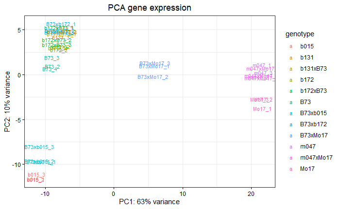

```{r setup, include=FALSE}
knitr::opts_chunk$set(eval = FALSE)
```

```{r,echo=FALSE,message=FALSE,warning=FALSE}
# Set so that long lines in R will be wrapped:
knitr::opts_chunk$set(tidy.opts = list(width.cutoff = 80), tidy = TRUE)
```

# Description

This repository contains the bioinformatic analysis of the paper Zicola et al.


# Scripts

## Convert a text list to a R vector

`list_to_rvector.sh`

```{bash, eval=FALSE}
#!/bin/bash

list_file="$1"

if [[ -z "$list_file" ]]; then
  echo "Usage: $0 list_file"
  echo "Convert a list of elements in text file to a R vector"
  exit 1
fi

n=$(wc -l < "$list_file")

printf "c("
while read -r elem; do
  printf "\"$elem\""
  n=$((n-1))
  if ((n > 0)); then
    printf ","
  fi
done < "$list_file"
printf ")\n"

```

```{bash, eval=FALSE}

cat list.txt
Zm00001eb262530
Zm00001eb262540
Zm00001eb262550
Zm00001eb262560
Zm00001eb262570
Zm00001eb262580
Zm00001eb262590
Zm00001eb262600
Zm00001eb262610
Zm00001eb262630

bash list_to_rvector.sh list.txt

c("Zm00001eb262530","Zm00001eb262540","Zm00001eb262550","Zm00001eb262560","Zm00001eb262570","Zm00001eb262580","Zm00001eb262590","Zm00001eb262600","Zm00001eb262610","Zm00001eb262630")

```

The output can be copy-pasted in R to easily create a large R vector.


# B73 and Mo17 NOR characterization

## R libaries

```{r}
# Plotting packages
library(tidyverse)
library(ggpubr)

# Source function for GO analysis (download repo https://github.com/johanzi/GOMAP_maize_B73_NAM5)
source("P:/git_repositories/GOMAP_maize_B73_NAM5/go_functions.R", chdir = T)


# Function to generate GO enrichment plots
perform_GO <- function(list_genes){

  list_ego_results <- ego_analysis(list_genes)
  
  lapply(list_ego_results, function(x) sum(x@result$p.adjust < 0.05))
  
  df_ego_analysis <- enrichResult2dataframe(list_ego_results)
  
  df_ego_analysis_significant <- df_ego_analysis %>% dplyr::filter(p.adjust < 0.05)
  
  p1 <- df_ego_analysis_significant %>% filter(ontology=="BP") %>% arrange(qvalue) %>% 
    head(10) %>% 
    mutate(Description = fct_reorder(Description, FoldEnrich)) %>%
    ggplot(aes(x=FoldEnrich, y=Description, color=-log10(qvalue))) +
    geom_point(aes(size = Count))  + xlab("Fold enrichment") + 
    ylab("GO term") + 
    ggtitle("BP GO enrichment") +
    theme_bw() +
    theme(axis.text.x = element_text(color="black"),
          axis.text.y = element_text(color="black"),
          axis.ticks = element_line(color = "black")) +
    theme(plot.title = element_text(hjust = 0.5)) +
    scale_size_area(max_size = 10) +
    scale_color_viridis()
  
  p2 <- df_ego_analysis_significant %>% filter(ontology=="MF") %>% arrange(qvalue) %>% 
    head(10) %>% 
    mutate(Description = fct_reorder(Description, FoldEnrich)) %>%
    ggplot(aes(x=FoldEnrich, y=Description, color=-log10(qvalue))) +
    geom_point(aes(size = Count))  + xlab("Fold enrichment") + 
    ylab("GO term") + 
    ggtitle("MF GO enrichment") +
    theme_bw() +
    theme(axis.text.x = element_text(color="black"),
          axis.text.y = element_text(color="black"),
          axis.ticks = element_line(color = "black")) +
    theme(plot.title = element_text(hjust = 0.5)) +
    scale_size_area(max_size = 10) +
    scale_color_viridis()
  
  p3 <- df_ego_analysis_significant %>% filter(ontology=="CC") %>% arrange(qvalue) %>% 
    head(10) %>% 
    mutate(Description = fct_reorder(Description, FoldEnrich)) %>%
    ggplot(aes(x=FoldEnrich, y=Description, color=-log10(qvalue))) +
    geom_point(aes(size = Count))  + xlab("Fold enrichment") + 
    ylab("GO term") + 
    ggtitle("CC GO enrichment") +
    theme_bw() +
    theme(axis.text.x = element_text(color="black"),
          axis.text.y = element_text(color="black"),
          axis.ticks = element_line(color = "black")) +
    theme(plot.title = element_text(hjust = 0.5)) +
    scale_size_area(max_size = 10) +
    scale_color_viridis()

    p4 <- df_ego_analysis_significant %>% arrange(qvalue) %>% 
    head(10) %>% 
    mutate(Description = fct_reorder(Description, FoldEnrich)) %>%
    ggplot(aes(x=FoldEnrich, y=Description, color=-log10(qvalue))) +
    geom_point(aes(size = Count))  + xlab("Fold enrichment") + 
    ylab("GO term") + 
    ggtitle("GO enrichment") +
    theme_bw() +
    theme(axis.text.x = element_text(color="black"),
          axis.text.y = element_text(color="black"),
          axis.ticks = element_line(color = "black")) +
    theme(plot.title = element_text(hjust = 0.5)) +
    scale_size_area(max_size = 10) +
    scale_color_viridis()
  
  return(list(p1,p2,p3,p4))
  
}

```


## rDNA subunits annotation

barrnap (v0.9) used in 2026 for annotation in plant https://www.nature.com/articles/s41597-026-07134-1#Abs1q

*NB: Note that the version v1.10.6 does not offer eukaryotic mode (euk) but only fun/arc/bac. I tried it and it misses all 28S subunits and most 5.8S subunits. Do use v0.9 instead (supports eukaryotes).*

Website: https://github.com/tseemann/barrnap

```{bash, eval=FALSE}

conda create -n barrnap_v09 -c bioconda -c conda-forge barrnap=0.9

source activate barrnap_v09

barrnap --help
Synopsis:
  barrnap 0.9 - rapid ribosomal RNA prediction
Author:
  Torsten Seemann
Usage:
  barrnap [options] chr.fa
  barrnap [options] < chr.fa
  barrnap [options] - < chr.fa
Options:
  --help            This help
  --version         Print version and exit
  --citation        Print citation for referencing barrnap
  --kingdom [X]     Kingdom: arc euk mito bac (default 'bac')


```


## B73 NAM5

B73 NAM5 assembly was described in [Hufford et al 2021](https://www.science.org/doi/full/10.1126/science.abg5289) and is based on PacBio long combbined with Illumina short-read data, and scaffolded with Bionano optical maps.

```{bash, eval=FALSE}

source activate barrnap_v09

cd /mnt/ceph-hdd/workspaces/ws/scc_uanp_scholten/u14929-nor_nil_project/rdna_annotation/B73_NAM5

# Get fasta of B73 NAM5
wget https://download.maizegdb.org/Zm-B73-REFERENCE-NAM-5.0/Zm-B73-REFERENCE-NAM-5.0.fa.gz

input_fasta="/mnt/ceph-hdd/projects/scc_uanp_scholten/data/databases/genomes/B73_NAM5/Zm-B73-REFERENCE-NAM-5.0.fa"

srun -p medium --cpus-per-task=8 --time=04:00:00 barrnap --threads 8 --kingdom euk --outseq B73_NAM5_rRNA.fa  < $input_fasta > B73_NAM5_rRNA.gff

wc -l B73_NAM5_rRNA.gff
2796 B73_NAM5_rRNA.gff

# If partial removed
grep -v "partial" B73_NAM5_rRNA.gff | wc -l
2507

# Distribution on the 10 chromosomes
cut -f1  B73_NAM5_rRNA.gff | grep "chr" | sort | uniq -c
      7 chr1
      6 chr10
    221 chr2
      2 chr3
      4 chr4
      4 chr5
    793 chr6
      4 chr7
      1 chr8
      3 chr9

# Number for each type
grep "5S" B73_NAM5_rRNA.gff | wc -l
708

grep "5.8" B73_NAM5_rRNA.gff | wc -l
780

grep "18S" B73_NAM5_rRNA.gff | wc -l
700

grep "28S" B73_NAM5_rRNA.gff | wc -l
776

# Without partial alignment
grep "5S" B73_NAM5_rRNA.gff | grep -v "partial" | wc -l
701

grep "5.8" B73_NAM5_rRNA.gff | grep -v "partial" | wc -l
751

grep "18S" B73_NAM5_rRNA.gff | grep -v "partial" | wc -l
777

grep "28S" B73_NAM5_rRNA.gff | grep -v "partial" | wc -l
1198

```


### NOR coordinates

The gff file `B73_NAM5_rRNA.gff` can be loaded on a Jbrowse running B73 NAM5 genome and the subunits can clearly be seed on chromosome 6:


Based on the location of the rDNA subunits, we can define the NOR as located  at chr6:16737500-23875000 so a size of 7,137,500 bp (7.1 Mb).

```{bash, eval=FALSE}

echo -e "chr6\t16737500\t23875000" > NOR.bed

```


```{r}
library(chromoMap)

chr <- c("chr6")
start <- c("1")
end <- c("181357234")
centromere <- c("59037500")
chromoMap_file <- data.frame(chr, as.integer(start), as.integer(end), as.integer(centromere))

NOR <- data.frame(V1=c("NOR"),
V2=c("chr6"),
V3=as.integer(16737500),
V4=as.integer(23875000),
V5=c("NOR"))

chromoMap(list(chromoMap_file), list(NOR), segment_annotation = TRUE)

```


Identify number of copies upstream and downstream of RegionA

```{bash, eval=FALSE}


# Remove features with partial alignements
grep -v "partial" B73_NAM5_rRNA.gff > B73_NAM5_rRNA.no_partial.gff

module load gcc bedtools2

echo -e "chr6\t16737500\t17943648" > NOR_upstream_regionA.bed

echo -e "chr6\t20830948\t23875000" > NOR_downstream_regionA.bed

bedtools intersect -a B73_NAM5_rRNA.no_partial.gff -b NOR_upstream_regionA.bed > B73_NAM5_rRNA_NOR_upstream_regionA.gff

bedtools intersect -a B73_NAM5_rRNA.no_partial.gff -b NOR_downstream_regionA.bed > B73_NAM5_rRNA_NOR_downstream_regionA.gff

grep "18S" B73_NAM5_rRNA_NOR_upstream_regionA.gff | wc -l
89

grep "18S" B73_NAM5_rRNA_NOR_downstream_regionA.gff | wc -l
138

```

About 89 copies upstream of RegionA and 138 full copies downstream of RegionA


### rDNA copies in scaffolds

B73 NAM5 contains 675 scaffolds, sequences that could not be assigned to any of the 10 chromosomes due to their complexity/repetitiveness. These sequences also contain annotated rDNA subunits.

```{bash, eval=FALSE}

samtools faidx Zm-B73-REFERENCE-NAM-5.0.fa

grep "scaf" Zm-B73-REFERENCE-NAM-5.0.fa.fai | wc -l
675

# Extract scaffold sequences
seqkit grep -n -r -p "scaf_*" Zm-B73-REFERENCE-NAM-5.0.fa > scaffolds.fa

seqkit stats scaffolds.fa
file          format  type  num_seqs     sum_len  min_len   avg_len  max_len
scaffolds.fa  FASTA   DNA        675  50,229,189   30,084  74,413.6  712,123

grep "scaf_" B73_NAM5_rRNA.gff  | wc -l
1750

grep "scaf_" B73_NAM5_rRNA.gff  | cut -f1 | sort | uniq | wc -l
85

# Number of scaffolds with 5S
grep "scaf_" B73_NAM5_rRNA.gff  | grep "5S" | cut -f1 | sort | uniq | wc -l
2

# Number of copies
grep "scaf_" B73_NAM5_rRNA.gff  | grep "5S" | wc -l
492

# Number of scaffolds with 18S, 5.8S, 28S
grep "scaf_" B73_NAM5_rRNA.gff  | grep "18S" | cut -f1 | sort | uniq | wc -l
81
grep "scaf_" B73_NAM5_rRNA.gff  | grep "28S" | cut -f1 | sort | uniq | wc -l
77
grep "scaf_" B73_NAM5_rRNA.gff  | grep "5.8S" | cut -f1 | sort | uniq | wc -l
44

# Number of copies
grep "scaf_" B73_NAM5_rRNA.gff  | grep "28S" | wc -l
469

grep "scaf_" B73_NAM5_rRNA.gff  | grep "18S" | wc -l
423

grep "scaf_" B73_NAM5_rRNA.gff  | grep "5.8S" | wc -l
366
```

85/675 scaffolds contain annotated rDNA subunits. Only two contigs contain 5S repeats while others contain either 5.8S, 28S, or 18S subunits.

Scaffolds with higher number of 45S repeats

```{bash, eval=FALSE}
grep "scaf_" B73_NAM5_rRNA.gff  | grep "18S"  | cut -f1 | sort | uniq -c | sort | tail -n 10
     10 scaf_174
     10 scaf_181
     11 scaf_114
     11 scaf_126
     11 scaf_139
     12 scaf_107
     13 scaf_88
     14 scaf_77
     14 scaf_82
     18 scaf_48

```


If I remove scaffolds containing only partial alignments:

```{bash, eval=FALSE}

grep "scaf_" B73_NAM5_rRNA.gff  | grep "18S"  | grep -v "partial" | cut -f1 | sort | uniq -c  | wc -l
44

grep "scaf_" B73_NAM5_rRNA.gff  | grep "28S"  | grep -v "partial" | cut -f1 | sort | uniq -c  | wc -l
44

grep "scaf_" B73_NAM5_rRNA.gff  | grep "5.8S"  | grep -v "partial" | cut -f1 | sort | uniq -c  | wc -l
44

```

I have 44 scaffolds that seem to contain complete subunit sequences. Assess the size of the contigs containing annotated 45S subunits to define how much of the NOR may be missing on B73 NAM5 chromosome 6

```{bash, eval=FALSE}

grep "scaf_" B73_NAM5_rRNA.gff  | grep "28S" | grep -v "partial" | cut -f1 | sort | uniq > id_scaffold_28S.txt

seqkit grep -n -f /mnt/ceph-hdd/workspaces/ws/scc_uanp_scholten/u14929-nor_nil_project/rdna_annotation/B73_NAM5/id_scaffold_28S.txt scaffolds.fa > scaffolds_28S.fa

seqkit stats scaffolds_28S.fa
file              format  type  num_seqs    sum_len  min_len   avg_len  max_len
scaffolds_28S.fa  FASTA   DNA         44  3,314,854   31,211  75,337.6  159,682

```

The 44 scaffolds containing annotated 28S represent 3.3 Mb while the annotated NOR (including RegionA) is about 7,9 Mb.


### A/T polymorphisms

Check how many copies of each types in NOR and scaffolds

>A allele
CTTGAAAATCCGGAGGACCGAATA
> T allele
CTTGAAAATCCGGAGGACCGAATT


#### NOR

```{bash, eval=FALSE}

module load gcc bedtools2 bowtie

cd /mnt/ceph-hdd/projects/scc_uanp_scholten/data/databases/genomes/B73_NAM5/

mkdir NOR

cd NOR

echo -e "chr6\t16737500\t23875000" > NOR.bed

bedtools getfasta -fi ../Zm-B73-REFERENCE-NAM-5.0.fa -bed NOR.bed > NOR.fa

srun -p medium --cpus-per-task=8 --mem=8G --time=01:00:00 bowtie-build \
  -f NOR.fa NOR_B73_NAM5 &


bowtie -x NOR_B73_NAM5 -a -v 0 -c CTTGAAAATCCGGAGGACCGAATA > /dev/null
# reads processed: 1
# reads with at least one alignment: 1 (100.00%)
# reads that failed to align: 0 (0.00%)
Reported 184 alignments


# Map the reads without any mismatch allowed
bowtie -x NOR_B73_NAM5 -a -v 0 -c CTTGAAAATCCGGAGGACCGAATT > /dev/null
# reads processed: 1
# reads with at least one alignment: 1 (100.00%)
# reads that failed to align: 0 (0.00%)
Reported 42 alignments


```

Within the NOR, 42 18S subunits have  184 (81%) have the A allele and 42 (19%) have the T alleles .


#### Scaffolds

```{bash, eval=FALSE}

cd /mnt/ceph-hdd/projects/scc_uanp_scholten/data/databases/genomes/B73_NAM5/scaffolds

module load gcc bowtie samtools

srun -p medium --cpus-per-task=4 --mem=16G --time=02:00:00 bowtie-build \
  -f scaffolds_28S.fa scaffolds_28S_B73_NAM5 &

# Map the reads without any mismatch allowed

bowtie -x scaffolds_28S_B73_NAM5 -a -v 0 -c CTTGAAAATCCGGAGGACCGAATA > /dev/null
# reads processed: 1
# reads with at least one alignment: 1 (100.00%)
# reads that failed to align: 0 (0.00%)
Reported 71 alignments

bowtie -x scaffolds_28S_B73_NAM5 -a -v 0 -c CTTGAAAATCCGGAGGACCGAATT > /dev/null
# reads processed: 1
# reads with at least one alignment: 1 (100.00%)
# reads that failed to align: 0 (0.00%)
Reported 288 alignments


```

288 copies with A allele (20%) and 71 with T allele (80%).


Concatenate all fasta and re-annotate for visualization

```{bash, eval=FALSE}
# Concatenate all sequences into one
grep -v "^>" scaffolds_28S.fa | tr --delete '\n' | fold > scaffolds_28S_concat.fa

# Add fasta header
sed -i '1 i\>scaffolds_28S' scaffolds_28S_concat.fa

seqkit stats scaffolds_28S_concat.fa

seqkit stats scaffolds_28S_concat.fa
file                     format  type  num_seqs    sum_len    min_len    avg_len    max_len
scaffolds_28S_concat.fa  FASTA   DNA          1  3,314,854  3,314,854  3,314,854  3,314,854

source activate barrnap_v09

srun -p medium --cpus-per-task=4 --time=01:00:00 barrnap --threads 4 --kingdom euk --outseq scaffolds_28S_concat_rRNA.fa  < scaffolds_28S_concat.fa > scaffolds_28S_concat_rRNA.gff &

```

## B73 near-T2T (Koren et al 2024)

Near telomere-to-telomere (T2T) assembly of B73 was published in [Koren et al 2024](http://genome.cshlp.org/content/34/11/1919). This assembly is based ONT Duplex data.

```{bash, eval=FALSE}

# Download assembly
https://obj.umiacs.umd.edu/marbl_publications/duplex/Zea_mays_B73/asm.fasta

mv asm.fasta B73_T2T.fa 

samtools faidx B73_T2T.fa

cut -f1,2 B73_T2T.fa.fai
chr1    309607410
chr10   152523392
chr2    244512530
chr5    229358312
chr6    196398069
chr6_un1        1568390
chr6_un2        192809
chr6_un3        254180
chr6_un4        113172
chr7    209623059
chr8    204097842
chr9    169207087
chrChrloroplast 141779
chrMitochondia  569628
chrrDNA 8794
chr4    250373149
chr3_v2 238043907

```

The chr6 is split into 5 files, suggesting the NOR could not be assembled in a single contig.

```{bash, eval=FALSE}

# Annotate rDNA
source activate barrnap_v09

srun -p scc-cpu --cpus-per-task=8 --time=04:00:00 barrnap --threads 8 --kingdom euk --outseq B73_T2T_rRNA.fa  < B73_T2T.fa > B73_T2T_rRNA.gff

# Remove partially mapping rRNA units
grep -v "partial" B73_T2T_rRNA.gff > B73_T2T_rRNA.complete.gf

grep "chr6" B73_T2T_rRNA.complete.gff | grep "28S" | wc -l
451


grep "chr6" B73_T2T_rRNA.complete.gff | grep "28S" | cut -f1 | sort | uniq -c
    209 chr6
    178 chr6_un1
     22 chr6_un2
     29 chr6_un3
     13 chr6_un4

grep "28S" B73_T2T_rRNA.complete.gff | cut -f1 | sort | uniq -c
      1 chr10
    209 chr6
    178 chr6_un1
     22 chr6_un2
     29 chr6_un3
     13 chr6_un4
      1 chrrDNA


grep "18S" B73_T2T_rRNA.complete.gff | cut -f1 | sort | uniq -c
      1 chr10
    206 chr6
    178 chr6_un1
     21 chr6_un2
     28 chr6_un3
     13 chr6_un4
      1 chrrDNA
      
grep "5.8S" B73_T2T_rRNA.complete.gff | cut -f1 | sort | uniq -c
      1 chr10
    221 chr6
    178 chr6_un1
     22 chr6_un2
     29 chr6_un3
     13 chr6_un4
      1 chrrDNA


# Size of the chr6 scaffolds (chr6_un)

```

The T2T B73 assembly has 451 28S subunits, with 209 annotated on chr6 and the 242 others split into 4 chr6 contigs (chr6_un[1-4]). One subunit is annotated on chr10.

### NOR coordinates

Based on JBrowse visualization of B73_T2T_rRNA.gff on chr6, the NOR is located at chr6:30750000-37600000 (6.85 Mb) and RegionA is located at chr6:31600000-34720000 (3.12 Mb).

```{bash, eval=FALSE}

echo -e "chr6\t30750000\t37600000" > NOR_B73_T2T.bed

echo -e "chr6\t31600000\t34720000" > RegionA_B73_T2T.bed

```


```{r}
library(chromoMap)

chr <- c("chr6")
start <- c("1")
end <- c("196398069")
chromoMap_file <- data.frame(chr, as.integer(start), as.integer(end))

NOR <- data.frame(V1=c("NOR"),
V2=c("chr6"),
V3=as.integer(30750000),
V4=as.integer(37600000),
V5=c("NOR"))

chromoMap(list(chromoMap_file), list(NOR), segment_annotation = TRUE)

```


### A/T polymorphisms

Check how many copies of each types in NOR and scaffolds

>A allele
CTTGAAAATCCGGAGGACCGAATA
> T allele
CTTGAAAATCCGGAGGACCGAATT

Check A/T polymorphism

```{bash, eval=FALSE}

# Get chr6 and chr6_un contigs
grep "chr6" B73_T2T_rRNA.complete.gff | grep "28S" | cut -f1 | sort | uniq > name_chr6.txt

seqkit grep -r -n -f name_chr6.txt B73_T2T.fa > B73_T2T_chr6.fa

srun -p scc-cpu --cpus-per-task=8 --mem=8G --time=01:00:00 bowtie-build \
  -f B73_T2T_chr6.fa B73_T2T_chr6 &

## Allele A
# Only chr6
bowtie -x B73_T2T_chr6 -a -v 0 -c CTTGAAAATCCGGAGGACCGAATA | grep -w "chr6" | wc -l
198

# Only chr6_un[1-4]
bowtie -x B73_T2T_chr6 -a -v 0 -c CTTGAAAATCCGGAGGACCGAATA | grep "chr6_un" | wc -l
220

## Allele T
# Only chr6
bowtie -x B73_T2T_chr6 -a -v 0 -c CTTGAAAATCCGGAGGACCGAATT | grep -w "chr6" | wc -l
3

# Only chr6_un[1-4]
bowtie -x B73_T2T_chr6 -a -v 0 -c CTTGAAAATCCGGAGGACCGAATT | grep "chr6_un" | wc -l
21

# Using whole genome
srun -p scc-cpu --cpus-per-task=8 --mem=8G --time=02:00:00 bowtie-build   -f B73_T2T.fa B73_T2T &

bowtie -x B73_T2T -a -v 0 -c CTTGAAAATCCGGAGGACCGAATA > /dev/null
# reads processed: 1
# reads with at least one alignment: 1 (100.00%)
# reads that failed to align: 0 (0.00%)
Reported 419 alignments

bowtie -x B73_T2T -a -v 0 -c CTTGAAAATCCGGAGGACCGAATT > /dev/null
# reads processed: 1
# reads with at least one alignment: 1 (100.00%)
# reads that failed to align: 0 (0.00%)
Reported 25 alignments


```

For this B73 assembly, we get 418 28S copies with the A allele (95%) and 24 copies with the T allele (5%), which is largely different from the B73 NAM5 assembly (about 50-50).

It is very suspicious that so few copies with the T alleles were found while SNP calling on WGS data seem to indicate a ratio of about 70% A and 30% T ([Liu et al 2017](https://www.nature.com/articles/srep42444)). I don't trust the NOR of this B73 T2T assembly.


## Mo17 CAU rDNA annotation

A telomere-to-telomere assembly of Mo17 was released in 2023 with the paper [Chen et al., 2023](https://www.nature.com/articles/s41588-023-01419-6). This assembly is named Zm-Mo17-REFERENCE-CAU-2.0.


```{bash, eval=FALSE}
# Download Mo17 CAU 2 assembly
wget https://download.maizegdb.org/Zm-Mo17-REFERENCE-CAU-2.0/Zm-Mo17-REFERENCE-CAU-2.0.fa.gz

gunzip Zm-Mo17-REFERENCE-CAU-2.0.fa.gz

source activate barrnap_v09

srun -p medium --cpus-per-task=8 --time=04:00:00 barrnap --threads 8 --kingdom euk --outseq Mo17_CAU_2_rRNA.fa  < Zm-Mo17-REFERENCE-CAU-2.0.fa > Mo17_CAU_2_rRNA.gff


wc -l Mo17_CAU_2_rRNA.gff
10400 Mo17_CAU_2_rRNA.gff

# If partial removed
grep -v "partial" Mo17_CAU_2_rRNA.gff | wc -l
10328

# Distribution on the 10 chromosomes
cut -f1  Mo17_CAU_2_rRNA.gff | grep "chr" | sort | uniq -c
      5 chr1
      7 chr10
   1381 chr2
      1 chr3
      3 chr4
      1 chr5
   9000 chr6
      1 chr8

# Number for each type
grep "5S" Mo17_CAU_2_rRNA.gff | wc -l
1379

grep "5.8" Mo17_CAU_2_rRNA.gff | wc -l
3619

grep "18S" Mo17_CAU_2_rRNA.gff | wc -l
3015

grep "28S" Mo17_CAU_2_rRNA.gff | wc -l
3021


# Without partial alignment
grep "5S" Mo17_CAU_2_rRNA.gff | grep -v "partial" | wc -l
1370

grep "5.8S" Mo17_CAU_2_rRNA.gff | grep -v "partial" | wc -l
2983

grep "18S" Mo17_CAU_2_rRNA.gff | grep -v "partial" | wc -l
2993

grep "28S" Mo17_CAU_2_rRNA.gff | grep -v "partial" | wc -l
2981

```

Mo17 CAU 2 has about 3000 45S copies while B73 NAM5 800, so a fold-change of about 4 between the two genotypes.

### NOR coordinates

The gff file `Mo17_CAU_2_rRNA.gff` can be loaded on a Jbrowse running Mo17 CAU genome and the subunits can clearly be seed on chromosome 6:

Coordinates: chr6:17925000-44750000 (26,8 Mb)

```{bash, eval=FALSE}
echo -e "chr6\t17925000\t44750000" > NOR_Mo17.bed

```

We can see 3 clusters of different positions

```{bash, eval=FALSE}

# Size 8900056
echo -e "chr6\t17925000\t26825056\tcluster1\t.\t-" > NOR_Mo17_cluster1.bed

# Size 3420719
echo -e "chr6\t26825056\t30245775\tcluster2\t.\t+" > NOR_Mo17_cluster2.bed

# 14504225
echo -e "chr6\t30245775\t44750000\tcluster3\t.\t-" > NOR_Mo17_cluster3.bed

cat NOR_Mo17_cluster* > NOR_Mo17_clusters.bed
```


```{r}
library(chromoMap)

chr <- c("chr6")
start <- c("1")
end <- c("201729004")
centromere <- c("80000000")
chromoMap_file <- data.frame(chr, as.integer(start), as.integer(end), as.integer(centromere))

NOR <- data.frame(V1=c("NOR"),
V2=c("chr6"),
V3=as.integer(17925000),
V4=as.integer(44750000),
V5=c("NOR"))

chromoMap(list(chromoMap_file), list(NOR), segment_annotation = TRUE)

```


### A/T polymorphisms

Check how many copies of each types in NOR and scaffolds

>A allele
CTTGAAAATCCGGAGGACCGAATA
> T allele
CTTGAAAATCCGGAGGACCGAATT


```{bash, eval=FALSE}

module load gcc bowtie

srun -p scc-cpu --cpus-per-task=8 --mem=8G --time=02:00:00 bowtie-build \
  -f Zm-Mo17-REFERENCE-CAU-2.0.fa Mo17_CAU_2 &

bowtie -x Mo17_CAU_2 -a -v 0 -c CTTGAAAATCCGGAGGACCGAATA > /dev/null
# reads processed: 1
# reads with at least one alignment: 1 (100.00%)
# reads that failed to align: 0 (0.00%)
Reported 2914 alignments

bowtie -x Mo17_CAU_2 -a -v 0 -c CTTGAAAATCCGGAGGACCGAATA | grep "chr6"    bucket 4: 60%
| wc -l
# reads processed: 1
# reads with at least one alignment: 1 (100.00%)
# reads that failed to align: 0 (0.00%)
Reported 2914 alignments
2913


bowtie -x Mo17_CAU_2 -a -v 0 -c CTTGAAAATCCGGAGGACCGAATT > /dev/null
# reads processed: 1
# reads with at least one alignment: 0 (0.00%)
# reads that failed to align: 1 (100.00%)
No alignments

```


## WGS B73 data for A/T call

```{bash, eval=FALSE}

srun -p ssc-cpu --time=00:20:00 seqkit pair --interleaved -1 R1.fastq -2 R2.fastq SRR447986.fastq

```


## Genes in the NOR B73 NAM5

```{bash, eval=FALSE}

module load gcc bedtools2 bedops

# Download gene annotation B73 NAM5
wget https://download.maizegdb.org/Zm-B73-REFERENCE-NAM-5.0/Zm-B73-REFERENCE-NAM-5.0_Zm00001eb.1.gff3

# Keep only genes
awk '$3=="gene"' Zm-B73-REFERENCE-NAM-5.0_Zm00001eb.1.gff3 > Zm-B73-REFERENCE-NAM-5.0_Zm00001eb.1.genes.gff3

echo -e "chr6\t16737500\t23875000" > NOR.bed

bedtools intersect -a Zm-B73-REFERENCE-NAM-5.0_Zm00001eb.1.genes.gff3 -b NOR.bed > NOR.gene.gff3

wc -l NOR.gene.gff3
180 NOR.gene.gff3

# Get gene ID
cut -f9 NOR.gene.gff3 | cut -d";" -f1 | cut -d"=" -f2 | sort | uniq > NOR.gene.id

# Create a R vector
bash list_to_rvector.sh NOR.gene.id
```

```{r}

list_genes_NOR <- c("Zm00001eb261960", "Zm00001eb261970", "Zm00001eb261980", "Zm00001eb261990", "Zm00001eb262000", "Zm00001eb262010", "Zm00001eb262020", "Zm00001eb262030", "Zm00001eb262040", "Zm00001eb262050", "Zm00001eb262060", "Zm00001eb262070", "Zm00001eb262080", "Zm00001eb262090", "Zm00001eb262100", "Zm00001eb262120", "Zm00001eb262130", "Zm00001eb262140", "Zm00001eb262150", "Zm00001eb262160", "Zm00001eb262170", "Zm00001eb262180", "Zm00001eb262190", "Zm00001eb262200", "Zm00001eb262210", "Zm00001eb262220", "Zm00001eb262230", "Zm00001eb262240", "Zm00001eb262250", "Zm00001eb262260", "Zm00001eb262270", "Zm00001eb262280", "Zm00001eb262290", "Zm00001eb262300", "Zm00001eb262310", "Zm00001eb262320", "Zm00001eb262330", "Zm00001eb262340", "Zm00001eb262350", "Zm00001eb262360", "Zm00001eb262370", "Zm00001eb262380", "Zm00001eb262390", "Zm00001eb262400", "Zm00001eb262410", "Zm00001eb262430", "Zm00001eb262440", "Zm00001eb262450", "Zm00001eb262460", "Zm00001eb262520", "Zm00001eb262530", "Zm00001eb262540", "Zm00001eb262550", "Zm00001eb262560", "Zm00001eb262570", "Zm00001eb262580", "Zm00001eb262590", "Zm00001eb262600", "Zm00001eb262610", "Zm00001eb262630", "Zm00001eb262640", "Zm00001eb262650", "Zm00001eb262660", "Zm00001eb262670", "Zm00001eb262680", "Zm00001eb262690", "Zm00001eb262700", "Zm00001eb262710", "Zm00001eb262720", "Zm00001eb262730", "Zm00001eb262740", "Zm00001eb262750", "Zm00001eb262760", "Zm00001eb262770", "Zm00001eb262780", "Zm00001eb262790", "Zm00001eb262800", "Zm00001eb262810", "Zm00001eb262820", "Zm00001eb262840", "Zm00001eb262850", "Zm00001eb262860", "Zm00001eb262880", "Zm00001eb262890", "Zm00001eb262900", "Zm00001eb262910", "Zm00001eb262920", "Zm00001eb262930", "Zm00001eb262950", "Zm00001eb262970", "Zm00001eb262990", "Zm00001eb263000", "Zm00001eb263010", "Zm00001eb263020", "Zm00001eb263030", "Zm00001eb263040", "Zm00001eb263050", "Zm00001eb263060", "Zm00001eb263070", "Zm00001eb263090", "Zm00001eb263100", "Zm00001eb263120", "Zm00001eb263140", "Zm00001eb263150", "Zm00001eb263160", "Zm00001eb263180", "Zm00001eb263190", "Zm00001eb263200", "Zm00001eb263210", "Zm00001eb263220", "Zm00001eb263240", "Zm00001eb263250", "Zm00001eb263270", "Zm00001eb263280", "Zm00001eb263290", "Zm00001eb263300", "Zm00001eb263310", "Zm00001eb263320", "Zm00001eb263340", "Zm00001eb263350", "Zm00001eb263360", "Zm00001eb263370", "Zm00001eb263380", "Zm00001eb263390", "Zm00001eb263410", "Zm00001eb263420", "Zm00001eb263430", "Zm00001eb263440", "Zm00001eb263450", "Zm00001eb263460", "Zm00001eb263470", "Zm00001eb263480", "Zm00001eb263490", "Zm00001eb263500", "Zm00001eb263510", "Zm00001eb263520", "Zm00001eb263530", "Zm00001eb263540", "Zm00001eb263550", "Zm00001eb263570", "Zm00001eb263580", "Zm00001eb263590", "Zm00001eb263610", "Zm00001eb263620", "Zm00001eb263630", "Zm00001eb263640", "Zm00001eb263650", "Zm00001eb263660", "Zm00001eb263670", "Zm00001eb263680", "Zm00001eb263690", "Zm00001eb263700", "Zm00001eb263710", "Zm00001eb263720", "Zm00001eb263730", "Zm00001eb263740", "Zm00001eb263750", "Zm00001eb263760", "Zm00001eb263780", "Zm00001eb263790", "Zm00001eb263800", "Zm00001eb263830", "Zm00001eb263860", "Zm00001eb263880", "Zm00001eb263890", "Zm00001eb263900", "Zm00001eb263910", "Zm00001eb263920", "Zm00001eb263930", "Zm00001eb263940", "Zm00001eb263960", "Zm00001eb263970", "Zm00001eb263980", "Zm00001eb264000", "Zm00001eb264010", "Zm00001eb264020", "Zm00001eb264030", "Zm00001eb264040", "Zm00001eb264050", "Zm00001eb264060")

saveRDS(list_genes_NOR, "data/annotations/list_genes_NOR.Rds")

```


## RegionA analysis

The RegionA was described by [Huang et al 2021](https://doi.org/10.1186/s13059-021-02448-2) as a 2.9 Mb presence/absence variation (PAV) that is found in B73 but not in Mo17. RegionA can be used for genotyping our NIL material to ensure that the NOR introgression is present.

By visualizing rDNA copies on JBrowse based on barrnap annotation of B73 NAM5 assembly, one can see a gap round chr6:17943647..20830948 with no rDNA subunits annotated.

```{bash, eval=FALSE}

# NOR coordinates
echo -e "chr6\t16737500\t23875000" > NOR.bed

# regionA coordinates
echo -e "chr6\t17943647\t20830948" > regionA.bed

# Coordinates of a gene present in regionA and used for PCR NOR genotyping
echo -e "chr6\t20726343\t20735703" > Zm00001eb263160.bed

```

Load these three bed files on JBrowse (B73 NAM5 annotation) and the barrnap rDNA annotation gff file `B73_NAM5_rRNA.gff`:


### Genes present in RegionA

We can retrieve the genes present in RegionA:

```{bash, eval=FALSE}

module load gcc bedtools2 bedops

cd /mnt/ceph-hdd/projects/scc_uanp_scholten/data/databases/genomes/B73_NAM5

# Download gene annotation B73 NAM5
wget https://download.maizegdb.org/Zm-B73-REFERENCE-NAM-5.0/Zm-B73-REFERENCE-NAM-5.0_Zm00001eb.1.gff3

# Keep only genes
awk '$3=="gene"' Zm-B73-REFERENCE-NAM-5.0_Zm00001eb.1.gff3 > Zm-B73-REFERENCE-NAM-5.0_Zm00001eb.1.genes.gff3

# regionA coordinates
echo -e "chr6\t17943647\t20830948" > regionA.bed

bedtools intersect -a Zm-B73-REFERENCE-NAM-5.0_Zm00001eb.1.genes.gff3 -b regionA.bed > regionA.gene.gff3

wc -l regionA.gene.gff3
56 regionA.gene.gff3

# Get gene ID
cut -f9 regionA.gene.gff3 | cut -d";" -f1 | cut -d"=" -f2 | sort | uniq > regionA.gene.id

# Create a R vector
bash list_to_rvector.sh regionA.gene.id
```


```{r}
# Put in R vector
list_genes_regionA <- c("Zm00001eb262530", "Zm00001eb262540", "Zm00001eb262550", "Zm00001eb262560", "Zm00001eb262570", "Zm00001eb262580", "Zm00001eb262590", "Zm00001eb262600", "Zm00001eb262610", "Zm00001eb262630", "Zm00001eb262640", "Zm00001eb262650", "Zm00001eb262660", "Zm00001eb262670", "Zm00001eb262680", "Zm00001eb262690", "Zm00001eb262700", "Zm00001eb262710", "Zm00001eb262720", "Zm00001eb262730", "Zm00001eb262740", "Zm00001eb262750", "Zm00001eb262760", "Zm00001eb262770", "Zm00001eb262780", "Zm00001eb262790", "Zm00001eb262800", "Zm00001eb262810", "Zm00001eb262820", "Zm00001eb262840", "Zm00001eb262850", "Zm00001eb262860", "Zm00001eb262880", "Zm00001eb262890", "Zm00001eb262900", "Zm00001eb262910", "Zm00001eb262920", "Zm00001eb262930", "Zm00001eb262950", "Zm00001eb262970", "Zm00001eb262990", "Zm00001eb263000", "Zm00001eb263010", "Zm00001eb263020", "Zm00001eb263030", "Zm00001eb263040", "Zm00001eb263050", "Zm00001eb263060", "Zm00001eb263070", "Zm00001eb263090", "Zm00001eb263100", "Zm00001eb263120", "Zm00001eb263140", "Zm00001eb263150", "Zm00001eb263160", "Zm00001eb263180")

saveRDS(list_genes_regionA, "data/annotations/list_genes_regionA.Rds")

```


### Genes in NOR genes without not in RegionA genes

I have 56 genes in RegionA and 182 in the NOR so I should theoretically have 182-56=126 genes that are in the NOR but not RegionA


```{r}
list_genes_regionA <- readRDS("data/annotations/list_genes_regionA.Rds")

list_genes_NOR <- readRDS("data/annotations/list_genes_NOR.Rds")

list_genes_NOR_wo_RegionA <- setdiff(list_genes_NOR, list_genes_regionA)

saveRDS(list_genes_NOR_wo_RegionA, "data/annotations/list_genes_NOR_wo_RegionA.Rds")
```


## GO analysis NOR genes and RegionA

### NOR genes

```{r}

list_genes_NOR <- readRDS("data/annotations/list_genes_NOR.Rds")

lp <- perform_GO(list_genes_NOR)

lp[[4]]

```


### RegionA genes

```{r}

list_genes_regionA <- readRDS("data/annotations/list_genes_regionA.Rds")

lp <- perform_GO(list_genes_regionA)

lp[[4]]

```


### NOR genes w/o RegionA genes

```{r}

list_genes_NOR_wo_RegionA <- readRDS("data/annotations/list_genes_NOR_wo_RegionA.Rds")

lp <- perform_GO(list_genes_NOR_wo_RegionA)

lp[[4]]

```


# #######################


# Phenotypic analysis growth chamber

Plants were grown in controlled growth chambers 


## R libraries

```{r}

# Plotting packages
library(tidyverse)
library(ggpubr)

# Statistics for agronomy (https://cran.r-project.org/web/packages/agricolae/agricolae.pdf)
library(agricolae)
library(multcomp)
library(multcompView)
library(emmeans)

# Plot variable correlation
library(corrplot)

# linear mixed-effects model 
library(lme4)

library(remedy)
library(styler)

```


```{r}

df <- read.delim("data/phenotyping/data_phenotyping_growth_chamber.txt", stringsAsFactors = T, dec = ",")

# Transform data in long format
long_df <- df %>% gather(DAS, height, DAS4:DAS22)

# Turn DAS into factor
long_df$DAS <- as.factor(long_df$DAS)

# Order DAS
long_df$DAS <- factor(long_df$DAS, levels = c("DAS4", "DAS7", "DAS10", "DAS13", "DAS16", "DAS19", "DAS22"), ordered = T)

long_df$line <- factor(long_df$line, levels = c("B73", "Mo17", "b015", "b131", "b172", "m047", "B73xMo17", "B73xb015", "b131xB73", "B73xb172", "b172xB73", "m047xMo17"), ordered = T)

# Order groups
long_df$group <- factor(long_df$group, levels = c("B73", "Mo17", "B73xMo17", "B73_NIL", "B73_NIL_cross", "Mo17_NIL", "Mo17_NIL_cross"), ordered = T)

# Order categories
long_df$category <- factor(long_df$category, levels = c("B73", "Mo17", "B73xMo17", "b015", "b131", "b172", "m047"), ordered = T)

long_df$NOR <- factor(long_df$NOR, levels = c("homozygous", "heterozygous"))

long_df$height <- as.numeric(long_df$height)

saveRDS(long_df, "data/phenotyping/data_phenotyping_growth_chamber.Rds")

```

## Summary 13 DAS

```{r}
df <- readRDS("data/phenotyping/data_phenotyping_growth_chamber.Rds")

df_DAS13 <- df %>% filter(DAS=="DAS13")

MPV <- (mean(df_DAS13[df_DAS13$line=="B73", ]$height) + mean(df_DAS13[df_DAS13$line=="Mo17", ]$height))/2

col <- c("#d95f02", "#1b9e77")

ggboxplot(df_DAS13,
  x = "line", y = "height", color = "NOR",
  ylab = "Plant height (cm)", xlab = "Genotype", add = "dotplot",
  palette = col, add.params = list(size = 0.8, alpha = 0.2), outlier.shape = NA
) + theme_bw() +
  theme(axis.text.x = element_text(angle = 45, hjust = 1)) +
  ggtitle("Plant height at 13 DAS") + theme(plot.title = element_text(hjust = 0.5)) +
  geom_hline(yintercept = MPV, linetype = "dashed", color = "black") + expand_limits(y = 0) +  theme(axis.text.x = element_text(color="black"), 
      axis.text.y = element_text(color="black"),
      axis.ticks = element_line(color = "black")) + 
      theme(plot.title = element_text(hjust = 0.5)) + 
      scale_y_continuous(labels = scales::comma_format())

```


### By experiment

```{r}

df <- readRDS("data/phenotyping/data_phenotyping_growth_chamber.Rds")

df_DAS13 <- df %>% filter(DAS=="DAS13")

col <- c("#1b9e77", "#d95f02", "#7570b3")

MPV <- (mean(df_DAS13[df_DAS13$line=="B73", ]$height) + mean(df_DAS13[df_DAS13$line=="Mo17", ]$height))/2

ggboxplot(df_DAS13, "line", "height",
  color = "experiment", add = "dotplot",
  xlab = "genotype", ylab = "Plant height in cm", title = "Plant height 13 days after sowing across the 3 experiments",
  palette = col,
  add.params = list(size = 0.7, alpha = 0.2), outlier.shape = NA
) + theme_bw() +
  rotate_x_text(45) + expand_limits(y = 0) + theme(
    axis.text.x = element_text(color = "black"),
    axis.text.y = element_text(color = "black"),
    axis.ticks = element_line(color = "black")
  ) + geom_hline(yintercept = MPV, linetype = "dashed", color = "black") +
  theme(plot.title = element_text(hjust = 0.5)) +
  scale_y_continuous(labels = scales::comma_format())
```


### Comparison heterozygous and homozygous NORs - 13DAS

### B73xMo17

```{r}

df_sub <- df_DAS13 %>% filter(category %in% c("Mo17", "B73","B73xMo17"))

# Uses the mixed model to adjust for confounding factors experiment
model <- lmer(height ~ NOR +
                (1 | experiment),
              data = df_sub)

# Compares genotype means on an equal footing
emm  <- emmeans(model, ~ NOR)

 # P-value
pairs(emm)

#plot(emm)

```

```
 contrast                  estimate   SE df t.ratio p.value
 homozygous - heterozygous    -10.5 1.03 86 -10.256 <0.0001

Degrees-of-freedom method: kenward-roger 
```

### B73xb015

```{r}

df_sub <- df_DAS13 %>% filter(category %in% c("b015", "B73","B73xb015"))

# Uses the mixed model to adjust for confounding factors (year, block)
model <- lmer(height ~ NOR +
                (1 | experiment),
              data = df_sub)

# Compares genotype means on an equal footing
# Uses appropriate standard errors that reflect your field design
emm  <- emmeans(model, ~ NOR)

 # P-value
pairs(emm)

#plot(emm)

```

```
contrast                  estimate   SE df t.ratio p.value
 homozygous - heterozygous     -4.2 1.19 86  -3.533  0.0007

Degrees-of-freedom method: kenward-roger 
```


### b131xB73

```{r}

df_sub <- df_DAS13 %>% filter(category %in% c("b131", "B73","b131xB73"))

# Uses the mixed model to adjust for confounding factors (year, block)
model <- lmer(height ~ NOR +
                (1 | experiment),
              data = df_sub)

# Compares genotype means on an equal footing
# Uses appropriate standard errors that reflect your field design
emm  <- emmeans(model, ~ NOR)

 # P-value
pairs(emm)

#plot(emm)

```

```
 contrast                  estimate    SE df t.ratio p.value
 homozygous - heterozygous    -5.93 0.958 86  -6.192 <0.0001

Degrees-of-freedom method: kenward-roger 
```

### b172xB73

```{r}

df_sub <- df_DAS13 %>% filter(category %in% c("b172", "B73","b172xB73"))

# Uses the mixed model to adjust for confounding factors (year, block)
model <- lmer(height ~ NOR +
                (1 | experiment),
              data = df_sub)

# Compares genotype means on an equal footing
# Uses appropriate standard errors that reflect your field design
emm  <- emmeans(model, ~ NOR)

 # P-value
pairs(emm)

#plot(emm)

```

```
 contrast                  estimate    SE  df t.ratio p.value
 homozygous - heterozygous    -3.92 0.678 116  -5.780 <0.0001

Degrees-of-freedom method: kenward-roger 
```


### B73xb172

```{r}

df_sub <- df_DAS13 %>% filter(category %in% c("b172", "B73","B73xb172"))

# Uses the mixed model to adjust for confounding factors (year, block)
model <- lmer(height ~ NOR +
                (1 | experiment),
              data = df_sub)

# Compares genotype means on an equal footing
# Uses appropriate standard errors that reflect your field design
emm  <- emmeans(model, ~ NOR)

 # P-value
pairs(emm)

#plot(emm)

```

```
 contrast                  estimate    SE  df t.ratio p.value
 homozygous - heterozygous    -3.92 0.678 116  -5.780 <0.0001

Degrees-of-freedom method: kenward-roger 
```

### m047xMo17

```{r}

df_sub <- df_DAS13 %>% filter(category %in% c("m047", "Mo17","m047xMo17"))

# Uses the mixed model to adjust for confounding factors (year, block)
model <- lmer(height ~ NOR +
                (1 | experiment),
              data = df_sub)

# Compares genotype means on an equal footing
# Uses appropriate standard errors that reflect your field design
emm  <- emmeans(model, ~ NOR)

 # P-value
pairs(emm)

#plot(emm)

```

```
 contrast                  estimate   SE   df t.ratio p.value
 homozygous - heterozygous    -10.1 1.21 72.5  -8.322 <0.0001

Degrees-of-freedom method: kenward-roger 
```

## Summary Heterosis

```{r}

df_DAS13 <- df %>% filter(DAS=="DAS13")

# Function to calculate MPV
calculate_heterosis <- function(P1, P2, F1, phenotype, df){
  index_phenotype <-  which(grepl(phenotype, colnames(df)))
  MPV = ((mean(unlist(df[df$line==P1,][index_phenotype]))+mean(unlist(df[df$line==P2,][index_phenotype])))/2)
  F1 = mean(unlist(df[df$line==F1,][index_phenotype]))
  return((F1-MPV)/MPV)
}

# Create empty dataframe
df_MPH = data.frame(matrix(vector(), 6, 2,
                       dimnames=list(c(), c("hybrid","MPH_height")))
)

df_MPH$hybrid <- c("B73xMo17",
                                                "B73xb015",
                                                "b131xB73",
                                                "B73xb172",
                                                "b172xB73",
                                                "m047xMo17")

df_MPH$hybrid <- factor(df_MPH$hybrid, levels=c("B73xMo17",
                                                "B73xb015",
                                                "b131xB73",
                                                "B73xb172",
                                                "b172xB73",
                                                "m047xMo17"), ordered=T)

# Calculate MPV for each hybrid
MPH_height <- list()
MPH_height[1] <- calculate_heterosis("B73", "Mo17", "B73xMo17", "height", df_DAS13)
MPH_height[2] <- calculate_heterosis("B73", "b015", "B73xb015", "height", df_DAS13)
MPH_height[3] <- calculate_heterosis("B73", "b131", "b131xB73", "height", df_DAS13)
MPH_height[4] <- calculate_heterosis("B73", "b172", "B73xb172", "height", df_DAS13)
MPH_height[5] <- calculate_heterosis("B73", "b172", "b172xB73", "height", df_DAS13)
MPH_height[6] <- calculate_heterosis("Mo17", "m047", "m047xMo17", "height", df_DAS13)

df_MPH$MPH_height <- unlist(MPH_height)

ggbarplot(df_MPH,
  x = "hybrid", y = "MPH_height",
  fill = "#B3B3B3", 
  color="#B3B3B3",
  position = position_dodge(0.9),
  ylab = "Mid-parent heterosis (%)",
  xlab = "Hybrid", title = "Mid-parent heterosis for plant height at 13 DAS"
) +
  theme_bw() +
  scale_y_continuous(labels = scales::percent_format(accuracy = 1)) +
  theme(axis.text.x = element_text(angle = 45, hjust = 1)) + 
  theme(
    axis.text.x = element_text(color = "black"),
    axis.text.y = element_text(color = "black"),
    axis.ticks = element_line(color = "black")
  ) +
  theme(plot.title = element_text(hjust = 0.5))

```


```{r}
df_MPH
```

| hybrid    | MPH_height |
|-----------|------------|
| B73xMo17  | 0.4149517  |
| B73xb015  | 0.1652996  |
| b131xB73  | 0.2206311  |
| B73xb172  | 0.2023992  |
| b172xB73  | 0.0853785  |
| m047xMo17 | 0.4570060  |


# Phenotypic analysis field trials

## Experimental design

Each block contains from 6 to 15 plants and each genotype is planted in 6 blocks. Field trials were performed in the experimental station of Reinshof (Goettingen, Germany) following standard agronomical practices for maize.

### 2022


### 2024

NILs and parental genotypes grown in 2024 in Shelter of Göttingen. Sown on 15.05.2024 and harvested on 26.11.2024.


### 2025


## R libraries

```{r}
# Plotting packages
library(tidyverse)
library(ggpubr)

# Statistics for agronomy
library(agricolae)
library(multcomp)
library(multcompView)
library(emmeans)

# Plot variable correlation
library(corrplot)

# linear mixed-effects model 
library(lme4)

library(remedy)
library(styler)

```

## Data

```{r}

field_data <- read.table("data/phenotyping/data_field_trials.txt", header = T)

field_data$genotype <- factor(field_data$genotype, 
                              levels = c("B73", "Mo17", "b015", "b131", "b172",
                                         "m047","B73xMo17", "B73xb015", "b015xB73", 
                                         "B73xb131", "b131xB73", "B73xb172",
                                         "b172xB73", "Mo17xm047","m047xMo17"))


field_data$category <- factor(field_data$category, 
                              levels = c("B73", "Mo17", "B73xMo17", 
                                         "b015","b131","b172","m047"))

field_data$WH <- as.factor(field_data$WH)
field_data$year <- as.factor(field_data$year)
field_data$NOR <- factor(field_data$NOR, 
                         levels = c("homozygous","heterozygous"))

saveRDS(field_data, "data/phenotyping/field_data.Rds")

```

## Plant height at flowering

### Summary by genotype

```{r}

field_data <- readRDS("data/phenotyping/field_data.Rds")

MPV <- (mean(field_data[field_data$genotype=="B73",]$height_at_flowering) + mean(field_data[field_data$genotype=="Mo17",]$height_at_flowering))/2

# Color coding
col <- c("#d95f02", "#1b9e77")

field_data %>% ggboxplot(
  x = "genotype", y = "height_at_flowering",
  color = "NOR", ylab = "Plant height at flowering (cm)",
  xlab = "Genotype", add = "dotplot", palette = col,
  add.params = list(size = 0.7, alpha = 0.2), outlier.shape = NA
) + theme_bw() +
  theme(axis.text.x = element_text(angle = 45, hjust = 1)) +
  ggtitle("Plant height at flowering") +
  theme(plot.title = element_text(hjust = 0.5)) +
  geom_hline(yintercept = MPV, linetype = "dashed", color = "black") + theme(
    axis.text.x = element_text(color = "black"),
    axis.text.y = element_text(color = "black"),
    axis.ticks = element_line(color = "black")
  ) +
  theme(plot.title = element_text(hjust = 0.5)) +
  scale_y_continuous(labels = scales::comma_format()) + expand_limits(y = 0)


```


### By year

```{r}
col=c("#1b9e77","#d95f02","#7570b3")

MPV <- (mean(field_data[field_data$genotype=="B73",]$height_at_flowering) + mean(field_data[field_data$genotype=="Mo17",]$height_at_flowering))/2

ggboxplot(field_data, "genotype", "height_at_flowering",
  color = "year", add = "dotplot",
  xlab = "genotype", ylab = "Plant height (cm)", title = "Plant height at flowering across 3 years",
  palette = col,
  add.params = list(size = 0.7, alpha = 0.2), outlier.shape = NA
) + theme_bw() + geom_hline(yintercept = MPV, linetype = "dashed", color = "black") +
  rotate_x_text(45) + theme(plot.title = element_text(hjust = 0.5)) +  theme(axis.text.x = element_text(color="black"), 
      axis.text.y = element_text(color="black"),
      axis.ticks = element_line(color = "black")) + 
      theme(plot.title = element_text(hjust = 0.5)) + 
      scale_y_continuous(labels = scales::comma_format()) + expand_limits(y = 0)

```


#### 2022

```{r}

field_data <- readRDS("data/phenotyping/field_data.Rds")

field_data_sub <- field_data %>% filter(year=="2022")
  
  
MPV <- (mean(field_data_sub[field_data_sub$genotype=="B73",]$height_at_flowering) + mean(field_data_sub[field_data_sub$genotype=="Mo17",]$height_at_flowering))/2

# Color coding
col <- c("#d95f02", "#1b9e77")

field_data_sub %>% ggboxplot(x = "genotype", y = "height_at_flowering", 
                         color = "NOR", ylab = "Height at flowering (cm)", 
                         xlab = "Genotype", add = "dotplot", palette = col,
                         add.params = list(size=0.7, alpha = 0.2), outlier.shape = NA) + theme_bw() +
  theme(axis.text.x = element_text(angle = 45, hjust = 1)) + 
  ggtitle("Height at flowering (cm) - 2022") + 
  theme(plot.title = element_text(hjust = 0.5)) + 
  geom_hline(yintercept = MPV, linetype = "dashed", color = "black", lwd=0.8) +  theme(axis.text.x = element_text(color="black"), 
      axis.text.y = element_text(color="black"),
      axis.ticks = element_line(color = "black")) + 
      theme(plot.title = element_text(hjust = 0.5)) + 
      scale_y_continuous(labels = scales::comma_format()) + expand_limits(y = 0)


```


#### 2024

```{r}

field_data <- readRDS("data/phenotyping/field_data.Rds")

field_data_sub <- field_data %>% filter(year=="2024")
  
  
MPV <- (mean(field_data_sub[field_data_sub$genotype=="B73",]$height_at_flowering) + mean(field_data_sub[field_data_sub$genotype=="Mo17",]$height_at_flowering))/2

# Color coding
col <- c("#d95f02", "#1b9e77")

field_data_sub %>% ggboxplot(x = "genotype", y = "height_at_flowering", 
                         color = "NOR", ylab = "Height at flowering (cm)", 
                         xlab = "Genotype", add = "dotplot", palette = col,
                         add.params = list(size=0.7, alpha = 0.2), outlier.shape = NA) + theme_bw() +
  theme(axis.text.x = element_text(angle = 45, hjust = 1)) + 
  ggtitle("Height at flowering (cm) - 2024") + 
  theme(plot.title = element_text(hjust = 0.5)) + 
  geom_hline(yintercept = MPV, linetype = "dashed", color = "black", lwd=0.8) +  theme(axis.text.x = element_text(color="black"), 
      axis.text.y = element_text(color="black"),
      axis.ticks = element_line(color = "black")) + 
      theme(plot.title = element_text(hjust = 0.5)) + 
      scale_y_continuous(labels = scales::comma_format()) + expand_limits(y = 0)


```


#### 2025

```{r}


field_data <- readRDS("data/phenotyping/field_data.Rds")

field_data_sub <- field_data %>% filter(year=="2025")
  
  
MPV <- (mean(field_data_sub[field_data_sub$genotype=="B73",]$height_at_flowering) + mean(field_data_sub[field_data_sub$genotype=="Mo17",]$height_at_flowering))/2

# Color coding
col <- c("#d95f02", "#1b9e77")

field_data_sub %>% ggboxplot(x = "genotype", y = "height_at_flowering", 
                         color = "NOR", ylab = "Height at flowering (cm)", 
                         xlab = "Genotype", add = "dotplot", palette = col,
                         add.params = list(size=0.7, alpha = 0.2), outlier.shape = NA) + theme_bw() +
  theme(axis.text.x = element_text(angle = 45, hjust = 1)) + 
  ggtitle("Height at flowering (cm) - 2025") + 
  theme(plot.title = element_text(hjust = 0.5)) + 
  geom_hline(yintercept = MPV, linetype = "dashed", color = "black", lwd=0.8) +  theme(axis.text.x = element_text(color="black"), 
      axis.text.y = element_text(color="black"),
      axis.ticks = element_line(color = "black")) + 
      theme(plot.title = element_text(hjust = 0.5)) + 
      scale_y_continuous(labels = scales::comma_format()) + expand_limits(y = 0)


```


### B73xMo17

```{r}

df <- field_data %>% filter(category %in% c("Mo17", "B73","B73xMo17"))

# Uses the mixed model to adjust for confounding factors (year, block)
model <- lmer(height_at_flowering ~ NOR +
                (1 | year),
              data = df)

# Compares genotype means on an equal footing
# Uses appropriate standard errors that reflect your field design
emm  <- emmeans(model, ~ NOR)

 # P-value
pairs(emm)

```

```
 contrast                  estimate   SE df t.ratio p.value
 homozygous - heterozygous    -60.3 4.49 49 -13.449  <.0001

Degrees-of-freedom method: kenward-roger 
```


  ### B73xb015

```{r}
# Subset full dataset
df <- field_data %>% filter(genotype %in% c("b015", "B73","B73xb015"))

# Uses the mixed model to adjust for confounding factors (year)
model <- lmer(height_at_flowering ~ NOR +
                (1 | year),
              data = df)

# Compares genotype means on an equal footing
emm  <- emmeans(model, ~ NOR)

 # P-value
pairs(emm)

```

```
 contrast                  estimate   SE   df t.ratio p.value
 homozygous - heterozygous    -6.85 4.79 38.4  -1.430  0.1609

Degrees-of-freedom method: kenward-roger 
```


### B73xb015

```{r}
# Subset full dataset
df <- field_data %>% filter(genotype %in% c("b015", "B73","B73xb015"))

# Uses the mixed model to adjust for confounding factors (year)
model <- lmer(height_at_flowering ~ NOR +
                (1 | year),
              data = df)

# Compares genotype means on an equal footing
emm  <- emmeans(model, ~ NOR)

 # P-value
pairs(emm)

```

```
 contrast                  estimate   SE   df t.ratio p.value
 homozygous - heterozygous    -6.85 4.79 38.4  -1.430  0.1609

Degrees-of-freedom method: kenward-roger 
```

### b015xB73

```{r}
# Subset full dataset
df <- field_data %>% filter(genotype %in% c("b015", "B73","b015xB73"))

# Uses the mixed model to adjust for confounding factors (year)
model <- lmer(height_at_flowering ~ NOR +
                (1 | year),
              data = df)

# Compares genotype means on an equal footing
emm  <- emmeans(model, ~ NOR)

 # P-value
pairs(emm)

```

```
 contrast                  estimate   SE   df t.ratio p.value
 homozygous - heterozygous    -11.9 5.86 38.5  -2.030  0.0493

Degrees-of-freedom method: kenward-roger
```


### B73xb131

```{r}
df <- field_data %>% filter(genotype %in% c("b131", "B73","B73xb131"))

# Uses the mixed model to adjust for confounding factors (year, block)
model <- lmer(height_at_flowering ~ NOR +
                (1 | year),
              data = df)

# Compares genotype means on an equal footing
# Uses appropriate standard errors that reflect your field design
emm  <- emmeans(model, ~ NOR)

 # P-value
pairs(emm)

```

```
 contrast                  estimate   SE df t.ratio p.value
 homozygous - heterozygous    -10.1 4.57 44  -2.202  0.0330

Degrees-of-freedom method: kenward-roger 
```

### b131xB73

```{r}
df <- field_data %>% filter(genotype %in% c("b131", "B73","b131xB73"))

# Uses the mixed model to adjust for confounding factors (year, block)
model <- lmer(height_at_flowering ~ NOR +
                (1 | year),
              data = df)

# Compares genotype means on an equal footing
# Uses appropriate standard errors that reflect your field design
emm  <- emmeans(model, ~ NOR)

 # P-value
pairs(emm)

```

```
 contrast                  estimate   SE df t.ratio p.value
 homozygous - heterozygous    -10.8 4.63 44  -2.335  0.0242

Degrees-of-freedom method: kenward-roger
```

### B73xb172

```{r}
df <- field_data %>% filter(genotype %in% c("b172", "B73","B73xb172"))

# Uses the mixed model to adjust for confounding factors (year, block)
model <- lmer(height_at_flowering ~ NOR +
                (1 | year),
              data = df)

# Compares genotype means on an equal footing
# Uses appropriate standard errors that reflect your field design
emm  <- emmeans(model, ~ NOR)

 # P-value
pairs(emm)

```

```
 contrast                  estimate   SE df t.ratio p.value
 homozygous - heterozygous      -21 3.68 51  -5.724 <0.0001

Degrees-of-freedom method: kenward-roger 
```

### b172xB73

```{r}
df <- field_data %>% filter(genotype %in% c("b172", "B73","b172xB73"))

# Uses the mixed model to adjust for confounding factors (year, block)
model <- lmer(height_at_flowering ~ NOR +
                (1 | year),
              data = df)

# Compares genotype means on an equal footing
# Uses appropriate standard errors that reflect your field design
emm  <- emmeans(model, ~ NOR)

 # P-value
pairs(emm)

```

```
 contrast                  estimate   SE df t.ratio p.value
 homozygous - heterozygous    -21.6 3.52 49  -6.117 <0.0001

Degrees-of-freedom method: kenward-roger 
```

### Mo17xm047

```{r}
df <- field_data %>% filter(genotype %in% c("m047", "Mo17","Mo17xm047"))

# Uses the mixed model to adjust for confounding factors (year, block)
model <- lmer(height_at_flowering ~ NOR +
                (1 | year),
              data = df)

# Compares genotype means on an equal footing
# Uses appropriate standard errors that reflect your field design
emm  <- emmeans(model, ~ NOR)

 # P-value
pairs(emm)
```

```
 contrast                  estimate   SE df t.ratio p.value
 homozygous - heterozygous    -3.95 5.56 44  -0.710  0.4812

Degrees-of-freedom method: kenward-roger 
```

### m047xMo17

```{r}
df <- field_data %>% filter(genotype %in% c("m047", "Mo17","m047xMo17"))

# Uses the mixed model to adjust for confounding factors (year, block)
model <- lmer(height_at_flowering ~ NOR +
                (1 | year),
              data = df)

# Compares genotype means on an equal footing
# Uses appropriate standard errors that reflect your field design
emm  <- emmeans(model, ~ NOR)

 # P-value
pairs(emm)
```

```
 contrast                  estimate   SE df t.ratio p.value
 homozygous - heterozygous    -9.77 4.61 49  -2.120  0.0391

Degrees-of-freedom method: kenward-roger 
```


### Heterosis plant height at flowering


```{r}
# Function to calculate MPV
calculate_heterosis <- function(P1, P2, F1, phenotype, df){
  index_phenotype <-  which(grepl(phenotype, colnames(df)))
  MPV = ((mean(unlist(df[df$genotype==P1,][index_phenotype]))+mean(unlist(df[df$genotype==P2,][index_phenotype])))/2)
  F1 = mean(unlist(df[df$genotype==F1,][index_phenotype]))
  return((F1-MPV)/MPV)
}

# Create empty dataframe
df_MPH = data.frame(matrix(vector(), 9, 2,
                       dimnames=list(c(), c("hybrid", "MPH_height_at_flowering")))
)


df_MPH$hybrid <- c("B73xMo17","B73xb015",
                  "b015xB73","B73xb131",
                  "b131xB73","B73xb172",
                  "b172xB73","Mo17xm047",
                  "m047xMo17")

df_MPH$hybrid <- factor(df_MPH$hybrid, levels=c("B73xMo17","B73xb015",
                                                "b015xB73","B73xb131",
                                                "b131xB73","B73xb172",
                                                "b172xB73","Mo17xm047",
                                                "m047xMo17"), ordered=T)

# Calculate MPV for each hybrid

# Grain yield
# Height at flowering
MPH_height_at_flowering <- list()
MPH_height_at_flowering[1] <- calculate_heterosis("B73", "Mo17", "B73xMo17", "height_at_flowering", field_data)
MPH_height_at_flowering[2] <- calculate_heterosis("B73", "b015", "B73xb015", "height_at_flowering", field_data)
MPH_height_at_flowering[3] <- calculate_heterosis("B73", "b015", "b015xB73", "height_at_flowering", field_data)
MPH_height_at_flowering[4] <- calculate_heterosis("B73", "b131", "B73xb131", "height_at_flowering", field_data)
MPH_height_at_flowering[5] <- calculate_heterosis("B73", "b131", "b131xB73", "height_at_flowering", field_data)
MPH_height_at_flowering[6] <- calculate_heterosis("B73", "b172", "B73xb172", "height_at_flowering", field_data)
MPH_height_at_flowering[7] <- calculate_heterosis("B73", "b172", "b172xB73", "height_at_flowering", field_data)
MPH_height_at_flowering[8] <- calculate_heterosis("Mo17", "m047", "Mo17xm047", "height_at_flowering", field_data)
MPH_height_at_flowering[9] <- calculate_heterosis("Mo17", "m047", "m047xMo17", "height_at_flowering", field_data)

df_MPH$MPH_height_at_flowering <- unlist(MPH_height_at_flowering)

df_MPH_long <- df_MPH %>% gather(phenotype, MPH, MPH_height_at_flowering)

df_MPH_long$phenotype <- as.factor(df_MPH_long$phenotype)

```


```{r}
ggbarplot(df_MPH_long,
    x = "hybrid", y = "MPH",
    ylab = "Mid-parent heterosis (%)",
    xlab = "Cross", title = "Mid-parent heterosis for plant height at flowering",
     fill = "grey", color = "black"
  ) +
  geom_hline(yintercept = 0, color = "black") +
  theme_bw() +
  scale_y_continuous(labels = scales::percent_format(accuracy = 1)) +
  theme(axis.text.x = element_text(angle = 45, hjust = 1)) +
  theme(
    axis.text.x = element_text(color = "black"),
    axis.text.y = element_text(color = "black"),
    axis.ticks = element_line(color = "black")
  ) +
  theme(plot.title = element_text(hjust = 0.5))

```


## Grain yield

All plots of 10-15 plants were collected, the moisture of the grain and the grain mass was adjusted to 14.5% humidity and divided by the number of plants per plot to get a mean value of grain per plant (in grams).


### Summary by genotype

```{r}

field_data <- readRDS("data/phenotyping/field_data.Rds")

MPV <- (mean(field_data[field_data$genotype=="B73",]$grain_yield) + mean(field_data[field_data$genotype=="Mo17",]$grain_yield))/2

# Color coding
col <- c("#d95f02", "#1b9e77")

field_data %>% ggboxplot(
  x = "genotype", y = "grain_yield",
  color = "NOR", ylab = "Grain yield per plant (g)",
  xlab = "Genotype", add = "dotplot", palette = col,
  add.params = list(size = 0.7, alpha = 0.2), outlier.shape = NA
) + theme_bw() +
  theme(axis.text.x = element_text(angle = 45, hjust = 1)) +
  ggtitle("Grain yield") +
  theme(plot.title = element_text(hjust = 0.5)) +
  geom_hline(yintercept = MPV, linetype = "dashed", color = "black") + theme(
    axis.text.x = element_text(color = "black"),
    axis.text.y = element_text(color = "black"),
    axis.ticks = element_line(color = "black")
  ) +
  theme(plot.title = element_text(hjust = 0.5)) +
  scale_y_continuous(labels = scales::comma_format()) + expand_limits(y = 0)


```


### By year

```{r}
col=c("#1b9e77","#d95f02","#7570b3")

MPV <- (mean(field_data[field_data$genotype=="B73",]$grain_yield) + mean(field_data[field_data$genotype=="Mo17",]$grain_yield))/2


ggboxplot(field_data, "genotype", "grain_yield",
  color = "year", add = "dotplot",
  xlab = "genotype", ylab = "Grain yield per plant (g)", title = "Grain yield across 3 years",
  palette = col,
  add.params = list(size = 0.7, alpha = 0.2), outlier.shape = NA
) + theme_bw() + geom_hline(yintercept = MPV, linetype = "dashed", color = "black") +
  rotate_x_text(45) + theme(plot.title = element_text(hjust = 0.5)) +  theme(axis.text.x = element_text(color="black"), 
      axis.text.y = element_text(color="black"),
      axis.ticks = element_line(color = "black")) + 
      theme(plot.title = element_text(hjust = 0.5)) + 
      scale_y_continuous(labels = scales::comma_format()) + expand_limits(y = 0)

```


#### 2022

```{r}

field_data <- readRDS("data/phenotyping/field_data.Rds")

field_data_sub <- field_data %>% filter(year=="2022")
  
  
MPV <- (mean(field_data_sub[field_data_sub$genotype=="B73",]$grain_yield) + mean(field_data_sub[field_data_sub$genotype=="Mo17",]$grain_yield))/2

# Color coding
col <- c("#d95f02", "#1b9e77")

field_data_sub %>% ggboxplot(x = "genotype", y = "grain_yield", 
                         color = "NOR", ylab = "Grain yield per plant (g)", 
                         xlab = "Genotype", add = "dotplot", palette = col,
                         add.params = list(size=0.7, alpha = 0.2), outlier.shape = NA) + theme_bw() +
  theme(axis.text.x = element_text(angle = 45, hjust = 1)) + 
  ggtitle("Grain yield per plant (g) - 2022") + 
  theme(plot.title = element_text(hjust = 0.5)) + 
  geom_hline(yintercept = MPV, linetype = "dashed", color = "black", lwd=0.8) +  theme(axis.text.x = element_text(color="black"), 
      axis.text.y = element_text(color="black"),
      axis.ticks = element_line(color = "black")) + 
      theme(plot.title = element_text(hjust = 0.5)) + 
      scale_y_continuous(labels = scales::comma_format()) + expand_limits(y = 0)

```


#### 2024

```{r}

field_data <- readRDS("data/phenotyping/field_data.Rds")

field_data_sub <- field_data %>% filter(year=="2024")
  
  
MPV <- (mean(field_data_sub[field_data_sub$genotype=="B73",]$grain_yield) + mean(field_data_sub[field_data_sub$genotype=="Mo17",]$grain_yield))/2

# Color coding
col <- c("#d95f02", "#1b9e77")

field_data_sub %>% ggboxplot(x = "genotype", y = "grain_yield", 
                         color = "NOR", ylab = "Grain yield per plant (g)", 
                         xlab = "Genotype", add = "dotplot", palette = col,
                         add.params = list(size=0.7, alpha = 0.2), outlier.shape = NA) + theme_bw() +
  theme(axis.text.x = element_text(angle = 45, hjust = 1)) + 
  ggtitle("Grain yield per plant (g) - 2024") + 
  theme(plot.title = element_text(hjust = 0.5)) + 
  geom_hline(yintercept = MPV, linetype = "dashed", color = "black", lwd=0.8) +  theme(axis.text.x = element_text(color="black"), 
      axis.text.y = element_text(color="black"),
      axis.ticks = element_line(color = "black")) + 
      theme(plot.title = element_text(hjust = 0.5)) + 
      scale_y_continuous(labels = scales::comma_format()) + expand_limits(y = 0)

```


#### 2025

```{r}

field_data <- readRDS("data/phenotyping/field_data.Rds")

field_data_sub <- field_data %>% filter(year=="2025")
  
  
MPV <- (mean(field_data_sub[field_data_sub$genotype=="B73",]$grain_yield) + mean(field_data_sub[field_data_sub$genotype=="Mo17",]$grain_yield))/2

# Color coding
col <- c("#d95f02", "#1b9e77")

field_data_sub %>% ggboxplot(x = "genotype", y = "grain_yield", 
                         color = "NOR", ylab = "Grain yield per plant (g)", 
                         xlab = "Genotype", add = "dotplot", palette = col,
                         add.params = list(size=0.7, alpha = 0.2), outlier.shape = NA) + theme_bw() +
  theme(axis.text.x = element_text(angle = 45, hjust = 1)) + 
  ggtitle("Grain yield per plant (g) - 2025") + 
  theme(plot.title = element_text(hjust = 0.5)) + 
  geom_hline(yintercept = MPV, linetype = "dashed", color = "black", lwd=0.8) +  theme(axis.text.x = element_text(color="black"), 
      axis.text.y = element_text(color="black"),
      axis.ticks = element_line(color = "black")) + 
      theme(plot.title = element_text(hjust = 0.5)) + 
      scale_y_continuous(labels = scales::comma_format()) + expand_limits(y = 0)

```


### B73xMo17

```{r}

df <- field_data %>% filter(category %in% c("Mo17", "B73","B73xMo17"))

# Uses the mixed model to adjust for confounding factors (year, block)
model <- lmer(grain_yield ~ NOR +
                (1 | year),
              data = df)

# Compares genotype means on an equal footing
# Uses appropriate standard errors that reflect your field design
emm  <- emmeans(model, ~ NOR)

 # P-value
pairs(emm)

```

```
 contrast                  estimate   SE df t.ratio p.value
 homozygous - heterozygous    -60.3 4.49 49 -13.449  <.0001

Degrees-of-freedom method: kenward-roger 
```


### B73xb015

```{r}
# Subset full dataset
df <- field_data %>% filter(genotype %in% c("b015", "B73","B73xb015"))

# Uses the mixed model to adjust for confounding factors (year)
model <- lmer(grain_yield ~ NOR +
                (1 | year),
              data = df)

# Compares genotype means on an equal footing
emm  <- emmeans(model, ~ NOR)

 # P-value
pairs(emm)

```


### b015xB73

```{r}
# Subset full dataset
df <- field_data %>% filter(genotype %in% c("b015", "B73","b015xB73"))

# Uses the mixed model to adjust for confounding factors (year)
model <- lmer(grain_yield ~ NOR +
                (1 | year),
              data = df)

# Compares genotype means on an equal footing
emm  <- emmeans(model, ~ NOR)

 # P-value
pairs(emm)

```

```
 contrast                  estimate  SE df t.ratio p.value
 homozygous - heterozygous    -16.4 3.6 38  -4.562 <0.0001

Degrees-of-freedom method: kenward-roger 
```


### B73xb131

```{r}
df <- field_data %>% filter(genotype %in% c("b131", "B73","B73xb131"))

# Uses the mixed model to adjust for confounding factors (year, block)
model <- lmer(grain_yield ~ NOR +
                (1 | year),
              data = df)

# Compares genotype means on an equal footing
# Uses appropriate standard errors that reflect your field design
emm  <- emmeans(model, ~ NOR)

 # P-value
pairs(emm)

```

```
 contrast                  estimate   SE   df t.ratio p.value
 homozygous - heterozygous    -9.55 5.66 43.1  -1.687  0.0988

Degrees-of-freedom method: kenward-roger 
```

### b131xB73

```{r}
df <- field_data %>% filter(genotype %in% c("b131", "B73","b131xB73"))

# Uses the mixed model to adjust for confounding factors (year, block)
model <- lmer(grain_yield ~ NOR +
                (1 | year),
              data = df)

# Compares genotype means on an equal footing
# Uses appropriate standard errors that reflect your field design
emm  <- emmeans(model, ~ NOR)

 # P-value
pairs(emm)

```

```
 contrast                  estimate  SE   df t.ratio p.value
 homozygous - heterozygous    -16.4 6.6 43.2  -2.486  0.0169

Degrees-of-freedom method: kenward-roger 
```

### B73xb172

```{r}
df <- field_data %>% filter(genotype %in% c("b172", "B73","B73xb172"))

# Uses the mixed model to adjust for confounding factors (year, block)
model <- lmer(grain_yield ~ NOR +
                (1 | year),
              data = df)

# Compares genotype means on an equal footing
# Uses appropriate standard errors that reflect your field design
emm  <- emmeans(model, ~ NOR)

 # P-value
pairs(emm)

```

```
 contrast                  estimate   SE df t.ratio p.value
 homozygous - heterozygous    -17.3 7.96 51  -2.168  0.0348

Degrees-of-freedom method: kenward-roger 
```

### b172xB73

```{r}
df <- field_data %>% filter(genotype %in% c("b172", "B73","b172xB73"))

# Uses the mixed model to adjust for confounding factors (year, block)
model <- lmer(grain_yield ~ NOR +
                (1 | year),
              data = df)

# Compares genotype means on an equal footing
# Uses appropriate standard errors that reflect your field design
emm  <- emmeans(model, ~ NOR)

 # P-value
pairs(emm)

```

```
 contrast                  estimate   SE df t.ratio p.value
 homozygous - heterozygous    -21.3 9.36 49  -2.276  0.0272

Degrees-of-freedom method: kenward-roger 
```

### Mo17xm047

```{r}
df <- field_data %>% filter(genotype %in% c("m047", "Mo17","Mo17xm047"))

# Uses the mixed model to adjust for confounding factors (year, block)
model <- lmer(grain_yield ~ NOR +
                (1 | year),
              data = df)

# Compares genotype means on an equal footing
# Uses appropriate standard errors that reflect your field design
emm  <- emmeans(model, ~ NOR)

 # P-value
pairs(emm)
```

```
 contrast                  estimate   SE   df t.ratio p.value
 homozygous - heterozygous    -2.74 7.96 43.4  -0.345  0.7319

Degrees-of-freedom method: kenward-roger 
```

### m047xMo17

```{r}
df <- field_data %>% filter(genotype %in% c("m047", "Mo17","m047xMo17"))

# Uses the mixed model to adjust for confounding factors (year, block)
model <- lmer(grain_yield ~ NOR +
                (1 | year),
              data = df)

# Compares genotype means on an equal footing
# Uses appropriate standard errors that reflect your field design
emm  <- emmeans(model, ~ NOR)

 # P-value
pairs(emm)
```

```
 contrast                  estimate   SE df t.ratio p.value
 homozygous - heterozygous    -11.7 6.51 49  -1.798  0.0783

Degrees-of-freedom method: kenward-roger 
```

### Heterosis grain yield

```{r}
# Function to calculate MPV
calculate_heterosis <- function(P1, P2, F1, phenotype, df){
  index_phenotype <-  which(grepl(phenotype, colnames(df)))
  MPV = ((mean(unlist(df[df$genotype==P1,][index_phenotype]))+mean(unlist(df[df$genotype==P2,][index_phenotype])))/2)
  F1 = mean(unlist(df[df$genotype==F1,][index_phenotype]))
  return((F1-MPV)/MPV)
}

# Create empty dataframe
df_MPH = data.frame(matrix(vector(), 9, 2,
                       dimnames=list(c(), c("hybrid", "MPH_grain_yield")))
)


df_MPH$hybrid <- c("B73xMo17","B73xb015",
                  "b015xB73","B73xb131",
                  "b131xB73","B73xb172",
                  "b172xB73","Mo17xm047",
                  "m047xMo17")


df_MPH$hybrid <- factor(df_MPH$hybrid, levels=c("B73xMo17","B73xb015",
                                                "b015xB73","B73xb131",
                                                "b131xB73","B73xb172",
                                                "b172xB73","Mo17xm047",
                                                "m047xMo17"), ordered=T)

# Calculate MPV for each hybrid

# Grain yield
# Height at flowering
MPH_grain_yield <- list()
MPH_grain_yield[1] <- calculate_heterosis("B73", "Mo17", "B73xMo17", "grain_yield", field_data)
MPH_grain_yield[2] <- calculate_heterosis("B73", "b015", "B73xb015", "grain_yield", field_data)
MPH_grain_yield[3] <- calculate_heterosis("B73", "b015", "b015xB73", "grain_yield", field_data)
MPH_grain_yield[4] <- calculate_heterosis("B73", "b131", "B73xb131", "grain_yield", field_data)
MPH_grain_yield[5] <- calculate_heterosis("B73", "b131", "b131xB73", "grain_yield", field_data)
MPH_grain_yield[6] <- calculate_heterosis("B73", "b172", "B73xb172", "grain_yield", field_data)
MPH_grain_yield[7] <- calculate_heterosis("B73", "b172", "b172xB73", "grain_yield", field_data)
MPH_grain_yield[8] <- calculate_heterosis("Mo17", "m047", "Mo17xm047", "grain_yield", field_data)
MPH_grain_yield[9] <- calculate_heterosis("Mo17", "m047", "m047xMo17", "grain_yield", field_data)

df_MPH$MPH_grain_yield <- unlist(MPH_grain_yield)

df_MPH_long <- df_MPH %>% gather(phenotype, MPH, MPH_grain_yield)

df_MPH_long$phenotype <- as.factor(df_MPH_long$phenotype)

```


```{r}
ggbarplot(df_MPH_long,
    x = "hybrid", y = "MPH",
    ylab = "Mid-parent heterosis (%)",
    xlab = "Cross", title = "Mid-parent heterosis for grain yield",
     fill = "grey", color = "black"
  ) +
  geom_hline(yintercept = 0, color = "black") +
  theme_bw() +
  scale_y_continuous(labels = scales::percent_format(accuracy = 1)) +
  theme(axis.text.x = element_text(angle = 45, hjust = 1)) +
  theme(
    axis.text.x = element_text(color = "black"),
    axis.text.y = element_text(color = "black"),
    axis.ticks = element_line(color = "black")
  ) +
  theme(plot.title = element_text(hjust = 0.5))

```


#.

# ##################
# RNA-seq analysis
# ##################

## Data

NEBNext Ultra II Directional RNA Library Prep Kit (NEB #E7760). Three repetitions of each sample, paired-end reads (use the option "rna-strandness RF" in HISAT2).


```{bash, eval=FALSE}
# Location fastq files
/mnt/ceph-hdd/projects/scc_uanp_scholten/data/ngs_data/BGI_data/F22FTSEUHT1495_LIBfbksR_mRNA_sRNA_degradome_johan_doga/F22FTSEUHT1495_LIBfbksR_PE100
```

Add tables once the SRR numbers are available.

## R libraries

```{r}

library(tidyverse)
library(ggpubr)
library(gghighlight)
library(DESeq2)
library(Biostrings)
library(viridis)
library(tximport)
library(EnhancedVolcano)

fasta_to_df <- function(path){
  fasta = readLines(path)
  ids = grepl(">", fasta)
  f = data.frame(
    id = sub(">", "", fasta[ids]),
    sequence = tapply(fasta[!ids], cumsum(ids)[!ids], function(x) {
      paste(x, collapse = "")
    }))
  return(f)
}

make_fasta <-  function(vector_sequence, path_output, sequence_names){
  if(is.vector(vector_sequence)){
    len_seq <- length(vector_sequence)
    Xfasta <- character(len_seq * 2)
    if(missing(sequence_names)){
      Xfasta[c(TRUE, FALSE)] <- paste0(">seq", 1:len_seq)
    } else {
      Xfasta[c(TRUE, FALSE)] <- sequence_names
    }
    Xfasta[c(FALSE, TRUE)] <- as.character(vector_sequence)
    writeLines(Xfasta, path_output)
  } 
  else {
      stop("Argument is not a vector")
    }
}

# Source function for GO analysis (download repo https://github.com/johanzi/GOMAP_maize_B73_NAM5)
source("P:/git_repositories/GOMAP_maize_B73_NAM5/go_functions.R", chdir = T)


perform_GO <- function(list_genes){

  list_ego_results <- ego_analysis(list_genes)
  
  lapply(list_ego_results, function(x) sum(x@result$p.adjust < 0.05))
  
  df_ego_analysis <- enrichResult2dataframe(list_ego_results)
  
  df_ego_analysis_significant <- df_ego_analysis %>% dplyr::filter(p.adjust < 0.05)
  
  p1 <- df_ego_analysis_significant %>% filter(ontology=="BP") %>% arrange(qvalue) %>% 
    head(10) %>% 
    mutate(Description = fct_reorder(Description, FoldEnrich)) %>%
    ggplot(aes(x=FoldEnrich, y=Description, color=-log10(qvalue))) +
    geom_point(aes(size = Count))  + xlab("Fold enrichment") + 
    ylab("GO term") + 
    ggtitle("BP GO enrichment") +
    theme_bw() +
    theme(axis.text.x = element_text(color="black"),
          axis.text.y = element_text(color="black"),
          axis.ticks = element_line(color = "black")) +
    theme(plot.title = element_text(hjust = 0.5)) +
    scale_size_area(max_size = 10) +
    scale_color_viridis()
  
  p2 <- df_ego_analysis_significant %>% filter(ontology=="MF") %>% arrange(qvalue) %>% 
    head(10) %>% 
    mutate(Description = fct_reorder(Description, FoldEnrich)) %>%
    ggplot(aes(x=FoldEnrich, y=Description, color=-log10(qvalue))) +
    geom_point(aes(size = Count))  + xlab("Fold enrichment") + 
    ylab("GO term") + 
    ggtitle("MF GO enrichment") +
    theme_bw() +
    theme(axis.text.x = element_text(color="black"),
          axis.text.y = element_text(color="black"),
          axis.ticks = element_line(color = "black")) +
    theme(plot.title = element_text(hjust = 0.5)) +
    scale_size_area(max_size = 10) +
    scale_color_viridis()
  
  p3 <- df_ego_analysis_significant %>% filter(ontology=="CC") %>% arrange(qvalue) %>% 
    head(10) %>% 
    mutate(Description = fct_reorder(Description, FoldEnrich)) %>%
    ggplot(aes(x=FoldEnrich, y=Description, color=-log10(qvalue))) +
    geom_point(aes(size = Count))  + xlab("Fold enrichment") + 
    ylab("GO term") + 
    ggtitle("CC GO enrichment") +
    theme_bw() +
    theme(axis.text.x = element_text(color="black"),
          axis.text.y = element_text(color="black"),
          axis.ticks = element_line(color = "black")) +
    theme(plot.title = element_text(hjust = 0.5)) +
    scale_size_area(max_size = 10) +
    scale_color_viridis()

    p4 <- df_ego_analysis_significant %>% arrange(qvalue) %>% 
    head(10) %>% 
    mutate(Description = fct_reorder(Description, FoldEnrich)) %>%
    ggplot(aes(x=FoldEnrich, y=Description, color=-log10(qvalue))) +
    geom_point(aes(size = Count))  + xlab("Fold enrichment") + 
    ylab("GO term") + 
    ggtitle("GO enrichment") +
    theme_bw() +
    theme(axis.text.x = element_text(color="black"),
          axis.text.y = element_text(color="black"),
          axis.ticks = element_line(color = "black")) +
    theme(plot.title = element_text(hjust = 0.5)) +
    scale_size_area(max_size = 10) +
    scale_color_viridis()
  
  return(list(p1,p2,p3,p4))
  
}


plot_gene <- function(geneID) {
  data <- plotCounts(dds,
    gene = geneID, intgroup = "genotype",
    main = geneID, return = TRUE
  )

  data$genotype <- factor(data$genotype, levels = c("B73", "Mo17", "b015", "b131", "b172", "m047", "B73xMo17", "B73xb015", "b131xB73", "B73xb172", "b172xB73", "m047xMo17"), ordered = T)

  data %>%
    ggplot(aes(x = genotype, y = count)) +
    geom_boxplot(fill = "white", outlier.colour = NA) +
    geom_point(size = 2) +
    theme_bw() +
    ggtitle(geneID) +
    theme(plot.title = element_text(hjust = 0.5)) +
    ylab("Normalized read count") +
    xlab("Genotype") +
    theme(axis.text.x = element_text(angle = 90, hjust = 1))
}


```


## Quality check

```{bash, eval=FALSE}

#!/bin/bash
#
#SBATCH --job-name=fastqc
#SBATCH --partition=medium
#SBATCH --nodes=1
#SBATCH --mem=4Gb
#SBATCH --cpus-per-task=12
#SBATCH --output=output_fastqc/slurm.%A.%a.out
#SBATCH --error=output_fastqc/slurm.%A.%a.err
#SBATCH --partition=medium
#SBATCH --time=48:00:00
#SBATCH --array=1-72

module load fastqc

i=$(\ls -1 *gz | sed -n ${SLURM_ARRAY_TASK_ID}p)

fastqc -t 12 -o output_fastqc $i

```

## A/T Mo17/B73 rRNA expression

Quantify the expression of the different types of 45S repeats being expressed in the different samples using the A/T polymorphism present in B73 (CTTGAAAATCCGGAGGACCGAAT[A/T]) on subunit 28S and described in [Juppe and Zimmer, 1993](https://doi.org/10.1007/BF00027113).


This same polymorphism was reused to identify B73/Mo17 allele-specific expression bias of 45S rDNA with a kmer approach in [Liu et al., 2017](https://www.nature.com/articles/srep42444).

We expect only T allele in B73, only A allele in Mo17, and 50/50 in crosses if we have a additive expression levels of the B73 and Mo17 NORs in the heterozygous plants.


### Use one 28S copy as mapping template

```{bash, eval=FALSE}

cd /mnt/ceph-hdd/workspaces/ws/scc_uanp_scholten/u14929-nor_nil_project/rdna_annotation/28S_B73

# Take one copy of 28S (with A allele) => on - strand so use -s in getfasta to have
# the 28S in the transcription direction
# chr6:22388348..22391730 (- strand) => Size 3,382 bp

echo -e "chr6\t22388348\t22391730\t28S\t.\t-" > seq_28S_B73.bed

# Isolate the 28S sequence from the B73 NAM5 genome fasta file
bedtools getfasta -s -fi /mnt/ceph-hdd/projects/scc_uanp_scholten/data/databases/genomes/B73_NAM5/Zm-B73-REFERENCE-NAM-5.0.fa -bed seq_28S_B73.bed > seq_28S_B73.fa

# Rename fasta header "seq_28S" to avoid non regex characters

# Create bowtie index
srun -p scc-cpu --cpus-per-task=4 --mem=4G --time=00:10:00 bowtie-build \
  -f seq_28S_B73.fa seq_28S_B73 &

# Check position of the A/T polymorphism
bowtie -x seq_28S_B73 -c CTTGAAAATCCGGAGGACCGAATA
0       +       seq_28S 1790    CTTGAAAATCCGGAGGACCGAATA        IIIIIIIIIIIIIIIIIIIIIIII        0
# reads processed: 1
# reads with at least one alignment: 1 (100.00%)
# reads that failed to align: 0 (0.00%)
Reported 1 alignments

# Polymorphism located at position 1790+24 = 1814 on the 28S sequence

```

This copy has A allele, making it the REF allele in the variant calling, T being ALT allele (alternative allele).

### Mapping and A/T 28S variant call

#### Concatenate 3 replicates

```{bash, eval=FALSE}
cd /mnt/ceph-hdd/workspaces/ws/scc_uanp_scholten/u14929-nor_nil_project/rdna_annotation/28S_B73

module load gcc bowtie samtools bcftools apptainer

path_fastq="/mnt/ceph-hdd/projects/scc_uanp_scholten/data/ngs_data/BGI_data/F22FTSEUHT1495_LIBfbksR_mRNA_sRNA_degradome_johan_doga/F22FTSEUHT1495_LIBfbksR_PE100/raw_data"

# Concatenate the 3 biological rep
while read i; do
  find $path_fastq/${i}_* -name "*1.fq.gz" | xargs cat > fastq_files/${i}_1.fq.gz &
  find $path_fastq/${i}_* -name "*2.fq.gz" | xargs cat > fastq_files/${i}_2.fq.gz &
done < list_samples.txt

```

#### Trim data

```{bash, eval=FALSE}
#!/bin/bash
#
#SBATCH --job-name=trimming_cutadapt
#SBATCH --nodes=1
#SBATCH --cpus-per-task=8
#SBATCH --mem=16000
#SBATCH --output=log/slurm.%j.%A.%a.out
#SBATCH --error=log/slurm.%j.%A.%a.err
#SBATCH --partition=scc-cpu
#SBATCH --time=04:00:00
#SBATCH --mail-type=END
#SBATCH --mail-user=johan.zicola@uni-goettingen.de
#SBATCH --array=1-12

module load apptainer/1.3.4

app_shortcut="apptainer run --bind /mnt/ceph-hdd/workspaces/ws/scc_uanp_scholten/u14929-nor_nil_project/rdna_annotation/28S_B73 /sw/container/bioinformatics/cutadapt-5.0.sif"

input_file=$(sed -n ${SLURM_ARRAY_TASK_ID}p list_samples.txt)

$app_shortcut cutadapt \
  -j 8 \
  -a AGATCGGAAGAGCACACGTCTGAACTCCAGTCA \
  -A AGATCGGAAGAGCGTCGTGTAGGGAAAGAGTGT \
  -q 20,20 \
  --minimum-length 20 \
  -o trimmed_fastq/${input_file}_1.trimmed.fq.gz \
  -p trimmed_fastq/${input_file}_2.trimmed.fq.gz \
  fastq_files/${input_file}_1.fq.gz \
  fastq_files/${input_file}_2.fq.gz

```

#### Mapping

Map with 2 mismatches allowed (default bowtie: -n 2)

```{bash, eval=FALSE}

#!/bin/bash
#
#SBATCH --job-name=bowtie_mapping
#SBATCH --nodes=1
#SBATCH --cpus-per-task=10
#SBATCH --mem=16000
#SBATCH --output=log/slurm.%j.%A.%a.out
#SBATCH --error=log/slurm.%j.%A.%a.err
#SBATCH --partition=scc-cpu
#SBATCH --time=04:00:00
#SBATCH --mail-type=END
#SBATCH --mail-user=johan.zicola@uni-goettingen.de
#SBATCH --array=1-12

module load gcc bowtie samtools

input_file=$(sed -n ${SLURM_ARRAY_TASK_ID}p list_samples.txt)

bowtie -p 8 -S -x seq_28S_B73 \
-1 trimmed_fastq/${input_file}_1.trimmed.fq.gz -2 trimmed_fastq/${input_file}_2.trimmed.fq.gz | \
samtools view -F 4 -b |  samtools sort -o mapped_reads/${input_file}.bam - 

samtools index mapped_reads/${input_file}.bam

```

Number of reads mapped in each sample

```{bash, eval=FALSE}
for i in *bam; do 
  nb_reads=$(samtools flagstats $i | grep "in total" | cut -d' ' -f1)
  echo -e "$i\t$nb_reads"
done | sort -k2n

B73xb015.bam    84088
b131xB73.bam    91056
b131.bam        102322
b172xB73.bam    103028
B73xMo17.bam    104048
b172.bam        106120
m047.bam        133088
b015.bam        148228
B73.bam 187938
Mo17.bam        197594
m047xMo17.bam   282162
B73xb172.bam    298826

```

We have between 84088 and 298826 reads (R1+R2) mapping to the 28S per sample.

#### 28S A/T polymorphism

```{bash, eval=FALSE}

module load bcftools

for i in mapped_reads/*bam; do
  call=$(bcftools mpileup \
      -d 300000 \
      -f seq_28S_B73.fa \
      -r seq_28S:1814-1814 \
      -a FORMAT/DP,FORMAT/AD \
      $i \
      -Ou |
  bcftools query -f '%CHROM\t%POS\t%REF\t%ALT[\t%DP\t%AD]\n')
  name=$(basename "$i" | cut -d. -f1)
  echo -e "$name\t$call" >> call_1814.txt
done

B73     seq_28S 1814    A       T,G,C   6636    41,6589,2,4
B73xMo17        seq_28S 1814    A       T,C,<*> 3715    1748,1963,4,0
B73xb015        seq_28S 1814    A       T,C,<*> 3090    1560,1526,4,0
B73xb172        seq_28S 1814    A       T,C,G   10990   5607,5365,12,6
Mo17    seq_28S 1814    A       T,G,C   7565    7518,39,4,4
b015    seq_28S 1814    A       T,C,G   5398    5370,18,7,3
b131    seq_28S 1814    A       T,C,G   3857    3809,40,7,1
b131xB73        seq_28S 1814    A       T,G,C   3407    1788,1611,5,3
b172    seq_28S 1814    A       T,G,C   3909    3882,23,3,1
b172xB73        seq_28S 1814    A       T,C,G   3684    1796,1880,6,2
m047    seq_28S 1814    A       T,C,G   4792    77,4699,9,7
m047xMo17       seq_28S 1814    A       T,C,G   10442   5329,5079,28,6


```

| sample    | DP    | A    | T    | %A   | %T  |
|-----------|-------|------|------|------|-----|
| B73       | 6636  | 41   | 6589 | 1%   | 99% |
| B73xMo17  | 3715  | 1748 | 1963 | 47%  | 53% |
| B73xb015  | 3090  | 1560 | 1526 | 51%  | 49% |
| B73xb172  | 10990 | 5607 | 5365 | 51%  | 49% |
| Mo17      | 7565  | 7518 | 39   | 99%  | 1%  |
| b015      | 5398  | 5370 | 18   | 100% | 0%  |
| b131      | 3857  | 3809 | 40   | 99%  | 1%  |
| b131xB73  | 3407  | 1788 | 1611 | 53%  | 47% |
| b172      | 3909  | 3882 | 23   | 99%  | 1%  |
| b172xB73  | 3684  | 1796 | 1880 | 49%  | 51% |
| m047      | 4792  | 77   | 4699 | 2%   | 98% |
| m047xMo17 | 10442 | 5329 | 5079 | 51%  | 49% |

These results confirm the NOR introgression with only A allele expressed in genotypes with Mo17 NOR (Mo17, b015, b131, and b172), only T allele expressed in genotypes with B73 NOR (B73, m047), and an additive expression levels of the two alleles in all crosses.


#### Variant calling

```{bash, eval=FALSE}

#!/bin/bash
#
#SBATCH --job-name=variant_calling
#SBATCH --nodes=1
#SBATCH --cpus-per-task=1
#SBATCH --mem=4G
#SBATCH --output=log/slurm.%j.%A.%a.out
#SBATCH --error=log/slurm.%j.%A.%a.err
#SBATCH --partition=scc-cpu
#SBATCH --time=00:10:00
#SBATCH --mail-type=END
#SBATCH --mail-user=johan.zicola@uni-goettingen.de
#SBATCH --array=1-12

module load gcc bcftools

input_file=$(sed -n ${SLURM_ARRAY_TASK_ID}p list_samples.txt)

bcftools mpileup -d 105000 -Ou -f seq_28S_B73.fa mapped_reads/${input_file}.bam  | \
    bcftools call -mv -Oz -o variant_call/${input_file}.vcf.gz

```

Concatenate all vcf files

```{bash, eval=FALSE}

for i in *vcf.gz; do bcftools index $i; done

\ls -1 *gz > file_list.txt

bcftools merge --file-list file_list.txt -Oz -o merged_samples.vcf.gz

# Rename samples 
bcftools query -l merged_samples.vcf.gz > renames.txt
sed -i 's/mapped_reads\///g' renames.txt
sed -i 's/\.bam//g' renames.txt

bcftools reheader -s renames.txt -o merged_samples.renamed.vcf.gz merged_samples.vcf.gz
mv merged_samples.renamed.vcf.gz merged_samples.vcf.gz

# Index
bcftools index merged_samples.vcf.gz


#bcftools view -r seq_28S:1814 merged_samples.vcf.gz > seq_28S_1814.vcf

```

##### pyvcf

```{bash, eval=FALSE}
which python
/usr/local/bin/python

python --version
Python 3.6.8

module load miniforge3/24.3.0-0

which python
/sw/rev/25.04/cascadelake_opx_rocky8/linux-rocky8-skylake_avx512/gcc-8.5.0/miniforge3-24.3.0-0-kdlupzm5jew4fgsaqohoky5vd6w7on7d/bin/python

python --version
Python 3.10.14

pip install "setuptools<58" --upgrade
pip uninstall pyvcf
pip install pyvcf

# The package was installed in /user/zicola/u14929/.local/lib/python3.10/site-packages

```

Note that the software is installed on Python 3.10.14. When I load miniforge3/24.3.0-0 that load another version of python (3.11.9), I cannot access `vcf` python package anymore.

Modify script to get it compatible with python3 => vcf_melt_py3.py

```{bash, eval=FALSE}

>>> import sys
>>> sys.path
['', '/sw/rev/25.04/cascadelake_opx_rocky8/linux-rocky8-skylake_avx512/gcc-8.5.0/miniforge3-24.3.0-0-kdlupzm5jew4fgsaqohoky5vd6w7on7d/lib/python310.zip', '/sw/rev/25.04/cascadelake_opx_rocky8/linux-rocky8-skylake_avx512/gcc-8.5.0/miniforge3-24.3.0-0-kdlupzm5jew4fgsaqohoky5vd6w7on7d/lib/python3.10', '/sw/rev/25.04/cascadelake_opx_rocky8/linux-rocky8-skylake_avx512/gcc-8.5.0/miniforge3-24.3.0-0-kdlupzm5jew4fgsaqohoky5vd6w7on7d/lib/python3.10/lib-dynload', '/user/zicola/u14929/.local/lib/python3.10/site-packages', '/sw/rev/25.04/cascadelake_opx_rocky8/linux-rocky8-skylake_avx512/gcc-8.5.0/miniforge3-24.3.0-0-kdlupzm5jew4fgsaqohoky5vd6w7on7d/lib/python3.10/site-packages']

```


```{python, eval=FALSE}

""" Melt a VCF file into a tab delimited set of calls, one per line

VCF files have all the calls from different samples on one line.  This
script reads vcf on stdin and writes all calls to stdout in tab delimited
format with one call in one sample per line.  This makes it easy to find
a given sample's genotype with, say, grep.
"""

import sys
import csv
import vcf

out = csv.writer(sys.stdout, delimiter='\t')
if len(sys.argv) > 1:
    inp = open(sys.argv[1])
else:
    inp = sys.stdin
reader = vcf.VCFReader(inp)

formats = list(reader.formats.keys())
infos = reader.infos.keys()

header = ["SAMPLE"] + list(formats) + ['FILTER', 'CHROM', 'POS', 'REF', 'ALT', 'ID'] \
        + ['info.' + x for x in infos]

out.writerow(header)

def flatten(x):
    if type(x) == type([]):
        x = ','.join(map(str, x))
    return x

for record in reader:
    info_row = [flatten(record.INFO.get(x, None)) for x in infos]
    fixed = [record.CHROM, record.POS, record.REF, record.ALT, record.ID]

    for sample in record.samples:
        row = [sample.sample]
        # Format fields not present will simply end up "blank"
        # in the output
        row += [flatten(getattr(sample.data, x, None)) for x in formats]
        row += [record.FILTER or '.']
        row += fixed
        row += info_row
        out.writerow(row)

```

```{bash, eval=FALSE}
zcat merged_samples.vcf.gz | python vcf_melt_py3.py  > merged_samples.vcf.melted.txt
unix2dos merged_samples.vcf.melted.txt
```

Import merged_samples.vcf.melted.txt in Excel => Transform data, keep col PL and Info.DP4 as text (otherwise, commas are gone)


## Gene expression analysis

### Creating Salmon indexes

```{bash, eval=FALSE}

cd /mnt/ceph-hdd/projects/scc_uanp_scholten/data/databases/genomes/maize_B73/B73_NAM5/mapping_index_salmon

# Get fasta file of the genome assemblies
server="http://ftp.ensemblgenomes.org/pub/plants/release-51"

wget ${server}/fasta/zea_mays/dna/Zea_mays.Zm-B73-REFERENCE-NAM-5.0.dna.toplevel.fa.gz

gunzip Zea_mays.Zm-B73-REFERENCE-NAM-5.0.dna.toplevel.fa.gz

samtools index Zea_mays.Zm-B73-REFERENCE-NAM-5.0.dna.toplevel.fa

# Create decoys.txt
cut -f1 Zea_mays.Zm-B73-REFERENCE-NAM-5.0.dna.toplevel.fa.fai > decoys.txt

# Get cDNA sequences
wget ${server}//fasta/zea_mays/cdna/Zea_mays.Zm-B73-REFERENCE-NAM-5.0.cdna.all.fa.gz

gunzip Zea_mays.Zm-B73-REFERENCE-NAM-5.0.cdna.all.fa.gz

# Merge all fasta files and remove extra information from the headers
cat Zea_mays.Zm-B73-REFERENCE-NAM-5.0.cdna.all.fa Zea_mays.Zm-B73-REFERENCE-NAM-5.0.dna.toplevel.fa | cut -d' ' -f1 > B73_NAM5_index.fasta

```


```{bash, eval=FALSE}
#!/bin/bash
#SBATCH --job-name=build_index_salmon
#SBATCH --partition=medium
#SBATCH --mem=60G
#SBATCH --time=05:00:00
#SBATCH --cpus-per-task=8
#SBATCH --output=slurm/%x.%j.out
#SBATCH --error=slurm/%x.%j.err
#SBATCH --mail-type=END
#SBATCH --mail-user=johan.zicola@uni-goettingen.de

module load salmon/1.10.2

salmon index -t B73_NAM5_index.fasta -p 8 -i B73_NAM5_index --decoys decoys.txt

```

It took 30 minutes with 60 Gb RAM and 8 threads.

Create a tx2gene file (transcript id in 1st column and gene id in second column, header names are not important).

```{bash, eval=FALSE}

samtools faidx Zea_mays.Zm-B73-REFERENCE-NAM-5.0.cdna.all.fa
paste tx gene > tx2gene.txt
rm tx gene

```

### Mapping

```{bash, eval=FALSE}
# Old location
cd /usr/users/npghpc/data/NGS_data/BGI_data/F22FTSEUHT1495_LIBfbksR_mRNA_sRNA_degradome_johan_doga/F22FTSEUHT1495_LIBfbksR_PE100

# New location
cd /mnt/ceph-hdd/projects/scc_uanp_scholten/data/ngs_data/BGI_data/F22FTSEUHT1495_LIBfbksR_mRNA_sRNA_degradome_johan_doga/F22FTSEUHT1495_LIBfbksR_PE100

```


```{bash, eval=FALSE}
#!/bin/bash
#SBATCH --job-name=salmon_mapping
#SBATCH --cpus-per-task=12
#SBATCH --partition=medium
#SBATCH --mem=30G
#SBATCH --time=00:40:00
#SBATCH -o slurm/%x.%a.%j.out
#SBATCH -e slurm/%x.%a.%j.err
#SBATCH --mail-type=END
#SBATCH --mail-user=johan.zicola@uni-goettingen.de
#SBATCH --array=1-36

module load gcc/14.2.0 openmpi/4.1.7 salmon/1.10.3

sample_id=$(sed -n ${SLURM_ARRAY_TASK_ID}p sample_id.txt)
fastq1="raw_data/${sample_id}/${sample_id}_L1_1.fq.gz"
fastq2="raw_data/${sample_id}/${sample_id}_L1_2.fq.gz"

path_index="/mnt/ceph-hdd/projects/scc_uanp_scholten/data/databases/genomes/maize_B73/B73_NAM5/mapping_index_salmon/B73_NAM5_index"
output_dir="/usr/users/npghpc/data/NGS_data/BGI_data/F22FTSEUHT1495_LIBfbksR_mRNA_sRNA_degradome_johan_doga/F22FTSEUHT1495_LIBfbksR_PE100/salmon_mapping"

salmon quant -p 12 --libType A -i $path_index -1 $fastq1 -2 $fastq2 \
  -o ${output_dir}/$sample_id --validateMappings --gcBias

``` 

The mapping took around 4-5 min.

Library type as automatically defined as ISR by Salmon

```{bash, eval=FALSE}
find salmon_mapping -name "*log" -exec grep "likely library" {} \;
```

### Mapping rate

```{bash, eval=FALSE}

find salmon_mapping -name "salmon_quant.log" -exec echo {} \; -exec grep "Mapping rate" {} \;   > mapping_rate.txt

```

The mapping rate is from 37.55% (B73xb172_3) to 88% (b172_3) (35/36 samples > 82%)

The sample with low mapping rate is B73xb172_3. Perhaps there is contamination in this sample?

#### Check for contamination in B73xb172_3

```{bash, eval=FALSE}
# Convert fastq to fasta (fastq not used as input in NCBI FCS GX
seqkit fq2fa B73xb172_3_L1_1.fq.gz > B73xb172_3_L1_1.fa
```

Upload one fasta file from the pair on usegalaxy.org and run NCBI FCS GX (use taxonomic identifier 4577, Zea mays).

```{bash, eval=FALSE}

# Out of the 8912799 sequence used as input, half (4046977) are tagged as contaminants

wc -l NCBI_FCS_GX_B73xb172_3.tabular
4046977 NCBI_FCS_GX_B73xb172_3.tabular

cut -f6 NCBI_FCS_GX_B73xb172_3.tabular | sort | uniq -c
     25 anml:amphibians
     33 anml:birds
    233 anml:crustaceans
     30 anml:echinoderms
   2362 anml:insects
    390 anml:mammals
      3 anml:marsupials
    144 anml:molluscs
   5798 anml:primates
     87 anml:reptiles
     20 anml:rodents
     43 arch:archaea
      1 div
 139733 fung:ascomycetes
3775115 fung:basidiomycetes
  40927 fung:budding yeasts
   9725 fung:chytrids
  65947 fung:fungi
    296 prok:a-proteobacteria
     38 prok:bacteria
    231 prok:b-proteobacteria
    795 prok:CFB group bacteria
    129 prok:cyanobacteria
      8 prok:d-proteobacteria
    986 prok:firmicutes
    355 prok:g-proteobacteria
      1 prok:green sulfur bacteria
   3374 prok:high GC Gram+
      6 prok:proteobacteria
     46 prst:euglenoids
      1 synt:synthetic
     24 virs:eukaryotic viruses
     66 virs:prokaryotic viruses
      4 virs:viruses

```

Biggest contamination mapped as fung:basidiomycetes.

```{bash, eval=FALSE}

cat NCBI_FCS_GX_B73xb172_3.tabular | cut -f8  | sort | uniq -c | sort -r
 581772 Psilocybe cubensis
 269545 Galerina marginata
 242192 Pleurotus citrinopileatus
 175816 Psilocybe cf. subviscida
 172653 Tricholomella constricta
 145340 Psilocybe azurescens
 141217 Lyophyllum atratum
 119133 Psilocybe mexicana
 108555 Pholiota molesta
  96084 Agrocybe pediades
  74506 Lepiota venenata
  68586 Neoantrodia serialis
  61626 Hericium coralloides
  60146 Pleurotus sapidus
  56678 Pholiota adiposa
  49568 Mucidula mucida
  41141 Panellus pusillus
  40842 Calvatia gigantea
  40159 Grifola frondosa
  38536 Gloeostereum incarnatum

```

Highest contamination read number attributed to P. cubensis => 581k reads. No idea where this could come from.

Filter out contaminant reads:

```{bash, eval=FALSE}

# Get read id and filter out fastq files
seqkit grep -v -f id_contaminants.txt B73xb172_3_L1_1.fq.gz > B73xb172_3_L1_1.cleaned.fq
seqkit grep -v -f id_contaminants.txt B73xb172_3_L1_2.fq.gz > B73xb172_3_L1_2.cleaned.fq

```


## Import data in DESeq2

DESeq2 (v1.46.0)

```{bash, eval=FALSE}
# Copy quant file in project folder
cp -r /usr/users/npghpc/data/NGS_data/BGI_data/F22FTSEUHT1495_LIBfbksR_mRNA_sRNA_degradome_johan_doga/F22FTSEUHT1495_LIBfbksR_PE100/salmon_mapping /usr/users/zicola/PROJECTS/NOR_NIL_RNAseq/data

```

```{r }
# Upload the coldata file for all experiment
coldata <- read.table ("data/rnaseq/coldata.txt", header=T)

# Convert variables as factor
coldata[] <- lapply(coldata, as.factor)

# Import tx2gene file
tx2gene <- read.table("data/rnaseq/tx2gene.txt", quote="\"", comment.char="")

# Path to quant.sf files
files <- file.path("data/rnaseq/salmon_mapping", coldata$sample, "quant.sf")
names(files) <- coldata$sample
all(file.exists(files))

# Import salmon data
txi <- tximport(files, type="salmon", tx2gene=tx2gene)

# Check if sample names match in txi and coldata
colnames(txi$abundance)== coldata$sample

saveRDS(txi, "data/rnaseq/txi.rds")

#txi_df <- as.data.frame(txi)
```

### PCA

```{r }

# Upload the coldata file for all experiment
coldata <- read.table ("data/rnaseq/coldata.txt", header=T)

# Convert variables as factor
coldata[] <- lapply(coldata, as.factor)

txi <- readRDS("data/rnaseq/txi.rds")

# Create a DESeq2 matrix
dds <- DESeqDataSetFromTximport(txi,
                  colData = coldata,
                  design = ~ 1)

# Variance stabilizing transformation
vsd <- vst(dds, blind=TRUE)

# Create PCA
pcaData <- plotPCA(vsd, intgroup=c("sample", "genotype"), returnData=TRUE)

# Get percentage variation
percentVar <- round(100 * attr(pcaData, "percentVar"))

ggplot(pcaData, aes(PC1, PC2, color = genotype, label = sample)) +
  xlab(paste0("PC1: ", percentVar[1], "% variance")) +
  ylab(paste0("PC2: ", percentVar[2], "% variance")) +
  ggtitle("PCA gene expression") +
  theme_bw() +
  geom_text(size = 3) +
  theme(
    axis.text.x = element_text(color = "black"),
    axis.text.y = element_text(color = "black"),
    axis.ticks = element_line(color = "black")
  ) +
  theme(plot.title = element_text(hjust = 0.5)) +
  scale_y_continuous(labels = scales::comma_format())


```



Replicates cluster tightly together. B73xb015 and b015 cluster separately, probably due to the fact they were collected at a different time-point and dates (9 DAS for b015 and 11 DAS for B73xb015) while all others were collected at 12 DAS.


```{r}

# Create a DESeq2 matrix
dds <- DESeqDataSetFromTximport(txi,
                  colData = coldata,
                  design = ~ 1)

# Variance stabilizing transformation
vsd <- vst(dds, blind=TRUE)

# Create PCA
pcaData <- plotPCA(vsd, intgroup=c("sample", "NOR"), returnData=TRUE)

# Get percentage variation
percentVar <- round(100 * attr(pcaData, "percentVar"))

col <- c("#1b9e77","#d95f02")

ggplot(pcaData, aes(PC1, PC2, color = NOR, label = sample)) +
  xlab(paste0("PC1: ", percentVar[1], "% variance")) +
  ylab(paste0("PC2: ", percentVar[2], "% variance")) +
  ggtitle("PCA gene expression") +
  theme_bw() +
  scale_color_manual(values=col) + 
  geom_text(size = 3) +
  theme(
    axis.text.x = element_text(color = "black"),
    axis.text.y = element_text(color = "black"),
    axis.ticks = element_line(color = "black")
  ) +
  theme(plot.title = element_text(hjust = 0.5)) +
  scale_y_continuous(labels = scales::comma_format())
```


## Expression genes RegionA

The 56 genes annotated in B73 RegionA should be absent in Mo17 and B73-NILs b015, b131, and b172. We expect no expression in these samples.

```{r}
txi <- readRDS("data/rnaseq/txi.rds")

# Upload the coldata file for all experiment
coldata <- read.table ("data/rnaseq/coldata.txt", header=T)

list_genes_regionA <- readRDS("data/annotations/list_genes_regionA.Rds")

txi_subset <- lapply(txi, function(x) {
  if (is.matrix(x)) x[rownames(x) %in% list_genes_regionA, ] else x
})

# Create a DESeq2 matrix
dds <- DESeqDataSetFromTximport(txi_subset,
                  colData = coldata,
                  design = ~ genotype)

# Likelihood ratio test
dds <- DESeq(dds)

# Variance stabilizing transformation
vsd <- varianceStabilizingTransformation(dds, blind=TRUE)

# Create PCA
pcaData <- plotPCA(vsd, intgroup=c("sample", "genotype"), returnData=TRUE)

# Get percentage variation
percentVar <- round(100 * attr(pcaData, "percentVar"))

ggplot(pcaData, aes(PC1, PC2, color = genotype, label = sample)) +
  xlab(paste0("PC1: ", percentVar[1], "% variance")) +
  ylab(paste0("PC2: ", percentVar[2], "% variance")) +
  ggtitle("PCA gene expression") +
  theme_bw() +
  geom_text(size = 3) +
  theme(
    axis.text.x = element_text(color = "black"),
    axis.text.y = element_text(color = "black"),
    axis.ticks = element_line(color = "black")
  ) +
  theme(plot.title = element_text(hjust = 0.5)) +
  scale_y_continuous(labels = scales::comma_format())


```


It is clear that all genotypes that contain at least one copy of the B73 NOR cluster apart from the B73-NILs and Mo17.


```{r}
m_dds <- counts(dds, normalized=TRUE)

# Remove genes with less than 5 read counts
# 36 retained
#m_dds_filtered <- m_dds[rowSums(m_dds) > 5,]

# Average for each sample
m_dds_filtered_avr <- sapply(seq(1, ncol(m_dds), 3), function(j) rowMeans(m_dds[, j+(0:2)])) 
df_dds_filtered_avr <- as.data.frame(m_dds_filtered_avr)

colnames(df_dds_filtered_avr) <- c(unique(coldata$genotype))

df_dds_filtered_avr <- df_dds_filtered_avr %>% rownames_to_column("gene")

long_df_dds_filtered_avr <- df_dds_filtered_avr %>% gather(sample, gene, b015:Mo17)

long_df_dds_filtered_avr$sample <- factor(long_df_dds_filtered_avr$sample, levels = c("B73", "Mo17", "b015", "b131", "b172", "m047", "B73xMo17", "B73xb015", "b131xB73", "B73xb172", "b172xB73", "m047xMo17"), ordered = T)

  long_df_dds_filtered_avr %>%
    ggplot(aes(x = sample, y = gene)) +
    geom_boxplot(fill = "white", outlier.colour = NA) +
    geom_point(size = 2) +
    theme_bw() +
    ggtitle("Normalized read count genes RegionA") +
    theme(plot.title = element_text(hjust = 0.5)) +
    ylab("Normalized read count") +
    xlab("Genotype") +
    theme(axis.text.x = element_text(angle = 90, hjust = 1))
}


```


```{r}

list_genes_regionA <- readRDS("data/annotations/list_genes_regionA.Rds")


plot_gene(list_genes_regionA[[34]])


Zm00001eb286210 

plot_gene("Zm00001eb286210")
```


## Expression NOR genes

180 genes identified in B73 NOR.


```{r}
txi <- readRDS("data/rnaseq/txi.rds")

# Upload the coldata file for all experiment
coldata <- read.table ("data/rnaseq/coldata.txt", header=T)


list_genes_NOR <- readRDS("data/annotations/list_genes_NOR.Rds")

txi_subset <- lapply(txi, function(x) {
  if (is.matrix(x)) x[rownames(x) %in% list_genes_NOR, ] else x
})


# Create a DESeq2 matrix
dds <- DESeqDataSetFromTximport(txi_subset,
                  colData = coldata,
                  design = ~ genotype)


# Likelihood ratio test
dds <- DESeq(dds)

# Get results
#res <- results(res)

# Variance stabilizing transformation
vsd <- varianceStabilizingTransformation(dds, blind=TRUE)

# Create PCA
pcaData <- plotPCA(vsd, intgroup=c("sample", "genotype"), returnData=TRUE)

# Get percentage variation
percentVar <- round(100 * attr(pcaData, "percentVar"))

ggplot(pcaData, aes(PC1, PC2, color = genotype, label = sample)) +
  xlab(paste0("PC1: ", percentVar[1], "% variance")) +
  ylab(paste0("PC2: ", percentVar[2], "% variance")) +
  ggtitle("PCA gene expression") +
  theme_bw() +
  geom_text(size = 3) +
  theme(
    axis.text.x = element_text(color = "black"),
    axis.text.y = element_text(color = "black"),
    axis.ticks = element_line(color = "black")
  ) +
  theme(plot.title = element_text(hjust = 0.5)) +
  scale_y_continuous(labels = scales::comma_format())


```


```{r}


plot_gene <- function(geneID) {
  data <- plotCounts(dds,
    gene = geneID, intgroup = "genotype",
    main = geneID, return = TRUE
  )

  data$genotype <- factor(data$genotype, levels = c("B73", "Mo17", "b015", "b131", "b172", "m047", "B73xMo17", "B73xb015", "b131xB73", "B73xb172", "b172xB73", "m047xMo17"), ordered = T)

  data %>%
    ggplot(aes(x = genotype, y = count)) +
    geom_boxplot(fill = "white", outlier.colour = NA) +
    geom_point(size = 2) +
    theme_bw() +
    ggtitle(geneID) +
    theme(plot.title = element_text(hjust = 0.5)) +
    ylab("Normalized read count") +
    xlab("Genotype") +
    theme(axis.text.x = element_text(angle = 90, hjust = 1))
}

list_genes_regionA <- readRDS("data/annotations/list_genes_regionA.Rds")


plot_gene(list_genes_regionA[[34]])

```

## Expression NOR genes outside of RegionA

126 genes


```{r}
txi <- readRDS("data/rnaseq/txi.rds")

# Upload the coldata file for all experiment
coldata <- read.table ("data/rnaseq/coldata.txt", header=T)


list_genes_NOR_wo_RegionA <- readRDS("data/annotations/list_genes_NOR_wo_RegionA.Rds")

txi_subset <- lapply(txi, function(x) {
  if (is.matrix(x)) x[rownames(x) %in% list_genes_NOR_wo_RegionA, ] else x
})


# Create a DESeq2 matrix
dds <- DESeqDataSetFromTximport(txi_subset,
                  colData = coldata,
                  design = ~ genotype)


# Likelihood ratio test
dds <- DESeq(dds)

# Get results
#res <- results(res)

# Variance stabilizing transformation
vsd <- varianceStabilizingTransformation(dds, blind=TRUE)

# Create PCA
pcaData <- plotPCA(vsd, intgroup=c("sample", "genotype"), returnData=TRUE)

# Get percentage variation
percentVar <- round(100 * attr(pcaData, "percentVar"))

ggplot(pcaData, aes(PC1, PC2, color = genotype, label = sample)) +
  xlab(paste0("PC1: ", percentVar[1], "% variance")) +
  ylab(paste0("PC2: ", percentVar[2], "% variance")) +
  ggtitle("PCA gene expression") +
  theme_bw() +
  geom_text(size = 3) +
  theme(
    axis.text.x = element_text(color = "black"),
    axis.text.y = element_text(color = "black"),
    axis.ticks = element_line(color = "black")
  ) +
  theme(plot.title = element_text(hjust = 0.5)) +
  scale_y_continuous(labels = scales::comma_format())


```


## Genes differentially expressed

### Homozygous vs heterozygous NORs

```{r}

txi <- readRDS("data/rnaseq/txi.rds")

# Upload the coldata file for all experiment
coldata <- read.table ("data/rnaseq/coldata.txt", header=T)

# Create a DESeq2 matrix
dds <- DESeqDataSetFromTximport(txi,
                  colData = coldata,
                  design = ~ NOR)

# Remove the canonical F1
dds <- dds[,!colnames(dds) %in% c("B73xMo17_1","B73xMo17_2","B73xMo17_3")]


# Perform differential expression analysis
dds <- DESeq(dds)

# Create a DESeqResults object
res <- results(dds, contrast = c("NOR","heterozygous","homozygous"), alpha = 0.05)

summary(res)

DEG <- as.data.frame(res) %>% rownames_to_column("geneID")

sigDEG <- as.data.frame(res) %>% rownames_to_column("geneID") %>% filter(padj < 0.05)

write.table(sigDEG, "data/rnaseq/DEG_NOR_hom_vs_het.txt", 
            quote=FALSE, row.names=FALSE, sep="\t")

```


```
out of 33645 with nonzero total read count
adjusted p-value < 0.05
LFC > 0 (up)       : 194, 0.58%
LFC < 0 (down)     : 377, 1.1%
outliers [1]       : 0, 0%
low counts [2]     : 18120, 54%
(mean count < 60)
[1] see 'cooksCutoff' argument of ?results
[2] see 'independentFiltering' argument of ?results
```

571 genes are differentially expressed.

#### Volcano plot

```{r}

EnhancedVolcano(res,
  lab = rownames(res),
  x = "log2FoldChange",
  y = "padj",
  axisLabSize = 12,
  xlab = bquote(~ Log[2] ~ Fold ~ Change),
  ylab = bquote(~ -Log[10] ~ P ~ Value),
  pCutoff = 0.05,
  FCcutoff = 2,
  labSize = 4,
  title = "",
  subtitle = "heterozygous vs homozygous",
  legendPosition = "bottom",
  legendLabSize = 10,
  legendIconSize = 4.0,
  drawConnectors = TRUE,
  widthConnectors = 0.75
)

```

Only one gene with log2FC < 2 = Zm00001eb396230

#### GO analysis

```{r}

list_ego_results <- ego_analysis(sigDEG$geneID)

lapply(list_ego_results, function(x) sum(x@result$p.adjust < 0.05))

df_ego_analysis <- enrichResult2dataframe(list_ego_results)

df_ego_analysis_significant <- df_ego_analysis %>% dplyr::filter(p.adjust < 0.05)
```


```{r}

df_ego_analysis_significant %>% arrange(qvalue) %>% filter(ontology=="BP") %>%
  head(10) %>%
  mutate(Description = fct_reorder(Description, FoldEnrich)) %>%
  ggplot(aes(x=FoldEnrich, y=Description, color=-log10(qvalue))) +
  geom_point(aes(size = Count))  + xlab("Fold enrichment") + 
  ylab("GO term") + 
  ggtitle("BP GO enrichment") +
  theme_bw() +
  theme(axis.text.x = element_text(color="black"),
        axis.text.y = element_text(color="black"),
        axis.ticks = element_line(color = "black")) +
  theme(plot.title = element_text(hjust = 0.5)) +
  scale_size_area(max_size = 10) +
  scale_color_viridis()


df_ego_analysis_significant %>% arrange(qvalue) %>% filter(ontology=="MF") %>%
  head(10) %>%
  mutate(Description = fct_reorder(Description, FoldEnrich)) %>%
  ggplot(aes(x=FoldEnrich, y=Description, color=-log10(qvalue))) +
  geom_point(aes(size = Count))  + xlab("Fold enrichment") + 
  ylab("GO term") + 
  ggtitle("MF GO enrichment") +
  theme_bw() +
  theme(axis.text.x = element_text(color="black"),
        axis.text.y = element_text(color="black"),
        axis.ticks = element_line(color = "black")) +
  theme(plot.title = element_text(hjust = 0.5)) +
  scale_size_area(max_size = 10) +
  scale_color_viridis()


df_ego_analysis_significant %>% arrange(qvalue) %>% filter(ontology=="CC") %>%
  head(10) %>%
  mutate(Description = fct_reorder(Description, FoldEnrich)) %>%
  ggplot(aes(x=FoldEnrich, y=Description, color=-log10(qvalue))) +
  geom_point(aes(size = Count))  + xlab("Fold enrichment") + 
  ylab("GO term") + 
  ggtitle("CC GO enrichment") +
  theme_bw() +
  theme(axis.text.x = element_text(color="black"),
        axis.text.y = element_text(color="black"),
        axis.ticks = element_line(color = "black")) +
  theme(plot.title = element_text(hjust = 0.5)) +
  scale_size_area(max_size = 10) +
  scale_color_viridis()

```


```{r}

```


### DEGs without b015 and B73xb015

### Homozygous vs heterozygous NORs

```{r}

txi <- readRDS("data/rnaseq/txi.rds")

# Create a DESeq2 matrix
dds <- DESeqDataSetFromTximport(txi,
                  colData = coldata,
                  design = ~ NOR)

# Remove the canonical F1
dds <- dds[, !colnames(dds) %in% c("B73xMo17_1", "B73xMo17_2", "B73xMo17_3", "b015_1", "b015_2", "b015_3", "B73xb015_1", "B73xb015_2", "B73xb015_3")]

# Perform differential expression analysis
dds <- DESeq(dds)

# Create a DESeqResults object
res <- results(dds, contrast = c("NOR","heterozygous","homozygous"), alpha = 0.05)

summary(res)

DEG <- as.data.frame(res) %>% rownames_to_column("geneID")

sigDEG <- as.data.frame(res) %>% rownames_to_column("geneID") %>% filter(padj < 0.05)

write.table(sigDEG, "data/rnaseq/DEGs_wo_b015.txt", 
            quote=FALSE, row.names=FALSE, sep="\t")
```

278 genes are differentially expressed.

#### Volcano plot

```{r}

EnhancedVolcano(res,
  lab = rownames(res),
  x = "log2FoldChange",
  y = "padj",
  axisLabSize = 12,
  xlab = bquote(~ Log[2] ~ Fold ~ Change),
  ylab = bquote(~ -Log[10] ~ P ~ Value),
  pCutoff = 0.05,
  FCcutoff = 2,
  labSize = 4,
  title = "",
  subtitle = "heterozygous vs homozygous",
  legendPosition = "bottom",
  legendLabSize = 10,
  legendIconSize = 4.0,
  drawConnectors = TRUE,
  widthConnectors = 0.75
)

```

Only one gene with log2FC < 2 = Zm00001eb396230

#### GO analysis


```{r}
lp <- perform_GO(sigDEG$geneID)

(lp[[1]] | lp[[2]] | lp[[3]])
```


```{r}

list_ego_results <- ego_analysis(sigDEG$geneID)

lapply(list_ego_results, function(x) sum(x@result$p.adjust < 0.05))

df_ego_analysis <- enrichResult2dataframe(list_ego_results)

df_ego_analysis_significant <- df_ego_analysis %>% dplyr::filter(p.adjust < 0.05)
```


```{r}

df_ego_analysis_significant %>% arrange(qvalue) %>% filter(ontology=="BP") %>%
  head(10) %>%
  mutate(Description = fct_reorder(Description, FoldEnrich)) %>%
  ggplot(aes(x=FoldEnrich, y=Description, color=-log10(qvalue))) +
  geom_point(aes(size = Count))  + xlab("Fold enrichment") + 
  ylab("GO term") + 
  ggtitle("BP GO enrichment") +
  theme_bw() +
  theme(axis.text.x = element_text(color="black"),
        axis.text.y = element_text(color="black"),
        axis.ticks = element_line(color = "black")) +
  theme(plot.title = element_text(hjust = 0.5)) +
  scale_size_area(max_size = 10) +
  scale_color_viridis()


df_ego_analysis_significant %>% arrange(qvalue) %>% filter(ontology=="MF") %>%
  head(10) %>%
  mutate(Description = fct_reorder(Description, FoldEnrich)) %>%
  ggplot(aes(x=FoldEnrich, y=Description, color=-log10(qvalue))) +
  geom_point(aes(size = Count))  + xlab("Fold enrichment") + 
  ylab("GO term") + 
  ggtitle("MF GO enrichment") +
  theme_bw() +
  theme(axis.text.x = element_text(color="black"),
        axis.text.y = element_text(color="black"),
        axis.ticks = element_line(color = "black")) +
  theme(plot.title = element_text(hjust = 0.5)) +
  scale_size_area(max_size = 10) +
  scale_color_viridis()


df_ego_analysis_significant %>% arrange(qvalue) %>% filter(ontology=="CC") %>%
  head(10) %>%
  mutate(Description = fct_reorder(Description, FoldEnrich)) %>%
  ggplot(aes(x=FoldEnrich, y=Description, color=-log10(qvalue))) +
  geom_point(aes(size = Count))  + xlab("Fold enrichment") + 
  ylab("GO term") + 
  ggtitle("CC GO enrichment") +
  theme_bw() +
  theme(axis.text.x = element_text(color="black"),
        axis.text.y = element_text(color="black"),
        axis.ticks = element_line(color = "black")) +
  theme(plot.title = element_text(hjust = 0.5)) +
  scale_size_area(max_size = 10) +
  scale_color_viridis()

```


# GO analysis

## GO Top 5% non-additive genes NILs without b015

```{r}

gene_ID <- read.delim("data/venn_overlap_top5_all.txt", header=F)
# 1077

list_ego_results <- ego_analysis(gene_ID$V1)

lapply(list_ego_results, function(x) sum(x@result$p.adjust < 0.05))

#$ego_BP
#[1] 305

#$ego_CC
#[1] 45

#$ego_MF
#[1] 40

df_ego_analysis <- enrichResult2dataframe(list_ego_results)

df_ego_analysis_significant <- df_ego_analysis %>% dplyr::filter(p.adjust < 0.05)

write_delim(df_ego_analysis_significant, 
            "data/df_ego_analysis_significant_1077_NA_genes.txt", delim="\t")

df_ego_analysis_significant <- read.delim("data/df_ego_analysis_significant_1077_NA_genes.txt", header=T)


df_ego_analysis_significant %>% filter(ontology=="BP") %>% arrange(qvalue) %>% 
  head(10) %>% 
  mutate(Description = fct_reorder(Description, FoldEnrich)) %>%
  ggplot(aes(x=FoldEnrich, y=Description, color=-log10(qvalue))) +
  geom_point(aes(size = Count))  + xlab("Fold enrichment") + 
  ylab("GO term") + 
  ggtitle("BP GO enrichment 1077 genes") +
  theme_bw() +
  theme(axis.text.x = element_text(color="black"),
        axis.text.y = element_text(color="black"),
        axis.ticks = element_line(color = "black")) +
  theme(plot.title = element_text(hjust = 0.5)) +
  scale_size_area(max_size = 10) +
  scale_color_viridis()


df_ego_analysis_significant %>% filter(ontology=="MF") %>% arrange(qvalue) %>% 
  head(10) %>% 
  mutate(Description = fct_reorder(Description, FoldEnrich)) %>%
  ggplot(aes(x=FoldEnrich, y=Description, color=-log10(qvalue))) +
  geom_point(aes(size = Count))  + xlab("Fold enrichment") + 
  ylab("GO term") + 
  ggtitle("MF GO enrichment 1077 genes") +
  theme_bw() +
  theme(axis.text.x = element_text(color="black"),
        axis.text.y = element_text(color="black"),
        axis.ticks = element_line(color = "black")) +
  theme(plot.title = element_text(hjust = 0.5)) +
  scale_size_area(max_size = 10) +
  scale_color_viridis()

df_ego_analysis_significant %>% filter(ontology=="CC") %>% arrange(qvalue) %>% 
  head(10) %>% 
  mutate(Description = fct_reorder(Description, FoldEnrich)) %>%
  ggplot(aes(x=FoldEnrich, y=Description, color=-log10(qvalue))) +
  geom_point(aes(size = Count))  + xlab("Fold enrichment") + 
  ylab("GO term") + 
  ggtitle("CC GO enrichment 1077 genes") +
  theme_bw() +
  theme(axis.text.x = element_text(color="black"),
        axis.text.y = element_text(color="black"),
        axis.ticks = element_line(color = "black")) +
  theme(plot.title = element_text(hjust = 0.5)) +
  scale_size_area(max_size = 10) +
  scale_color_viridis()


```


## GO Top 5% non-additive genes all B73 NILs (incl. b015)


```{r}

gene_ID <- read.delim("data/venn_overlap_top5_all_B73_like.txt", header=F)
# 683

list_ego_results <- ego_analysis(gene_ID$V1)

lapply(list_ego_results, function(x) sum(x@result$p.adjust < 0.05))

#$ego_BP
#[1] 176

#$ego_CC
#[1] 34

#$ego_MF
#[1] 28

df_ego_analysis <- enrichResult2dataframe(list_ego_results)

df_ego_analysis_significant <- df_ego_analysis %>% dplyr::filter(p.adjust < 0.05)

write_delim(df_ego_analysis_significant, 
            "data/df_ego_analysis_significant_683_NA_genes.txt", delim="\t")

df_ego_analysis_significant <- read.delim("data/df_ego_analysis_significant_683_NA_genes.txt", header=T)

# Select only GO term ID and adjusted pvalue
df_ego_analysis_significant_revigo <- df_ego_analysis_significant %>% dplyr::select(ID, p.adjust)

# Export the new dataframe into a text file
write_delim(df_ego_analysis_significant_revigo, "data/df_ego_analysis_significant_revigo.txt", delim="\t", col_names = F)

df_ego_analysis_significant %>% filter(ontology=="BP") %>% arrange(qvalue) %>% 
  head(10) %>% 
  mutate(Description = fct_reorder(Description, FoldEnrich)) %>%
  ggplot(aes(x=FoldEnrich, y=Description, color=-log10(qvalue))) +
  geom_point(aes(size = Count))  + xlab("Fold enrichment") + 
  ylab("GO term") + 
  ggtitle("BP GO enrichment 683 genes") +
  theme_bw() +
  theme(axis.text.x = element_text(color="black"),
        axis.text.y = element_text(color="black"),
        axis.ticks = element_line(color = "black")) +
  theme(plot.title = element_text(hjust = 0.5)) +
  scale_size_area(max_size = 10) +
  scale_color_viridis()


df_ego_analysis_significant %>% filter(ontology=="BP") %>% arrange(qvalue) %>% 
  head(8) %>% 
  mutate(Description = fct_reorder(Description, FoldEnrich)) %>%
  ggplot(aes(x=FoldEnrich, y=Description, color=-log10(qvalue))) +
  geom_point(aes(size = Count))  + xlab("Fold enrichment") + 
  ylab("GO term") + 
  ggtitle("BP GO enrichment 683 genes") +
  theme_bw() +
  theme(axis.text.x = element_text(color="black"),
        axis.text.y = element_text(color="black"),
        axis.ticks = element_line(color = "black")) +
  theme(plot.title = element_text(hjust = 0.5)) +
  scale_size_area(max_size = 10) +
  scale_color_viridis()

df_ego_analysis_significant %>% filter(ontology=="MF") %>% arrange(qvalue) %>% 
  head(10) %>% 
  mutate(Description = fct_reorder(Description, FoldEnrich)) %>%
  ggplot(aes(x=FoldEnrich, y=Description, color=-log10(qvalue))) +
  geom_point(aes(size = Count))  + xlab("Fold enrichment") + 
  ylab("GO term") + 
  ggtitle("MF GO enrichment 683 genes") +
  theme_bw() +
  theme(axis.text.x = element_text(color="black"),
        axis.text.y = element_text(color="black"),
        axis.ticks = element_line(color = "black")) +
  theme(plot.title = element_text(hjust = 0.5)) +
  scale_size_area(max_size = 10) +
  scale_color_viridis()

df_ego_analysis_significant %>% filter(ontology=="CC") %>% arrange(qvalue) %>% 
  head(5) %>% 
  mutate(Description = fct_reorder(Description, FoldEnrich)) %>%
  ggplot(aes(x=FoldEnrich, y=Description, color=-log10(qvalue))) +
  geom_point(aes(size = Count))  + xlab("Fold enrichment") + 
  ylab("GO term") + 
  ggtitle("CC GO enrichment 683 genes") +
  theme_bw() +
  theme(axis.text.x = element_text(color="black"),
        axis.text.y = element_text(color="black"),
        axis.ticks = element_line(color = "black")) +
  theme(plot.title = element_text(hjust = 0.5)) +
  scale_size_area(max_size = 10) +
  scale_color_viridis()


```


# Genes within the NOR

Look at barrnap annotation and take the region of chr6 containing the 45S repeat (chr6-16607976..24007754) and extract the gff from the gene annotation


```{bash, eval=FALSE}

# Get gene ID
grep -oP '(?<=ID=)\w+' genes-chr6-16607976..24007754_genes_within_NOR.gff3 | grep -v "_" | sort | uniq > genes_ID_chr6_16607976_24007754_genes_within_NOR.txt

# 180 genes

```


## GO NOR genes

```{r}

gene_ID <- read.delim("genes_ID_chr6_16607976_24007754_genes_within_NOR.txt", header=F)
# 180

list_ego_results <- ego_analysis(gene_ID$V1)

lapply(list_ego_results, function(x) sum(x@result$p.adjust < 0.05))

#$ego_BP
#[1] 2

#$ego_CC
#[1] 1

#$ego_MF
#[1] 0

df_ego_analysis <- enrichResult2dataframe(list_ego_results)


df_ego_analysis %>% arrange(qvalue) %>% 
  head(10) %>% 
  mutate(Description = fct_reorder(Description, FoldEnrich)) %>%
  ggplot(aes(x=FoldEnrich, y=Description, color=-log10(qvalue))) +
  geom_point(aes(size = Count))  + xlab("Fold enrichment") + 
  ylab("GO term") + 
  ggtitle("Enrichment 180 genes") +
  theme_bw() +
  theme(axis.text.x = element_text(color="black"),
        axis.text.y = element_text(color="black"),
        axis.ticks = element_line(color = "black")) +
  theme(plot.title = element_text(hjust = 0.5)) +
  scale_size_area(max_size = 10) +
  scale_color_viridis()


# Select only GO term ID and adjusted pvalue
df_ego_analysis_revigo <- df_ego_analysis %>% dplyr::select(ID, p.adjust)

# Export the new dataframe into a text file
write_delim(df_ego_analysis_revigo, "data/df_ego_analysis_180_genes_NOR_revigo.txt", delim="\t", col_names = F)


df_ego_analysis_significant <- df_ego_analysis %>% dplyr::filter(p.adjust < 0.05)


df_ego_analysis_significant %>% arrange(qvalue) %>% 
  head(10) %>% 
  mutate(Description = fct_reorder(Description, FoldEnrich)) %>%
  ggplot(aes(x=FoldEnrich, y=Description, color=-log10(qvalue))) +
  geom_point(aes(size = Count))  + xlab("Fold enrichment") + 
  ylab("GO term") + 
  ggtitle("BP and CC GO enrichment 683 genes") +
  theme_bw() +
  theme(axis.text.x = element_text(color="black"),
        axis.text.y = element_text(color="black"),
        axis.ticks = element_line(color = "black")) +
  theme(plot.title = element_text(hjust = 0.5)) +
  scale_size_area(max_size = 10) +
  scale_color_viridis()


df_ego_analysis_significant %>% filter(ontology=="BP") %>% arrange(qvalue) %>% 
  head(10) %>% 
  mutate(Description = fct_reorder(Description, FoldEnrich)) %>%
  ggplot(aes(x=FoldEnrich, y=Description, color=-log10(qvalue))) +
  geom_point(aes(size = Count))  + xlab("Fold enrichment") + 
  ylab("GO term") + 
  ggtitle("BP GO enrichment 683 genes") +
  theme_bw() +
  theme(axis.text.x = element_text(color="black"),
        axis.text.y = element_text(color="black"),
        axis.ticks = element_line(color = "black")) +
  theme(plot.title = element_text(hjust = 0.5)) +
  scale_size_area(max_size = 10) +
  scale_color_viridis()


df_ego_analysis_significant %>% filter(ontology=="MF") %>% arrange(qvalue) %>% 
  head(10) %>% 
  mutate(Description = fct_reorder(Description, FoldEnrich)) %>%
  ggplot(aes(x=FoldEnrich, y=Description, color=-log10(qvalue))) +
  geom_point(aes(size = Count))  + xlab("Fold enrichment") + 
  ylab("GO term") + 
  ggtitle("MF GO enrichment 683 genes") +
  theme_bw() +
  theme(axis.text.x = element_text(color="black"),
        axis.text.y = element_text(color="black"),
        axis.ticks = element_line(color = "black")) +
  theme(plot.title = element_text(hjust = 0.5)) +
  scale_size_area(max_size = 10) +
  scale_color_viridis()

df_ego_analysis_significant %>% filter(ontology=="CC") %>% arrange(qvalue) %>% 
  head(10) %>% 
  mutate(Description = fct_reorder(Description, FoldEnrich)) %>%
  ggplot(aes(x=FoldEnrich, y=Description, color=-log10(qvalue))) +
  geom_point(aes(size = Count))  + xlab("Fold enrichment") + 
  ylab("GO term") + 
  ggtitle("CC GO enrichment 683 genes") +
  theme_bw() +
  theme(axis.text.x = element_text(color="black"),
        axis.text.y = element_text(color="black"),
        axis.ticks = element_line(color = "black")) +
  theme(plot.title = element_text(hjust = 0.5)) +
  scale_size_area(max_size = 10) +
  scale_color_viridis()


```


Overlap with the 683 NA genes from the B73 NIL overlap.

```{r}

gene_ID_NOR <- read.delim("genes_ID_chr6_16607976_24007754_genes_within_NOR.txt", header=F)

gene_ID_683 <- read.delim("data/venn_overlap_top5_all_B73_like.txt", header=F)

base::intersect(gene_ID_NOR$V1, gene_ID_683$V1)

```

No common genes with the 180 NOR genes and the list of NA genes from the B73 NIL F1 intersect.


# PCA and DEG analysis for each cross

## B73, Mo17, B73xMo17

```{r}

# Create a DESeq2 matrix
dds <- DESeqDataSetFromTximport(txi,
                  colData = coldata,
                  design = ~ NOR)


selection <- coldata %>% filter(genotype %in% c("B73","Mo17","B73xMo17")) %>% pull(sample)

dds <- dds[, colnames(dds) %in% selection]

# Variance stabilizing transformation
vsd <- vst(dds, blind=TRUE)

# Create PCA
pcaData <- plotPCA(vsd, intgroup=c("sample", "NOR"), returnData=TRUE)

# Get percentage variation
percentVar <- round(100 * attr(pcaData, "percentVar"))

col <- c("#1b9e77","#d95f02")

ggplot(pcaData, aes(PC1, PC2, color = NOR, label = sample)) +
  xlab(paste0("PC1: ", percentVar[1], "% variance")) +
  ylab(paste0("PC2: ", percentVar[2], "% variance")) +
  ggtitle("PCA gene expression") +
  theme_bw() +
  scale_color_manual(values=col) + 
  geom_text(size = 3) +
  theme(
    axis.text.x = element_text(color = "black"),
    axis.text.y = element_text(color = "black"),
    axis.ticks = element_line(color = "black")
  ) +
  theme(plot.title = element_text(hjust = 0.5)) +
  scale_y_continuous(labels = scales::comma_format())


# Perform differential expression analysis
dds <- DESeq(dds)

# Create a DESeqResults object
res <- results(dds, contrast = c("NOR","heterozygous","homozygous"))

summary(res)

DEG <- as.data.frame(res) %>% rownames_to_column("geneID")

sigDEG <- as.data.frame(res) %>% rownames_to_column("geneID") %>% filter(padj < 0.05)

write.table(sigDEG, "data/rnaseq/sig_DEG_B73_Mo17_B73xMo17.txt",
            quote=FALSE, row.names=FALSE, sep="\t")

```

661


## b015, B73, B73xb015

```{r}

# Create a DESeq2 matrix
dds <- DESeqDataSetFromTximport(txi,
                  colData = coldata,
                  design = ~ NOR)


selection <- coldata %>% filter(genotype %in% c("b015","B73","B73xb015")) %>% pull(sample)

dds <- dds[, colnames(dds) %in% selection]

vsd <- vst(dds, blind=TRUE)

# Create PCA
pcaData <- plotPCA(vsd, intgroup=c("sample", "NOR"), returnData=TRUE)

# Get percentage variation
percentVar <- round(100 * attr(pcaData, "percentVar"))

col <- c("#1b9e77","#d95f02")

ggplot(pcaData, aes(PC1, PC2, color = NOR, label = sample)) +
  xlab(paste0("PC1: ", percentVar[1], "% variance")) +
  ylab(paste0("PC2: ", percentVar[2], "% variance")) +
  ggtitle("PCA gene expression") +
  theme_bw() +
  scale_color_manual(values=col) + 
  geom_text(size = 3) +
  theme(
    axis.text.x = element_text(color = "black"),
    axis.text.y = element_text(color = "black"),
    axis.ticks = element_line(color = "black")
  ) +
  theme(plot.title = element_text(hjust = 0.5)) +
  scale_y_continuous(labels = scales::comma_format())


# Perform differential expression analysis
dds <- DESeq(dds)

# Create a DESeqResults object
res <- results(dds, contrast = c("NOR","heterozygous","homozygous"))

summary(res)

DEG <- as.data.frame(res) %>% rownames_to_column("geneID")

sigDEG <- as.data.frame(res) %>% rownames_to_column("geneID") %>% filter(padj < 0.05)

write.table(sigDEG, "data/rnaseq/sig_DEG_B73_b015_B73xb015.txt",
            quote=FALSE, row.names=FALSE, sep="\t")


```


## b131, B73, b131xB73

```{r}

# Create a DESeq2 matrix
dds <- DESeqDataSetFromTximport(txi,
                  colData = coldata,
                  design = ~ NOR)


selection <- coldata %>% filter(genotype %in% c("b131","B73","b131xB73")) %>% pull(sample)

dds <- dds[, colnames(dds) %in% selection]

vsd <- vst(dds, blind=TRUE)

# Create PCA
pcaData <- plotPCA(vsd, intgroup=c("sample", "NOR"), returnData=TRUE)

# Get percentage variation
percentVar <- round(100 * attr(pcaData, "percentVar"))

col <- c("#1b9e77","#d95f02")

ggplot(pcaData, aes(PC1, PC2, color = NOR, label = sample)) +
  xlab(paste0("PC1: ", percentVar[1], "% variance")) +
  ylab(paste0("PC2: ", percentVar[2], "% variance")) +
  ggtitle("PCA gene expression") +
  theme_bw() +
  scale_color_manual(values=col) + 
  geom_text(size = 3) +
  theme(
    axis.text.x = element_text(color = "black"),
    axis.text.y = element_text(color = "black"),
    axis.ticks = element_line(color = "black")
  ) +
  theme(plot.title = element_text(hjust = 0.5)) +
  scale_y_continuous(labels = scales::comma_format())

# Perform differential expression analysis
dds <- DESeq(dds)

# Create a DESeqResults object
res <- results(dds, contrast = c("NOR","heterozygous","homozygous"))

DEG <- as.data.frame(res) %>% rownames_to_column("geneID")

sigDEG <- as.data.frame(res) %>% rownames_to_column("geneID") %>% filter(padj < 0.05)

write.table(sigDEG, "data/rnaseq/sig_DEG_b131_B73_b131xB73.txt",
            quote=FALSE, row.names=FALSE, sep="\t")


```


## b172, B73, b172xB73

```{r}

# Create a DESeq2 matrix
dds <- DESeqDataSetFromTximport(txi,
                  colData = coldata,
                  design = ~ NOR)


selection <- coldata %>% filter(genotype %in% c("b172","B73","b172xB73")) %>% pull(sample)

dds <- dds[, colnames(dds) %in% selection]


vsd <- vst(dds, blind=TRUE)

# Create PCA
pcaData <- plotPCA(vsd, intgroup=c("sample", "NOR"), returnData=TRUE)

# Get percentage variation
percentVar <- round(100 * attr(pcaData, "percentVar"))

ggplot(pcaData, aes(PC1, PC2, color = NOR, label = sample)) +
  xlab(paste0("PC1: ", percentVar[1], "% variance")) +
  ylab(paste0("PC2: ", percentVar[2], "% variance")) +
  ggtitle("PCA gene expression") +
  theme_bw() +
  geom_text(size = 3) +
  theme(
    axis.text.x = element_text(color = "black"),
    axis.text.y = element_text(color = "black"),
    axis.ticks = element_line(color = "black")
  ) +
  theme(plot.title = element_text(hjust = 0.5)) +
  scale_y_continuous(labels = scales::comma_format())

# Perform differential expression analysis
dds <- DESeq(dds)

# Create a DESeqResults object
res <- results(dds, contrast = c("NOR","heterozygous","homozygous"))

DEG <- as.data.frame(res) %>% rownames_to_column("geneID")

sigDEG <- as.data.frame(res) %>% rownames_to_column("geneID") %>% filter(padj < 0.05)

write.table(sigDEG, "data/rnaseq/sig_DEG_b172_B73_b172xB73.txt",
            quote=FALSE, row.names=FALSE, sep="\t")

```

## b172, B73, B73xb172

```{r}

# Create a DESeq2 matrix
dds <- DESeqDataSetFromTximport(txi,
                  colData = coldata,
                  design = ~ NOR)


selection <- coldata %>% filter(genotype %in% c("b172","B73","B73xb172")) %>% pull(sample)

dds <- dds[, colnames(dds) %in% selection]


vsd <- vst(dds, blind=TRUE)

# Create PCA
pcaData <- plotPCA(vsd, intgroup=c("sample", "NOR"), returnData=TRUE)

# Get percentage variation
percentVar <- round(100 * attr(pcaData, "percentVar"))

ggplot(pcaData, aes(PC1, PC2, color = NOR, label = sample)) +
  xlab(paste0("PC1: ", percentVar[1], "% variance")) +
  ylab(paste0("PC2: ", percentVar[2], "% variance")) +
  ggtitle("PCA gene expression") +
  theme_bw() +
  geom_text(size = 3) +
  theme(
    axis.text.x = element_text(color = "black"),
    axis.text.y = element_text(color = "black"),
    axis.ticks = element_line(color = "black")
  ) +
  theme(plot.title = element_text(hjust = 0.5)) +
  scale_y_continuous(labels = scales::comma_format())

# Perform differential expression analysis
dds <- DESeq(dds)

# Create a DESeqResults object
res <- results(dds, contrast = c("NOR","heterozygous","homozygous"))

DEG <- as.data.frame(res) %>% rownames_to_column("geneID")

sigDEG <- as.data.frame(res) %>% rownames_to_column("geneID") %>% filter(padj < 0.05)

write.table(sigDEG, "data/rnaseq/sig_DEG_b172_B73_B73xb172.txt",
            quote=FALSE, row.names=FALSE, sep="\t")

```

## b172, B73, B73xb172, b172xB73

```{r}

# Create a DESeq2 matrix
dds <- DESeqDataSetFromTximport(txi,
                  colData = coldata,
                  design = ~ NOR)


selection <- coldata %>% filter(genotype %in% c("b172","B73","B73xb172","b172xB73")) %>% pull(sample)

dds <- dds[, colnames(dds) %in% selection]


vsd <- vst(dds, blind=TRUE)

# Create PCA
pcaData <- plotPCA(vsd, intgroup=c("sample", "NOR"), returnData=TRUE)

# Get percentage variation
percentVar <- round(100 * attr(pcaData, "percentVar"))

col <- c("#1b9e77","#d95f02")

ggplot(pcaData, aes(PC1, PC2, color = NOR, label = sample)) +
  xlab(paste0("PC1: ", percentVar[1], "% variance")) +
  ylab(paste0("PC2: ", percentVar[2], "% variance")) +
  ggtitle("PCA gene expression") +
  theme_bw() +
  scale_color_manual(values=col) + 
  geom_text(size = 3) +
  theme(
    axis.text.x = element_text(color = "black"),
    axis.text.y = element_text(color = "black"),
    axis.ticks = element_line(color = "black")
  ) +
  theme(plot.title = element_text(hjust = 0.5)) +
  scale_y_continuous(labels = scales::comma_format())


# Perform differential expression analysis
dds <- DESeq(dds)

# Create a DESeqResults object
res <- results(dds, contrast = c("NOR","heterozygous","homozygous"))

DEG <- as.data.frame(res) %>% rownames_to_column("geneID")

sigDEG <- as.data.frame(res) %>% rownames_to_column("geneID") %>% filter(padj < 0.05)

write.table(sigDEG, "data/rnaseq/sig_DEG_b172_B73_B73xb172_b172xB73.txt",
            quote=FALSE, row.names=FALSE, sep="\t")
```


## Mo17, m047, m047xMo17


```{r}

# Create a DESeq2 matrix
dds <- DESeqDataSetFromTximport(txi,
                  colData = coldata,
                  design = ~ NOR)

selection <- coldata %>% filter(genotype %in% c("Mo17","m047","m047xMo17")) %>% pull(sample)

dds <- dds[, colnames(dds) %in% selection]


vsd <- vst(dds, blind=TRUE)

# Create PCA
pcaData <- plotPCA(vsd, intgroup=c("sample", "NOR"), returnData=TRUE)

# Get percentage variation
percentVar <- round(100 * attr(pcaData, "percentVar"))


col <- c("#1b9e77","#d95f02")

ggplot(pcaData, aes(PC1, PC2, color = NOR, label = sample)) +
  xlab(paste0("PC1: ", percentVar[1], "% variance")) +
  ylab(paste0("PC2: ", percentVar[2], "% variance")) +
  ggtitle("PCA gene expression") +
  theme_bw() +
  scale_color_manual(values=col) + 
  geom_text(size = 3) +
  theme(
    axis.text.x = element_text(color = "black"),
    axis.text.y = element_text(color = "black"),
    axis.ticks = element_line(color = "black")
  ) +
  theme(plot.title = element_text(hjust = 0.5)) +
  scale_y_continuous(labels = scales::comma_format())


# Perform differential expression analysis
dds <- DESeq(dds)

# Create a DESeqResults object
res <- results(dds, contrast = c("NOR","heterozygous","homozygous"))

DEG <- as.data.frame(res) %>% rownames_to_column("geneID")

sigDEG <- as.data.frame(res) %>% rownames_to_column("geneID") %>% filter(padj < 0.05)

write.table(sigDEG, "data/rnaseq/sig_DEG_Mo17_m047_m047xMo17.txt",
            quote=FALSE, row.names=FALSE, sep="\t")
```


## Overlap DEGs

sig_DEG_b131_B73_b131xB73.txt
sig_DEG_b172_B73_b172xB73.txt
sig_DEG_b172_B73_B73xb172.txt
sig_DEG_b172_B73_B73xb172_b172xB73.txt
sig_DEG_B73_b015_B73xb015.txt
sig_DEG_B73_Mo17_B73xMo17.txt
sig_DEG_Mo17_m047_m047xMo17.txt


```{r}

list_files <- c("sig_DEG_b131_B73_b131xB73.txt","sig_DEG_b172_B73_b172xB73.txt","sig_DEG_b172_B73_B73xb172.txt","sig_DEG_b172_B73_B73xb172_b172xB73.txt","sig_DEG_B73_b015_B73xb015.txt","sig_DEG_B73_Mo17_B73xMo17.txt","sig_DEG_Mo17_m047_m047xMo17.txt")


DEG_list <- list()

for (i in 1:length(list_files)){
  DEG_list[[list_files[[i]]]] <- read.csv(paste("data/rnaseq/",list_files[[i]], sep=""), sep="\t")
}
  
# Check overlap between b131_B73_b131xB73 B73_Mo17_B73xMo17 and b172_B73_B73xb172_b172xB73

int1 <- intersect(DEG_list$sig_DEG_B73_Mo17_B73xMo17.txt$geneID, DEG_list$sig_DEG_b131_B73_b131xB73.txt$geneID)
# 55

int2 <- intersect(int1, DEG_list$sig_DEG_b172_B73_B73xb172_b172xB73.txt$geneID)
# 15
```

15 DEGs are common across the 3 analyses


### GO analysis

```{r}

list_ego_results <- ego_analysis(int2)

lapply(list_ego_results, function(x) sum(x@result$p.adjust < 0.05))

$ego_BP
[1] 10

$ego_CC
[1] 2

$ego_MF
[1] 8

df_ego_analysis <- enrichResult2dataframe(list_ego_results)

df_ego_analysis_significant <- df_ego_analysis %>% dplyr::filter(p.adjust < 0.05)


df_ego_analysis_significant %>% filter(ontology=="BP") %>% arrange(qvalue) %>% 
  head(10) %>% 
  mutate(Description = fct_reorder(Description, FoldEnrich)) %>%
  ggplot(aes(x=FoldEnrich, y=Description, color=-log10(qvalue))) +
  geom_point(aes(size = Count))  + xlab("Fold enrichment") + 
  ylab("GO term") + 
  ggtitle("BP GO enrichment") +
  theme_bw() +
  theme(axis.text.x = element_text(color="black"),
        axis.text.y = element_text(color="black"),
        axis.ticks = element_line(color = "black")) +
  theme(plot.title = element_text(hjust = 0.5)) +
  scale_size_area(max_size = 10) +
  scale_color_viridis()


df_ego_analysis_significant %>% filter(ontology=="MF") %>% arrange(qvalue) %>% 
  head(10) %>% 
  mutate(Description = fct_reorder(Description, FoldEnrich)) %>%
  ggplot(aes(x=FoldEnrich, y=Description, color=-log10(qvalue))) +
  geom_point(aes(size = Count))  + xlab("Fold enrichment") + 
  ylab("GO term") + 
  ggtitle("MF GO enrichment") +
  theme_bw() +
  theme(axis.text.x = element_text(color="black"),
        axis.text.y = element_text(color="black"),
        axis.ticks = element_line(color = "black")) +
  theme(plot.title = element_text(hjust = 0.5)) +
  scale_size_area(max_size = 10) +
  scale_color_viridis()

df_ego_analysis_significant %>% filter(ontology=="CC") %>% arrange(qvalue) %>% 
  head(10) %>% 
  mutate(Description = fct_reorder(Description, FoldEnrich)) %>%
  ggplot(aes(x=FoldEnrich, y=Description, color=-log10(qvalue))) +
  geom_point(aes(size = Count))  + xlab("Fold enrichment") + 
  ylab("GO term") + 
  ggtitle("CC GO enrichment") +
  theme_bw() +
  theme(axis.text.x = element_text(color="black"),
        axis.text.y = element_text(color="black"),
        axis.ticks = element_line(color = "black")) +
  theme(plot.title = element_text(hjust = 0.5)) +
  scale_size_area(max_size = 10) +
  scale_color_viridis()


```

Check intersect across all analyses

```{r}

       
DEG_list_geneID_cleaned <- DEG_list_geneID[!

DEG_list_geneID <- lapply(DEG_list_geneID, `[[`, "geneID")


intersect <- Reduce(intersect, DEG_list_geneID)
       
```


# LRT analyses

```{r}
txi <- readRDS("data/rnaseq/txi.rds")

# Upload the coldata file for all experiment
coldata <- read.table ("data/rnaseq/coldata.txt", header=T)

```


```{r}
require(DEGreport)

# Create a DESeq2 matrix
dds <- DESeqDataSetFromTximport(txi,
                  colData = coldata,
                  design = ~ genotype)


# Likelihood ratio test
dds <- DESeq(dds)

# Get results
#res <- results(res)


plot_gene <- function(geneID) {
  data <- plotCounts(dds,
    gene = geneID, intgroup = "genotype",
    main = geneID, return = TRUE
  )

  data$genotype <- factor(data$genotype, levels = c("B73", "Mo17", "b015", "b131", "b172", "m047", "B73xMo17", "B73xb015", "b131xB73", "B73xb172", "b172xB73", "m047xMo17"), ordered = T)

  data %>%
    ggplot(aes(x = genotype, y = count)) +
    geom_boxplot(fill = "white", outlier.colour = NA) +
    geom_point(size = 2) +
    theme_bw() +
    ggtitle(geneID) +
    theme(plot.title = element_text(hjust = 0.5)) +
    ylab("Normalized read count") +
    xlab("Genotype") +
    theme(axis.text.x = element_text(angle = 90, hjust = 1))
}

list_genes_regionA <- readRDS("data/annotations/list_genes_regionA.Rds")


plot_gene(list_genes_regionA[[34]])

```


## B73, Mo17, B73xMo17

```{r}
require(DEGreport)

# Create a DESeq2 matrix
dds <- DESeqDataSetFromTximport(txi,
                  colData = coldata,
                  design = ~ genotype)


selection <- coldata %>% filter(genotype %in% c("B73","Mo17","B73xMo17")) %>% pull(sample)

dds <- dds[, colnames(dds) %in% selection]

# Get rid of unused genotypes
colData(dds)$genotype <- droplevels(colData(dds)$genotype)

# Likelihood ratio test
dds_lrt <- DESeq(dds, test="LRT", reduced = ~ 1)

# Get results
res_LRT <- results(dds_lrt)

sigDEG_ID <- as.data.frame(res_LRT) %>% rownames_to_column("geneID") %>% 
  filter(padj < 0.05) %>% pull(geneID)

# Subset DESeqDataSet to only include DEGs only
dds_subset <- dds[rownames(dds) %in% sigDEG_ID, ]

# Apply rlog transformation to the subsetted DESeqDataSet
rld <- rlog(dds_subset) #, blind = TRUE)

# Extract the rlog values as a matrix
rlog_values <- assay(rld)

# If you want the rlog values as a data frame, you can do this:
rlog_df <- as.data.frame(rlog_values)

# Use the `degPatterns` function from the 'DEGreport' package to show gene clusters across sample groups
cluster_rlog <- rlog_df[sigDEG_ID, ]

design <- as.data.frame(colData(dds))

design$genotype <- factor(design$genotype,levels = c("B73", "B73xMo17", "Mo17"))

clusters <- degPatterns(cluster_rlog, metadata = design, time = "genotype", col=NULL)

saveRDS(clusters, "data/rnaseq/clusters_B73_Mo17_B73xMo17.Rds")

clusters <- readRDS("data/rnaseq/clusters_B73_Mo17_B73xMo17.Rds")

cluster_up_het <- clusters$df[clusters$df$cluster==3,]

cluster_down_het <- clusters$df[clusters$df$cluster==4,]

p <- clusters$plot
p$layers$geom_point$aes_params$alpha <- 0.05
p$layers$geom_line$aes_params$alpha <- 0.05
p1 <- p + scale_color_manual(values = "black") + theme(legend.position = "none")

ggsave("images/clusters_B73_Mo17_B73xMo17.png", p1, width = 8, height = 6)


```


```{r}
list_ego_results <- ego_analysis(cluster_3$genes)

lapply(list_ego_results, function(x) sum(x@result$p.adjust < 0.05))

df_ego_analysis <- enrichResult2dataframe(list_ego_results)

df_ego_analysis_significant <- df_ego_analysis %>% dplyr::filter(p.adjust < 0.05)


df_ego_analysis_significant %>% filter(ontology=="BP") %>% arrange(qvalue) %>% 
  head(10) %>% 
  mutate(Description = fct_reorder(Description, FoldEnrich)) %>%
  ggplot(aes(x=FoldEnrich, y=Description, color=-log10(qvalue))) +
  geom_point(aes(size = Count))  + xlab("Fold enrichment") + 
  ylab("GO term") + 
  ggtitle("BP GO enrichment") +
  theme_bw() +
  theme(axis.text.x = element_text(color="black"),
        axis.text.y = element_text(color="black"),
        axis.ticks = element_line(color = "black")) +
  theme(plot.title = element_text(hjust = 0.5)) +
  scale_size_area(max_size = 10) +
  scale_color_viridis()


df_ego_analysis_significant %>% filter(ontology=="MF") %>% arrange(qvalue) %>% 
  head(10) %>% 
  mutate(Description = fct_reorder(Description, FoldEnrich)) %>%
  ggplot(aes(x=FoldEnrich, y=Description, color=-log10(qvalue))) +
  geom_point(aes(size = Count))  + xlab("Fold enrichment") + 
  ylab("GO term") + 
  ggtitle("MF GO enrichment") +
  theme_bw() +
  theme(axis.text.x = element_text(color="black"),
        axis.text.y = element_text(color="black"),
        axis.ticks = element_line(color = "black")) +
  theme(plot.title = element_text(hjust = 0.5)) +
  scale_size_area(max_size = 10) +
  scale_color_viridis()

df_ego_analysis_significant %>% filter(ontology=="CC") %>% arrange(qvalue) %>% 
  head(10) %>% 
  mutate(Description = fct_reorder(Description, FoldEnrich)) %>%
  ggplot(aes(x=FoldEnrich, y=Description, color=-log10(qvalue))) +
  geom_point(aes(size = Count))  + xlab("Fold enrichment") + 
  ylab("GO term") + 
  ggtitle("CC GO enrichment") +
  theme_bw() +
  theme(axis.text.x = element_text(color="black"),
        axis.text.y = element_text(color="black"),
        axis.ticks = element_line(color = "black")) +
  theme(plot.title = element_text(hjust = 0.5)) +
  scale_size_area(max_size = 10) +
  scale_color_viridis()


```


```{r}
list_ego_results <- ego_analysis(cluster_4$genes)

lapply(list_ego_results, function(x) sum(x@result$p.adjust < 0.05))

df_ego_analysis <- enrichResult2dataframe(list_ego_results)

df_ego_analysis_significant <- df_ego_analysis %>% dplyr::filter(p.adjust < 0.05)


df_ego_analysis_significant %>% filter(ontology=="BP") %>% arrange(qvalue) %>% 
  head(10) %>% 
  mutate(Description = fct_reorder(Description, FoldEnrich)) %>%
  ggplot(aes(x=FoldEnrich, y=Description, color=-log10(qvalue))) +
  geom_point(aes(size = Count))  + xlab("Fold enrichment") + 
  ylab("GO term") + 
  ggtitle("BP GO enrichment") +
  theme_bw() +
  theme(axis.text.x = element_text(color="black"),
        axis.text.y = element_text(color="black"),
        axis.ticks = element_line(color = "black")) +
  theme(plot.title = element_text(hjust = 0.5)) +
  scale_size_area(max_size = 10) +
  scale_color_viridis()


df_ego_analysis_significant %>% filter(ontology=="MF") %>% arrange(qvalue) %>% 
  head(10) %>% 
  mutate(Description = fct_reorder(Description, FoldEnrich)) %>%
  ggplot(aes(x=FoldEnrich, y=Description, color=-log10(qvalue))) +
  geom_point(aes(size = Count))  + xlab("Fold enrichment") + 
  ylab("GO term") + 
  ggtitle("MF GO enrichment") +
  theme_bw() +
  theme(axis.text.x = element_text(color="black"),
        axis.text.y = element_text(color="black"),
        axis.ticks = element_line(color = "black")) +
  theme(plot.title = element_text(hjust = 0.5)) +
  scale_size_area(max_size = 10) +
  scale_color_viridis()

df_ego_analysis_significant %>% filter(ontology=="CC") %>% arrange(qvalue) %>% 
  head(10) %>% 
  mutate(Description = fct_reorder(Description, FoldEnrich)) %>%
  ggplot(aes(x=FoldEnrich, y=Description, color=-log10(qvalue))) +
  geom_point(aes(size = Count))  + xlab("Fold enrichment") + 
  ylab("GO term") + 
  ggtitle("CC GO enrichment") +
  theme_bw() +
  theme(axis.text.x = element_text(color="black"),
        axis.text.y = element_text(color="black"),
        axis.ticks = element_line(color = "black")) +
  theme(plot.title = element_text(hjust = 0.5)) +
  scale_size_area(max_size = 10) +
  scale_color_viridis()


```

## b015, B73, B73xb015

```{r}
require(DEGreport)


# Create a DESeq2 matrix
dds <- DESeqDataSetFromTximport(txi,
                  colData = coldata,
                  design = ~ genotype)

selection <- coldata %>% filter(genotype %in% c("B73","b015","B73xb015")) %>% pull(sample)

dds <- dds[, colnames(dds) %in% selection]

# Get rid of unused genotypes
colData(dds)$genotype <- droplevels(colData(dds)$genotype)

# Likelihood ratio test
dds_lrt <- DESeq(dds, test="LRT", reduced = ~ 1)

# Get results
res_LRT <- results(dds_lrt)

sigDEG_ID <- as.data.frame(res_LRT) %>% rownames_to_column("geneID") %>% 
  filter(padj < 0.05) %>% pull(geneID)

# Subset DESeqDataSet to only include DEGs only
dds_subset <- dds[rownames(dds) %in% sigDEG_ID, ]

# Apply rlog transformation to the subsetted DESeqDataSet
rld <- rlog(dds_subset) #, blind = TRUE)

# Extract the rlog values as a matrix
rlog_values <- assay(rld)

# If you want the rlog values as a data frame, you can do this:
rlog_df <- as.data.frame(rlog_values)

# Use the `degPatterns` function from the 'DEGreport' package to show gene clusters across sample groups
cluster_rlog <- rlog_df[sigDEG_ID, ]

design <- as.data.frame(colData(dds))

design$genotype <- factor(design$genotype,levels = c("B73", "B73xb015", "b015"))

clusters <- degPatterns(cluster_rlog, metadata = design, time = "genotype", col=NULL)

saveRDS(clusters, "data/rnaseq/clusters_B73_b015_B73xb015.Rds")

clusters <- readRDS("data/rnaseq/clusters_B73_b015_B73xb015.Rds")

cluster_up_het <- clusters$df[clusters$df$cluster==3,]

cluster_down_het <- clusters$df[clusters$df$cluster==4,]

p <- clusters$plot
p$layers$geom_point$aes_params$alpha <- 0.05
p$layers$geom_line$aes_params$alpha <- 0.05
p1 <- p + scale_color_manual(values = "black") + theme(legend.position = "none")

ggsave("images/clusters_B73_b015_B73xb015.png", p1, width = 8, height = 6)

```


## b131, B73, b131xB73

```{r}
require(DEGreport)

# Create a DESeq2 matrix
dds <- DESeqDataSetFromTximport(txi,
                  colData = coldata,
                  design = ~ genotype)

selection <- coldata %>% filter(genotype %in% c("B73","b131","b131xB73")) %>% pull(sample)

dds <- dds[, colnames(dds) %in% selection]

# Get rid of unused genotypes
colData(dds)$genotype <- droplevels(colData(dds)$genotype)

# Likelihood ratio test
dds_lrt <- DESeq(dds, test="LRT", reduced = ~ 1)

# Get results
res_LRT <- results(dds_lrt)

sigDEG_ID <- as.data.frame(res_LRT) %>% rownames_to_column("geneID") %>% 
  filter(padj < 0.05) %>% pull(geneID)

# Subset DESeqDataSet to only include DEGs only
dds_subset <- dds[rownames(dds) %in% sigDEG_ID, ]

# Apply rlog transformation to the subsetted DESeqDataSet
rld <- rlog(dds_subset) #, blind = TRUE)

# Extract the rlog values as a matrix
rlog_values <- assay(rld)

# If you want the rlog values as a data frame, you can do this:
rlog_df <- as.data.frame(rlog_values)

# Use the `degPatterns` function from the 'DEGreport' package to show gene clusters across sample groups
cluster_rlog <- rlog_df[sigDEG_ID, ]

design <- as.data.frame(colData(dds))

design$genotype <- factor(design$genotype,levels = c("b131", "b131xB73", "B73"))

clusters <- degPatterns(cluster_rlog, metadata = design, time = "genotype", col=NULL)

saveRDS(clusters, "data/rnaseq/clusters_B73_b131_b131xB73.Rds")

clusters <- readRDS("data/rnaseq/clusters_B73_b131_b131xB73.Rds")

cluster_down_het <- clusters$df[clusters$df$cluster==3,]

cluster_up_het <- clusters$df[clusters$df$cluster==4,]

p <- clusters$plot
p$layers$geom_point$aes_params$alpha <- 0.05
p$layers$geom_line$aes_params$alpha <- 0.05
p1 <- p + scale_color_manual(values = "black") + theme(legend.position = "none")

ggsave("images/clusters_B73_b131_b131xB73.png", p1, width = 8, height = 6)

```


```{r}

clusters <- readRDS("data/rnaseq/clusters_B73_b131_b131xB73.Rds")

degPlotCluster(clusters$normalized, genotype, color = NULL, min_genes = 10, process = FALSE, points = TRUE, boxes = TRUE, smooth = TRUE, lines = TRUE, facet = TRUE, cluster_column = "cluster", prefix_title = "Group: " )
```


## b172, B73, B73xb172

```{r}
require(DEGreport)

# Create a DESeq2 matrix
dds <- DESeqDataSetFromTximport(txi,
                  colData = coldata,
                  design = ~ genotype)

selection <- coldata %>% filter(genotype %in% c("b172","B73","B73xb172")) %>% pull(sample)

dds <- dds[, colnames(dds) %in% selection]

# Get rid of unused genotypes
colData(dds)$genotype <- droplevels(colData(dds)$genotype)

# Likelihood ratio test
dds_lrt <- DESeq(dds, test="LRT", reduced = ~ 1)

# Get results
res_LRT <- results(dds_lrt)

sigDEG_ID <- as.data.frame(res_LRT) %>% rownames_to_column("geneID") %>% 
  filter(padj < 0.05) %>% pull(geneID)

# Subset DESeqDataSet to only include DEGs only
dds_subset <- dds[rownames(dds) %in% sigDEG_ID, ]

# Apply rlog transformation to the subsetted DESeqDataSet
rld <- rlog(dds_subset) #, blind = TRUE)

# Extract the rlog values as a matrix
rlog_values <- assay(rld)

# If you want the rlog values as a data frame, you can do this:
rlog_df <- as.data.frame(rlog_values)

# Use the `degPatterns` function from the 'DEGreport' package to show gene clusters across sample groups
cluster_rlog <- rlog_df[sigDEG_ID, ]

design <- as.data.frame(colData(dds))

design$genotype <- factor(design$genotype,levels = c("B73", "B73xb172", "b172"))

clusters <- degPatterns(cluster_rlog, metadata = design, time = "genotype", col=NULL)


clusters <- degPatterns(cluster_rlog, metadata = design, consensusCluster=F, time = "genotype", col=NULL)


saveRDS(clusters, "data/rnaseq/clusters_b172_B73_B73xb172.Rds")

clusters <- readRDS("data/rnaseq/clusters_b172_B73_B73xb172.Rds")

cluster_down_het <- clusters$df[clusters$df$cluster==3,]

cluster_up_het <- clusters$df[clusters$df$cluster==4,]

p <- clusters$plot
p$layers$geom_point$aes_params$alpha <- 0.05
p$layers$geom_line$aes_params$alpha <- 0.05
p1 <- p + scale_color_manual(values = "black") + theme(legend.position = "none")

ggsave("images/clusters_b172_B73_B73xb172.png", p1, width = 8, height = 6)

```


## b172, B73, b172xB73

```{r}
require(DEGreport)

# Create a DESeq2 matrix
dds <- DESeqDataSetFromTximport(txi,
                  colData = coldata,
                  design = ~ genotype)

selection <- coldata %>% filter(genotype %in% c("b172","B73","b172xB73")) %>% pull(sample)

dds <- dds[, colnames(dds) %in% selection]

# Get rid of unused genotypes
colData(dds)$genotype <- droplevels(colData(dds)$genotype)

# Likelihood ratio test
dds_lrt <- DESeq(dds, test="LRT", reduced = ~ 1)

# Get results
res_LRT <- results(dds_lrt)

sigDEG_ID <- as.data.frame(res_LRT) %>% rownames_to_column("geneID") %>% 
  filter(padj < 0.05) %>% pull(geneID)

# Subset DESeqDataSet to only include DEGs only
dds_subset <- dds[rownames(dds) %in% sigDEG_ID, ]

# Apply rlog transformation to the subsetted DESeqDataSet
rld <- rlog(dds_subset) #, blind = TRUE)

# Extract the rlog values as a matrix
rlog_values <- assay(rld)

# If you want the rlog values as a data frame, you can do this:
rlog_df <- as.data.frame(rlog_values)

# Use the `degPatterns` function from the 'DEGreport' package to show gene clusters across sample groups
cluster_rlog <- rlog_df[sigDEG_ID, ]

design <- as.data.frame(colData(dds))

design$genotype <- factor(design$genotype,levels = c("b172", "b172xB73", "B73"))

clusters <- degPatterns(cluster_rlog, metadata = design, time = "genotype", col=NULL)

saveRDS(clusters, "data/rnaseq/clusters_b172_B73_b172xB73.Rds")

clusters <- readRDS("data/rnaseq/clusters_b172_B73_b172xB73.Rds")

cluster_down_het <- clusters$df[clusters$df$cluster==3,]

cluster_up_het <- clusters$df[clusters$df$cluster==4,]

p <- clusters$plot
p$layers$geom_point$aes_params$alpha <- 0.05
p$layers$geom_line$aes_params$alpha <- 0.05
p1 <- p + scale_color_manual(values = "black") + theme(legend.position = "none")

ggsave("images/clusters_b172_B73_b172xB73.png", p1, width = 8, height = 6)

```


## b172, B73, B73xb172, b172xB73

```{r}
require(DEGreport)

# Create a DESeq2 matrix
dds <- DESeqDataSetFromTximport(txi,
                  colData = coldata,
                  design = ~ genotype)

selection <- coldata %>% filter(genotype %in% c("b172","B73","B73xb172","b172xB73")) %>% pull(sample)

dds <- dds[, colnames(dds) %in% selection]

# Get rid of unused genotypes
colData(dds)$genotype <- droplevels(colData(dds)$genotype)

# Likelihood ratio test
dds_lrt <- DESeq(dds, test="LRT", reduced = ~ 1)

# Get results
res_LRT <- results(dds_lrt)

sigDEG_ID <- as.data.frame(res_LRT) %>% rownames_to_column("geneID") %>% 
  filter(padj < 0.05) %>% pull(geneID)

# Subset DESeqDataSet to only include DEGs only
dds_subset <- dds[rownames(dds) %in% sigDEG_ID, ]

# Apply rlog transformation to the subsetted DESeqDataSet
rld <- rlog(dds_subset) #, blind = TRUE)

# Extract the rlog values as a matrix
rlog_values <- assay(rld)

# If you want the rlog values as a data frame, you can do this:
rlog_df <- as.data.frame(rlog_values)

# Use the `degPatterns` function from the 'DEGreport' package to show gene clusters across sample groups
cluster_rlog <- rlog_df[sigDEG_ID, ]

design <- as.data.frame(colData(dds))

design$genotype <- factor(design$genotype,levels = c("B73", "B73xb172", "b172xB73", "b172"))

clusters <- degPatterns(cluster_rlog, metadata = design, time = "genotype", col=NULL)

saveRDS(clusters, "data/rnaseq/clusters_b172_B73_B73xb172_b172xB73.Rds")

clusters <- readRDS("data/rnaseq/clusters_b172_B73_B73xb172_b172xB73.Rds")

cluster_down_het <- clusters$df[clusters$df$cluster==7,]

cluster_up_het <- clusters$df[clusters$df$cluster==8,]

p <- clusters$plot
p$layers$geom_point$aes_params$alpha <- 0.05
p$layers$geom_line$aes_params$alpha <- 0.05
p1 <- p + scale_color_manual(values = "black") + theme(legend.position = "none")

ggsave("images/clusters_b172_B73_B73xb172_b172xB73.png", p1, width = 8, height = 6)

```


## Mo17, m047, m047xMo17

```{r}
require(DEGreport)

# Create a DESeq2 matrix
dds <- DESeqDataSetFromTximport(txi,
                  colData = coldata,
                  design = ~ genotype)


selection <- coldata %>% filter(genotype %in% c("m047","Mo17","m047xMo17")) %>% pull(sample)

dds <- dds[, colnames(dds) %in% selection]

# Get rid of unused genotypes
colData(dds)$genotype <- droplevels(colData(dds)$genotype)

# Likelihood ratio test
dds_lrt <- DESeq(dds, test="LRT", reduced = ~ 1)

# Get results
res_LRT <- results(dds_lrt)

sigDEG_ID <- as.data.frame(res_LRT) %>% rownames_to_column("geneID") %>% 
  filter(padj < 0.05) %>% pull(geneID)

# Subset DESeqDataSet to only include DEGs only
dds_subset <- dds[rownames(dds) %in% sigDEG_ID, ]

# Apply rlog transformation to the subsetted DESeqDataSet
rld <- rlog(dds_subset) #, blind = TRUE)

# Extract the rlog values as a matrix
rlog_values <- assay(rld)

# If you want the rlog values as a data frame, you can do this:
rlog_df <- as.data.frame(rlog_values)

# Use the `degPatterns` function from the 'DEGreport' package to show gene clusters across sample groups
cluster_rlog <- rlog_df[sigDEG_ID, ]

design <- as.data.frame(colData(dds))

design$genotype <- factor(design$genotype,levels = c("m047", "m047xMo17", "Mo17"))

clusters <- degPatterns(cluster_rlog, metadata = design, time = "genotype",  nClusters=9)


clusters <- degPatterns(cluster_rlog, metadata = design, time = "genotype", col=NULL)

clusters <- degPatterns(cluster_rlog, metadata = design, time = "genotype", col=NULL)

saveRDS(clusters, "data/rnaseq/clusters_Mo17_m047_m047xMo17.Rds")

clusters <- readRDS("data/rnaseq/clusters_Mo17_m047_m047xMo17.Rds")

p <- clusters$plot
p$layers$geom_point$aes_params$alpha <- 0.05
p$layers$geom_line$aes_params$alpha <- 0.05
p1 <- p + scale_color_manual(values = "black") + theme(legend.position = "none")

ggsave("images/clusters_Mo17_m047_m047xMo17.png", p1, width = 8, height = 6)


```


## Overlap DEGs

```{r}

# Create a dataframe with all DEGs

clusters <- readRDS("data/rnaseq/clusters_B73_Mo17_B73xMo17.Rds")

cluster_up_het <- clusters$df[clusters$df$cluster==3,]

cluster_down_het <- clusters$df[clusters$df$cluster==4,]

df_1 <- data.frame(analysis=rep("B73xMo17", length(cluster_up_het$genes)+length(cluster_down_het$genes)), geneID=c(cluster_up_het$genes, cluster_down_het$genes), het_vs_hom = c(rep("up", length(cluster_up_het$genes)), rep("down",length(cluster_down_het$genes))))


clusters <- readRDS("data/rnaseq/clusters_B73_b015_B73xb015.Rds")

cluster_up_het <- clusters$df[clusters$df$cluster==3,]

cluster_down_het <- clusters$df[clusters$df$cluster==4,]

df_2 <- data.frame(analysis=rep("B73xb015", length(cluster_up_het$genes)+length(cluster_down_het$genes)), geneID=c(cluster_up_het$genes, cluster_down_het$genes), het_vs_hom = c(rep("up", length(cluster_up_het$genes)), rep("down",length(cluster_down_het$genes))))


clusters <- readRDS("data/rnaseq/clusters_B73_b131_b131xB73.Rds")

cluster_down_het <- clusters$df[clusters$df$cluster==3,]

cluster_up_het <- clusters$df[clusters$df$cluster==4,]

df_3 <- data.frame(analysis=rep("b131xB73", length(cluster_up_het$genes)+length(cluster_down_het$genes)), geneID=c(cluster_up_het$genes, cluster_down_het$genes), het_vs_hom = c(rep("up", length(cluster_up_het$genes)), rep("down",length(cluster_down_het$genes))))


clusters <- readRDS("data/rnaseq/clusters_b172_B73_B73xb172.Rds")

cluster_down_het <- clusters$df[clusters$df$cluster==3,]

cluster_up_het <- clusters$df[clusters$df$cluster==4,]

df_4 <- data.frame(analysis=rep("B73xb172", length(cluster_up_het$genes)+length(cluster_down_het$genes)), geneID=c(cluster_up_het$genes, cluster_down_het$genes), het_vs_hom = c(rep("up", length(cluster_up_het$genes)), rep("down",length(cluster_down_het$genes))))


clusters <- readRDS("data/rnaseq/clusters_b172_B73_b172xB73.Rds")

cluster_down_het <- clusters$df[clusters$df$cluster==3,]

cluster_up_het <- clusters$df[clusters$df$cluster==4,]

df_5 <- data.frame(analysis=rep("b172xB73", length(cluster_up_het$genes)+length(cluster_down_het$genes)), geneID=c(cluster_up_het$genes, cluster_down_het$genes), het_vs_hom = c(rep("up", length(cluster_up_het$genes)), rep("down",length(cluster_down_het$genes))))


clusters <- readRDS("data/rnaseq/clusters_b172_B73_B73xb172_b172xB73.Rds")

cluster_down_het <- clusters$df[clusters$df$cluster==7,]

cluster_up_het <- clusters$df[clusters$df$cluster==8,]

df_6 <- data.frame(analysis=rep("B73xb172_b172xB73", length(cluster_up_het$genes)+length(cluster_down_het$genes)), geneID=c(cluster_up_het$genes, cluster_down_het$genes), het_vs_hom = c(rep("up", length(cluster_up_het$genes)), rep("down",length(cluster_down_het$genes))))

df_analysis <- rbind(df_1, df_2, df_3, df_4, df_5, df_6)

saveRDS(df_analysis, "data/rnaseq/summary_LRT_analysis.Rds")

```

## Intersect

```{r}
library(ComplexUpset)
library(tibble)
library(dplyr)

# Convert long to large
df_analysis <- readRDS("data/rnaseq/summary_LRT_analysis.Rds")

#df_analysis_large <- reshape(data=df_analysis, idvar="geneID", v.names=c("geneID"), timevar="analysis", direction="wide")

genes <- list(B73xMo17=df_analysis[df_analysis$analysis=="B73xMo17", "geneID"],
              B73xb015=df_analysis[df_analysis$analysis=="B73xb015", "geneID"],
              b131xB73=df_analysis[df_analysis$analysis=="b131xB73", "geneID"],
              B73xb172=df_analysis[df_analysis$analysis=="B73xb172", "geneID"],
              b172xB73=df_analysis[df_analysis$analysis=="b172xB73", "geneID"],
              B73xb172_b172xB73=df_analysis[df_analysis$analysis=="B73xb172_b172xB73", "geneID"])
              

# convert to data frame of membership (one row per gene)
all_genes <- unique(unlist(genes))
df <- tibble(gene = all_genes)
for(nm in names(genes)){
df[[nm]] <- df$gene %in% genes[[nm]]
}

ComplexUpset::upset(df, names(genes), min_size = 10)
```


### Only up NA

```{r}
# Convert long to large
df_analysis <- readRDS("data/rnaseq/summary_LRT_analysis.Rds")

df_analysis <- df_analysis %>% filter(het_vs_hom=="up")

#df_analysis_large <- reshape(data=df_analysis, idvar="geneID", v.names=c("geneID"), timevar="analysis", direction="wide")

genes <- list(B73xMo17=df_analysis[df_analysis$analysis=="B73xMo17", "geneID"],
              B73xb015=df_analysis[df_analysis$analysis=="B73xb015", "geneID"],
              b131xB73=df_analysis[df_analysis$analysis=="b131xB73", "geneID"],
              B73xb172=df_analysis[df_analysis$analysis=="B73xb172", "geneID"],
              b172xB73=df_analysis[df_analysis$analysis=="b172xB73", "geneID"],
              B73xb172_b172xB73=df_analysis[df_analysis$analysis=="B73xb172_b172xB73", "geneID"])
              

# convert to data frame of membership (one row per gene)
all_genes <- unique(unlist(genes))
df <- tibble(gene = all_genes)
for(nm in names(genes)){
df[[nm]] <- df$gene %in% genes[[nm]]
}

ComplexUpset::upset(df, names(genes), min_size = 10)
```


### Only down NA

```{r}
# Convert long to large
df_analysis <- readRDS("data/rnaseq/summary_LRT_analysis.Rds")

df_analysis <- df_analysis %>% filter(het_vs_hom=="down")

#df_analysis_large <- reshape(data=df_analysis, idvar="geneID", v.names=c("geneID"), timevar="analysis", direction="wide")

genes <- list(B73xMo17=df_analysis[df_analysis$analysis=="B73xMo17", "geneID"],
              B73xb015=df_analysis[df_analysis$analysis=="B73xb015", "geneID"],
              b131xB73=df_analysis[df_analysis$analysis=="b131xB73", "geneID"],
              B73xb172=df_analysis[df_analysis$analysis=="B73xb172", "geneID"],
              b172xB73=df_analysis[df_analysis$analysis=="b172xB73", "geneID"],
              B73xb172_b172xB73=df_analysis[df_analysis$analysis=="B73xb172_b172xB73", "geneID"])
              

# convert to data frame of membership (one row per gene)
all_genes <- unique(unlist(genes))
df <- tibble(gene = all_genes)
for(nm in names(genes)){
df[[nm]] <- df$gene %in% genes[[nm]]
}

ComplexUpset::upset(df, names(genes), min_size = 10)
```


```{r}

df_analysis <- readRDS("data/rnaseq/summary_LRT_analysis.Rds")

genes <- list(B73xMo17=df_analysis[df_analysis$analysis=="B73xMo17", "geneID"],
              B73xb015=df_analysis[df_analysis$analysis=="B73xb015", "geneID"],
              b131xB73=df_analysis[df_analysis$analysis=="b131xB73", "geneID"],
              B73xb172=df_analysis[df_analysis$analysis=="B73xb172", "geneID"],
              b172xB73=df_analysis[df_analysis$analysis=="b172xB73", "geneID"],
              B73xb172_b172xB73=df_analysis[df_analysis$analysis=="B73xb172_b172xB73", "geneID"])
             

ck <- compareCluster(geneCluster = genes)
```


### Check locations of NA genes

```{bash, eval=FALSE}
# Download gene annotation B73 NAM5
wget https://download.maizegdb.org/Zm-B73-REFERENCE-NAM-5.0/Zm-B73-REFERENCE-NAM-5.0_Zm00001eb.1.gff3

# Keep only genes
awk '$3=="gene"' Zm-B73-REFERENCE-NAM-5.0_Zm00001eb.1.gff3 > Zm-B73-REFERENCE-NAM-5.0_Zm00001eb.1.genes.gff3

module load bedops
gff2bed < Zm-B73-REFERENCE-NAM-5.0_Zm00001eb.1.genes.gff3 > Zm-B73-REFERENCE-NAM-5.0_Zm00001eb.1.genes.bed

# Isolate gene name
cut -f10 Zm-B73-REFERENCE-NAM-5.0_Zm00001eb.1.genes.bed | cut -d";" -f1 | cut -d"=" -f2 > gene_names.txt

cut -f1-3 Zm-B73-REFERENCE-NAM-5.0_Zm00001eb.1.genes.bed > tmp1
cut -f5-6 Zm-B73-REFERENCE-NAM-5.0_Zm00001eb.1.genes.bed > tmp2
paste tmp1 gene_names.txt tmp2 > Zm-B73-REFERENCE-NAM-5.0_Zm00001eb.1.genes.simplified.bed

```

```{r}

B73_NAM5_genes <- read.delim("data/annotations/Zm-B73-REFERENCE-NAM-5.0_Zm00001eb.1.genes.simplified.bed", header=FALSE)

colnames(B73_NAM5_genes) <- c("chr","start","end","name","score","strand")

df_analysis <- readRDS("data/rnaseq/summary_LRT_analysis.Rds")

df_analysis_annotated <- merge.data.frame(df_analysis, B73_NAM5_genes, by.x="geneID",by.y="name")

table(df_analysis_annotated$chr)


```


```{r}
chr <- rep(paste0("chr", 1:10), 1)
size_chr <- c("308452471", "243675191", "238017767", "250330460", "226353449",
"181357234", "185808916", "182411202", "163004744", "152435371")

df_chromosomes = data.frame(chr=chr, size_chr=as.integer(size_chr))

table_NA <- as.data.frame(table(df_analysis_annotated$chr))
colnames(table_NA) <- c("chr","number_NA_genes")

df_chr_NA <- merge.data.frame(df_chromosomes, table_NA, by.x="chr",by.y="chr")

ggplot(df_chr_NA, aes(x = size_chr, y = number_NA_genes)) +
  geom_point() +
  geom_smooth(method = "lm", col = "black") +
  stat_regline_equation(label.x.npc = "left", label.y.npc = "top")


require(ggplot2)
require(smplot2)

ggplot(df_chr_NA, aes(x = size_chr, y = number_NA_genes)) +
  geom_point() +
  geom_smooth(method = "lm", col = "black") +
  sm_statCorr(color = "black", corr_method = "pearson")

```

```{r}

df_analysis_annotated_b015 <- df_analysis_annotated %>% filter(analysis=="B73xb015")

table_NA <- as.data.frame(table(df_analysis_annotated_b015$chr))
colnames(table_NA) <- c("chr","number_NA_genes")

df_chr_NA <- merge.data.frame(df_chromosomes, table_NA, by.x="chr",by.y="chr")

ggplot(df_chr_NA, aes(x = size_chr, y = number_NA_genes)) +
  geom_point() +
  geom_smooth(method = "lm", col = "black") +
  stat_regline_equation(label.x.npc = "left", label.y.npc = "top")


require(ggplot2)
require(smplot2)

ggplot(df_chr_NA, aes(x = size_chr, y = number_NA_genes)) +
  geom_point() +
  geom_smooth(method = "lm", col = "black") +
  sm_statCorr(color = "black", corr_method = "pearson")
```


# ###################################

## Identify genes with polymorphisms => Should be Mo17

I can check which NA genes are potentially in introgressions. I need to map the raw reads on them and see if they have polymorphisms.


```{bash, eval=FALSE}


```


# ###################################


## GO analysis


### B73xMo17

#### All


```{r}

df_analysis <- readRDS("data/rnaseq/summary_LRT_analysis.Rds")

list_genes <- df_analysis %>% filter(analysis=="B73xMo17") %>% pull(geneID)

lp <- perform_GO(list_genes)

(lp[[1]] | lp[[2]] | lp[[3]])

```

#### Up

```{r}

df_analysis <- readRDS("data/rnaseq/summary_LRT_analysis.Rds")

list_genes <- df_analysis %>% filter(analysis=="B73xMo17" & het_vs_hom=="up")  %>% pull(geneID)

lp <- perform_GO(list_genes)

(lp[[1]] | lp[[2]] | lp[[3]])

```

#### Down

```{r}

df_analysis <- readRDS("data/rnaseq/summary_LRT_analysis.Rds")

list_genes <- df_analysis %>% filter(analysis=="B73xMo17" & het_vs_hom=="down")  %>% pull(geneID)

lp <- perform_GO(list_genes)

(lp[[1]] | lp[[2]] | lp[[3]])

```

### B73xb015

```{r}

df_analysis <- readRDS("data/rnaseq/summary_LRT_analysis.Rds")

list_genes <- df_analysis %>% filter(analysis=="B73xb015") %>% pull(geneID)

lp <- perform_GO(list_genes)

(lp[[1]] | lp[[2]] | lp[[3]])

df_analysis <- readRDS("data/rnaseq/summary_LRT_analysis.Rds")

list_genes <- df_analysis %>% filter(analysis=="B73xb015" & het_vs_hom=="up")  %>% pull(geneID)

lp <- perform_GO(list_genes)

(lp[[1]] | lp[[2]] | lp[[3]])

df_analysis <- readRDS("data/rnaseq/summary_LRT_analysis.Rds")

list_genes <- df_analysis %>% filter(analysis=="B73xb015" & het_vs_hom=="down")  %>% pull(geneID)

lp <- perform_GO(list_genes)

(lp[[1]] | lp[[2]] | lp[[3]])


```


### b131xB73

```{r}

df_analysis <- readRDS("data/rnaseq/summary_LRT_analysis.Rds")

list_genes <- df_analysis %>% filter(analysis=="b131xB73") %>% pull(geneID)

lp <- perform_GO(list_genes)

lp[[4]]

df_analysis <- readRDS("data/rnaseq/summary_LRT_analysis.Rds")

list_genes <- df_analysis %>% filter(analysis=="b131xB73" & het_vs_hom=="up")  %>% pull(geneID)

lp <- perform_GO(list_genes)

lp[[4]]


df_analysis <- readRDS("data/rnaseq/summary_LRT_analysis.Rds")

list_genes <- df_analysis %>% filter(analysis=="b131xB73" & het_vs_hom=="down")  %>% pull(geneID)

lp <- perform_GO(list_genes)

lp[[4]]


```

### b172xB73

```{r}

df_analysis <- readRDS("data/rnaseq/summary_LRT_analysis.Rds")

list_genes <- df_analysis %>% filter(analysis=="b172xB73") %>% pull(geneID)

lp <- perform_GO(list_genes)

lp[[4]]

df_analysis <- readRDS("data/rnaseq/summary_LRT_analysis.Rds")

list_genes <- df_analysis %>% filter(analysis=="b172xB73" & het_vs_hom=="up")  %>% pull(geneID)

lp <- perform_GO(list_genes)

lp[[4]]


df_analysis <- readRDS("data/rnaseq/summary_LRT_analysis.Rds")

list_genes <- df_analysis %>% filter(analysis=="b172xB73" & het_vs_hom=="down")  %>% pull(geneID)

lp <- perform_GO(list_genes)

lp[[4]]

```

### B73xb172

```{r}

df_analysis <- readRDS("data/rnaseq/summary_LRT_analysis.Rds")

list_genes <- df_analysis %>% filter(analysis=="B73xb172") %>% pull(geneID)

lp <- perform_GO(list_genes)

lp[[4]]

df_analysis <- readRDS("data/rnaseq/summary_LRT_analysis.Rds")

list_genes <- df_analysis %>% filter(analysis=="B73xb172" & het_vs_hom=="up")  %>% pull(geneID)

lp <- perform_GO(list_genes)

lp[[4]]


df_analysis <- readRDS("data/rnaseq/summary_LRT_analysis.Rds")

list_genes <- df_analysis %>% filter(analysis=="B73xb172" & het_vs_hom=="down")  %>% pull(geneID)

lp <- perform_GO(list_genes)

lp[[4]]

```


#.
# #######################################
# TraPR
# #######################################


# Data

TraPR sRNA-seq libraries were made with the NEBNext small RNA kit (cat. No. E7300, NEB).


In `/mnt/ceph-hdd/projects/scc_uanp_scholten/data/ngs_data/BGI_data/F24A910000280_LIBdyjmR_sRNA_maize`


```{bash, eval=FALSE}

# Copy fastq files
/mnt/ceph-hdd/projects/scc_uanp_scholten/data/ngs_data/BGI_data/F24A910000280_LIBdyjmR_sRNA_maize

cat list_samples.txt
B73_TraPR
B73xMo17_TraPR
B73xb015_TraPR
B73xb172_TraPR
Mo17_TraPR
b015_TraPR
b131_TraPR
b131xB73_TraPR
b172_TraPR
b172xB73_TraPR
m047_TraPR
m047xMo17_TraPR

while read i; do
cp /mnt/ceph-hdd/projects/scc_uanp_scholten/data/ngs_data/BGI_data/F24A910000280_LIBdyjmR_sRNA_maize/${i}/${i}_L1_1.fq.gz raw_fastq
done < list_samples.txt

# Rename to remove useless suffix
cd raw_fastq
rename "_TraPR_L1_1" "" *gz

```

# Trimming

```{bash, eval=FALSE}

# List raw fastq locations
find raw_fastq -name "*gz" > list_fastq.txt


#!/bin/bash
#
#SBATCH --job-name=trimming_cutadapt
#SBATCH --nodes=1
#SBATCH --ntasks=6
#SBATCH --mem=16000
#SBATCH --output=slurm/trimming.%A.%a.out
#SBATCH --error=slurm/trimming.%A.%a.err
#SBATCH --partition=medium
#SBATCH --time=01:00:00
#SBATCH --array=1-12

module load apptainer/1.3.4

app_shortcut="apptainer run --bind /mnt/ceph-hdd/workspaces/ws/scc_uanp_scholten/u14929-nor_nil_project/trapr_data /sw/container/bioinformatics/cutadapt-5.0.sif"

input_file=$(sed -n ${SLURM_ARRAY_TASK_ID}p list_fastq.txt)
name_fastq=$(basename "$input_file" | cut -d. -f1)

$app_shortcut cutadapt -j 0 -a agatcggaagagcacacgtct --discard-untrimmed $input_file | $app_shortcut cutadapt -j 0 -m 18 -o trimmed_fastq/${name_fastq}.trimmed.fq.gz -

```


# Mapping


```{bash, eval=FALSE}

#!/bin/bash
#SBATCH --job-name=bowtie2
#SBATCH --output=slurm/job-%x-%j.out
#SBATCH --error=slurm/job-%x-%j.err
#SBATCH --cpus-per-task=8
#SBATCH --mem=12G
#SBATCH --time=00:40:00
#SBATCH --partition=medium
#SBATCH --mail-type=END
#SBATCH --mail-user=johan.zicola@uni-goettingen.de
#SBATCH --array=1-12

module load gcc/14.2.0 samtools/1.21 bowtie/1.3.1

\ls -1 *gz > list_files.txt

mkdir -p mapped/fasta/collapsed/formated

index="/mnt/ceph-hdd/projects/scc_uanp_scholten/data/databases/genomes/B73_NAM5/bowtie_index/index_Zm_B73_NAM5"

fastq_file=$(sed -n ${SLURM_ARRAY_TASK_ID}p list_files.txt)

if [ ! -e "mapped/${fastq_file%%.*}.bam" ]; then
  bowtie -S -l 37 -n 1 -x $index --threads 8 -q $fastq_file | \
    samtools sort | samtools view -F 4 -b -o mapped/${fastq_file%%.*}.bam -
    
  # Convert to fasta
  samtools fasta -F 4 mapped/${fastq_file%%.*}.bam > mapped/fasta/${fastq_file%%.*}.fa
else
  echo "mapped/${fastq_file%%.*}.bam already exists"
fi


```


# Format data

```{bash, eval=FALSE}

cd /mnt/ceph-hdd/workspaces/ws/scc_uanp_scholten/u14929-nor_nil_project/trapr_data/trimmed_fastq/mapped/fasta

# Collapse fasta files
for i in *fa; do
  srun -p medium --time=00:20:00 ~/bin/fastx_toolkit/fastx_collapser -i $i -o collapsed/${i%%.*}.fa &
done

cd collapsed

seqkit stats *fa

file          format  type   num_seqs     sum_len  min_len  avg_len  max_len
B73.fa        FASTA   DNA      28,301     657,111       18     23.2       47
B73xMo17.fa   FASTA   DNA      22,162     509,254       18       23       47
B73xb015.fa   FASTA   DNA   1,493,290  33,544,543       18     22.5       47
B73xb172.fa   FASTA   DNA   1,208,419  27,363,978       18     22.6       47
Mo17.fa       FASTA   DNA   1,631,880  37,122,865       18     22.7       47
b015.fa       FASTA   DNA   1,381,893  31,097,480       18     22.5       47
b131.fa       FASTA   DNA   1,654,529  37,915,325       18     22.9       47
b131xB73.fa   FASTA   DNA   1,257,683  28,706,526       18     22.8       47
b172.fa       FASTA   DNA   1,948,001  44,395,291       18     22.8       47
b172xB73.fa   FASTA   DNA   1,127,045  25,556,880       18     22.7       47
m047.fa       FASTA   DNA   1,384,406  31,220,097       18     22.6       47
m047xMo17.fa  FASTA   DNA   1,610,528  36,199,676       18     22.5       47


# Format and sort data by sequence name
for i in *.fa; do
  prefix=$(basename ${i%%.*})
  awk -v RS='\n>' -v ORS='\n>' -v OFS='' -F'\n' '{$1=$1 "\t"}1' $i | \
          awk 'BEGIN {FS = "-"}{print $2}' | awk '{print $2"\t"$1}' | \
          sed '$ d' | sort -k1,1  > formated/${prefix}.txt
done

```

Very low read number in two libraries (B73 and B73xMo17).

# Merge data

```{bash, eval=FALSE}
# Convert underscore in hyphens so the suffix stay in the header
rename "_" "-" *txt

# specific the absolute path (. for current directory creates a bug). 
# Don't forget the final slash

# Load java
module load openjdk/17.0.11_9

directory="/mnt/ceph-hdd/workspaces/ws/scc_uanp_scholten/u14929-nor_nil_project/trapr_data/trimmed_fastq/mapped/fasta/collapsed/formated/"

java -jar /mnt/ceph-hdd/workspaces/ws/scc_uanp_scholten/u14929-nor_nil_project/sRNA_data/scripts/GenerateDatasetJoinShellScript/dist/GenerateDatasetJoinShellScript.jar \
    -fileEnding txt -directory $directory

# Remove txt suffix that are added in header of the file
sed -i 's/\.txt//g' header.csv

srun -p medium --time=01:00:00 bash merge_datasets.sh &

# I need to remove the name of the first column (sequence)
sed -i 's/sequence//' header.csv


wc -l merged_dataset.csv
9926211 merged_dataset.csv
# 10M sequences

# Add header
cat header.csv merged_dataset.csv > cts_with_header.txt

unix2dos cts_with_header.txt

cut -d' ' -f1 merged_dataset.csv > sequences_trapr.txt


```


# PCA expression

```{r}
# Import the cts matrix (not gene name is now the row name => required)
cts <- read.table("data/trapr/cts_with_header.txt", header=TRUE, row.names=1, check.names = FALSE)

# Create a more compact R object
saveRDS(cts,"data/trapr/cts.Rds")

cts <- readRDS("data/trapr/cts.Rds")

# Upload the coldata file
coldata <- data.frame(
  sample = c("B73", "B73xMo17", "B73xb015", "B73xb172", "Mo17", "b015", "b131", "b131xB73", "b172", "b172xB73", "m047", "m047xMo17"),
  NOR = c("homozygous", "heterozygous", "heterozygous", "heterozygous", "homozygous", "homozygous", "homozygous", "heterozygous", "homozygous", "heterozygous", "homozygous", "heterozygous")
, stringsAsFactors = FALSE)


# Convert the variables into factors
coldata[,names(coldata)] <- lapply(coldata[,names(coldata)] , factor)

saveRDS(coldata,"data/trapr/coldata.Rds")


### Check that sample names match in both files
all(colnames(cts) == coldata$sample)

```


```{r}
# Create a DESeqDataSet object
dds <- DESeqDataSetFromMatrix(countData = cts,
                              colData = coldata,
                              design= ~sample)

# Variance stabilizing transformation
vsd <- vst(dds, blind=TRUE)

# Create PCA
pcaData <- plotPCA(vsd, intgroup=c("sample", "NOR"), returnData=TRUE)

# Get percentage variation
percentVar <- round(100 * attr(pcaData, "percentVar"))


p <- ggplot(pcaData, aes(PC1, PC2, color=NOR, label=sample)) +  
  xlab(paste0("PC1: ",percentVar[1],"% variance")) + 
  ylab(paste0("PC2: ",percentVar[2],"% variance")) +  
  theme_bw() +  
  ggtitle("PCA sRNA expression") + 
  theme(axis.text.x = element_text(color="black"),
        axis.text.y = element_text(color="black"),
        axis.ticks = element_line(color = "black")) + 
  theme(plot.title = element_text(hjust = 0.5))

p + geom_text(size = 3)

```


# Reads per million analysis

Normalize raw read count into reads per million to compare samples with each other.

```{r}
# Import the cts matrix (not gene name is now the row name => required)
cts <- readRDS("data/trapr/cts.Rds")

# Upload the coldata file
coldata <- readRDS("data/trapr/coldata.Rds")

# Convert the variables into factors
col_names <- names(coldata)
coldata[,col_names] <- lapply(coldata[,col_names] , factor)

### Check that sample names match in both files
all(colnames(cts) == coldata$sample)

```


```{r}

m_cts <- as.matrix(cts)

# RPM normalize by dividing each value by the sum of the column and multiply by 1e6
rpm <- sweep(m_cts, 2, colSums(m_cts),`/`)
rpm <- rpm * 1e6

# Check, every column should sum to 1e6
colSums(rpm)
# 1e6

# Turn into dataframe
df_RPM <- as.data.frame(rpm)

# Put seq as variable and add size variable
df_RPM <- df_RPM %>% rownames_to_column(var="sequence")
df_RPM$size <- nchar(df_RPM$sequence)

# Set size and sequence as factor
df_RPM$size <- as.factor(df_RPM$size)
df_RPM$sequence <- as.factor(df_RPM$sequence)

df_RPM <- df_RPM %>% relocate(size, .after=sequence)

saveRDS(df_RPM, "data/trapr/df_RPM.Rds")

# Turn into a long list

df_RPM <- readRDS("data/trapr/df_RPM.Rds")

# Move to long list
df_RPM_long <- df_RPM %>% gather(sample, RPM, B73:m047xMo17)

# sample as factor
df_RPM_long$sample <- as.factor(df_RPM_long$sample)

# Save object
saveRDS(df_RPM_long, "data/trapr/df_RPM_long.Rds")

```


### sRNA expression overview

```{r}

df_RPM_long <- readRDS("data/srnaseq/df_RPM_long.Rds")

long_df_rpm_size <- df_RPM_long %>% group_by(size, sample) %>% 
  summarize(RPM=sum(RPM), nb_sequence=n(), .groups='drop') %>% 
  arrange(RPM)

long_df_rpm_size_mean <- long_df_rpm_size %>% group_by(size, sample) %>% 
  summarize(RPM_mean=sum(RPM)/n(), ngroup=n(), sd=sd(RPM), .groups='drop')


long_df_rpm_size_mean$sample <- factor(long_df_rpm_size_mean$sample, levels = c("B73", "Mo17", "B73xMo17", "b015", "B73xb015", "b131", "b131xB73", "b172", "b172xB73", "B73xb172", "m047", "m047xMo17"), ordered = T)

ggplot(long_df_rpm_size_mean, aes(x = size, y = RPM_mean, fill = sample)) +
  geom_bar(stat = "identity", position=position_dodge()) +
  geom_errorbar(aes(ymin = RPM_mean - sd, ymax = RPM_mean + sd),
    width = .5,
    position = position_dodge(.9)
  ) +
  theme_bw() +
  ylab("RPM") +
  xlab("Size in nt") +
  ggtitle("sRNA expression profile") +
  theme(axis.text.x = element_text(color = "black"), 
        axis.text.y = element_text(color = "black"), 
        axis.ticks = element_line(color = "black")) + 
  theme(plot.title = element_text(hjust = 0.5)) + 
  scale_y_continuous(labels = scales::comma_format())

```


Show only B73, Mo17, and F1:

```{r}


long_df_rpm_size_mean %>% filter(sample %in% c("B73","Mo17","B73xMo17")) %>%
ggplot(aes(x = size, y = RPM_mean, fill = sample)) +
  geom_bar(stat = "identity", position=position_dodge()) +
  geom_errorbar(aes(ymin = RPM_mean - sd, ymax = RPM_mean + sd),
    width = .5,
    position = position_dodge(.9)
  ) +
  theme_bw() +
  ylab("RPM") +
  xlab("Size in nt") +
  ggtitle("sRNA expression profile") +
  theme(axis.text.x = element_text(color = "black"), 
        axis.text.y = element_text(color = "black"), 
        axis.ticks = element_line(color = "black")) + 
  theme(plot.title = element_text(hjust = 0.5)) + 
  scale_y_continuous(labels = scales::comma_format())

```


### Sequence diversity

```{r}

df_RPM_long <- readRDS("data/srnaseq/df_RPM_long.Rds")

df_RPM_long_sum <- df_RPM_long %>% filter(RPM>0) %>% group_by(size, sample) %>% 
  summarize(n_sum=n_distinct(sequence), .groups='drop')


df_RPM_long_sum$sample <- factor(df_RPM_long_sum$sample, levels = c("B73", "Mo17", "B73xMo17", "b015", "B73xb015", "b131", "b131xB73", "b172", "b172xB73", "B73xb172", "m047", "m047xMo17"), ordered = T)

df_RPM_long_sum %>% 
  ggplot(aes(x = size, y = n_sum, fill = sample)) +
  geom_bar(stat = "identity", position=position_dodge()) +
  theme_bw() +
  ggtitle("sRNA sequence diversity") +
  ylab("Number of sRNAs") +
  xlab("Size in nt") +
  theme(axis.text.x = element_text(color = "black"), 
        axis.text.y = element_text(color = "black"), 
        axis.ticks = element_line(color = "black")) + 
  theme(plot.title = element_text(hjust = 0.5)) + 
  scale_y_continuous(labels = scales::comma_format())

```


## UNITAS analysis all sRNAs

Run UNITAS on all 4M sRNAs found across libraries


### Install software

Install UNITAS v1.9.1 from GitHub (https://github.com/d-gebert/unitas)

```{bash, eval=FALSE}
chmod +x unitas_1.9.1.pl

cpan install Archive::Extract Getopt::Long File::Path LWP::Simple

# LWP::Protocol::https already installed 
perldoc -l LWP::Protocol::https

# Get maize database
perl unitas_1.9.1.pl -refdump -species Zea_mays

```

### Get TE annotation

Get the TE annotation from B73 NAM5:

```{bash, eval=FALSE}

# Integrate TE annotation in UNITAS output

# Download B73 NAM5 TE annotation
wget https://raw.githubusercontent.com/oushujun/MTEC/master/maizeTE02052020
# Note: This version was now put in the "history" folder. A new version is available (maizeTE04092026)
# with 40 new TEs annotated

# I just need to add the prefix "TE|" so that Unitas 
# classifies the mapped sRNAs in the TE category
seqkit replace -p ^ -r "TE|" maizeTE02052020.fa > maizeTE02052020_renamed.fa

```

### Run Unitas

```{r}
sequences_trapr <- read.table("data/trapr/sequences_trapr.txt", quote="\"", comment.char="")

make_fasta(sequences_trapr$V1, "data/trapr/sequences_trapr.fa")
```


```{bash, eval=FALSE}
# Rename headers of input fasta file with a running number to avoid issue with UNITAS
# seqkit replace -p .+ -r "seq_{nr}" all_sRNAs_18_40nt.fa > all_sRNAs_18_40nt.renamed.fa

# Run Unitas
perl unitas_1.9.1.pl -input sequences_trapr.fa \
    -refseq maizeTE02052020_renamed.fa -species Zea_mays
    
```


### R plotting

#### Integrate output UNITAS into a R dataframe

```{r}

df_RPM_long <- readRDS("data/trapr/df_RPM_long.Rds")

# Fasta output of UNITAS
df_rRFs <- fasta_to_df("data/trapr/unitas/fasta/unitas.rRNA.fas")
df_PC_genes <- fasta_to_df("data/trapr/unitas/fasta/unitas.protein_coding.fas")
df_TEs_unitas <- fasta_to_df("data/trapr/unitas/fasta/unitas.TE.fas")
df_tRFs_unitas <- fasta_to_df("data/trapr/unitas/fasta/unitas.tRNA.fas")

df_RPM_long_unitas <- df_RPM_long %>%
  mutate(category = ifelse((sequence %in% df_tRFs_unitas$sequence),
    "tRNA", ifelse((sequence %in% df_rRFs$sequence), "rRNA",
      ifelse((sequence %in% df_PC_genes$sequence), "PC_genes",
        ifelse((sequence %in% df_TEs_unitas$sequence), "TEs", "others")
      )
    )
  ))

df_RPM_long_unitas$category <- as.factor(df_RPM_long_unitas$category)

saveRDS(df_RPM_long_unitas, "data/trapr/df_RPM_long_unitas.Rds")

```

#### Sequence diversity per category

```{r}

df_RPM_long_unitas <- readRDS("data/trapr/df_RPM_long_unitas.Rds")

df_RPM_long_unitas_sum <- df_RPM_long_unitas %>% filter(RPM>0) %>% group_by(category, sample) %>% summarize(n_sum=n_distinct(sequence), .groups='drop')

col <-c("#7b3294","#c2a5cf","#a6dba0","#008837","gray")

# Order categories
df_RPM_long_unitas_sum$category <- 
  factor(df_RPM_long_unitas_sum$category, levels = c("rRNA", "tRNA", "PC_genes", "TEs", "others"))

df_RPM_long_unitas_sum$sample <- factor(df_RPM_long_unitas_sum$sample, levels = c("B73", "Mo17", "B73xMo17", "b015", "B73xb015", "b131", "b131xB73", "b172", "b172xB73", "B73xb172", "m047", "m047xMo17"), ordered = T)


ggplot(df_RPM_long_unitas_sum, 
             aes(x=sample, y=n_sum, fill=category)) + 
  geom_bar(stat="identity", position="dodge") + 
  theme_bw() + 
  scale_fill_manual(values=col) +
  ylab("Number of sRNAs") + 
  xlab("") + 
  ggtitle("sRNA sequence diversity") + 
  theme(plot.title = element_text(hjust = 0.5))  + 
  theme(axis.text.x = element_text(color="black"),
        axis.text.y = element_text(color="black"),
        axis.ticks = element_line(color = "black")) + 
  scale_y_continuous(labels = scales::comma_format())

```


```{r}
col <-c("#7b3294","#c2a5cf","#a6dba0","#008837","gray")

ggplot(df_RPM_long_unitas_sum, aes(x = sample, y=n_sum, fill=category)) + 
  geom_bar(stat = "identity") +
  theme_bw() + 
  scale_fill_manual(values=col) +
  ylab("Number of sRNAs") + 
  xlab("") + 
  ggtitle("sRNA sequence diversity") + 
  theme(plot.title = element_text(hjust = 0.5))  + 
  theme(axis.text.x = element_text(color="black"),
        axis.text.y = element_text(color="black"),
        axis.ticks = element_line(color = "black")) + 
  scale_y_continuous(labels = scales::comma_format()) 
```


#### Expression per category

```{r}

df_RPM_long_unitas_sum <- df_RPM_long_unitas %>% group_by(category, sample) %>% summarize(RPM_sum=sum(RPM), .groups='drop')

df_RPM_long_unitas_mean  <- df_RPM_long_unitas_sum %>% group_by(category, sample) %>% 
  summarize(RPM_mean=sum(RPM_sum)/n(), nb_sequence=n(), sd=sd(RPM_sum), .groups='drop')

# Order categories

col <-c("#7b3294","#c2a5cf","#a6dba0","#008837","gray")

# Order categories
df_RPM_long_unitas_mean$category <-
  factor(df_RPM_long_unitas_mean$category, levels = c("rRNA", "tRNA", "PC_genes", "TEs", "others"))

df_RPM_long_unitas_mean$sample <- factor(df_RPM_long_unitas_mean$sample, levels = c("B73", "Mo17", "B73xMo17", "b015", "B73xb015", "b131", "b131xB73", "b172", "b172xB73", "B73xb172", "m047", "m047xMo17"), ordered = T)

ggplot(df_RPM_long_unitas_mean, aes(x = sample, y = RPM_mean, fill = category)) +
  geom_bar(stat = "identity", position = position_dodge()) +
  geom_errorbar(aes(ymin = RPM_mean - sd, ymax = RPM_mean + sd),
    width = .5,
    position = position_dodge(.9)
  ) +
  theme_bw() +
  scale_fill_manual(values = col) +
  ylab("RPM") +
  xlab("") +
  ggtitle("sRNA abundance per category") +
  theme(
    axis.text.x = element_text(color = "black"),
    axis.text.y = element_text(color = "black"),
    axis.ticks = element_line(color = "black")
  ) +
  theme(plot.title = element_text(hjust = 0.5)) +
  scale_y_continuous(labels = scales::comma_format())

```

#.
# ###################################

# sRNA-seq analysis

# ###################################

## Data

sRNA-seq libraries were made with the NEBNext small RNA kit (cat. No. E7300, NEB).


Samples were sequenced in three lanes, first replicate in one lane, and second and third in two other lanes.

```{bash, eval=FALSE}

# First lane (rep 2) SE50 BGISEQ-500
/mnt/ceph-hdd/projects/scc_uanp_scholten/data/ngs_data/BGI_data/F22FTSEUHT1495_LIBfbksR_mRNA_sRNA_degradome_johan_doga/F22FTSEUHT1495_LIBfbksR_SE50_3lane/data_sRNA_NOR_NILs/raw_fastq/

# Second lane (rep 1 and 3) PE50 DNBSEQ-G400
/mnt/ceph-hdd/projects/scc_uanp_scholten/data/ngs_data/BGI_data/F24A910000280_LIBzmbnR_sRNA_maize_arabidopsis/raw_reads

# third lane (rep 1 and 3) - SE50 DNBSEQ-G400
/mnt/ceph-hdd/projects/scc_uanp_scholten/data/ngs_data/BGI_data/F24A910000280_LIBdyjmR_sRNA_maize/

```

Gather all fastq file in one place

```{bash, eval=FALSE}

# Create a workspace to store data
cd /mnt/ceph-hdd/workspaces/ws/scc_uanp_scholten/u14929-nor_nil_project/sRNA_data

while read i; do 
find /mnt/ceph-hdd/projects/scc_uanp_scholten/data/ngs_data/BGI_data/ -type f -name $i -exec cp {} . \;
done < file_to_find

# Rename file for consistent names
while read i; do
mv $i
done < rename.txt

\ls -1 *gz
B73_rep1.fq.gz
B73_rep2.fq.gz
B73_rep3.fq.gz
B73xMo17_rep1.fq.gz
B73xMo17_rep2.fq.gz
B73xMo17_rep3.fq.gz
B73xb015_rep1.fq.gz
B73xb015_rep2.fq.gz
B73xb015_rep3.fq.gz
B73xb172_rep1.fq.gz
B73xb172_rep2.fq.gz
B73xb172_rep3.fq.gz
Mo17_rep1.fq.gz
Mo17_rep2.fq.gz
Mo17_rep3.fq.gz
b015_rep1.fq.gz
b015_rep2.fq.gz
b015_rep3.fq.gz
b131_rep1.fq.gz
b131_rep2.fq.gz
b131_rep3.fq.gz
b131xB73_rep1.fq.gz
b131xB73_rep2.fq.gz
b131xB73_rep3.fq.gz
b172_rep1.fq.gz
b172_rep2.fq.gz
b172_rep3.fq.gz
b172xB73_rep1.fq.gz
b172xB73_rep2.fq.gz
b172xB73_rep3.fq.gz
m047_rep1.fq.gz
m047_rep2.fq.gz
m047_rep3.fq.gz
m047xMo17_rep1.fq.gz
m047xMo17_rep2.fq.gz
m047xMo17_rep3.fq.gz

```

## Trimming

```{bash, eval=FALSE}

#!/bin/bash
#
#SBATCH --job-name=trimming_cutadapt
#SBATCH --nodes=1
#SBATCH --cpus-per-task=8
#SBATCH --mem=16000
#SBATCH --output=log/slurm.%j.%A.%a.out
#SBATCH --error=log/slurm.%j.%A.%a.err
#SBATCH --partition=scc-cpu
#SBATCH --time=04:00:00
#SBATCH --mail-type=END
#SBATCH --mail-user=johan.zicola@uni-goettingen.de
#SBATCH --array=1-36

module load apptainer/1.3.4

app_shortcut="apptainer run --bind /mnt/ceph-hdd/workspaces/ws/scc_uanp_scholten/u14929-nor_nil_project/sRNA_data /sw/container/bioinformatics/cutadapt-5.0.sif"

adapter_sequence="AGATCGGAAGAGCACACGTCT"

input_path=$(find raw_fastq -type f -name "*.gz" | sed -n ${SLURM_ARRAY_TASK_ID}p)
input_file=$(basename $input_path)
name_fastq=$(echo "$input_file" | cut -d. -f1)

echo "Processing file $input_path"

if [ -e "trimmed_fastq/${name_fastq}.trimmed.fq.gz" ]; then
  echo "trimmed_fastq/${name_fastq}.trimmed.fq.gz already exists, skip $input_path"
else
  $app_shortcut cutadapt --discard-untrimmed --quality-base 33 -a $adapter_sequence -j 8 $input_path | $app_shortcut cutadapt -j 8 --max-n 0 -m 17 - -o trimmed_fastq/${name_fastq}.trimmed.fq.gz
fi

```

Summary trimmed reads

```{bash, eval=FALSE}

for i in log/*out; do
  fastq=$(grep "Processing" $i | cut -d' ' -f3)
  total_reads=$(grep "Total reads processed:" $i | cut -d":" -f2)
  nb_reads_trimmed=$(grep "Reads written (passing filters)" $i | cut -d":" -f2 | cut -d"(" -f1)
  sample=$(basename $fastq)
  echo -e "$sample\t$total_reads$t$nb_reads_trimmed"
done > trimmed_reads/summary_trimming.txt


```


| sample                    | before_trimming | after_trimming | left(%) |
|---------------------------|-----------------|----------------|---------|
| b131_rep_1_L1_1.fq.gz     | 4,776,026       | 3,552,291      | 74%     |
| b131_rep_3_L1_1.fq.gz     | 11,214,519      | 8,282,635      | 74%     |
| b131xB73_rep_1_L1_1.fq.gz | 11,108,300      | 8,128,236      | 73%     |
| b131xB73_rep_3_L1_1.fq.gz | 7,370,063       | 5,387,220      | 73%     |
| b172_rep_1_L1_1.fq.gz     | 14,129,669      | 9,978,962      | 71%     |
| b172_rep_3_L1_1.fq.gz     | 13,014,756      | 9,142,622      | 70%     |
| B73v4_rep_1_L1_1.fq.gz    | 7,494,381       | 5,444,276      | 73%     |
| B73v4_rep_3_L1_1.fq.gz    | 12,028,361      | 8,540,762      | 71%     |
| B73xMo17_rep_1_L1_1.fq.gz | 13,206,713      | 8,478,792      | 64%     |
| B73xMo17_rep_3_L1_1.fq.gz | 6,042,340       | 3,960,407      | 66%     |


## Fastqc

```{bash, eval=FALSE}

#!/bin/bash
#
#SBATCH --job-name=fastqc
#SBATCH --nodes=1
#SBATCH --cpus-per-task=8
#SBATCH --mem=10000
#SBATCH --output=log/fastqc.%A.%a.out
#SBATCH --error=log/fastqc.%A.%a.err
#SBATCH --partition=scc-cpu
#SBATCH --time=04:00:00
#SBATCH --mail-type=END
#SBATCH --mail-user=johan.zicola@uni-goettingen.de
#SBATCH --array=1-36

module load miniforge3

source activate bioinfo

input_path=$(find . -type f -name "*.fq.gz" | sed -n ${SLURM_ARRAY_TASK_ID}p)

fastqc $input_path -o fastqc_reports -t 8

```

```{bash, eval=FALSE}

source activate bioinfo

multiqc .

```


## A/T Mo17/B73 rRNA expression

Call variation at the 45S loci (integrate R1-R9 to 45S). Use one copy to avoid multiple mapping => chr6:22379998..22388222 (- strand)

```{bash, eval=FALSE}
module load gcc bowtie samtools bcftools

cd /mnt/ceph-hdd/workspaces/ws/scc_uanp_scholten/u14929-nor_nil_project/rdna_annotation/45S_locus

seqkit stats 45S_locus.fa
file          format  type  num_seqs  sum_len  min_len  avg_len  max_len
45S_locus.fa  FASTA   DNA          1    8,225    8,225    8,225    8,225

samtools faidx 45S_locus.fa

# Build index
bowtie-build -f 45S_locus.fa 45S_locus

```

### Concatenate 3 replicates

```{bash, eval=FALSE}
cd /mnt/ceph-hdd/workspaces/ws/scc_uanp_scholten/u14929-nor_nil_project/rdna_annotation/28S_B73

module load gcc bowtie samtools bcftools

find /mnt/ceph-hdd/workspaces/ws/scc_uanp_scholten/u14929-nor_nil_project/sRNA_data/trimmed_fastq/ \
-name "*gz" -exec basename {} \; | cut -d_ -f1 | sort | uniq > list_samples.txt

path_fastq="/mnt/ceph-hdd/workspaces/ws/scc_uanp_scholten/u14929-nor_nil_project/sRNA_data/trimmed_fastq"

# Concatenate the 3 biological rep
while read i; do
  cat ${path_fastq}/${i}_rep*.fq.gz > trimmed_fastq/${i}.fq.gz
done < list_samples.txt

```


### Mapping

Map with 2 mismatches allowed (default bowtie: -n 2)

```{bash, eval=FALSE}

#!/bin/bash
#
#SBATCH --job-name=bowtie_mapping
#SBATCH --nodes=1
#SBATCH --cpus-per-task=10
#SBATCH --mem=16000
#SBATCH --output=log/slurm.%j.%A.%a.out
#SBATCH --error=log/slurm.%j.%A.%a.err
#SBATCH --partition=scc-cpu
#SBATCH --time=04:00:00
#SBATCH --mail-type=END
#SBATCH --mail-user=johan.zicola@uni-goettingen.de
#SBATCH --array=1-12

module load gcc bowtie samtools

input_file=$(sed -n ${SLURM_ARRAY_TASK_ID}p list_samples.txt)

bowtie -p 8 -S -x 45S_locus \
-q trimmed_fastq/${input_file}.fq.gz | \
samtools view -F 4 -b |  samtools sort -o mapped_reads/${input_file}.bam - 

samtools index mapped_reads/${input_file}.bam

```

Number of reads mapped in each sample

```{bash, eval=FALSE}

for i in *bam; do 
  nb_reads=$(samtools flagstats $i | grep "in total" | cut -d' ' -f1)
  echo -e "$i\t$nb_reads"
done | sort -k2n

B73xMo17.bam    7419756
B73xb172.bam    9941871
Mo17.bam        10400797
B73xb015.bam    10938266
b172.bam        11734433
m047xMo17.bam   11967380
b131xB73.bam    13913869
b131.bam        16107874
B73.bam 17562338
b172xB73.bam    18097177
b015.bam        19008769
m047.bam        26394865

```

From 7,419,756 to 26,394,865 reads mapping to the 45S locus + R1-R9 region

Create bedgraph files to visualize coverage on IGV

```{bash, eval=FALSE}

for i in *bam; do
srun -p scc-cpu --time=00:10:00 bedtools genomecov -ibam $i -bg > ${i%%.*}.bedgraph &
done
```


### 28S A/T polymorphism

Position 6656 on this map

```{bash, eval=FALSE}
module load bcftools

for i in mapped_reads/*bam; do
  call=$(bcftools mpileup \
      -d 30000000 \
      -f 45S_locus.fa \
      -r 45S_locus:6656-6656 \
      -a FORMAT/DP,FORMAT/AD \
      $i \
      -Ou |
  bcftools query -f '%CHROM\t%POS\t%REF\t%ALT[\t%DP\t%AD]\n')
  name=$(basename "$i" | cut -d. -f1)
  echo -e "$name\t$call" >> call_6656.txt
done

B73     45S_locus       6656    A       T,C,G   47845   1016,46414,352,63
B73xMo17        45S_locus       6656    A       T,C,G   15425   5636,9678,92,19
B73xb015        45S_locus       6656    A       T,C,G   26258   10246,15812,156,44
B73xb172        45S_locus       6656    A       T,C,G   22248   9491,12609,118,30
Mo17    45S_locus       6656    A       T,G,C   20240   19658,522,43,17
b015    45S_locus       6656    A       T,G,C   39050   38672,239,120,19
b131    45S_locus       6656    A       T,G,C   29358   28731,522,84,21
b131xB73        45S_locus       6656    A       T,C,G   25517   15083,10274,106,54
b172    45S_locus       6656    A       T,G,C   19780   18954,753,52,21
b172xB73        45S_locus       6656    A       T,C,G   38668   14225,24166,221,56
m047    45S_locus       6656    A       T,C,G   61650   719,60433,458,40
m047xMo17       45S_locus       6656    A       T,C,G   28506   11259,17024,161,62


```

| sample    | DP     | A      | T      | %A  | %T  |
|-----------|--------|--------|--------|-----|-----|
| B73       | 47,845 | 1,016  | 46,414 | 2%  | 98% |
| B73xMo17  | 15,425 | 5,636  | 9,678  | 37% | 63% |
| B73xb015  | 26,258 | 10,246 | 15,812 | 39% | 61% |
| B73xb172  | 22,248 | 9,491  | 12,609 | 43% | 57% |
| Mo17      | 20,240 | 19,658 | 522    | 97% | 3%  |
| b015      | 39,050 | 38,672 | 239    | 99% | 1%  |
| b131      | 29,358 | 28,731 | 522    | 98% | 2%  |
| b131xB73  | 25,517 | 15,083 | 10,274 | 59% | 41% |
| b172      | 19,780 | 18,954 | 753    | 96% | 4%  |
| b172xB73  | 38,668 | 14,225 | 24,166 | 37% | 63% |
| m047      | 61,650 | 719    | 60,433 | 1%  | 99% |
| m047xMo17 | 28,506 | 11,259 | 17,024 | 40% | 60% |


### Variant calling

```{bash, eval=FALSE}

#!/bin/bash
#
#SBATCH --job-name=variant_calling
#SBATCH --nodes=1
#SBATCH --cpus-per-task=1
#SBATCH --mem=4G
#SBATCH --output=log/slurm.%j.%A.%a.out
#SBATCH --error=log/slurm.%j.%A.%a.err
#SBATCH --partition=scc-cpu
#SBATCH --time=00:10:00
#SBATCH --mail-type=END
#SBATCH --mail-user=johan.zicola@uni-goettingen.de
#SBATCH --array=1-12

module load gcc bcftools

input_file=$(sed -n ${SLURM_ARRAY_TASK_ID}p list_samples.txt)

bcftools mpileup -d 26394865 -Ou -f 45S_locus.fa mapped_reads/${input_file}.bam  | \
    bcftools call -mv -Oz -o variant_call/${input_file}.vcf.gz

```

Concatenate all vcf files

```{bash, eval=FALSE}

for i in *vcf.gz; do bcftools index $i; done

\ls -1 *gz > file_list.txt

bcftools merge --file-list file_list.txt -Oz -o merged_samples.vcf.gz

# Rename samples 
bcftools query -l merged_samples.vcf.gz > renames.txt
sed -i 's/mapped_reads\///g' renames.txt
sed -i 's/\.bam//g' renames.txt

bcftools reheader -s renames.txt -o merged_samples.renamed.vcf.gz merged_samples.vcf.gz
mv merged_samples.renamed.vcf.gz merged_samples.vcf.gz

# Index
bcftools index merged_samples.vcf.gz


#bcftools view -r seq_28S:1814 merged_samples.vcf.gz > seq_28S_1814.vcf

```


Summarize 

```{bash, eval=FALSE}
zcat merged_samples.vcf.gz | python vcf_melt_py3.py  > merged_samples.vcf.melted.txt
unix2dos merged_samples.vcf.melted.txt
```

Visualize the SNPs on IGV

```{bash, eval=FALSE}

# Create bed files with the features
echo -e "45S_locus\t0\t1770\tR1_R9" >> annotation_45S_locus.bed
echo -e "45S_locus\t2435\t4246\t18S" >> annotation_45S_locus.bed
echo -e "45S_locus\t4465\t4621\t5_8S" >> annotation_45S_locus.bed
echo -e "45S_locus\t4842\t8225\t28S" >> annotation_45S_locus.bed

```


Test

```{bash, eval=FALSE}


# Initial script

bcftools mpileup -d 26394865 -Ou -f 45S_locus.fa mapped_reads/b172xB73.bam  | \
    bcftools call -mv -Oz -o variant_call/b172xB73.vcf.gz

bcftools index b172xB73.vcf.g

bcftools view -H -r 45S_locus:6656 variant_call/b172xB73.vcf.gz
45S_locus       6656    .       A       T       14.6957 .       DP=38668;VDB=0.0180389;SGB=-0.693147;RPBZ=-6.0042;MQBZ=0;MQSBZ=0;BQBZ=-112.49;SCBZ=0;MQ0F=0;AC=2;AN=2;DP4=14213,12,24442,1;MQ=20      GT:PL   1/1:42,3,0


# Append AD and DP as annotation (250 reads a default for calling)
bcftools mpileup \
    -f 45S_locus.fa \
    -a FORMAT/AD,FORMAT/DP \
    -Ou mapped_reads/b172xB73.bam | \
bcftools call -mv -Oz -o b172xB73.vcf.gz

bcftools index b172xB73.vcf.g

bcftools view -H -r 45S_locus:6656 b172xB73.vcf.gz
45S_locus       6656    .       A       T       14.4264 .       DP=244;VDB=1;SGB=-0.693147;RPBZ=2.94328;MQBZ=0;BQBZ=-4.64092;SCBZ=0;MQ0F=0;AC=2;AN=2;DP4=86,0,158,0;MQ=20       GT:PL:DP:AD  1/1:42,6,0:244:86,156

# 86 reads support A and 156 support T

# Increase depth  
bcftools mpileup \
    -f 45S_locus.fa \
    -d 30000000 \
    -a FORMAT/AD,FORMAT/DP \
    -Ou mapped_reads/b172xB73.bam | \
bcftools call -mv -Oz -o b172xB73.vcf.gz

bcftools index b172xB73.vcf.g

bcftools view -H -r 45S_locus:6656 b172xB73.vcf.gz
45S_locus       6656    .       A       T       14.6957 .       DP=38668;VDB=0.0180389;SGB=-0.693147;RPBZ=-6.0042;MQBZ=0;MQSBZ=0;BQBZ=-112.49;SCBZ=0;MQ0F=0;AC=2;AN=2;DP4=14213,12,24442,1;MQ=20      GT:PL:DP:AD     1/1:42,3,0:38668:14225,24166

# 14225 reads support A and 24166 support T
```

The DP and AD field was added at the end


```{bash, eval=FALSE}

bcftools mpileup \
    -f 45S_locus.fa \
    -r 45S_locus:6656-6656 \
    -a FORMAT/DP,FORMAT/AD \
    mapped_reads/b172xB73.bam \
    -Ou |
bcftools query -f '%CHROM\t%POS\t%REF\t%ALT[\t%DP\t%AD]\n'
45S_locus       6656    A       T,C,G   287     32,247,7,1


bcftools mpileup \
    -f 45S_locus.fa \
    -r 45S_locus:6656-6656 \
    mapped_reads/b172xB73.bam \
    -Ou |
bcftools query -f '%CHROM\t%POS\t%REF\t%ALT\t%DP4\n'
Error: no such tag defined in the VCF header: INFO/DP4


bcftools mpileup \
    -f 45S_locus.fa \
    -r 45S_locus:6656-6656 \
    -a FORMAT/DP,FORMAT/AD \
    -d 30000000 \
    mapped_reads/b172xB73.bam \
    -Ou |
bcftools query -f '%CHROM\t%POS\t%REF\t%ALT[\t%DP\t%AD]\n'
45S_locus       6656    A       T,C,G   38668   14225,24166,221,56

```


## Mapping to B73 genome

We mapped sRNAs to B73 NAM5 assembly (chromosomes and scaffolds). Fasta file was obtained on https://download.maizegdb.org/Zm-B73-REFERENCE-NAM-5.0/Zm-B73-REFERENCE-NAM-5.0.fa.gz

```{bash, eval=FALSE}

# Get B73 NAM5 genome (chromosome and contigs)
wget https://download.maizegdb.org/Zm-B73-REFERENCE-NAM-5.0/Zm-B73-REFERENCE-NAM-5.0.fa.gz
gunzip Zm-B73-REFERENCE-NAM-5.0.fa.gz

# Index genome
module load gcc/14.2.0 bowtie/1.3.1 samtools/1.21
srun -p medium --cpus-per-task=4 --mem=16G --time=02:00:00 bowtie-build \
  -f Zm-B73-REFERENCE-NAM-5.0.fa bowtie_index/index_Zm_B73_NAM5 

# Map the reads with 1 mismatched allowed (B73-Mo17 polymorphism)
bowtie -S -l 37 -n 1 -x index_Zm_B73_NAM5 --threads 8 -f <collapsed.fa> | \
  samtools sort | samtools view -F 4 -b -o <mapped_reads.bam> -

```


```{bash, eval=FALSE}

#!/bin/bash
#SBATCH --job-name=bowtie2
#SBATCH --output=slurm/job-%x-%j.out
#SBATCH --error=slurm/job-%x-%j.err
#SBATCH --cpus-per-task=8
#SBATCH --mem=12G
#SBATCH --time=00:40:00
#SBATCH --partition=medium
#SBATCH --mail-type=END
#SBATCH --mail-user=johan.zicola@uni-goettingen.de
#SBATCH --array=1-36

mkdir -p mapped/fasta/collapsed/formated

module load gcc/14.2.0 samtools/1.21 bowtie/1.3.1

index="/mnt/ceph-hdd/projects/scc_uanp_scholten/data/databases/genomes/B73_NAM5/bowtie_index/index_Zm_B73_NAM5"

fastq_file=$(sed -n ${SLURM_ARRAY_TASK_ID}p list_files.txt)

bowtie -S -l 37 -n 1 -x $index --threads 8 -q $fastq_file | \
  samtools sort | samtools view -F 4 -b -o mapped/${fastq_file%%.*}.bam -

# Convert to fasta
samtools fasta -F 4 mapped/${fastq_file%%.*}.bam > mapped/fasta/${fastq_file%%.*}.fa

```


## Format data

To perform the PCA of sRNAs expression of the different samples, we considered every sRNA sequence has a gene and looked at the read count across all samples. We gathered these raw read count into a matrix that can then be processed into DESeq2 as a standard gene read count matrix.

Use collapsed reads by `fastx_collapser` which gives the sequence and the number of times it occurs in a given sample with the number of occurrences within the fasta header.

Example:

```
>1-460089
TGCAAATCTAACGAAGTGCTCCTGGACG
>2-206928
CGTTATTTTACTTATTCCGTGGGTCGGAAGCGGGGCA
>3-195873
TTAACACATGCAAATCTAACGAAGTGCTCCTGGACG
```

The first sequence `TGCAAATCTAACGAAGTGCTCCTGGACG` occurs 460,089 times.

Convert the fasta format so that the number of occurrences comes right after the sequence:

```
TGCAAATCTAACGAAGTGCTCCTGGACG 460089
CGTTATTTTACTTATTCCGTGGGTCGGAAGCGGGGCA 206928
TTAACACATGCAAATCTAACGAAGTGCTCCTGGACG 195873
```

```{bash, eval=FALSE}

cd /mnt/ceph-hdd/workspaces/ws/scc_uanp_scholten/u14929-nor_nil_project/sRNA_data/trimmed_fastq/mapped/fasta

# Collapse fasta files
for i in *fa; do
  srun -p medium --time=00:20:00 ~/bin/fastx_toolkit/fastx_collapser -i $i -o collapsed/${i%%.*}.fa &
done


# Format and sort data by sequence name
for i in *.fa; do
  prefix=$(basename ${i%%.*})
  awk -v RS='\n>' -v ORS='\n>' -v OFS='' -F'\n' '{$1=$1 "\t"}1' $i | \
          awk 'BEGIN {FS = "-"}{print $2}' | awk '{print $2"\t"$1}' | \
          sed '$ d' | sort -k1,1  > formated/${prefix}.txt
done

```

## Merge data

Merge all raw read count into one large matrix with samples in columns and sequence in rows. We used a java script that creates a bash command using the unix function `join`. The bash script is then launched and the output files are `merged_dataset.csv` and `merged_dataset_with_header.csv`, the only difference being the added header in the latter.

```{bash, eval=FALSE}
# Convert underscore in hyphens so the suffix stay in the header
rename "_" "-" *txt

# specific the absolute path (. for current directory creates a bug). 
# Don't forget the final slash

# Load java
module load openjdk/17.0.11_9

directory="/mnt/ceph-hdd/workspaces/ws/scc_uanp_scholten/u14929-nor_nil_project/sRNA_data/trimmed_fastq/mapped/fasta/collapsed/formated/"

java -jar /mnt/ceph-hdd/workspaces/ws/scc_uanp_scholten/u14929-nor_nil_project/sRNA_data/scripts/GenerateDatasetJoinShellScript/dist/GenerateDatasetJoinShellScript.jar \
    -fileEnding txt -directory $directory

# Remove txt suffix that are added in header of the file
sed -i 's/\.txt//g' header.csv

srun -p medium --time=01:00:00 bash merge_datasets.sh &

```


```{bash, eval=FALSE}

# I need to remove the name of the first column (sequence)
sed -i 's/sequence//' header.csv

# Put back underscores in header
sed -i 's/-/_/g' header.csv

# Add header
cat header.csv merged_dataset.csv > cts_with_header.txt

unix2dos cts_with_header.txt

cut -d' ' -f1 merged_dataset.csv > sequences_sRNAs.txt

wc -l sequences_sRNAs.txt
56668221 sequences_sRNAs.txt

# 56M sRNAs => That will be heavy in R ...

# Reduce by keeping only sequence between 17 and 40
srun -p medium --time=01:00:00 awk 'length($1) < 41 { print }' merged_dataset.csv > merged_dataset_17_40nt.csv

# Most sRNAs have a row sum of 1, indicating they are present in 
# only one sample with one read count. 
# These are not going to help with the analysis so I can discard them
srun -p medium --time=01:00:00 awk '{x=0;for(i=2;i<=NF;i++)x=x+$i} x>1 {print $0}' merged_dataset_17_40nt.csv > merged_dataset_17_40nt_countmin1.csv

wc -l merged_dataset_17_40nt_countmin1.csv
17140709 merged_dataset_17_40nt_countmin1.csv

# Still 17M sequences ...

# Remove sRNA with lower than 5 read counts
srun -p medium --time=01:00:00 awk '{x=0;for(i=2;i<=NF;i++)x=x+$i} x>4 {print $0}' merged_dataset_17_40nt_countmin1.csv > merged_dataset_17_40nt_countmin5.csv

wc -l merged_dataset_17_40nt_countmin5.csv
4534719 merged_dataset_17_40nt_countmin5.csv

# 4.5M, now it is manageable

cat header.csv merged_dataset_17_40nt_countmin5.csv > merged_dataset_17_40nt_countmin5_with_header.csv

unix2dos merged_dataset_17_40nt_countmin5_with_header.csv

cut -d' ' -f1 merged_dataset_17_40nt_countmin5.csv > sequences_sRNAs_17_40nt_countmin5.txt
```

Get data in R and generate R objects

```{r}

all_sRNAs_18_40nt <- read.table("data/sequences_sRNAs_17_40nt_countmin5.txt", quote="\"", comment.char="")

make_fasta(vector_sequence = all_sRNAs_18_40nt$V1, path_output = "data/all_sRNAs_18_40nt.fa")

```


## PCA small RNA expression (Fig. 4A)

```{r}
# Import the cts matrix (not gene name is now the row name => required)
cts <- read.table("data/srnaseq/merged_dataset_17_40nt_countmin5_with_header.csv", header=TRUE, row.names=1, check.names = FALSE)

# Create a more compact R object
saveRDS(cts,"data/srnaseq/cts.Rds")

cts <- readRDS("data/srnaseq/cts.Rds")

# Upload the coldata file
coldata <- read.table("data/srnaseq/coldata.txt", header=T)

# Convert the variables into factors
col_names <- names(coldata)
coldata[,col_names] <- lapply(coldata[,col_names] , factor)

### Check that sample names match in both files
all(colnames(cts) == coldata$sample)

```


```{r}
# Create a DESeqDataSet object
dds <- DESeqDataSetFromMatrix(countData = cts,
                              colData = coldata,
                              design= ~genotype)

# Variance stabilizing transformation
vsd <- vst(dds, blind=TRUE)

# Create PCA
pcaData <- plotPCA(vsd, intgroup=c("sample", "genotype"), returnData=TRUE)

# Get percentage variation
percentVar <- round(100 * attr(pcaData, "percentVar"))


p <- ggplot(pcaData, aes(PC1, PC2, label=genotype, color=genotype)) +  
  xlab(paste0("PC1: ",percentVar[1],"% variance")) + 
  ylab(paste0("PC2: ",percentVar[2],"% variance")) +  
  theme_bw() +  
  ggtitle("PCA sRNA expression") + 
  theme(axis.text.x = element_text(color="black"),
        axis.text.y = element_text(color="black"),
        axis.ticks = element_line(color = "black")) + 
  theme(plot.title = element_text(hjust = 0.5))

p + geom_text(size = 3.5)

```


```{r}
# Create a DESeqDataSet object
dds <- DESeqDataSetFromMatrix(countData = cts,
                              colData = coldata,
                              design= ~lane)

# Variance stabilizing transformation
vsd <- vst(dds, blind=TRUE)

# Create PCA
pcaData <- plotPCA(vsd, intgroup=c("sample", "lane"), returnData=TRUE)

# Get percentage variation
percentVar <- round(100 * attr(pcaData, "percentVar"))

p <- ggplot(pcaData, aes(PC1, PC2, label=sample, color=lane)) +  
  xlab(paste0("PC1: ",percentVar[1],"% variance")) + 
  ylab(paste0("PC2: ",percentVar[2],"% variance")) +  
  theme_bw() +  
  ggtitle("PCA sRNA expression") + 
  theme(axis.text.x = element_text(color="black"),
        axis.text.y = element_text(color="black"),
        axis.ticks = element_line(color = "black")) + 
  theme(plot.title = element_text(hjust = 0.5))

p + geom_text(size = 3)

```


Lane1 was sequencing on older BGISEQ-500 platform and cluster aparts from lane2 and lane3 (DNBSEQ-G400).

It could also be that the library processing was different (done later for lane2 and lane3) although the same kit was used.


## Reads per million analysis

Normalize raw read count into reads per million to compare samples with each other.

```{r}
# Import the cts matrix (not gene name is now the row name => required)
cts <- readRDS("data/srnaseq/cts.Rds")

# Upload the coldata file
coldata <- read.table("data/srnaseq/coldata.txt", header=T)

# Convert the variables into factors
col_names <- names(coldata)
coldata[,col_names] <- lapply(coldata[,col_names] , factor)

### Check that sample names match in both files
all(colnames(cts) == coldata$sample)

```


```{r}

m_cts <- as.matrix(cts)

# RPM normalize by dividing each value by the sum of the column and multiply by 1e6
rpm <- sweep(m_cts, 2, colSums(m_cts),`/`)
rpm <- rpm * 1e6

# Check, every column should sum to 1e6
colSums(rpm)
# 1e6

# Turn into dataframe
df_RPM <- as.data.frame(rpm)

# Put seq as variable and add size variable
df_RPM <- df_RPM %>% rownames_to_column(var="sequence")
df_RPM$size <- nchar(df_RPM$sequence)

# Set size and sequence as factor
df_RPM$size <- as.factor(df_RPM$size)
df_RPM$sequence <- as.factor(df_RPM$sequence)

df_RPM <- df_RPM %>% relocate(size, .after=sequence)

saveRDS(df_RPM, "data/df_RPM.Rds")

# Turn into a long list

df_RPM <- readRDS("data/df_RPM.Rds")

# Move to long list
df_RPM_long <- df_RPM %>% gather(sample, RPM, B73_rep1:m047xMo17_rep3)

# sample as factor
df_RPM_long$sample <- as.factor(df_RPM_long$sample)

# Create a factor genotype to remove rep suffix
df_RPM_long$genotype <- sub("_.*", "", df_RPM_long$sample)

df_RPM_long$genotype <- as.factor(df_RPM_long$genotype)

# Save object
saveRDS(df_RPM_long, "data/srnaseq/df_RPM_long.Rds")

```


### sRNA expression overview

```{r}

df_RPM_long <- readRDS("data/srnaseq/df_RPM_long.Rds")


long_df_rpm_size <- df_RPM_long %>% group_by(size, sample) %>% 
  summarize(RPM=sum(RPM), nb_sequence=n(), .groups='drop') %>% 
  arrange(RPM)

long_df_rpm_size$genotype <- sub("_.*", "", long_df_rpm_size$sample)
long_df_rpm_size$genotype <- as.factor(long_df_rpm_size$genotype)

long_df_rpm_size_mean <- long_df_rpm_size %>% group_by(size, genotype) %>% 
  summarize(RPM_mean=sum(RPM)/n(), ngroup=n(), sd=sd(RPM), .groups='drop')


ggplot(long_df_rpm_size_mean, aes(x = size, y = RPM_mean, fill = genotype)) +
  geom_bar(stat = "identity", position=position_dodge()) +
  geom_errorbar(aes(ymin = RPM_mean - sd, ymax = RPM_mean + sd),
    width = .5,
    position = position_dodge(.9)
  ) +
  theme_bw() +
  ylab("RPM") +
  xlab("Size in nt") +
  ggtitle("sRNA expression profile") +
  theme(axis.text.x = element_text(color = "black"), 
        axis.text.y = element_text(color = "black"), 
        axis.ticks = element_line(color = "black")) + 
  theme(plot.title = element_text(hjust = 0.5)) + 
  scale_y_continuous(labels = scales::comma_format())

```


Show only B73, Mo17, and F1:

```{r}


long_df_rpm_size_mean %>% filter(genotype %in% c("B73","Mo17","B73xMo17")) %>%
ggplot(aes(x = size, y = RPM_mean, fill = genotype)) +
  geom_bar(stat = "identity", position=position_dodge()) +
  geom_errorbar(aes(ymin = RPM_mean - sd, ymax = RPM_mean + sd),
    width = .5,
    position = position_dodge(.9)
  ) +
  theme_bw() +
  ylab("RPM") +
  xlab("Size in nt") +
  ggtitle("sRNA expression profile") +
  theme(axis.text.x = element_text(color = "black"), 
        axis.text.y = element_text(color = "black"), 
        axis.ticks = element_line(color = "black")) + 
  theme(plot.title = element_text(hjust = 0.5)) + 
  scale_y_continuous(labels = scales::comma_format())

```


### Sequence diversity

```{r}

df_RPM_long <- readRDS("data/srnaseq/df_RPM_long.Rds")

df_RPM_long_sum <- df_RPM_long %>% filter(RPM>0) %>% group_by(size, genotype) %>% 
  summarize(n_sum=n_distinct(sequence), .groups='drop')

df_RPM_long_sum %>% 
  ggplot(aes(x = size, y = n_sum, fill = genotype)) +
  geom_bar(stat = "identity", position=position_dodge()) +
  theme_bw() +
  ggtitle("sRNA sequence diversity") +
  ylab("Number of sRNAs") +
  xlab("Size in nt") +
  theme(axis.text.x = element_text(color = "black"), 
        axis.text.y = element_text(color = "black"), 
        axis.ticks = element_line(color = "black")) + 
  theme(plot.title = element_text(hjust = 0.5)) + 
  scale_y_continuous(labels = scales::comma_format())

```


## UNITAS analysis all sRNAs

Run UNITAS on all 4M sRNAs found across libraries


### Install software

Install UNITAS v1.9.1 from GitHub (https://github.com/d-gebert/unitas)

```{bash, eval=FALSE}
chmod +x unitas_1.9.1.pl

cpan install Archive::Extract Getopt::Long File::Path LWP::Simple

# LWP::Protocol::https already installed 
perldoc -l LWP::Protocol::https

# Get maize database
perl unitas_1.9.1.pl -refdump -species Zea_mays

```

### Get TE annotation

Get the TE annotation from B73 NAM5:

```{bash, eval=FALSE}

# Integrate TE annotation in UNITAS output

# Download B73 NAM5 TE annotation
wget https://raw.githubusercontent.com/oushujun/MTEC/master/maizeTE02052020
# Note: This version was now put in the "history" folder. A new version is available (maizeTE04092026)
# with 40 new TEs annotated

# I just need to add the prefix "TE|" so that Unitas 
# classifies the mapped sRNAs in the TE category
seqkit replace -p ^ -r "TE|" maizeTE02052020.fa > maizeTE02052020_renamed.fa

```

### Run Unitas

```{bash, eval=FALSE}
# Rename headers of input fasta file with a running number to avoid issue with UNITAS
#seqkit replace -p .+ -r "seq_{nr}" all_sRNAs_18_40nt.fa > all_sRNAs_18_40nt.renamed.fa

# Run Unitas
perl unitas_1.9.1.pl -input all_sRNAs_18_40nt.fa \
    -refseq maizeTE02052020_renamed.fa -species Zea_mays
```


### R plotting

#### Integrate output UNITAS into a R dataframe

```{r}

df_RPM_long <- readRDS("data/srnaseq/df_RPM_long.Rds")

# Fasta output of UNITAS
df_rRFs <- fasta_to_df("data/srnaseq/unitas/fasta/unitas.rRNA.fas")
df_PC_genes <- fasta_to_df("data/srnaseq/unitas/fasta/unitas.protein_coding.fas")
df_TEs_unitas <- fasta_to_df("data/srnaseq/unitas/fasta/unitas.TE.fas")
df_tRFs_unitas <- fasta_to_df("data/srnaseq/unitas/fasta/unitas.tRNA.fas")

df_RPM_long_unitas <- df_RPM_long %>%
  mutate(category = ifelse((sequence %in% df_tRFs_unitas$sequence),
    "tRNA", ifelse((sequence %in% df_rRFs$sequence), "rRNA",
      ifelse((sequence %in% df_PC_genes$sequence), "PC_genes",
        ifelse((sequence %in% df_TEs_unitas$sequence), "TEs", "others")
      )
    )
  ))

df_RPM_long_unitas$category <- as.factor(df_RPM_long_unitas$category)

saveRDS(df_RPM_long_unitas, "data/srnaseq/df_RPM_long_unitas.Rds")

```

#### Sequence diversity per category

```{r}

df_RPM_long_unitas <- readRDS("data/srnaseq/df_RPM_long_unitas.Rds")

df_RPM_long_unitas_sum <- df_RPM_long_unitas %>% filter(RPM>0) %>% group_by(category, genotype) %>% summarize(n_sum=n_distinct(sequence), .groups='drop')

col <-c("#7b3294","#c2a5cf","#a6dba0","#008837","gray")

# Order categories
df_RPM_long_unitas_sum$category <- 
  factor(df_RPM_long_unitas_sum$category, levels = c("rRNA", "tRNA", "PC_genes", "TEs", "others"))

df_RPM_long_unitas_sum$genotype <- factor(df_RPM_long_unitas_sum$genotype, levels = c("B73", "Mo17", "B73xMo17", "b015", "B73xb015", "b131", "b131xB73", "b172", "b172xB73", "B73xb172", "m047", "m047xMo17"), ordered = T)


ggplot(df_RPM_long_unitas_sum, 
             aes(x=genotype, y=n_sum, fill=category)) + 
  geom_bar(stat="identity", position="dodge") + 
  theme_bw() + 
  scale_fill_manual(values=col) +
  ylab("Number of sRNAs") + 
  xlab("") + 
  ggtitle("sRNA sequence diversity") + 
  theme(plot.title = element_text(hjust = 0.5))  + 
  theme(axis.text.x = element_text(color="black"),
        axis.text.y = element_text(color="black"),
        axis.ticks = element_line(color = "black")) + 
  scale_y_continuous(labels = scales::comma_format())

```


```{r}
col <-c("#7b3294","#c2a5cf","#a6dba0","#008837","gray")

ggplot(df_RPM_long_unitas_sum, aes(x = genotype, y=n_sum, fill=category)) + 
  geom_bar(stat = "identity") +
  theme_bw() + 
  scale_fill_manual(values=col) +
  ylab("Number of sRNAs") + 
  xlab("") + 
  ggtitle("sRNA sequence diversity") + 
  theme(plot.title = element_text(hjust = 0.5))  + 
  theme(axis.text.x = element_text(color="black"),
        axis.text.y = element_text(color="black"),
        axis.ticks = element_line(color = "black")) + 
  scale_y_continuous(labels = scales::comma_format()) 
```


#### Expression per category (Fig. 5B)

```{r}

df_RPM_long_unitas_sum <- df_RPM_long_unitas %>% group_by(category, sample, genotype) %>% summarize(RPM_sum=sum(RPM), .groups='drop')

df_RPM_long_unitas_mean  <- df_RPM_long_unitas_sum %>% group_by(category, genotype) %>% 
  summarize(RPM_mean=sum(RPM_sum)/n(), nb_sequence=n(), sd=sd(RPM_sum), .groups='drop')

# Order categories

col <-c("#7b3294","#c2a5cf","#a6dba0","#008837","gray")

# Order categories
df_RPM_long_unitas_mean$category <- 
  factor(df_RPM_long_unitas_mean$category, levels = c("rRNA", "tRNA", "PC_genes", "TEs", "others"))

df_RPM_long_unitas_mean$genotype <- factor(df_RPM_long_unitas_mean$genotype, levels = c("B73", "Mo17", "B73xMo17", "b015", "B73xb015", "b131", "b131xB73", "b172", "b172xB73", "B73xb172", "m047", "m047xMo17"), ordered = T)


ggplot(df_RPM_long_unitas_mean, aes(x = genotype, y = RPM_mean, fill = category)) +
  geom_bar(stat = "identity", position=position_dodge()) +
  geom_errorbar(aes(ymin = RPM_mean - sd, ymax = RPM_mean + sd),
    width = .5,
    position = position_dodge(.9)
  ) +
  theme_bw() +
  scale_fill_manual(values=col) +
  ylab("RPM") +
  xlab("") +
  ggtitle("sRNA abundance per category") + 
   theme(axis.text.x = element_text(color = "black"), 
        axis.text.y = element_text(color = "black"), 
        axis.ticks = element_line(color = "black")) + 
  theme(plot.title = element_text(hjust = 0.5)) + 
  scale_y_continuous(labels = scales::comma_format())

```


# DE analysis rRFs

Identify sRNAs that are differentially expressed and found in the TraPR data

```{r}
cts <- readRDS("data/srnaseq/cts.Rds")

# Upload the coldata file
coldata <- read.table("data/srnaseq/coldata.txt", header=T)

df_rRFs <- fasta_to_df("data/srnaseq/unitas/fasta/unitas.rRNA.fas")

cts_rRF <- cts[df_rRFs$sequence,]
# 887k sequences

seq_rRFs <- rownames(cts_rRF)
seq_rRFs_20_24nt <- seq_rRFs[nchar(seq_rRFs)>19 & nchar(seq_rRFs)<25]

cts_rRF_20_24nt <- cts_rRF[seq_rRFs_20_24nt,]
# 236k

# Keep only sRNAs found in the TraPR dataset
sequences_trapr <- read.table("data/trapr/sequences_trapr.txt", quote="\"", comment.char="")

idx <- rownames(cts_rRF_20_24nt) %in% sequences_trapr$V1

cts_rRF_20_24nt_TraPR <- cts_rRF_20_24nt[idx,]

```

We end up with 47,125 20-24nt sRNAs annotated as rRFs and found in TraPR data


## B73, Mo17, B73xMo17

```{r}
selection <- coldata %>% filter(genotype %in% c("B73","Mo17","B73xMo17")) %>% pull(sample)

cts_sub <- cts_rRF_20_24nt_TraPR[, selection]

coldata_sub <- coldata %>% filter(sample %in% selection)

all(colnames(cts_sub) == coldata_sub$sample)

dds <- DESeqDataSetFromMatrix(countData = cts_sub,
                              colData = coldata_sub,
                              design= ~ NOR)

# Perform differential expression analysis
dds <- DESeq(dds)

# Create a DESeqResults object
res <- results(dds, contrast = c("NOR","heterozygous","homozygous"))

summary(res)

DEG <- as.data.frame(res) %>% rownames_to_column("geneID")

sigDEG <- as.data.frame(res) %>% rownames_to_column("geneID") %>% filter(padj < 0.05)

write.table(sigDEG, "data/srnaseq/sig_sRNA_B73_Mo17_F1.txt",
            quote=FALSE, row.names=FALSE, sep="\t")

```

8 sRNAs are DE

```{r}
EnhancedVolcano(res,
  lab = rownames(res),
  x = "log2FoldChange",
  y = "padj",
  axisLabSize = 12,
  xlab = bquote(~ Log[2] ~ Fold ~ Change),
  ylab = bquote(~ -Log[10] ~ P ~ Value),
  pCutoff = 0.05,
  FCcutoff = 2,
  labSize = 4,
  title = "",
  subtitle = "DE sRNAs Het vs Hom",
  legendPosition = "bottom",
  legendLabSize = 10,
  legendIconSize = 4.0,
  drawConnectors = TRUE,
  widthConnectors = 0.75
)
```


## b015, B73, B73xb015

```{r}

selection <- coldata %>% filter(genotype %in% c("b015","B73","B73xb015")) %>% pull(sample)

cts_sub <- cts_rRF_20_24nt_TraPR[,selection]

coldata_sub <- coldata %>% filter(sample %in% selection) 

dds <- DESeqDataSetFromMatrix(countData = cts_sub,
                              colData = coldata_sub,
                              design= ~ NOR)

# Perform differential expression analysis
dds <- DESeq(dds)

# Create a DESeqResults object
res <- results(dds, contrast = c("NOR","heterozygous","homozygous"))

summary(res)

DEG <- as.data.frame(res) %>% rownames_to_column("geneID")

sigDEG <- as.data.frame(res) %>% rownames_to_column("geneID") %>% filter(padj < 0.05)

write.table(sigDEG, "data/srnaseq/sig_sRNA_B73_b015_B73xb015.txt",
            quote=FALSE, row.names=FALSE, sep="\t")


```


2 sRNAs are DE

```{r}
EnhancedVolcano(res,
  lab = rownames(res),
  x = "log2FoldChange",
  y = "padj",
  axisLabSize = 12,
  xlab = bquote(~ Log[2] ~ Fold ~ Change),
  ylab = bquote(~ -Log[10] ~ P ~ Value),
  pCutoff = 0.05,
  FCcutoff = 2,
  labSize = 4,
  title = "",
  subtitle = "DE sRNAs Het vs Hom",
  legendPosition = "bottom",
  legendLabSize = 10,
  legendIconSize = 4.0,
  drawConnectors = TRUE,
  widthConnectors = 0.75
)
```

## b131, B73, b131xB73

```{r}

selection <- coldata %>% filter(genotype %in% c("b131","B73","b131xB73")) %>% pull(sample)

cts_sub <- cts_rRF_20_24nt_TraPR[,selection]

coldata_sub <- coldata %>% filter(sample %in% selection) 

dds <- DESeqDataSetFromMatrix(countData = cts_sub,
                              colData = coldata_sub,
                              design= ~ NOR)

# Perform differential expression analysis
dds <- DESeq(dds)

# Create a DESeqResults object
res <- results(dds, contrast = c("NOR","heterozygous","homozygous"))

summary(res)

DEG <- as.data.frame(res) %>% rownames_to_column("geneID")

sigDEG <- as.data.frame(res) %>% rownames_to_column("geneID") %>% filter(padj < 0.05)

write.table(sigDEG, "data/srnaseq/sig_sRNA_B73_b131_b131xB73.txt",
            quote=FALSE, row.names=FALSE, sep="\t")


```


0 DE sRNAs

```{r}
EnhancedVolcano(res,
  lab = rownames(res),
  x = "log2FoldChange",
  y = "padj",
  axisLabSize = 12,
  xlab = bquote(~ Log[2] ~ Fold ~ Change),
  ylab = bquote(~ -Log[10] ~ P ~ Value),
  pCutoff = 0.05,
  FCcutoff = 2,
  labSize = 4,
  title = "",
  subtitle = "DE sRNAs Het vs Hom",
  legendPosition = "bottom",
  legendLabSize = 10,
  legendIconSize = 4.0,
  drawConnectors = TRUE,
  widthConnectors = 0.75
)
```


## b172, B73, b172xB73

```{r}

selection <- coldata %>% filter(genotype %in% c("b172","B73","b172xB73")) %>% pull(sample)

cts_sub <- cts_rRF_20_24nt_TraPR[,selection]

coldata_sub <- coldata %>% filter(sample %in% selection) 

dds <- DESeqDataSetFromMatrix(countData = cts_sub,
                              colData = coldata_sub,
                              design= ~ NOR)

# Perform differential expression analysis
dds <- DESeq(dds)

# Create a DESeqResults object
res <- results(dds, contrast = c("NOR","heterozygous","homozygous"))

summary(res)

DEG <- as.data.frame(res) %>% rownames_to_column("geneID")

sigDEG <- as.data.frame(res) %>% rownames_to_column("geneID") %>% filter(padj < 0.05)

write.table(sigDEG, "data/srnaseq/sig_sRNA_b172_B73_b172xB73.txt",
            quote=FALSE, row.names=FALSE, sep="\t")


```


2 DE sRNAs

```{r}
EnhancedVolcano(res,
  lab = rownames(res),
  x = "log2FoldChange",
  y = "padj",
  axisLabSize = 12,
  xlab = bquote(~ Log[2] ~ Fold ~ Change),
  ylab = bquote(~ -Log[10] ~ P ~ Value),
  pCutoff = 0.05,
  FCcutoff = 2,
  labSize = 4,
  title = "",
  subtitle = "DE sRNAs Het vs Hom",
  legendPosition = "bottom",
  legendLabSize = 10,
  legendIconSize = 4.0,
  drawConnectors = TRUE,
  widthConnectors = 0.75
)
```

## b172, B73, B73xb172

```{r}

selection <- coldata %>% filter(genotype %in% c("b172","B73","B73xb172")) %>% pull(sample)

cts_sub <- cts_rRF_20_24nt_TraPR[,selection]

coldata_sub <- coldata %>% filter(sample %in% selection) 

dds <- DESeqDataSetFromMatrix(countData = cts_sub,
                              colData = coldata_sub,
                              design= ~ NOR)

# Perform differential expression analysis
dds <- DESeq(dds)

# Create a DESeqResults object
res <- results(dds, contrast = c("NOR","heterozygous","homozygous"))

summary(res)

DEG <- as.data.frame(res) %>% rownames_to_column("geneID")

sigDEG <- as.data.frame(res) %>% rownames_to_column("geneID") %>% filter(padj < 0.05)

write.table(sigDEG, "data/srnaseq/sig_sRNA_b172_B73_B73xb172.txt",
            quote=FALSE, row.names=FALSE, sep="\t")


```


0 DE sRNAs

```{r}
EnhancedVolcano(res,
  lab = rownames(res),
  x = "log2FoldChange",
  y = "padj",
  axisLabSize = 12,
  xlab = bquote(~ Log[2] ~ Fold ~ Change),
  ylab = bquote(~ -Log[10] ~ P ~ Value),
  pCutoff = 0.05,
  FCcutoff = 2,
  labSize = 4,
  title = "",
  subtitle = "DE sRNAs Het vs Hom",
  legendPosition = "bottom",
  legendLabSize = 10,
  legendIconSize = 4.0,
  drawConnectors = TRUE,
  widthConnectors = 0.75
)
```


## b172, B73, B73xb172, b172xB73

```{r}

selection <- coldata %>% filter(genotype %in% c("b172","B73","B73xb172","b172xB73")) %>% pull(sample)

cts_sub <- cts_rRF_20_24nt_TraPR[,selection]

coldata_sub <- coldata %>% filter(sample %in% selection) 

dds <- DESeqDataSetFromMatrix(countData = cts_sub,
                              colData = coldata_sub,
                              design= ~ NOR)

# Perform differential expression analysis
dds <- DESeq(dds)

# Create a DESeqResults object
res <- results(dds, contrast = c("NOR","heterozygous","homozygous"))

summary(res)

DEG <- as.data.frame(res) %>% rownames_to_column("geneID")

sigDEG <- as.data.frame(res) %>% rownames_to_column("geneID") %>% filter(padj < 0.05)

write.table(sigDEG, "data/srnaseq/sig_sRNA_b172_B73_B73xb172_b172xB73.txt",
            quote=FALSE, row.names=FALSE, sep="\t")


```

21 DE sRNAs

```{r}
EnhancedVolcano(res,
  lab = rownames(res),
  x = "log2FoldChange",
  y = "padj",
  axisLabSize = 12,
  xlab = bquote(~ Log[2] ~ Fold ~ Change),
  ylab = bquote(~ -Log[10] ~ P ~ Value),
  pCutoff = 0.05,
  FCcutoff = 2,
  labSize = 4,
  title = "",
  subtitle = "DE sRNAs Het vs Hom",
  legendPosition = "bottom",
  legendLabSize = 10,
  legendIconSize = 4.0,
  drawConnectors = TRUE,
  widthConnectors = 0.75
)
```

## Mo17, m047, m047xMo17

```{r}

selection <- coldata %>% filter(genotype %in% c("Mo17","m047","m047xMo17")) %>% pull(sample)

cts_sub <- cts_rRF_20_24nt_TraPR[,selection]

coldata_sub <- coldata %>% filter(sample %in% selection) 

dds <- DESeqDataSetFromMatrix(countData = cts_sub,
                              colData = coldata_sub,
                              design= ~ NOR)

# Perform differential expression analysis
dds <- DESeq(dds)

# Create a DESeqResults object
res <- results(dds, contrast = c("NOR","heterozygous","homozygous"))

summary(res)

DEG <- as.data.frame(res) %>% rownames_to_column("geneID")

sigDEG <- as.data.frame(res) %>% rownames_to_column("geneID") %>% filter(padj < 0.05)

write.table(sigDEG, "data/srnaseq/sig_sRNA_Mo17_m047_m047xMo17.txt",
            quote=FALSE, row.names=FALSE, sep="\t")


```

0 DE sRNAs

```{r}
EnhancedVolcano(res,
  lab = rownames(res),
  x = "log2FoldChange",
  y = "padj",
  axisLabSize = 12,
  xlab = bquote(~ Log[2] ~ Fold ~ Change),
  ylab = bquote(~ -Log[10] ~ P ~ Value),
  pCutoff = 0.05,
  FCcutoff = 2,
  labSize = 4,
  title = "",
  subtitle = "DE sRNAs Het vs Hom",
  legendPosition = "bottom",
  legendLabSize = 10,
  legendIconSize = 4.0,
  drawConnectors = TRUE,
  widthConnectors = 0.75
)
```


## Het vs Hom

```{r}

dds <- DESeqDataSetFromMatrix(countData = cts_rRF_20_24nt_TraPR,
                              colData = coldata,
                              design= ~ NOR)

# Perform differential expression analysis
dds <- DESeq(dds)

# Create a DESeqResults object
res <- results(dds, contrast = c("NOR","heterozygous","homozygous"))

summary(res)

DEG <- as.data.frame(res) %>% rownames_to_column("geneID")

sigDEG <- as.data.frame(res) %>% rownames_to_column("geneID") %>% filter(padj < 0.05)

write.table(sigDEG, "data/srnaseq/sig_sRNA_het_vs_hom.txt",
            quote=FALSE, row.names=FALSE, sep="\t")


```

0 sRNAs

```{r}
EnhancedVolcano(res,
  lab = rownames(res),
  x = "log2FoldChange",
  y = "padj",
  axisLabSize = 12,
  xlab = bquote(~ Log[2] ~ Fold ~ Change),
  ylab = bquote(~ -Log[10] ~ P ~ Value),
  pCutoff = 0.05,
  FCcutoff = 2,
  labSize = 4,
  title = "",
  subtitle = "DE sRNAs Het vs Hom",
  legendPosition = "bottom",
  legendLabSize = 10,
  legendIconSize = 4.0,
  drawConnectors = TRUE,
  widthConnectors = 0.75
)
```


## Het vs Hom lane 1

```{r}

selection <- coldata %>% filter(lane == "lane1") %>% pull(sample)

cts_sub <- cts_rRF_20_24nt_TraPR[,selection]

coldata_sub <- coldata %>% filter(sample %in% selection) 

dds <- DESeqDataSetFromMatrix(countData = cts_sub,
                              colData = coldata_sub,
                              design= ~ NOR)

# Perform differential expression analysis
dds <- DESeq(dds)

# Create a DESeqResults object
res <- results(dds, contrast = c("NOR","heterozygous","homozygous"))

summary(res)

DEG <- as.data.frame(res) %>% rownames_to_column("geneID")

sigDEG <- as.data.frame(res) %>% rownames_to_column("geneID") %>% filter(padj < 0.05)

write.table(sigDEG, "data/srnaseq/sig_sRNA_het_vs_hom_lane1.txt",
            quote=FALSE, row.names=FALSE, sep="\t")


```

0 sRNAs


## Het vs Hom lane 2

```{r}

selection <- coldata %>% filter(lane == "lane2") %>% pull(sample)

cts_sub <- cts_rRF_20_24nt_TraPR[,selection]

coldata_sub <- coldata %>% filter(sample %in% selection) 

dds <- DESeqDataSetFromMatrix(countData = cts_sub,
                              colData = coldata_sub,
                              design= ~ NOR)

# Perform differential expression analysis
dds <- DESeq(dds)

# Create a DESeqResults object
res <- results(dds, contrast = c("NOR","heterozygous","homozygous"))

summary(res)

DEG <- as.data.frame(res) %>% rownames_to_column("geneID")

sigDEG <- as.data.frame(res) %>% rownames_to_column("geneID") %>% filter(padj < 0.05)

write.table(sigDEG, "data/srnaseq/sig_sRNA_het_vs_hom_lane2.txt",
            quote=FALSE, row.names=FALSE, sep="\t")


```


## Het vs Hom lane 3

```{r}

selection <- coldata %>% filter(lane == "lane3") %>% pull(sample)

cts_sub <- cts_rRF_20_24nt_TraPR[,selection]

coldata_sub <- coldata %>% filter(sample %in% selection) 

dds <- DESeqDataSetFromMatrix(countData = cts_sub,
                              colData = coldata_sub,
                              design= ~ NOR)

# Perform differential expression analysis
dds <- DESeq(dds)

# Create a DESeqResults object
res <- results(dds, contrast = c("NOR","heterozygous","homozygous"))

summary(res)

DEG <- as.data.frame(res) %>% rownames_to_column("geneID")

sigDEG <- as.data.frame(res) %>% rownames_to_column("geneID") %>% filter(padj < 0.05)

write.table(sigDEG, "data/srnaseq/sig_sRNA_het_vs_hom_lane3.txt",
            quote=FALSE, row.names=FALSE, sep="\t")


```

26 DE

```{r}
EnhancedVolcano(res,
  lab = rownames(res),
  x = "log2FoldChange",
  y = "padj",
  axisLabSize = 12,
  xlab = bquote(~ Log[2] ~ Fold ~ Change),
  ylab = bquote(~ -Log[10] ~ P ~ Value),
  pCutoff = 0.05,
  FCcutoff = 2,
  labSize = 4,
  title = "",
  subtitle = "DE sRNAs Het vs Hom",
  legendPosition = "bottom",
  legendLabSize = 10,
  legendIconSize = 4.0,
  drawConnectors = TRUE,
  widthConnectors = 0.75
)
```


# ##################################


#.

# ##################################
# Degradome analysis
# ##################################

# Data

Degradome library was made according to [Li et al., 2018](https://doi.org/10.1186/s13007-019-0524-7).


Rename files and move them to workspace

```{bash, eval=FALSE}

# Create a workspace to store data
cd /mnt/ceph-hdd/workspaces/ws/scc_uanp_scholten/u14929-nor_nil_project/sRNA_data

while read i; do 
find /mnt/ceph-hdd/projects/scc_uanp_scholten/data/ngs_data/BGI_data/F22FTSEUHT1495_LIBogelR_degradome_NOR_NIL_pollen -type f -name $i -exec cp {} . \;
done < file_to_find

# Rename file for consistent names
while read i; do
$i
done < rename.txt

\ls -1 *gz
B73.fq.gz
B73xMo17.fq.gz
Mo17.fq.gz
b131.fq.gz
b131xB73.fq.gz

```


## Fastqc raw reads

```{bash, eval=FALSE}

#!/bin/bash
#
#SBATCH --job-name=fastqc
#SBATCH --nodes=1
#SBATCH --cpus-per-task=8
#SBATCH --mem=10000
#SBATCH --output=log/fastqc.%A.%a.out
#SBATCH --error=log/fastqc.%A.%a.err
#SBATCH --partition=scc-cpu
#SBATCH --time=04:00:00
#SBATCH --mail-type=END
#SBATCH --mail-user=johan.zicola@uni-goettingen.de
#SBATCH --array=1-5

module load miniforge3

source activate bioinfo

input_path=$(find . -type f -name "*.fq.gz" | sed -n ${SLURM_ARRAY_TASK_ID}p)

fastqc $input_path -o fastqc_reports -t 8
```

```{bash, eval=FALSE}

source activate bioinfo

multiqc .

```


## Trimming

Remove the 5' sequence matching the EcoP15I recognition site, then the 3' sequence containing the 3' adaptor sequence, then remove all trimmed sequences that are not 27-nt in length (expected length of the cutting site of EcoP15I downstream of the recognition site).

```{bash, eval=FALSE}
#!/bin/bash
#
#SBATCH --job-name=trimming_cutadapt
#SBATCH --nodes=1
#SBATCH --ntasks=6
#SBATCH --mem=16000
#SBATCH --output=log/slurm.%A.%a.out
#SBATCH --error=log/slurm.%A.%a.err
#SBATCH --partition=medium
#SBATCH --time=01:00:00
#SBATCH --array=1-5

module load apptainer/1.3.4

app_shortcut="apptainer run --bind /mnt/ceph-hdd/workspaces/ws/scc_uanp_scholten/u14929-nor_nil_project/degradome_data /sw/container/bioinformatics/cutadapt-5.0.sif"

input_path=$(find raw_fastq -type f -name "*.fq.gz" | sed -n ${SLURM_ARRAY_TASK_ID}p)
input_file=$(basename $input_path)
name_fastq=$(echo "$input_file" | cut -d_ -f1-3)

echo "Processing file $input_path"

if [ -e "trimmed_fastq/${name_fastq}.trimmed.fq.gz" ]; then
  echo "$trimmed_fastq/${name_fastq}.trimmed.fq.gz already exists, skip $input_path"
else
  $app_shortcut cutadapt -j 0 -g AGCAG --discard-untrimmed $input_path | \
  $app_shortcut cutadapt -j 0 -a AGATCGGAAGAGCACAC --discard-untrimmed - | \
  $app_shortcut cutadapt -j 0 -m 27 -M 27 -o trimmed_fastq/${name_fastq}.trimmed.fq.gz -
fi

```

```{bash, eval=FALSE}
sbatch run_trimming.sh
```


## Fastqc trimmed reads

```{bash, eval=FALSE}

#!/bin/bash
#
#SBATCH --job-name=fastqc
#SBATCH --nodes=1
#SBATCH --cpus-per-task=8
#SBATCH --mem=10000
#SBATCH --output=log/fastqc.%A.%a.out
#SBATCH --error=log/fastqc.%A.%a.err
#SBATCH --partition=scc-cpu
#SBATCH --time=04:00:00
#SBATCH --mail-type=END
#SBATCH --mail-user=johan.zicola@uni-goettingen.de
#SBATCH --array=1-5

module load miniforge3

source activate bioinfo

input_path=$(find . -type f -name "*.fq.gz" | sed -n ${SLURM_ARRAY_TASK_ID}p)

fastqc $input_path -o fastqc_reports -t 8
```

```{bash, eval=FALSE}

source activate bioinfo

multiqc .

```

Report [here](data/degradome/fastqc/multiqc_report_trimmed.html)

```{bash, eval=FALSE}

seqkit stats *gz
file                               format  type    num_seqs        sum_len  min_len  avg_len  max_len
B73_L1_1.fq.gz.trimmed.fq.gz       FASTQ   DNA   39,489,827  1,066,225,329       27       27       27
B73xMo17_L1_1.fq.gz.trimmed.fq.gz  FASTQ   DNA   34,685,260    936,502,020       27       27       27
Mo17_L1_1.fq.gz.trimmed.fq.gz      FASTQ   DNA   26,412,468    713,136,636       27       27       27
b131_L1_1.fq.gz.trimmed.fq.gz      FASTQ   DNA   34,601,558    934,242,066       27       27       27
b131xB73_L1_1.fq.gz.trimmed.fq.gz  FASTQ   DNA   23,530,070    635,311,890       27       27       27

```

I retrieved here between 47%-57% reads (23-39M reads):

| name     | raw        | filtered   | % left |
|----------|------------|------------|--------|
| b131     | 60,947,206 | 34,601,558 | 57%    |
| b131xB73 | 50,033,986 | 23,530,070 | 47%    |
| B73      | 69,981,483 | 39,489,827 | 56%    |
| B73xMo17 | 64,517,900 | 34,685,260 | 54%    |
| Mo17     | 46,577,577 | 26,412,468 | 57%    |


## Mapping

```{bash, eval=FALSE}

mkdir -p mapped/fasta/collapsed/formated

#!/bin/bash
#SBATCH --job-name=bowtie2
#SBATCH --output=slurm/job-%x-%j.out
#SBATCH --error=slurm/job-%x-%j.err
#SBATCH --cpus-per-task=8
#SBATCH --mem=12G
#SBATCH --time=00:40:00
#SBATCH --partition=medium
#SBATCH --mail-type=END
#SBATCH --mail-user=johan.zicola@uni-goettingen.de
#SBATCH --array=1-5

module load gcc/14.2.0 samtools/1.21 bowtie/1.3.1

index="/mnt/ceph-hdd/projects/scc_uanp_scholten/data/databases/genomes/B73_NAM5/bowtie_index/index_Zm_B73_NAM5"

fastq_file=$(sed -n ${SLURM_ARRAY_TASK_ID}p list_files.txt)

bowtie -S -l 37 -n 1 -x $index --threads 8 -q $fastq_file | \
  samtools sort | samtools view -F 4 -b -o mapped/${fastq_file%%.*}.bam -

# Convert to fasta
samtools fasta -F 4 mapped/${fastq_file%%.*}.bam > mapped/fasta/${fastq_file%%.*}.fa

```

## Format data

```{bash, eval=FALSE}

cd /mnt/ceph-hdd/workspaces/ws/scc_uanp_scholten/u14929-nor_nil_project/degradome_data/trimmed_fastq/mapped/fasta

# Collapse fasta files
for i in *fa; do
  srun -p medium --time=00:20:00 ~/bin/fastx_toolkit/fastx_collapser -i $i -o collapsed/${i%%.*}.fa &
done

seqkit stats *fa
processed files:  5 / 5 [======================================] ETA: 0s. done
file         format  type   num_seqs      sum_len  min_len  avg_len  max_len
B73.fa       FASTA   DNA   8,764,233  236,634,291       27       27       27
B73xMo17.fa  FASTA   DNA   7,519,844  203,035,788       27       27       27
Mo17.fa      FASTA   DNA   6,202,922  167,478,894       27       27       27
b131.fa      FASTA   DNA   8,090,611  218,446,497       27       27       27
b131xB73.fa  FASTA   DNA   6,526,856  176,225,112       27       27       27


# Format and sort data by sequence name
for i in *.fa; do
  prefix=$(basename ${i%%.*})
  awk -v RS='\n>' -v ORS='\n>' -v OFS='' -F'\n' '{$1=$1 "\t"}1' $i | \
          awk 'BEGIN {FS = "-"}{print $2}' | awk '{print $2"\t"$1}' | \
          sed '$ d' | sort -k1,1  > formated/${prefix}.txt
done

```

## Merge data

```{bash, eval=FALSE}
# Convert underscore in hyphens so the suffix stay in the header
rename "_" "-" *txt

# specific the absolute path (. for current directory creates a bug). 
# Don't forget the final slash

# Load java
module load openjdk/17.0.11_9

directory="/mnt/ceph-hdd/workspaces/ws/scc_uanp_scholten/u14929-nor_nil_project/degradome_data/trimmed_fastq/mapped/fasta/collapsed/formated/"

java -jar /mnt/ceph-hdd/workspaces/ws/scc_uanp_scholten/u14929-nor_nil_project/sRNA_data/scripts/GenerateDatasetJoinShellScript/dist/GenerateDatasetJoinShellScript.jar \
    -fileEnding txt -directory $directory

# Remove txt suffix that are added in header of the file
sed -i 's/\.txt//g' header.csv

srun -p medium --time=01:00:00 bash merge_datasets.sh &

# I need to remove the name of the first column (sequence)
sed -i 's/sequence//' header.csv

# Put back underscores in header
sed -i 's/-/_/g' header.csv


wc -l merged_dataset.csv
22547584 merged_dataset.csv
# 22.5M sequences

# Add header
cat header.csv merged_dataset.csv > cts_with_header.txt

unix2dos cts_with_header.txt

cut -d' ' -f1 merged_dataset.csv > sequences_degradome.txt


```


## PCA expression

```{r}
# Import the cts matrix (not gene name is now the row name => required)
cts <- read.table("data/degradome/cts_with_header.txt", header=TRUE, row.names=1, check.names = FALSE)

# Create a more compact R object
saveRDS(cts,"data/degradome/cts.Rds")

cts <- readRDS("data/degradome/cts.Rds")

# Upload the coldata file
coldata <- data.frame(
  sample = c("B73", "B73xMo17", "Mo17", "b131", "b131xB73"),
  NOR = c("homozygous", "heterozygous", "homozygous", "homozygous", "heterozygous")
, stringsAsFactors = FALSE)

# Convert the variables into factors
coldata[,names(coldata)] <- lapply(coldata[,names(coldata)] , factor)

### Check that sample names match in both files
all(colnames(cts) == coldata$sample)

```


```{r}
# Create a DESeqDataSet object
dds <- DESeqDataSetFromMatrix(countData = cts,
                              colData = coldata,
                              design= ~sample)

# Variance stabilizing transformation
vsd <- vst(dds, blind=TRUE)

# Create PCA
pcaData <- plotPCA(vsd, intgroup=c("sample", "sample"), returnData=TRUE)

# Get percentage variation
percentVar <- round(100 * attr(pcaData, "percentVar"))


p <- ggplot(pcaData, aes(PC1, PC2, color=sample)) +  
  xlab(paste0("PC1: ",percentVar[1],"% variance")) + 
  ylab(paste0("PC2: ",percentVar[2],"% variance")) +  
  theme_bw() +  
  ggtitle("PCA sRNA expression") + 
  theme(axis.text.x = element_text(color="black"),
        axis.text.y = element_text(color="black"),
        axis.ticks = element_line(color = "black")) + 
  theme(plot.title = element_text(hjust = 0.5))

p + geom_point(size = 3)

```


## Cleaveland analysis

Clone Cleaveland repository from https://github.com/MikeAxtell/CleaveLand4 and install dependencies (see Cleaveland documentation).

```{bash, eval=FALSE}

# Get cDNA sequences from B73 NAM5
wget https://download.maizegdb.org/Zm-B73-REFERENCE-NAM-5.0/Zm-B73-REFERENCE-NAM-5.0_Zm00001eb.1.cdna.fa.gz
gunzip Zm-B73-REFERENCE-NAM-5.0_Zm00001eb.1.cdna.fa.gz

```

Install RNA-Vienna (2.7.1) https://www.tbi.univie.ac.at/RNA/

```{bash, eval=FALSE}
wget https://www.tbi.univie.ac.at/RNA/download/sourcecode/2_7_x/ViennaRNA-2.7.1.tar.gz

tar -zxvf ViennaRNA-2.7.1.tar.gz
cd ViennaRNA-2.7.1
./configure --prefix=~/bin/ViennaRNA/bin
make install

# Test
RNAplex --version
RNAplex 2.7.1

# Install perl module

```


Normal run to initiate the build of the degradome _dd file

```{bash, eval=FALSE}

#!/bin/bash
#
#SBATCH --job-name=Cleaveland
#SBATCH --mem=10G
#SBATCH --time=00:40:00
#SBATCH --partition=medium
#SBATCH --output=job-%x-%j.out # will be saved as job-{name}-{jobid}.out
#SBATCH --error=job-%x-%j.err # will be saved as job-{name}-{jobid}.err
#SBATCH --mail-type=END
#SBATCH --mail-user=johan.zicola@uni-goettingen.de

module load gcc bowtie samtools

# Run cleaveland
~/bin/CleaveLand4/CleaveLand4.pl -e SRR28009042.trimmed.fasta -u miR168a_sRNA.fa \
  -n Zm-B73-REFERENCE-NAM-5.0_Zm00001eb.1.cdna.fa \
  -o degradome_plots_miR166a -t > miR166a.txt

```

### Understand p-value calculation

SRR28009042.trimmed.fasta_dd.txt provides the following information in header:

```
# TranscriptomeCharacters	131706600
# Mean Degradome Read Size	27
# Estimated effective Transcriptome Size	129748047
# Category 0	20803
# Category 1	27670
# Category 2	725444
# Category 3	577507
# Category 4	1735961
```
The Estimated effective Transcriptome Size (in nt) and the number of degradome peak of each category is given.

Description of p-value calculation from Cleaveland4 manual:

> The p-value takes into 
    account both the noise in the degradome density file and the quality of 
    the small RNA-transcriptome alignment. First, the chances of observing a 
    degradome 'peak' of the given category by random chance is calculated. 
    The chance is the total number of peaks of the given category divided by 
    the effective transcriptome size*. Then, the quality of the alignment is 
    simply the rank of the alignment in the GSTAr alignment file (which is 
    either sorted by MFE ratio [default] or by Allen et al. score). The 
    p-value is calculated as the binomial probability of observing one or 
    more 'hits' in 'x' trials given probability 'c', where 'x' is the rank 
    of the alignment, and 'c' is the chance described above.

> The effective transcriptome size is the total number of bases in the 
    transcriptome - (n * mean_read_size), where 'n' is the number of 
    transcripts. This adjustment accounts for the fact that the very ends of 
    the transcripts could not possibly have any mapped 5' ends. 


```{r}
transcriptome_size <- 129748047
p_cat0 <- 20803/transcriptome_size
p_cat1 <- 27670/transcriptome_size
p_cat2 <- 725444/transcriptome_size
p_cat3 <- 577507/transcriptome_size
p_cat4 <- 1735961/transcriptome_size

# If the sRNA X returns 4 aligments in GSTaR, Cleaveland order them by decreasing MFEratio (or increasing Allen's score) and assign a p-value to each

# First alignment is category 0
pbinom(0, size=1, prob=p_cat0, lower.tail=F)
# 0.0001603338

# Second alignment is category 1
pbinom(0, size=2, prob=p_cat1, lower.tail=F)
# 0.0004264735

# Third alignment is category 3
pbinom(0, size=3, prob=p_cat3, lower.tail=F)
# 0.01329362

# Fourth alignment is category 4
pbinom(0, size=4, prob=p_cat4, lower.tail=F)
# 0.05245339

```

The 3 first alignments return a significant p-values but not the fourth. This because it much more likely for a sRNA to map a degradome peak of category 4 because there are many more of these peaks.


## HPC implementation

HPC implementation => See slide 776 Pollen PWT

- Change of script GSTAr.pl => GSTAr_v1.pl to create a more complex unique job identifier to avoid concurrent GSTAr runs to use the same temporary files.

```{bash, eval=FALSE}
# Old job ID function
#my $id_file = int(rand(10000));
# New job ID function
my $id_file = int(gettimeofday * 100000000);

```


## Analysis miRNAs

Analyze the 33 miRNAs identified in our data.

```{bash, eval=FALSE}

cd /mnt/ceph-hdd/workspaces/ws/scc_uanp_scholten/u14929-pollen_project/pollen_vesicles/data/degradome/cleaveland_analysis

module load gcc/14.2.0 bowtie/1.3.1

srun --time=03:00:00 --mem=500M -p medium perl ~/bin/CleaveLand4/GSTAr_v1-0/GSTAr_v1.pl -t miRNA_present.fa Zm-B73-REFERENCE-NAM-5.0_Zm00001eb.1.cdna.fa > GSTAR_output/miRNA_present.gstar.txt &

# Do on ASUS (because HPC misses perl libraries)
perl ~/bin/CleaveLand4/CleaveLand4.pl -g GSTAR_output/miRNA_present.gstar.txt -d SRR28009042.trimmed.fasta_dd.txt -o degradome_plots -t > miRNA_results.txt

```


```{r}

# Get significant hits
df_cleaveland_raw <- read.delim("data/cleaveland_analysis/miRNAs/miRNA_results.txt", 
                                header=TRUE, skip = 8)

# Retrieve query sRNAs and target region from column "Sequence"
df_cleaveland <- df_cleaveland_raw %>% 
  separate(Sequence, c("target_seq", "query_seq"),sep = "&", remove=F)

# Change Us to Ts
df_cleaveland$target_seq <- gsub("U", "T", df_cleaveland$target_seq)
df_cleaveland$query_seq <- gsub("U", "T", df_cleaveland$query_seq)

# Remove hyphens from sequences (prevent querying afterwards)
df_cleaveland$target_seq <- gsub("-", "", df_cleaveland$target_seq)
df_cleaveland$query_seq <- gsub("-", "", df_cleaveland$query_seq)

# Get unique geneID
df_cleaveland <- df_cleaveland %>% 
  separate(Transcript, c("geneID", "Tnum"),sep = "_", remove = F)


df_miRNA <- fasta_to_df("data/mature_zma_U_to_T.fa")
df_miRNA$size <- nchar(df_miRNA$sequence)
df_miRNA$miR_family <- sub(".*(miR[0-9]+)[a-z]?.*", "\\1", df_miRNA$id)

df_miRNA_sub <- df_miRNA %>% select(sequence,miR_family) %>% unique()

df_cleaveland_miRNA <- merge(df_cleaveland, df_miRNA_sub, by.x="query_seq", by.y="sequence")

df_cleaveland_miRNA <- df_cleaveland_miRNA %>% relocate(miR_family, .before="DegradomeCategory")

write_delim(df_cleaveland_miRNA, "data/cleaveland_analysis/miRNAs/miRNAs_results_summary.txt", delim="\t")

df_cleaveland_cleaned <- df_cleaveland_miRNA %>% filter(DegradomePval < 0.05) %>%
  filter(DegradomeCategory %in% c("0","1"))

# Number of genes targeted
length(unique(df_cleaveland_cleaned$geneID))
# 19

# Number of miRNAs overlapping target genes
length(unique(df_cleaveland_cleaned$query_seq))
# 11

writeLines(unique(df_cleaveland_cleaned$geneID))

```


## Cleaveland run on RISC-loaded rRFs

Focus on 20-24nt rDNA-mapped sRNAs also found in the TraPR dataset.

```{bash, eval=FALSE}


```


#.

# Author

* **Johan Zicola** - [johanzi](https://github.com/johanzi)

# License

This project is licensed under the MIT License - see the [LICENSE](LICENSE) file for details


