Maize nucleolus organizer region is involved in heterosis
================
Johan Zicola
2026-09-24 13:52:55

- [Description](#description)
- [Scripts](#scripts)
  - [Convert a text list to a R
    vector](#convert-a-text-list-to-a-r-vector)
- [](#section)
- [B73 and Mo17 NOR
  characterization](#b73-and-mo17-nor-characterization)
- [](#section-1)
  - [R libaries](#r-libaries)
  - [rDNA subunits annotation](#rdna-subunits-annotation)
  - [B73 NAM5](#b73-nam5)
    - [NOR coordinates](#nor-coordinates)
    - [rDNA copies in scaffolds](#rdna-copies-in-scaffolds)
    - [A/T polymorphisms](#at-polymorphisms)
  - [B73 near-T2T (Koren et al 2024)](#b73-near-t2t-koren-et-al-2024)
    - [NOR coordinates](#nor-coordinates-1)
    - [A/T polymorphisms](#at-polymorphisms-1)
  - [Mo17 CAU rDNA annotation](#mo17-cau-rdna-annotation)
    - [NOR coordinates](#nor-coordinates-2)
    - [A/T polymorphisms](#at-polymorphisms-2)
  - [WGS B73 data for A/T call](#wgs-b73-data-for-at-call)
  - [Genes in the NOR B73 NAM5](#genes-in-the-nor-b73-nam5)
  - [RegionA analysis](#regiona-analysis)
    - [Genes present in RegionA](#genes-present-in-regiona)
    - [Genes in NOR genes without not in RegionA
      genes](#genes-in-nor-genes-without-not-in-regiona-genes)
  - [GO analysis NOR genes and
    RegionA](#go-analysis-nor-genes-and-regiona)
    - [NOR genes](#nor-genes)
    - [RegionA genes](#regiona-genes)
    - [NOR genes w/o RegionA genes](#nor-genes-wo-regiona-genes)
- [](#section-2)
- [Phenotypic analysis growth
  chamber](#phenotypic-analysis-growth-chamber)
- [](#section-3)
  - [R libraries](#r-libraries)
  - [Summary 13 DAS](#summary-13-das)
    - [By experiment](#by-experiment)
    - [Comparison heterozygous and homozygous NORs -
      13DAS](#comparison-heterozygous-and-homozygous-nors---13das)
    - [B73xMo17](#b73xmo17)
    - [B73xb015](#b73xb015)
    - [b131xB73](#b131xb73)
    - [b172xB73](#b172xb73)
    - [B73xb172](#b73xb172)
    - [m047xMo17](#m047xmo17)
  - [Summary Heterosis](#summary-heterosis)
- [Phenotypic analysis field trials](#phenotypic-analysis-field-trials)
  - [Experimental design](#experimental-design)
    - [2022](#2022)
    - [2024](#2024)
    - [2025](#2025)
  - [R libraries](#r-libraries-1)
  - [Data](#data)
  - [Plant height at flowering](#plant-height-at-flowering)
    - [Summary by genotype](#summary-by-genotype)
    - [By year](#by-year)
    - [B73xMo17](#b73xmo17-1)
    - [B73xb015](#b73xb015-1)
    - [b015xB73](#b015xb73)
    - [B73xb131](#b73xb131)
    - [b131xB73](#b131xb73-1)
    - [B73xb172](#b73xb172-1)
    - [b172xB73](#b172xb73-1)
    - [Mo17xm047](#mo17xm047)
    - [m047xMo17](#m047xmo17-1)
    - [Heterosis plant height at
      flowering](#heterosis-plant-height-at-flowering)
  - [Grain yield](#grain-yield)
    - [Summary by genotype](#summary-by-genotype-1)
    - [By year](#by-year-1)
    - [B73xMo17](#b73xmo17-2)
    - [B73xb015](#b73xb015-2)
    - [b015xB73](#b015xb73-1)
    - [B73xb131](#b73xb131-1)
    - [b131xB73](#b131xb73-2)
    - [B73xb172](#b73xb172-2)
    - [b172xB73](#b172xb73-2)
    - [Mo17xm047](#mo17xm047-1)
    - [m047xMo17](#m047xmo17-2)
    - [Heterosis grain yield](#heterosis-grain-yield)
- [](#section-4)
- [RNA-seq analysis](#rna-seq-analysis)
- [](#section-5)
  - [Data](#data-1)
  - [R libraries](#r-libraries-2)
  - [Ressources](#ressources)
    - [Genes co-regulated genes with rRNAs (Li et al.,
      2018)](#genes-co-regulated-genes-with-rrnas-li-et-al-2018)
    - [Genes Birdseye 2021](#genes-birdseye-2021)
    - [Non-additively expressed genes Pitz
      2025](#non-additively-expressed-genes-pitz-2025)
  - [Quality check fastq files](#quality-check-fastq-files)
  - [Introgression calling (Marion’s
    part)](#introgression-calling-marions-part)
    - [Reference genome](#reference-genome)
    - [Get GTF file](#get-gtf-file)
    - [HISAT2 mapping](#hisat2-mapping)
    - [Genome index](#genome-index)
    - [Map reads, including exon and splicing site
      information](#map-reads-including-exon-and-splicing-site-information)
    - [Keep only reads mapping to chromosomes
      1-10](#keep-only-reads-mapping-to-chromosomes-1-10)
  - [Allele-specific expression A/T
    25S](#allele-specific-expression-at-25s)
    - [Data trimming](#data-trimming)
    - [Mapping to active 35S transcriptional
      unit](#mapping-to-active-35s-transcriptional-unit)
    - [A/T calling](#at-calling)
    - [Strand mapping bias](#strand-mapping-bias)
    - [35S expression levels](#35s-expression-levels)
  - [Gene expression analysis](#gene-expression-analysis)
    - [Creating Salmon indexes](#creating-salmon-indexes)
    - [Mapping](#mapping-1)
    - [Mapping rate](#mapping-rate)
    - [Import read count in R](#import-read-count-in-r)
    - [PCA gene expression](#pca-gene-expression)
    - [Expression genes RegionA](#expression-genes-regiona)
    - [Expression NOR genes](#expression-nor-genes)
    - [Expression NOR genes outside of
      RegionA](#expression-nor-genes-outside-of-regiona)
- [Non-additive gene analysis](#non-additive-gene-analysis)
  - [B73, Mo17, B73xMo17](#b73-mo17-b73xmo17)
  - [b015, B73, B73xb015](#b015-b73-b73xb015)
  - [b131, B73, b131xB73](#b131-b73-b131xb73)
  - [b172, B73, b172xB73](#b172-b73-b172xb73)
  - [b172, B73, B73xb172](#b172-b73-b73xb172)
  - [b172, B73, B73xb172, b172xB73](#b172-b73-b73xb172-b172xb73)
  - [Mo17, m047, m047xMo17](#mo17-m047-m047xmo17)
  - [Overlap DEGs](#overlap-degs)
    - [GO analysis overlap](#go-analysis-overlap)
- [LRT analyses](#lrt-analyses)
  - [B73, Mo17, B73xMo17](#b73-mo17-b73xmo17-1)
  - [b015, B73, B73xb015](#b015-b73-b73xb015-1)
  - [b131, B73, b131xB73](#b131-b73-b131xb73-1)
  - [b172, B73, B73xb172](#b172-b73-b73xb172-1)
  - [b172, B73, b172xB73](#b172-b73-b172xb73-1)
  - [b172, B73, B73xb172, b172xB73](#b172-b73-b73xb172-b172xb73-1)
  - [Mo17, m047, m047xMo17](#mo17-m047-m047xmo17-1)
  - [Overlap DEGs](#overlap-degs-1)
  - [Intersect](#intersect)
    - [All NAs](#all-nas)
    - [Only up NA](#only-up-na)
    - [Only down NA](#only-down-na)
    - [Check locations of NA genes](#check-locations-of-na-genes)
  - [GO analysis](#go-analysis)
    - [B73xMo17](#b73xmo17-4)
    - [B73xb015](#b73xb015-3)
    - [b131xB73](#b131xb73-4)
    - [b172xB73](#b172xb73-4)
    - [B73xb172](#b73xb172-4)
- [Degree of dominance analysis](#degree-of-dominance-analysis)
  - [Intersect](#intersect-1)
  - [Absolute top d/a](#absolute-top-da)
  - [Top d/a](#top-da)
    - [GO analysis](#go-analysis-1)
  - [Bottom d/a](#bottom-da)
    - [GO analysis](#go-analysis-2)
- [Data](#data-2)
- [Trimming](#trimming)
- [Mapping](#mapping-2)
- [Format data](#format-data)
- [Merge data](#merge-data)
- [PCA expression](#pca-expression)
- [Reads per million analysis](#reads-per-million-analysis)
  - [sRNA expression overview](#srna-expression-overview)
  - [Sequence diversity](#sequence-diversity)
  - [UNITAS analysis all sRNAs](#unitas-analysis-all-srnas)
    - [Install software](#install-software)
    - [Get TE annotation](#get-te-annotation)
    - [Run Unitas](#run-unitas)
    - [R plotting](#r-plotting)
- [sRNA-seq analysis](#srna-seq-analysis)
- [](#section-9)
  - [Data](#data-3)
  - [Trimming](#trimming-1)
  - [Fastqc](#fastqc)
  - [Allele-specific expression A/T
    35S](#allele-specific-expression-at-35s)
    - [Mapping](#mapping-3)
    - [A/T calling](#at-calling-1)
    - [Strand mapping bias](#strand-mapping-bias-1)
  - [Mapping to B73 genome](#mapping-to-b73-genome)
  - [Format data](#format-data-1)
  - [Merge data](#merge-data-1)
  - [PCA small RNA expression 17-40
    nt](#pca-small-rna-expression-17-40-nt)
  - [PCA small RNA expression 17-30
    nt](#pca-small-rna-expression-17-30-nt)
  - [Clean up data](#clean-up-data)
  - [PCA sRNAs for each cross](#pca-srnas-for-each-cross)
    - [B73, Mo17, B73xMo17](#b73-mo17-b73xmo17-2)
    - [b015, B73, B73xb015](#b015-b73-b73xb015-2)
    - [b131, B73, b131xB73 with
      b131xB73_rep1](#b131-b73-b131xb73-with-b131xb73_rep1)
    - [b131, B73, b131xB73 without
      b131xB73_rep1](#b131-b73-b131xb73-without-b131xb73_rep1)
    - [b172, B73, b172xB73](#b172-b73-b172xb73-2)
    - [b172, B73, B73xb172](#b172-b73-b73xb172-2)
    - [b172, B73, B73xb172, b172xB73](#b172-b73-b73xb172-b172xb73-2)
    - [Mo17, m047, m047xMo17](#mo17-m047-m047xmo17-2)
  - [Reads per million analysis](#reads-per-million-analysis-1)
    - [All data](#all-data)
    - [Lane2/3, no no_b131xB73_rep1](#lane23-no-no_b131xb73_rep1)
    - [sRNA expression overview](#srna-expression-overview-1)
    - [Sequence diversity](#sequence-diversity-1)
  - [UNITAS analysis all sRNAs](#unitas-analysis-all-srnas-1)
    - [Install software](#install-software-1)
    - [Get TE annotation](#get-te-annotation-1)
    - [Run Unitas](#run-unitas-1)
    - [R plotting](#r-plotting-1)
  - [B73, Mo17, B73xMo17](#b73-mo17-b73xmo17-3)
  - [b015, B73, B73xb015](#b015-b73-b73xb015-3)
  - [b131, B73, b131xB73](#b131-b73-b131xb73-2)
  - [b172, B73, b172xB73](#b172-b73-b172xb73-3)
  - [b172, B73, B73xb172](#b172-b73-b73xb172-3)
  - [b172, B73, B73xb172, b172xB73](#b172-b73-b73xb172-b172xb73-3)
  - [Mo17, m047, m047xMo17](#mo17-m047-m047xmo17-3)
  - [Het vs Hom](#het-vs-hom)
  - [Het vs Hom lane 1](#het-vs-hom-lane-1)
  - [Het vs Hom lane 2](#het-vs-hom-lane-2)
  - [Het vs Hom lane 3](#het-vs-hom-lane-3)
- [LRT approach](#lrt-approach)
  - [B73, Mo17, B73xMo17](#b73-mo17-b73xmo17-4)
  - [b015, B73, B73xb015](#b015-b73-b73xb015-4)
  - [b131, B73, b131xB73](#b131-b73-b131xb73-3)
  - [b172, B73, B73xb172](#b172-b73-b73xb172-4)
  - [b172, B73, b172xB73](#b172-b73-b172xb73-4)
  - [Mo17, m047, m047xMo17](#mo17-m047-m047xmo17-4)
    - [rRFs mapping to 35S (T active
      allele)](#rrfs-mapping-to-35s-t-active-allele)
    - [35S-mapped rRFs RPM](#35s-mapped-rrfs-rpm)
    - [Expression levels](#expression-levels)
    - [DEG analysis](#deg-analysis)
- [](#section-12)
- [Degradome analysis](#degradome-analysis)
- [](#section-13)
- [Data](#data-4)
  - [Fastqc raw reads](#fastqc-raw-reads)
  - [Trimming](#trimming-2)
  - [Fastqc trimmed reads](#fastqc-trimmed-reads)
  - [Mapping](#mapping-4)
  - [Format data](#format-data-2)
  - [Merge data](#merge-data-2)
  - [PCA expression](#pca-expression-1)
  - [Cleaveland analysis](#cleaveland-analysis)
    - [Installation](#installation)
    - [Generate degradome density
      files](#generate-degradome-density-files)
    - [Understand p-value calculation](#understand-p-value-calculation)
  - [HPC implementation](#hpc-implementation)
  - [Cleaveland run on RISC-loaded
    rRFs](#cleaveland-run-on-risc-loaded-rrfs)
    - [RISC-loaded rRFs mapping cDNA with max 2
      mismatches](#risc-loaded-rrfs-mapping-cdna-with-max-2-mismatches)
  - [Parallel run HPC](#parallel-run-hpc)
    - [Parallel GSTAr runs](#parallel-gstar-runs)
- [Author](#author)
- [License](#license)

# Description

This repository contains the bioinformatic analysis of the paper Zicola
et al.

# Scripts

## Convert a text list to a R vector

`list_to_rvector.sh`

``` bash
#!/bin/bash

list_file="$1"

if [[ -z "$list_file" ]]; then
  echo "Usage: $0 list_file"
  echo "Convert a list of elements in text file to a R vector"
  exit 1
fi

n=$(wc -l < "$list_file")

printf "c("
while read -r elem; do
  printf "\"$elem\""
  n=$((n-1))
  if ((n > 0)); then
    printf ","
  fi
done < "$list_file"
printf ")\n"
```

``` bash

cat list.txt
Zm00001eb262530
Zm00001eb262540
Zm00001eb262550
Zm00001eb262560
Zm00001eb262570
Zm00001eb262580
Zm00001eb262590
Zm00001eb262600
Zm00001eb262610
Zm00001eb262630

bash list_to_rvector.sh list.txt

c("Zm00001eb262530","Zm00001eb262540","Zm00001eb262550","Zm00001eb262560","Zm00001eb262570","Zm00001eb262580","Zm00001eb262590","Zm00001eb262600","Zm00001eb262610","Zm00001eb262630")
```

The output can be copy-pasted in R to easily create a large R vector.

1.  

# 

# B73 and Mo17 NOR characterization

# 

## R libaries

``` r
# Plotting packages
library(tidyverse)
library(ggpubr)

# Source function for GO analysis (download repo https://github.com/johanzi/GOMAP_maize_B73_NAM5)
source("P:/git_repositories/GOMAP_maize_B73_NAM5/go_functions.R", chdir = T)


# Function to generate GO enrichment plots
perform_GO <- function(list_genes){

  list_ego_results <- ego_analysis(list_genes)
  
  lapply(list_ego_results, function(x) sum(x@result$p.adjust < 0.05))
  
  df_ego_analysis <- enrichResult2dataframe(list_ego_results)
  
  df_ego_analysis_significant <- df_ego_analysis %>% dplyr::filter(p.adjust < 0.05)
  
  p1 <- df_ego_analysis_significant %>% filter(ontology=="BP") %>% arrange(qvalue) %>% 
    head(10) %>% 
    mutate(Description = fct_reorder(Description, FoldEnrich)) %>%
    ggplot(aes(x=FoldEnrich, y=Description, color=-log10(qvalue))) +
    geom_point(aes(size = Count))  + xlab("Fold enrichment") + 
    ylab("GO term") + 
    ggtitle("BP GO enrichment") +
    theme_bw() +
    theme(axis.text.x = element_text(color="black"),
          axis.text.y = element_text(color="black"),
          axis.ticks = element_line(color = "black")) +
    theme(plot.title = element_text(hjust = 0.5)) +
    scale_size_area(max_size = 10) +
    scale_color_viridis()
  
  p2 <- df_ego_analysis_significant %>% filter(ontology=="MF") %>% arrange(qvalue) %>% 
    head(10) %>% 
    mutate(Description = fct_reorder(Description, FoldEnrich)) %>%
    ggplot(aes(x=FoldEnrich, y=Description, color=-log10(qvalue))) +
    geom_point(aes(size = Count))  + xlab("Fold enrichment") + 
    ylab("GO term") + 
    ggtitle("MF GO enrichment") +
    theme_bw() +
    theme(axis.text.x = element_text(color="black"),
          axis.text.y = element_text(color="black"),
          axis.ticks = element_line(color = "black")) +
    theme(plot.title = element_text(hjust = 0.5)) +
    scale_size_area(max_size = 10) +
    scale_color_viridis()
  
  p3 <- df_ego_analysis_significant %>% filter(ontology=="CC") %>% arrange(qvalue) %>% 
    head(10) %>% 
    mutate(Description = fct_reorder(Description, FoldEnrich)) %>%
    ggplot(aes(x=FoldEnrich, y=Description, color=-log10(qvalue))) +
    geom_point(aes(size = Count))  + xlab("Fold enrichment") + 
    ylab("GO term") + 
    ggtitle("CC GO enrichment") +
    theme_bw() +
    theme(axis.text.x = element_text(color="black"),
          axis.text.y = element_text(color="black"),
          axis.ticks = element_line(color = "black")) +
    theme(plot.title = element_text(hjust = 0.5)) +
    scale_size_area(max_size = 10) +
    scale_color_viridis()

    p4 <- df_ego_analysis_significant %>% arrange(qvalue) %>% 
    head(10) %>% 
    mutate(Description = fct_reorder(Description, FoldEnrich)) %>%
    ggplot(aes(x=FoldEnrich, y=Description, color=-log10(qvalue))) +
    geom_point(aes(size = Count))  + xlab("Fold enrichment") + 
    ylab("GO term") + 
    ggtitle("GO enrichment") +
    theme_bw() +
    theme(axis.text.x = element_text(color="black"),
          axis.text.y = element_text(color="black"),
          axis.ticks = element_line(color = "black")) +
    theme(plot.title = element_text(hjust = 0.5)) +
    scale_size_area(max_size = 10) +
    scale_color_viridis()
  
  return(list(p1,p2,p3,p4))
}
```

## rDNA subunits annotation

barrnap (v0.9) used in 2026 for annotation in plant
<https://www.nature.com/articles/s41597-026-07134-1#Abs1q>

*NB: Note that the version v1.10.6 does not offer eukaryotic mode (euk)
but only fun/arc/bac. I tried it and it misses all 28S subunits and most
5.8S subunits. Do use v0.9 instead (supports eukaryotes).*

Website: <https://github.com/tseemann/barrnap>

``` bash

conda create -n barrnap_v09 -c bioconda -c conda-forge barrnap=0.9

source activate barrnap_v09

barrnap --help
Synopsis:
  barrnap 0.9 - rapid ribosomal RNA prediction
Author:
  Torsten Seemann
Usage:
  barrnap [options] chr.fa
  barrnap [options] < chr.fa
  barrnap [options] - < chr.fa
Options:
  --help            This help
  --version         Print version and exit
  --citation        Print citation for referencing barrnap
  --kingdom [X]     Kingdom: arc euk mito bac (default 'bac')
```

## B73 NAM5

B73 NAM5 assembly was described in [Hufford et al
2021](https://www.science.org/doi/full/10.1126/science.abg5289) and is
based on PacBio long combbined with Illumina short-read data, and
scaffolded with Bionano optical maps.

``` bash

source activate barrnap_v09

cd /mnt/ceph-hdd/workspaces/ws/scc_uanp_scholten/u14929-nor_nil_project/rdna_annotation/B73_NAM5

# Get fasta of B73 NAM5
wget https://download.maizegdb.org/Zm-B73-REFERENCE-NAM-5.0/Zm-B73-REFERENCE-NAM-5.0.fa.gz

input_fasta="/mnt/ceph-hdd/projects/scc_uanp_scholten/data/databases/genomes/B73_NAM5/Zm-B73-REFERENCE-NAM-5.0.fa"

srun -p medium --cpus-per-task=8 --time=04:00:00 barrnap --threads 8 --kingdom euk --outseq B73_NAM5_rRNA.fa  < $input_fasta > B73_NAM5_rRNA.gff

wc -l B73_NAM5_rRNA.gff
2796 B73_NAM5_rRNA.gff

# If partial removed
grep -v "partial" B73_NAM5_rRNA.gff | wc -l
2507

# Distribution on the 10 chromosomes
cut -f1  B73_NAM5_rRNA.gff | grep "chr" | sort | uniq -c
      7 chr1
      6 chr10
    221 chr2
      2 chr3
      4 chr4
      4 chr5
    793 chr6
      4 chr7
      1 chr8
      3 chr9

# Number for each type
grep "5S" B73_NAM5_rRNA.gff | wc -l
708

grep "5.8" B73_NAM5_rRNA.gff | wc -l
780

grep "18S" B73_NAM5_rRNA.gff | wc -l
700

grep "28S" B73_NAM5_rRNA.gff | wc -l
776

# Without partial alignment
grep "5S" B73_NAM5_rRNA.gff | grep -v "partial" | wc -l
701

grep "5.8" B73_NAM5_rRNA.gff | grep -v "partial" | wc -l
751

grep "18S" B73_NAM5_rRNA.gff | grep -v "partial" | wc -l
777

grep "28S" B73_NAM5_rRNA.gff | grep -v "partial" | wc -l
1198
```

### NOR coordinates

The gff file `B73_NAM5_rRNA.gff` can be loaded on a Jbrowse running B73
NAM5 genome and the subunits can clearly be seed on chromosome 6:

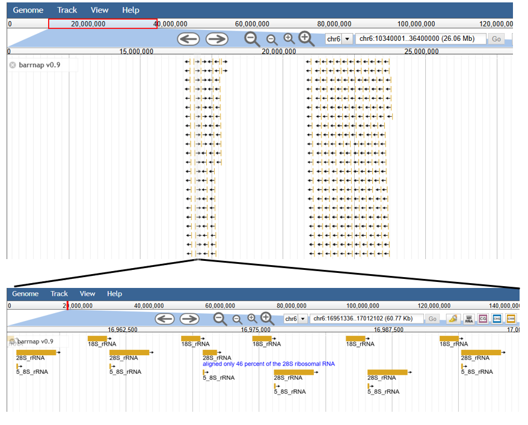 Based on the
location of the rDNA subunits, we can define the NOR as located at
chr6:16737500-23875000 so a size of 7,137,500 bp (7.1 Mb).

``` bash

echo -e "chr6\t16737500\t23875000" > NOR.bed
```

``` r
library(chromoMap)

chr <- c("chr6")
start <- c("1")
end <- c("181357234")
centromere <- c("59037500")
chromoMap_file <- data.frame(chr, as.integer(start), as.integer(end), as.integer(centromere))

NOR <- data.frame(V1=c("NOR"),
V2=c("chr6"),
V3=as.integer(16737500),
V4=as.integer(23875000),
V5=c("NOR"))

chromoMap(list(chromoMap_file), list(NOR), segment_annotation = TRUE)
```

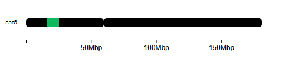

Identify number of copies upstream and downstream of RegionA

``` bash


# Remove features with partial alignements
grep -v "partial" B73_NAM5_rRNA.gff > B73_NAM5_rRNA.no_partial.gff

module load gcc bedtools2

echo -e "chr6\t16737500\t17943648" > NOR_upstream_regionA.bed

echo -e "chr6\t20830948\t23875000" > NOR_downstream_regionA.bed

bedtools intersect -a B73_NAM5_rRNA.no_partial.gff -b NOR_upstream_regionA.bed > B73_NAM5_rRNA_NOR_upstream_regionA.gff

bedtools intersect -a B73_NAM5_rRNA.no_partial.gff -b NOR_downstream_regionA.bed > B73_NAM5_rRNA_NOR_downstream_regionA.gff

grep "18S" B73_NAM5_rRNA_NOR_upstream_regionA.gff | wc -l
89

grep "18S" B73_NAM5_rRNA_NOR_downstream_regionA.gff | wc -l
138
```

About 89 copies upstream of RegionA and 138 full copies downstream of
RegionA

### rDNA copies in scaffolds

B73 NAM5 contains 675 scaffolds, sequences that could not be assigned to
any of the 10 chromosomes due to their complexity/repetitiveness. These
sequences also contain annotated rDNA subunits.

``` bash

samtools faidx Zm-B73-REFERENCE-NAM-5.0.fa

grep "scaf" Zm-B73-REFERENCE-NAM-5.0.fa.fai | wc -l
675

# Extract scaffold sequences
seqkit grep -n -r -p "scaf_*" Zm-B73-REFERENCE-NAM-5.0.fa > scaffolds.fa

seqkit stats scaffolds.fa
file          format  type  num_seqs     sum_len  min_len   avg_len  max_len
scaffolds.fa  FASTA   DNA        675  50,229,189   30,084  74,413.6  712,123

grep "scaf_" B73_NAM5_rRNA.gff  | wc -l
1750

grep "scaf_" B73_NAM5_rRNA.gff  | cut -f1 | sort | uniq | wc -l
85

# Number of scaffolds with 5S
grep "scaf_" B73_NAM5_rRNA.gff  | grep "5S" | cut -f1 | sort | uniq | wc -l
2

# Number of copies
grep "scaf_" B73_NAM5_rRNA.gff  | grep "5S" | wc -l
492

# Number of scaffolds with 18S, 5.8S, 28S
grep "scaf_" B73_NAM5_rRNA.gff  | grep "18S" | cut -f1 | sort | uniq | wc -l
81
grep "scaf_" B73_NAM5_rRNA.gff  | grep "28S" | cut -f1 | sort | uniq | wc -l
77
grep "scaf_" B73_NAM5_rRNA.gff  | grep "5.8S" | cut -f1 | sort | uniq | wc -l
44

# Number of copies
grep "scaf_" B73_NAM5_rRNA.gff  | grep "28S" | wc -l
469

grep "scaf_" B73_NAM5_rRNA.gff  | grep "18S" | wc -l
423

grep "scaf_" B73_NAM5_rRNA.gff  | grep "5.8S" | wc -l
366
```

85/675 scaffolds contain annotated rDNA subunits. Only two contigs
contain 5S repeats while others contain either 5.8S, 28S, or 18S
subunits.

Scaffolds with higher number of 45S repeats

``` bash
grep "scaf_" B73_NAM5_rRNA.gff  | grep "18S"  | cut -f1 | sort | uniq -c | sort | tail -n 10
     10 scaf_174
     10 scaf_181
     11 scaf_114
     11 scaf_126
     11 scaf_139
     12 scaf_107
     13 scaf_88
     14 scaf_77
     14 scaf_82
     18 scaf_48
```

If I remove scaffolds containing only partial alignments:

``` bash

grep "scaf_" B73_NAM5_rRNA.gff  | grep "18S"  | grep -v "partial" | cut -f1 | sort | uniq -c  | wc -l
44

grep "scaf_" B73_NAM5_rRNA.gff  | grep "28S"  | grep -v "partial" | cut -f1 | sort | uniq -c  | wc -l
44

grep "scaf_" B73_NAM5_rRNA.gff  | grep "5.8S"  | grep -v "partial" | cut -f1 | sort | uniq -c  | wc -l
44
```

I have 44 scaffolds that seem to contain complete subunit sequences.
Assess the size of the contigs containing annotated 45S subunits to
define how much of the NOR may be missing on B73 NAM5 chromosome 6

``` bash

grep "scaf_" B73_NAM5_rRNA.gff  | grep "28S" | grep -v "partial" | cut -f1 | sort | uniq > id_scaffold_28S.txt

seqkit grep -n -f /mnt/ceph-hdd/workspaces/ws/scc_uanp_scholten/u14929-nor_nil_project/rdna_annotation/B73_NAM5/id_scaffold_28S.txt scaffolds.fa > scaffolds_28S.fa

seqkit stats scaffolds_28S.fa
file              format  type  num_seqs    sum_len  min_len   avg_len  max_len
scaffolds_28S.fa  FASTA   DNA         44  3,314,854   31,211  75,337.6  159,682
```

The 44 scaffolds containing annotated 28S represent 3.3 Mb while the
annotated NOR (including RegionA) is about 7,9 Mb.

### A/T polymorphisms

Check how many copies of each types in NOR and scaffolds

    >A allele
    CTTGAAAATCCGGAGGACCGAATA
    > T allele
    CTTGAAAATCCGGAGGACCGAATT

#### NOR

``` bash

module load gcc bedtools2 bowtie

cd /mnt/ceph-hdd/projects/scc_uanp_scholten/data/databases/genomes/B73_NAM5/

mkdir NOR

cd NOR

echo -e "chr6\t16737500\t23875000" > NOR.bed

bedtools getfasta -fi ../Zm-B73-REFERENCE-NAM-5.0.fa -bed NOR.bed > NOR.fa

srun -p medium --cpus-per-task=8 --mem=8G --time=01:00:00 bowtie-build \
  -f NOR.fa NOR_B73_NAM5 &


bowtie -x NOR_B73_NAM5 -a -v 0 -c CTTGAAAATCCGGAGGACCGAATA > /dev/null
# reads processed: 1
# reads with at least one alignment: 1 (100.00%)
# reads that failed to align: 0 (0.00%)
Reported 184 alignments


# Map the reads without any mismatch allowed
bowtie -x NOR_B73_NAM5 -a -v 0 -c CTTGAAAATCCGGAGGACCGAATT > /dev/null
# reads processed: 1
# reads with at least one alignment: 1 (100.00%)
# reads that failed to align: 0 (0.00%)
Reported 42 alignments
```

Within the NOR, 42 18S subunits have 184 (81%) have the A allele and 42
(19%) have the T alleles .

#### Scaffolds

``` bash

cd /mnt/ceph-hdd/projects/scc_uanp_scholten/data/databases/genomes/B73_NAM5/scaffolds

module load gcc bowtie samtools

srun -p medium --cpus-per-task=4 --mem=16G --time=02:00:00 bowtie-build \
  -f scaffolds_28S.fa scaffolds_28S_B73_NAM5 &

# Map the reads without any mismatch allowed

bowtie -x scaffolds_28S_B73_NAM5 -a -v 0 -c CTTGAAAATCCGGAGGACCGAATA > /dev/null
# reads processed: 1
# reads with at least one alignment: 1 (100.00%)
# reads that failed to align: 0 (0.00%)
Reported 71 alignments

bowtie -x scaffolds_28S_B73_NAM5 -a -v 0 -c CTTGAAAATCCGGAGGACCGAATT > /dev/null
# reads processed: 1
# reads with at least one alignment: 1 (100.00%)
# reads that failed to align: 0 (0.00%)
Reported 288 alignments
```

288 copies with A allele (20%) and 71 with T allele (80%).

Concatenate all fasta and re-annotate for visualization

``` bash
# Concatenate all sequences into one
grep -v "^>" scaffolds_28S.fa | tr --delete '\n' | fold > scaffolds_28S_concat.fa

# Add fasta header
sed -i '1 i\>scaffolds_28S' scaffolds_28S_concat.fa

seqkit stats scaffolds_28S_concat.fa

seqkit stats scaffolds_28S_concat.fa
file                     format  type  num_seqs    sum_len    min_len    avg_len    max_len
scaffolds_28S_concat.fa  FASTA   DNA          1  3,314,854  3,314,854  3,314,854  3,314,854

source activate barrnap_v09

srun -p medium --cpus-per-task=4 --time=01:00:00 barrnap --threads 4 --kingdom euk --outseq scaffolds_28S_concat_rRNA.fa  < scaffolds_28S_concat.fa > scaffolds_28S_concat_rRNA.gff &
```

## B73 near-T2T (Koren et al 2024)

Near telomere-to-telomere (T2T) assembly of B73 was published in [Koren
et al 2024](http://genome.cshlp.org/content/34/11/1919). This assembly
is based ONT Duplex data.

``` bash

# Download assembly
https://obj.umiacs.umd.edu/marbl_publications/duplex/Zea_mays_B73/asm.fasta

mv asm.fasta B73_T2T.fa 

samtools faidx B73_T2T.fa

cut -f1,2 B73_T2T.fa.fai
chr1    309607410
chr10   152523392
chr2    244512530
chr5    229358312
chr6    196398069
chr6_un1        1568390
chr6_un2        192809
chr6_un3        254180
chr6_un4        113172
chr7    209623059
chr8    204097842
chr9    169207087
chrChrloroplast 141779
chrMitochondia  569628
chrrDNA 8794
chr4    250373149
chr3_v2 238043907
```

The chr6 is split into 5 files, suggesting the NOR could not be
assembled in a single contig.

``` bash

# Annotate rDNA
source activate barrnap_v09

srun -p scc-cpu --cpus-per-task=8 --time=04:00:00 barrnap --threads 8 --kingdom euk --outseq B73_T2T_rRNA.fa  < B73_T2T.fa > B73_T2T_rRNA.gff

# Remove partially mapping rRNA units
grep -v "partial" B73_T2T_rRNA.gff > B73_T2T_rRNA.complete.gf

grep "chr6" B73_T2T_rRNA.complete.gff | grep "28S" | wc -l
451


grep "chr6" B73_T2T_rRNA.complete.gff | grep "28S" | cut -f1 | sort | uniq -c
    209 chr6
    178 chr6_un1
     22 chr6_un2
     29 chr6_un3
     13 chr6_un4

grep "28S" B73_T2T_rRNA.complete.gff | cut -f1 | sort | uniq -c
      1 chr10
    209 chr6
    178 chr6_un1
     22 chr6_un2
     29 chr6_un3
     13 chr6_un4
      1 chrrDNA


grep "18S" B73_T2T_rRNA.complete.gff | cut -f1 | sort | uniq -c
      1 chr10
    206 chr6
    178 chr6_un1
     21 chr6_un2
     28 chr6_un3
     13 chr6_un4
      1 chrrDNA
      
grep "5.8S" B73_T2T_rRNA.complete.gff | cut -f1 | sort | uniq -c
      1 chr10
    221 chr6
    178 chr6_un1
     22 chr6_un2
     29 chr6_un3
     13 chr6_un4
      1 chrrDNA


# Size of the chr6 scaffolds (chr6_un)
```

The T2T B73 assembly has 451 28S subunits, with 209 annotated on chr6
and the 242 others split into 4 chr6 contigs (chr6_un\[1-4\]). One
subunit is annotated on chr10.

### NOR coordinates

Based on JBrowse visualization of B73_T2T_rRNA.gff on chr6, the NOR is
located at chr6:30750000-37600000 (6.85 Mb) and RegionA is located at
chr6:31600000-34720000 (3.12 Mb).

``` bash

echo -e "chr6\t30750000\t37600000" > NOR_B73_T2T.bed

echo -e "chr6\t31600000\t34720000" > RegionA_B73_T2T.bed
```

``` r
library(chromoMap)

chr <- c("chr6")
start <- c("1")
end <- c("196398069")
chromoMap_file <- data.frame(chr, as.integer(start), as.integer(end))

NOR <- data.frame(V1=c("NOR"),
V2=c("chr6"),
V3=as.integer(30750000),
V4=as.integer(37600000),
V5=c("NOR"))

chromoMap(list(chromoMap_file), list(NOR), segment_annotation = TRUE)
```

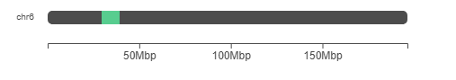

### A/T polymorphisms

Check how many copies of each types in NOR and scaffolds

> A allele CTTGAAAATCCGGAGGACCGAATA T allele CTTGAAAATCCGGAGGACCGAATT

Check A/T polymorphism

``` bash

# Get chr6 and chr6_un contigs
grep "chr6" B73_T2T_rRNA.complete.gff | grep "28S" | cut -f1 | sort | uniq > name_chr6.txt

seqkit grep -r -n -f name_chr6.txt B73_T2T.fa > B73_T2T_chr6.fa

srun -p scc-cpu --cpus-per-task=8 --mem=8G --time=01:00:00 bowtie-build \
  -f B73_T2T_chr6.fa B73_T2T_chr6 &

## Allele A
# Only chr6
bowtie -x B73_T2T_chr6 -a -v 0 -c CTTGAAAATCCGGAGGACCGAATA | grep -w "chr6" | wc -l
198

# Only chr6_un[1-4]
bowtie -x B73_T2T_chr6 -a -v 0 -c CTTGAAAATCCGGAGGACCGAATA | grep "chr6_un" | wc -l
220

## Allele T
# Only chr6
bowtie -x B73_T2T_chr6 -a -v 0 -c CTTGAAAATCCGGAGGACCGAATT | grep -w "chr6" | wc -l
3

# Only chr6_un[1-4]
bowtie -x B73_T2T_chr6 -a -v 0 -c CTTGAAAATCCGGAGGACCGAATT | grep "chr6_un" | wc -l
21

# Using whole genome
srun -p scc-cpu --cpus-per-task=8 --mem=8G --time=02:00:00 bowtie-build   -f B73_T2T.fa B73_T2T &

bowtie -x B73_T2T -a -v 0 -c CTTGAAAATCCGGAGGACCGAATA > /dev/null
# reads processed: 1
# reads with at least one alignment: 1 (100.00%)
# reads that failed to align: 0 (0.00%)
Reported 419 alignments

bowtie -x B73_T2T -a -v 0 -c CTTGAAAATCCGGAGGACCGAATT > /dev/null
# reads processed: 1
# reads with at least one alignment: 1 (100.00%)
# reads that failed to align: 0 (0.00%)
Reported 25 alignments
```

For this B73 assembly, we get 418 28S copies with the A allele (95%) and
24 copies with the T allele (5%), which is largely different from the
B73 NAM5 assembly (about 50-50).

It is very suspicious that so few copies with the T alleles were found
while SNP calling on WGS data seem to indicate a ratio of about 70% A
and 30% T ([Liu et al 2017](https://www.nature.com/articles/srep42444)).
I don’t trust the NOR of this B73 T2T assembly.

## Mo17 CAU rDNA annotation

A telomere-to-telomere assembly of Mo17 was released in 2023 with the
paper [Chen et al.,
2023](https://www.nature.com/articles/s41588-023-01419-6). This assembly
is named Zm-Mo17-REFERENCE-CAU-2.0.

``` bash
# Download Mo17 CAU 2 assembly
wget https://download.maizegdb.org/Zm-Mo17-REFERENCE-CAU-2.0/Zm-Mo17-REFERENCE-CAU-2.0.fa.gz

gunzip Zm-Mo17-REFERENCE-CAU-2.0.fa.gz

source activate barrnap_v09

srun -p medium --cpus-per-task=8 --time=04:00:00 barrnap --threads 8 --kingdom euk --outseq Mo17_CAU_2_rRNA.fa  < Zm-Mo17-REFERENCE-CAU-2.0.fa > Mo17_CAU_2_rRNA.gff


wc -l Mo17_CAU_2_rRNA.gff
10400 Mo17_CAU_2_rRNA.gff

# If partial removed
grep -v "partial" Mo17_CAU_2_rRNA.gff | wc -l
10328

# Distribution on the 10 chromosomes
cut -f1  Mo17_CAU_2_rRNA.gff | grep "chr" | sort | uniq -c
      5 chr1
      7 chr10
   1381 chr2
      1 chr3
      3 chr4
      1 chr5
   9000 chr6
      1 chr8

# Number for each type
grep "5S" Mo17_CAU_2_rRNA.gff | wc -l
1379

grep "5.8" Mo17_CAU_2_rRNA.gff | wc -l
3619

grep "18S" Mo17_CAU_2_rRNA.gff | wc -l
3015

grep "28S" Mo17_CAU_2_rRNA.gff | wc -l
3021


# Without partial alignment
grep "5S" Mo17_CAU_2_rRNA.gff | grep -v "partial" | wc -l
1370

grep "5.8S" Mo17_CAU_2_rRNA.gff | grep -v "partial" | wc -l
2983

grep "18S" Mo17_CAU_2_rRNA.gff | grep -v "partial" | wc -l
2993

grep "28S" Mo17_CAU_2_rRNA.gff | grep -v "partial" | wc -l
2981
```

Mo17 CAU 2 has about 3000 45S copies while B73 NAM5 800, so a
fold-change of about 4 between the two genotypes.

### NOR coordinates

The gff file `Mo17_CAU_2_rRNA.gff` can be loaded on a Jbrowse running
Mo17 CAU genome and the subunits can clearly be seed on chromosome 6:

Coordinates: chr6:17925000-44750000 (26,8 Mb)

``` bash
echo -e "chr6\t17925000\t44750000" > NOR_Mo17.bed
```

We can see 3 clusters of different positions

``` bash

# Size 8900056
echo -e "chr6\t17925000\t26825056\tcluster1\t.\t-" > NOR_Mo17_cluster1.bed

# Size 3420719
echo -e "chr6\t26825056\t30245775\tcluster2\t.\t+" > NOR_Mo17_cluster2.bed

# 14504225
echo -e "chr6\t30245775\t44750000\tcluster3\t.\t-" > NOR_Mo17_cluster3.bed

cat NOR_Mo17_cluster* > NOR_Mo17_clusters.bed
```

``` r
library(chromoMap)

chr <- c("chr6")
start <- c("1")
end <- c("201729004")
centromere <- c("80000000")
chromoMap_file <- data.frame(chr, as.integer(start), as.integer(end), as.integer(centromere))

NOR <- data.frame(V1=c("NOR"),
V2=c("chr6"),
V3=as.integer(17925000),
V4=as.integer(44750000),
V5=c("NOR"))

chromoMap(list(chromoMap_file), list(NOR), segment_annotation = TRUE)
```

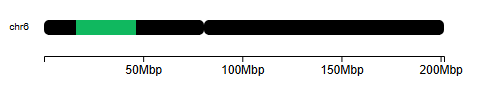

### A/T polymorphisms

Check how many copies of each types in NOR and scaffolds

> A allele CTTGAAAATCCGGAGGACCGAATA T allele CTTGAAAATCCGGAGGACCGAATT

``` bash

module load gcc bowtie

srun -p scc-cpu --cpus-per-task=8 --mem=8G --time=02:00:00 bowtie-build \
  -f Zm-Mo17-REFERENCE-CAU-2.0.fa Mo17_CAU_2 &

bowtie -x Mo17_CAU_2 -a -v 0 -c CTTGAAAATCCGGAGGACCGAATA > /dev/null
# reads processed: 1
# reads with at least one alignment: 1 (100.00%)
# reads that failed to align: 0 (0.00%)
Reported 2914 alignments

bowtie -x Mo17_CAU_2 -a -v 0 -c CTTGAAAATCCGGAGGACCGAATA | grep "chr6"    bucket 4: 60%
| wc -l
# reads processed: 1
# reads with at least one alignment: 1 (100.00%)
# reads that failed to align: 0 (0.00%)
Reported 2914 alignments
2913


bowtie -x Mo17_CAU_2 -a -v 0 -c CTTGAAAATCCGGAGGACCGAATT > /dev/null
# reads processed: 1
# reads with at least one alignment: 0 (0.00%)
# reads that failed to align: 1 (100.00%)
No alignments
```

## WGS B73 data for A/T call

``` bash

srun -p ssc-cpu --time=00:20:00 seqkit pair --interleaved -1 R1.fastq -2 R2.fastq SRR447986.fastq
```

## Genes in the NOR B73 NAM5

``` bash

module load gcc bedtools2 bedops

# Download gene annotation B73 NAM5
wget https://download.maizegdb.org/Zm-B73-REFERENCE-NAM-5.0/Zm-B73-REFERENCE-NAM-5.0_Zm00001eb.1.gff3

# Keep only genes
awk '$3=="gene"' Zm-B73-REFERENCE-NAM-5.0_Zm00001eb.1.gff3 > Zm-B73-REFERENCE-NAM-5.0_Zm00001eb.1.genes.gff3

echo -e "chr6\t16737500\t23875000" > NOR.bed

bedtools intersect -a Zm-B73-REFERENCE-NAM-5.0_Zm00001eb.1.genes.gff3 -b NOR.bed > NOR.gene.gff3

wc -l NOR.gene.gff3
180 NOR.gene.gff3

# Get gene ID
cut -f9 NOR.gene.gff3 | cut -d";" -f1 | cut -d"=" -f2 | sort | uniq > NOR.gene.id

# Create a R vector
bash list_to_rvector.sh NOR.gene.id
```

``` r
list_genes_NOR <- c("Zm00001eb261960", "Zm00001eb261970", "Zm00001eb261980", "Zm00001eb261990", "Zm00001eb262000", "Zm00001eb262010", "Zm00001eb262020", "Zm00001eb262030", "Zm00001eb262040", "Zm00001eb262050", "Zm00001eb262060", "Zm00001eb262070", "Zm00001eb262080", "Zm00001eb262090", "Zm00001eb262100", "Zm00001eb262120", "Zm00001eb262130", "Zm00001eb262140", "Zm00001eb262150", "Zm00001eb262160", "Zm00001eb262170", "Zm00001eb262180", "Zm00001eb262190", "Zm00001eb262200", "Zm00001eb262210", "Zm00001eb262220", "Zm00001eb262230", "Zm00001eb262240", "Zm00001eb262250", "Zm00001eb262260", "Zm00001eb262270", "Zm00001eb262280", "Zm00001eb262290", "Zm00001eb262300", "Zm00001eb262310", "Zm00001eb262320", "Zm00001eb262330", "Zm00001eb262340", "Zm00001eb262350", "Zm00001eb262360", "Zm00001eb262370", "Zm00001eb262380", "Zm00001eb262390", "Zm00001eb262400", "Zm00001eb262410", "Zm00001eb262430", "Zm00001eb262440", "Zm00001eb262450", "Zm00001eb262460", "Zm00001eb262520", "Zm00001eb262530", "Zm00001eb262540", "Zm00001eb262550", "Zm00001eb262560", "Zm00001eb262570", "Zm00001eb262580", "Zm00001eb262590", "Zm00001eb262600", "Zm00001eb262610", "Zm00001eb262630", "Zm00001eb262640", "Zm00001eb262650", "Zm00001eb262660", "Zm00001eb262670", "Zm00001eb262680", "Zm00001eb262690", "Zm00001eb262700", "Zm00001eb262710", "Zm00001eb262720", "Zm00001eb262730", "Zm00001eb262740", "Zm00001eb262750", "Zm00001eb262760", "Zm00001eb262770", "Zm00001eb262780", "Zm00001eb262790", "Zm00001eb262800", "Zm00001eb262810", "Zm00001eb262820", "Zm00001eb262840", "Zm00001eb262850", "Zm00001eb262860", "Zm00001eb262880", "Zm00001eb262890", "Zm00001eb262900", "Zm00001eb262910", "Zm00001eb262920", "Zm00001eb262930", "Zm00001eb262950", "Zm00001eb262970", "Zm00001eb262990", "Zm00001eb263000", "Zm00001eb263010", "Zm00001eb263020", "Zm00001eb263030", "Zm00001eb263040", "Zm00001eb263050", "Zm00001eb263060", "Zm00001eb263070", "Zm00001eb263090", "Zm00001eb263100", "Zm00001eb263120", "Zm00001eb263140", "Zm00001eb263150", "Zm00001eb263160", "Zm00001eb263180", "Zm00001eb263190", "Zm00001eb263200", "Zm00001eb263210", "Zm00001eb263220", "Zm00001eb263240", "Zm00001eb263250", "Zm00001eb263270", "Zm00001eb263280", "Zm00001eb263290", "Zm00001eb263300", "Zm00001eb263310", "Zm00001eb263320", "Zm00001eb263340", "Zm00001eb263350", "Zm00001eb263360", "Zm00001eb263370", "Zm00001eb263380", "Zm00001eb263390", "Zm00001eb263410", "Zm00001eb263420", "Zm00001eb263430", "Zm00001eb263440", "Zm00001eb263450", "Zm00001eb263460", "Zm00001eb263470", "Zm00001eb263480", "Zm00001eb263490", "Zm00001eb263500", "Zm00001eb263510", "Zm00001eb263520", "Zm00001eb263530", "Zm00001eb263540", "Zm00001eb263550", "Zm00001eb263570", "Zm00001eb263580", "Zm00001eb263590", "Zm00001eb263610", "Zm00001eb263620", "Zm00001eb263630", "Zm00001eb263640", "Zm00001eb263650", "Zm00001eb263660", "Zm00001eb263670", "Zm00001eb263680", "Zm00001eb263690", "Zm00001eb263700", "Zm00001eb263710", "Zm00001eb263720", "Zm00001eb263730", "Zm00001eb263740", "Zm00001eb263750", "Zm00001eb263760", "Zm00001eb263780", "Zm00001eb263790", "Zm00001eb263800", "Zm00001eb263830", "Zm00001eb263860", "Zm00001eb263880", "Zm00001eb263890", "Zm00001eb263900", "Zm00001eb263910", "Zm00001eb263920", "Zm00001eb263930", "Zm00001eb263940", "Zm00001eb263960", "Zm00001eb263970", "Zm00001eb263980", "Zm00001eb264000", "Zm00001eb264010", "Zm00001eb264020", "Zm00001eb264030", "Zm00001eb264040", "Zm00001eb264050", "Zm00001eb264060")

saveRDS(list_genes_NOR, "data/annotations/list_genes_NOR.Rds")
```

## RegionA analysis

The RegionA was described by [Huang et al
2021](https://doi.org/10.1186/s13059-021-02448-2) as a 2.9 Mb
presence/absence variation (PAV) that is found in B73 but not in Mo17.
RegionA can be used for genotyping our NIL material to ensure that the
NOR introgression is present.

By visualizing rDNA copies on JBrowse based on barrnap annotation of B73
NAM5 assembly, one can see a gap round chr6:17943647..20830948 with no
rDNA subunits annotated.

``` bash

# NOR coordinates
echo -e "chr6\t16737500\t23875000" > NOR.bed

# regionA coordinates
echo -e "chr6\t17943647\t20830948" > regionA.bed

# Coordinates of a gene present in regionA and used for PCR NOR genotyping
echo -e "chr6\t20726343\t20735703" > Zm00001eb263160.bed
```

Load these three bed files on JBrowse (B73 NAM5 annotation) and the
barrnap rDNA annotation gff file `B73_NAM5_rRNA.gff`:

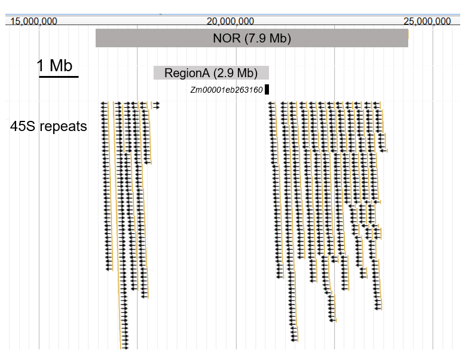

### Genes present in RegionA

We can retrieve the genes present in RegionA:

``` bash

module load gcc bedtools2 bedops

cd /mnt/ceph-hdd/projects/scc_uanp_scholten/data/databases/genomes/B73_NAM5

# Download gene annotation B73 NAM5
wget https://download.maizegdb.org/Zm-B73-REFERENCE-NAM-5.0/Zm-B73-REFERENCE-NAM-5.0_Zm00001eb.1.gff3

# Keep only genes
awk '$3=="gene"' Zm-B73-REFERENCE-NAM-5.0_Zm00001eb.1.gff3 > Zm-B73-REFERENCE-NAM-5.0_Zm00001eb.1.genes.gff3

# regionA coordinates
echo -e "chr6\t17943647\t20830948" > regionA.bed

bedtools intersect -a Zm-B73-REFERENCE-NAM-5.0_Zm00001eb.1.genes.gff3 -b regionA.bed > regionA.gene.gff3

wc -l regionA.gene.gff3
56 regionA.gene.gff3

# Get gene ID
cut -f9 regionA.gene.gff3 | cut -d";" -f1 | cut -d"=" -f2 | sort | uniq > regionA.gene.id

# Create a R vector
bash list_to_rvector.sh regionA.gene.id
```

``` r
# Put in R vector
list_genes_regionA <- c("Zm00001eb262530", "Zm00001eb262540", "Zm00001eb262550", "Zm00001eb262560", "Zm00001eb262570", "Zm00001eb262580", "Zm00001eb262590", "Zm00001eb262600", "Zm00001eb262610", "Zm00001eb262630", "Zm00001eb262640", "Zm00001eb262650", "Zm00001eb262660", "Zm00001eb262670", "Zm00001eb262680", "Zm00001eb262690", "Zm00001eb262700", "Zm00001eb262710", "Zm00001eb262720", "Zm00001eb262730", "Zm00001eb262740", "Zm00001eb262750", "Zm00001eb262760", "Zm00001eb262770", "Zm00001eb262780", "Zm00001eb262790", "Zm00001eb262800", "Zm00001eb262810", "Zm00001eb262820", "Zm00001eb262840", "Zm00001eb262850", "Zm00001eb262860", "Zm00001eb262880", "Zm00001eb262890", "Zm00001eb262900", "Zm00001eb262910", "Zm00001eb262920", "Zm00001eb262930", "Zm00001eb262950", "Zm00001eb262970", "Zm00001eb262990", "Zm00001eb263000", "Zm00001eb263010", "Zm00001eb263020", "Zm00001eb263030", "Zm00001eb263040", "Zm00001eb263050", "Zm00001eb263060", "Zm00001eb263070", "Zm00001eb263090", "Zm00001eb263100", "Zm00001eb263120", "Zm00001eb263140", "Zm00001eb263150", "Zm00001eb263160", "Zm00001eb263180")

saveRDS(list_genes_regionA, "data/annotations/list_genes_regionA.Rds")
```

### Genes in NOR genes without not in RegionA genes

I have 56 genes in RegionA and 182 in the NOR so I should theoretically
have 182-56=126 genes that are in the NOR but not RegionA

``` r
list_genes_regionA <- readRDS("data/annotations/list_genes_regionA.Rds")

list_genes_NOR <- readRDS("data/annotations/list_genes_NOR.Rds")

list_genes_NOR_wo_RegionA <- setdiff(list_genes_NOR, list_genes_regionA)

saveRDS(list_genes_NOR_wo_RegionA, "data/annotations/list_genes_NOR_wo_RegionA.Rds")
```

## GO analysis NOR genes and RegionA

### NOR genes

``` r
list_genes_NOR <- readRDS("data/annotations/list_genes_NOR.Rds")

lp <- perform_GO(list_genes_NOR)

lp[[4]]
```

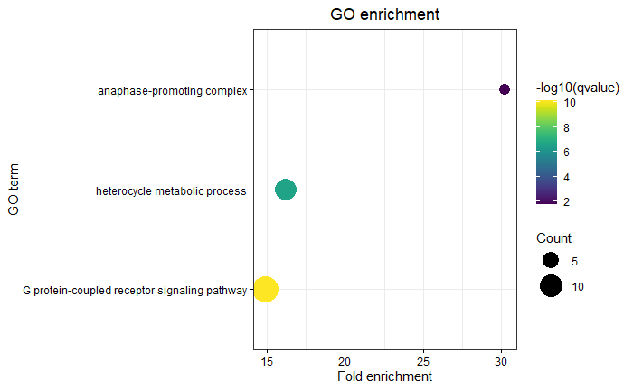

### RegionA genes

``` r
list_genes_regionA <- readRDS("data/annotations/list_genes_regionA.Rds")

lp <- perform_GO(list_genes_regionA)

lp[[4]]
```

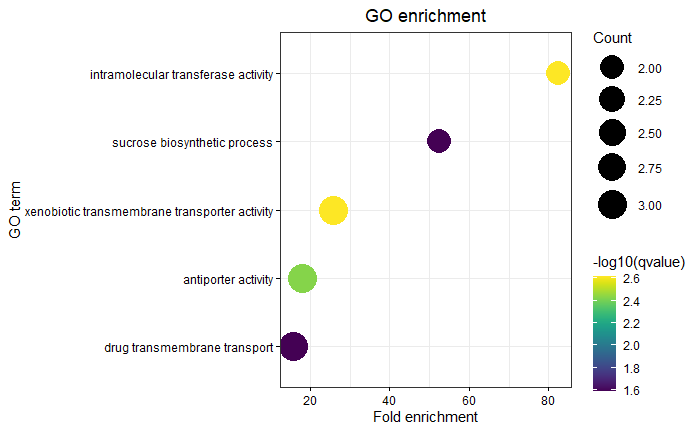

### NOR genes w/o RegionA genes

``` r
list_genes_NOR_wo_RegionA <- readRDS("data/annotations/list_genes_NOR_wo_RegionA.Rds")

lp <- perform_GO(list_genes_NOR_wo_RegionA)

lp[[4]]
```

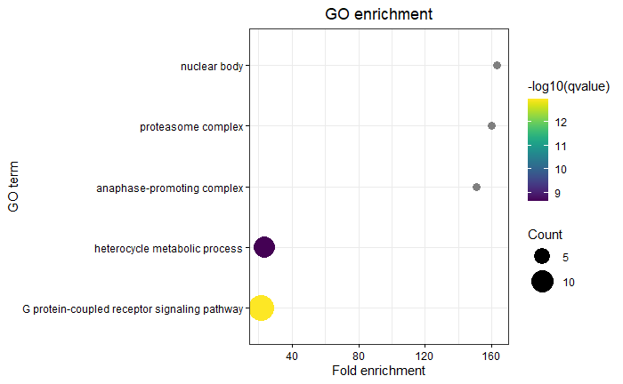

1.  

# 

# Phenotypic analysis growth chamber

# 

Plants were grown in controlled growth chambers

## R libraries

``` r
# Plotting packages
library(tidyverse)
library(ggpubr)

# Statistics for agronomy (https://cran.r-project.org/web/packages/agricolae/agricolae.pdf)
library(agricolae)
library(multcomp)
library(multcompView)
library(emmeans)

# Plot variable correlation
library(corrplot)

# linear mixed-effects model 
library(lme4)

library(remedy)
library(styler)
```

``` r
df <- read.delim("data/phenotyping/data_phenotyping_growth_chamber.txt", stringsAsFactors = T, dec = ",")

# Transform data in long format
long_df <- df %>% gather(DAS, height, DAS4:DAS22)

# Turn DAS into factor
long_df$DAS <- as.factor(long_df$DAS)

# Order DAS
long_df$DAS <- factor(long_df$DAS, levels = c("DAS4", "DAS7", "DAS10", "DAS13", "DAS16", "DAS19", "DAS22"), ordered = T)

long_df$line <- factor(long_df$line, levels = c("B73", "Mo17", "b015", "b131", "b172", "m047", "B73xMo17", "B73xb015", "b131xB73", "B73xb172", "b172xB73", "m047xMo17"), ordered = T)

# Order groups
long_df$group <- factor(long_df$group, levels = c("B73", "Mo17", "B73xMo17", "B73_NIL", "B73_NIL_cross", "Mo17_NIL", "Mo17_NIL_cross"), ordered = T)

# Order categories
long_df$category <- factor(long_df$category, levels = c("B73", "Mo17", "B73xMo17", "b015", "b131", "b172", "m047"), ordered = T)

long_df$NOR <- factor(long_df$NOR, levels = c("homozygous", "heterozygous"))

long_df$height <- as.numeric(long_df$height)

saveRDS(long_df, "data/phenotyping/data_phenotyping_growth_chamber.Rds")
```

## Summary 13 DAS

``` r
df <- readRDS("data/phenotyping/data_phenotyping_growth_chamber.Rds")

df_DAS13 <- df %>% filter(DAS=="DAS13")

MPV <- (mean(df_DAS13[df_DAS13$line=="B73", ]$height) + mean(df_DAS13[df_DAS13$line=="Mo17", ]$height))/2
```

``` r
col <- c("#d95f02", "#1b9e77")

ggboxplot(df_DAS13,
  x = "line", y = "height", color = "NOR",
  ylab = "Plant height (cm)", xlab = "Genotype", add = "dotplot",
  palette = col, add.params = list(size = 0.8, alpha = 0.2), outlier.shape = NA
) + theme_bw() +
  theme(axis.text.x = element_text(angle = 45, hjust = 1)) +
  ggtitle("Plant height at 13 DAS") + theme(plot.title = element_text(hjust = 0.5)) +
  geom_hline(yintercept = MPV, linetype = "dashed", color = "black") + expand_limits(y = 0) +  theme(axis.text.x = element_text(color="black"), 
      axis.text.y = element_text(color="black"),
      axis.ticks = element_line(color = "black")) + 
      theme(plot.title = element_text(hjust = 0.5)) + 
      scale_y_continuous(labels = scales::comma_format())
```


### By experiment

``` r
df <- readRDS("data/phenotyping/data_phenotyping_growth_chamber.Rds")

df_DAS13 <- df %>% filter(DAS=="DAS13")

col <- c("#1b9e77", "#d95f02", "#7570b3")

MPV <- (mean(df_DAS13[df_DAS13$line=="B73", ]$height) + mean(df_DAS13[df_DAS13$line=="Mo17", ]$height))/2

ggboxplot(df_DAS13, "line", "height",
  color = "experiment", add = "dotplot",
  xlab = "genotype", ylab = "Plant height in cm", title = "Plant height 13 days after sowing across the 3 experiments",
  palette = col,
  add.params = list(size = 0.7, alpha = 0.2), outlier.shape = NA
) + theme_bw() +
  rotate_x_text(45) + expand_limits(y = 0) + theme(
    axis.text.x = element_text(color = "black"),
    axis.text.y = element_text(color = "black"),
    axis.ticks = element_line(color = "black")
  ) + geom_hline(yintercept = MPV, linetype = "dashed", color = "black") +
  theme(plot.title = element_text(hjust = 0.5)) +
  scale_y_continuous(labels = scales::comma_format())
```

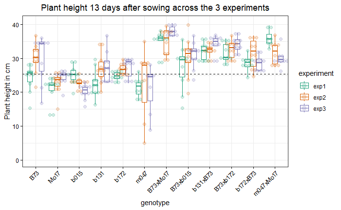

### Comparison heterozygous and homozygous NORs - 13DAS

### B73xMo17

``` r
df_sub <- df_DAS13 %>% filter(category %in% c("Mo17", "B73","B73xMo17"))

# Uses the mixed model to adjust for confounding factors experiment
model <- lmer(height ~ NOR +
                (1 | experiment),
              data = df_sub)

# Compares genotype means on an equal footing
emm  <- emmeans(model, ~ NOR)

 # P-value
pairs(emm)

#plot(emm)
```

     contrast                  estimate   SE df t.ratio p.value
     homozygous - heterozygous    -10.5 1.03 86 -10.256 <0.0001

    Degrees-of-freedom method: kenward-roger 

### B73xb015

``` r
df_sub <- df_DAS13 %>% filter(category %in% c("b015", "B73","B73xb015"))

# Uses the mixed model to adjust for confounding factors (year, block)
model <- lmer(height ~ NOR +
                (1 | experiment),
              data = df_sub)

# Compares genotype means on an equal footing
# Uses appropriate standard errors that reflect your field design
emm  <- emmeans(model, ~ NOR)

 # P-value
pairs(emm)

#plot(emm)
```

    contrast                  estimate   SE df t.ratio p.value
     homozygous - heterozygous     -4.2 1.19 86  -3.533  0.0007

    Degrees-of-freedom method: kenward-roger 

### b131xB73

``` r
df_sub <- df_DAS13 %>% filter(category %in% c("b131", "B73","b131xB73"))

# Uses the mixed model to adjust for confounding factors (year, block)
model <- lmer(height ~ NOR +
                (1 | experiment),
              data = df_sub)

# Compares genotype means on an equal footing
# Uses appropriate standard errors that reflect your field design
emm  <- emmeans(model, ~ NOR)

 # P-value
pairs(emm)

#plot(emm)
```

     contrast                  estimate    SE df t.ratio p.value
     homozygous - heterozygous    -5.93 0.958 86  -6.192 <0.0001

    Degrees-of-freedom method: kenward-roger 

### b172xB73

``` r
df_sub <- df_DAS13 %>% filter(category %in% c("b172", "B73","b172xB73"))

# Uses the mixed model to adjust for confounding factors (year, block)
model <- lmer(height ~ NOR +
                (1 | experiment),
              data = df_sub)

# Compares genotype means on an equal footing
# Uses appropriate standard errors that reflect your field design
emm  <- emmeans(model, ~ NOR)

 # P-value
pairs(emm)

#plot(emm)
```

     contrast                  estimate    SE  df t.ratio p.value
     homozygous - heterozygous    -3.92 0.678 116  -5.780 <0.0001

    Degrees-of-freedom method: kenward-roger 

### B73xb172

``` r
df_sub <- df_DAS13 %>% filter(category %in% c("b172", "B73","B73xb172"))

# Uses the mixed model to adjust for confounding factors (year, block)
model <- lmer(height ~ NOR +
                (1 | experiment),
              data = df_sub)

# Compares genotype means on an equal footing
# Uses appropriate standard errors that reflect your field design
emm  <- emmeans(model, ~ NOR)

 # P-value
pairs(emm)

#plot(emm)
```

     contrast                  estimate    SE  df t.ratio p.value
     homozygous - heterozygous    -3.92 0.678 116  -5.780 <0.0001

    Degrees-of-freedom method: kenward-roger 

### m047xMo17

``` r
df_sub <- df_DAS13 %>% filter(category %in% c("m047", "Mo17","m047xMo17"))

# Uses the mixed model to adjust for confounding factors (year, block)
model <- lmer(height ~ NOR +
                (1 | experiment),
              data = df_sub)

# Compares genotype means on an equal footing
# Uses appropriate standard errors that reflect your field design
emm  <- emmeans(model, ~ NOR)

 # P-value
pairs(emm)

#plot(emm)
```

     contrast                  estimate   SE   df t.ratio p.value
     homozygous - heterozygous    -10.1 1.21 72.5  -8.322 <0.0001

    Degrees-of-freedom method: kenward-roger 

## Summary Heterosis

``` r
df_DAS13 <- df %>% filter(DAS=="DAS13")

# Function to calculate MPV
calculate_heterosis <- function(P1, P2, F1, phenotype, df){
  index_phenotype <-  which(grepl(phenotype, colnames(df)))
  MPV = ((mean(unlist(df[df$line==P1,][index_phenotype]))+mean(unlist(df[df$line==P2,][index_phenotype])))/2)
  F1 = mean(unlist(df[df$line==F1,][index_phenotype]))
  return((F1-MPV)/MPV)
}

# Create empty dataframe
df_MPH = data.frame(matrix(vector(), 6, 2,
                       dimnames=list(c(), c("hybrid","MPH_height")))
)

df_MPH$hybrid <- c("B73xMo17",
                                                "B73xb015",
                                                "b131xB73",
                                                "B73xb172",
                                                "b172xB73",
                                                "m047xMo17")

df_MPH$hybrid <- factor(df_MPH$hybrid, levels=c("B73xMo17",
                                                "B73xb015",
                                                "b131xB73",
                                                "B73xb172",
                                                "b172xB73",
                                                "m047xMo17"), ordered=T)

# Calculate MPV for each hybrid
MPH_height <- list()
MPH_height[1] <- calculate_heterosis("B73", "Mo17", "B73xMo17", "height", df_DAS13)
MPH_height[2] <- calculate_heterosis("B73", "b015", "B73xb015", "height", df_DAS13)
MPH_height[3] <- calculate_heterosis("B73", "b131", "b131xB73", "height", df_DAS13)
MPH_height[4] <- calculate_heterosis("B73", "b172", "B73xb172", "height", df_DAS13)
MPH_height[5] <- calculate_heterosis("B73", "b172", "b172xB73", "height", df_DAS13)
MPH_height[6] <- calculate_heterosis("Mo17", "m047", "m047xMo17", "height", df_DAS13)

df_MPH$MPH_height <- unlist(MPH_height)
```

``` r
ggbarplot(df_MPH,
  x = "hybrid", y = "MPH_height",
  fill = "#B3B3B3", 
  color="black",
  position = position_dodge(0.9),
  ylab = "Mid-parent heterosis (%)",
  xlab = "Cross", title = "Mid-parent heterosis for plant height at 13 DAS"
) +
  geom_text(aes(label = round(MPH_height * 100, digits = 1)),
  vjust = 1.5,
  position = position_dodge(width = 0.9)
  ) +
  geom_hline(yintercept = 0, color = "black") +
  theme_bw() +
  scale_y_continuous(labels = scales::percent_format(accuracy = 1)) +
  theme(axis.text.x = element_text(angle = 45, hjust = 1)) + 
  theme(
    axis.text.x = element_text(color = "black"),
    axis.text.y = element_text(color = "black"),
    axis.ticks = element_line(color = "black")
  ) +
  theme(plot.title = element_text(hjust = 0.5))
```

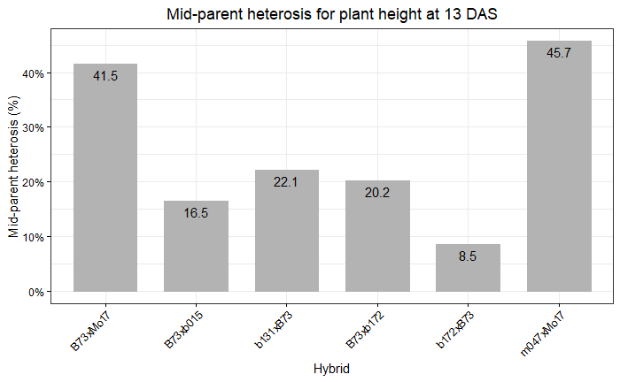

``` r
df_MPH
```

| hybrid    | MPH_height |
|-----------|------------|
| B73xMo17  | 0.4149517  |
| B73xb015  | 0.1652996  |
| b131xB73  | 0.2206311  |
| B73xb172  | 0.2023992  |
| b172xB73  | 0.0853785  |
| m047xMo17 | 0.4570060  |

# Phenotypic analysis field trials

## Experimental design

Each block contains from 6 to 15 plants and each genotype is planted in
6 blocks. Field trials were performed in the experimental station of
Reinshof (Goettingen, Germany) following standard agronomical practices
for maize.

### 2022


### 2024

NILs and parental genotypes grown in 2024 in Shelter of Göttingen. Sown
on 15.05.2024 and harvested on 26.11.2024.


### 2025


## R libraries

``` r
# Plotting packages
library(tidyverse)
library(ggpubr)

# Statistics for agronomy
library(agricolae)
library(multcomp)
library(multcompView)
library(emmeans)

# Plot variable correlation
library(corrplot)

# linear mixed-effects model 
library(lme4)

library(remedy)
library(styler)
```

## Data

``` r
field_data <- read.table("data/phenotyping/data_field_trials.txt", header = T)

field_data$genotype <- factor(field_data$genotype, 
                              levels = c("B73", "Mo17", "b015", "b131", "b172",
                                         "m047","B73xMo17", "B73xb015", "b015xB73", 
                                         "B73xb131", "b131xB73", "B73xb172",
                                         "b172xB73", "Mo17xm047","m047xMo17"))


field_data$category <- factor(field_data$category, 
                              levels = c("B73", "Mo17", "B73xMo17", 
                                         "b015","b131","b172","m047"))

field_data$WH <- as.factor(field_data$WH)
field_data$year <- as.factor(field_data$year)
field_data$NOR <- factor(field_data$NOR, 
                         levels = c("homozygous","heterozygous"))

saveRDS(field_data, "data/phenotyping/field_data.Rds")
```

## Plant height at flowering

### Summary by genotype

``` r
field_data <- readRDS("data/phenotyping/field_data.Rds")

MPV <- (mean(field_data[field_data$genotype=="B73",]$height_at_flowering) + mean(field_data[field_data$genotype=="Mo17",]$height_at_flowering))/2

# Color coding
col <- c("#d95f02", "#1b9e77")

field_data %>% ggboxplot(
  x = "genotype", y = "height_at_flowering",
  color = "NOR", ylab = "Plant height at flowering (cm)",
  xlab = "Genotype", add = "dotplot", palette = col,
  add.params = list(size = 0.7, alpha = 0.2), outlier.shape = NA
) + theme_bw() +
  theme(axis.text.x = element_text(angle = 45, hjust = 1)) +
  ggtitle("Plant height at flowering") +
  theme(plot.title = element_text(hjust = 0.5)) +
  geom_hline(yintercept = MPV, linetype = "dashed", color = "black") + theme(
    axis.text.x = element_text(color = "black"),
    axis.text.y = element_text(color = "black"),
    axis.ticks = element_line(color = "black")
  ) +
  theme(plot.title = element_text(hjust = 0.5)) +
  scale_y_continuous(labels = scales::comma_format()) + expand_limits(y = 0)
```


### By year

``` r
col=c("#1b9e77","#d95f02","#7570b3")

MPV <- (mean(field_data[field_data$genotype=="B73",]$height_at_flowering) + mean(field_data[field_data$genotype=="Mo17",]$height_at_flowering))/2

ggboxplot(field_data, "genotype", "height_at_flowering",
  color = "year", add = "dotplot",
  xlab = "genotype", ylab = "Plant height (cm)", title = "Plant height at flowering across 3 years",
  palette = col,
  add.params = list(size = 0.7, alpha = 0.2), outlier.shape = NA
) + theme_bw() + geom_hline(yintercept = MPV, linetype = "dashed", color = "black") +
  rotate_x_text(45) + theme(plot.title = element_text(hjust = 0.5)) +  theme(axis.text.x = element_text(color="black"), 
      axis.text.y = element_text(color="black"),
      axis.ticks = element_line(color = "black")) + 
      theme(plot.title = element_text(hjust = 0.5)) + 
      scale_y_continuous(labels = scales::comma_format()) + expand_limits(y = 0)
```


#### 2022

``` r
field_data <- readRDS("data/phenotyping/field_data.Rds")

field_data_sub <- field_data %>% filter(year=="2022")
  
  
MPV <- (mean(field_data_sub[field_data_sub$genotype=="B73",]$height_at_flowering) + mean(field_data_sub[field_data_sub$genotype=="Mo17",]$height_at_flowering))/2

# Color coding
col <- c("#d95f02", "#1b9e77")

field_data_sub %>% ggboxplot(x = "genotype", y = "height_at_flowering", 
                         color = "NOR", ylab = "Height at flowering (cm)", 
                         xlab = "Genotype", add = "dotplot", palette = col,
                         add.params = list(size=0.7, alpha = 0.2), outlier.shape = NA) + theme_bw() +
  theme(axis.text.x = element_text(angle = 45, hjust = 1)) + 
  ggtitle("Height at flowering (cm) - 2022") + 
  theme(plot.title = element_text(hjust = 0.5)) + 
  geom_hline(yintercept = MPV, linetype = "dashed", color = "black", lwd=0.8) +  theme(axis.text.x = element_text(color="black"), 
      axis.text.y = element_text(color="black"),
      axis.ticks = element_line(color = "black")) + 
      theme(plot.title = element_text(hjust = 0.5)) + 
      scale_y_continuous(labels = scales::comma_format()) + expand_limits(y = 0)
```

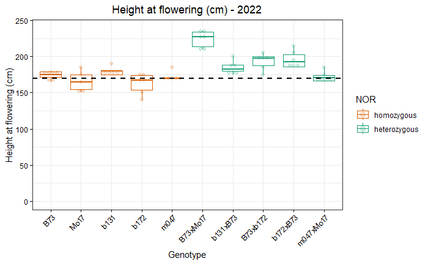

#### 2024

``` r
field_data <- readRDS("data/phenotyping/field_data.Rds")

field_data_sub <- field_data %>% filter(year=="2024")
  
  
MPV <- (mean(field_data_sub[field_data_sub$genotype=="B73",]$height_at_flowering) + mean(field_data_sub[field_data_sub$genotype=="Mo17",]$height_at_flowering))/2

# Color coding
col <- c("#d95f02", "#1b9e77")

field_data_sub %>% ggboxplot(x = "genotype", y = "height_at_flowering", 
                         color = "NOR", ylab = "Height at flowering (cm)", 
                         xlab = "Genotype", add = "dotplot", palette = col,
                         add.params = list(size=0.7, alpha = 0.2), outlier.shape = NA) + theme_bw() +
  theme(axis.text.x = element_text(angle = 45, hjust = 1)) + 
  ggtitle("Height at flowering (cm) - 2024") + 
  theme(plot.title = element_text(hjust = 0.5)) + 
  geom_hline(yintercept = MPV, linetype = "dashed", color = "black", lwd=0.8) +  theme(axis.text.x = element_text(color="black"), 
      axis.text.y = element_text(color="black"),
      axis.ticks = element_line(color = "black")) + 
      theme(plot.title = element_text(hjust = 0.5)) + 
      scale_y_continuous(labels = scales::comma_format()) + expand_limits(y = 0)
```

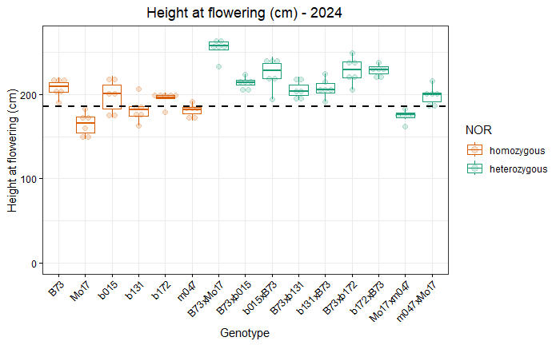

#### 2025

``` r
field_data <- readRDS("data/phenotyping/field_data.Rds")

field_data_sub <- field_data %>% filter(year=="2025")
  
  
MPV <- (mean(field_data_sub[field_data_sub$genotype=="B73",]$height_at_flowering) + mean(field_data_sub[field_data_sub$genotype=="Mo17",]$height_at_flowering))/2

# Color coding
col <- c("#d95f02", "#1b9e77")

field_data_sub %>% ggboxplot(x = "genotype", y = "height_at_flowering", 
                         color = "NOR", ylab = "Height at flowering (cm)", 
                         xlab = "Genotype", add = "dotplot", palette = col,
                         add.params = list(size=0.7, alpha = 0.2), outlier.shape = NA) + theme_bw() +
  theme(axis.text.x = element_text(angle = 45, hjust = 1)) + 
  ggtitle("Height at flowering (cm) - 2025") + 
  theme(plot.title = element_text(hjust = 0.5)) + 
  geom_hline(yintercept = MPV, linetype = "dashed", color = "black", lwd=0.8) +  theme(axis.text.x = element_text(color="black"), 
      axis.text.y = element_text(color="black"),
      axis.ticks = element_line(color = "black")) + 
      theme(plot.title = element_text(hjust = 0.5)) + 
      scale_y_continuous(labels = scales::comma_format()) + expand_limits(y = 0)
```

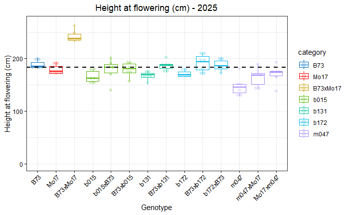

### B73xMo17

``` r
df <- field_data %>% filter(category %in% c("Mo17", "B73","B73xMo17"))

# Uses the mixed model to adjust for confounding factors (year, block)
model <- lmer(height_at_flowering ~ NOR +
                (1 | year),
              data = df)

# Compares genotype means on an equal footing
# Uses appropriate standard errors that reflect your field design
emm  <- emmeans(model, ~ NOR)

 # P-value
pairs(emm)
```

     contrast                  estimate   SE df t.ratio p.value
     homozygous - heterozygous    -60.3 4.49 49 -13.449  <.0001

    Degrees-of-freedom method: kenward-roger 

\### B73xb015

``` r
# Subset full dataset
df <- field_data %>% filter(genotype %in% c("b015", "B73","B73xb015"))

# Uses the mixed model to adjust for confounding factors (year)
model <- lmer(height_at_flowering ~ NOR +
                (1 | year),
              data = df)

# Compares genotype means on an equal footing
emm  <- emmeans(model, ~ NOR)

 # P-value
pairs(emm)
```

     contrast                  estimate   SE   df t.ratio p.value
     homozygous - heterozygous    -6.85 4.79 38.4  -1.430  0.1609

    Degrees-of-freedom method: kenward-roger 

### B73xb015

``` r
# Subset full dataset
df <- field_data %>% filter(genotype %in% c("b015", "B73","B73xb015"))

# Uses the mixed model to adjust for confounding factors (year)
model <- lmer(height_at_flowering ~ NOR +
                (1 | year),
              data = df)

# Compares genotype means on an equal footing
emm  <- emmeans(model, ~ NOR)

 # P-value
pairs(emm)
```

     contrast                  estimate   SE   df t.ratio p.value
     homozygous - heterozygous    -6.85 4.79 38.4  -1.430  0.1609

    Degrees-of-freedom method: kenward-roger 

### b015xB73

``` r
# Subset full dataset
df <- field_data %>% filter(genotype %in% c("b015", "B73","b015xB73"))

# Uses the mixed model to adjust for confounding factors (year)
model <- lmer(height_at_flowering ~ NOR +
                (1 | year),
              data = df)

# Compares genotype means on an equal footing
emm  <- emmeans(model, ~ NOR)

 # P-value
pairs(emm)
```

     contrast                  estimate   SE   df t.ratio p.value
     homozygous - heterozygous    -11.9 5.86 38.5  -2.030  0.0493

    Degrees-of-freedom method: kenward-roger

### B73xb131

``` r
df <- field_data %>% filter(genotype %in% c("b131", "B73","B73xb131"))

# Uses the mixed model to adjust for confounding factors (year, block)
model <- lmer(height_at_flowering ~ NOR +
                (1 | year),
              data = df)

# Compares genotype means on an equal footing
# Uses appropriate standard errors that reflect your field design
emm  <- emmeans(model, ~ NOR)

 # P-value
pairs(emm)
```

     contrast                  estimate   SE df t.ratio p.value
     homozygous - heterozygous    -10.1 4.57 44  -2.202  0.0330

    Degrees-of-freedom method: kenward-roger 

### b131xB73

``` r
df <- field_data %>% filter(genotype %in% c("b131", "B73","b131xB73"))

# Uses the mixed model to adjust for confounding factors (year, block)
model <- lmer(height_at_flowering ~ NOR +
                (1 | year),
              data = df)

# Compares genotype means on an equal footing
# Uses appropriate standard errors that reflect your field design
emm  <- emmeans(model, ~ NOR)

 # P-value
pairs(emm)
```

     contrast                  estimate   SE df t.ratio p.value
     homozygous - heterozygous    -10.8 4.63 44  -2.335  0.0242

    Degrees-of-freedom method: kenward-roger

### B73xb172

``` r
df <- field_data %>% filter(genotype %in% c("b172", "B73","B73xb172"))

# Uses the mixed model to adjust for confounding factors (year, block)
model <- lmer(height_at_flowering ~ NOR +
                (1 | year),
              data = df)

# Compares genotype means on an equal footing
# Uses appropriate standard errors that reflect your field design
emm  <- emmeans(model, ~ NOR)

 # P-value
pairs(emm)
```

     contrast                  estimate   SE df t.ratio p.value
     homozygous - heterozygous      -21 3.68 51  -5.724 <0.0001

    Degrees-of-freedom method: kenward-roger 

### b172xB73

``` r
df <- field_data %>% filter(genotype %in% c("b172", "B73","b172xB73"))

# Uses the mixed model to adjust for confounding factors (year, block)
model <- lmer(height_at_flowering ~ NOR +
                (1 | year),
              data = df)

# Compares genotype means on an equal footing
# Uses appropriate standard errors that reflect your field design
emm  <- emmeans(model, ~ NOR)

 # P-value
pairs(emm)
```

     contrast                  estimate   SE df t.ratio p.value
     homozygous - heterozygous    -21.6 3.52 49  -6.117 <0.0001

    Degrees-of-freedom method: kenward-roger 

### Mo17xm047

``` r
df <- field_data %>% filter(genotype %in% c("m047", "Mo17","Mo17xm047"))

# Uses the mixed model to adjust for confounding factors (year, block)
model <- lmer(height_at_flowering ~ NOR +
                (1 | year),
              data = df)

# Compares genotype means on an equal footing
# Uses appropriate standard errors that reflect your field design
emm  <- emmeans(model, ~ NOR)

 # P-value
pairs(emm)
```

     contrast                  estimate   SE df t.ratio p.value
     homozygous - heterozygous    -3.95 5.56 44  -0.710  0.4812

    Degrees-of-freedom method: kenward-roger 

### m047xMo17

``` r
df <- field_data %>% filter(genotype %in% c("m047", "Mo17","m047xMo17"))

# Uses the mixed model to adjust for confounding factors (year, block)
model <- lmer(height_at_flowering ~ NOR +
                (1 | year),
              data = df)

# Compares genotype means on an equal footing
# Uses appropriate standard errors that reflect your field design
emm  <- emmeans(model, ~ NOR)

 # P-value
pairs(emm)
```

     contrast                  estimate   SE df t.ratio p.value
     homozygous - heterozygous    -9.77 4.61 49  -2.120  0.0391

    Degrees-of-freedom method: kenward-roger 

### Heterosis plant height at flowering

``` r
# Function to calculate MPV
calculate_heterosis <- function(P1, P2, F1, phenotype, df){
  index_phenotype <-  which(grepl(phenotype, colnames(df)))
  MPV = ((mean(unlist(df[df$genotype==P1,][index_phenotype]))+mean(unlist(df[df$genotype==P2,][index_phenotype])))/2)
  F1 = mean(unlist(df[df$genotype==F1,][index_phenotype]))
  return((F1-MPV)/MPV)
}

# Create empty dataframe
df_MPH = data.frame(matrix(vector(), 9, 2,
                       dimnames=list(c(), c("hybrid", "MPH_height_at_flowering")))
)


df_MPH$hybrid <- c("B73xMo17","B73xb015",
                  "b015xB73","B73xb131",
                  "b131xB73","B73xb172",
                  "b172xB73","Mo17xm047",
                  "m047xMo17")

df_MPH$hybrid <- factor(df_MPH$hybrid, levels=c("B73xMo17","B73xb015",
                                                "b015xB73","B73xb131",
                                                "b131xB73","B73xb172",
                                                "b172xB73","Mo17xm047",
                                                "m047xMo17"), ordered=T)

# Calculate MPV for each hybrid

# Grain yield
# Height at flowering
MPH_height_at_flowering <- list()
MPH_height_at_flowering[1] <- calculate_heterosis("B73", "Mo17", "B73xMo17", "height_at_flowering", field_data)
MPH_height_at_flowering[2] <- calculate_heterosis("B73", "b015", "B73xb015", "height_at_flowering", field_data)
MPH_height_at_flowering[3] <- calculate_heterosis("B73", "b015", "b015xB73", "height_at_flowering", field_data)
MPH_height_at_flowering[4] <- calculate_heterosis("B73", "b131", "B73xb131", "height_at_flowering", field_data)
MPH_height_at_flowering[5] <- calculate_heterosis("B73", "b131", "b131xB73", "height_at_flowering", field_data)
MPH_height_at_flowering[6] <- calculate_heterosis("B73", "b172", "B73xb172", "height_at_flowering", field_data)
MPH_height_at_flowering[7] <- calculate_heterosis("B73", "b172", "b172xB73", "height_at_flowering", field_data)
MPH_height_at_flowering[8] <- calculate_heterosis("Mo17", "m047", "Mo17xm047", "height_at_flowering", field_data)
MPH_height_at_flowering[9] <- calculate_heterosis("Mo17", "m047", "m047xMo17", "height_at_flowering", field_data)

df_MPH$MPH_height_at_flowering <- unlist(MPH_height_at_flowering)

df_MPH_long <- df_MPH %>% gather(phenotype, MPH, MPH_height_at_flowering)

df_MPH_long$phenotype <- as.factor(df_MPH_long$phenotype)
```

``` r
ggbarplot(df_MPH_long,
  x = "hybrid", y = "MPH",
  ylab = "Mid-parent heterosis (%)",
  xlab = "Cross", title = "Mid-parent heterosis for plant height at flowering",
  fill = "grey", color = "black"
) +
  geom_text(aes(label = round(MPH * 100, digits = 1)),
    vjust = 1.5,
    position = position_dodge(width = 0.9)
  ) +
  geom_hline(yintercept = 0, color = "black") +
  theme_bw() +
  scale_y_continuous(labels = scales::percent_format(accuracy = 1)) +
  theme(axis.text.x = element_text(angle = 45, hjust = 1)) +
  theme(
    axis.text.x = element_text(color = "black"),
    axis.text.y = element_text(color = "black"),
    axis.ticks = element_line(color = "black")
  ) +
  theme(plot.title = element_text(hjust = 0.5))
```

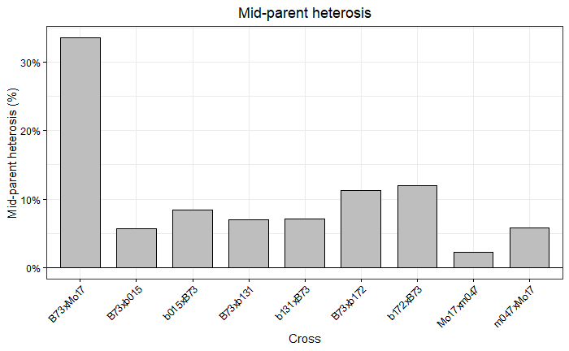

## Grain yield

All plots of 10-15 plants were collected, the moisture of the grain and
the grain mass was adjusted to 14.5% humidity and divided by the number
of plants per plot to get a mean value of grain per plant (in grams).

### Summary by genotype

``` r
field_data <- readRDS("data/phenotyping/field_data.Rds")

MPV <- (mean(field_data[field_data$genotype=="B73",]$grain_yield) + mean(field_data[field_data$genotype=="Mo17",]$grain_yield))/2

# Color coding
col <- c("#d95f02", "#1b9e77")

field_data %>% ggboxplot(
  x = "genotype", y = "grain_yield",
  color = "NOR", ylab = "Grain yield per plant (g)",
  xlab = "Genotype", add = "dotplot", palette = col,
  add.params = list(size = 0.7, alpha = 0.2), outlier.shape = NA
) + theme_bw() +
  theme(axis.text.x = element_text(angle = 45, hjust = 1)) +
  ggtitle("Grain yield") +
  theme(plot.title = element_text(hjust = 0.5)) +
  geom_hline(yintercept = MPV, linetype = "dashed", color = "black") + theme(
    axis.text.x = element_text(color = "black"),
    axis.text.y = element_text(color = "black"),
    axis.ticks = element_line(color = "black")
  ) +
  theme(plot.title = element_text(hjust = 0.5)) +
  scale_y_continuous(labels = scales::comma_format()) + expand_limits(y = 0)
```


### By year

``` r
col=c("#1b9e77","#d95f02","#7570b3")

MPV <- (mean(field_data[field_data$genotype=="B73",]$grain_yield) + mean(field_data[field_data$genotype=="Mo17",]$grain_yield))/2


ggboxplot(field_data, "genotype", "grain_yield",
  color = "year", add = "dotplot",
  xlab = "genotype", ylab = "Grain yield per plant (g)", title = "Grain yield across 3 years",
  palette = col,
  add.params = list(size = 0.7, alpha = 0.2), outlier.shape = NA
) + theme_bw() + geom_hline(yintercept = MPV, linetype = "dashed", color = "black") +
  rotate_x_text(45) + theme(plot.title = element_text(hjust = 0.5)) +  theme(axis.text.x = element_text(color="black"), 
      axis.text.y = element_text(color="black"),
      axis.ticks = element_line(color = "black")) + 
      theme(plot.title = element_text(hjust = 0.5)) + 
      scale_y_continuous(labels = scales::comma_format()) + expand_limits(y = 0)
```


#### 2022

``` r
field_data <- readRDS("data/phenotyping/field_data.Rds")

field_data_sub <- field_data %>% filter(year=="2022")
  
  
MPV <- (mean(field_data_sub[field_data_sub$genotype=="B73",]$grain_yield) + mean(field_data_sub[field_data_sub$genotype=="Mo17",]$grain_yield))/2

# Color coding
col <- c("#d95f02", "#1b9e77")

field_data_sub %>% ggboxplot(x = "genotype", y = "grain_yield", 
                         color = "NOR", ylab = "Grain yield per plant (g)", 
                         xlab = "Genotype", add = "dotplot", palette = col,
                         add.params = list(size=0.7, alpha = 0.2), outlier.shape = NA) + theme_bw() +
  theme(axis.text.x = element_text(angle = 45, hjust = 1)) + 
  ggtitle("Grain yield per plant (g) - 2022") + 
  theme(plot.title = element_text(hjust = 0.5)) + 
  geom_hline(yintercept = MPV, linetype = "dashed", color = "black", lwd=0.8) +  theme(axis.text.x = element_text(color="black"), 
      axis.text.y = element_text(color="black"),
      axis.ticks = element_line(color = "black")) + 
      theme(plot.title = element_text(hjust = 0.5)) + 
      scale_y_continuous(labels = scales::comma_format()) + expand_limits(y = 0)
```

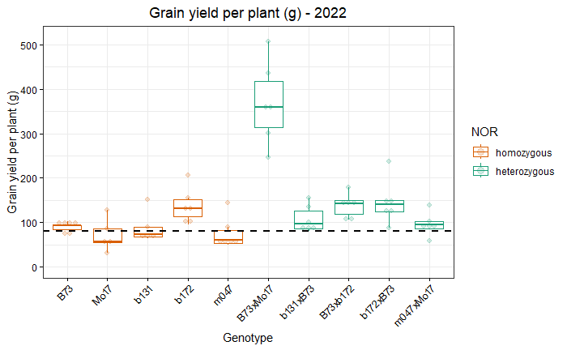

#### 2024

``` r
field_data <- readRDS("data/phenotyping/field_data.Rds")

field_data_sub <- field_data %>% filter(year=="2024")
  
  
MPV <- (mean(field_data_sub[field_data_sub$genotype=="B73",]$grain_yield) + mean(field_data_sub[field_data_sub$genotype=="Mo17",]$grain_yield))/2

# Color coding
col <- c("#d95f02", "#1b9e77")

field_data_sub %>% ggboxplot(x = "genotype", y = "grain_yield", 
                         color = "NOR", ylab = "Grain yield per plant (g)", 
                         xlab = "Genotype", add = "dotplot", palette = col,
                         add.params = list(size=0.7, alpha = 0.2), outlier.shape = NA) + theme_bw() +
  theme(axis.text.x = element_text(angle = 45, hjust = 1)) + 
  ggtitle("Grain yield per plant (g) - 2024") + 
  theme(plot.title = element_text(hjust = 0.5)) + 
  geom_hline(yintercept = MPV, linetype = "dashed", color = "black", lwd=0.8) +  theme(axis.text.x = element_text(color="black"), 
      axis.text.y = element_text(color="black"),
      axis.ticks = element_line(color = "black")) + 
      theme(plot.title = element_text(hjust = 0.5)) + 
      scale_y_continuous(labels = scales::comma_format()) + expand_limits(y = 0)
```

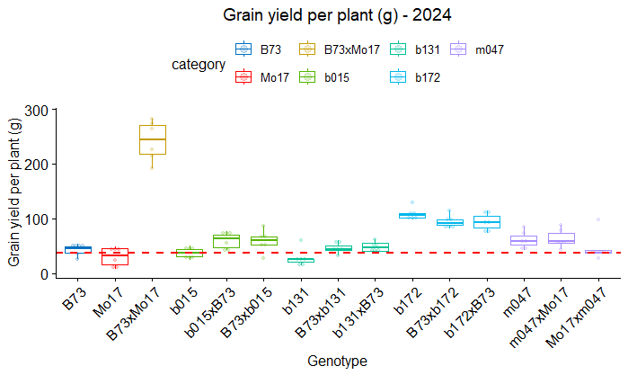

#### 2025

``` r
field_data <- readRDS("data/phenotyping/field_data.Rds")

field_data_sub <- field_data %>% filter(year=="2025")
  
  
MPV <- (mean(field_data_sub[field_data_sub$genotype=="B73",]$grain_yield) + mean(field_data_sub[field_data_sub$genotype=="Mo17",]$grain_yield))/2

# Color coding
col <- c("#d95f02", "#1b9e77")

field_data_sub %>% ggboxplot(x = "genotype", y = "grain_yield", 
                         color = "NOR", ylab = "Grain yield per plant (g)", 
                         xlab = "Genotype", add = "dotplot", palette = col,
                         add.params = list(size=0.7, alpha = 0.2), outlier.shape = NA) + theme_bw() +
  theme(axis.text.x = element_text(angle = 45, hjust = 1)) + 
  ggtitle("Grain yield per plant (g) - 2025") + 
  theme(plot.title = element_text(hjust = 0.5)) + 
  geom_hline(yintercept = MPV, linetype = "dashed", color = "black", lwd=0.8) +  theme(axis.text.x = element_text(color="black"), 
      axis.text.y = element_text(color="black"),
      axis.ticks = element_line(color = "black")) + 
      theme(plot.title = element_text(hjust = 0.5)) + 
      scale_y_continuous(labels = scales::comma_format()) + expand_limits(y = 0)
```

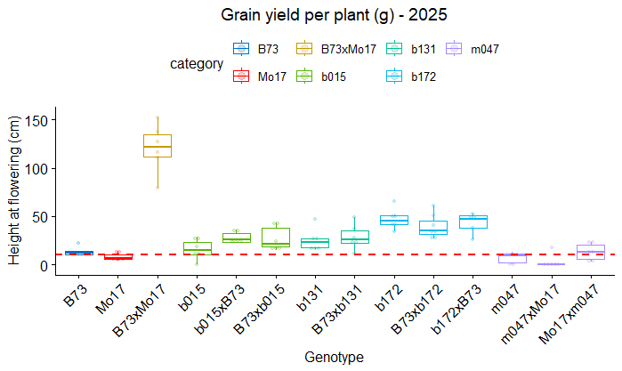

### B73xMo17

``` r
df <- field_data %>% filter(category %in% c("Mo17", "B73","B73xMo17"))

# Uses the mixed model to adjust for confounding factors (year, block)
model <- lmer(grain_yield ~ NOR +
                (1 | year),
              data = df)

# Compares genotype means on an equal footing
# Uses appropriate standard errors that reflect your field design
emm  <- emmeans(model, ~ NOR)

 # P-value
pairs(emm)
```

     contrast                  estimate   SE df t.ratio p.value
     homozygous - heterozygous    -60.3 4.49 49 -13.449  <.0001

    Degrees-of-freedom method: kenward-roger 

### B73xb015

``` r
# Subset full dataset
df <- field_data %>% filter(genotype %in% c("b015", "B73","B73xb015"))

# Uses the mixed model to adjust for confounding factors (year)
model <- lmer(grain_yield ~ NOR +
                (1 | year),
              data = df)

# Compares genotype means on an equal footing
emm  <- emmeans(model, ~ NOR)

 # P-value
pairs(emm)
```

### b015xB73

``` r
# Subset full dataset
df <- field_data %>% filter(genotype %in% c("b015", "B73","b015xB73"))

# Uses the mixed model to adjust for confounding factors (year)
model <- lmer(grain_yield ~ NOR +
                (1 | year),
              data = df)

# Compares genotype means on an equal footing
emm  <- emmeans(model, ~ NOR)

 # P-value
pairs(emm)
```

     contrast                  estimate  SE df t.ratio p.value
     homozygous - heterozygous    -16.4 3.6 38  -4.562 <0.0001

    Degrees-of-freedom method: kenward-roger 

### B73xb131

``` r
df <- field_data %>% filter(genotype %in% c("b131", "B73","B73xb131"))

# Uses the mixed model to adjust for confounding factors (year, block)
model <- lmer(grain_yield ~ NOR +
                (1 | year),
              data = df)

# Compares genotype means on an equal footing
# Uses appropriate standard errors that reflect your field design
emm  <- emmeans(model, ~ NOR)

 # P-value
pairs(emm)
```

     contrast                  estimate   SE   df t.ratio p.value
     homozygous - heterozygous    -9.55 5.66 43.1  -1.687  0.0988

    Degrees-of-freedom method: kenward-roger 

### b131xB73

``` r
df <- field_data %>% filter(genotype %in% c("b131", "B73","b131xB73"))

# Uses the mixed model to adjust for confounding factors (year, block)
model <- lmer(grain_yield ~ NOR +
                (1 | year),
              data = df)

# Compares genotype means on an equal footing
# Uses appropriate standard errors that reflect your field design
emm  <- emmeans(model, ~ NOR)

 # P-value
pairs(emm)
```

     contrast                  estimate  SE   df t.ratio p.value
     homozygous - heterozygous    -16.4 6.6 43.2  -2.486  0.0169

    Degrees-of-freedom method: kenward-roger 

### B73xb172

``` r
df <- field_data %>% filter(genotype %in% c("b172", "B73","B73xb172"))

# Uses the mixed model to adjust for confounding factors (year, block)
model <- lmer(grain_yield ~ NOR +
                (1 | year),
              data = df)

# Compares genotype means on an equal footing
# Uses appropriate standard errors that reflect your field design
emm  <- emmeans(model, ~ NOR)

 # P-value
pairs(emm)
```

     contrast                  estimate   SE df t.ratio p.value
     homozygous - heterozygous    -17.3 7.96 51  -2.168  0.0348

    Degrees-of-freedom method: kenward-roger 

### b172xB73

``` r
df <- field_data %>% filter(genotype %in% c("b172", "B73","b172xB73"))

# Uses the mixed model to adjust for confounding factors (year, block)
model <- lmer(grain_yield ~ NOR +
                (1 | year),
              data = df)

# Compares genotype means on an equal footing
# Uses appropriate standard errors that reflect your field design
emm  <- emmeans(model, ~ NOR)

 # P-value
pairs(emm)
```

     contrast                  estimate   SE df t.ratio p.value
     homozygous - heterozygous    -21.3 9.36 49  -2.276  0.0272

    Degrees-of-freedom method: kenward-roger 

### Mo17xm047

``` r
df <- field_data %>% filter(genotype %in% c("m047", "Mo17","Mo17xm047"))

# Uses the mixed model to adjust for confounding factors (year, block)
model <- lmer(grain_yield ~ NOR +
                (1 | year),
              data = df)

# Compares genotype means on an equal footing
# Uses appropriate standard errors that reflect your field design
emm  <- emmeans(model, ~ NOR)

 # P-value
pairs(emm)
```

     contrast                  estimate   SE   df t.ratio p.value
     homozygous - heterozygous    -2.74 7.96 43.4  -0.345  0.7319

    Degrees-of-freedom method: kenward-roger 

### m047xMo17

``` r
df <- field_data %>% filter(genotype %in% c("m047", "Mo17","m047xMo17"))

# Uses the mixed model to adjust for confounding factors (year, block)
model <- lmer(grain_yield ~ NOR +
                (1 | year),
              data = df)

# Compares genotype means on an equal footing
# Uses appropriate standard errors that reflect your field design
emm  <- emmeans(model, ~ NOR)

 # P-value
pairs(emm)
```

     contrast                  estimate   SE df t.ratio p.value
     homozygous - heterozygous    -11.7 6.51 49  -1.798  0.0783

    Degrees-of-freedom method: kenward-roger 

### Heterosis grain yield

``` r
# Function to calculate MPV
calculate_heterosis <- function(P1, P2, F1, phenotype, df){
  index_phenotype <-  which(grepl(phenotype, colnames(df)))
  MPV = ((mean(unlist(df[df$genotype==P1,][index_phenotype]))+mean(unlist(df[df$genotype==P2,][index_phenotype])))/2)
  F1 = mean(unlist(df[df$genotype==F1,][index_phenotype]))
  return((F1-MPV)/MPV)
}

# Create empty dataframe
df_MPH = data.frame(matrix(vector(), 9, 2,
                       dimnames=list(c(), c("hybrid", "MPH_grain_yield")))
)


df_MPH$hybrid <- c("B73xMo17","B73xb015",
                  "b015xB73","B73xb131",
                  "b131xB73","B73xb172",
                  "b172xB73","Mo17xm047",
                  "m047xMo17")


df_MPH$hybrid <- factor(df_MPH$hybrid, levels=c("B73xMo17","B73xb015",
                                                "b015xB73","B73xb131",
                                                "b131xB73","B73xb172",
                                                "b172xB73","Mo17xm047",
                                                "m047xMo17"), ordered=T)

# Calculate MPV for each hybrid

# Grain yield
# Height at flowering
MPH_grain_yield <- list()
MPH_grain_yield[1] <- calculate_heterosis("B73", "Mo17", "B73xMo17", "grain_yield", field_data)
MPH_grain_yield[2] <- calculate_heterosis("B73", "b015", "B73xb015", "grain_yield", field_data)
MPH_grain_yield[3] <- calculate_heterosis("B73", "b015", "b015xB73", "grain_yield", field_data)
MPH_grain_yield[4] <- calculate_heterosis("B73", "b131", "B73xb131", "grain_yield", field_data)
MPH_grain_yield[5] <- calculate_heterosis("B73", "b131", "b131xB73", "grain_yield", field_data)
MPH_grain_yield[6] <- calculate_heterosis("B73", "b172", "B73xb172", "grain_yield", field_data)
MPH_grain_yield[7] <- calculate_heterosis("B73", "b172", "b172xB73", "grain_yield", field_data)
MPH_grain_yield[8] <- calculate_heterosis("Mo17", "m047", "Mo17xm047", "grain_yield", field_data)
MPH_grain_yield[9] <- calculate_heterosis("Mo17", "m047", "m047xMo17", "grain_yield", field_data)

df_MPH$MPH_grain_yield <- unlist(MPH_grain_yield)

df_MPH_long <- df_MPH %>% gather(phenotype, MPH, MPH_grain_yield)

df_MPH_long$phenotype <- as.factor(df_MPH_long$phenotype)
```

``` r
ggbarplot(df_MPH_long,
    x = "hybrid", y = "MPH",
    ylab = "Mid-parent heterosis (%)",
    xlab = "Cross", title = "Mid-parent heterosis for grain yield",
     fill = "grey", color = "black"
  ) +
  geom_hline(yintercept = 0, color = "black") +
  theme_bw() +
  scale_y_continuous(labels = scales::percent_format(accuracy = 1)) +
  theme(axis.text.x = element_text(angle = 45, hjust = 1)) +
  theme(
    axis.text.x = element_text(color = "black"),
    axis.text.y = element_text(color = "black"),
    axis.ticks = element_line(color = "black")
  ) +
  theme(plot.title = element_text(hjust = 0.5))
```

``` r
ggbarplot(df_MPH_long,
  x = "hybrid", y = "MPH",
  ylab = "Mid-parent heterosis (%)",
  xlab = "Cross", title = "Mid-parent heterosis for grain yield",
  fill = "grey", color = "black"
) +
  geom_text(aes(label = round(MPH * 100, digits = 1)),
    vjust = 1.5,
    position = position_dodge(width = 0.9)
  ) +
  geom_hline(yintercept = 0, color = "black") +
  theme_bw() +
  scale_y_continuous(labels = scales::percent_format(accuracy = 1)) +
  theme(axis.text.x = element_text(angle = 45, hjust = 1)) +
  theme(
    axis.text.x = element_text(color = "black"),
    axis.text.y = element_text(color = "black"),
    axis.ticks = element_line(color = "black")
  ) +
  theme(plot.title = element_text(hjust = 0.5))
```

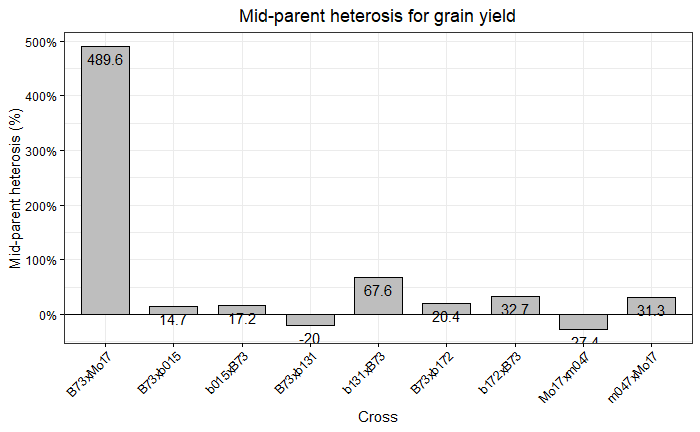

1.  

# 

# RNA-seq analysis

# 

## Data

NEBNext Ultra II Directional RNA Library Prep Kit (NEB \#E7760). Three
repetitions of each sample, paired-end reads (use the option
“rna-strandness RF” if using HISAT2 mapper).

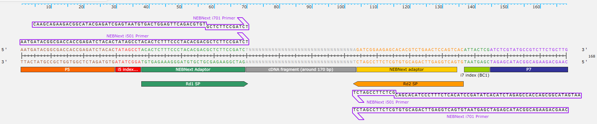

``` bash
# Location fastq files
/mnt/ceph-hdd/projects/scc_uanp_scholten/data/ngs_data/BGI_data/F22FTSEUHT1495_LIBfbksR_mRNA_sRNA_degradome_johan_doga/F22FTSEUHT1495_LIBfbksR_PE100
```

Add tables once the SRR numbers are available.

## R libraries

``` r
library(tidyverse)
library(ggpubr)
library(gghighlight)
library(DESeq2)
library(Biostrings)
library(viridis)
library(tximport)
library(EnhancedVolcano)
library(ComplexHeatmap)
library(SuperExactTest)

fasta_to_df <- function(path){
  fasta = readLines(path)
  ids = grepl(">", fasta)
  f = data.frame(
    id = sub(">", "", fasta[ids]),
    sequence = tapply(fasta[!ids], cumsum(ids)[!ids], function(x) {
      paste(x, collapse = "")
    }))
  return(f)
}

make_fasta <-  function(vector_sequence, path_output, sequence_names){
  if(is.vector(vector_sequence)){
    len_seq <- length(vector_sequence)
    Xfasta <- character(len_seq * 2)
    if(missing(sequence_names)){
      Xfasta[c(TRUE, FALSE)] <- paste0(">seq", 1:len_seq)
    } else {
      Xfasta[c(TRUE, FALSE)] <- sequence_names
    }
    Xfasta[c(FALSE, TRUE)] <- as.character(vector_sequence)
    writeLines(Xfasta, path_output)
  } 
  else {
      stop("Argument is not a vector")
    }
}

# Source function for GO analysis (download repo https://github.com/johanzi/GOMAP_maize_B73_NAM5)
source("P:/git_repositories/GOMAP_maize_B73_NAM5/go_functions.R", chdir = T)


perform_GO <- function(list_genes){

  list_ego_results <- ego_analysis(list_genes)
  
  lapply(list_ego_results, function(x) sum(x@result$p.adjust < 0.05))
  
  df_ego_analysis <- enrichResult2dataframe(list_ego_results)
  
  df_ego_analysis_significant <- df_ego_analysis %>% dplyr::filter(p.adjust < 0.05)
  
  p1 <- df_ego_analysis_significant %>% filter(ontology=="BP") %>% arrange(qvalue) %>% 
    head(10) %>% 
    mutate(Description = fct_reorder(Description, FoldEnrich)) %>%
    ggplot(aes(x=FoldEnrich, y=Description, color=-log10(qvalue))) +
    geom_point(aes(size = Count))  + xlab("Fold enrichment") + 
    ylab("GO term") + 
    ggtitle("BP GO enrichment") +
    theme_bw() +
    theme(axis.text.x = element_text(color="black"),
          axis.text.y = element_text(color="black"),
          axis.ticks = element_line(color = "black")) +
    theme(plot.title = element_text(hjust = 0.5)) +
    scale_size_area(max_size = 10) +
    scale_color_viridis()
  
  p2 <- df_ego_analysis_significant %>% filter(ontology=="MF") %>% arrange(qvalue) %>% 
    head(10) %>% 
    mutate(Description = fct_reorder(Description, FoldEnrich)) %>%
    ggplot(aes(x=FoldEnrich, y=Description, color=-log10(qvalue))) +
    geom_point(aes(size = Count))  + xlab("Fold enrichment") + 
    ylab("GO term") + 
    ggtitle("MF GO enrichment") +
    theme_bw() +
    theme(axis.text.x = element_text(color="black"),
          axis.text.y = element_text(color="black"),
          axis.ticks = element_line(color = "black")) +
    theme(plot.title = element_text(hjust = 0.5)) +
    scale_size_area(max_size = 10) +
    scale_color_viridis()
  
  p3 <- df_ego_analysis_significant %>% filter(ontology=="CC") %>% arrange(qvalue) %>% 
    head(10) %>% 
    mutate(Description = fct_reorder(Description, FoldEnrich)) %>%
    ggplot(aes(x=FoldEnrich, y=Description, color=-log10(qvalue))) +
    geom_point(aes(size = Count))  + xlab("Fold enrichment") + 
    ylab("GO term") + 
    ggtitle("CC GO enrichment") +
    theme_bw() +
    theme(axis.text.x = element_text(color="black"),
          axis.text.y = element_text(color="black"),
          axis.ticks = element_line(color = "black")) +
    theme(plot.title = element_text(hjust = 0.5)) +
    scale_size_area(max_size = 10) +
    scale_color_viridis()

    p4 <- df_ego_analysis_significant %>% arrange(qvalue) %>% 
    head(10) %>% 
    mutate(Description = fct_reorder(Description, FoldEnrich)) %>%
    ggplot(aes(x=FoldEnrich, y=Description, color=-log10(qvalue))) +
    geom_point(aes(size = Count))  + xlab("Fold enrichment") + 
    ylab("GO term") + 
    ggtitle("GO enrichment") +
    theme_bw() +
    theme(axis.text.x = element_text(color="black"),
          axis.text.y = element_text(color="black"),
          axis.ticks = element_line(color = "black")) +
    theme(plot.title = element_text(hjust = 0.5)) +
    scale_size_area(max_size = 10) +
    scale_color_viridis()
  
  return(list(p1,p2,p3,p4))
  
}


plot_gene <- function(geneID) {
  
  data <- plotCounts(dds,
    gene = geneID, intgroup = "genotype",
    main = geneID, return = TRUE
  )

  data$genotype <- factor(data$genotype, 
                          levels = c("B73", "Mo17", "b015", "b131", 
                                     "b172", "m047", "B73xMo17", 
                                     "B73xb015", "b131xB73", "B73xb172", 
                                     "b172xB73", "m047xMo17"), ordered = T)

  p <- data %>%
    ggplot(aes(x = genotype, y = count)) +
    geom_boxplot(fill = "white", outlier.colour = NA) +
    geom_point(size = 2) +
    theme_bw() +
    ggtitle(geneID) +
    theme(plot.title = element_text(hjust = 0.5)) +
    ylab("Normalized read count") +
    xlab("Genotype") +
    theme(axis.text.x = element_text(angle = 90, hjust = 1))
  
  return(p)
  
}

reorder_samples <- function(df){
    df$genotype <- factor(df$genotype, levels = c("B73", "Mo17", "b015", "b131", "b172", "m047", "B73xMo17", "B73xb015", "b131xB73", "B73xb172", "b172xB73", "m047xMo17"), ordered = T)
    return(df)
}
```

## Ressources

### Genes co-regulated genes with rRNAs (Li et al., 2018)

[Li et al 2018](https://genome.cshlp.org/content/28/10/1555) describes
1438 genes co-regulated with rRNAs but only 112 have an ID (AGPv4)
described in TableS7. Copy these IDs and search for the B73 NAM5
equivalent. I found 106 genes matching.

``` bash
# Get dictionary gene ID between B73 annotations

https://download.maizegdb.org/Pan-genes/B73_gene_xref/B73v3_to_B73v5.tsv

while read i; do 
  grep -w $i B73v3_to_B73v5.tsv
done < list_112.txt > list_112_translated.txt

cut -f2 list_112_translated.txt > list_112_translated_NAM5.txt
 
# Some ID have several NAM5 ID
sed 's/,/\n/g' list_112_translated_NAM5.txt | sed '/^$/d' > 112_genes_Li_2018_translation_v5_v3.txt

wc -l 112_genes_Li_2018_translation_v5_v3.txt
106 112_genes_Li_2018_translation_v5_v3.txt
```

#### GO enrichment

``` r
genes_Li_2018_translation_v5_v3 <- read.delim("data/annotations/112_genes_Li_2018_translation_v5_v3.txt", header=FALSE)

lp <- perform_GO(genes_Li_2018_translation_v5_v3$V1)

(lp[[1]] | lp[[2]] | lp[[3]])
```

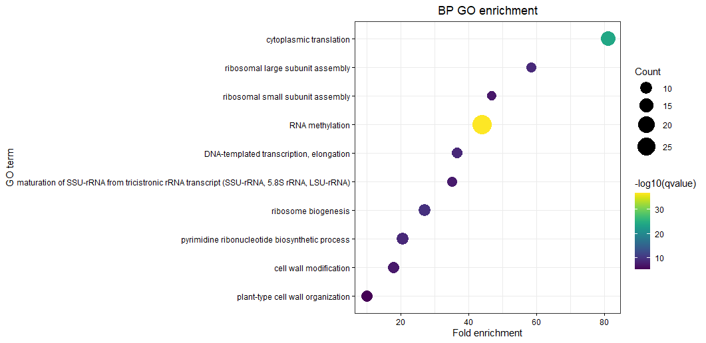

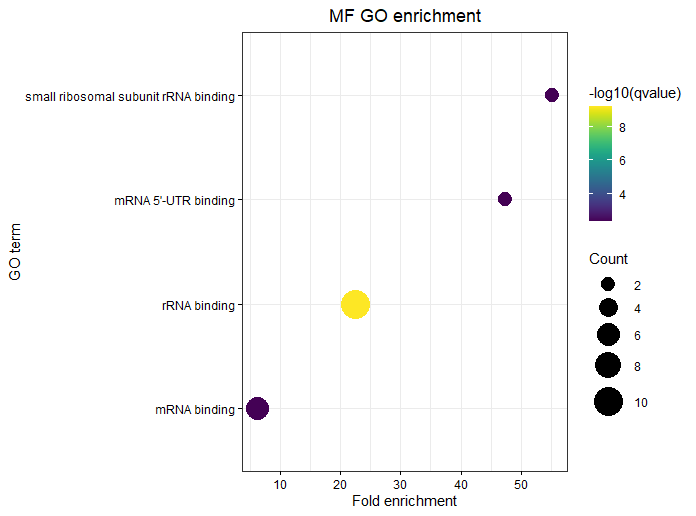

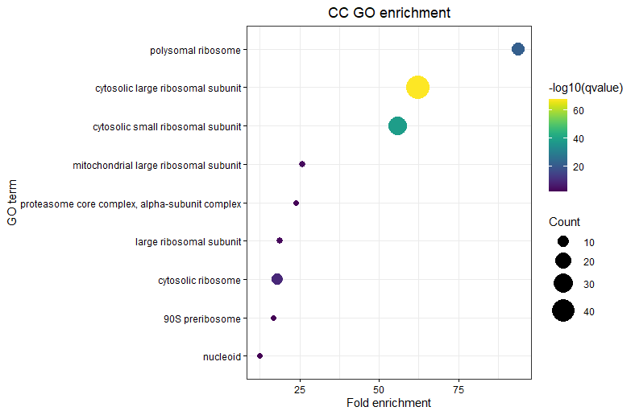

We find indeed many GO terms related to ribosomes.

### Genes Birdseye 2021

Retrieve geneID from Supplemental Table 1 (PDF,
<https://www.pnas.org/doi/suppl/10.1073/pnas.2109332118#supplementary-materials>)
and convert v4 to v5 geneID

``` bash

while read i; do 
  grep -w $i B73v4_to_B73v5.tsv
done < list_birdseye_2021_v4.txt | cut -f2 - > list_birdseye_2021_v5.txt

# Some ID have several NAM5 ID
sed -i 's/,/\n/g' list_birdseye_2021_v5.txt 
sed -i '/^$/d' list_birdseye_2021_v5.txt

wc -l list_birdseye_2021_v5.txt
58 list_birdseye_2021_v5.txt

bash list_to_rvector.sh list_birdseye_2021_v5.txt
```

``` r
list_birdseye_2021 <- c("Zm00001eb345040", "Zm00001eb346280", "Zm00001eb258070", "Zm00001eb331750", "Zm00001eb426530", "Zm00001eb426540", "Zm00001eb426560", "Zm00001eb426550", "Zm00001eb025350", "Zm00001eb046590", "Zm00001eb152010", "Zm00001eb195160", "Zm00001eb210370", "Zm00001eb415360", "Zm00001eb012130", "Zm00001eb297590", "Zm00001eb169360", "Zm00001eb172090", "Zm00001eb072370", "Zm00001eb103340", "Zm00001eb332630", "Zm00001eb333790", "Zm00001eb353650", "Zm00001eb364200", "Zm00001eb367450", "Zm00001eb212080", "Zm00001eb212090", "Zm00001eb222850", "Zm00001eb225380", "Zm00001eb231800", "Zm00001eb237980", "Zm00001eb255290", "Zm00001eb258190", "Zm00001eb308420", "Zm00001eb424280", "Zm00001eb001640", "Zm00001eb001840", "Zm00001eb008100", "Zm00001eb008910", "Zm00001eb013020", "Zm00001eb017180", "Zm00001eb043240", "Zm00001eb047510", "Zm00001eb054380", "Zm00001eb058750", "Zm00001eb063340", "Zm00001eb064130", "Zm00001eb064960", "Zm00001eb064950", "Zm00001eb287080", "Zm00001eb134780", "Zm00001eb157660", "Zm00001eb159080", "Zm00001eb383810", "Zm00001eb394520", "Zm00001eb395590", "Zm00001eb204010", "Zm00001eb388810")

saveRDS(list_birdseye_2021, "data/annotations/list_58_genes_birdseye_2021.Rds")
```

### Non-additively expressed genes Pitz 2025

Copy the table Dataset_S2 in supplementary Excel file from Pitz et al
2025 (New Phytologist)
<https://nph.onlinelibrary.wiley.com/doi/full/10.1111/nph.70128>

``` r
df_NAG_Pitz_2025_NP <- read.delim("data/annotations/list_NAG_Pitz_2025_NP.txt", stringsAsFactors = T)
  
# df_SPE_Pitz_2025_GB <- read.delim("data/annotations/list_SPE_Pitz_2025_GB.txt", stringsAsFactors = T)

# 1959 unique geneID
df_NAG_unique <- unique(df_NAG_Pitz_2025_NP$gene)

lp <- perform_GO(df_NAG_unique)

lp[[1]]

lp[[2]]

lp[[3]]
```

## Quality check fastq files

``` bash

#!/bin/bash
#
#SBATCH --job-name=fastqc
#SBATCH --partition=medium
#SBATCH --nodes=1
#SBATCH --mem=4Gb
#SBATCH --cpus-per-task=12
#SBATCH --output=output_fastqc/slurm.%A.%a.out
#SBATCH --error=output_fastqc/slurm.%A.%a.err
#SBATCH --partition=medium
#SBATCH --time=48:00:00
#SBATCH --array=1-72

module load fastqc

i=$(\ls -1 *gz | sed -n ${SLURM_ARRAY_TASK_ID}p)

fastqc -t 12 -o output_fastqc $i
```

1.  

## Introgression calling (Marion’s part)

Work done by Marion Pitz following [Pitz et al
2025](https://onlinelibrary.wiley.com/doi/abs/10.1111/nph.70128).

Put details script here.

### Reference genome

B73 NAM5 is used as reference genome.

``` bash
wget ftp://ftp.ensemblgenomes.org/pub/plants/release-51/fasta/zea_mays/dna/Zea_mays.Zm-B73-REFERENCE-NAM-5.0.dna.toplevel.fa.gz
```

### Get GTF file

This is gene annotation file.

``` bash
wget ftp://ftp.ensemblgenomes.org/pub/plants/release-51/gtf/zea_mays/Zea_mays.Zm-B73-REFERENCE-NAM-5.0.51.gtf.gz
```

In other cases gene annotation file may require some processing like
uncompressing with gunzip, conversion to GTF format, change the names of
chromosomes to match the names in Fasta file.

``` bash
gunzip Zea_mays.Zm-B73-REFERENCE-NAM-5.0.dna.toplevel.fa.gz
gunzip Zea_mays.Zm-B73-REFERENCE-NAM-5.0.51.gtf.gz
```

### HISAT2 mapping

<https://daehwankimlab.github.io/hisat2/manual/>

### Genome index

SLURM can be used at HPC for threading, but not used here.

For HPC:

``` bash
module load spack-user 
module load hisat2/2.1.0 # load mapper
```

For Unix:

``` bash
conda install hisat2
```

``` bash
hisat2-build Zea_mays.Zm-B73-REFERENCE-NAM-5.0.dna.toplevel.fa B73_NAM5    # create reference genome index to align reads to the reference genome
```

The protocol <https://www.nature.com/articles/nprot.2016.095#Tab1>
recommends to create a file for exons and splice sites before creating
the HISAT index. The two files generated by the Python scripts
hisat2_extract_exons.py and hisat2_extract_splice_sites.py are bed files
of the locations of splicing sites and exons and the corresponding
strand orientation.

``` bash
wget https://raw.githubusercontent.com/DaehwanKimLab/hisat2/master/hisat2_extract_exons.py

wget https://raw.githubusercontent.com/DaehwanKimLab/hisat2/master/hisat2_extract_splice_sites.py

python hisat2_extract_exons.py Zea_mays.Zm-B73-REFERENCE-NAM-5.0.51.gtf > Zea_mays.Zm-B73-REFERENCE-NAM-5.0.51.exon

python hisat2_extract_splice_sites.py Zea_mays.Zm-B73-REFERENCE-NAM-5.0.51.gtf > Zea_mays.Zm-B73-REFERENCE-NAM-5.0.51.ss

hisat2-build --ss Zea_mays.Zm-B73-REFERENCE-NAM-5.0.51.ss --exon Zea_mays.Zm-B73-REFERENCE-NAM-5.0.51.exon -f Zea_mays.Zm-B73-REFERENCE-NAM-5.0.dna.toplevel.fa B73_NAM5_with_exon_ss     # memory issue, had to be performed on HPC with 200 Gb RAM reservation.
```

Alternative without exon and ss for comparison of alignment rate and
running time:

``` bash
hisat2-build -p 8 -f Zea_mays.Zm-B73-REFERENCE-NAM-5.0.dna.toplevel.fa B73_NAM5_without_exon_ss    # -p for threading
```

Indexing was performed on HPC by Johan, because of memory limit on Linux
PC. Following commands were performed:

``` bash
module load hisat2

wget https://raw.githubusercontent.com/DaehwanKimLab/hisat2/master/hisat2_extract_splice_sites.py
wget https://raw.githubusercontent.com/DaehwanKimLab/hisat2/master/hisat2_extract_exons.py

python hisat2_extract_exons.py Zea_mays.Zm-B73-REFERENCE-NAM-5.0.51.gtf > Zea_mays.Zm-B73-REFERENCE-NAM-5.0.51.exon

python hisat2_extract_splice_sites.py Zea_mays.Zm-B73-REFERENCE-NAM-5.0.51.gtf > Zea_mays.Zm-B73-REFERENCE-NAM-5.0.51.ss

srun --time=48:00:00 --mem=200G --cpus-per-task=16 hisat2-build -p 16 --exon Zea_mays.Zm-B73-REFERENCE-NAM-5.0.51.exon --ss Zea_mays.Zm-B73-REFERENCE-NAM-5.0.51.ss ../Zea_mays.Zm-B73-REFERENCE-NAM-5.0.dna.toplevel.fa B73_NAM5
```

### Map reads, including exon and splicing site information

The libraries were made with the NEBNext Ultra II Directional RNA
Library Prep Kit (NEB \#E7760). Three repetitions of each sample,
paired-end reads (use the argument “–rna-strandness RF” in HISAT2).
<https://chipster.csc.fi/manual/library-type-summary.html>,
<https://www.youtube.com/watch?v=OoBITqzcy1Y> If strandness is unknown,
it can be guessed with “infer_experiment.py” using mapped read
information (bam/sam file).
<https://rseqc.sourceforge.net/#infer-experiment-py> Alternatively,
visual approach via IGV can be used - input bam files need to be sorted
and indexed.

``` bash

while read i; do
  read1="${i}_1.fq.gz"
  read2="${i}_2.fq.gz"
  output_name=$(basename $i | cut -d_ -f1-2)
  hisat2 -p 12 --rf --dta -x reference_genome/B73_NAM5 -1 $read1 -2 $read2 | samtools view -bS -F 4 - | samtools sort - -o mapped_bam/${output_name}.bam
  # Index bam file
  samtools index mapped_bam/${output_name}.bam
done <<<$(find raw_fastq -name "*fq.gz" | cut -d_ -f1-5 | sort | uniq)
```

### Keep only reads mapping to chromosomes 1-10

Keep only reads mapping to chromosomes 1-10 and discard reads mapping to
scaffolds.

``` bash
mkdir only_chr_bam

for i in *bam; do
  samtools view -b $i 1 2 3 4 5 6 7 8 9 10 > only_chr_bam/$i
done
```

1.  

## Allele-specific expression A/T 25S

Quantify the expression of the 35S transcriptional units being expressed
in the different samples using the A/T polymorphism present in B73
(CTTGAAAATCCGGAGGACCGAAT\[A/T\]) on subunit 25S and described in [Juppe
and Zimmer, 1993](https://doi.org/10.1007/BF00027113).

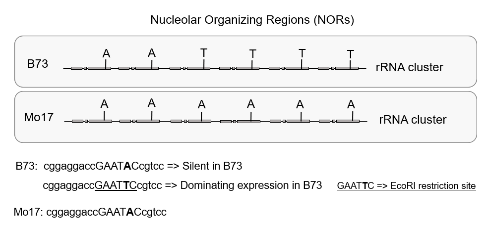

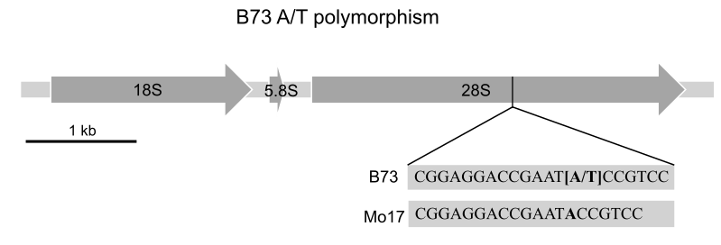

This same polymorphism was reused to identify B73/Mo17 allele-specific
expression bias of 45S rDNA with a kmer approach in [Liu et al.,
2017](https://www.nature.com/articles/srep42444).

We expect only T allele in B73, only A allele in Mo17, and 50/50 in
crosses if we have a additive expression levels of the B73 and Mo17 NORs
in the heterozygous plants.

### Data trimming

``` bash
mkdir /mnt/ceph-hdd/projects/scc_uanp_scholten/data/ngs_data/BGI_data/F22FTSEUHT1495_LIBfbksR_mRNA_sRNA_degradome_johan_doga/F22FTSEUHT1495_LIBfbksR_PE100/trimmed_fastq
```

``` bash
#!/bin/bash
#
#SBATCH --job-name=trimming_cutadapt
#SBATCH --nodes=1
#SBATCH --cpus-per-task=8
#SBATCH --mem=16000
#SBATCH --output=log/slurm.%j.%A.%a.out
#SBATCH --error=log/slurm.%j.%A.%a.err
#SBATCH --partition=scc-cpu
#SBATCH --time=04:00:00
#SBATCH --mail-type=END
#SBATCH --mail-user=johan.zicola@uni-goettingen.de
#SBATCH --array=1-36

module load apptainer/1.3.4

app_shortcut="apptainer run --bind /mnt/ceph-hdd/projects/scc_uanp_scholten/data/ngs_data/BGI_data/F22FTSEUHT1495_LIBfbksR_mRNA_sRNA_degradome_johan_doga/F22FTSEUHT1495_LIBfbksR_PE100/ /sw/container/bioinformatics/cutadapt-5.0.sif"

input_file=$(sed -n ${SLURM_ARRAY_TASK_ID}p sample_id.txt)

$app_shortcut cutadapt \
  -j 8 \
  -a AGATCGGAAGAGCACACGTCTGAACTCCAGTCA \
  -A AGATCGGAAGAGCGTCGTGTAGGGAAAGAGTGT \
  -q 20,20 \
  --minimum-length 20 \
  -o trimmed_fastq/${input_file}_1.trimmed.fq.gz \
  -p trimmed_fastq/${input_file}_2.trimmed.fq.gz \
  raw_data/${input_file}/${input_file}_L1_1.fq.gz \
  raw_data/${input_file}/${input_file}_L1_2.fq.gz
```

### Mapping to active 35S transcriptional unit

``` bash
# Get genome
wget https://download.maizegdb.org/Zm-B73-REFERENCE-NAM-5.0/Zm-B73-REFERENCE-NAM-5.0.fa.gz
gunzip Zm-B73-REFERENCE-NAM-5.0.fa.gz

echo -e "chr6\t16802261\t16808035\t35SS\t.\t-" > seq_35S_B73_T_allele.bed

bedtools getfasta -s -fi /mnt/ceph-hdd/projects/scc_uanp_scholten/data/databases/genomes/B73_NAM5/Zm-B73-REFERENCE-NAM-5.0.fa -bed seq_35S_B73_T_allele.bed > seq_35S_B73_T_allele.fa

# Rename sequence rDNA_35S_allele_T
sed -i '1 s/.*/>rDNA_35S_allele_T/' seq_35S_B73_T_allele.fa

bowtie-build -f seq_35S_B73_T_allele.fa seq_35S_B73_T_allele
```

``` bash

#!/bin/bash
#
#SBATCH --job-name=bowtie_mapping
#SBATCH --nodes=1
#SBATCH --cpus-per-task=10
#SBATCH --mem=16000
#SBATCH --output=log/slurm.%j.%A.%a.out
#SBATCH --error=log/slurm.%j.%A.%a.err
#SBATCH --partition=scc-cpu
#SBATCH --time=01:00:00
#SBATCH --mail-type=END
#SBATCH --mail-user=johan.zicola@uni-goettingen.de
#SBATCH --array=1-36

module load gcc bowtie samtools

input_file=$(sed -n ${SLURM_ARRAY_TASK_ID}p sample_id.txt)

path_fastq="/mnt/ceph-hdd/projects/scc_uanp_scholten/data/ngs_data/BGI_data/F22FTSEUHT1495_LIBfbksR_mRNA_sRNA_degradome_johan_doga/F22FTSEUHT1495_LIBfbksR_PE100/trimmed_fastq"

outdir="/mnt/ceph-hdd/workspaces/ws/scc_uanp_scholten/u14929-nor_nil_project/rnaseq/mapping_35S_T_allele"

bowtie -p 8 -S -x seq_35S_B73_T_allele \
-1 ${path_fastq}/${input_file}_1.trimmed.fq.gz -2 ${path_fastq}/${input_file}_2.trimmed.fq.gz | \
samtools view -F 4 -b |  samtools sort -o ${outdir}/mapped_reads/${input_file}.bam - 

samtools index ${outdir}/mapped_reads/${input_file}.bam
```

Visualize bam files on IGV at position 4223. The A/T polymorphism is
clearly visible and seems to follow an addtive expression pattern with
50/50 in NOR heterozygous plants, 100% T in B73 and 100% A in Mo17.

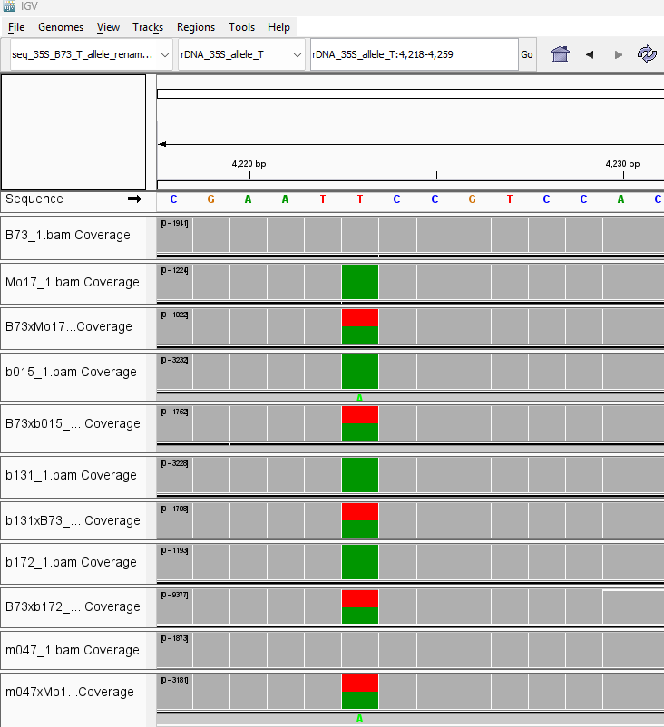

Gather read counts for each sample.

``` bash
for i in *bam; do 
  nb_reads=$(samtools flagstats $i | grep "in total" | cut -d' ' -f1)
  echo -e "$i\t$nb_reads"
done | sort -k2n

b131xB73_3.bam  32864
b131_2.bam      41860
B73_2.bam       42372
B73xMo17_1.bam  43116
b131_3.bam      44208
m047_2.bam      45416
B73xb015_3.bam  47992
Mo17_1.bam      48312
B73xb015_2.bam  54102
b172_1.bam      56296
b172_2.bam      57604
b172xB73_3.bam  58176
B73xMo17_2.bam  63764
b131xB73_1.bam  64780
b015_3.bam      66152
b172xB73_2.bam  67022
Mo17_3.bam      67716
b131xB73_2.bam  70768
B73_1.bam       72610
b172xB73_1.bam  74252
B73xb015_1.bam  74718
m047_1.bam      75960
m047xMo17_3.bam 89518
B73xMo17_3.bam  103374
b131_1.bam      117132
b015_2.bam      121942
b172_3.bam      124260
m047xMo17_1.bam 132896
B73xb172_2.bam  135610
b015_1.bam      147148
m047_3.bam      151402
B73_3.bam       236124
Mo17_2.bam      260648
m047xMo17_2.bam 313012
```

### A/T calling

``` bash

#!/bin/bash
#
#SBATCH --job-name=bowtie_mapping
#SBATCH --nodes=1
#SBATCH --cpus-per-task=1
#SBATCH --mem=10G
#SBATCH --output=log/slurm.%j.%A.%a.out
#SBATCH --error=log/slurm.%j.%A.%a.err
#SBATCH --partition=scc-cpu
#SBATCH --time=01:00:00
#SBATCH --mail-type=END
#SBATCH --mail-user=johan.zicola@uni-goettingen.de

module load bcftools

for i in mapped_reads/*bam; do
  call=$(bcftools mpileup \
      -d 320000 \
      -f seq_35S_B73_T_allele.fa \
      -r rDNA_35S_allele_T:4223-4223 \
      -a FORMAT/DP,FORMAT/AD \
      $i \
      -Ou |
  bcftools query -f '%CHROM\t%POS\t%REF\t%ALT[\t%DP\t%AD]\n')
  name=$(basename "$i" | cut -d. -f1)
  echo -e "$name\t$call" >> call_pos_4223.txt
done
```

``` bash
cat call_pos_4223.txt
B73_1   rDNA_35S_allele_T       4223    T       A,G,<*> 1591    1584,6,1,0
B73_2   rDNA_35S_allele_T       4223    T       A,C,<*> 747     737,8,2,0
B73_3   rDNA_35S_allele_T       4223    T       A,C,G   5364    5331,28,3,2
B73xMo17_1      rDNA_35S_allele_T       4223    T       A,C,<*> 822     416,405,1,0
B73xMo17_2      rDNA_35S_allele_T       4223    T       A,C,<*> 1166    689,476,1,0
B73xMo17_3      rDNA_35S_allele_T       4223    T       A,C,<*> 2183    1204,977,2,0
B73xb015_1      rDNA_35S_allele_T       4223    T       A,C,<*> 1482    752,729,1,0
B73xb015_2      rDNA_35S_allele_T       4223    T       A,C,<*> 1089    556,532,1,0
B73xb015_3      rDNA_35S_allele_T       4223    T       A,C,<*> 956     531,423,2,0
B73xb172_1      rDNA_35S_allele_T       4223    T       A,C,G   7615    3895,3710,7,3
B73xb172_2      rDNA_35S_allele_T       4223    T       A,C,G   2734    1394,1333,5,2
Mo17_1  rDNA_35S_allele_T       4223    T       A,C,<*> 1023    2,1020,1,0
Mo17_2  rDNA_35S_allele_T       4223    T       A,G,C   5944    10,5926,5,3
Mo17_3  rDNA_35S_allele_T       4223    T       A,<*>   1207    33,1174,0
b015_1  rDNA_35S_allele_T       4223    T       A,C,G   2708    4,2698,5,1
b015_2  rDNA_35S_allele_T       4223    T       A,C,G   2122    9,2110,2,1
b015_3  rDNA_35S_allele_T       4223    T       A,G,<*> 1098    9,1088,1,0
b131_1  rDNA_35S_allele_T       4223    T       A,C,<*> 2609    9,2593,7,0
b131_2  rDNA_35S_allele_T       4223    T       A,<*>   767     22,745,0
b131_3  rDNA_35S_allele_T       4223    T       A,C,G   777     17,758,1,1
b131xB73_1      rDNA_35S_allele_T       4223    T       A,G,C   1447    726,716,3,2
b131xB73_2      rDNA_35S_allele_T       4223    T       A,G,C   1816    924,890,1,1
b131xB73_3      rDNA_35S_allele_T       4223    T       A,G,<*> 566     270,295,1,0
b172_1  rDNA_35S_allele_T       4223    T       A,G,<*> 1007    1,1005,1,0
b172_2  rDNA_35S_allele_T       4223    T       A,G,<*> 1077    11,1065,1,0
b172_3  rDNA_35S_allele_T       4223    T       A,C,G   2074    19,2052,2,1
b172xB73_1      rDNA_35S_allele_T       4223    T       A,<*>   1616    843,773,0
b172xB73_2      rDNA_35S_allele_T       4223    T       A,C,G   1484    798,679,5,2
b172xB73_3      rDNA_35S_allele_T       4223    T       A,C,<*> 1020    561,458,1,0
m047_1  rDNA_35S_allele_T       4223    T       A,G,C   1540    1535,3,1,1
m047_2  rDNA_35S_allele_T       4223    T       A,C,<*> 838     831,6,1,0
m047_3  rDNA_35S_allele_T       4223    T       A,C,G   3380    3290,76,7,7
m047xMo17_1     rDNA_35S_allele_T       4223    T       A,G,<*> 2692    1360,1331,1,0
m047xMo17_2     rDNA_35S_allele_T       4223    T       A,C,G   7445    3841,3577,20,7
m047xMo17_3     rDNA_35S_allele_T       4223    T       A,C,G   1784    908,866,9,1
```

| sample      | DP   | T    | A    | fraction_T | fraction_A |
|-------------|------|------|------|------------|------------|
| B73_1       | 1591 | 1584 | 6    | 100%       | 0%         |
| B73_2       | 747  | 737  | 8    | 99%        | 1%         |
| B73_3       | 5364 | 5331 | 28   | 99%        | 1%         |
| B73xMo17_1  | 822  | 416  | 405  | 51%        | 49%        |
| B73xMo17_2  | 1166 | 689  | 476  | 59%        | 41%        |
| B73xMo17_3  | 2183 | 1204 | 977  | 55%        | 45%        |
| B73xb015_1  | 1482 | 752  | 729  | 51%        | 49%        |
| B73xb015_2  | 1089 | 556  | 532  | 51%        | 49%        |
| B73xb015_3  | 956  | 531  | 423  | 56%        | 44%        |
| B73xb172_1  | 7615 | 3895 | 3710 | 51%        | 49%        |
| B73xb172_2  | 2734 | 1394 | 1333 | 51%        | 49%        |
| Mo17_1      | 1023 | 2    | 1020 | 0%         | 100%       |
| Mo17_2      | 5944 | 10   | 5926 | 0%         | 100%       |
| Mo17_3      | 1207 | 33   | 1174 | 3%         | 97%        |
| b015_1      | 2708 | 4    | 2698 | 0%         | 100%       |
| b015_2      | 2122 | 9    | 2110 | 0%         | 100%       |
| b015_3      | 1098 | 9    | 1088 | 1%         | 99%        |
| b131_1      | 2609 | 9    | 2593 | 0%         | 100%       |
| b131_2      | 767  | 22   | 745  | 3%         | 97%        |
| b131_3      | 777  | 17   | 758  | 2%         | 98%        |
| b131xB73_1  | 1447 | 726  | 716  | 50%        | 50%        |
| b131xB73_2  | 1816 | 924  | 890  | 51%        | 49%        |
| b131xB73_3  | 566  | 270  | 295  | 48%        | 52%        |
| b172_1      | 1007 | 1    | 1005 | 0%         | 100%       |
| b172_2      | 1077 | 11   | 1065 | 1%         | 99%        |
| b172_3      | 2074 | 19   | 2052 | 1%         | 99%        |
| b172xB73_1  | 1616 | 843  | 773  | 52%        | 48%        |
| b172xB73_2  | 1484 | 798  | 679  | 54%        | 46%        |
| b172xB73_3  | 1020 | 561  | 458  | 55%        | 45%        |
| m047_1      | 1540 | 1535 | 3    | 100%       | 0%         |
| m047_2      | 838  | 831  | 6    | 99%        | 1%         |
| m047_3      | 3380 | 3290 | 76   | 98%        | 2%         |
| m047xMo17_1 | 2692 | 1360 | 1331 | 51%        | 49%        |
| m047xMo17_2 | 7445 | 3841 | 3577 | 52%        | 48%        |
| m047xMo17_3 | 1784 | 908  | 866  | 51%        | 49%        |

### Strand mapping bias

Our libraries (NEBNext Ultra II Directional RNA Library Prep Kit (NEB
\#E7760)) are in RF configuration. In RNA-seq data analysis, RF
strandness (also known as first-strand or fr-firststrand) means the
first sequencing read (R1) aligns to the reverse/anti-sense strand of
the transcript, while the second read (R2) aligns to the forward/sense
strand.

``` bash
module load samtools

cd /mnt/ceph-hdd/workspaces/ws/scc_uanp_scholten/u14929-nor_nil_project/rnaseq/mapping_35S_T_allele/mapped_reads


# Check

# First in pair
samtools view -f 64 m047_2.bam | wc -l
22708

# Second in pair
samtools view -f 128 m047_2.bam | wc -l
22708

# Reads in proper paid (22708x2)
samtools view -f 3 m047_2.bam | wc -l
45416

# All R1 mapping reverse strand (so transcription sense for RF library)
for i in *bam; do 
  samtools view -c -f 80 $i >> count_forward.txt
done

# All R1 mapping forward strand (so antisense for RF library)
for i in *bam; do 
  samtools view -c -f 64 -F 16 $i >> count_reverse.txt
done
```

| sample | reads_mapped_35S | mapping_sense_35S | mapping_antisense_35S | percent_sense_35S |
|----|----|----|----|----|
| B73_1 | 36,305 | 36,268 | 37 | 99.90% |
| B73_2 | 21,186 | 21,163 | 23 | 99.89% |
| B73_3 | 118,062 | 117,941 | 121 | 99.90% |
| B73xMo17_1 | 21,558 | 21,544 | 14 | 99.94% |
| B73xMo17_2 | 31,882 | 31,845 | 37 | 99.88% |
| B73xMo17_3 | 51,687 | 51,594 | 93 | 99.82% |
| B73xb015_1 | 37,359 | 37,329 | 30 | 99.92% |
| B73xb015_2 | 27,051 | 27,011 | 40 | 99.85% |
| B73xb015_3 | 23,996 | 23,972 | 24 | 99.90% |
| B73xb172_1 | 159,528 | 159,371 | 157 | 99.90% |
| B73xb172_2 | 67,805 | 67,736 | 69 | 99.90% |
| Mo17_1 | 24,156 | 24,130 | 26 | 99.89% |
| Mo17_2 | 130,324 | 130,210 | 114 | 99.91% |
| Mo17_3 | 33,858 | 33,824 | 34 | 99.90% |
| b015_1 | 73,574 | 73,470 | 104 | 99.86% |
| b015_2 | 60,971 | 60,897 | 74 | 99.88% |
| b015_3 | 33,076 | 33,032 | 44 | 99.87% |
| b131_1 | 58,566 | 58,506 | 60 | 99.90% |
| b131_2 | 20,930 | 20,899 | 31 | 99.85% |
| b131_3 | 22,104 | 22,082 | 22 | 99.90% |
| b131xB73_1 | 32,390 | 32,353 | 37 | 99.89% |
| b131xB73_2 | 35,384 | 35,359 | 25 | 99.93% |
| b131xB73_3 | 16,432 | 16,409 | 23 | 99.86% |
| b172_1 | 28,148 | 28,125 | 23 | 99.92% |
| b172_2 | 28,802 | 28,766 | 36 | 99.88% |
| b172_3 | 62,130 | 62,060 | 70 | 99.89% |
| b172xB73_1 | 37,126 | 37,094 | 32 | 99.91% |
| b172xB73_2 | 33,511 | 33,467 | 44 | 99.87% |
| b172xB73_3 | 29,088 | 29,061 | 27 | 99.91% |
| m047_1 | 37,980 | 37,945 | 35 | 99.91% |
| m047_2 | 22,708 | 22,676 | 32 | 99.86% |
| m047_3 | 75,701 | 75,633 | 68 | 99.91% |
| m047xMo17_1 | 66,448 | 66,383 | 65 | 99.90% |
| m047xMo17_2 | 156,506 | 156,346 | 160 | 99.90% |
| m047xMo17_3 | 44,759 | 44,710 | 49 | 99.89% |

\>99.8% of the reads map to the sense strand.

### 35S expression levels

#### Use an active copy (T allele) for mapping

Select a copy that seems to have canonical sizes for 18S, 5.8S, and 25S

``` bash

echo -e "chr6\t16802261\t16808035\t35SS\t.\t-" > seq_35S_B73_T_allele.bed

bedtools getfasta -s -fi /mnt/ceph-hdd/projects/scc_uanp_scholten/data/databases/genomes/B73_NAM5/Zm-B73-REFERENCE-NAM-5.0.fa -bed seq_35S_B73_T_allele.bed > seq_35S_B73_T_allele.fa
```

#### Create index

Don’t add decoy to go faster to build salmon index.

``` bash
cd /mnt/ceph-hdd/projects/scc_uanp_scholten/data/databases/genomes/B73_NAM5

# Change name fasta from chr6:16802261-16808035(-) to rDNA_35S_allele_T
cp seq_35S_B73_T_allele.fa seq_35S_B73_T_allele_renamed.fa

cat Zm-B73-REFERENCE-NAM-5.0_Zm00001eb.1.cdna.fa seq_35S_B73_T_allele_renamed.fa | fold > mapping_index_salmon_35S/Zm-B73-REFERENCE-NAM-5.0_Zm00001eb.1.cdna_plus_35S.fa
```

``` bash

#!/bin/bash
#SBATCH --job-name=build_index_salmon
#SBATCH --partition=scc-cpu
#SBATCH --mem=20G
#SBATCH --time=00:10:00
#SBATCH --cpus-per-task=8
#SBATCH --output=slurm/%x.%j.out
#SBATCH --error=slurm/%x.%j.err
#SBATCH --mail-type=END
#SBATCH --mail-user=johan.zicola@uni-goettingen.de

module load gcc/14.2.0 openmpi/4.1.7 salmon/1.10.3

salmon index -t Zm-B73-REFERENCE-NAM-5.0_Zm00001eb.1.cdna_plus_35S.fa -p 8 -i B73_NAM5_index_35S
```

Create a tx2gene file (transcript id in 1st column and gene id in second
column, header names are not important).

``` bash
samtools faidx Zm-B73-REFERENCE-NAM-5.0_Zm00001eb.1.cdna_plus_35S.fa

cut -f1 Zm-B73-REFERENCE-NAM-5.0_Zm00001eb.1.cdna_plus_35S.fa.fai | cut -d_ -f1 > gene
cut -f1 Zm-B73-REFERENCE-NAM-5.0_Zm00001eb.1.cdna_plus_35S.fa.fai > tx

paste tx gene > tx2gene.txt
rm tx gene
```

#### Mapping

``` bash
cd /mnt/ceph-hdd/workspaces/ws/scc_uanp_scholten/u14929-nor_nil_project/rnaseq/mapping_salmon_35S

cp /mnt/ceph-hdd/projects/scc_uanp_scholten/data/ngs_data/BGI_data/F22FTSEUHT1495_LIBfbksR_mRNA_sRNA_degradome_johan_doga/F22FTSEUHT1495_LIBfbksR_PE100/sample_id.txt .
```

``` bash
#!/bin/bash
#SBATCH --job-name=salmon_mapping
#SBATCH --cpus-per-task=12
#SBATCH --partition=scc-cpu
#SBATCH --mem=30G
#SBATCH --time=00:40:00
#SBATCH -o slurm/%x.%a.%j.out
#SBATCH -e slurm/%x.%a.%j.err
#SBATCH --mail-type=END
#SBATCH --mail-user=johan.zicola@uni-goettingen.de
#SBATCH --array=1-36

module load gcc/14.2.0 openmpi/4.1.7 salmon/1.10.3

sample_id=$(sed -n ${SLURM_ARRAY_TASK_ID}p sample_id.txt)
fastq1="/mnt/ceph-hdd/projects/scc_uanp_scholten/data/ngs_data/BGI_data/F22FTSEUHT1495_LIBfbksR_mRNA_sRNA_degradome_johan_doga/F22FTSEUHT1495_LIBfbksR_PE100/raw_data/${sample_id}/${sample_id}_L1_1.fq.gz"

fastq2="/mnt/ceph-hdd/projects/scc_uanp_scholten/data/ngs_data/BGI_data/F22FTSEUHT1495_LIBfbksR_mRNA_sRNA_degradome_johan_doga/F22FTSEUHT1495_LIBfbksR_PE100/raw_data/${sample_id}/${sample_id}_L1_2.fq.gz"

path_index="/mnt/ceph-hdd/projects/scc_uanp_scholten/data/databases/genomes/B73_NAM5/mapping_index_salmon_35S/B73_NAM5_index_35S"

output_dir="/mnt/ceph-hdd/workspaces/ws/scc_uanp_scholten/u14929-nor_nil_project/rnaseq/mapping_salmon_35S"

salmon quant -p 12 --libType A -i $path_index -1 $fastq1 -2 $fastq2 \
  -o ${output_dir}/$sample_id --validateMappings --gcBias
```

#### Import data in DESeq2

DESeq2 (v1.46.0)

Copy quant file in project folder data/rnaseq/35S_mapping_salmon from
/mnt/ceph-hdd/workspaces/ws/scc_uanp_scholten/u14929-nor_nil_project/rnaseq/mapping_salmon_35S

``` r
# Upload the coldata file for all experiment
coldata <- read.table ("data/rnaseq/coldata.txt", header=T)

# Convert variables as factor
coldata[] <- lapply(coldata, as.factor)

# Import tx2gene file
tx2gene <- read.table("data/rnaseq/35S_mapping_salmon/tx2gene.txt", quote="\"", comment.char="")

# Path to quant.sf files
files <- file.path("data/rnaseq/35S_mapping_salmon", coldata$sample, "quant.sf")
names(files) <- coldata$sample
all(file.exists(files))

# Import salmon data
txi <- tximport(files, type="salmon", tx2gene=tx2gene)

# Check if sample names match in txi and coldata
colnames(txi$abundance)== coldata$sample

dds <- DESeqDataSetFromTximport(txi,
                  colData = coldata,
                  design = ~ 1)
```

``` r
geneID <- "rDNA"

data <- plotCounts(dds,
  gene = geneID, intgroup = "genotype",
  main = geneID, return = TRUE
)
  
data$genotype <- factor(data$genotype, 
                          levels = c("B73", "Mo17", "b015", "b131", 
                                     "b172", "m047", "B73xMo17", 
                                     "B73xb015", "b131xB73", "B73xb172", 
                                     "b172xB73", "m047xMo17"), ordered = T)

ggplot(data, aes(x = genotype, y = count)) +
  stat_summary(
    fun = mean,
    geom = "col",
    fill="#1f78b4",
    width = 0.7
  ) +
  stat_summary(
    fun.data = mean_sdl,
    fun.args = list(mult = 1),
    geom = "errorbar",
    width = 0.15
  ) +
  geom_jitter(
    width = 0.08,
    size = 2
  ) +
    theme_bw() +
    theme(plot.title = element_text(hjust = 0.5)) +
    ylab("Normalized read count") +
    xlab("Genotype") +
    theme(axis.text.x = element_text(angle = 40, hjust = 1)) +  theme(axis.text.x = element_text(color="black"), 
        axis.text.y = element_text(color="black"),
        axis.ticks = element_line(color = "black")) + 
        theme(plot.title = element_text(hjust = 0.5)) + 
        scale_y_continuous(labels = scales::comma_format()) 
```

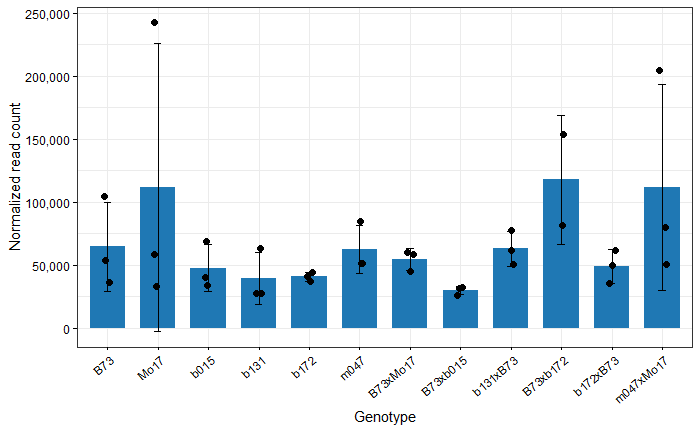 There is variation across
replicates for Mo17, B73xb172, and m047xMo17. No clear if heterozygous
plants show higher or lower 35S expression.

#### Statistics

Compare expression in each cross with mid-parent value

``` r
geneID <- "rDNA"

data <- plotCounts(dds,
  gene = geneID, intgroup = "genotype",
  main = geneID, return = TRUE
)
  
data$genotype <- factor(data$genotype, 
                          levels = c("B73", "Mo17", "b015", "b131", 
                                     "b172", "m047", "B73xMo17", 
                                     "B73xb015", "b131xB73", "B73xb172", 
                                     "b172xB73", "m047xMo17"), ordered = T)
```

##### B73xMo17

``` r
data_sub <- data %>% filter(genotype %in% c("B73","Mo17","B73xMo17"))
data_sub$sample <- rownames(data_sub)
data_sub_2 <- merge.data.frame(data_sub, coldata, by="sample")

# Test homoscedasticity
bartlett.test(count~NOR, data=data_sub_2)

# Compare means
with(data_sub_2, t.test(count[NOR=="heterozygous"], count[NOR=="homozygous"], var.equal=FALSE))
```

        Bartlett test of homogeneity of variances

    data:  count by NOR
    Bartlett's K-squared = 5.6194, df = 1, p-value = 0.01776


        Welch Two Sample t-test

    data:  count[NOR == "heterozygous"] and count[NOR == "homozygous"]
    t = -1.0169, df = 5.2196, p-value = 0.354
    alternative hypothesis: true difference in means is not equal to 0
    95 percent confidence interval:
     -117218.86   50161.66
    sample estimates:
    mean of x mean of y 
     54484.81  88013.41 

##### b015xB73

``` r
data_sub <- data %>% filter(genotype %in% c("B73","b015","B73xb015"))
data_sub$sample <- rownames(data_sub)
data_sub_2 <- merge.data.frame(data_sub, coldata, by="sample")

# Test homoscedasticity
bartlett.test(count~NOR, data=data_sub_2)

# Compare means
with(data_sub_2, t.test(count[NOR=="heterozygous"], count[NOR=="homozygous"], var.equal=FALSE))
```

        Bartlett test of homogeneity of variances

    data:  count by NOR
    Bartlett's K-squared = 5.0756, df = 1, p-value = 0.02427


        Welch Two Sample t-test

    data:  count[NOR == "heterozygous"] and count[NOR == "homozygous"]
    t = -2.3456, df = 5.3026, p-value = 0.06299
    alternative hypothesis: true difference in means is not equal to 0
    95 percent confidence interval:
     -54451.236   2028.138
    sample estimates:
    mean of x mean of y 
     29911.38  56122.92 

##### b131xB73

``` r
data_sub <- data %>% filter(genotype %in% c("B73","b131","b131xB73"))
data_sub$sample <- rownames(data_sub)
data_sub_2 <- merge.data.frame(data_sub, coldata, by="sample")

# Test homoscedasticity
bartlett.test(count~NOR, data=data_sub_2)

# Compare means
with(data_sub_2, t.test(count[NOR=="heterozygous"], count[NOR=="homozygous"], var.equal=TRUE))
```

        Bartlett test of homogeneity of variances

    data:  count by NOR
    Bartlett's K-squared = 1.0616, df = 1, p-value = 0.3029


        Two Sample t-test

    data:  count[NOR == "heterozygous"] and count[NOR == "homozygous"]
    t = 0.59773, df = 7, p-value = 0.5688
    alternative hypothesis: true difference in means is not equal to 0
    95 percent confidence interval:
     -32377.43  54283.85
    sample estimates:
    mean of x mean of y 
     63050.44  52097.23 

##### B73xb172

``` r
data_sub <- data %>% filter(genotype %in% c("B73","b172","B73xb172"))
data_sub$sample <- rownames(data_sub)
data_sub_2 <- merge.data.frame(data_sub, coldata, by="sample")

# Test homoscedasticity
bartlett.test(count~NOR, data=data_sub_2)

# Compare means
with(data_sub_2, t.test(count[NOR=="heterozygous"], count[NOR=="homozygous"], var.equal=TRUE))
```

    Bartlett test of homogeneity of variances

    data:  count by NOR
    Bartlett's K-squared = 0.73984, df = 1, p-value = 0.3897


        Two Sample t-test

    data:  count[NOR == "heterozygous"] and count[NOR == "homozygous"]
    t = 2.5169, df = 6, p-value = 0.04548
    alternative hypothesis: true difference in means is not equal to 0
    95 percent confidence interval:
       1811.024 128442.070
    sample estimates:
    mean of x mean of y 
    117767.98  52641.44 

##### b172xB73

``` r
data_sub <- data %>% filter(genotype %in% c("B73","b172","b172xB73"))
data_sub$sample <- rownames(data_sub)
data_sub_2 <- merge.data.frame(data_sub, coldata, by="sample")

# Test homoscedasticity
bartlett.test(count~NOR, data=data_sub_2)

# Compare means
with(data_sub_2, t.test(count[NOR=="heterozygous"], count[NOR=="homozygous"], var.equal=TRUE))
```

        Bartlett test of homogeneity of variances

    data:  count by NOR
    Bartlett's K-squared = 0.87935, df = 1, p-value = 0.3484


        Two Sample t-test

    data:  count[NOR == "heterozygous"] and count[NOR == "homozygous"]
    t = -0.22201, df = 7, p-value = 0.8306
    alternative hypothesis: true difference in means is not equal to 0
    95 percent confidence interval:
     -42303.77  35041.90
    sample estimates:
    mean of x mean of y 
     49010.50  52641.44 

##### m047xMo17

``` r
data_sub <- data %>% filter(genotype %in% c("Mo17","m047","m047xMo17"))
data_sub$sample <- rownames(data_sub)
data_sub_2 <- merge.data.frame(data_sub, coldata, by="sample")

# Test homoscedasticity
bartlett.test(count~NOR, data=data_sub_2)

# Compare means
with(data_sub_2, t.test(count[NOR=="heterozygous"], count[NOR=="homozygous"], var.equal=TRUE))
```

        Bartlett test of homogeneity of variances

    data:  count by NOR
    Bartlett's K-squared = 0.0048074, df = 1, p-value = 0.9447


        Two Sample t-test

    data:  count[NOR == "heterozygous"] and count[NOR == "homozygous"]
    t = 0.44316, df = 7, p-value = 0.671
    alternative hypothesis: true difference in means is not equal to 0
    95 percent confidence interval:
     -107384.0  156917.3
    sample estimates:
    mean of x mean of y 
    111675.41  86908.75 

1.  

## Gene expression analysis

### Creating Salmon indexes

``` bash

cd /mnt/ceph-hdd/projects/scc_uanp_scholten/data/databases/genomes/B73_NAM5/mapping_index_salmon

# Get fasta file of the genome assemblies
server="http://ftp.ensemblgenomes.org/pub/plants/release-51"

wget ${server}/fasta/zea_mays/dna/Zea_mays.Zm-B73-REFERENCE-NAM-5.0.dna.toplevel.fa.gz

gunzip Zea_mays.Zm-B73-REFERENCE-NAM-5.0.dna.toplevel.fa.gz

samtools index Zea_mays.Zm-B73-REFERENCE-NAM-5.0.dna.toplevel.fa

# Create decoys.txt
cut -f1 Zea_mays.Zm-B73-REFERENCE-NAM-5.0.dna.toplevel.fa.fai > decoys.txt

# Get cDNA sequences
wget ${server}//fasta/zea_mays/cdna/Zea_mays.Zm-B73-REFERENCE-NAM-5.0.cdna.all.fa.gz

gunzip Zea_mays.Zm-B73-REFERENCE-NAM-5.0.cdna.all.fa.gz

# Merge all fasta files and remove extra information from the headers
cat Zea_mays.Zm-B73-REFERENCE-NAM-5.0.cdna.all.fa Zea_mays.Zm-B73-REFERENCE-NAM-5.0.dna.toplevel.fa | cut -d' ' -f1 > B73_NAM5_index.fasta
```

``` bash
#!/bin/bash
#SBATCH --job-name=build_index_salmon
#SBATCH --partition=medium
#SBATCH --mem=60G
#SBATCH --time=05:00:00
#SBATCH --cpus-per-task=8
#SBATCH --output=slurm/%x.%j.out
#SBATCH --error=slurm/%x.%j.err
#SBATCH --mail-type=END
#SBATCH --mail-user=johan.zicola@uni-goettingen.de

module load salmon/1.10.2

salmon index -t B73_NAM5_index.fasta -p 8 -i B73_NAM5_index --decoys decoys.txt
```

It took 30 minutes with 60 Gb RAM and 8 threads.

Create a tx2gene file (transcript id in 1st column and gene id in second
column, header names are not important).

``` bash

samtools faidx Zea_mays.Zm-B73-REFERENCE-NAM-5.0.cdna.all.fa

cut -f1 Zm-B73-REFERENCE-NAM-5.0_Zm00001eb.1.cdna.fa.fai | cut -d_ -f1 > gene
cut -f1 Zm-B73-REFERENCE-NAM-5.0_Zm00001eb.1.cdna.fa.fai > tx

paste tx gene > tx2gene.txt
rm tx gene
```

### Mapping

``` bash
# Old location
cd /usr/users/npghpc/data/NGS_data/BGI_data/F22FTSEUHT1495_LIBfbksR_mRNA_sRNA_degradome_johan_doga/F22FTSEUHT1495_LIBfbksR_PE100

# New location
cd /mnt/ceph-hdd/projects/scc_uanp_scholten/data/ngs_data/BGI_data/F22FTSEUHT1495_LIBfbksR_mRNA_sRNA_degradome_johan_doga/F22FTSEUHT1495_LIBfbksR_PE100
```

``` bash
#!/bin/bash
#SBATCH --job-name=salmon_mapping
#SBATCH --cpus-per-task=12
#SBATCH --partition=medium
#SBATCH --mem=30G
#SBATCH --time=00:40:00
#SBATCH -o slurm/%x.%a.%j.out
#SBATCH -e slurm/%x.%a.%j.err
#SBATCH --mail-type=END
#SBATCH --mail-user=johan.zicola@uni-goettingen.de
#SBATCH --array=1-36

module load gcc/14.2.0 openmpi/4.1.7 salmon/1.10.3

sample_id=$(sed -n ${SLURM_ARRAY_TASK_ID}p sample_id.txt)
fastq1="raw_data/${sample_id}/${sample_id}_L1_1.fq.gz"
fastq2="raw_data/${sample_id}/${sample_id}_L1_2.fq.gz"

path_index="/mnt/ceph-hdd/projects/scc_uanp_scholten/data/databases/genomes/B73_NAM5/mapping_index_salmon/B73_NAM5_index"
output_dir="/usr/users/npghpc/data/NGS_data/BGI_data/F22FTSEUHT1495_LIBfbksR_mRNA_sRNA_degradome_johan_doga/F22FTSEUHT1495_LIBfbksR_PE100/salmon_mapping"

salmon quant -p 12 --libType A -i $path_index -1 $fastq1 -2 $fastq2 \
  -o ${output_dir}/$sample_id --validateMappings --gcBias
```

The mapping took around 4-5 min.

Library type as automatically defined as ISR by Salmon

``` bash
find salmon_mapping -name "*log" -exec grep "likely library" {} \;
```

### Mapping rate

``` bash

find salmon_mapping -name "salmon_quant.log" -exec echo {} \; -exec grep "Mapping rate" {} \;   > mapping_rate.txt
```

The mapping rate is from 82-88%.

### Import read count in R

DESeq2 (v1.46.0)

Copy quant files in project folder

``` r
# Upload the coldata file for all experiment
coldata <- read.table ("data/rnaseq/coldata.txt", header=T)

# Convert variables as factor
coldata[] <- lapply(coldata, as.factor)

# Import tx2gene file
tx2gene <- read.table("data/rnaseq/tx2gene.txt", quote="\"", comment.char="")

# Path to quant.sf files
files <- file.path("data/rnaseq/salmon_mapping", coldata$sample, "quant.sf")
names(files) <- coldata$sample
all(file.exists(files))

# Import salmon data
txi <- tximport(files, type="salmon", tx2gene=tx2gene)

# Check if sample names match in txi and coldata
colnames(txi$abundance)== coldata$sample

saveRDS(txi, "data/rnaseq/txi.rds")

#txi_df <- as.data.frame(txi)
```

### PCA gene expression

``` r
# Upload the coldata file for all experiment
coldata <- read.table ("data/rnaseq/coldata.txt", header=T)

# Convert variables as factor
coldata[] <- lapply(coldata, as.factor)

txi <- readRDS("data/rnaseq/txi.rds")

# Create a DESeq2 matrix
dds <- DESeqDataSetFromTximport(txi,
                  colData = coldata,
                  design = ~ 1)

# Variance stabilizing transformation
vsd <- vst(dds, blind=TRUE)

# Create PCA
pcaData <- plotPCA(vsd, intgroup=c("sample", "genotype"), returnData=TRUE)

# Get percentage variation
percentVar <- round(100 * attr(pcaData, "percentVar"))

ggplot(pcaData, aes(PC1, PC2, color = genotype, label = sample)) +
  xlab(paste0("PC1: ", percentVar[1], "% variance")) +
  ylab(paste0("PC2: ", percentVar[2], "% variance")) +
  ggtitle("PCA gene expression") +
  theme_bw() +
  geom_text(size = 3) +
  theme(
    axis.text.x = element_text(color = "black"),
    axis.text.y = element_text(color = "black"),
    axis.ticks = element_line(color = "black")
  ) +
  theme(plot.title = element_text(hjust = 0.5)) +
  scale_y_continuous(labels = scales::comma_format())
```

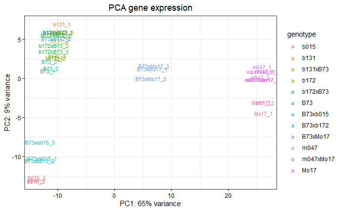 Replicates cluster tightly together.
B73xb015 and b015 cluster separately, probably due to the fact they were
collected at a different time-point and dates (9 DAS for b015 and 11 DAS
for B73xb015) while all others were collected at 12 DAS.

``` r
# Create a DESeq2 matrix
dds <- DESeqDataSetFromTximport(txi,
                  colData = coldata,
                  design = ~ 1)

# Variance stabilizing transformation
vsd <- vst(dds, blind=TRUE)

# Create PCA
pcaData <- plotPCA(vsd, intgroup=c("sample", "NOR"), returnData=TRUE)

# Get percentage variation
percentVar <- round(100 * attr(pcaData, "percentVar"))

col <- c("#1b9e77","#d95f02")

ggplot(pcaData, aes(PC1, PC2, color = NOR, label = sample)) +
  xlab(paste0("PC1: ", percentVar[1], "% variance")) +
  ylab(paste0("PC2: ", percentVar[2], "% variance")) +
  ggtitle("PCA gene expression") +
  theme_bw() +
  scale_color_manual(values=col) + 
  geom_text(size = 3) +
  theme(
    axis.text.x = element_text(color = "black"),
    axis.text.y = element_text(color = "black"),
    axis.ticks = element_line(color = "black")
  ) +
  theme(plot.title = element_text(hjust = 0.5)) +
  scale_y_continuous(labels = scales::comma_format())
```

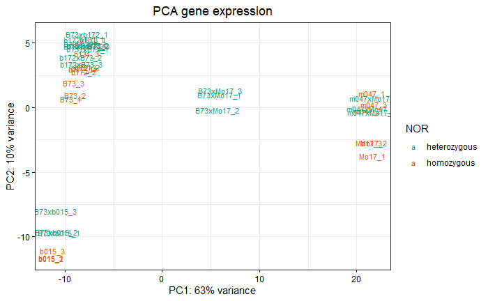

### Expression genes RegionA

The 56 genes annotated in B73 RegionA should be absent in Mo17 and
B73-NILs b015, b131, and b172. We expect no expression in these samples.

``` r
txi <- readRDS("data/rnaseq/txi.rds")

# Upload the coldata file for all experiment
coldata <- read.table ("data/rnaseq/coldata.txt", header=T)

list_genes_regionA <- readRDS("data/annotations/list_genes_regionA.Rds")

txi_subset <- lapply(txi, function(x) {
  if (is.matrix(x)) x[rownames(x) %in% list_genes_regionA, ] else x
})

# Create a DESeq2 matrix
dds <- DESeqDataSetFromTximport(txi_subset,
                  colData = coldata,
                  design = ~ NOR)

# Likelihood ratio test
dds <- DESeq(dds)

# Variance stabilizing transformation
vsd <- varianceStabilizingTransformation(dds, blind=TRUE)

# Create PCA
pcaData <- plotPCA(vsd, intgroup=c("sample", "NOR"), returnData=TRUE)

# Get percentage variation
percentVar <- round(100 * attr(pcaData, "percentVar"))


col <- c("#1b9e77","#d95f02")

ggplot(pcaData, aes(PC1, PC2, color = NOR, label = sample)) +
  xlab(paste0("PC1: ", percentVar[1], "% variance")) +
  ylab(paste0("PC2: ", percentVar[2], "% variance")) +
  ggtitle("PCA gene expression") +
  theme_bw() +
  scale_color_manual(values=col) + 
  geom_text(size = 3) +
  theme(
    axis.text.x = element_text(color = "black"),
    axis.text.y = element_text(color = "black"),
    axis.ticks = element_line(color = "black")
  ) +
  theme(plot.title = element_text(hjust = 0.5)) +
  scale_y_continuous(labels = scales::comma_format())
```

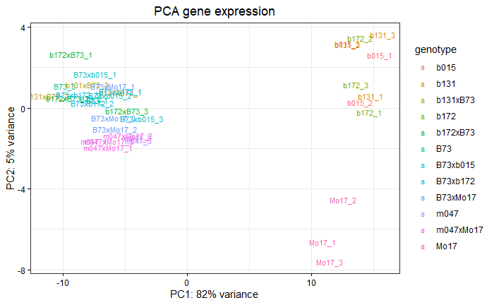

It is clear that all genotypes that contain at least one copy of the B73
NOR cluster apart from the B73-NILs and Mo17.

``` r
dds <- DESeq(dds)

mat <- counts(dds, normalized=T)

# How many genes are not expressed at all
sum(rowSums(mat)==0)
# 12

# Keep only genes with som expression (otherwise, scaling will results in NaN)
mat_cleaned <- mat[rowSums(mat) != 0,]

# Transpose and z-scaled
mat.z <- t(apply(mat_cleaned, 1, scale))
colnames(mat.z) <- coldata$sample

Heatmap(mat.z, cluster_rows = T, cluster_columns = T, 
        column_labels = colnames(mat.z), name = "Z-score")
```

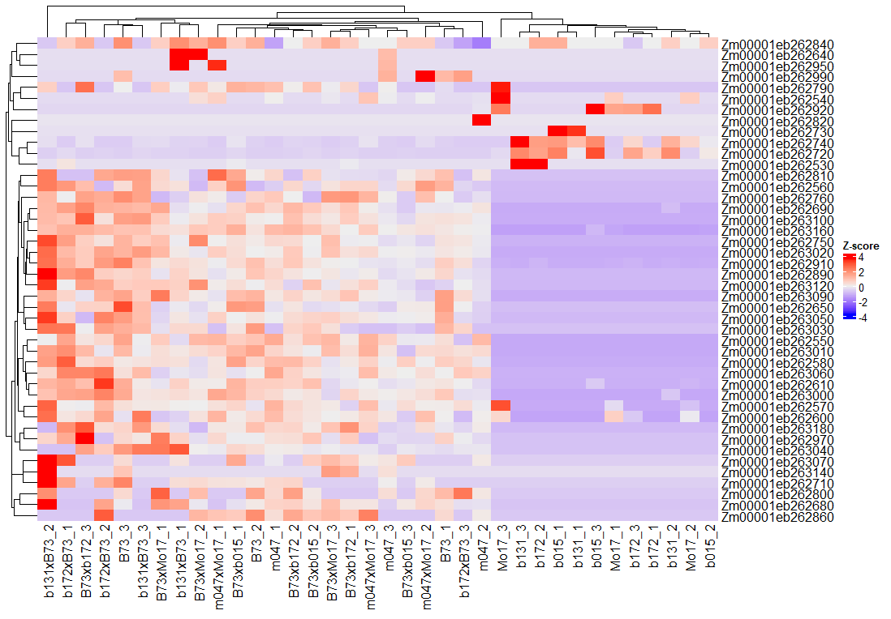

``` r
plot_gene("Zm00001eb262740")

plot_gene("Zm00001eb262920")

plot_gene("Zm00001eb262730")

plot_gene("Zm00001eb262720")

plot_gene("Zm00001eb262530")
```

### Expression NOR genes

180 genes identified in B73 NOR.

``` r
txi <- readRDS("data/rnaseq/txi.rds")

# Upload the coldata file for all experiment
coldata <- read.table ("data/rnaseq/coldata.txt", header=T)


list_genes_NOR <- readRDS("data/annotations/list_genes_NOR.Rds")

txi_subset <- lapply(txi, function(x) {
  if (is.matrix(x)) x[rownames(x) %in% list_genes_NOR, ] else x
})


# Create a DESeq2 matrix
dds <- DESeqDataSetFromTximport(txi_subset,
                  colData = coldata,
                  design = ~ genotype)


# Likelihood ratio test
dds <- DESeq(dds)

# Get results
#res <- results(res)

# Variance stabilizing transformation
vsd <- varianceStabilizingTransformation(dds, blind=TRUE)

# Create PCA
pcaData <- plotPCA(vsd, intgroup=c("sample", "genotype"), returnData=TRUE)

# Get percentage variation
percentVar <- round(100 * attr(pcaData, "percentVar"))

ggplot(pcaData, aes(PC1, PC2, color = genotype, label = sample)) +
  xlab(paste0("PC1: ", percentVar[1], "% variance")) +
  ylab(paste0("PC2: ", percentVar[2], "% variance")) +
  ggtitle("PCA gene expression") +
  theme_bw() +
  geom_text(size = 3) +
  theme(
    axis.text.x = element_text(color = "black"),
    axis.text.y = element_text(color = "black"),
    axis.ticks = element_line(color = "black")
  ) +
  theme(plot.title = element_text(hjust = 0.5)) +
  scale_y_continuous(labels = scales::comma_format())
```

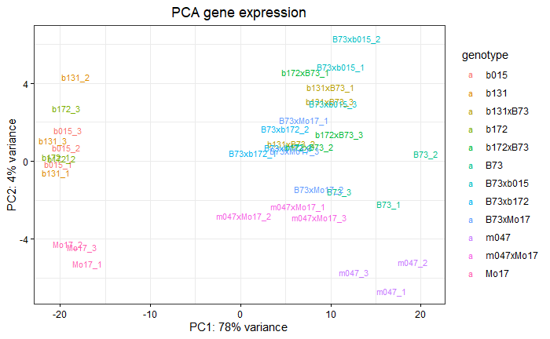

``` r
plot_gene <- function(geneID) {
  data <- plotCounts(dds,
    gene = geneID, intgroup = "genotype",
    main = geneID, return = TRUE
  )

  data$genotype <- factor(data$genotype, levels = c("B73", "Mo17", "b015", "b131", "b172", "m047", "B73xMo17", "B73xb015", "b131xB73", "B73xb172", "b172xB73", "m047xMo17"), ordered = T)

  data %>%
    ggplot(aes(x = genotype, y = count)) +
    geom_boxplot(fill = "white", outlier.colour = NA) +
    geom_point(size = 2) +
    theme_bw() +
    ggtitle(geneID) +
    theme(plot.title = element_text(hjust = 0.5)) +
    ylab("Normalized read count") +
    xlab("Genotype") +
    theme(axis.text.x = element_text(angle = 90, hjust = 1))
}

list_genes_regionA <- readRDS("data/annotations/list_genes_regionA.Rds")


plot_gene(list_genes_regionA[[34]])
```

### Expression NOR genes outside of RegionA

126 genes

``` r
txi <- readRDS("data/rnaseq/txi.rds")

# Upload the coldata file for all experiment
coldata <- read.table ("data/rnaseq/coldata.txt", header=T)


list_genes_NOR_wo_RegionA <- readRDS("data/annotations/list_genes_NOR_wo_RegionA.Rds")

txi_subset <- lapply(txi, function(x) {
  if (is.matrix(x)) x[rownames(x) %in% list_genes_NOR_wo_RegionA, ] else x
})


# Create a DESeq2 matrix
dds <- DESeqDataSetFromTximport(txi_subset,
                  colData = coldata,
                  design = ~ genotype)


# Likelihood ratio test
dds <- DESeq(dds)

# Get results
#res <- results(res)

# Variance stabilizing transformation
vsd <- varianceStabilizingTransformation(dds, blind=TRUE)

# Create PCA
pcaData <- plotPCA(vsd, intgroup=c("sample", "genotype"), returnData=TRUE)

# Get percentage variation
percentVar <- round(100 * attr(pcaData, "percentVar"))

ggplot(pcaData, aes(PC1, PC2, color = genotype, label = sample)) +
  xlab(paste0("PC1: ", percentVar[1], "% variance")) +
  ylab(paste0("PC2: ", percentVar[2], "% variance")) +
  ggtitle("PCA gene expression") +
  theme_bw() +
  geom_text(size = 3) +
  theme(
    axis.text.x = element_text(color = "black"),
    axis.text.y = element_text(color = "black"),
    axis.ticks = element_line(color = "black")
  ) +
  theme(plot.title = element_text(hjust = 0.5)) +
  scale_y_continuous(labels = scales::comma_format())
```

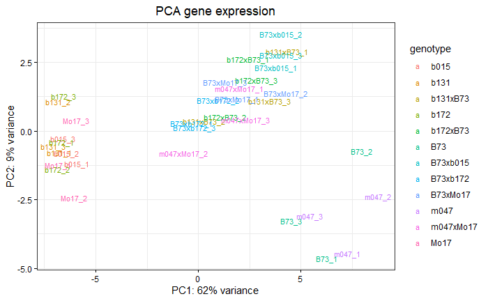

``` r
library(ComplexHeatmap)

dds <- DESeq(dds)

mat <- counts(dds, normalized=T)

# How many genes are not expressed at all
sum(rowSums(mat)==0)
# 45

# Keep only genes with som expression (otherwise, scaling will results in NaN)
mat_cleaned <- mat[rowSums(mat) != 0,]

# Transpose and z-scaled
mat.z <- t(apply(mat_cleaned, 1, scale))
colnames(mat.z) <- coldata$sample

Heatmap(mat.z, cluster_rows = T, cluster_columns = T, 
        column_labels = colnames(mat.z), name = "Z-score")
```

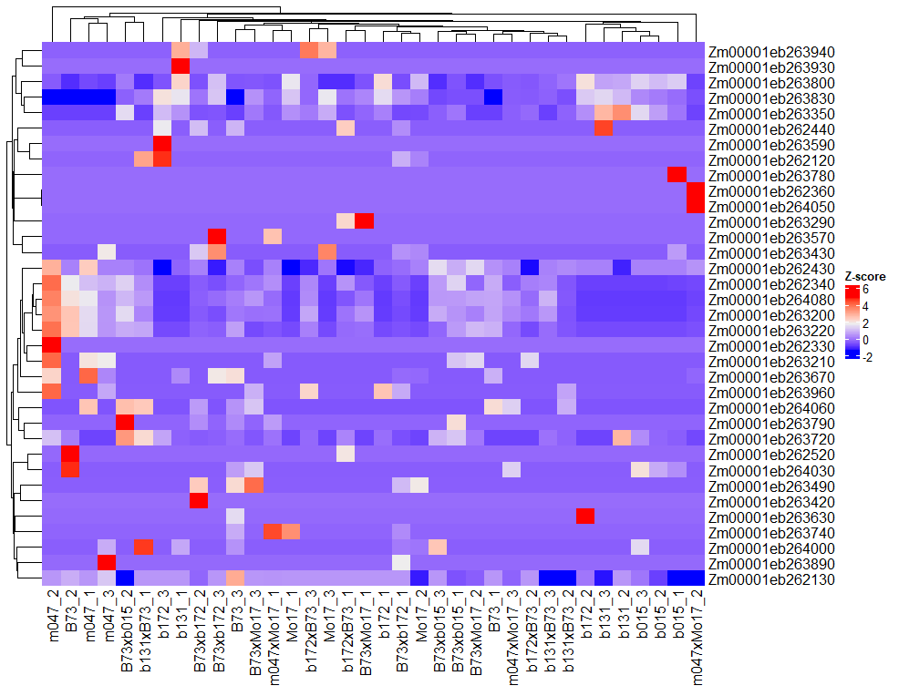

1.  

# Non-additive gene analysis

Compare parents with crosses so that differentially expressed genes
should be the non-additively expressed ones (diverge from mid-parent
values).

## B73, Mo17, B73xMo17

``` r
# Create a DESeq2 matrix
dds <- DESeqDataSetFromTximport(txi,
                  colData = coldata,
                  design = ~ NOR)


selection <- coldata %>% filter(genotype %in% c("B73","Mo17","B73xMo17")) %>% pull(sample)

dds <- dds[, colnames(dds) %in% selection]

# Variance stabilizing transformation
vsd <- vst(dds, blind=TRUE)

# Create PCA
pcaData <- plotPCA(vsd, intgroup=c("sample", "NOR"), returnData=TRUE)

# Get percentage variation
percentVar <- round(100 * attr(pcaData, "percentVar"))

col <- c("#1b9e77","#d95f02")

ggplot(pcaData, aes(PC1, PC2, color = NOR, label = sample)) +
  xlab(paste0("PC1: ", percentVar[1], "% variance")) +
  ylab(paste0("PC2: ", percentVar[2], "% variance")) +
  ggtitle("PCA gene expression") +
  theme_bw() +
  scale_color_manual(values=col) + 
  geom_text(size = 3) +
  theme(
    axis.text.x = element_text(color = "black"),
    axis.text.y = element_text(color = "black"),
    axis.ticks = element_line(color = "black")
  ) +
  theme(plot.title = element_text(hjust = 0.5)) +
  scale_y_continuous(labels = scales::comma_format())

# Perform differential expression analysis
dds <- DESeq(dds)

# Create a DESeqResults object
res <- results(dds, contrast = c("NOR","heterozygous","homozygous"))

DEG <- as.data.frame(res) %>% rownames_to_column("geneID")

sigDEG <- as.data.frame(res) %>% rownames_to_column("geneID") %>% filter(padj < 0.05)

write.table(sigDEG, "data/rnaseq/sig_DEG_B73_Mo17_B73xMo17.txt",
            quote=FALSE, row.names=FALSE, sep="\t")
```

663 DEGs

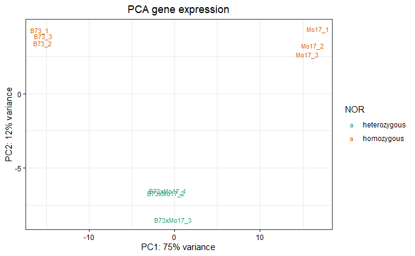

``` r
lp <- perform_GO(sigDEG$int2)

lp[[1]]
lp[[2]]
lp[[3]]
```

## b015, B73, B73xb015

``` r
# Create a DESeq2 matrix
dds <- DESeqDataSetFromTximport(txi,
                  colData = coldata,
                  design = ~ NOR)


selection <- coldata %>% filter(genotype %in% c("b015","B73","B73xb015")) %>% pull(sample)

dds <- dds[, colnames(dds) %in% selection]

vsd <- vst(dds, blind=TRUE)

# Create PCA
pcaData <- plotPCA(vsd, intgroup=c("sample", "NOR"), returnData=TRUE)

# Get percentage variation
percentVar <- round(100 * attr(pcaData, "percentVar"))

col <- c("#1b9e77","#d95f02")

ggplot(pcaData, aes(PC1, PC2, color = NOR, label = sample)) +
  xlab(paste0("PC1: ", percentVar[1], "% variance")) +
  ylab(paste0("PC2: ", percentVar[2], "% variance")) +
  ggtitle("PCA gene expression") +
  theme_bw() +
  scale_color_manual(values=col) + 
  geom_text(size = 3) +
  theme(
    axis.text.x = element_text(color = "black"),
    axis.text.y = element_text(color = "black"),
    axis.ticks = element_line(color = "black")
  ) +
  theme(plot.title = element_text(hjust = 0.5)) +
  scale_y_continuous(labels = scales::comma_format())


# Perform differential expression analysis
dds <- DESeq(dds)

# Create a DESeqResults object
res <- results(dds, contrast = c("NOR","heterozygous","homozygous"))

DEG <- as.data.frame(res) %>% rownames_to_column("geneID")

sigDEG <- as.data.frame(res) %>% rownames_to_column("geneID") %>% filter(padj < 0.05)

write.table(sigDEG, "data/rnaseq/sig_DEG_B73_b015_B73xb015.txt",
            quote=FALSE, row.names=FALSE, sep="\t")
```

2325 DEGs

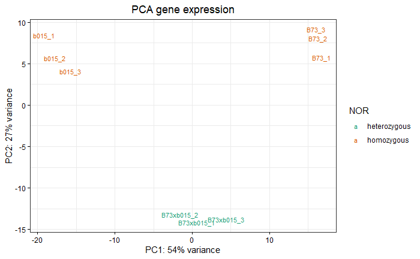

## b131, B73, b131xB73

``` r
# Create a DESeq2 matrix
dds <- DESeqDataSetFromTximport(txi,
                  colData = coldata,
                  design = ~ NOR)


selection <- coldata %>% filter(genotype %in% c("b131","B73","b131xB73")) %>% pull(sample)

dds <- dds[, colnames(dds) %in% selection]

vsd <- vst(dds, blind=TRUE)

# Create PCA
pcaData <- plotPCA(vsd, intgroup=c("sample", "NOR"), returnData=TRUE)

# Get percentage variation
percentVar <- round(100 * attr(pcaData, "percentVar"))

col <- c("#1b9e77","#d95f02")

ggplot(pcaData, aes(PC1, PC2, color = NOR, label = sample)) +
  xlab(paste0("PC1: ", percentVar[1], "% variance")) +
  ylab(paste0("PC2: ", percentVar[2], "% variance")) +
  ggtitle("PCA gene expression") +
  theme_bw() +
  scale_color_manual(values=col) + 
  geom_text(size = 3) +
  theme(
    axis.text.x = element_text(color = "black"),
    axis.text.y = element_text(color = "black"),
    axis.ticks = element_line(color = "black")
  ) +
  theme(plot.title = element_text(hjust = 0.5)) +
  scale_y_continuous(labels = scales::comma_format())

# Perform differential expression analysis
dds <- DESeq(dds)

# Create a DESeqResults object
res <- results(dds, contrast = c("NOR","heterozygous","homozygous"))

DEG <- as.data.frame(res) %>% rownames_to_column("geneID")

sigDEG <- as.data.frame(res) %>% rownames_to_column("geneID") %>% filter(padj < 0.05)

write.table(sigDEG, "data/rnaseq/sig_DEG_b131_B73_b131xB73.txt",
            quote=FALSE, row.names=FALSE, sep="\t")
```

167 DEGs

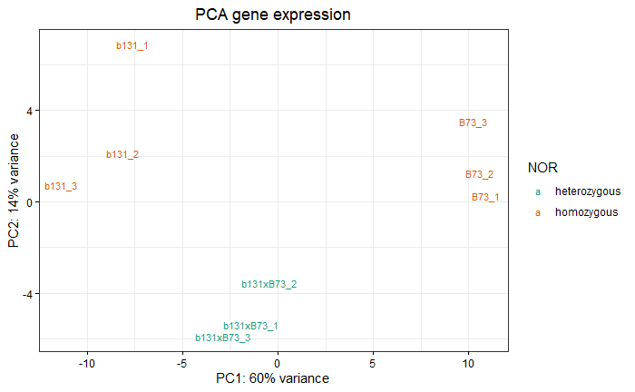

## b172, B73, b172xB73

``` r
# Create a DESeq2 matrix
dds <- DESeqDataSetFromTximport(txi,
                  colData = coldata,
                  design = ~ NOR)


selection <- coldata %>% filter(genotype %in% c("b172","B73","b172xB73")) %>% pull(sample)

dds <- dds[, colnames(dds) %in% selection]


vsd <- vst(dds, blind=TRUE)

# Create PCA
pcaData <- plotPCA(vsd, intgroup=c("sample", "NOR"), returnData=TRUE)

# Get percentage variation
percentVar <- round(100 * attr(pcaData, "percentVar"))

col <- c("#1b9e77","#d95f02")

ggplot(pcaData, aes(PC1, PC2, color = NOR, label = sample)) +
  xlab(paste0("PC1: ", percentVar[1], "% variance")) +
  ylab(paste0("PC2: ", percentVar[2], "% variance")) +
  ggtitle("PCA gene expression") +
  theme_bw() +
  scale_color_manual(values=col) + 
  geom_text(size = 3) +
  theme(
    axis.text.x = element_text(color = "black"),
    axis.text.y = element_text(color = "black"),
    axis.ticks = element_line(color = "black")
  ) +
  theme(plot.title = element_text(hjust = 0.5)) +
  scale_y_continuous(labels = scales::comma_format())


# Perform differential expression analysis
dds <- DESeq(dds)

# Create a DESeqResults object
res <- results(dds, contrast = c("NOR","heterozygous","homozygous"))

DEG <- as.data.frame(res) %>% rownames_to_column("geneID")

sigDEG <- as.data.frame(res) %>% rownames_to_column("geneID") %>% filter(padj < 0.05)

write.table(sigDEG, "data/rnaseq/sig_DEG_b172_B73_b172xB73.txt",
            quote=FALSE, row.names=FALSE, sep="\t")
```

Only 6 DEGs.

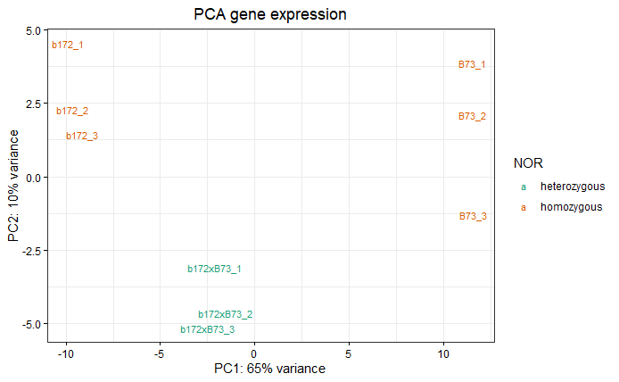

## b172, B73, B73xb172

``` r
# Create a DESeq2 matrix
dds <- DESeqDataSetFromTximport(txi,
                  colData = coldata,
                  design = ~ NOR)


selection <- coldata %>% filter(genotype %in% c("b172","B73","B73xb172")) %>% pull(sample)

dds <- dds[, colnames(dds) %in% selection]


vsd <- vst(dds, blind=TRUE)

# Create PCA
pcaData <- plotPCA(vsd, intgroup=c("sample", "NOR"), returnData=TRUE)

# Get percentage variation
percentVar <- round(100 * attr(pcaData, "percentVar"))

col <- c("#1b9e77","#d95f02")

ggplot(pcaData, aes(PC1, PC2, color = NOR, label = sample)) +
  xlab(paste0("PC1: ", percentVar[1], "% variance")) +
  ylab(paste0("PC2: ", percentVar[2], "% variance")) +
  ggtitle("PCA gene expression") +
  theme_bw() +
  scale_color_manual(values=col) + 
  geom_text(size = 4) +
  theme(
    axis.text.x = element_text(color = "black"),
    axis.text.y = element_text(color = "black"),
    axis.ticks = element_line(color = "black")
  ) +
  theme(plot.title = element_text(hjust = 0.5)) +
  scale_y_continuous(labels = scales::comma_format())

# Perform differential expression analysis
dds <- DESeq(dds)

# Create a DESeqResults object
res <- results(dds, contrast = c("NOR","heterozygous","homozygous"))

DEG <- as.data.frame(res) %>% rownames_to_column("geneID")

sigDEG <- as.data.frame(res) %>% rownames_to_column("geneID") %>% filter(padj < 0.05)

write.table(sigDEG, "data/rnaseq/sig_DEG_b172_B73_B73xb172.txt",
            quote=FALSE, row.names=FALSE, sep="\t")
```

44 DEGs.

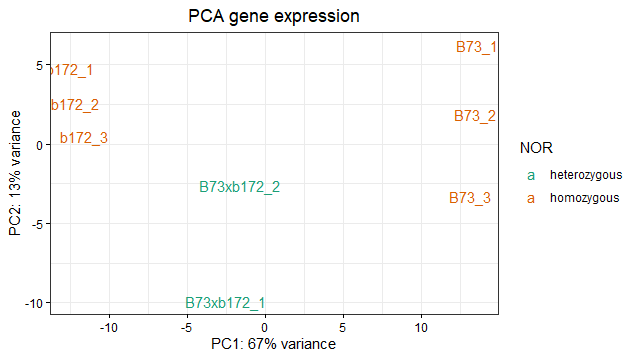

## b172, B73, B73xb172, b172xB73

``` r
# Create a DESeq2 matrix
dds <- DESeqDataSetFromTximport(txi,
                  colData = coldata,
                  design = ~ NOR)


selection <- coldata %>% filter(genotype %in% c("b172","B73","B73xb172","b172xB73")) %>% pull(sample)

dds <- dds[, colnames(dds) %in% selection]


vsd <- vst(dds, blind=TRUE)

# Create PCA
pcaData <- plotPCA(vsd, intgroup=c("sample", "NOR"), returnData=TRUE)

# Get percentage variation
percentVar <- round(100 * attr(pcaData, "percentVar"))

col <- c("#1b9e77","#d95f02")

ggplot(pcaData, aes(PC1, PC2, color = NOR, label = sample)) +
  xlab(paste0("PC1: ", percentVar[1], "% variance")) +
  ylab(paste0("PC2: ", percentVar[2], "% variance")) +
  ggtitle("PCA gene expression") +
  theme_bw() +
  scale_color_manual(values=col) + 
  geom_text(size = 3) +
  theme(
    axis.text.x = element_text(color = "black"),
    axis.text.y = element_text(color = "black"),
    axis.ticks = element_line(color = "black")
  ) +
  theme(plot.title = element_text(hjust = 0.5)) +
  scale_y_continuous(labels = scales::comma_format())


# Perform differential expression analysis
dds <- DESeq(dds)

# Create a DESeqResults object
res <- results(dds, contrast = c("NOR","heterozygous","homozygous"))

DEG <- as.data.frame(res) %>% rownames_to_column("geneID")

sigDEG <- as.data.frame(res) %>% rownames_to_column("geneID") %>% filter(padj < 0.05)

write.table(sigDEG, "data/rnaseq/sig_DEG_b172_B73_B73xb172_b172xB73.txt",
            quote=FALSE, row.names=FALSE, sep="\t")
```

76 DEGs

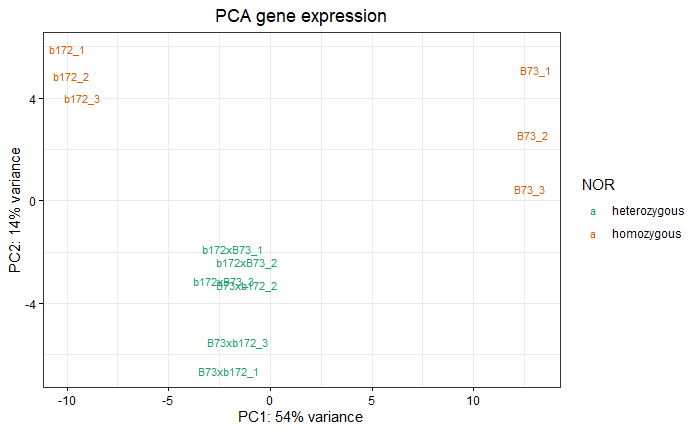

## Mo17, m047, m047xMo17

``` r
# Create a DESeq2 matrix
dds <- DESeqDataSetFromTximport(txi,
                  colData = coldata,
                  design = ~ NOR)

selection <- coldata %>% filter(genotype %in% c("Mo17","m047","m047xMo17")) %>% pull(sample)

dds <- dds[, colnames(dds) %in% selection]


vsd <- vst(dds, blind=TRUE)

# Create PCA
pcaData <- plotPCA(vsd, intgroup=c("sample", "NOR"), returnData=TRUE)

# Get percentage variation
percentVar <- round(100 * attr(pcaData, "percentVar"))


col <- c("#1b9e77","#d95f02")

ggplot(pcaData, aes(PC1, PC2, color = NOR, label = sample)) +
  xlab(paste0("PC1: ", percentVar[1], "% variance")) +
  ylab(paste0("PC2: ", percentVar[2], "% variance")) +
  ggtitle("PCA gene expression") +
  theme_bw() +
  scale_color_manual(values=col) + 
  geom_text(size = 3) +
  theme(
    axis.text.x = element_text(color = "black"),
    axis.text.y = element_text(color = "black"),
    axis.ticks = element_line(color = "black")
  ) +
  theme(plot.title = element_text(hjust = 0.5)) +
  scale_y_continuous(labels = scales::comma_format())


# Perform differential expression analysis
dds <- DESeq(dds)

# Create a DESeqResults object
res <- results(dds, contrast = c("NOR","heterozygous","homozygous"))

DEG <- as.data.frame(res) %>% rownames_to_column("geneID")

sigDEG <- as.data.frame(res) %>% rownames_to_column("geneID") %>% filter(padj < 0.05)

write.table(sigDEG, "data/rnaseq/sig_DEG_Mo17_m047_m047xMo17.txt",
            quote=FALSE, row.names=FALSE, sep="\t")
```

28 DEGs

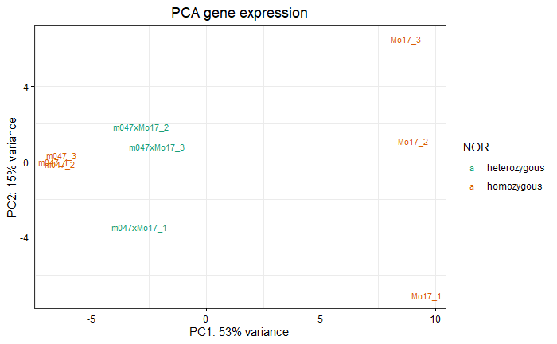

## Overlap DEGs

sig_DEG_b131_B73_b131xB73.txt sig_DEG_b172_B73_b172xB73.txt
sig_DEG_b172_B73_B73xb172.txt sig_DEG_b172_B73_B73xb172_b172xB73.txt
sig_DEG_B73_b015_B73xb015.txt sig_DEG_B73_Mo17_B73xMo17.txt
sig_DEG_Mo17_m047_m047xMo17.txt

Use combined reciprocal b172_B73_B73xb172_b172xB73 (77 DEGs).

``` r
list_files <- c("sig_DEG_B73_Mo17_B73xMo17.txt",
                "sig_DEG_B73_b015_B73xb015.txt",
                "sig_DEG_b131_B73_b131xB73.txt",
                "sig_DEG_b172_B73_B73xb172_b172xB73.txt",
                "sig_DEG_Mo17_m047_m047xMo17.txt")

DEG_list <- list()

for (i in 1:length(list_files)){
  DEG_list[[list_files[[i]]]] <- read.csv(paste("data/rnaseq/",list_files[[i]], sep=""), sep="\t")
}

# Create a list of genes
DEG_list_geneID <- lapply(DEG_list, `[[`, "geneID")

# Rename
names(DEG_list_geneID) <- c("B73xMo17","B73xb015","b131xB73","B73xb172","m047xMo17")

total=39091

res <- supertest(DEG_list_geneID, n=total)

plot(res, Layout="landscape", degree=2:4, sort.by="size", margin=c(0.5,5,1,2))
```

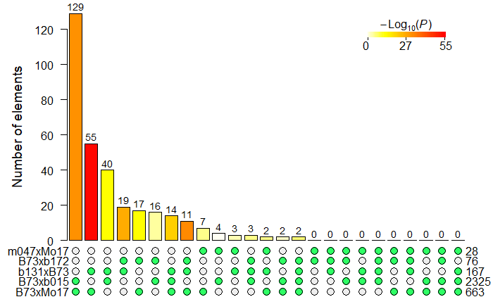

``` r
# Union of NA genes across all backcross hybrids
DEG_NILs <- union(DEG_list_geneID$m047xMo17, DEG_list_geneID$B73xb172, DEG_list_geneID$B73xb015, DEG_list_geneID$b131xB73)

# 2517

# Overlap with F1 NA genes
DEG_NILs_F1 <- intersect(DEG_list_geneID$B73xMo17, DEG_NILs)
# 181

# Calculate probability of intersect
require(GeneOverlap)

gs=39091

overlap <-  newGeneOverlap(DEG_NILs,DEG_list_geneID$B73xMo17 , genome.size = gs)
print(testGeneOverlap(overlap))
```

    Detailed information about this GeneOverlap object:
    listA size=2517, e.g. Zm00001eb002680 Zm00001eb004670 Zm00001eb013940
    listB size=663, e.g. Zm00001eb000750 Zm00001eb002680 Zm00001eb002690
    Intersection size=181, e.g. Zm00001eb002680 Zm00001eb023950 Zm00001eb051620
    Union size=2999, e.g. Zm00001eb002680 Zm00001eb004670 Zm00001eb013940
    Genome size=39091
    # Contingency Table:
          notA  inA
    notB 36092 2336
    inB    482  181
    Overlapping p-value=1.2e-64
    Odds ratio=5.8
    Overlap tested using Fisher's exact test (alternative=greater)
    Jaccard Index=0.1

``` r
require(RVenn)

set_genes <- list(DEG_NILs, DEG_list_geneID$B73xMo17)
set_genes <- Venn(set_genes)
names(set_genes@sets) <- c("NILs", "F1")
ggvenn(set_genes, fill = c("#BCD35F","#DEAA87")) + theme_void()
```

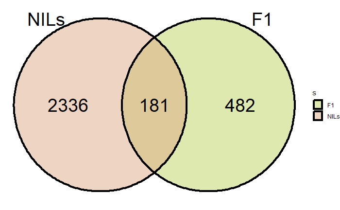

### GO analysis overlap

#### 181 DEG overlap

``` r
lp <- perform_GO(DEG_NILs_F1)

lp[[1]]
lp[[2]]
lp[[3]]
#lp[[4]]

# Save results
lp[[4]]@data
```

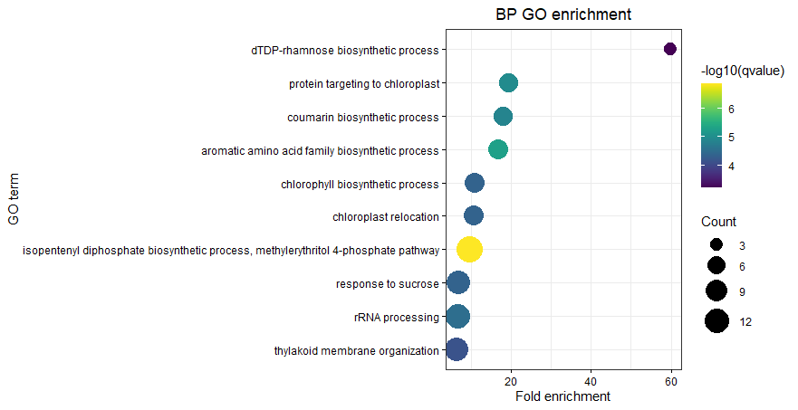 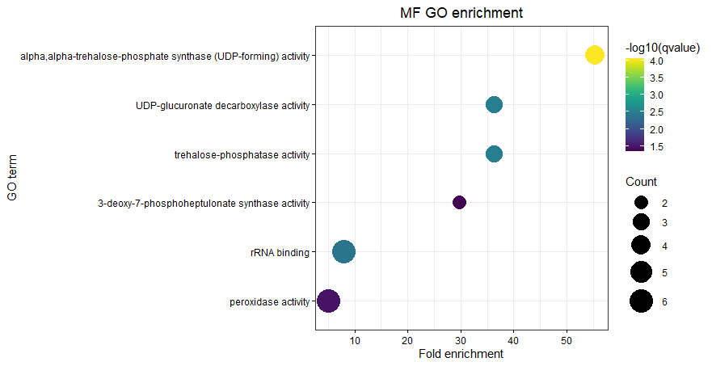

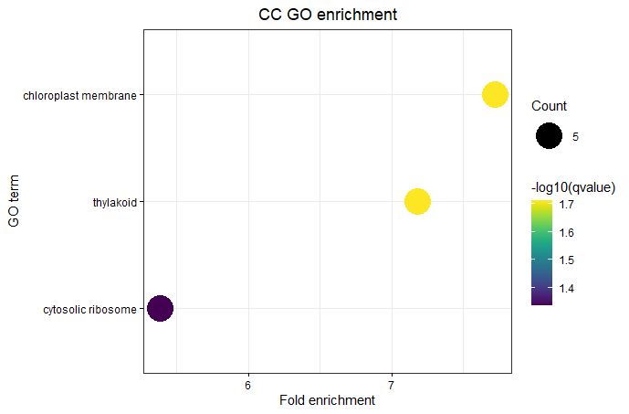

``` r
list_ego_results <- ego_analysis(DEG_NILs_F1)

# Turn list of enrichResult objects into one dataframe
df_ego_analysis <- enrichResult2dataframe(list_ego_results)

# Keep only significant hits (here I use alpha risk 5%)
df_ego_analysis_significant <- df_ego_analysis %>% dplyr::filter(p.adjust < 0.05)

df_ego_analysis_significant_revigo <- df_ego_analysis_significant %>%
  dplyr::select(ID, p.adjust)

write_delim(df_ego_analysis_significant_revigo, 
  "data/df_ego_analysis_significant_revigo_181_NA_genes.txt", delim="\t", col_names = F)
```

``` r
df_BP <- lp[[1]]@data

gene_GO0006364 <- df_BP %>% filter(ID=="GO:0006364") %>% 
        dplyr::select(geneID) %>% str_split("/") %>% unlist()

# 12 genes
gene_GO0006364
```

``` r
plot_gene(gene_GO0006364[[1]])
plot_gene(gene_GO0006364[[2]]) # Keep
plot_gene(gene_GO0006364[[3]]) 
plot_gene(gene_GO0006364[[4]]) 
plot_gene(gene_GO0006364[[5]]) 
plot_gene(gene_GO0006364[[6]]) # Keep
plot_gene(gene_GO0006364[[7]]) 
plot_gene(gene_GO0006364[[8]]) 
plot_gene(gene_GO0006364[[9]]) 
plot_gene(gene_GO0006364[[10]]) 
plot_gene(gene_GO0006364[[11]]) # Keep
plot_gene(gene_GO0006364[[12]]) 

for (i in 1:12){
  print(plot_gene(gene_GO0006364[[i]]))
}
```

``` r
library(VennDiagram)
library(grid)

venn_obj <- venn.diagram(
  x = DEG_list_geneID,
  filename = NULL,
  fill = c("#3a86d4", "#f4a259", "#5fad56", "#d6584f","red"),
  alpha = 0.5, lty = "blank",
  cex = 0.9,
  cat.cex = 1.1, cat.fontface = "bold"
)

grid.newpage()
grid.draw(venn_obj)
```

``` r
list_files <- c("sig_DEG_B73_Mo17_B73xMo17.txt",
                "sig_DEG_b131_B73_b131xB73.txt",
                "sig_DEG_b172_B73_B73xb172_b172xB73.txt",
                "sig_DEG_Mo17_m047_m047xMo17.txt")

DEG_list <- list()

for (i in 1:length(list_files)){
  DEG_list[[list_files[[i]]]] <- read.csv(paste("data/rnaseq/",list_files[[i]], sep=""), sep="\t")
}

# Create a list of genes
DEG_list_geneID <- lapply(DEG_list, `[[`, "geneID")

# Rename
names(DEG_list_geneID) <- c("B73xMo17","b131xB73","B73xb172","m047xMo17")

venn_obj <- venn.diagram(
  x = DEG_list_geneID,
  filename = NULL,
  fill = c("#3a86d4", "#f4a259", "#5fad56", "#d6584f"),
  alpha = 0.5, lty = "blank",
  cex = 0.9,
  cat.cex = 1.1, cat.fontface = "bold"
)

grid.newpage()
grid.draw(venn_obj)
```

#### 2517 NILs DEGs

``` r
lp <- perform_GO(DEG_NILs)

lp[[1]]
lp[[2]]
lp[[3]]
lp[[4]]
```

#### 663 B73xMo17 DEGs

``` r
lp <- perform_GO(DEG_list_geneID$B73xMo17)

lp[[1]]
lp[[2]]
lp[[3]]
lp[[4]]
```

1.  
2.  

# LRT analyses

``` r
txi <- readRDS("data/rnaseq/txi.rds")

# Upload the coldata file for all experiment
coldata <- read.table ("data/rnaseq/coldata.txt", header=T)
```

``` r
require(DEGreport)

# Create a DESeq2 matrix
dds <- DESeqDataSetFromTximport(txi,
                  colData = coldata,
                  design = ~ genotype)


# Likelihood ratio test
dds <- DESeq(dds)

# Get results
#res <- results(res)


plot_gene <- function(geneID) {
  data <- plotCounts(dds,
    gene = geneID, intgroup = "genotype",
    main = geneID, return = TRUE
  )

  data$genotype <- factor(data$genotype, levels = c("B73", "Mo17", "b015", "b131", "b172", "m047", "B73xMo17", "B73xb015", "b131xB73", "B73xb172", "b172xB73", "m047xMo17"), ordered = T)

  data %>%
    ggplot(aes(x = genotype, y = count)) +
    geom_boxplot(fill = "white", outlier.colour = NA) +
    geom_point(size = 2) +
    theme_bw() +
    ggtitle(geneID) +
    theme(plot.title = element_text(hjust = 0.5)) +
    ylab("Normalized read count") +
    xlab("Genotype") +
    theme(axis.text.x = element_text(angle = 90, hjust = 1))
}

list_genes_regionA <- readRDS("data/annotations/list_genes_regionA.Rds")


plot_gene(list_genes_regionA[[34]])
```

## B73, Mo17, B73xMo17

``` r
require(DEGreport)

# Create a DESeq2 matrix
dds <- DESeqDataSetFromTximport(txi,
                  colData = coldata,
                  design = ~ genotype)


selection <- coldata %>% filter(genotype %in% c("B73","Mo17","B73xMo17")) %>% pull(sample)

dds <- dds[, colnames(dds) %in% selection]

# Get rid of unused genotypes
colData(dds)$genotype <- droplevels(colData(dds)$genotype)

# Likelihood ratio test
dds_lrt <- DESeq(dds, test="LRT", reduced = ~ 1)

# Get results
res_LRT <- results(dds_lrt)

sigDEG_ID <- as.data.frame(res_LRT) %>% rownames_to_column("geneID") %>% 
  filter(padj < 0.05) %>% pull(geneID)

# Subset DESeqDataSet to only include DEGs only
dds_subset <- dds[rownames(dds) %in% sigDEG_ID, ]

# Apply rlog transformation to the subsetted DESeqDataSet
rld <- rlog(dds_subset) #, blind = TRUE)

# Extract the rlog values as a matrix
rlog_values <- assay(rld)

# If you want the rlog values as a data frame, you can do this:
rlog_df <- as.data.frame(rlog_values)

# Use the `degPatterns` function from the 'DEGreport' package to show gene clusters across sample groups
cluster_rlog <- rlog_df[sigDEG_ID, ]

design <- as.data.frame(colData(dds))

design$genotype <- factor(design$genotype,levels = c("B73", "B73xMo17", "Mo17"))

clusters <- degPatterns(cluster_rlog, metadata = design, time = "genotype", col=NULL)

saveRDS(clusters, "data/rnaseq/clusters_B73_Mo17_B73xMo17.Rds")

clusters <- readRDS("data/rnaseq/clusters_B73_Mo17_B73xMo17.Rds")

cluster_up_het <- clusters$df[clusters$df$cluster==3,]

cluster_down_het <- clusters$df[clusters$df$cluster==4,]

p <- clusters$plot
p$layers$geom_point$aes_params$alpha <- 0.05
p$layers$geom_line$aes_params$alpha <- 0.05
p1 <- p + scale_color_manual(values = "black") + theme(legend.position = "none")

ggsave("images/clusters_B73_Mo17_B73xMo17.png", p1, width = 8, height = 6)
```

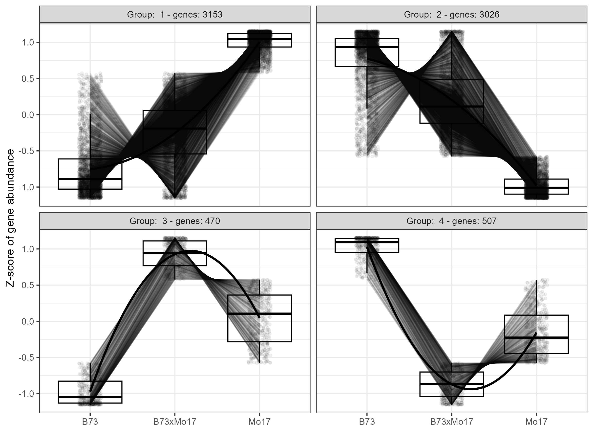

``` r
list_ego_results <- ego_analysis(cluster_3$genes)

lapply(list_ego_results, function(x) sum(x@result$p.adjust < 0.05))

df_ego_analysis <- enrichResult2dataframe(list_ego_results)

df_ego_analysis_significant <- df_ego_analysis %>% dplyr::filter(p.adjust < 0.05)
```

``` r
list_ego_results <- ego_analysis(cluster_4$genes)
```

## b015, B73, B73xb015

``` r
require(DEGreport)


# Create a DESeq2 matrix
dds <- DESeqDataSetFromTximport(txi,
                  colData = coldata,
                  design = ~ genotype)

selection <- coldata %>% filter(genotype %in% c("B73","b015","B73xb015")) %>% pull(sample)

dds <- dds[, colnames(dds) %in% selection]

# Get rid of unused genotypes
colData(dds)$genotype <- droplevels(colData(dds)$genotype)

# Likelihood ratio test
dds_lrt <- DESeq(dds, test="LRT", reduced = ~ 1)

# Get results
res_LRT <- results(dds_lrt)

sigDEG_ID <- as.data.frame(res_LRT) %>% rownames_to_column("geneID") %>% 
  filter(padj < 0.05) %>% pull(geneID)

# Subset DESeqDataSet to only include DEGs only
dds_subset <- dds[rownames(dds) %in% sigDEG_ID, ]

# Apply rlog transformation to the subsetted DESeqDataSet
rld <- rlog(dds_subset) #, blind = TRUE)

# Extract the rlog values as a matrix
rlog_values <- assay(rld)

# If you want the rlog values as a data frame, you can do this:
rlog_df <- as.data.frame(rlog_values)

# Use the `degPatterns` function from the 'DEGreport' package to show gene clusters across sample groups
cluster_rlog <- rlog_df[sigDEG_ID, ]

design <- as.data.frame(colData(dds))

design$genotype <- factor(design$genotype,levels = c("B73", "B73xb015", "b015"))

clusters <- degPatterns(cluster_rlog, metadata = design, time = "genotype", col=NULL)

saveRDS(clusters, "data/rnaseq/clusters_B73_b015_B73xb015.Rds")

clusters <- readRDS("data/rnaseq/clusters_B73_b015_B73xb015.Rds")

cluster_up_het <- clusters$df[clusters$df$cluster==3,]

cluster_down_het <- clusters$df[clusters$df$cluster==4,]

p <- clusters$plot
p$layers$geom_point$aes_params$alpha <- 0.05
p$layers$geom_line$aes_params$alpha <- 0.05
p1 <- p + scale_color_manual(values = "black") + theme(legend.position = "none")

ggsave("images/clusters_B73_b015_B73xb015.png", p1, width = 8, height = 6)
```

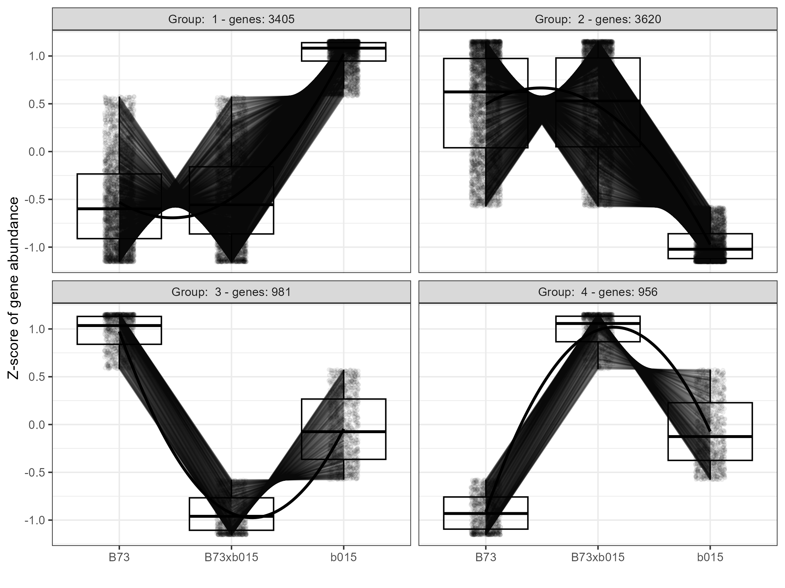

## b131, B73, b131xB73

``` r
require(DEGreport)

# Create a DESeq2 matrix
dds <- DESeqDataSetFromTximport(txi,
                  colData = coldata,
                  design = ~ genotype)

selection <- coldata %>% filter(genotype %in% c("B73","b131","b131xB73")) %>% pull(sample)

dds <- dds[, colnames(dds) %in% selection]

# Get rid of unused genotypes
colData(dds)$genotype <- droplevels(colData(dds)$genotype)

# Likelihood ratio test
dds_lrt <- DESeq(dds, test="LRT", reduced = ~ 1)

# Get results
res_LRT <- results(dds_lrt)

sigDEG_ID <- as.data.frame(res_LRT) %>% rownames_to_column("geneID") %>% 
  filter(padj < 0.05) %>% pull(geneID)

# Subset DESeqDataSet to only include DEGs only
dds_subset <- dds[rownames(dds) %in% sigDEG_ID, ]

# Apply rlog transformation to the subsetted DESeqDataSet
rld <- rlog(dds_subset) #, blind = TRUE)

# Extract the rlog values as a matrix
rlog_values <- assay(rld)

# If you want the rlog values as a data frame, you can do this:
rlog_df <- as.data.frame(rlog_values)

# Use the `degPatterns` function from the 'DEGreport' package to show gene clusters across sample groups
cluster_rlog <- rlog_df[sigDEG_ID, ]

design <- as.data.frame(colData(dds))

design$genotype <- factor(design$genotype,levels = c("b131", "b131xB73", "B73"))

clusters <- degPatterns(cluster_rlog, metadata = design, time = "genotype", col=NULL)

saveRDS(clusters, "data/rnaseq/clusters_B73_b131_b131xB73.Rds")

clusters <- readRDS("data/rnaseq/clusters_B73_b131_b131xB73.Rds")

cluster_down_het <- clusters$df[clusters$df$cluster==3,]

cluster_up_het <- clusters$df[clusters$df$cluster==4,]

p <- clusters$plot
p$layers$geom_point$aes_params$alpha <- 0.05
p$layers$geom_line$aes_params$alpha <- 0.05
p1 <- p + scale_color_manual(values = "black") + theme(legend.position = "none")

ggsave("images/clusters_B73_b131_b131xB73.png", p1, width = 8, height = 6)
```

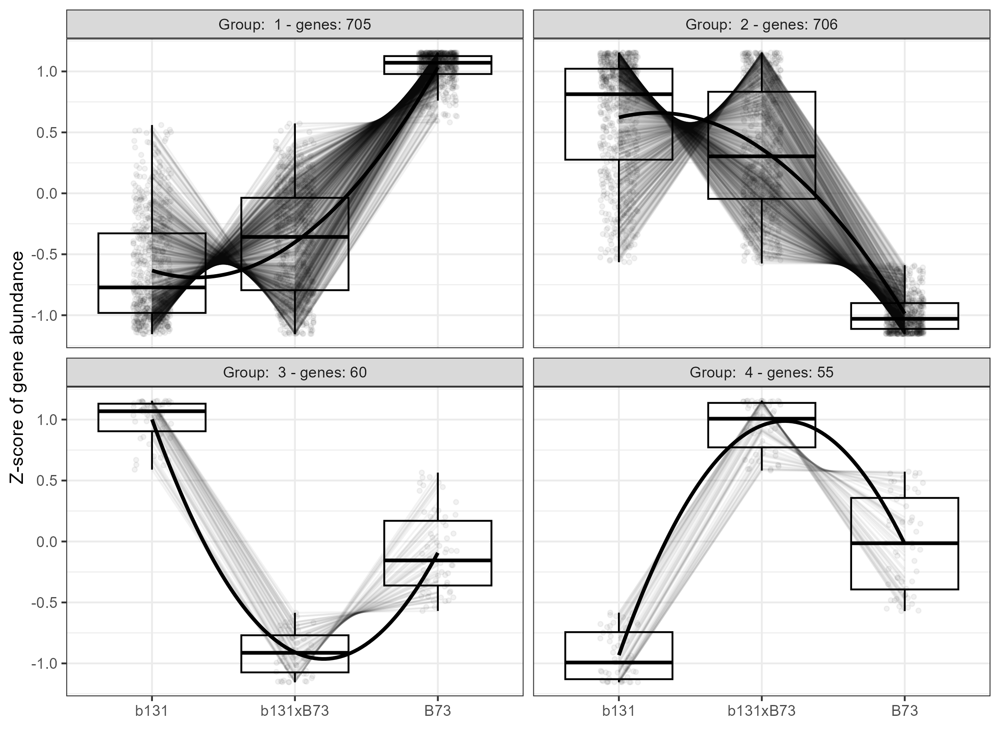

## b172, B73, B73xb172

``` r
require(DEGreport)

# Create a DESeq2 matrix
dds <- DESeqDataSetFromTximport(txi,
                  colData = coldata,
                  design = ~ genotype)

selection <- coldata %>% filter(genotype %in% c("b172","B73","B73xb172")) %>% pull(sample)

dds <- dds[, colnames(dds) %in% selection]

# Get rid of unused genotypes
colData(dds)$genotype <- droplevels(colData(dds)$genotype)

# Likelihood ratio test
dds_lrt <- DESeq(dds, test="LRT", reduced = ~ 1)

# Get results
res_LRT <- results(dds_lrt)

sigDEG_ID <- as.data.frame(res_LRT) %>% rownames_to_column("geneID") %>% 
  filter(padj < 0.05) %>% pull(geneID)

# Subset DESeqDataSet to only include DEGs only
dds_subset <- dds[rownames(dds) %in% sigDEG_ID, ]

# Apply rlog transformation to the subsetted DESeqDataSet
rld <- rlog(dds_subset) #, blind = TRUE)

# Extract the rlog values as a matrix
rlog_values <- assay(rld)

# If you want the rlog values as a data frame, you can do this:
rlog_df <- as.data.frame(rlog_values)

# Use the `degPatterns` function from the 'DEGreport' package to show gene clusters across sample groups
cluster_rlog <- rlog_df[sigDEG_ID, ]

design <- as.data.frame(colData(dds))

design$genotype <- factor(design$genotype,levels = c("B73", "B73xb172", "b172"))

clusters <- degPatterns(cluster_rlog, metadata = design, time = "genotype", col=NULL)


clusters <- degPatterns(cluster_rlog, metadata = design, consensusCluster=F, time = "genotype", col=NULL)

saveRDS(clusters, "data/rnaseq/clusters_b172_B73_B73xb172.Rds")

clusters <- readRDS("data/rnaseq/clusters_b172_B73_B73xb172.Rds")

cluster_down_het <- clusters$df[clusters$df$cluster==3,]

cluster_up_het <- clusters$df[clusters$df$cluster==4,]

p <- clusters$plot
p$layers$geom_point$aes_params$alpha <- 0.05
p$layers$geom_line$aes_params$alpha <- 0.05
p1 <- p + scale_color_manual(values = "black") + theme(legend.position = "none")

ggsave("images/clusters_b172_B73_B73xb172.png", p1, width = 8, height = 6)
```

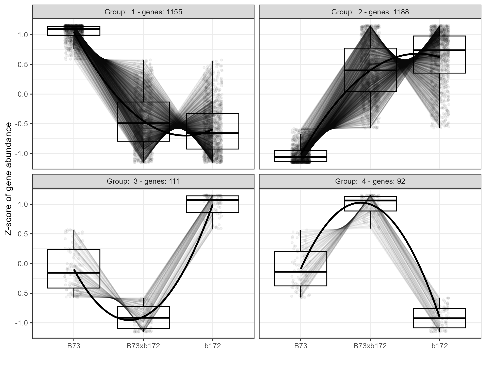

## b172, B73, b172xB73

``` r
require(DEGreport)

# Create a DESeq2 matrix
dds <- DESeqDataSetFromTximport(txi,
                  colData = coldata,
                  design = ~ genotype)

selection <- coldata %>% filter(genotype %in% c("b172","B73","b172xB73")) %>% pull(sample)

dds <- dds[, colnames(dds) %in% selection]

# Get rid of unused genotypes
colData(dds)$genotype <- droplevels(colData(dds)$genotype)

# Likelihood ratio test
dds_lrt <- DESeq(dds, test="LRT", reduced = ~ 1)

# Get results
res_LRT <- results(dds_lrt)

sigDEG_ID <- as.data.frame(res_LRT) %>% rownames_to_column("geneID") %>% 
  filter(padj < 0.05) %>% pull(geneID)

# Subset DESeqDataSet to only include DEGs only
dds_subset <- dds[rownames(dds) %in% sigDEG_ID, ]

# Apply rlog transformation to the subsetted DESeqDataSet
rld <- rlog(dds_subset) #, blind = TRUE)

# Extract the rlog values as a matrix
rlog_values <- assay(rld)

# If you want the rlog values as a data frame, you can do this:
rlog_df <- as.data.frame(rlog_values)

# Use the `degPatterns` function from the 'DEGreport' package to show gene clusters across sample groups
cluster_rlog <- rlog_df[sigDEG_ID, ]

design <- as.data.frame(colData(dds))

design$genotype <- factor(design$genotype,levels = c("b172", "b172xB73", "B73"))

clusters <- degPatterns(cluster_rlog, metadata = design, time = "genotype", col=NULL)

saveRDS(clusters, "data/rnaseq/clusters_b172_B73_b172xB73.Rds")

clusters <- readRDS("data/rnaseq/clusters_b172_B73_b172xB73.Rds")

cluster_down_het <- clusters$df[clusters$df$cluster==3,]

cluster_up_het <- clusters$df[clusters$df$cluster==4,]

p <- clusters$plot
p$layers$geom_point$aes_params$alpha <- 0.05
p$layers$geom_line$aes_params$alpha <- 0.05
p1 <- p + scale_color_manual(values = "black") + theme(legend.position = "none")

ggsave("images/clusters_b172_B73_b172xB73.png", p1, width = 8, height = 6)
```

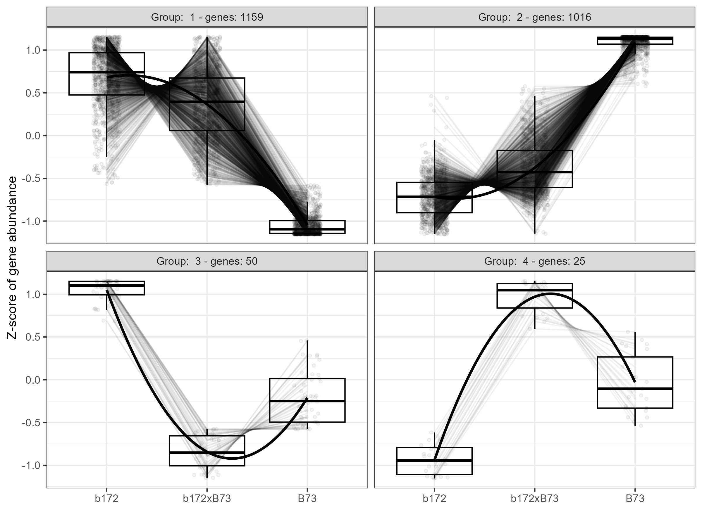

## b172, B73, B73xb172, b172xB73

``` r
require(DEGreport)

# Create a DESeq2 matrix
dds <- DESeqDataSetFromTximport(txi,
                  colData = coldata,
                  design = ~ genotype)

selection <- coldata %>% filter(genotype %in% c("b172","B73","B73xb172","b172xB73")) %>% pull(sample)

dds <- dds[, colnames(dds) %in% selection]

# Get rid of unused genotypes
colData(dds)$genotype <- droplevels(colData(dds)$genotype)

# Likelihood ratio test
dds_lrt <- DESeq(dds, test="LRT", reduced = ~ 1)

# Get results
res_LRT <- results(dds_lrt)

sigDEG_ID <- as.data.frame(res_LRT) %>% rownames_to_column("geneID") %>% 
  filter(padj < 0.05) %>% pull(geneID)

# Subset DESeqDataSet to only include DEGs only
dds_subset <- dds[rownames(dds) %in% sigDEG_ID, ]

# Apply rlog transformation to the subsetted DESeqDataSet
rld <- rlog(dds_subset) #, blind = TRUE)

# Extract the rlog values as a matrix
rlog_values <- assay(rld)

# If you want the rlog values as a data frame, you can do this:
rlog_df <- as.data.frame(rlog_values)

# Use the `degPatterns` function from the 'DEGreport' package to show gene clusters across sample groups
cluster_rlog <- rlog_df[sigDEG_ID, ]

design <- as.data.frame(colData(dds))

design$genotype <- factor(design$genotype,levels = c("B73", "B73xb172", "b172xB73", "b172"))

clusters <- degPatterns(cluster_rlog, metadata = design, time = "genotype", col=NULL)

saveRDS(clusters, "data/rnaseq/clusters_b172_B73_B73xb172_b172xB73.Rds")

clusters <- readRDS("data/rnaseq/clusters_b172_B73_B73xb172_b172xB73.Rds")

cluster_down_het <- clusters$df[clusters$df$cluster==7,]

cluster_up_het <- clusters$df[clusters$df$cluster==8,]

p <- clusters$plot
p$layers$geom_point$aes_params$alpha <- 0.05
p$layers$geom_line$aes_params$alpha <- 0.05
p1 <- p + scale_color_manual(values = "black") + theme(legend.position = "none")

ggsave("images/clusters_b172_B73_B73xb172_b172xB73.png", p1, width = 8, height = 6)
```

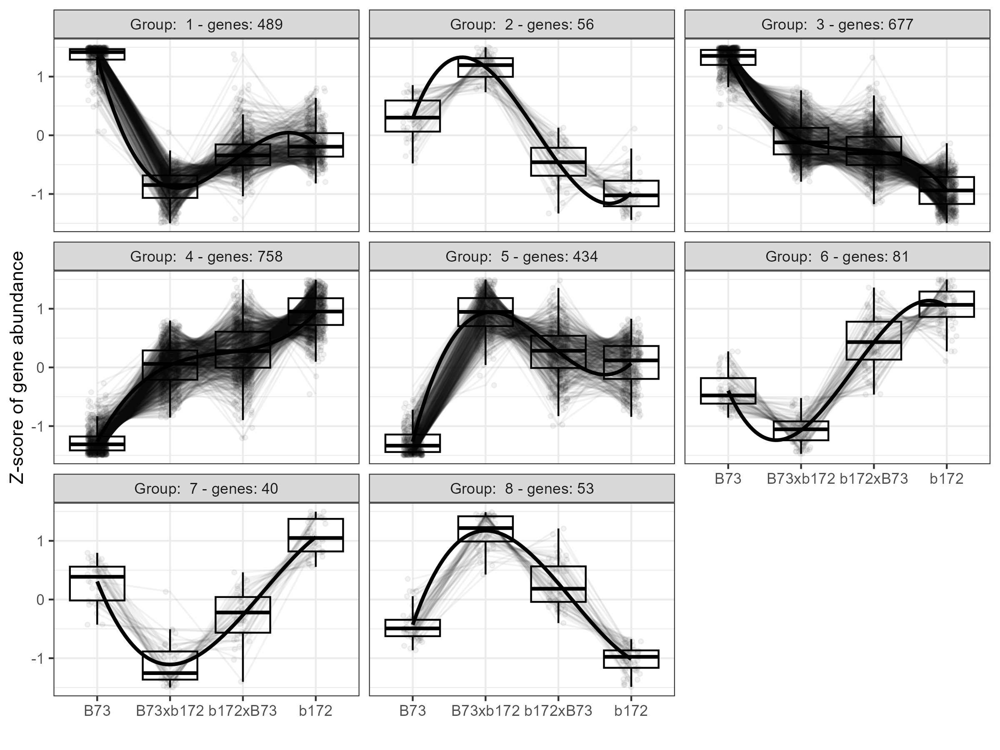

## Mo17, m047, m047xMo17

``` r
require(DEGreport)

# Create a DESeq2 matrix
dds <- DESeqDataSetFromTximport(txi,
                  colData = coldata,
                  design = ~ genotype)


selection <- coldata %>% filter(genotype %in% c("m047","Mo17","m047xMo17")) %>% pull(sample)

dds <- dds[, colnames(dds) %in% selection]

# Get rid of unused genotypes
colData(dds)$genotype <- droplevels(colData(dds)$genotype)

# Likelihood ratio test
dds_lrt <- DESeq(dds, test="LRT", reduced = ~ 1)

# Get results
res_LRT <- results(dds_lrt)

sigDEG_ID <- as.data.frame(res_LRT) %>% rownames_to_column("geneID") %>% 
  filter(padj < 0.05) %>% pull(geneID)

# Subset DESeqDataSet to only include DEGs only
dds_subset <- dds[rownames(dds) %in% sigDEG_ID, ]

# Apply rlog transformation to the subsetted DESeqDataSet
rld <- rlog(dds_subset) #, blind = TRUE)

# Extract the rlog values as a matrix
rlog_values <- assay(rld)

# If you want the rlog values as a data frame, you can do this:
rlog_df <- as.data.frame(rlog_values)

# Use the `degPatterns` function from the 'DEGreport' package to show gene clusters across sample groups
cluster_rlog <- rlog_df[sigDEG_ID, ]

design <- as.data.frame(colData(dds))

design$genotype <- factor(design$genotype,levels = c("m047", "m047xMo17", "Mo17"))

clusters <- degPatterns(cluster_rlog, metadata = design, time = "genotype", col=NULL)

saveRDS(clusters, "data/rnaseq/clusters_Mo17_m047_m047xMo17.Rds")

clusters <- readRDS("data/rnaseq/clusters_Mo17_m047_m047xMo17.Rds")

p <- clusters$plot
p$layers$geom_point$aes_params$alpha <- 0.05
p$layers$geom_line$aes_params$alpha <- 0.05
p1 <- p + scale_color_manual(values = "black") + theme(legend.position = "none")

ggsave("images/clusters_Mo17_m047_m047xMo17.png", p1, width = 8, height = 6)
```

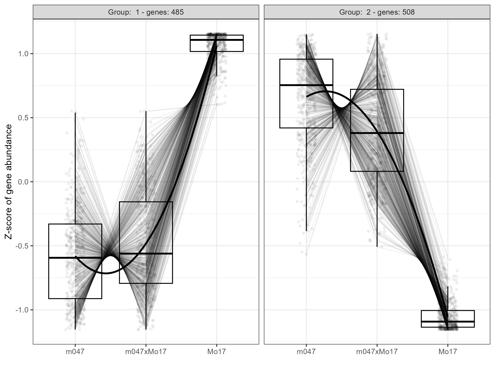

## Overlap DEGs

``` r
# Create a dataframe with all DEGs

clusters <- readRDS("data/rnaseq/clusters_B73_Mo17_B73xMo17.Rds")

cluster_up_het <- clusters$df[clusters$df$cluster==3,]

cluster_down_het <- clusters$df[clusters$df$cluster==4,]

df_1 <- data.frame(analysis=rep("B73xMo17", length(cluster_up_het$genes)+length(cluster_down_het$genes)), geneID=c(cluster_up_het$genes, cluster_down_het$genes), het_vs_hom = c(rep("up", length(cluster_up_het$genes)), rep("down",length(cluster_down_het$genes))))


clusters <- readRDS("data/rnaseq/clusters_B73_b015_B73xb015.Rds")

cluster_up_het <- clusters$df[clusters$df$cluster==3,]

cluster_down_het <- clusters$df[clusters$df$cluster==4,]

df_2 <- data.frame(analysis=rep("B73xb015", length(cluster_up_het$genes)+length(cluster_down_het$genes)), geneID=c(cluster_up_het$genes, cluster_down_het$genes), het_vs_hom = c(rep("up", length(cluster_up_het$genes)), rep("down",length(cluster_down_het$genes))))


clusters <- readRDS("data/rnaseq/clusters_B73_b131_b131xB73.Rds")

cluster_down_het <- clusters$df[clusters$df$cluster==3,]

cluster_up_het <- clusters$df[clusters$df$cluster==4,]

df_3 <- data.frame(analysis=rep("b131xB73", length(cluster_up_het$genes)+length(cluster_down_het$genes)), geneID=c(cluster_up_het$genes, cluster_down_het$genes), het_vs_hom = c(rep("up", length(cluster_up_het$genes)), rep("down",length(cluster_down_het$genes))))


clusters <- readRDS("data/rnaseq/clusters_b172_B73_B73xb172.Rds")

cluster_down_het <- clusters$df[clusters$df$cluster==3,]

cluster_up_het <- clusters$df[clusters$df$cluster==4,]

df_4 <- data.frame(analysis=rep("B73xb172", length(cluster_up_het$genes)+length(cluster_down_het$genes)), geneID=c(cluster_up_het$genes, cluster_down_het$genes), het_vs_hom = c(rep("up", length(cluster_up_het$genes)), rep("down",length(cluster_down_het$genes))))


clusters <- readRDS("data/rnaseq/clusters_b172_B73_b172xB73.Rds")

cluster_down_het <- clusters$df[clusters$df$cluster==3,]

cluster_up_het <- clusters$df[clusters$df$cluster==4,]

df_5 <- data.frame(analysis=rep("b172xB73", length(cluster_up_het$genes)+length(cluster_down_het$genes)), geneID=c(cluster_up_het$genes, cluster_down_het$genes), het_vs_hom = c(rep("up", length(cluster_up_het$genes)), rep("down",length(cluster_down_het$genes))))


clusters <- readRDS("data/rnaseq/clusters_b172_B73_B73xb172_b172xB73.Rds")

cluster_down_het <- clusters$df[clusters$df$cluster==7,]

cluster_up_het <- clusters$df[clusters$df$cluster==8,]

df_6 <- data.frame(analysis=rep("B73xb172_b172xB73", length(cluster_up_het$genes)+length(cluster_down_het$genes)), geneID=c(cluster_up_het$genes, cluster_down_het$genes), het_vs_hom = c(rep("up", length(cluster_up_het$genes)), rep("down",length(cluster_down_het$genes))))

df_analysis <- rbind(df_1, df_2, df_3, df_4, df_5, df_6)

saveRDS(df_analysis, "data/rnaseq/summary_LRT_analysis.Rds")
```

## Intersect

### All NAs

``` r
library(ComplexUpset)
library(tibble)
library(dplyr)

# Convert long to large
df_analysis <- readRDS("data/rnaseq/summary_LRT_analysis.Rds")

#df_analysis_large <- reshape(data=df_analysis, idvar="geneID", v.names=c("geneID"), timevar="analysis", direction="wide")

genes <- list(B73xMo17=df_analysis[df_analysis$analysis=="B73xMo17", "geneID"],
              B73xb015=df_analysis[df_analysis$analysis=="B73xb015", "geneID"],
              b131xB73=df_analysis[df_analysis$analysis=="b131xB73", "geneID"],
              B73xb172=df_analysis[df_analysis$analysis=="B73xb172", "geneID"],
              b172xB73=df_analysis[df_analysis$analysis=="b172xB73", "geneID"])#,
              #B73xb172_b172xB73=df_analysis[df_analysis$analysis=="B73xb172_b172xB73", "geneID"])
              

# convert to data frame of membership (one row per gene)
all_genes <- unique(unlist(genes))
df <- tibble(gene = all_genes)
for(nm in names(genes)){
df[[nm]] <- df$gene %in% genes[[nm]]
}

ComplexUpset::upset(df, names(genes), min_size = 10)
```

``` r
total=39091
res <- supertest(genes, n=total)
plot(res, Layout="landscape", degree=2:4, sort.by="size", margin=c(0.5,5,1,2))
```

### Only up NA

``` r
# Convert long to large
df_analysis <- readRDS("data/rnaseq/summary_LRT_analysis.Rds")

df_analysis <- df_analysis %>% filter(het_vs_hom=="up")

#df_analysis_large <- reshape(data=df_analysis, idvar="geneID", v.names=c("geneID"), timevar="analysis", direction="wide")

genes <- list(B73xMo17=df_analysis[df_analysis$analysis=="B73xMo17", "geneID"],
              B73xb015=df_analysis[df_analysis$analysis=="B73xb015", "geneID"],
              b131xB73=df_analysis[df_analysis$analysis=="b131xB73", "geneID"],
              B73xb172=df_analysis[df_analysis$analysis=="B73xb172", "geneID"],
              b172xB73=df_analysis[df_analysis$analysis=="b172xB73", "geneID"]) #,
              #B73xb172_b172xB73=df_analysis[df_analysis$analysis=="B73xb172_b172xB73", "geneID"])
              

# convert to data frame of membership (one row per gene)
all_genes <- unique(unlist(genes))
df <- tibble(gene = all_genes)
for(nm in names(genes)){
df[[nm]] <- df$gene %in% genes[[nm]]
}

ComplexUpset::upset(df, names(genes), min_size = 10)
```

``` r
total=39091
res <- supertest(genes, n=total)
plot(res, Layout="landscape", degree=2:4, sort.by="size", margin=c(0.5,5,1,2))
```

### Only down NA

``` r
# Convert long to large
df_analysis <- readRDS("data/rnaseq/summary_LRT_analysis.Rds")

df_analysis <- df_analysis %>% filter(het_vs_hom=="down")

#df_analysis_large <- reshape(data=df_analysis, idvar="geneID", v.names=c("geneID"), timevar="analysis", direction="wide")

genes <- list(B73xMo17=df_analysis[df_analysis$analysis=="B73xMo17", "geneID"],
              B73xb015=df_analysis[df_analysis$analysis=="B73xb015", "geneID"],
              b131xB73=df_analysis[df_analysis$analysis=="b131xB73", "geneID"],
              B73xb172=df_analysis[df_analysis$analysis=="B73xb172", "geneID"],
              b172xB73=df_analysis[df_analysis$analysis=="b172xB73", "geneID"])
             # B73xb172_b172xB73=df_analysis[df_analysis$analysis=="B73xb172_b172xB73", "geneID"])
              

total=39091
res <- supertest(genes, n=total)
plot(res, Layout="landscape", degree=2:3, sort.by="size", margin=c(0.5,5,1,2))
```

``` r
df_analysis <- readRDS("data/rnaseq/summary_LRT_analysis.Rds")

genes <- list(B73xMo17=df_analysis[df_analysis$analysis=="B73xMo17", "geneID"],
              B73xb015=df_analysis[df_analysis$analysis=="B73xb015", "geneID"],
              b131xB73=df_analysis[df_analysis$analysis=="b131xB73", "geneID"],
              B73xb172=df_analysis[df_analysis$analysis=="B73xb172", "geneID"],
              b172xB73=df_analysis[df_analysis$analysis=="b172xB73", "geneID"],
              B73xb172_b172xB73=df_analysis[df_analysis$analysis=="B73xb172_b172xB73", "geneID"])
             

ck <- compareCluster(geneCluster = genes)
```

### Check locations of NA genes

``` bash
# Download gene annotation B73 NAM5
wget https://download.maizegdb.org/Zm-B73-REFERENCE-NAM-5.0/Zm-B73-REFERENCE-NAM-5.0_Zm00001eb.1.gff3

# Keep only genes
awk '$3=="gene"' Zm-B73-REFERENCE-NAM-5.0_Zm00001eb.1.gff3 > Zm-B73-REFERENCE-NAM-5.0_Zm00001eb.1.genes.gff3

module load bedops
gff2bed < Zm-B73-REFERENCE-NAM-5.0_Zm00001eb.1.genes.gff3 > Zm-B73-REFERENCE-NAM-5.0_Zm00001eb.1.genes.bed

# Isolate gene name
cut -f10 Zm-B73-REFERENCE-NAM-5.0_Zm00001eb.1.genes.bed | cut -d";" -f1 | cut -d"=" -f2 > gene_names.txt

cut -f1-3 Zm-B73-REFERENCE-NAM-5.0_Zm00001eb.1.genes.bed > tmp1
cut -f5-6 Zm-B73-REFERENCE-NAM-5.0_Zm00001eb.1.genes.bed > tmp2
paste tmp1 gene_names.txt tmp2 > Zm-B73-REFERENCE-NAM-5.0_Zm00001eb.1.genes.simplified.bed
```

``` r
B73_NAM5_genes <- read.delim("data/annotations/Zm-B73-REFERENCE-NAM-5.0_Zm00001eb.1.genes.simplified.bed", header=FALSE)

colnames(B73_NAM5_genes) <- c("chr","start","end","name","score","strand")

df_analysis <- readRDS("data/rnaseq/summary_LRT_analysis.Rds")

df_analysis_annotated <- merge.data.frame(df_analysis, B73_NAM5_genes, by.x="geneID",by.y="name")

table(df_analysis_annotated$chr)
```

``` r
chr <- rep(paste0("chr", 1:10), 1)
size_chr <- c("308452471", "243675191", "238017767", "250330460", "226353449",
"181357234", "185808916", "182411202", "163004744", "152435371")

df_chromosomes = data.frame(chr=chr, size_chr=as.integer(size_chr))

table_NA <- as.data.frame(table(df_analysis_annotated$chr))
colnames(table_NA) <- c("chr","number_NA_genes")

df_chr_NA <- merge.data.frame(df_chromosomes, table_NA, by.x="chr",by.y="chr")

ggplot(df_chr_NA, aes(x = size_chr, y = number_NA_genes)) +
  geom_point() +
  geom_smooth(method = "lm", col = "black") +
  stat_regline_equation(label.x.npc = "left", label.y.npc = "top")


require(ggplot2)
require(smplot2)

ggplot(df_chr_NA, aes(x = size_chr, y = number_NA_genes)) +
  geom_point() +
  geom_smooth(method = "lm", col = "black") +
  sm_statCorr(color = "black", corr_method = "pearson")
```

``` r
df_analysis_annotated_b015 <- df_analysis_annotated %>% filter(analysis=="B73xb015")

table_NA <- as.data.frame(table(df_analysis_annotated_b015$chr))
colnames(table_NA) <- c("chr","number_NA_genes")

df_chr_NA <- merge.data.frame(df_chromosomes, table_NA, by.x="chr",by.y="chr")

ggplot(df_chr_NA, aes(x = size_chr, y = number_NA_genes)) +
  geom_point() +
  geom_smooth(method = "lm", col = "black") +
  stat_regline_equation(label.x.npc = "left", label.y.npc = "top")


require(ggplot2)
require(smplot2)

ggplot(df_chr_NA, aes(x = size_chr, y = number_NA_genes)) +
  geom_point() +
  geom_smooth(method = "lm", col = "black") +
  sm_statCorr(color = "black", corr_method = "pearson")
```

## GO analysis

### B73xMo17

#### All

``` r
df_analysis <- readRDS("data/rnaseq/summary_LRT_analysis.Rds")

list_genes <- df_analysis %>% filter(analysis=="B73xMo17") %>% pull(geneID)

lp <- perform_GO(list_genes)

(lp[[1]] | lp[[2]] | lp[[3]])
```

#### Up

``` r
df_analysis <- readRDS("data/rnaseq/summary_LRT_analysis.Rds")

list_genes <- df_analysis %>% filter(analysis=="B73xMo17" & het_vs_hom=="up")  %>% pull(geneID)

lp <- perform_GO(list_genes)

(lp[[1]] | lp[[2]] | lp[[3]])
```

#### Down

``` r
df_analysis <- readRDS("data/rnaseq/summary_LRT_analysis.Rds")

list_genes <- df_analysis %>% filter(analysis=="B73xMo17" & het_vs_hom=="down")  %>% pull(geneID)

lp <- perform_GO(list_genes)

(lp[[1]] | lp[[2]] | lp[[3]])
```

### B73xb015

``` r
df_analysis <- readRDS("data/rnaseq/summary_LRT_analysis.Rds")

list_genes <- df_analysis %>% filter(analysis=="B73xb015") %>% pull(geneID)

lp <- perform_GO(list_genes)

(lp[[1]] | lp[[2]] | lp[[3]])

df_analysis <- readRDS("data/rnaseq/summary_LRT_analysis.Rds")

list_genes <- df_analysis %>% filter(analysis=="B73xb015" & het_vs_hom=="up")  %>% pull(geneID)

lp <- perform_GO(list_genes)

(lp[[1]] | lp[[2]] | lp[[3]])

df_analysis <- readRDS("data/rnaseq/summary_LRT_analysis.Rds")

list_genes <- df_analysis %>% filter(analysis=="B73xb015" & het_vs_hom=="down")  %>% pull(geneID)

lp <- perform_GO(list_genes)

(lp[[1]] | lp[[2]] | lp[[3]])
```

### b131xB73

``` r
df_analysis <- readRDS("data/rnaseq/summary_LRT_analysis.Rds")

list_genes <- df_analysis %>% filter(analysis=="b131xB73") %>% pull(geneID)

lp <- perform_GO(list_genes)

lp[[4]]

df_analysis <- readRDS("data/rnaseq/summary_LRT_analysis.Rds")

list_genes <- df_analysis %>% filter(analysis=="b131xB73" & het_vs_hom=="up")  %>% pull(geneID)

lp <- perform_GO(list_genes)

lp[[4]]


df_analysis <- readRDS("data/rnaseq/summary_LRT_analysis.Rds")

list_genes <- df_analysis %>% filter(analysis=="b131xB73" & het_vs_hom=="down")  %>% pull(geneID)

lp <- perform_GO(list_genes)

lp[[4]]
```

### b172xB73

``` r
df_analysis <- readRDS("data/rnaseq/summary_LRT_analysis.Rds")

list_genes <- df_analysis %>% filter(analysis=="b172xB73") %>% pull(geneID)

lp <- perform_GO(list_genes)

lp[[4]]

df_analysis <- readRDS("data/rnaseq/summary_LRT_analysis.Rds")

list_genes <- df_analysis %>% filter(analysis=="b172xB73" & het_vs_hom=="up")  %>% pull(geneID)

lp <- perform_GO(list_genes)

lp[[4]]


df_analysis <- readRDS("data/rnaseq/summary_LRT_analysis.Rds")

list_genes <- df_analysis %>% filter(analysis=="b172xB73" & het_vs_hom=="down")  %>% pull(geneID)

lp <- perform_GO(list_genes)

lp[[4]]
```

### B73xb172

``` r
df_analysis <- readRDS("data/rnaseq/summary_LRT_analysis.Rds")

list_genes <- df_analysis %>% filter(analysis=="B73xb172") %>% pull(geneID)

lp <- perform_GO(list_genes)

lp[[4]]

df_analysis <- readRDS("data/rnaseq/summary_LRT_analysis.Rds")

list_genes <- df_analysis %>% filter(analysis=="B73xb172" & het_vs_hom=="up")  %>% pull(geneID)

lp <- perform_GO(list_genes)

lp[[4]]


df_analysis <- readRDS("data/rnaseq/summary_LRT_analysis.Rds")

list_genes <- df_analysis %>% filter(analysis=="B73xb172" & het_vs_hom=="down")  %>% pull(geneID)

lp <- perform_GO(list_genes)

lp[[4]]
```

1.  

# Degree of dominance analysis

``` r
da_calculation <- function(dds, P1, P2, F1){
  
  # Keep only wanted genotypes
  selection <- coldata %>% filter(genotype %in% c(P1,P2,F1)) %>% pull(sample)
  
  # Subset dds
  dds_sub <- dds[, colnames(dds) %in% selection]
  
  # Get normalized read count 
  cts_norm <- counts(dds_sub, normalized=TRUE)
  
  # Calculate mean values of the 3 replicates
  P1_mean <- rowSums(cts_norm[,c(paste(P1,"_1", sep=""),paste(P1,"_2", sep=""), paste(P1,"_3", sep=""))])/3
  P2_mean <- rowSums(cts_norm[,c(paste(P2,"_1", sep=""),paste(P2,"_2", sep=""), paste(P2,"_3", sep=""))])/3
  F1_mean <- rowSums(cts_norm[,c(paste(F1,"_1", sep=""),paste(F1,"_2", sep=""), paste(F1,"_3", sep=""))])/3
  
  # Mid-parent value
  MP <- (P1_mean+P2_mean)/2
  
  # Dominance value
  d <- F1_mean-MP
  # Additive value
  a <- abs(P1_mean-P2_mean)/2
  
  # degree of dominance value
  da <- d/a
  
  return(da)
}

dds <- DESeqDataSetFromTximport(txi,
                colData = coldata,
                design = ~ genotype)

dds <- DESeq(dds)

da_list <- list()
da_list[[1]] <- da_calculation(dds, "B73", "Mo17","B73xMo17")
da_list[[2]] <- da_calculation(dds, "b015", "B73","B73xb015")
da_list[[3]] <- da_calculation(dds, "b131", "B73","b131xB73")
da_list[[4]] <- da_calculation(dds, "b172", "B73","b172xB73")
da_list[[5]] <- da_calculation(dds, "b172", "B73","B73xb172")
da_list[[6]] <- da_calculation(dds, "Mo17", "m047","m047xMo17")

names(da_list) <- c("B73xMo17","B73xb015","b131xB73","b172xB73","B73xb172","m047xMo17")

# Remove Inf and NA values

da_list_clean <- lapply(da_list, function(y) y[!is.na(y) & !is.infinite(y)])

da_list_clean_sorted <- lapply(da_list_clean, function(x) sort(x, decreasing = T))

saveRDS(da_list_clean_sorted,"data/degree_of_dominance_list.Rds")
```

``` r
# Generate sample data
set.seed(123)
x <- rnorm(100)

# Plot density histogram
hist(x, freq = FALSE, col = "lightgray", main = "Histogram with Density Line")

# Overlay the density line
lines(density(x), col = "blue", lwd = 2)
```

``` r
da_list <- readRDS("data/degree_of_dominance_list.Rds")

# Plot density histogram
hist(da_list$B73xMo17, freq = FALSE, col = "lightgray", main = "Histogram with Density Line")

# Overlay the density line
lines(density(da_list$B73xMo17), col = "blue", lwd = 2)
```

``` r
p <- ggplot(da_list$B73xMo17, aes(x = da_list$B73xMo17))
# add command to produce a "faded" histogram and select the number of bins
# then overlay density curve (converted to common axis of count)
p + geom_histogram(fill="black", colour="black", alpha = 0.25, binwidth=0.5) + geom_density(aes(y=0.5*..count..), colour="black", adjust=4) 
```

``` r
da_list <- readRDS("data/degree_of_dominance_list.Rds")

# Top and bottom NA (<2.5% and > 97.5%)
top_2_5_pos <- lapply(da_list, function(v) {
  v[v > quantile(v, 0.975, na.rm = TRUE)]
})

bottom_2_5_neg <- lapply(da_list, function(v) {
  v[v < quantile(v, 0.025, na.rm = TRUE)]
})

top_2_5_pos_genes <- lapply(top_2_5_pos, names)
bottom_2_5_neg_genes <- lapply(bottom_2_5_neg, names)

top_2_5_pos_stack <- stack(top_2_5_pos_genes)
top_2_5_pos_stack$da <- "positive"

bottom_2_5_neg_stack <- stack(bottom_2_5_neg_genes)
bottom_2_5_neg_stack$da <- "negative"

# Create one dataframe with all information
da_df <- rbind(top_2_5_pos_stack, bottom_2_5_neg_stack)
da_df$da <- as.factor(da_df$da)

colnames(da_df) <- c("geneID","genotype","da")

saveRDS(da_df, "data/degree_of_dominance_top5_percent.Rds")
```

## Intersect

``` r
require(ComplexUpset)
require(tibble)
require(dplyr)
require(SuperExactTest)

df_analysis <- readRDS("data/degree_of_dominance_top5_percent.Rds")

#df_analysis_large <- reshape(data=df_analysis, idvar="geneID", v.names=c("geneID"), timevar="analysis", direction="wide")

genes <- list(B73xMo17=df_analysis[df_analysis$genotype=="B73xMo17", "geneID"],
              B73xb015=df_analysis[df_analysis$genotype=="B73xb015", "geneID"],
              b131xB73=df_analysis[df_analysis$genotype=="b131xB73", "geneID"],
              B73xb172=df_analysis[df_analysis$genotype=="B73xb172", "geneID"],
              b172xB73=df_analysis[df_analysis$genotype=="b172xB73", "geneID"],
              m047xMo17=df_analysis[df_analysis$genotype=="m047xMo17", "geneID"])
              

# convert to data frame of membership (one row per gene)
all_genes <- unique(unlist(genes))
df <- tibble(gene = all_genes)
for(nm in names(genes)){
df[[nm]] <- df$gene %in% genes[[nm]]
}

ComplexUpset::upset(df, names(genes), min_size = 10)
```

``` r
# choose the correct Venn input before
length.gene.sets=sapply(genes ,length)
# Varies from 1498 to 1544

total=39091

num.expcted.overlap=total*do.call(prod,as.list(length.gene.sets/total))
```

Expected overlap among the 6 gene sets = 0.00013348 (close to 0
considering the background of 39,091 genes

``` r
#p=sapply(0:1498,function(i) dpsets(i, length.gene.sets, n=total))

common.genes=intersect(genes[[1]], genes[[2]], genes[[3]], genes[[4]], genes[[5]], genes[[6]])

num.observed.overlap=length(common.genes)

FE=num.observed.overlap/num.expcted.overlap
```

``` r
total=39091

fit <- MSET(genes[c("B73xb172","b172xB73")], n=total, lower.tail=FALSE)
fit$FE
fit$p.value
```

``` r
total=39091
res <- supertest(genes, n=total)

#plot(res, sort.by="size", margin=c(2,2,2,2), color.scale.pos=c(0.85,1), legend.pos=c(0.9,0.15))
plot(res, Layout="landscape", degree=2:4, sort.by="size", margin=c(0.5,5,1,2))
```

## Absolute top d/a

``` r
df_analysis <- readRDS("data/degree_of_dominance_top5_percent.Rds")

lp <- perform_GO(df_analysis$geneID)

lp[[1]]
lp[[2]]
lp[[3]]
```

## Top d/a

``` r
df_analysis <- readRDS("data/degree_of_dominance_top5_percent.Rds")
df_analysis <- df_analysis %>% filter(da =="positive")

genes <- list(B73xMo17=df_analysis[df_analysis$genotype=="B73xMo17", "geneID"],
              B73xb015=df_analysis[df_analysis$genotype=="B73xb015", "geneID"],
              b131xB73=df_analysis[df_analysis$genotype=="b131xB73", "geneID"],
              B73xb172=df_analysis[df_analysis$genotype=="B73xb172", "geneID"],
              b172xB73=df_analysis[df_analysis$genotype=="b172xB73", "geneID"],
              m047xMo17=df_analysis[df_analysis$genotype=="m047xMo17", "geneID"])

total=39091
res <- supertest(genes, n=total)

#plot(res, sort.by="size", margin=c(2,2,2,2), color.scale.pos=c(0.85,1), legend.pos=c(0.9,0.15))
plot(res, Layout="landscape", degree=2:4, sort.by="size", margin=c(0.5,5,1,2))
```

### GO analysis

``` r
lp <- perform_GO(df_analysis$geneID)

lp[[1]]
lp[[2]]
lp[[3]]
```

## Bottom d/a

``` r
df_analysis <- readRDS("data/degree_of_dominance_top5_percent.Rds")
df_analysis <- df_analysis %>% filter(da =="negative")

genes <- list(B73xMo17=df_analysis[df_analysis$genotype=="B73xMo17", "geneID"],
              B73xb015=df_analysis[df_analysis$genotype=="B73xb015", "geneID"],
              b131xB73=df_analysis[df_analysis$genotype=="b131xB73", "geneID"],
              B73xb172=df_analysis[df_analysis$genotype=="B73xb172", "geneID"],
              b172xB73=df_analysis[df_analysis$genotype=="b172xB73", "geneID"],
              m047xMo17=df_analysis[df_analysis$genotype=="m047xMo17", "geneID"])

total=39091
res <- supertest(genes, n=total)

#plot(res, sort.by="size", margin=c(2,2,2,2), color.scale.pos=c(0.85,1), legend.pos=c(0.9,0.15))
plot(res, Layout="landscape", degree=2:4, sort.by="size", margin=c(0.5,5,1,2))
```

### GO analysis

``` r
lp <- perform_GO(df_analysis$geneID)

lp[[1]]
lp[[2]]
lp[[3]]
```

1.  # 

    # TraPR

    # 

# Data

TraPR sRNA-seq libraries were made with the NEBNext small RNA kit (cat.
No. E7300, NEB) to allow isolating sRNAs loaded in the RISC, so
potentially more likely to be biologically involved in TGS or PTGS.

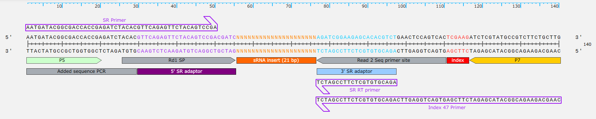

In
`/mnt/ceph-hdd/projects/scc_uanp_scholten/data/ngs_data/BGI_data/F24A910000280_LIBdyjmR_sRNA_maize`

``` bash

# Copy fastq files
/mnt/ceph-hdd/projects/scc_uanp_scholten/data/ngs_data/BGI_data/F24A910000280_LIBdyjmR_sRNA_maize

cat list_samples.txt
B73_TraPR
B73xMo17_TraPR
B73xb015_TraPR
B73xb172_TraPR
Mo17_TraPR
b015_TraPR
b131_TraPR
b131xB73_TraPR
b172_TraPR
b172xB73_TraPR
m047_TraPR
m047xMo17_TraPR

while read i; do
cp /mnt/ceph-hdd/projects/scc_uanp_scholten/data/ngs_data/BGI_data/F24A910000280_LIBdyjmR_sRNA_maize/${i}/${i}_L1_1.fq.gz raw_fastq
done < list_samples.txt

# Rename to remove useless suffix
cd raw_fastq
rename "_TraPR_L1_1" "" *gz
```

# Trimming

``` bash

# List raw fastq locations
find raw_fastq -name "*gz" > list_fastq.txt


#!/bin/bash
#
#SBATCH --job-name=trimming_cutadapt
#SBATCH --nodes=1
#SBATCH --ntasks=6
#SBATCH --mem=16000
#SBATCH --output=slurm/trimming.%A.%a.out
#SBATCH --error=slurm/trimming.%A.%a.err
#SBATCH --partition=medium
#SBATCH --time=01:00:00
#SBATCH --array=1-12

module load apptainer/1.3.4

app_shortcut="apptainer run --bind /mnt/ceph-hdd/workspaces/ws/scc_uanp_scholten/u14929-nor_nil_project/trapr_data /sw/container/bioinformatics/cutadapt-5.0.sif"

input_file=$(sed -n ${SLURM_ARRAY_TASK_ID}p list_fastq.txt)
name_fastq=$(basename "$input_file" | cut -d. -f1)

$app_shortcut cutadapt -j 0 -a agatcggaagagcacacgtct --discard-untrimmed $input_file | $app_shortcut cutadapt -j 0 -m 18 -o trimmed_fastq/${name_fastq}.trimmed.fq.gz -
```

# Mapping

``` bash

#!/bin/bash
#SBATCH --job-name=bowtie2
#SBATCH --output=slurm/job-%x-%j.out
#SBATCH --error=slurm/job-%x-%j.err
#SBATCH --cpus-per-task=8
#SBATCH --mem=12G
#SBATCH --time=00:40:00
#SBATCH --partition=medium
#SBATCH --mail-type=END
#SBATCH --mail-user=johan.zicola@uni-goettingen.de
#SBATCH --array=1-12

module load gcc/14.2.0 samtools/1.21 bowtie/1.3.1

\ls -1 *gz > list_files.txt

mkdir -p mapped/fasta/collapsed/formated

index="/mnt/ceph-hdd/projects/scc_uanp_scholten/data/databases/genomes/B73_NAM5/bowtie_index/index_Zm_B73_NAM5"

fastq_file=$(sed -n ${SLURM_ARRAY_TASK_ID}p list_files.txt)

if [ ! -e "mapped/${fastq_file%%.*}.bam" ]; then
  bowtie -S -l 37 -n 1 -x $index --threads 8 -q $fastq_file | \
    samtools sort | samtools view -F 4 -b -o mapped/${fastq_file%%.*}.bam -
    
  # Convert to fasta
  samtools fasta -F 4 mapped/${fastq_file%%.*}.bam > mapped/fasta/${fastq_file%%.*}.fa
else
  echo "mapped/${fastq_file%%.*}.bam already exists"
fi
```

# Format data

``` bash

cd /mnt/ceph-hdd/workspaces/ws/scc_uanp_scholten/u14929-nor_nil_project/trapr_data/trimmed_fastq/mapped/fasta

# Collapse fasta files
for i in *fa; do
  srun -p medium --time=00:20:00 ~/bin/fastx_toolkit/fastx_collapser -i $i -o collapsed/${i%%.*}.fa &
done

cd collapsed

seqkit stats *fa

file          format  type   num_seqs     sum_len  min_len  avg_len  max_len
B73.fa        FASTA   DNA      28,301     657,111       18     23.2       47
B73xMo17.fa   FASTA   DNA      22,162     509,254       18       23       47
B73xb015.fa   FASTA   DNA   1,493,290  33,544,543       18     22.5       47
B73xb172.fa   FASTA   DNA   1,208,419  27,363,978       18     22.6       47
Mo17.fa       FASTA   DNA   1,631,880  37,122,865       18     22.7       47
b015.fa       FASTA   DNA   1,381,893  31,097,480       18     22.5       47
b131.fa       FASTA   DNA   1,654,529  37,915,325       18     22.9       47
b131xB73.fa   FASTA   DNA   1,257,683  28,706,526       18     22.8       47
b172.fa       FASTA   DNA   1,948,001  44,395,291       18     22.8       47
b172xB73.fa   FASTA   DNA   1,127,045  25,556,880       18     22.7       47
m047.fa       FASTA   DNA   1,384,406  31,220,097       18     22.6       47
m047xMo17.fa  FASTA   DNA   1,610,528  36,199,676       18     22.5       47


# Format and sort data by sequence name
for i in *.fa; do
  prefix=$(basename ${i%%.*})
  awk -v RS='\n>' -v ORS='\n>' -v OFS='' -F'\n' '{$1=$1 "\t"}1' $i | \
          awk 'BEGIN {FS = "-"}{print $2}' | awk '{print $2"\t"$1}' | \
          sed '$ d' | sort -k1,1  > formated/${prefix}.txt
done
```

Very low read number in two libraries (B73 and B73xMo17).

# Merge data

``` bash
# Convert underscore in hyphens so the suffix stay in the header
rename "_" "-" *txt

# specific the absolute path (. for current directory creates a bug). 
# Don't forget the final slash

# Load java
module load openjdk/17.0.11_9

directory="/mnt/ceph-hdd/workspaces/ws/scc_uanp_scholten/u14929-nor_nil_project/trapr_data/trimmed_fastq/mapped/fasta/collapsed/formated/"

java -jar /mnt/ceph-hdd/workspaces/ws/scc_uanp_scholten/u14929-nor_nil_project/sRNA_data/scripts/GenerateDatasetJoinShellScript/dist/GenerateDatasetJoinShellScript.jar \
    -fileEnding txt -directory $directory

# Remove txt suffix that are added in header of the file
sed -i 's/\.txt//g' header.csv

srun -p medium --time=01:00:00 bash merge_datasets.sh &

# I need to remove the name of the first column (sequence)
sed -i 's/sequence//' header.csv


wc -l merged_dataset.csv
9926211 merged_dataset.csv
# 10M sequences

# Add header
cat header.csv merged_dataset.csv > cts_with_header.txt

unix2dos cts_with_header.txt

cut -d' ' -f1 merged_dataset.csv > sequences_trapr.txt
```

# PCA expression

``` r
# Import the cts matrix (not gene name is now the row name => required)
cts <- read.table("data/trapr/cts_with_header.txt", header=TRUE, row.names=1, check.names = FALSE)

# Create a more compact R object
saveRDS(cts,"data/trapr/cts.Rds")

cts <- readRDS("data/trapr/cts.Rds")

# Upload the coldata file
coldata <- data.frame(
  sample = c("B73", "B73xMo17", "B73xb015", "B73xb172", "Mo17", "b015", "b131", "b131xB73", "b172", "b172xB73", "m047", "m047xMo17"),
  NOR = c("homozygous", "heterozygous", "heterozygous", "heterozygous", "homozygous", "homozygous", "homozygous", "heterozygous", "homozygous", "heterozygous", "homozygous", "heterozygous")
, stringsAsFactors = FALSE)


# Convert the variables into factors
coldata[,names(coldata)] <- lapply(coldata[,names(coldata)] , factor)

saveRDS(coldata,"data/trapr/coldata.Rds")


### Check that sample names match in both files
all(colnames(cts) == coldata$sample)
```

``` r
# Create a DESeqDataSet object
dds <- DESeqDataSetFromMatrix(countData = cts,
                              colData = coldata,
                              design= ~sample)

# Variance stabilizing transformation
vsd <- vst(dds, blind=TRUE)

# Create PCA
pcaData <- plotPCA(vsd, intgroup=c("sample", "NOR"), returnData=TRUE)

# Get percentage variation
percentVar <- round(100 * attr(pcaData, "percentVar"))


p <- ggplot(pcaData, aes(PC1, PC2, color=NOR, label=sample)) +  
  xlab(paste0("PC1: ",percentVar[1],"% variance")) + 
  ylab(paste0("PC2: ",percentVar[2],"% variance")) +  
  theme_bw() +  
  ggtitle("PCA sRNA expression") + 
  theme(axis.text.x = element_text(color="black"),
        axis.text.y = element_text(color="black"),
        axis.ticks = element_line(color = "black")) + 
  theme(plot.title = element_text(hjust = 0.5))

p + geom_text(size = 3)
```

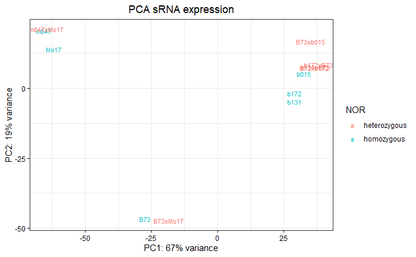 B73 and B73xMo17 cluster apart from the rest
most likely because of their low sequencing depth.

# Reads per million analysis

Normalize raw read count into reads per million to compare samples with
each other.

``` r
# Import the cts matrix (not gene name is now the row name => required)
cts <- readRDS("data/trapr/cts.Rds")

# Upload the coldata file
coldata <- readRDS("data/trapr/coldata.Rds")

# Convert the variables into factors
col_names <- names(coldata)
coldata[,col_names] <- lapply(coldata[,col_names] , factor)

### Check that sample names match in both files
all(colnames(cts) == coldata$sample)
```

``` r
m_cts <- as.matrix(cts)

# RPM normalize by dividing each value by the sum of the column and multiply by 1e6
rpm <- sweep(m_cts, 2, colSums(m_cts),`/`)
rpm <- rpm * 1e6

# Check, every column should sum to 1e6
colSums(rpm)
# 1e6

# Turn into dataframe
df_RPM <- as.data.frame(rpm)

# Put seq as variable and add size variable
df_RPM <- df_RPM %>% rownames_to_column(var="sequence")
df_RPM$size <- nchar(df_RPM$sequence)

# Set size and sequence as factor
df_RPM$size <- as.factor(df_RPM$size)
df_RPM$sequence <- as.factor(df_RPM$sequence)

df_RPM <- df_RPM %>% relocate(size, .after=sequence)

saveRDS(df_RPM, "data/trapr/df_RPM.Rds")

# Turn into a long list

df_RPM <- readRDS("data/trapr/df_RPM.Rds")

# Move to long list
df_RPM_long <- df_RPM %>% gather(sample, RPM, B73:m047xMo17)

# sample as factor
df_RPM_long$sample <- as.factor(df_RPM_long$sample)

# Save object
saveRDS(df_RPM_long, "data/trapr/df_RPM_long.Rds")
```

### sRNA expression overview

``` r
df_RPM_long <- readRDS("data/srnaseq/df_RPM_long.Rds")

long_df_rpm_size <- df_RPM_long %>% group_by(size, sample) %>% 
  summarize(RPM=sum(RPM), nb_sequence=n(), .groups='drop') %>% 
  arrange(RPM)

long_df_rpm_size_mean <- long_df_rpm_size %>% group_by(size, sample) %>% 
  summarize(RPM_mean=sum(RPM)/n(), ngroup=n(), sd=sd(RPM), .groups='drop')


long_df_rpm_size_mean$sample <- factor(long_df_rpm_size_mean$sample, levels = c("B73", "Mo17", "B73xMo17", "b015", "B73xb015", "b131", "b131xB73", "b172", "b172xB73", "B73xb172", "m047", "m047xMo17"), ordered = T)

ggplot(long_df_rpm_size_mean, aes(x = size, y = RPM_mean, fill = sample)) +
  geom_bar(stat = "identity", position=position_dodge()) +
  geom_errorbar(aes(ymin = RPM_mean - sd, ymax = RPM_mean + sd),
    width = .5,
    position = position_dodge(.9)
  ) +
  theme_bw() +
  ylab("RPM") +
  xlab("Size in nt") +
  ggtitle("sRNA expression profile") +
  theme(axis.text.x = element_text(color = "black"), 
        axis.text.y = element_text(color = "black"), 
        axis.ticks = element_line(color = "black")) + 
  theme(plot.title = element_text(hjust = 0.5)) + 
  scale_y_continuous(labels = scales::comma_format())
```

Show only B73, Mo17, and F1:

``` r
long_df_rpm_size_mean %>% filter(sample %in% c("B73","Mo17","B73xMo17")) %>%
ggplot(aes(x = size, y = RPM_mean, fill = sample)) +
  geom_bar(stat = "identity", position=position_dodge()) +
  geom_errorbar(aes(ymin = RPM_mean - sd, ymax = RPM_mean + sd),
    width = .5,
    position = position_dodge(.9)
  ) +
  theme_bw() +
  ylab("RPM") +
  xlab("Size in nt") +
  ggtitle("sRNA expression profile") +
  theme(axis.text.x = element_text(color = "black"), 
        axis.text.y = element_text(color = "black"), 
        axis.ticks = element_line(color = "black")) + 
  theme(plot.title = element_text(hjust = 0.5)) + 
  scale_y_continuous(labels = scales::comma_format())
```

### Sequence diversity

``` r
df_RPM_long <- readRDS("data/srnaseq/df_RPM_long.Rds")

df_RPM_long_sum <- df_RPM_long %>% filter(RPM>0) %>% group_by(size, sample) %>% 
  summarize(n_sum=n_distinct(sequence), .groups='drop')


df_RPM_long_sum$sample <- factor(df_RPM_long_sum$sample, levels = c("B73", "Mo17", "B73xMo17", "b015", "B73xb015", "b131", "b131xB73", "b172", "b172xB73", "B73xb172", "m047", "m047xMo17"), ordered = T)

df_RPM_long_sum %>% 
  ggplot(aes(x = size, y = n_sum, fill = sample)) +
  geom_bar(stat = "identity", position=position_dodge()) +
  theme_bw() +
  ggtitle("sRNA sequence diversity") +
  ylab("Number of sRNAs") +
  xlab("Size in nt") +
  theme(axis.text.x = element_text(color = "black"), 
        axis.text.y = element_text(color = "black"), 
        axis.ticks = element_line(color = "black")) + 
  theme(plot.title = element_text(hjust = 0.5)) + 
  scale_y_continuous(labels = scales::comma_format())
```

## UNITAS analysis all sRNAs

Run UNITAS on all 4M sRNAs found across libraries

### Install software

Install UNITAS v1.9.1 from GitHub (<https://github.com/d-gebert/unitas>)

``` bash
chmod +x unitas_1.9.1.pl

cpan install Archive::Extract Getopt::Long File::Path LWP::Simple

# LWP::Protocol::https already installed 
perldoc -l LWP::Protocol::https

# Get maize database
perl unitas_1.9.1.pl -refdump -species Zea_mays
```

### Get TE annotation

Get the TE annotation from B73 NAM5:

``` bash

# Integrate TE annotation in UNITAS output

# Download B73 NAM5 TE annotation
wget https://raw.githubusercontent.com/oushujun/MTEC/master/maizeTE02052020
# Note: This version was now put in the "history" folder. A new version is available (maizeTE04092026)
# with 40 new TEs annotated

# I just need to add the prefix "TE|" so that Unitas 
# classifies the mapped sRNAs in the TE category
seqkit replace -p ^ -r "TE|" maizeTE02052020.fa > maizeTE02052020_renamed.fa
```

### Run Unitas

``` r
sequences_trapr <- read.table("data/trapr/sequences_trapr.txt", quote="\"", comment.char="")

make_fasta(sequences_trapr$V1, "data/trapr/sequences_trapr.fa")
```

``` bash
# Rename headers of input fasta file with a running number to avoid issue with UNITAS
# seqkit replace -p .+ -r "seq_{nr}" all_sRNAs_18_40nt.fa > all_sRNAs_18_40nt.renamed.fa

# Run Unitas
perl unitas_1.9.1.pl -input sequences_trapr.fa \
    -refseq maizeTE02052020_renamed.fa -species Zea_mays
    
```

### R plotting

#### Integrate output UNITAS into a R dataframe

``` r
df_RPM_long <- readRDS("data/trapr/df_RPM_long.Rds")

# Fasta output of UNITAS
df_rRFs <- fasta_to_df("data/trapr/unitas/fasta/unitas.rRNA.fas")
df_PC_genes <- fasta_to_df("data/trapr/unitas/fasta/unitas.protein_coding.fas")
df_TEs_unitas <- fasta_to_df("data/trapr/unitas/fasta/unitas.TE.fas")
df_tRFs_unitas <- fasta_to_df("data/trapr/unitas/fasta/unitas.tRNA.fas")

df_RPM_long_unitas <- df_RPM_long %>%
  mutate(category = ifelse((sequence %in% df_tRFs_unitas$sequence),
    "tRNA", ifelse((sequence %in% df_rRFs$sequence), "rRNA",
      ifelse((sequence %in% df_PC_genes$sequence), "PC_genes",
        ifelse((sequence %in% df_TEs_unitas$sequence), "TEs", "others")
      )
    )
  ))

df_RPM_long_unitas$category <- as.factor(df_RPM_long_unitas$category)

saveRDS(df_RPM_long_unitas, "data/trapr/df_RPM_long_unitas.Rds")
```

#### Sequence diversity per category

``` r
df_RPM_long_unitas <- readRDS("data/trapr/df_RPM_long_unitas.Rds")

df_RPM_long_unitas_sum <- df_RPM_long_unitas %>% filter(RPM>0) %>% group_by(category, sample) %>% summarize(n_sum=n_distinct(sequence), .groups='drop')

col <-c("#7b3294","#c2a5cf","#a6dba0","#008837","gray")

# Order categories
df_RPM_long_unitas_sum$category <- 
  factor(df_RPM_long_unitas_sum$category, levels = c("rRNA", "tRNA", "PC_genes", "TEs", "others"))

df_RPM_long_unitas_sum$sample <- factor(df_RPM_long_unitas_sum$sample, levels = c("B73", "Mo17", "B73xMo17", "b015", "B73xb015", "b131", "b131xB73", "b172", "b172xB73", "B73xb172", "m047", "m047xMo17"), ordered = T)


ggplot(df_RPM_long_unitas_sum, 
             aes(x=sample, y=n_sum, fill=category)) + 
  geom_bar(stat="identity", position="dodge") + 
  theme_bw() + 
  scale_fill_manual(values=col) +
  ylab("Number of sRNAs") + 
  xlab("") + 
  ggtitle("sRNA sequence diversity") + 
  theme(plot.title = element_text(hjust = 0.5))  + 
  theme(axis.text.x = element_text(color="black"),
        axis.text.y = element_text(color="black"),
        axis.ticks = element_line(color = "black")) + 
  scale_y_continuous(labels = scales::comma_format())
```

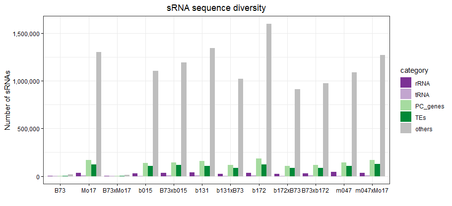

``` r
col <-c("#7b3294","#c2a5cf","#a6dba0","#008837","gray")

ggplot(df_RPM_long_unitas_sum, aes(x = sample, y=n_sum, fill=category)) + 
  geom_bar(stat = "identity") +
  theme_bw() + 
  scale_fill_manual(values=col) +
  ylab("Number of sRNAs") + 
  xlab("") + 
  ggtitle("sRNA sequence diversity") + 
  theme(plot.title = element_text(hjust = 0.5))  + 
  theme(axis.text.x = element_text(color="black"),
        axis.text.y = element_text(color="black"),
        axis.ticks = element_line(color = "black")) + 
  scale_y_continuous(labels = scales::comma_format()) 
```

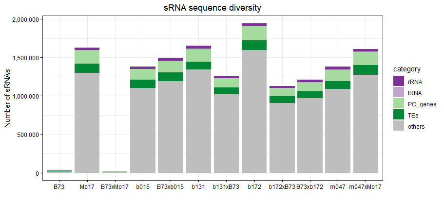

#### Expression per category

``` r
df_RPM_long_unitas_sum <- df_RPM_long_unitas %>% group_by(category, sample) %>% summarize(RPM_sum=sum(RPM), .groups='drop')

df_RPM_long_unitas_mean  <- df_RPM_long_unitas_sum %>% group_by(category, sample) %>% 
  summarize(RPM_mean=sum(RPM_sum)/n(), nb_sequence=n(), sd=sd(RPM_sum), .groups='drop')

# Order categories

col <-c("#7b3294","#c2a5cf","#a6dba0","#008837","gray")

# Order categories
df_RPM_long_unitas_mean$category <-
  factor(df_RPM_long_unitas_mean$category, levels = c("rRNA", "tRNA", "PC_genes", "TEs", "others"))

df_RPM_long_unitas_mean$sample <- factor(df_RPM_long_unitas_mean$sample, levels = c("B73", "Mo17", "B73xMo17", "b015", "B73xb015", "b131", "b131xB73", "b172", "b172xB73", "B73xb172", "m047", "m047xMo17"), ordered = T)

ggplot(df_RPM_long_unitas_mean, aes(x = sample, y = RPM_mean, fill = category)) +
  geom_bar(stat = "identity", position = position_dodge()) +
  geom_errorbar(aes(ymin = RPM_mean - sd, ymax = RPM_mean + sd),
    width = .5,
    position = position_dodge(.9)
  ) +
  theme_bw() +
  scale_fill_manual(values = col) +
  ylab("RPM") +
  xlab("") +
  ggtitle("sRNA abundance per category") +
  theme(
    axis.text.x = element_text(color = "black"),
    axis.text.y = element_text(color = "black"),
    axis.ticks = element_line(color = "black")
  ) +
  theme(plot.title = element_text(hjust = 0.5)) +
  scale_y_continuous(labels = scales::comma_format())
```

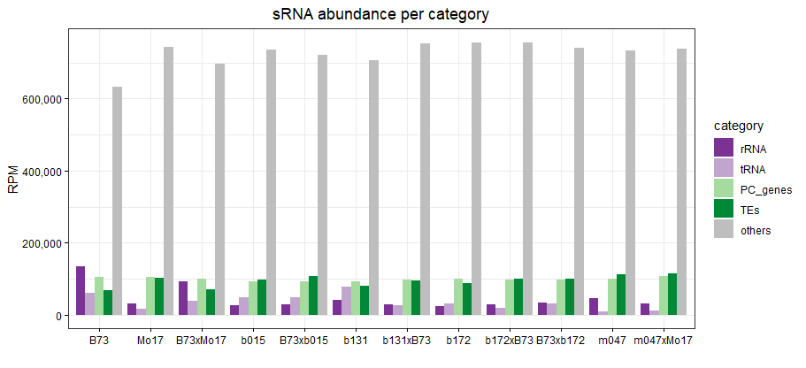

1.  # 

# sRNA-seq analysis

# 

## Data

sRNA-seq libraries were made with the NEBNext small RNA kit (cat.
No. E7300, NEB).


Samples were sequenced in three lanes, first replicate in one lane, and
second and third in two other lanes.

``` bash

# First lane (rep 2) SE50 BGISEQ-500
/mnt/ceph-hdd/projects/scc_uanp_scholten/data/ngs_data/BGI_data/F22FTSEUHT1495_LIBfbksR_mRNA_sRNA_degradome_johan_doga/F22FTSEUHT1495_LIBfbksR_SE50_3lane/data_sRNA_NOR_NILs/raw_fastq/

# Second lane (rep 1 and 3) PE50 DNBSEQ-G400
/mnt/ceph-hdd/projects/scc_uanp_scholten/data/ngs_data/BGI_data/F24A910000280_LIBzmbnR_sRNA_maize_arabidopsis/raw_reads

# third lane (rep 1 and 3) - SE50 DNBSEQ-G400
/mnt/ceph-hdd/projects/scc_uanp_scholten/data/ngs_data/BGI_data/F24A910000280_LIBdyjmR_sRNA_maize/
```

Gather all fastq file in one place

``` bash

# Create a workspace to store data
cd /mnt/ceph-hdd/workspaces/ws/scc_uanp_scholten/u14929-nor_nil_project/sRNA_data

while read i; do 
find /mnt/ceph-hdd/projects/scc_uanp_scholten/data/ngs_data/BGI_data/ -type f -name $i -exec cp {} . \;
done < file_to_find

# Rename file for consistent names
while read i; do
mv $i
done < rename.txt

\ls -1 *gz
B73_rep1.fq.gz
B73_rep2.fq.gz
B73_rep3.fq.gz
B73xMo17_rep1.fq.gz
B73xMo17_rep2.fq.gz
B73xMo17_rep3.fq.gz
B73xb015_rep1.fq.gz
B73xb015_rep2.fq.gz
B73xb015_rep3.fq.gz
B73xb172_rep1.fq.gz
B73xb172_rep2.fq.gz
B73xb172_rep3.fq.gz
Mo17_rep1.fq.gz
Mo17_rep2.fq.gz
Mo17_rep3.fq.gz
b015_rep1.fq.gz
b015_rep2.fq.gz
b015_rep3.fq.gz
b131_rep1.fq.gz
b131_rep2.fq.gz
b131_rep3.fq.gz
b131xB73_rep1.fq.gz
b131xB73_rep2.fq.gz
b131xB73_rep3.fq.gz
b172_rep1.fq.gz
b172_rep2.fq.gz
b172_rep3.fq.gz
b172xB73_rep1.fq.gz
b172xB73_rep2.fq.gz
b172xB73_rep3.fq.gz
m047_rep1.fq.gz
m047_rep2.fq.gz
m047_rep3.fq.gz
m047xMo17_rep1.fq.gz
m047xMo17_rep2.fq.gz
m047xMo17_rep3.fq.gz
```

## Trimming

``` bash

#!/bin/bash
#
#SBATCH --job-name=trimming_cutadapt
#SBATCH --nodes=1
#SBATCH --cpus-per-task=8
#SBATCH --mem=16000
#SBATCH --output=log/slurm.%j.%A.%a.out
#SBATCH --error=log/slurm.%j.%A.%a.err
#SBATCH --partition=scc-cpu
#SBATCH --time=04:00:00
#SBATCH --mail-type=END
#SBATCH --mail-user=johan.zicola@uni-goettingen.de
#SBATCH --array=1-36

module load apptainer/1.3.4

app_shortcut="apptainer run --bind /mnt/ceph-hdd/workspaces/ws/scc_uanp_scholten/u14929-nor_nil_project/sRNA_data /sw/container/bioinformatics/cutadapt-5.0.sif"

adapter_sequence="AGATCGGAAGAGCACACGTCT"

input_path=$(find raw_fastq -type f -name "*.gz" | sed -n ${SLURM_ARRAY_TASK_ID}p)
input_file=$(basename $input_path)
name_fastq=$(echo "$input_file" | cut -d. -f1)

echo "Processing file $input_path"

if [ -e "trimmed_fastq/${name_fastq}.trimmed.fq.gz" ]; then
  echo "trimmed_fastq/${name_fastq}.trimmed.fq.gz already exists, skip $input_path"
else
  $app_shortcut cutadapt --discard-untrimmed --quality-base 33 -a $adapter_sequence -j 8 $input_path | $app_shortcut cutadapt -j 8 --max-n 0 -m 17 - -o trimmed_fastq/${name_fastq}.trimmed.fq.gz
fi
```

Summary trimmed reads

``` bash

for i in log/*out; do
  fastq=$(grep "Processing" $i | cut -d' ' -f3)
  total_reads=$(grep "Total reads processed:" $i | cut -d":" -f2)
  nb_reads_trimmed=$(grep "Reads written (passing filters)" $i | cut -d":" -f2 | cut -d"(" -f1)
  sample=$(basename $fastq)
  echo -e "$sample\t$total_reads$t$nb_reads_trimmed"
done > trimmed_reads/summary_trimming.txt
```

## Fastqc

``` bash

#!/bin/bash
#
#SBATCH --job-name=fastqc
#SBATCH --nodes=1
#SBATCH --cpus-per-task=8
#SBATCH --mem=10000
#SBATCH --output=log/fastqc.%A.%a.out
#SBATCH --error=log/fastqc.%A.%a.err
#SBATCH --partition=scc-cpu
#SBATCH --time=04:00:00
#SBATCH --mail-type=END
#SBATCH --mail-user=johan.zicola@uni-goettingen.de
#SBATCH --array=1-36

module load miniforge3

source activate bioinfo

input_path=$(find . -type f -name "*.fq.gz" | sed -n ${SLURM_ARRAY_TASK_ID}p)

fastqc $input_path -o fastqc_reports -t 8
```

``` bash

source activate bioinfo

multiqc .
```

## Allele-specific expression A/T 35S

### Mapping

Map to same 35S transcriptional unit than for the RNA-seq data

``` bash
# Get B73 NAM5 genome (chromosome and contigs)
wget https://download.maizegdb.org/Zm-B73-REFERENCE-NAM-5.0/Zm-B73-REFERENCE-NAM-5.0.fa.gz
gunzip Zm-B73-REFERENCE-NAM-5.0.fa.gz

echo -e "chr6\t16802261\t16808035\t35SS\t.\t-" > seq_35S_B73_T_allele.bed

bedtools getfasta -s -fi /mnt/ceph-hdd/projects/scc_uanp_scholten/data/databases/genomes/B73_NAM5/Zm-B73-REFERENCE-NAM-5.0.fa -bed seq_35S_B73_T_allele.bed > seq_35S_B73_T_allele.fa

# Rename sequence rDNA_35S_allele_T
sed -i '1 s/.*/>rDNA_35S_allele_T/' seq_35S_B73_T_allele.fa

bowtie-build -f seq_35S_B73_T_allele.fa seq_35S_B73_T_allele

find /mnt/ceph-hdd/workspaces/ws/scc_uanp_scholten/u14929-nor_nil_project/srnaseq/trimmed_fastq/ -name "*gz" > list_fastq.txt
```

``` bash

#!/bin/bash
#
#SBATCH --job-name=bowtie_mapping
#SBATCH --nodes=1
#SBATCH --cpus-per-task=10
#SBATCH --mem=16000
#SBATCH --output=log/slurm.%j.%A.%a.out
#SBATCH --error=log/slurm.%j.%A.%a.err
#SBATCH --partition=scc-cpu
#SBATCH --time=04:00:00
#SBATCH --mail-type=END
#SBATCH --mail-user=johan.zicola@uni-goettingen.de
#SBATCH --array=1-36

module load gcc bowtie samtools

input_file=$(sed -n ${SLURM_ARRAY_TASK_ID}p list_fastq.txt)
name=$(echo "$input_file" | xargs basename | cut -d. -f1)


index="/mnt/ceph-hdd/workspaces/ws/scc_uanp_scholten/u14929-nor_nil_project/rnaseq/mapping_35S_T_allele/seq_35S_B73_T_allele"

bowtie -p 8 -S -x $index \
-q $input_file | \
samtools view -F 4 -b |  samtools sort -o mapped_reads/${name}.bam - 

samtools index mapped_reads/${name}.bam
```

``` bash
cd mapped_reads

for i in *bam; do 
  nb_reads=$(samtools flagstats $i | grep "in total" | cut -d' ' -f1)
  echo -e "$i\t$nb_reads"
done | sort -k2n

B73xMo17_rep3.bam       1396338
b131_rep1.bam   1526189
B73xb015_rep1.bam       1546247
B73xb172_rep1.bam       1610808
B73xb015_rep3.bam       1831809
B73_rep1.bam    1973273
b172xB73_rep3.bam       2003678
Mo17_rep1.bam   2089331
b172xB73_rep1.bam       2306460
b015_rep1.bam   2362707
b131xB73_rep3.bam       2620464
B73xb172_rep3.bam       2691653
B73xMo17_rep1.bam       2951828
B73xMo17_rep2.bam       2964786
m047xMo17_rep1.bam      3165074
b172_rep1.bam   3333895
m047_rep1.bam   3428840
m047xMo17_rep3.bam      3606923
b172_rep2.bam   3677739
B73_rep3.bam    3705771
m047_rep3.bam   3858071
Mo17_rep2.bam   3868315
Mo17_rep3.bam   4235795
b131xB73_rep1.bam       4581009
b131_rep3.bam   4584555
b172_rep3.bam   4645088
m047xMo17_rep2.bam      4862954
b015_rep3.bam   5268429
B73xb172_rep2.bam       5502889
b131xB73_rep2.bam       6497839
B73xb015_rep2.bam       7334206
b131_rep2.bam   9957111
b015_rep2.bam   11136831
B73_rep2.bam    11574283
b172xB73_rep2.bam       13558614
m047_rep2.bam   18713199
```

### A/T calling

``` bash

#!/bin/bash
#
#SBATCH --job-name=bowtie_mapping
#SBATCH --nodes=1
#SBATCH --cpus-per-task=1
#SBATCH --mem=10G
#SBATCH --output=log/slurm.%j.%A.%a.out
#SBATCH --error=log/slurm.%j.%A.%a.err
#SBATCH --partition=scc-cpu
#SBATCH --time=01:00:00
#SBATCH --mail-type=END
#SBATCH --mail-user=johan.zicola@uni-goettingen.de

module load bcftools

for i in mapped_reads/*bam; do
  call=$(bcftools mpileup \
      -d 100000 \
      -f seq_35S_B73_T_allele.fa \
      -r rDNA_35S_allele_T:4223-4223 \
      -a FORMAT/DP,FORMAT/AD \
      $i \
      -Ou |
  bcftools query -f '%CHROM\t%POS\t%REF\t%ALT[\t%DP\t%AD]\n')
  name=$(basename "$i" | cut -d. -f1)
  echo -e "$name\t$call" >> call_pos_4223.txt
done
```

``` bash
B73_rep1        rDNA_35S_allele_T       4223    T       A,C,G   4116    3786,288,40,2
B73_rep2        rDNA_35S_allele_T       4223    T       A,C,G   36993   36229,479,247,38
B73_rep3        rDNA_35S_allele_T       4223    T       A,C,G   8462    8172,202,65,23
B73xMo17_rep1   rDNA_35S_allele_T       4223    T       A,C,G   5960    3807,2102,46,5
B73xMo17_rep2   rDNA_35S_allele_T       4223    T       A,C,G   6860    4520,2294,36,10
B73xMo17_rep3   rDNA_35S_allele_T       4223    T       A,C,G   2744    1720,1010,10,4
B73xb015_rep1   rDNA_35S_allele_T       4223    T       A,C,G   3713    2300,1372,28,13
B73xb015_rep2   rDNA_35S_allele_T       4223    T       A,C,G   17916   10866,6943,85,22
B73xb015_rep3   rDNA_35S_allele_T       4223    T       A,C,G   4875    3255,1568,43,9
B73xb172_rep1   rDNA_35S_allele_T       4223    T       A,C,G   2903    1712,1174,11,6
B73xb172_rep2   rDNA_35S_allele_T       4223    T       A,C,G   13324   7802,5443,66,13
B73xb172_rep3   rDNA_35S_allele_T       4223    T       A,C,G   6175    3587,2536,41,11
Mo17_rep1       rDNA_35S_allele_T       4223    T       A,G,C   2792    171,2608,8,5
Mo17_rep2       rDNA_35S_allele_T       4223    T       A,G,C   8088    167,7903,14,4
Mo17_rep3       rDNA_35S_allele_T       4223    T       A,G,C   8716    208,8479,21,8
b015_rep1       rDNA_35S_allele_T       4223    T       A,G,C   5261    31,5199,28,3
b015_rep2       rDNA_35S_allele_T       4223    T       A,G,C   18877   163,18669,36,9
b015_rep3       rDNA_35S_allele_T       4223    T       A,G,C   13229   54,13112,56,7
b131_rep1       rDNA_35S_allele_T       4223    T       A,G,C   2697    101,2586,8,2
b131_rep2       rDNA_35S_allele_T       4223    T       A,G,C   17238   261,16913,52,12
b131_rep3       rDNA_35S_allele_T       4223    T       A,G,C   8513    185,8297,24,7
b131xB73_rep1   rDNA_35S_allele_T       4223    T       A,G,C   7406    134,7244,23,5
b131xB73_rep2   rDNA_35S_allele_T       4223    T       A,C,G   12596   7666,4845,64,21
b131xB73_rep3   rDNA_35S_allele_T       4223    T       A,C,G   5330    2856,2427,37,10
b172_rep1       rDNA_35S_allele_T       4223    T       A,G,C   5744    353,5368,16,7
b172_rep2       rDNA_35S_allele_T       4223    T       A,G,C   6328    230,6075,17,6
b172_rep3       rDNA_35S_allele_T       4223    T       A,G,C   6987    199,6761,19,8
b172xB73_rep1   rDNA_35S_allele_T       4223    T       A,C,G   5287    3214,2021,34,18
b172xB73_rep2   rDNA_35S_allele_T       4223    T       A,C,G   29143   18815,10152,146,30
b172xB73_rep3   rDNA_35S_allele_T       4223    T       A,C,G   4615    3027,1539,41,8
m047_rep1       rDNA_35S_allele_T       4223    T       C,A,G   10154   9973,88,82,11
m047_rep2       rDNA_35S_allele_T       4223    T       A,C,G   43372   42604,505,250,13
m047_rep3       rDNA_35S_allele_T       4223    T       C,A,G   10929   10702,120,91,16
m047xMo17_rep1  rDNA_35S_allele_T       4223    T       A,C,G   7929    4883,2963,53,30
m047xMo17_rep2  rDNA_35S_allele_T       4223    T       A,C,G   11244   6885,4294,51,14
m047xMo17_rep3  rDNA_35S_allele_T       4223    T       A,C,G   9632    5968,3589,57,18
```

| sample         | DP    | T     | A     | %T    | %A    |
|----------------|-------|-------|-------|-------|-------|
| B73_rep1       | 4116  | 3786  | 288   | 92.9% | 7.1%  |
| B73_rep2       | 36993 | 36229 | 479   | 98.7% | 1.3%  |
| B73_rep3       | 8462  | 8172  | 202   | 97.6% | 2.4%  |
| B73xMo17_rep1  | 5960  | 3807  | 2102  | 64.4% | 35.6% |
| B73xMo17_rep2  | 6860  | 4520  | 2294  | 66.3% | 33.7% |
| B73xMo17_rep3  | 2744  | 1720  | 1010  | 63.0% | 37.0% |
| B73xb015_rep1  | 3713  | 2300  | 1372  | 62.6% | 37.4% |
| B73xb015_rep2  | 17916 | 10866 | 6943  | 61.0% | 39.0% |
| B73xb015_rep3  | 4875  | 3255  | 1568  | 67.5% | 32.5% |
| B73xb172_rep1  | 2903  | 1712  | 1174  | 59.3% | 40.7% |
| B73xb172_rep2  | 13324 | 7802  | 5443  | 58.9% | 41.1% |
| Mo17_rep1      | 2792  | 171   | 2608  | 6.2%  | 93.8% |
| Mo17_rep2      | 8088  | 167   | 7903  | 2.1%  | 97.9% |
| Mo17_rep3      | 8716  | 208   | 8479  | 2.4%  | 97.6% |
| b015_rep1      | 5261  | 31    | 5199  | 0.6%  | 99.4% |
| b015_rep2      | 18877 | 163   | 18669 | 0.9%  | 99.1% |
| b015_rep3      | 13229 | 54    | 13112 | 0.4%  | 99.6% |
| b131_rep1      | 2697  | 101   | 2586  | 3.8%  | 96.2% |
| b131_rep2      | 17238 | 261   | 16913 | 1.5%  | 98.5% |
| b131_rep3      | 8513  | 185   | 8297  | 2.2%  | 97.8% |
| b131xB73_rep1  | 7406  | 134   | 7244  | 1.8%  | 98.2% |
| b131xB73_rep2  | 12596 | 7666  | 4845  | 61.3% | 38.7% |
| b131xB73_rep3  | 5330  | 2856  | 2427  | 54.1% | 45.9% |
| b172_rep1      | 5744  | 353   | 5368  | 6.2%  | 93.8% |
| b172_rep2      | 6328  | 230   | 6075  | 3.6%  | 96.4% |
| b172_rep3      | 6987  | 199   | 6761  | 2.9%  | 97.1% |
| b172xB73_rep1  | 5287  | 3214  | 2021  | 61.4% | 38.6% |
| b172xB73_rep2  | 29143 | 18815 | 10152 | 65.0% | 35.0% |
| b172xB73_rep3  | 4615  | 3027  | 1539  | 66.3% | 33.7% |
| m047_rep1      | 10154 | 9973  | 88    | 99.1% | 0.9%  |
| m047_rep2      | 43372 | 42604 | 505   | 98.8% | 1.2%  |
| m047_rep3      | 10929 | 10702 | 120   | 98.9% | 1.1%  |
| m047xMo17_rep1 | 7929  | 4883  | 2963  | 62.2% | 37.8% |
| m047xMo17_rep2 | 11244 | 6885  | 4294  | 61.6% | 38.4% |
| m047xMo17_rep3 | 9632  | 5968  | 3589  | 62.4% | 37.6% |

On the contrary of the A/T SNP call with RNA-seq data, sRNA-seq data
show a non-additive expression pattern with a 60-40 T-A ratio, as if B73
copies are generating more sRNAs than Mo17 copies. b131xB73_rep1 shows a
98% A expression, suggesting that this sample is probably b131.

### Strand mapping bias

``` bash

# Exclude reverse mapped reads
for i in *bam; do 
  samtools view -c -F 16 $i  >> count_forward.txt
done

# Keep only reversed mapped reads
for i in *bam; do 
  samtools view -c -f 16 $i  >> count_reverse.txt
done
```

| sample | reads_mapped_35S | mapping_sense_35S | mapping_antisense_35S | percent_sense_35S |
|----|----|----|----|----|
| B73xMo17_rep1 | 2,951,828 | 2,949,123 | 2,705 | 99.91% |
| B73xMo17_rep2 | 2,964,786 | 2,963,326 | 1,460 | 99.95% |
| B73xMo17_rep3 | 1,396,338 | 1,394,695 | 1,643 | 99.88% |
| B73xb015_rep1 | 1,546,247 | 1,544,634 | 1,613 | 99.90% |
| B73xb015_rep2 | 7,334,206 | 7,331,254 | 2,952 | 99.96% |
| B73xb015_rep3 | 1,831,809 | 1,830,258 | 1,551 | 99.92% |
| B73xb172_rep1 | 1,610,808 | 1,608,602 | 2,206 | 99.86% |
| B73xb172_rep2 | 5,502,889 | 5,500,003 | 2,886 | 99.95% |
| B73xb172_rep3 | 2,691,653 | 2,688,833 | 2,820 | 99.90% |
| Mo17_rep1 | 2,089,331 | 2,087,916 | 1,415 | 99.93% |
| Mo17_rep2 | 3,868,315 | 3,866,105 | 2,210 | 99.94% |
| Mo17_rep3 | 4,235,795 | 4,233,856 | 1,939 | 99.95% |
| b015_rep1 | 2,362,707 | 2,362,074 | 633 | 99.97% |
| b015_rep2 | 11,136,831 | 11,134,821 | 2,010 | 99.98% |
| b015_rep3 | 5,268,429 | 5,266,369 | 2,060 | 99.96% |
| b131_rep1 | 1,526,189 | 1,525,398 | 791 | 99.95% |
| b131_rep2 | 9,957,111 | 9,953,595 | 3,516 | 99.96% |
| b131_rep3 | 4,584,555 | 4,582,820 | 1,735 | 99.96% |
| b131xB73_rep1 | 4,581,009 | 4,579,281 | 1,728 | 99.96% |
| b131xB73_rep2 | 6,497,839 | 6,494,409 | 3,430 | 99.95% |
| b131xB73_rep3 | 2,620,464 | 2,618,607 | 1,857 | 99.93% |
| b172_rep1 | 3,333,895 | 3,330,190 | 3,705 | 99.89% |
| b172_rep2 | 3,677,739 | 3,674,220 | 3,519 | 99.90% |
| b172_rep3 | 4,645,088 | 4,642,082 | 3,006 | 99.94% |
| b172xB73_rep1 | 2,306,460 | 2,303,695 | 2,765 | 99.88% |
| b172xB73_rep2 | 13,558,614 | 13,552,715 | 5,899 | 99.96% |
| b172xB73_rep3 | 2,003,678 | 2,001,400 | 2,278 | 99.89% |
| m047_rep1 | 3,428,840 | 3,424,324 | 4,516 | 99.87% |
| m047_rep2 | 18,713,199 | 18,708,970 | 4,229 | 99.98% |
| m047_rep3 | 3,858,071 | 3,855,749 | 2,322 | 99.94% |
| m047xMo17_rep1 | 3,165,074 | 3,161,699 | 3,375 | 99.89% |
| m047xMo17_rep2 | 4,862,954 | 4,861,001 | 1,953 | 99.96% |
| m047xMo17_rep3 | 3,606,923 | 3,604,536 | 2,387 | 99.93% |

\>99.8% of the reads map to the sense strand, suggesting sRNAs are
derived from rRNAs.

## Mapping to B73 genome

We mapped sRNAs to B73 NAM5 assembly (chromosomes and scaffolds). Fasta
file was obtained on
<https://download.maizegdb.org/Zm-B73-REFERENCE-NAM-5.0/Zm-B73-REFERENCE-NAM-5.0.fa.gz>

``` bash

# Get B73 NAM5 genome (chromosome and contigs)
wget https://download.maizegdb.org/Zm-B73-REFERENCE-NAM-5.0/Zm-B73-REFERENCE-NAM-5.0.fa.gz
gunzip Zm-B73-REFERENCE-NAM-5.0.fa.gz

# Index genome
module load gcc/14.2.0 bowtie/1.3.1 samtools/1.21
srun -p medium --cpus-per-task=4 --mem=16G --time=02:00:00 bowtie-build \
  -f Zm-B73-REFERENCE-NAM-5.0.fa bowtie_index/index_Zm_B73_NAM5 

# Map the reads with 1 mismatched allowed (B73-Mo17 polymorphism)
bowtie -S -l 37 -n 1 -x index_Zm_B73_NAM5 --threads 8 -f <collapsed.fa> | \
  samtools sort | samtools view -F 4 -b -o <mapped_reads.bam> -
```

``` bash

#!/bin/bash
#SBATCH --job-name=bowtie2
#SBATCH --output=slurm/job-%x-%j.out
#SBATCH --error=slurm/job-%x-%j.err
#SBATCH --cpus-per-task=8
#SBATCH --mem=12G
#SBATCH --time=00:40:00
#SBATCH --partition=medium
#SBATCH --mail-type=END
#SBATCH --mail-user=johan.zicola@uni-goettingen.de
#SBATCH --array=1-36

mkdir -p mapped/fasta/collapsed/formated

module load gcc/14.2.0 samtools/1.21 bowtie/1.3.1

index="/mnt/ceph-hdd/projects/scc_uanp_scholten/data/databases/genomes/B73_NAM5/bowtie_index/index_Zm_B73_NAM5"

fastq_file=$(sed -n ${SLURM_ARRAY_TASK_ID}p list_files.txt)

bowtie -S -l 37 -n 1 -x $index --threads 8 -q $fastq_file | \
  samtools sort | samtools view -F 4 -b -o mapped/${fastq_file%%.*}.bam -

# Convert to fasta
samtools fasta -F 4 mapped/${fastq_file%%.*}.bam > mapped/fasta/${fastq_file%%.*}.fa
```

## Format data

To perform the PCA of sRNAs expression of the different samples, we
considered every sRNA sequence has a gene and looked at the read count
across all samples. We gathered these raw read count into a matrix that
can then be processed into DESeq2 as a standard gene read count matrix.

Use collapsed reads by `fastx_collapser` which gives the sequence and
the number of times it occurs in a given sample with the number of
occurrences within the fasta header.

Example:

    >1-460089
    TGCAAATCTAACGAAGTGCTCCTGGACG
    >2-206928
    CGTTATTTTACTTATTCCGTGGGTCGGAAGCGGGGCA
    >3-195873
    TTAACACATGCAAATCTAACGAAGTGCTCCTGGACG

The first sequence `TGCAAATCTAACGAAGTGCTCCTGGACG` occurs 460,089 times.

Convert the fasta format so that the number of occurrences comes right
after the sequence:

    TGCAAATCTAACGAAGTGCTCCTGGACG 460089
    CGTTATTTTACTTATTCCGTGGGTCGGAAGCGGGGCA 206928
    TTAACACATGCAAATCTAACGAAGTGCTCCTGGACG 195873

``` bash

cd /mnt/ceph-hdd/workspaces/ws/scc_uanp_scholten/u14929-nor_nil_project/sRNA_data/trimmed_fastq/mapped/fasta

# Collapse fasta files
for i in *fa; do
  srun -p medium --time=00:20:00 ~/bin/fastx_toolkit/fastx_collapser -i $i -o collapsed/${i%%.*}.fa &
done


# Format and sort data by sequence name
for i in *.fa; do
  prefix=$(basename ${i%%.*})
  awk -v RS='\n>' -v ORS='\n>' -v OFS='' -F'\n' '{$1=$1 "\t"}1' $i | \
          awk 'BEGIN {FS = "-"}{print $2}' | awk '{print $2"\t"$1}' | \
          sed '$ d' | sort -k1,1  > formated/${prefix}.txt
done
```

## Merge data

Merge all raw read count into one large matrix with samples in columns
and sequence in rows. We used a java script that creates a bash command
using the unix function `join`. The bash script is then launched and the
output files are `merged_dataset.csv` and
`merged_dataset_with_header.csv`, the only difference being the added
header in the latter.

``` bash
# Convert underscore in hyphens so the suffix stay in the header
rename "_" "-" *txt

# specific the absolute path (. for current directory creates a bug). 
# Don't forget the final slash

# Load java
module load openjdk/17.0.11_9

directory="/mnt/ceph-hdd/workspaces/ws/scc_uanp_scholten/u14929-nor_nil_project/sRNA_data/trimmed_fastq/mapped/fasta/collapsed/formated/"

java -jar /mnt/ceph-hdd/workspaces/ws/scc_uanp_scholten/u14929-nor_nil_project/sRNA_data/scripts/GenerateDatasetJoinShellScript/dist/GenerateDatasetJoinShellScript.jar \
    -fileEnding txt -directory $directory

# Remove txt suffix that are added in header of the file
sed -i 's/\.txt//g' header.csv

srun -p medium --time=01:00:00 bash merge_datasets.sh &
```

``` bash

# I need to remove the name of the first column (sequence)
sed -i 's/sequence//' header.csv

# Put back underscores in header
sed -i 's/-/_/g' header.csv

# Add header
cat header.csv merged_dataset.csv > cts_with_header.txt

unix2dos cts_with_header.txt

cut -d' ' -f1 merged_dataset.csv > sequences_sRNAs.txt

wc -l sequences_sRNAs.txt
56668221 sequences_sRNAs.txt

# 56M sRNAs => That will be heavy in R ...

# Reduce by keeping only sequence between 17 and 40
srun -p medium --time=01:00:00 awk 'length($1) < 41 { print }' merged_dataset.csv > merged_dataset_17_40nt.csv

# Most sRNAs have a row sum of 1, indicating they are present in 
# only one sample with one read count. 
# These are not going to help with the analysis so I can discard them
srun -p medium --time=01:00:00 awk '{x=0;for(i=2;i<=NF;i++)x=x+$i} x>1 {print $0}' merged_dataset_17_40nt.csv > merged_dataset_17_40nt_countmin1.csv

wc -l merged_dataset_17_40nt_countmin1.csv
17140709 merged_dataset_17_40nt_countmin1.csv

# Still 17M sequences ...

# Remove sRNA with lower than 5 read counts
srun -p medium --time=01:00:00 awk '{x=0;for(i=2;i<=NF;i++)x=x+$i} x>4 {print $0}' merged_dataset_17_40nt_countmin1.csv > merged_dataset_17_40nt_countmin5.csv

wc -l merged_dataset_17_40nt_countmin5.csv
4534719 merged_dataset_17_40nt_countmin5.csv

# 4.5M, now it is manageable

cat header.csv merged_dataset_17_40nt_countmin5.csv > merged_dataset_17_40nt_countmin5_with_header.csv

unix2dos merged_dataset_17_40nt_countmin5_with_header.csv

cut -d' ' -f1 merged_dataset_17_40nt_countmin5.csv > sequences_sRNAs_17_40nt_countmin5.txt
```

Get data in R and generate R objects

``` r
all_sRNAs_18_40nt <- read.table("data/sequences_sRNAs_17_40nt_countmin5.txt", quote="\"", comment.char="")

make_fasta(vector_sequence = all_sRNAs_18_40nt$V1, path_output = "data/all_sRNAs_18_40nt.fa")
```

## PCA small RNA expression 17-40 nt

``` r
# Import the cts matrix (not gene name is now the row name => required)
cts <- read.table("data/srnaseq/merged_dataset_17_40nt_countmin5_with_header.csv", header=TRUE, row.names=1, check.names = FALSE)

# Create a more compact R object
saveRDS(cts,"data/srnaseq/cts.Rds")

cts <- readRDS("data/srnaseq/cts.Rds")

# Upload the coldata file
coldata <- read.table("data/srnaseq/coldata.txt", header=T)

# Convert the variables into factors
col_names <- names(coldata)
coldata[,col_names] <- lapply(coldata[,col_names] , factor)

### Check that sample names match in both files
all(colnames(cts) == coldata$sample)
```

``` r
# Create a DESeqDataSet object
dds <- DESeqDataSetFromMatrix(countData = cts,
                              colData = coldata,
                              design= ~genotype)

# Variance stabilizing transformation
vsd <- vst(dds, blind=TRUE)

# Create PCA
pcaData <- plotPCA(vsd, intgroup=c("sample", "genotype"), returnData=TRUE)

# Get percentage variation
percentVar <- round(100 * attr(pcaData, "percentVar"))


p <- ggplot(pcaData, aes(PC1, PC2, label=genotype, color=genotype)) +  
  xlab(paste0("PC1: ",percentVar[1],"% variance")) + 
  ylab(paste0("PC2: ",percentVar[2],"% variance")) +  
  theme_bw() +  
  ggtitle("PCA sRNA expression") + 
  theme(axis.text.x = element_text(color="black"),
        axis.text.y = element_text(color="black"),
        axis.ticks = element_line(color = "black")) + 
  theme(plot.title = element_text(hjust = 0.5))

p + geom_text(size = 3.5)
```

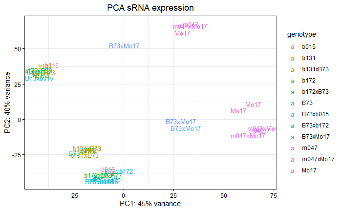

``` r
# Create a DESeqDataSet object
dds <- DESeqDataSetFromMatrix(countData = cts,
                              colData = coldata,
                              design= ~lane)

# Variance stabilizing transformation
vsd <- vst(dds, blind=TRUE)

# Create PCA
pcaData <- plotPCA(vsd, intgroup=c("sample", "lane"), returnData=TRUE)

# Get percentage variation
percentVar <- round(100 * attr(pcaData, "percentVar"))

p <- ggplot(pcaData, aes(PC1, PC2, label=sample, color=lane)) +  
  xlab(paste0("PC1: ",percentVar[1],"% variance")) + 
  ylab(paste0("PC2: ",percentVar[2],"% variance")) +  
  theme_bw() +  
  ggtitle("PCA sRNA expression") + 
  theme(axis.text.x = element_text(color="black"),
        axis.text.y = element_text(color="black"),
        axis.ticks = element_line(color = "black")) + 
  theme(plot.title = element_text(hjust = 0.5))

p + geom_text(size = 3)
```

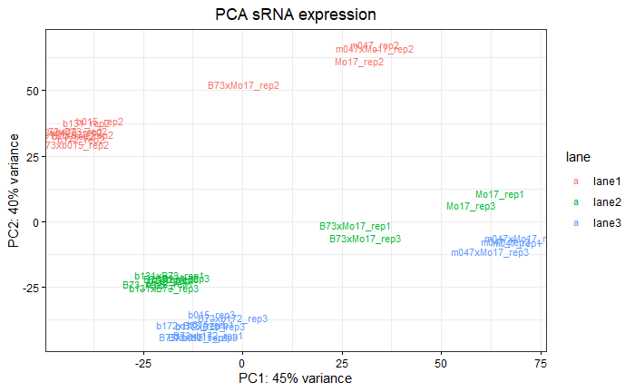

Lane1 was sequencing on older BGISEQ-500 platform and cluster aparts
from lane2 and lane3 (DNBSEQ-G400).

It could also be that the library processing was different (done later
for lane2 and lane3) although the same kit was used.

## PCA small RNA expression 17-30 nt

``` r
cts <- readRDS("data/srnaseq/cts.Rds")

# Upload the coldata file
coldata <- read.table("data/srnaseq/coldata.txt", header=T)

# Convert the variables into factors
col_names <- names(coldata)
coldata[,col_names] <- lapply(coldata[,col_names] , factor)

### Check that sample names match in both files
all(colnames(cts) == coldata$sample)


idx <- nchar(rownames(cts)) > 16 & nchar(rownames(cts)) < 31

sub_cts <- cts[idx,]

saveRDS(sub_cts, "data/srnaseq/cts_17_30nt.Rds")

# Create a DESeqDataSet object
dds <- DESeqDataSetFromMatrix(countData = sub_cts,
                              colData = coldata,
                              design= ~lane)

# Variance stabilizing transformation
vsd <- vst(dds, blind=TRUE)

# Create PCA
pcaData <- plotPCA(vsd, intgroup=c("sample", "lane"), returnData=TRUE)

# Get percentage variation
percentVar <- round(100 * attr(pcaData, "percentVar"))


p <- ggplot(pcaData, aes(PC1, PC2, label=sample, color=lane)) +  
  xlab(paste0("PC1: ",percentVar[1],"% variance")) + 
  ylab(paste0("PC2: ",percentVar[2],"% variance")) +  
  theme_bw() +  
  ggtitle("PCA sRNA expression") + 
  theme(axis.text.x = element_text(color="black"),
        axis.text.y = element_text(color="black"),
        axis.ticks = element_line(color = "black")) + 
  theme(plot.title = element_text(hjust = 0.5))

p + geom_text(size = 3.5)
```

## Clean up data

Remove samples from lane1 as they cluster far apart from lane 2 and 3.
Also remove sample b131xB73_rep1 which is likely a contaminant

``` r
cts <- readRDS("data/srnaseq/cts_17_30nt.Rds")

# Upload the coldata file
coldata <- read.table("data/srnaseq/coldata.txt", header=T)

coldata_sub <- coldata %>% filter(sample!="b131xB73_rep1") %>% droplevels()
idx <- colnames(cts) %in% coldata_sub$sample
cts_sub <- cts[,idx]

all(colnames(cts_sub) == coldata_sub$sample)

coldata <- coldata_sub
cts <- cts_sub

# Convert the variables into factors
col_names <- names(coldata)
coldata[,col_names] <- lapply(coldata[,col_names] , factor)

# Remove rows with no read count
keep <- rowSums(cts) > 0
cts_clean <-  cts[keep,]

# Save clean data
saveRDS(cts_clean, "data/srnaseq/cts_17_30nt_no_b131xB73_rep1.Rds")
saveRDS(coldata, "data/srnaseq/coldata_17_30nt_no_b131xB73_rep1.Rds")
```

## PCA sRNAs for each cross

Remove perform PCA clustering. Remove also sample b131xB73_rep1 which is
likely to be b131 genotype.

``` r
# Import the cts matrix (not gene name is now the row name => required)
cts <- readRDS("data/srnaseq/cts_17_30nt_no_b131xB73_rep1.Rds")

# Upload the coldata file
coldata <- readRDS("data/srnaseq/coldata_17_30nt_no_b131xB73_rep1.Rds")

### Check that sample names match in both files
all(colnames(cts) == coldata$sample)
```

``` r
# Create a DESeqDataSet object
dds <- DESeqDataSetFromMatrix(countData = cts,
                              colData = coldata,
                              design= ~lane)

# Variance stabilizing transformation
vsd <- vst(dds, blind=TRUE)

# Create PCA
pcaData <- plotPCA(vsd, intgroup=c("sample", "lane"), returnData=TRUE)

# Get percentage variation
percentVar <- round(100 * attr(pcaData, "percentVar"))

p <- ggplot(pcaData, aes(PC1, PC2, label=sample, color=lane)) +  
  xlab(paste0("PC1: ",percentVar[1],"% variance")) + 
  ylab(paste0("PC2: ",percentVar[2],"% variance")) +  
  theme_bw() +  
  ggtitle("PCA sRNA expression") + 
  theme(axis.text.x = element_text(color="black"),
        axis.text.y = element_text(color="black"),
        axis.ticks = element_line(color = "black")) + 
  theme(plot.title = element_text(hjust = 0.5))

p + geom_text(size = 4)
```

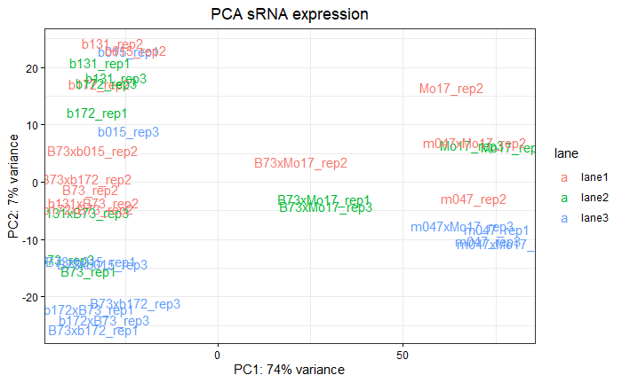

``` r
# Create a DESeqDataSet object
dds <- DESeqDataSetFromMatrix(countData = cts,
                              colData = coldata,
                              design= ~NOR)

# Variance stabilizing transformation
vsd <- vst(dds, blind=TRUE)

# Create PCA
pcaData <- plotPCA(vsd, intgroup=c("sample", "NOR"), returnData=TRUE)

# Get percentage variation
percentVar <- round(100 * attr(pcaData, "percentVar"))

col <- c("#1b9e77","#d95f02")

p <- ggplot(pcaData, aes(PC1, PC2, label=sample, color=NOR)) +  
  xlab(paste0("PC1: ",percentVar[1],"% variance")) + 
  ylab(paste0("PC2: ",percentVar[2],"% variance")) +  
  theme_bw() +  
  scale_color_manual(values=col) + 
  ggtitle("PCA sRNA expression") + 
  theme(axis.text.x = element_text(color="black"),
        axis.text.y = element_text(color="black"),
        axis.ticks = element_line(color = "black")) + 
  theme(plot.title = element_text(hjust = 0.5))

p + geom_text(size = 4)
```

### B73, Mo17, B73xMo17

``` r
# Create a DESeq2 matrix
dds <- DESeqDataSetFromMatrix(cts,
                  colData = coldata,
                  design = ~ NOR)


selection <- coldata %>% filter(genotype %in% c("B73","Mo17","B73xMo17")) %>% pull(sample)

dds <- dds[, colnames(dds) %in% selection]

# Variance stabilizing transformation
vsd <- vst(dds, blind=TRUE)

# Create PCA
pcaData <- plotPCA(vsd, intgroup=c("sample", "NOR"), returnData=TRUE)

# Get percentage variation
percentVar <- round(100 * attr(pcaData, "percentVar"))

col <- c("#1b9e77","#d95f02")

ggplot(pcaData, aes(PC1, PC2, color = NOR, label = sample)) +
  xlab(paste0("PC1: ", percentVar[1], "% variance")) +
  ylab(paste0("PC2: ", percentVar[2], "% variance")) +
  ggtitle("PCA sRNA expression") +
  theme_bw() +
  scale_color_manual(values=col) + 
  geom_text(size = 4) +
  theme(
    axis.text.x = element_text(color = "black"),
    axis.text.y = element_text(color = "black"),
    axis.ticks = element_line(color = "black")
  ) +
  theme(plot.title = element_text(hjust = 0.5)) +
  scale_y_continuous(labels = scales::comma_format())
```

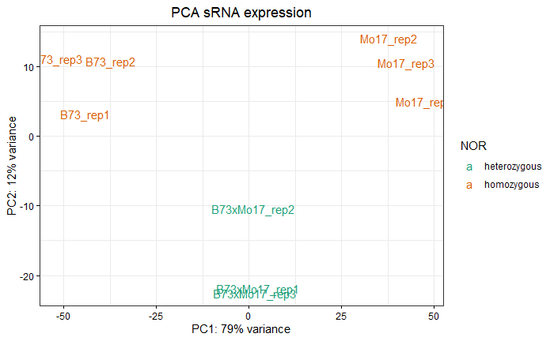

``` r
# Create a DESeq2 matrix
dds <- DESeqDataSetFromMatrix(cts,
                  colData = coldata,
                  design = ~ NOR)


selection <- coldata %>% filter(genotype %in% c("B73","Mo17","B73xMo17")) %>% pull(sample)

keep <- rowSums(counts(dds) >= 10) >= 3
dds <- dds[keep, ]

# Likelihood ratio test
dds_lrt <- DESeq(dds, test="LRT", reduced = ~ 1)

# Get results
res_LRT <- results(dds_lrt)

sigDEG_ID <- as.data.frame(res_LRT) %>% rownames_to_column("geneID") %>% 
  filter(padj < 0.05) %>% pull(geneID)

# Subset DESeqDataSet to only include DEGs only
dds_subset <- dds[rownames(dds) %in% sigDEG_ID, ]

# Apply rlog transformation to the subsetted DESeqDataSet
rld <- rlog(dds_subset) #, blind = TRUE)

# Extract the rlog values as a matrix
rlog_values <- assay(rld)

# If you want the rlog values as a data frame, you can do this:
rlog_df <- as.data.frame(rlog_values)

# Use the `degPatterns` function from the 'DEGreport' package to show gene clusters across sample groups
cluster_rlog <- rlog_df[sigDEG_ID, ]

design <- as.data.frame(colData(dds))

design$genotype <- factor(design$genotype,levels = c("B73", "B73xMo17", "Mo17"))

clusters <- degPatterns(cluster_rlog, metadata = design, time = "genotype", col=NULL)
```

### b015, B73, B73xb015

``` r
# Create a DESeq2 matrix
dds <- DESeqDataSetFromMatrix(cts,
                  colData = coldata,
                  design = ~ NOR)


selection <- coldata %>% filter(genotype %in% c("b015","B73","B73xb015")) %>% pull(sample)

dds <- dds[, colnames(dds) %in% selection]

vsd <- vst(dds, blind=TRUE)

# Create PCA
pcaData <- plotPCA(vsd, intgroup=c("sample", "NOR"), returnData=TRUE)

# Get percentage variation
percentVar <- round(100 * attr(pcaData, "percentVar"))

col <- c("#1b9e77","#d95f02")

p <- ggplot(pcaData, aes(PC1, PC2, color = NOR, label = sample)) +
  xlab(paste0("PC1: ", percentVar[1], "% variance")) +
  ylab(paste0("PC2: ", percentVar[2], "% variance")) +
  ggtitle("PCA sRNA expression") +
  theme_bw() +
  scale_color_manual(values=col) + 
  geom_text(size = 4) +
  theme(
    axis.text.x = element_text(color = "black"),
    axis.text.y = element_text(color = "black"),
    axis.ticks = element_line(color = "black")
  ) +
  theme(plot.title = element_text(hjust = 0.5)) +
  scale_y_continuous(labels = scales::comma_format())

p
```

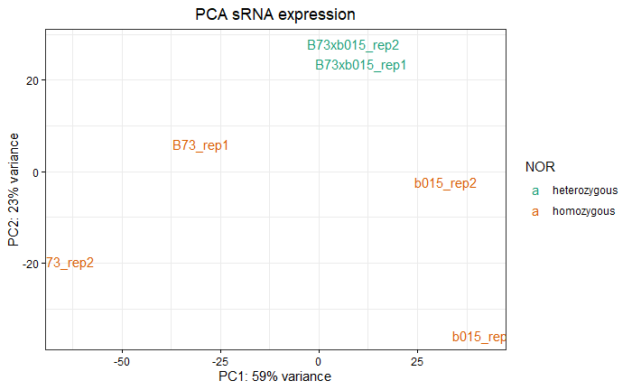

``` r
# Perform differential expression analysis
dds <- DESeq(dds)

# Create a DESeqResults object
res <- results(dds, contrast = c("NOR","heterozygous","homozygous"))

summary(res)

DEG <- as.data.frame(res) %>% rownames_to_column("geneID")

sigDEG <- as.data.frame(res) %>% rownames_to_column("geneID") %>% filter(padj < 0.05)

write.table(sigDEG, "data/rnaseq/sig_DEG_B73_b015_B73xb015.txt",
            quote=FALSE, row.names=FALSE, sep="\t")
```

### b131, B73, b131xB73 with b131xB73_rep1

``` r
cts <- readRDS("data/srnaseq/cts_17_30nt.Rds")

# Upload the coldata file
coldata <- read.table("data/srnaseq/coldata.txt", header=T)

# Create a DESeq2 matrix
dds <- DESeqDataSetFromMatrix(cts,
                  colData = coldata,
                  design = ~ NOR)


selection <- coldata %>% filter(genotype %in% c("b131","B73","b131xB73")) %>% pull(sample)

dds <- dds[, colnames(dds) %in% selection]

vsd <- vst(dds, blind=TRUE)

# Create PCA
pcaData <- plotPCA(vsd, intgroup=c("sample", "NOR"), returnData=TRUE)

# Get percentage variation
percentVar <- round(100 * attr(pcaData, "percentVar"))

col <- c("#1b9e77","#d95f02")

p <- ggplot(pcaData, aes(PC1, PC2, color = NOR, label = sample)) +
  xlab(paste0("PC1: ", percentVar[1], "% variance")) +
  ylab(paste0("PC2: ", percentVar[2], "% variance")) +
  ggtitle("PCA sRNA expression") +
  theme_bw() +
  scale_color_manual(values=col) + 
  geom_text(size = 3) +
  theme(
    axis.text.x = element_text(color = "black"),
    axis.text.y = element_text(color = "black"),
    axis.ticks = element_line(color = "black")
  ) +
  theme(plot.title = element_text(hjust = 0.5)) +
  scale_y_continuous(labels = scales::comma_format())

p
```

### b131, B73, b131xB73 without b131xB73_rep1

``` r
# Import the cts matrix (not gene name is now the row name => required)
cts <- readRDS("data/srnaseq/cts_17_30nt_no_b131xB73_rep1.Rds")

# Upload the coldata file
coldata <- readRDS("data/srnaseq/coldata_17_30nt_no_b131xB73_rep1.Rds")

### Check that sample names match in both files
all(colnames(cts) == coldata$sample)


# Create a DESeq2 matrix
dds <- DESeqDataSetFromMatrix(cts,
                  colData = coldata,
                  design = ~ NOR)


selection <- coldata %>% filter(genotype %in% c("b131","B73","b131xB73")) %>% pull(sample)

dds <- dds[, colnames(dds) %in% selection]

vsd <- vst(dds, blind=TRUE)

# Create PCA
pcaData <- plotPCA(vsd, intgroup=c("sample", "NOR"), returnData=TRUE)

# Get percentage variation
percentVar <- round(100 * attr(pcaData, "percentVar"))

col <- c("#1b9e77","#d95f02")

p <- ggplot(pcaData, aes(PC1, PC2, color = NOR, label = sample)) +
  xlab(paste0("PC1: ", percentVar[1], "% variance")) +
  ylab(paste0("PC2: ", percentVar[2], "% variance")) +
  ggtitle("PCA sRNA expression") +
  theme_bw() +
  scale_color_manual(values=col) + 
  geom_text(size = 4) +
  theme(
    axis.text.x = element_text(color = "black"),
    axis.text.y = element_text(color = "black"),
    axis.ticks = element_line(color = "black")
  ) +
  theme(plot.title = element_text(hjust = 0.5)) +
  scale_y_continuous(labels = scales::comma_format())

p
```

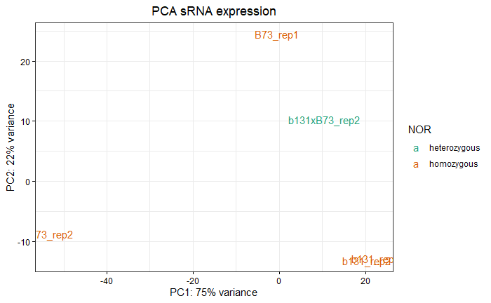

### b172, B73, b172xB73

``` r
# Create a DESeq2 matrix
dds <- DESeqDataSetFromMatrix(cts,
                  colData = coldata,
                  design = ~ NOR)


selection <- coldata %>% filter(genotype %in% c("b172","B73","b172xB73")) %>% pull(sample)

dds <- dds[, colnames(dds) %in% selection]


vsd <- vst(dds, blind=TRUE)

# Create PCA
pcaData <- plotPCA(vsd, intgroup=c("sample", "NOR"), returnData=TRUE)

# Get percentage variation
percentVar <- round(100 * attr(pcaData, "percentVar"))

col <- c("#1b9e77","#d95f02")

p <- ggplot(pcaData, aes(PC1, PC2, color = NOR, label = sample)) +
  xlab(paste0("PC1: ", percentVar[1], "% variance")) +
  ylab(paste0("PC2: ", percentVar[2], "% variance")) +
  ggtitle("PCA sRNA expression") +
  theme_bw() +
  scale_color_manual(values=col) + 
  geom_text(size = 4) +
  theme(
    axis.text.x = element_text(color = "black"),
    axis.text.y = element_text(color = "black"),
    axis.ticks = element_line(color = "black")
  ) +
  theme(plot.title = element_text(hjust = 0.5)) +
  scale_y_continuous(labels = scales::comma_format())

p
```

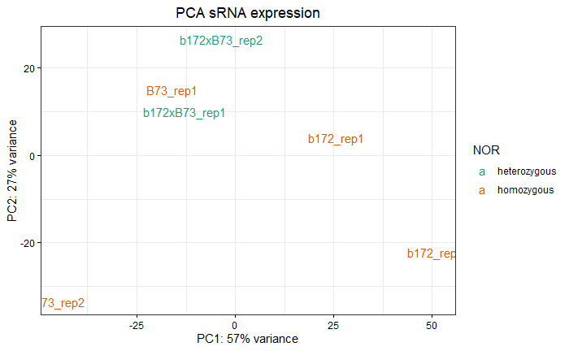

### b172, B73, B73xb172

``` r
# Create a DESeq2 matrix
dds <- DESeqDataSetFromMatrix(cts,
                  colData = coldata,
                  design = ~ NOR)


selection <- coldata %>% filter(genotype %in% c("b172","B73","B73xb172")) %>% pull(sample)

dds <- dds[, colnames(dds) %in% selection]


vsd <- vst(dds, blind=TRUE)

# Create PCA
pcaData <- plotPCA(vsd, intgroup=c("sample", "NOR"), returnData=TRUE)

# Get percentage variation
percentVar <- round(100 * attr(pcaData, "percentVar"))

col <- c("#1b9e77","#d95f02")

p <- ggplot(pcaData, aes(PC1, PC2, color = NOR, label = sample)) +
  xlab(paste0("PC1: ", percentVar[1], "% variance")) +
  ylab(paste0("PC2: ", percentVar[2], "% variance")) +
  ggtitle("PCA sRNA expression") +
  theme_bw() +
  scale_color_manual(values=col) + 
  geom_text(size = 4) +
  theme(
    axis.text.x = element_text(color = "black"),
    axis.text.y = element_text(color = "black"),
    axis.ticks = element_line(color = "black")
  ) +
  theme(plot.title = element_text(hjust = 0.5)) +
  scale_y_continuous(labels = scales::comma_format())

p
```

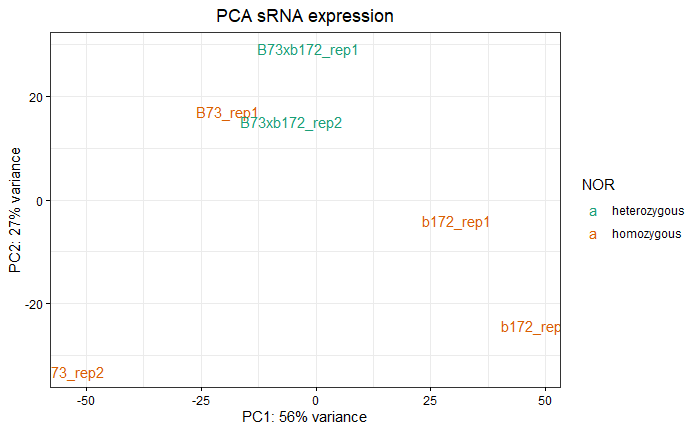

### b172, B73, B73xb172, b172xB73

``` r
# Create a DESeq2 matrix
dds <- DESeqDataSetFromMatrix(cts,
                  colData = coldata,
                  design = ~ NOR)

selection <- coldata %>% filter(genotype %in% c("b172","B73","B73xb172","b172xB73")) %>% pull(sample)

dds <- dds[, colnames(dds) %in% selection]

vsd <- vst(dds, blind=TRUE)

# Create PCA
pcaData <- plotPCA(vsd, intgroup=c("sample", "NOR"), returnData=TRUE)

# Get percentage variation
percentVar <- round(100 * attr(pcaData, "percentVar"))

col <- c("#1b9e77","#d95f02")

p <- ggplot(pcaData, aes(PC1, PC2, color = NOR, label = sample)) +
  xlab(paste0("PC1: ", percentVar[1], "% variance")) +
  ylab(paste0("PC2: ", percentVar[2], "% variance")) +
  ggtitle("PCA sRNA expression") +
  theme_bw() +
  scale_color_manual(values=col) + 
  geom_text(size = 4) +
  theme(
    axis.text.x = element_text(color = "black"),
    axis.text.y = element_text(color = "black"),
    axis.ticks = element_line(color = "black")
  ) +
  theme(plot.title = element_text(hjust = 0.5)) +
  scale_y_continuous(labels = scales::comma_format())

p
```

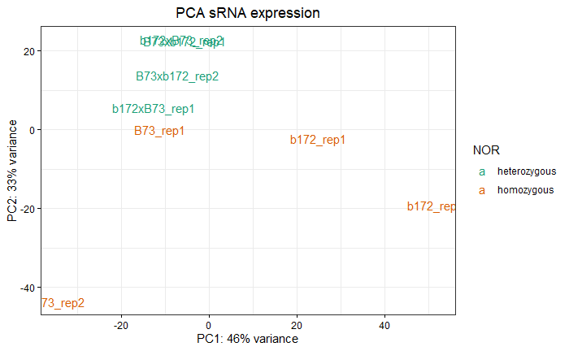

### Mo17, m047, m047xMo17

``` r
# Create a DESeq2 matrix
dds <- DESeqDataSetFromMatrix(cts,
                  colData = coldata,
                  design = ~ NOR)

selection <- coldata %>% filter(genotype %in% c("Mo17","m047","m047xMo17")) %>% pull(sample)

dds <- dds[, colnames(dds) %in% selection]

vsd <- vst(dds, blind=TRUE)

# Create PCA
pcaData <- plotPCA(vsd, intgroup=c("sample", "NOR"), returnData=TRUE)

# Get percentage variation
percentVar <- round(100 * attr(pcaData, "percentVar"))

col <- c("#1b9e77","#d95f02")

p <- ggplot(pcaData, aes(PC1, PC2, color = NOR, label = sample)) +
  xlab(paste0("PC1: ", percentVar[1], "% variance")) +
  ylab(paste0("PC2: ", percentVar[2], "% variance")) +
  ggtitle("PCA sRNA expression") +
  theme_bw() +
  scale_color_manual(values=col) + 
  geom_text(size = 4) +
  theme(
    axis.text.x = element_text(color = "black"),
    axis.text.y = element_text(color = "black"),
    axis.ticks = element_line(color = "black")
  ) +
  theme(plot.title = element_text(hjust = 0.5)) +
  scale_y_continuous(labels = scales::comma_format())

p
```

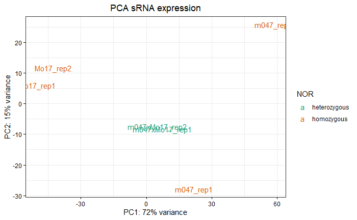

## Reads per million analysis

### All data

``` r
# Import the cts matrix (not gene name is now the row name => required)
cts <- readRDS("data/srnaseq/cts.Rds")

# Upload the coldata file
coldata <- read.table("data/srnaseq/coldata.txt", header=T)

### Check that sample names match in both files
all(colnames(cts) == coldata$sample)
```

``` r
m_cts <- as.matrix(cts)

# RPM normalize by dividing each value by the sum of the column and multiply by 1e6
rpm <- sweep(m_cts, 2, colSums(m_cts),`/`)
rpm <- rpm * 1e6

# Check, every column should sum to 1e6
colSums(rpm)
# 1e6

# Turn into dataframe
df_RPM <- as.data.frame(rpm)

# Put seq as variable and add size variable
df_RPM <- df_RPM %>% rownames_to_column(var="sequence")
df_RPM$size <- nchar(df_RPM$sequence)

# Set size and sequence as factor
df_RPM$size <- as.factor(df_RPM$size)
df_RPM$sequence <- as.factor(df_RPM$sequence)

df_RPM <- df_RPM %>% relocate(size, .after=sequence)

saveRDS(df_RPM, "data/srnaseq/df_RPM_all.Rds")

# Turn into a long list

# Move to long list
df_RPM_long <- df_RPM %>% gather(sample, RPM, B73_rep1:m047xMo17_rep3)

# sample as factor
df_RPM_long$sample <- as.factor(df_RPM_long$sample)

# Create a factor genotype to remove rep suffix
df_RPM_long$genotype <- sub("_.*", "", df_RPM_long$sample)

df_RPM_long$genotype <- as.factor(df_RPM_long$genotype)

# Save object
saveRDS(df_RPM_long, "data/srnaseq/df_RPM_long_all.Rds")
```

``` r
df_RPM_long <- readRDS("data/srnaseq/df_RPM_long_all.Rds")


long_df_rpm_size <- df_RPM_long %>% group_by(size, sample) %>% 
  summarize(RPM=sum(RPM), nb_sequence=n(), .groups='drop') %>% 
  arrange(RPM)

long_df_rpm_size$genotype <- sub("_.*", "", long_df_rpm_size$sample)
long_df_rpm_size$genotype <- as.factor(long_df_rpm_size$genotype)

long_df_rpm_size_mean <- long_df_rpm_size %>% group_by(size, genotype) %>% 
  summarize(RPM_mean=sum(RPM)/n(), ngroup=n(), sd=sd(RPM), .groups='drop')


long_df_rpm_size_mean$genotype <- factor(long_df_rpm_size_mean$genotype, levels = c("B73", "Mo17", "b015", "b131", "b172", "m047", "B73xMo17", "B73xb015", "b131xB73", "B73xb172", "b172xB73", "m047xMo17"), ordered = T)


ggplot(long_df_rpm_size_mean, aes(x = size, y = RPM_mean, fill = genotype)) +
  geom_bar(stat = "identity", position=position_dodge()) +
  geom_errorbar(aes(ymin = RPM_mean - sd, ymax = RPM_mean + sd),
    width = .5,
    position = position_dodge(.9)
  ) +
  theme_bw() +
  ylab("RPM") +
  xlab("Size in nt") +
  ggtitle("sRNA expression profile") +
  theme(axis.text.x = element_text(color = "black"), 
        axis.text.y = element_text(color = "black"), 
        axis.ticks = element_line(color = "black")) + 
  theme(plot.title = element_text(hjust = 0.5)) + 
  scale_y_continuous(labels = scales::comma_format())
```

#### Size bias across lanes?

``` r
df_RPM_long <- readRDS("data/srnaseq/df_RPM_long_all.Rds")


long_df_rpm_size <- df_RPM_long %>% group_by(size, sample) %>% 
  summarize(RPM=sum(RPM), nb_sequence=n(), .groups='drop') %>% 
  arrange(RPM)

long_df_rpm_size$genotype <- sub("_.*", "", long_df_rpm_size$sample)
long_df_rpm_size$genotype <- as.factor(long_df_rpm_size$genotype)

long_df_rpm_size %>% filter(genotype=="b131") %>%
ggplot(aes(x = size, y = RPM, fill = sample)) +
  geom_bar(stat = "identity", position=position_dodge()) +
  theme_bw() +
  ylab("RPM") +
  xlab("Size in nt") +
  ggtitle("sRNA expression profile") +
  theme(axis.text.x = element_text(color = "black"), 
        axis.text.y = element_text(color = "black"), 
        axis.ticks = element_line(color = "black")) + 
  theme(plot.title = element_text(hjust = 0.5)) + 
  scale_y_continuous(labels = scales::comma_format())
```

``` r
df_RPM_long$rep <- sub(".*_", "", df_RPM_long$sample)

df_RPM_long$rep <- as.factor(df_RPM_long$rep)

long_df_rpm_size <- df_RPM_long %>% group_by(size, rep) %>% 
  summarize(RPM=sum(RPM), nb_sequence=n(), .groups='drop') %>% 
  arrange(RPM)

long_df_rpm_size$genotype <- sub("_.*", "", long_df_rpm_size$sample)
long_df_rpm_size$genotype <- as.factor(long_df_rpm_size$genotype)

long_df_rpm_size %>%
ggplot(aes(x = size, y = RPM, fill = rep)) +
  geom_bar(stat = "identity", position=position_dodge()) +
  theme_bw() +
  ylab("RPM") +
  xlab("Size in nt") +
  ggtitle("sRNA expression profile") +
  theme(axis.text.x = element_text(color = "black"), 
        axis.text.y = element_text(color = "black"), 
        axis.ticks = element_line(color = "black")) + 
  theme(plot.title = element_text(hjust = 0.5)) + 
  scale_y_continuous(labels = scales::comma_format())
```

### Lane2/3, no no_b131xB73_rep1

Normalize raw read count into reads per million to compare samples with
each other.

``` r
# Import the cts matrix (not gene name is now the row name => required)
cts <- readRDS("data/srnaseq/cts_no_lane1_no_b131xB73_rep1.Rds")

# Upload the coldata file
coldata <- read.table("data/srnaseq/coldata_no_lane1_no_b131xB73_rep1.Rds", header=T)

### Check that sample names match in both files
all(colnames(cts) == coldata$sample)
```

``` r
m_cts <- as.matrix(cts)

# RPM normalize by dividing each value by the sum of the column and multiply by 1e6
rpm <- sweep(m_cts, 2, colSums(m_cts),`/`)
rpm <- rpm * 1e6

# Check, every column should sum to 1e6
colSums(rpm)
# 1e6

# Turn into dataframe
df_RPM <- as.data.frame(rpm)

# Put seq as variable and add size variable
df_RPM <- df_RPM %>% rownames_to_column(var="sequence")
df_RPM$size <- nchar(df_RPM$sequence)

# Set size and sequence as factor
df_RPM$size <- as.factor(df_RPM$size)
df_RPM$sequence <- as.factor(df_RPM$sequence)

df_RPM <- df_RPM %>% relocate(size, .after=sequence)

saveRDS(df_RPM, "data/srnaseq/df_RPM.Rds")

# Turn into a long list

#df_RPM <- readRDS("data/srnaseq/df_RPM.Rds")

# Move to long list
df_RPM_long <- df_RPM %>% gather(sample, RPM, B73_rep1:m047xMo17_rep2)

# sample as factor
df_RPM_long$sample <- as.factor(df_RPM_long$sample)

# Create a factor genotype to remove rep suffix
df_RPM_long$genotype <- sub("_.*", "", df_RPM_long$sample)

df_RPM_long$genotype <- as.factor(df_RPM_long$genotype)

# Save object
saveRDS(df_RPM_long, "data/srnaseq/df_RPM_long.Rds")
```

### sRNA expression overview

``` r
df_RPM_long <- readRDS("data/srnaseq/df_RPM_long.Rds")


long_df_rpm_size <- df_RPM_long %>% group_by(size, sample) %>% 
  summarize(RPM=sum(RPM), nb_sequence=n(), .groups='drop') %>% 
  arrange(RPM)

long_df_rpm_size$genotype <- sub("_.*", "", long_df_rpm_size$sample)
long_df_rpm_size$genotype <- as.factor(long_df_rpm_size$genotype)

long_df_rpm_size_mean <- long_df_rpm_size %>% group_by(size, genotype) %>% 
  summarize(RPM_mean=sum(RPM)/n(), ngroup=n(), sd=sd(RPM), .groups='drop')


long_df_rpm_size_mean$genotype <- factor(long_df_rpm_size_mean$genotype, levels = c("B73", "Mo17", "b015", "b131", "b172", "m047", "B73xMo17", "B73xb015", "b131xB73", "B73xb172", "b172xB73", "m047xMo17"), ordered = T)


ggplot(long_df_rpm_size_mean, aes(x = size, y = RPM_mean, fill = genotype)) +
  geom_bar(stat = "identity", position=position_dodge()) +
  geom_errorbar(aes(ymin = RPM_mean - sd, ymax = RPM_mean + sd),
    width = .5,
    position = position_dodge(.9)
  ) +
  theme_bw() +
  ylab("RPM") +
  xlab("Size in nt") +
  ggtitle("sRNA expression profile") +
  theme(axis.text.x = element_text(color = "black"), 
        axis.text.y = element_text(color = "black"), 
        axis.ticks = element_line(color = "black")) + 
  theme(plot.title = element_text(hjust = 0.5)) + 
  scale_y_continuous(labels = scales::comma_format())
```

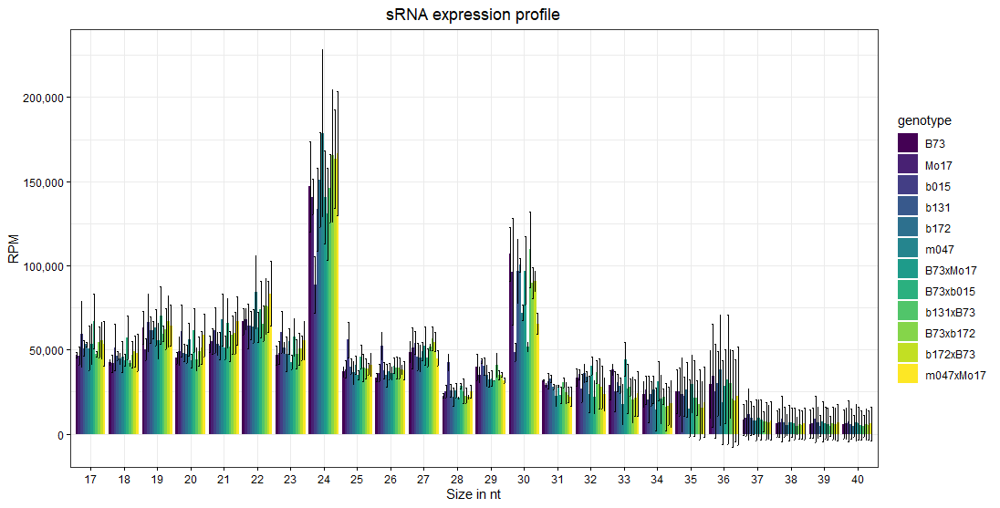

Show only B73, Mo17, and F1:

``` r
long_df_rpm_size_mean %>% filter(genotype %in% c("B73","Mo17","B73xMo17")) %>%
ggplot(aes(x = size, y = RPM_mean, fill = genotype)) +
  geom_bar(stat = "identity", position=position_dodge()) +
  geom_errorbar(aes(ymin = RPM_mean - sd, ymax = RPM_mean + sd),
    width = .5,
    position = position_dodge(.9)
  ) +
  theme_bw() +
  ylab("RPM") +
  xlab("Size in nt") +
  ggtitle("sRNA expression profile") +
  theme(axis.text.x = element_text(color = "black"), 
        axis.text.y = element_text(color = "black"), 
        axis.ticks = element_line(color = "black")) + 
  theme(plot.title = element_text(hjust = 0.5)) + 
  scale_y_continuous(labels = scales::comma_format())
```

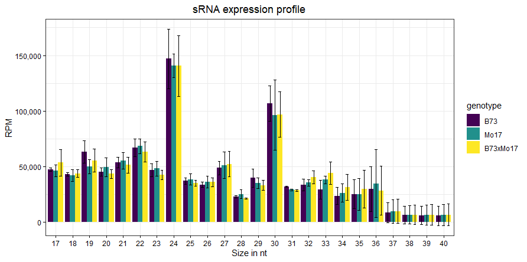

### Sequence diversity

``` r
df_RPM_long <- readRDS("data/srnaseq/df_RPM_long.Rds")

df_RPM_long_sum <- df_RPM_long %>% filter(RPM>0) %>% group_by(size, genotype) %>% 
  summarize(n_sum=n_distinct(sequence), .groups='drop')


df_RPM_long_sum$genotype <- factor(df_RPM_long_sum$genotype, levels = c("B73", "Mo17", "b015", "b131", "b172", "m047", "B73xMo17", "B73xb015", "b131xB73", "B73xb172", "b172xB73", "m047xMo17"), ordered = T)

df_RPM_long_sum %>% 
  ggplot(aes(x = size, y = n_sum, fill = genotype)) +
  geom_bar(stat = "identity", position=position_dodge()) +
  theme_bw() +
  ggtitle("sRNA sequence diversity") +
  ylab("Number of sRNAs") +
  xlab("Size in nt") +
  theme(axis.text.x = element_text(color = "black"), 
        axis.text.y = element_text(color = "black"), 
        axis.ticks = element_line(color = "black")) + 
  theme(plot.title = element_text(hjust = 0.5)) + 
  scale_y_continuous(labels = scales::comma_format())
```

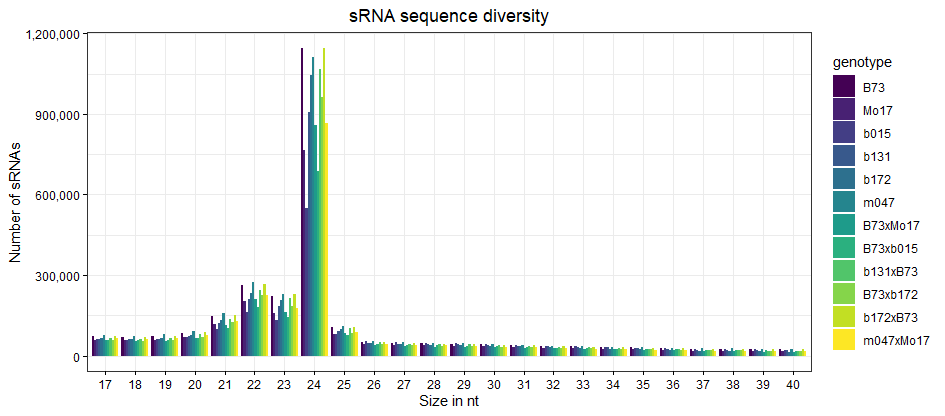

## UNITAS analysis all sRNAs

Run UNITAS on all 4M sRNAs found across libraries

### Install software

Install UNITAS v1.9.1 from GitHub (<https://github.com/d-gebert/unitas>)

``` bash
chmod +x unitas_1.9.1.pl

cpan install Archive::Extract Getopt::Long File::Path LWP::Simple

# LWP::Protocol::https already installed 
perldoc -l LWP::Protocol::https

# Get maize database
perl unitas_1.9.1.pl -refdump -species Zea_mays
```

### Get TE annotation

Get the TE annotation from B73 NAM5:

``` bash

# Integrate TE annotation in UNITAS output

# Download B73 NAM5 TE annotation
wget https://raw.githubusercontent.com/oushujun/MTEC/master/maizeTE02052020
# Note: This version was now put in the "history" folder. A new version is available (maizeTE04092026)
# with 40 new TEs annotated

# I just need to add the prefix "TE|" so that Unitas 
# classifies the mapped sRNAs in the TE category
seqkit replace -p ^ -r "TE|" maizeTE02052020.fa > maizeTE02052020_renamed.fa
```

### Run Unitas

``` bash
# Rename headers of input fasta file with a running number to avoid issue with UNITAS
#seqkit replace -p .+ -r "seq_{nr}" all_sRNAs_18_40nt.fa > all_sRNAs_18_40nt.renamed.fa

# Run Unitas
perl unitas_1.9.1.pl -input all_sRNAs_18_40nt.fa \
    -refseq maizeTE02052020_renamed.fa -species Zea_mays
```

### R plotting

#### Integrate output UNITAS into a R dataframe

``` r
df_RPM_long <- readRDS("data/srnaseq/df_RPM_long.Rds")

# Fasta output of UNITAS
df_rRFs <- fasta_to_df("data/srnaseq/unitas/fasta/unitas.rRNA.fas")
df_PC_genes <- fasta_to_df("data/srnaseq/unitas/fasta/unitas.protein_coding.fas")
df_TEs_unitas <- fasta_to_df("data/srnaseq/unitas/fasta/unitas.TE.fas")
df_tRFs_unitas <- fasta_to_df("data/srnaseq/unitas/fasta/unitas.tRNA.fas")

df_RPM_long_unitas <- df_RPM_long %>%
  mutate(category = ifelse((sequence %in% df_tRFs_unitas$sequence),
    "tRNA", ifelse((sequence %in% df_rRFs$sequence), "rRNA",
      ifelse((sequence %in% df_PC_genes$sequence), "PC_genes",
        ifelse((sequence %in% df_TEs_unitas$sequence), "TEs", "others")
      )
    )
  ))

df_RPM_long_unitas$category <- as.factor(df_RPM_long_unitas$category)

saveRDS(df_RPM_long_unitas, "data/srnaseq/df_RPM_long_unitas.Rds")
```

#### Sequence diversity per category

``` r
df_RPM_long_unitas <- readRDS("data/srnaseq/df_RPM_long_unitas.Rds")

df_RPM_long_unitas_sum <- df_RPM_long_unitas %>% filter(RPM>0) %>% group_by(category, genotype) %>% summarize(n_sum=n_distinct(sequence), .groups='drop')

col <-c("#7b3294","#c2a5cf","#a6dba0","#008837","gray")

# Order categories
df_RPM_long_unitas_sum$category <- 
  factor(df_RPM_long_unitas_sum$category, levels = c("rRNA", "tRNA", "PC_genes", "TEs", "others"))

df_RPM_long_unitas_sum$genotype <- factor(df_RPM_long_unitas_sum$genotype, levels = c("B73", "Mo17", "B73xMo17", "b015", "B73xb015", "b131", "b131xB73", "b172", "b172xB73", "B73xb172", "m047", "m047xMo17"), ordered = T)


df_RPM_long_unitas_sum$genotype <- factor(df_RPM_long_unitas_sum$genotype, levels = c("B73", "Mo17", "b015", "b131", "b172", "m047", "B73xMo17", "B73xb015", "b131xB73", "B73xb172", "b172xB73", "m047xMo17"), ordered = T)

ggplot(df_RPM_long_unitas_sum, 
             aes(x=genotype, y=n_sum, fill=category)) + 
  geom_bar(stat="identity", position="dodge") + 
  theme_bw() + 
  scale_fill_manual(values=col) +
  ylab("Number of sRNAs") + 
  xlab("") + 
  ggtitle("sRNA sequence diversity") + 
  theme(plot.title = element_text(hjust = 0.5))  + 
  theme(axis.text.x = element_text(color="black"),
        axis.text.y = element_text(color="black"),
        axis.ticks = element_line(color = "black")) + 
  scale_y_continuous(labels = scales::comma_format())
```

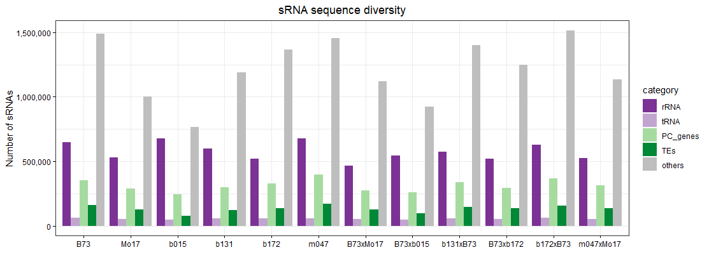

``` r
col <-c("#7b3294","#c2a5cf","#a6dba0","#008837","gray")

ggplot(df_RPM_long_unitas_sum, aes(x = genotype, y=n_sum, fill=category)) + 
  geom_bar(stat = "identity") +
  theme_bw() + 
  scale_fill_manual(values=col) +
  ylab("Number of sRNAs") + 
  xlab("") + 
  ggtitle("sRNA sequence diversity") + 
  theme(plot.title = element_text(hjust = 0.5))  + 
  theme(axis.text.x = element_text(color="black"),
        axis.text.y = element_text(color="black"),
        axis.ticks = element_line(color = "black")) + 
  scale_y_continuous(labels = scales::comma_format()) 
```

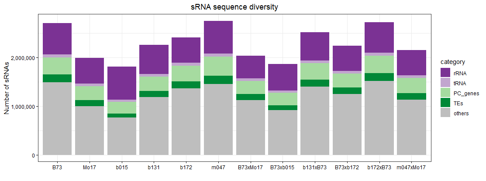

#### Expression per category

``` r
df_RPM_long_unitas_sum <- df_RPM_long_unitas %>% group_by(category, sample, genotype) %>% summarize(RPM_sum=sum(RPM), .groups='drop')

df_RPM_long_unitas_mean  <- df_RPM_long_unitas_sum %>% group_by(category, genotype) %>% 
  summarize(RPM_mean=sum(RPM_sum)/n(), nb_sequence=n(), sd=sd(RPM_sum), .groups='drop')

# Order categories

col <-c("#7b3294","#c2a5cf","#a6dba0","#008837","gray")

# Order categories
df_RPM_long_unitas_mean$category <- 
  factor(df_RPM_long_unitas_mean$category, levels = c("rRNA", "tRNA", "PC_genes", "TEs", "others"))

df_RPM_long_unitas_mean$genotype <- factor(df_RPM_long_unitas_mean$genotype, levels = c("B73", "Mo17", "B73xMo17", "b015", "B73xb015", "b131", "b131xB73", "b172", "b172xB73", "B73xb172", "m047", "m047xMo17"), ordered = T)


df_RPM_long_unitas_mean$genotype <- factor(df_RPM_long_unitas_mean$genotype, levels = c("B73", "Mo17", "b015", "b131", "b172", "m047", "B73xMo17", "B73xb015", "b131xB73", "B73xb172", "b172xB73", "m047xMo17"), ordered = T)


ggplot(df_RPM_long_unitas_mean, aes(x = genotype, y = RPM_mean, fill = category)) +
  geom_bar(stat = "identity", position=position_dodge()) +
  geom_errorbar(aes(ymin = RPM_mean - sd, ymax = RPM_mean + sd),
    width = .5,
    position = position_dodge(.9)
  ) +
  theme_bw() +
  scale_fill_manual(values=col) +
  ylab("RPM") +
  xlab("") +
  ggtitle("sRNA abundance per category") + 
   theme(axis.text.x = element_text(color = "black"), 
        axis.text.y = element_text(color = "black"), 
        axis.ticks = element_line(color = "black")) + 
  theme(plot.title = element_text(hjust = 0.5)) + 
  scale_y_continuous(labels = scales::comma_format())
```

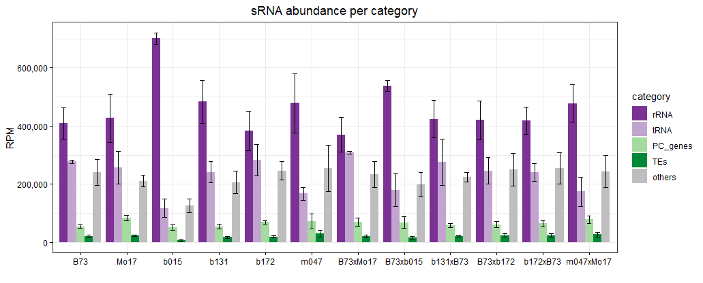 \#### Expression rRNA per size

``` r
df_RPM_long_unitas <- readRDS("data/srnaseq/df_RPM_long_unitas.Rds")

long_df_rpm_size <- df_RPM_long_unitas %>% filter(category=="rRNA") %>% filter(genotype %in% c("B73","Mo17","B73xMo17")) %>% group_by(size, sample) %>% 
  summarize(RPM=sum(RPM), nb_sequence=n(), .groups='drop') %>% 
  arrange(RPM)

long_df_rpm_size$genotype <- sub("_.*", "", long_df_rpm_size$sample)
long_df_rpm_size$genotype <- as.factor(long_df_rpm_size$genotype)

long_df_rpm_size_mean <- long_df_rpm_size %>% group_by(size, genotype) %>% 
  summarize(RPM_mean=sum(RPM)/n(), ngroup=n(), sd=sd(RPM), .groups='drop')


long_df_rpm_size_mean$genotype <- factor(long_df_rpm_size_mean$genotype, levels = c("B73", "Mo17", "B73xMo17"), ordered = T)


ggplot(long_df_rpm_size_mean, aes(x = size, y = RPM_mean, fill = genotype)) +
  geom_bar(stat = "identity", position=position_dodge()) +
  geom_errorbar(aes(ymin = RPM_mean - sd, ymax = RPM_mean + sd),
    width = .5,
    position = position_dodge(.9)
  ) +
  theme_bw() +
  ylab("RPM") +
  xlab("Size in nt") +
  ggtitle("sRNA expression profile") +
  theme(axis.text.x = element_text(color = "black"), 
        axis.text.y = element_text(color = "black"), 
        axis.ticks = element_line(color = "black")) + 
  theme(plot.title = element_text(hjust = 0.5)) + 
  scale_y_continuous(labels = scales::comma_format())
```

1.  ### tRF analysis

#### Type of tRFs based on UNITAS

``` r
df_RPM_long <- readRDS("data/srnaseq/df_RPM_long.Rds")

# Fasta output of UNITAS
df_3p_CCA <- fasta_to_df("data/srnaseq/unitas/fasta/unitas.genomic_3p-CCA-tRFs.fas")
df_3p_tRFs <- fasta_to_df("data/srnaseq/unitas/fasta/unitas.genomic_3p-tRFs.fas")
df_3p_tiRNA <- fasta_to_df("data/srnaseq/unitas/fasta/unitas.genomic_3p-tR-halves.fas")
df_5p_tRFs <- fasta_to_df("data/srnaseq/unitas/fasta/unitas.genomic_5p-tRFs.fas")
df_5p_tiRNA <- fasta_to_df("data/srnaseq/unitas/fasta/unitas.genomic_5p-tR-halves.fas")
df_misc_tRFs <- fasta_to_df("data/srnaseq/unitas/fasta//unitas.genomic_misc-tRFs.fas")
df_tRF_1 <- fasta_to_df("data/srnaseq/unitas/fasta/unitas.genomic_tRF-1.fas")
df_tRNA_leader <- fasta_to_df("data/srnaseq/unitas/fasta/unitas.genomic_tRNA-leader.fas")


# Annotate each sRNAs identified as a tRFs
df_RPM_long_tRF <- df_RPM_long %>%
  mutate(category = ifelse((sequence %in% df_3p_CCA$s), "3p-CCA-tRF",
    ifelse((sequence %in% df_3p_tiRNA$s), "3p-tiRNA",
      ifelse((sequence %in% df_3p_tRFs$s), "3p-tRF",
        ifelse((sequence %in% df_5p_tRFs$s), "5p-tRF",
          ifelse((sequence %in% df_5p_tiRNA$s), "5p-tiRNA",
            ifelse((sequence %in% df_misc_tRFs$s), "misc_tRF",
              ifelse((sequence %in% df_tRF_1$s), "tRF-1",
                ifelse((sequence %in% df_tRNA_leader$s), "tRNA-leader",
                  "others"
                )
              )
            )
          )
        )
      )
    )
  )
)

# Get rid of what is "others"
df_RPM_long_tRF_clean <-  df_RPM_long_tRF %>% filter(category!="others")

df_RPM_long_tRF <- df_RPM_long_tRF_clean
rm(df_RPM_long_tRF_clean)

df_RPM_long_tRF$category <- as.factor(df_RPM_long_tRF$category)

# Reorder samples
df_RPM_long_tRF$genotype <- factor(df_RPM_long_tRF$genotype, levels = c("B73", "Mo17", "b015", "b131", "b172", "m047", "B73xMo17", "B73xb015", "b131xB73", "B73xb172", "b172xB73", "m047xMo17"), ordered = T)

saveRDS(df_RPM_long_tRF, "data/srnaseq/df_RPM_long_tRF.Rds")
```

##### RPM tRF per category

``` r
df_RPM_long_tRF <- readRDS("data/srnaseq/df_RPM_long_tRF.Rds")

df1 <- df_RPM_long_tRF %>% group_by(category, sample, genotype) %>% summarize(RPM_sum=sum(RPM), .groups='drop')

df2  <- df1 %>% group_by(category, genotype) %>% 
  summarize(RPM_mean=sum(RPM_sum)/n(), nb_sequence=n(), sd=sd(RPM_sum), .groups='drop')

# Order categories
#df_RPM_long_unitas_mean$category <- 
 # factor(df_RPM_long_unitas_mean$category, levels = c("rRNA", "tRNA", "PC_genes", "TEs", "others"))

ggplot(df2, aes(x = genotype, y = RPM_mean, fill = category)) +
  geom_bar(stat = "identity", position=position_dodge()) +
  geom_errorbar(aes(ymin = RPM_mean - sd, ymax = RPM_mean + sd),
    width = .5,
    position = position_dodge(.9)
  ) +
  theme_bw() +
  ylab("RPM") +
  ggtitle("sRNAs expression per category") + 
   theme(axis.text.x = element_text(color = "black"), 
        axis.text.y = element_text(color = "black"), 
        axis.ticks = element_line(color = "black")) + 
  theme(plot.title = element_text(hjust = 0.5)) + 
  scale_y_continuous(labels = scales::comma_format()) + 
  theme(axis.text.x = element_text(angle=45, hjust=1))
```

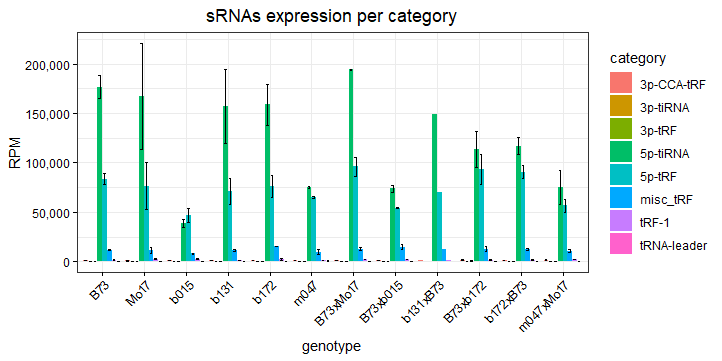

#### Type of tRNA codons

Use gtrnad database
(<https://gtrnadb.org/genomes/eukaryota/Zmays8/Zmays8-seq.html>) and
download the High confidence tRNA sequences (zeaMay8-tRNAs.fa).

``` bash
# Note that the version is frequently changed so this annotation is not available anymore
# Check the current version for maize on the website or use the Zmays7 provided in data
cd /mnt/ceph-hdd/workspaces/ws/scc_uanp_scholten/u14929-nor_nil_project/sRNA_data/tRNA_analysis

wget https://gtrnadb.org/genomes/eukaryota/Zmays8/zeaMay8-tRNAs.fa

seqkit stats zeaMay8-tRNAs.fa
file              format  type  num_seqs  sum_len  min_len  avg_len  max_len
zeaMay8-tRNAs.fa  FASTA   DNA      1,104   82,769       71       75       91


# Load needed softwares
module load gcc/14.2.0 bowtie/1.3.1 samtools/1.21

# Build the bowtie index
bowtie-build -f zeaMay8-tRNAs.fa zeaMay8_tRNAs

# Map all sRNAs without mismatches allowed
srun -p scc-cpu --time=00:10:00 bowtie -n 0 -S --threads 16 -x zeaMay8_tRNAs -f all_sRNAs_18_40nt.fa  | \
    samtools sort | \
    samtools view -bS -F4 -o tRNA_all_mapped_sRNAs.bam &

# reads processed: 4534719
# reads with at least one alignment: 21347 (0.47%)
# reads that failed to align: 4513372 (99.53%)


# Recover seq names of the mapped sRNAs
samtools view tRNA_all_mapped_sRNAs.bam | cut -f1 > mapped_sRNA_seq.txt

# Recover from fasta file
seqkit grep -n -f mapped_sRNA_seq.txt all_sRNAs_18_40nt.fa > tRFs_18_40nt.fa

# Retrieve sequence name and tRNA codon
samtools view tRNA_all_mapped_sRNAs.bam | cut -f1,3 > tRNA_mapped_sRNAs_seq_codon.txt

# Keep only the codon name
while read i; do
  gene=$(echo "$i" | cut -f2 | cut -d- -f2,3)
  seq_name=$(echo "$i" | cut -f1)
  sequence=$(grep -A1 -w ">$seq_name" tRFs_18_40nt.fa | grep -v ">")
  echo $sequence $gene
done < tRNA_mapped_sRNAs_seq_codon.txt > tRFs_18_40nt_annotated.txt

# Replace spaces by tabs
cat tRFs_18_40nt_annotated.txt | tr -s " " '\t' > tRFs_18_40nt_annotated.tab.txt

unix2dos tRFs_18_40nt_annotated.tab.txt
```

``` r
df_RPM_long <-  readRDS("data/srnaseq/df_RPM_long.Rds")

tRFs_18_40nt_annotate <- read.delim("data/srnaseq/tRFs_18_40nt_annotated.tab.txt", header=FALSE)

colnames(tRFs_18_40nt_annotate) <- c("sequence","tRNA")
tRFs_18_40nt_annotate <- tRFs_18_40nt_annotate %>% mutate_at(1:2, as.factor)

df_RPM_long_tRF <- merge(df_RPM_long, tRFs_18_40nt_annotate, by="sequence")
```

##### RPM for all codons

``` r
df_RPM_long_tRF_per_type <- df_RPM_long_tRF %>% group_by(tRNA, sample, genotype) %>% summarize(RPM_sum=sum(RPM))

df_RPM_long_tRF_per_type_mean  <- df_RPM_long_tRF_per_type %>% group_by(tRNA, genotype) %>% 
  summarize(RPM_mean=sum(RPM_sum)/n(), nb_sequence=n(), sd=sd(RPM_sum), .groups='drop')

df_RPM_long_tRF_per_type_mean <- reorder_samples(df_RPM_long_tRF_per_type_mean)


ggplot(df_RPM_long_tRF_per_type_mean, aes(x = tRNA, y = RPM_mean, fill = genotype)) +
  geom_bar(stat = "identity", position=position_dodge()) +
  geom_errorbar(aes(ymin = RPM_mean - sd, ymax = RPM_mean + sd),
    width = .5,
    position = position_dodge(.9)
  ) +
  theme_bw() +
  ylab("RPM") +
  xlab("tRNA codons") +
  ggtitle("RPM for all tRNA codons") +
  theme(axis.text.x = element_text(color = "black"), 
        axis.text.y = element_text(color = "black"), 
        axis.ticks = element_line(color = "black")) + 
  theme(plot.title = element_text(hjust = 0.5)) + 
  theme(axis.text.x = element_text(angle=90, hjust=1))+
  scale_y_continuous(labels = scales::comma_format())
```

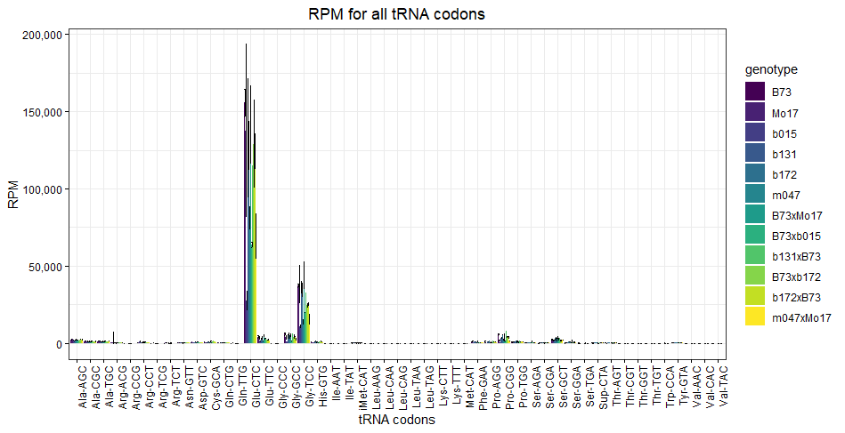

##### RPM tRF per codon

Keep top 8 for simpler display.

``` r
# Keep in descending order
top_8_tRNA <- df_RPM_long_tRF_per_type_mean %>% arrange(desc(RPM_mean)) %>% select(tRNA) %>% unique() %>% head(8)

df_RPM_long_tRF_per_type_mean_top_8 <- df_RPM_long_tRF_per_type_mean %>% filter(tRNA %in% top_8_tRNA$tRNA)


df_RPM_long_tRF_per_type_mean_top_8 <- reorder_samples(df_RPM_long_tRF_per_type_mean_top_8)

ggplot(df_RPM_long_tRF_per_type_mean_top_8, aes(x = tRNA, y = RPM_mean, fill = genotype)) +
  geom_bar(stat = "identity", position=position_dodge()) +
  geom_errorbar(aes(ymin = RPM_mean - sd, ymax = RPM_mean + sd),
    width = .5,
    position = position_dodge(.9)
  ) +
  theme_bw() +
  ylab("RPM") +
  xlab("tRNA codons") +
  ggtitle("RPM for top 8 tRNA codons") +
  theme(axis.text.x = element_text(color = "black"), 
        axis.text.y = element_text(color = "black"), 
        axis.ticks = element_line(color = "black")) + 
  theme(plot.title = element_text(hjust = 0.5)) + 
  scale_y_continuous(labels = scales::comma_format())
```

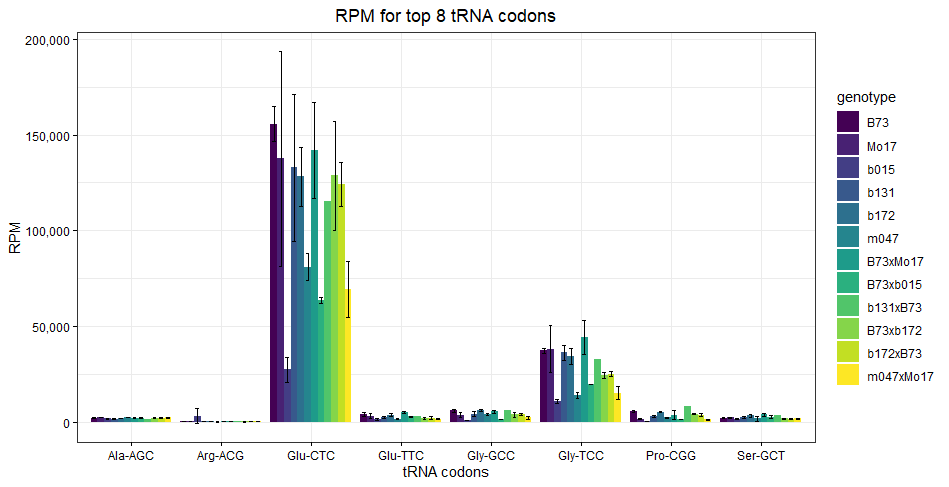

##### RPM tRF per size

``` r
df_RPM_long <-  readRDS("data/srnaseq/df_RPM_long.Rds")
df_tRFs <- fasta_to_df("data/srnaseq/tRFs_18_40nt.fa")

df_RPM_long_tRF <- df_RPM_long %>% filter(sequence %in% df_tRFs$sequence)

long_df_rpm_size <- df_RPM_long_tRF %>% group_by(size, sample, genotype) %>% 
  summarize(RPM=sum(RPM), .groups='drop') %>% 
  arrange(RPM)

long_df_rpm_size_mean <- long_df_rpm_size %>% group_by(size, genotype) %>% 
  summarize(RPM_mean=sum(RPM)/n(), sd=sd(RPM), .groups='drop')

long_df_rpm_size_mean <- reorder_samples(long_df_rpm_size_mean)


ggplot(long_df_rpm_size_mean, aes(x = size, y = RPM_mean, fill = genotype)) +
  geom_bar(stat = "identity", position=position_dodge()) +
  geom_errorbar(aes(ymin = RPM_mean - sd, ymax = RPM_mean + sd),
    width = .5,
    position = position_dodge(.9)
  ) +
  theme_bw() +
  ylab("RPM") +
  xlab("Size in nt") +
  ggtitle("tRF - Expression levels (RPM)")+
  theme(axis.text.x = element_text(color = "black"), 
        axis.text.y = element_text(color = "black"), 
        axis.ticks = element_line(color = "black")) + 
  theme(plot.title = element_text(hjust = 0.5)) + 
  scale_y_continuous(labels = scales::comma_format())
```

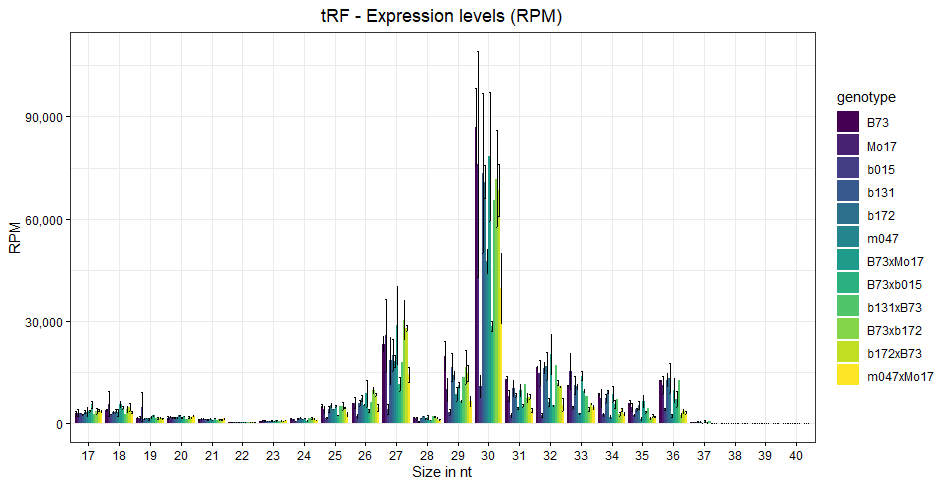

1.  # DE analysis rRFs

Identify sRNAs that are differentially expressed and found in the TraPR
data

``` r
cts <- readRDS("data/srnaseq/cts.Rds")

# Upload the coldata file
coldata <- read.table("data/srnaseq/coldata.txt", header=T)

df_rRFs <- fasta_to_df("data/srnaseq/unitas/fasta/unitas.rRNA.fas")

cts_rRF <- cts[df_rRFs$sequence,]
# 887k sequences

seq_rRFs <- rownames(cts_rRF)
seq_rRFs_20_24nt <- seq_rRFs[nchar(seq_rRFs)>19 & nchar(seq_rRFs)<25]

cts_rRF_20_24nt <- cts_rRF[seq_rRFs_20_24nt,]
# 236k

# Keep only sRNAs found in the TraPR dataset
sequences_trapr <- read.table("data/trapr/sequences_trapr.txt", quote="\"", comment.char="")

idx <- rownames(cts_rRF_20_24nt) %in% sequences_trapr$V1

cts_rRF_20_24nt_TraPR <- cts_rRF_20_24nt[idx,]

saveRDS(cts_rRF_20_24nt_TraPR, "data/srnaseq/cts_rRF_20_24nt_TraPR.Rds")
```

We end up with 47,125 20-24nt sRNAs annotated as rRFs and found in TraPR
data

## B73, Mo17, B73xMo17

``` r
selection <- coldata %>% filter(genotype %in% c("B73","Mo17","B73xMo17")) %>% pull(sample)

cts_sub <- cts_rRF_20_24nt_TraPR[, selection]

coldata_sub <- coldata %>% filter(sample %in% selection)

all(colnames(cts_sub) == coldata_sub$sample)

dds <- DESeqDataSetFromMatrix(countData = cts_sub,
                              colData = coldata_sub,
                              design= ~ NOR)

# Perform differential expression analysis
dds <- DESeq(dds)

# Create a DESeqResults object
res <- results(dds, contrast = c("NOR","heterozygous","homozygous"))

summary(res)

DEG <- as.data.frame(res) %>% rownames_to_column("geneID")

sigDEG <- as.data.frame(res) %>% rownames_to_column("geneID") %>% filter(padj < 0.05)

write.table(sigDEG, "data/srnaseq/sig_sRNA_B73_Mo17_F1.txt",
            quote=FALSE, row.names=FALSE, sep="\t")
```

8 sRNAs are DE

``` r
EnhancedVolcano(res,
  lab = rownames(res),
  x = "log2FoldChange",
  y = "padj",
  axisLabSize = 12,
  xlab = bquote(~ Log[2] ~ Fold ~ Change),
  ylab = bquote(~ -Log[10] ~ P ~ Value),
  pCutoff = 0.05,
  FCcutoff = 2,
  labSize = 4,
  title = "",
  subtitle = "DE sRNAs Het vs Hom",
  legendPosition = "bottom",
  legendLabSize = 10,
  legendIconSize = 4.0,
  drawConnectors = TRUE,
  widthConnectors = 0.75
)
```

## b015, B73, B73xb015

``` r
selection <- coldata %>% filter(genotype %in% c("b015","B73","B73xb015")) %>% pull(sample)

cts_sub <- cts_rRF_20_24nt_TraPR[,selection]

coldata_sub <- coldata %>% filter(sample %in% selection) 

dds <- DESeqDataSetFromMatrix(countData = cts_sub,
                              colData = coldata_sub,
                              design= ~ NOR)

# Perform differential expression analysis
dds <- DESeq(dds)

# Create a DESeqResults object
res <- results(dds, contrast = c("NOR","heterozygous","homozygous"))

summary(res)

DEG <- as.data.frame(res) %>% rownames_to_column("geneID")

sigDEG <- as.data.frame(res) %>% rownames_to_column("geneID") %>% filter(padj < 0.05)

write.table(sigDEG, "data/srnaseq/sig_sRNA_B73_b015_B73xb015.txt",
            quote=FALSE, row.names=FALSE, sep="\t")
```

2 sRNAs are DE

``` r
EnhancedVolcano(res,
  lab = rownames(res),
  x = "log2FoldChange",
  y = "padj",
  axisLabSize = 12,
  xlab = bquote(~ Log[2] ~ Fold ~ Change),
  ylab = bquote(~ -Log[10] ~ P ~ Value),
  pCutoff = 0.05,
  FCcutoff = 2,
  labSize = 4,
  title = "",
  subtitle = "DE sRNAs Het vs Hom",
  legendPosition = "bottom",
  legendLabSize = 10,
  legendIconSize = 4.0,
  drawConnectors = TRUE,
  widthConnectors = 0.75
)
```

## b131, B73, b131xB73

``` r
selection <- coldata %>% filter(genotype %in% c("b131","B73","b131xB73")) %>% pull(sample)

cts_sub <- cts_rRF_20_24nt_TraPR[,selection]

coldata_sub <- coldata %>% filter(sample %in% selection) 

dds <- DESeqDataSetFromMatrix(countData = cts_sub,
                              colData = coldata_sub,
                              design= ~ NOR)

# Perform differential expression analysis
dds <- DESeq(dds)

# Create a DESeqResults object
res <- results(dds, contrast = c("NOR","heterozygous","homozygous"))

summary(res)

DEG <- as.data.frame(res) %>% rownames_to_column("geneID")

sigDEG <- as.data.frame(res) %>% rownames_to_column("geneID") %>% filter(padj < 0.05)

write.table(sigDEG, "data/srnaseq/sig_sRNA_B73_b131_b131xB73.txt",
            quote=FALSE, row.names=FALSE, sep="\t")
```

0 DE sRNAs

``` r
EnhancedVolcano(res,
  lab = rownames(res),
  x = "log2FoldChange",
  y = "padj",
  axisLabSize = 12,
  xlab = bquote(~ Log[2] ~ Fold ~ Change),
  ylab = bquote(~ -Log[10] ~ P ~ Value),
  pCutoff = 0.05,
  FCcutoff = 2,
  labSize = 4,
  title = "",
  subtitle = "DE sRNAs Het vs Hom",
  legendPosition = "bottom",
  legendLabSize = 10,
  legendIconSize = 4.0,
  drawConnectors = TRUE,
  widthConnectors = 0.75
)
```

## b172, B73, b172xB73

``` r
selection <- coldata %>% filter(genotype %in% c("b172","B73","b172xB73")) %>% pull(sample)

cts_sub <- cts_rRF_20_24nt_TraPR[,selection]

coldata_sub <- coldata %>% filter(sample %in% selection) 

dds <- DESeqDataSetFromMatrix(countData = cts_sub,
                              colData = coldata_sub,
                              design= ~ NOR)

# Perform differential expression analysis
dds <- DESeq(dds)

# Create a DESeqResults object
res <- results(dds, contrast = c("NOR","heterozygous","homozygous"))

summary(res)

DEG <- as.data.frame(res) %>% rownames_to_column("geneID")

sigDEG <- as.data.frame(res) %>% rownames_to_column("geneID") %>% filter(padj < 0.05)

write.table(sigDEG, "data/srnaseq/sig_sRNA_b172_B73_b172xB73.txt",
            quote=FALSE, row.names=FALSE, sep="\t")
```

2 DE sRNAs

``` r
EnhancedVolcano(res,
  lab = rownames(res),
  x = "log2FoldChange",
  y = "padj",
  axisLabSize = 12,
  xlab = bquote(~ Log[2] ~ Fold ~ Change),
  ylab = bquote(~ -Log[10] ~ P ~ Value),
  pCutoff = 0.05,
  FCcutoff = 2,
  labSize = 4,
  title = "",
  subtitle = "DE sRNAs Het vs Hom",
  legendPosition = "bottom",
  legendLabSize = 10,
  legendIconSize = 4.0,
  drawConnectors = TRUE,
  widthConnectors = 0.75
)
```

## b172, B73, B73xb172

``` r
selection <- coldata %>% filter(genotype %in% c("b172","B73","B73xb172")) %>% pull(sample)

cts_sub <- cts_rRF_20_24nt_TraPR[,selection]

coldata_sub <- coldata %>% filter(sample %in% selection) 

dds <- DESeqDataSetFromMatrix(countData = cts_sub,
                              colData = coldata_sub,
                              design= ~ NOR)

# Perform differential expression analysis
dds <- DESeq(dds)

# Create a DESeqResults object
res <- results(dds, contrast = c("NOR","heterozygous","homozygous"))

summary(res)

DEG <- as.data.frame(res) %>% rownames_to_column("geneID")

sigDEG <- as.data.frame(res) %>% rownames_to_column("geneID") %>% filter(padj < 0.05)

write.table(sigDEG, "data/srnaseq/sig_sRNA_b172_B73_B73xb172.txt",
            quote=FALSE, row.names=FALSE, sep="\t")
```

0 DE sRNAs

``` r
EnhancedVolcano(res,
  lab = rownames(res),
  x = "log2FoldChange",
  y = "padj",
  axisLabSize = 12,
  xlab = bquote(~ Log[2] ~ Fold ~ Change),
  ylab = bquote(~ -Log[10] ~ P ~ Value),
  pCutoff = 0.05,
  FCcutoff = 2,
  labSize = 4,
  title = "",
  subtitle = "DE sRNAs Het vs Hom",
  legendPosition = "bottom",
  legendLabSize = 10,
  legendIconSize = 4.0,
  drawConnectors = TRUE,
  widthConnectors = 0.75
)
```

## b172, B73, B73xb172, b172xB73

``` r
selection <- coldata %>% filter(genotype %in% c("b172","B73","B73xb172","b172xB73")) %>% pull(sample)

cts_sub <- cts_rRF_20_24nt_TraPR[,selection]

coldata_sub <- coldata %>% filter(sample %in% selection) 

dds <- DESeqDataSetFromMatrix(countData = cts_sub,
                              colData = coldata_sub,
                              design= ~ NOR)

# Perform differential expression analysis
dds <- DESeq(dds)

# Create a DESeqResults object
res <- results(dds, contrast = c("NOR","heterozygous","homozygous"))

summary(res)

DEG <- as.data.frame(res) %>% rownames_to_column("geneID")

sigDEG <- as.data.frame(res) %>% rownames_to_column("geneID") %>% filter(padj < 0.05)

write.table(sigDEG, "data/srnaseq/sig_sRNA_b172_B73_B73xb172_b172xB73.txt",
            quote=FALSE, row.names=FALSE, sep="\t")
```

21 DE sRNAs

``` r
EnhancedVolcano(res,
  lab = rownames(res),
  x = "log2FoldChange",
  y = "padj",
  axisLabSize = 12,
  xlab = bquote(~ Log[2] ~ Fold ~ Change),
  ylab = bquote(~ -Log[10] ~ P ~ Value),
  pCutoff = 0.05,
  FCcutoff = 2,
  labSize = 4,
  title = "",
  subtitle = "DE sRNAs Het vs Hom",
  legendPosition = "bottom",
  legendLabSize = 10,
  legendIconSize = 4.0,
  drawConnectors = TRUE,
  widthConnectors = 0.75
)
```

## Mo17, m047, m047xMo17

``` r
selection <- coldata %>% filter(genotype %in% c("Mo17","m047","m047xMo17")) %>% pull(sample)

cts_sub <- cts_rRF_20_24nt_TraPR[,selection]

coldata_sub <- coldata %>% filter(sample %in% selection) 

dds <- DESeqDataSetFromMatrix(countData = cts_sub,
                              colData = coldata_sub,
                              design= ~ NOR)

# Perform differential expression analysis
dds <- DESeq(dds)

# Create a DESeqResults object
res <- results(dds, contrast = c("NOR","heterozygous","homozygous"))

summary(res)

DEG <- as.data.frame(res) %>% rownames_to_column("geneID")

sigDEG <- as.data.frame(res) %>% rownames_to_column("geneID") %>% filter(padj < 0.05)

write.table(sigDEG, "data/srnaseq/sig_sRNA_Mo17_m047_m047xMo17.txt",
            quote=FALSE, row.names=FALSE, sep="\t")
```

0 DE sRNAs

``` r
EnhancedVolcano(res,
  lab = rownames(res),
  x = "log2FoldChange",
  y = "padj",
  axisLabSize = 12,
  xlab = bquote(~ Log[2] ~ Fold ~ Change),
  ylab = bquote(~ -Log[10] ~ P ~ Value),
  pCutoff = 0.05,
  FCcutoff = 2,
  labSize = 4,
  title = "",
  subtitle = "DE sRNAs Het vs Hom",
  legendPosition = "bottom",
  legendLabSize = 10,
  legendIconSize = 4.0,
  drawConnectors = TRUE,
  widthConnectors = 0.75
)
```

## Het vs Hom

``` r
dds <- DESeqDataSetFromMatrix(countData = cts_rRF_20_24nt_TraPR,
                              colData = coldata,
                              design= ~ NOR)

# Perform differential expression analysis
dds <- DESeq(dds)

# Create a DESeqResults object
res <- results(dds, contrast = c("NOR","heterozygous","homozygous"))

summary(res)

DEG <- as.data.frame(res) %>% rownames_to_column("geneID")

sigDEG <- as.data.frame(res) %>% rownames_to_column("geneID") %>% filter(padj < 0.05)

write.table(sigDEG, "data/srnaseq/sig_sRNA_het_vs_hom.txt",
            quote=FALSE, row.names=FALSE, sep="\t")
```

0 sRNAs

``` r
EnhancedVolcano(res,
  lab = rownames(res),
  x = "log2FoldChange",
  y = "padj",
  axisLabSize = 12,
  xlab = bquote(~ Log[2] ~ Fold ~ Change),
  ylab = bquote(~ -Log[10] ~ P ~ Value),
  pCutoff = 0.05,
  FCcutoff = 2,
  labSize = 4,
  title = "",
  subtitle = "DE sRNAs Het vs Hom",
  legendPosition = "bottom",
  legendLabSize = 10,
  legendIconSize = 4.0,
  drawConnectors = TRUE,
  widthConnectors = 0.75
)
```

## Het vs Hom lane 1

``` r
selection <- coldata %>% filter(lane == "lane1") %>% pull(sample)

cts_sub <- cts_rRF_20_24nt_TraPR[,selection]

coldata_sub <- coldata %>% filter(sample %in% selection) 

dds <- DESeqDataSetFromMatrix(countData = cts_sub,
                              colData = coldata_sub,
                              design= ~ NOR)

# Perform differential expression analysis
dds <- DESeq(dds)

# Create a DESeqResults object
res <- results(dds, contrast = c("NOR","heterozygous","homozygous"))

summary(res)

DEG <- as.data.frame(res) %>% rownames_to_column("geneID")

sigDEG <- as.data.frame(res) %>% rownames_to_column("geneID") %>% filter(padj < 0.05)

write.table(sigDEG, "data/srnaseq/sig_sRNA_het_vs_hom_lane1.txt",
            quote=FALSE, row.names=FALSE, sep="\t")
```

0 sRNAs

## Het vs Hom lane 2

``` r
selection <- coldata %>% filter(lane == "lane2") %>% pull(sample)

cts_sub <- cts_rRF_20_24nt_TraPR[,selection]

coldata_sub <- coldata %>% filter(sample %in% selection) 

dds <- DESeqDataSetFromMatrix(countData = cts_sub,
                              colData = coldata_sub,
                              design= ~ NOR)

# Perform differential expression analysis
dds <- DESeq(dds)

# Create a DESeqResults object
res <- results(dds, contrast = c("NOR","heterozygous","homozygous"))

summary(res)

DEG <- as.data.frame(res) %>% rownames_to_column("geneID")

sigDEG <- as.data.frame(res) %>% rownames_to_column("geneID") %>% filter(padj < 0.05)

write.table(sigDEG, "data/srnaseq/sig_sRNA_het_vs_hom_lane2.txt",
            quote=FALSE, row.names=FALSE, sep="\t")
```

## Het vs Hom lane 3

``` r
selection <- coldata %>% filter(lane == "lane3") %>% pull(sample)

cts_sub <- cts_rRF_20_24nt_TraPR[,selection]

coldata_sub <- coldata %>% filter(sample %in% selection) 

dds <- DESeqDataSetFromMatrix(countData = cts_sub,
                              colData = coldata_sub,
                              design= ~ NOR)

# Perform differential expression analysis
dds <- DESeq(dds)

# Create a DESeqResults object
res <- results(dds, contrast = c("NOR","heterozygous","homozygous"))

summary(res)

DEG <- as.data.frame(res) %>% rownames_to_column("geneID")

sigDEG <- as.data.frame(res) %>% rownames_to_column("geneID") %>% filter(padj < 0.05)

write.table(sigDEG, "data/srnaseq/sig_sRNA_het_vs_hom_lane3.txt",
            quote=FALSE, row.names=FALSE, sep="\t")
```

26 DE

``` r
EnhancedVolcano(res,
  lab = rownames(res),
  x = "log2FoldChange",
  y = "padj",
  axisLabSize = 12,
  xlab = bquote(~ Log[2] ~ Fold ~ Change),
  ylab = bquote(~ -Log[10] ~ P ~ Value),
  pCutoff = 0.05,
  FCcutoff = 2,
  labSize = 4,
  title = "",
  subtitle = "DE sRNAs Het vs Hom",
  legendPosition = "bottom",
  legendLabSize = 10,
  legendIconSize = 4.0,
  drawConnectors = TRUE,
  widthConnectors = 0.75
)
```

# LRT approach

Look for non-additively expressed rRFs

## B73, Mo17, B73xMo17

``` r
cts_rRF_20_24nt_TraPR <- readRDS("data/srnaseq/cts_rRF_20_24nt_TraPR.Rds")

selection <- coldata %>% filter(genotype %in% c("B73","Mo17","B73xMo17")) %>% filter(lane %in% c("lane2","lane3")) %>% pull(sample)

cts_sub <- cts_rRF_20_24nt_TraPR[, selection]

coldata_sub <- coldata %>% filter(sample %in% selection)

all(colnames(cts_sub) == coldata_sub$sample)

dds <- DESeqDataSetFromMatrix(countData = cts_sub,
                              colData = coldata_sub,
                              design= ~ genotype)

# Perform differential expression analysis
dds_lrt <- DESeq(dds, test="LRT", reduced = ~ 1)

# Get results
res_LRT <- results(dds_lrt)

sigDEG_ID <- as.data.frame(res_LRT) %>% rownames_to_column("geneID") %>% 
  filter(padj < 0.05) %>% pull(geneID)
# 159

# Subset DESeqDataSet to only include DEGs only
dds_subset <- dds[rownames(dds) %in% sigDEG_ID, ]

# Apply rlog transformation to the subsetted DESeqDataSet
rld <- rlog(dds_subset) #, blind = TRUE)

# Extract the rlog values as a matrix
rlog_values <- assay(rld)

# If you want the rlog values as a data frame, you can do this:
rlog_df <- as.data.frame(rlog_values)

# Use the `degPatterns` function from the 'DEGreport' package to show gene clusters across sample groups
cluster_rlog <- rlog_df[sigDEG_ID, ]

design <- as.data.frame(colData(dds))

design$genotype <- factor(design$genotype,levels = c("B73", "B73xMo17", "Mo17"))

clusters <- degPatterns(cluster_rlog, metadata = design, time = "genotype", col=NULL)

saveRDS(clusters, "data/srnaseq/clusters_B73_Mo17_B73xMo17.Rds")

clusters <- readRDS("data/srnaseq/clusters_B73_Mo17_B73xMo17.Rds")

#cluster_up_het <- clusters$df[clusters$df$cluster==1,]

cluster_down_het <- clusters$df[clusters$df$cluster==2,]

p <- clusters$plot
p$layers$geom_point$aes_params$alpha <- 0.05
p$layers$geom_line$aes_params$alpha <- 0.05
p1 <- p + scale_color_manual(values = "black") + theme(legend.position = "none") + ggtitle("LRT rRF B73_Mo17_B73xMo17") + theme(plot.title = element_text(hjust = 0.5))

ggsave("images/clusters_rRF_B73_Mo17_B73xMo17.png", p1, width = 8, height = 6)
```

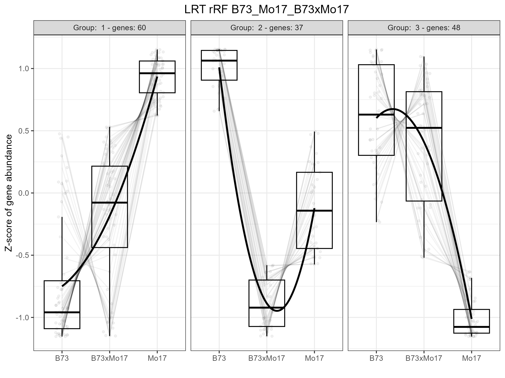

## b015, B73, B73xb015

``` r
cts_rRF_20_24nt_TraPR <- readRDS("data/srnaseq/cts_rRF_20_24nt_TraPR.Rds")

selection <- coldata %>% filter(genotype %in% c("b015","B73","B73xb015")) %>% filter(lane %in% c("lane2","lane3")) %>% pull(sample)

cts_sub <- cts_rRF_20_24nt_TraPR[, selection]

coldata_sub <- coldata %>% filter(sample %in% selection)

all(colnames(cts_sub) == coldata_sub$sample)

dds <- DESeqDataSetFromMatrix(countData = cts_sub,
                              colData = coldata_sub,
                              design= ~ genotype)

# Perform differential expression analysis
dds_lrt <- DESeq(dds, test="LRT", reduced = ~ 1)

# Get results
res_LRT <- results(dds_lrt)

sigDEG_ID <- as.data.frame(res_LRT) %>% rownames_to_column("geneID") %>% 
  filter(padj < 0.05) %>% pull(geneID)
# 1895 

# Subset DESeqDataSet to only include DEGs only
dds_subset <- dds[rownames(dds) %in% sigDEG_ID, ]

# Apply rlog transformation to the subsetted DESeqDataSet
rld <- rlog(dds_subset) #, blind = TRUE)

# Extract the rlog values as a matrix
rlog_values <- assay(rld)

# If you want the rlog values as a data frame, you can do this:
rlog_df <- as.data.frame(rlog_values)

# Use the `degPatterns` function from the 'DEGreport' package to show gene clusters across sample groups
cluster_rlog <- rlog_df[sigDEG_ID, ]

design <- as.data.frame(colData(dds))

design$genotype <- factor(design$genotype,levels = c("B73","B73xb015","b015"))

clusters <- degPatterns(cluster_rlog, metadata = design, time = "genotype", col=NULL)

saveRDS(clusters, "data/srnaseq/clusters_B73_b015_B73xb015.Rds")

clusters <- readRDS("data/srnaseq/clusters_B73_b015_B73xb015.Rds")

#cluster_up_het <- clusters$df[clusters$df$cluster==1,]

cluster_down_het <- clusters$df[clusters$df$cluster==2,]

p <- clusters$plot
p$layers$geom_point$aes_params$alpha <- 0.05
p$layers$geom_line$aes_params$alpha <- 0.05
p1 <- p + scale_color_manual(values = "black") + theme(legend.position = "none") + ggtitle("LRT rRF B73_b015_B73xb015") + theme(plot.title = element_text(hjust = 0.5))

ggsave("images/clusters_rRF_B73_b015_B73xb015.png", p1, width = 8, height = 6)
```

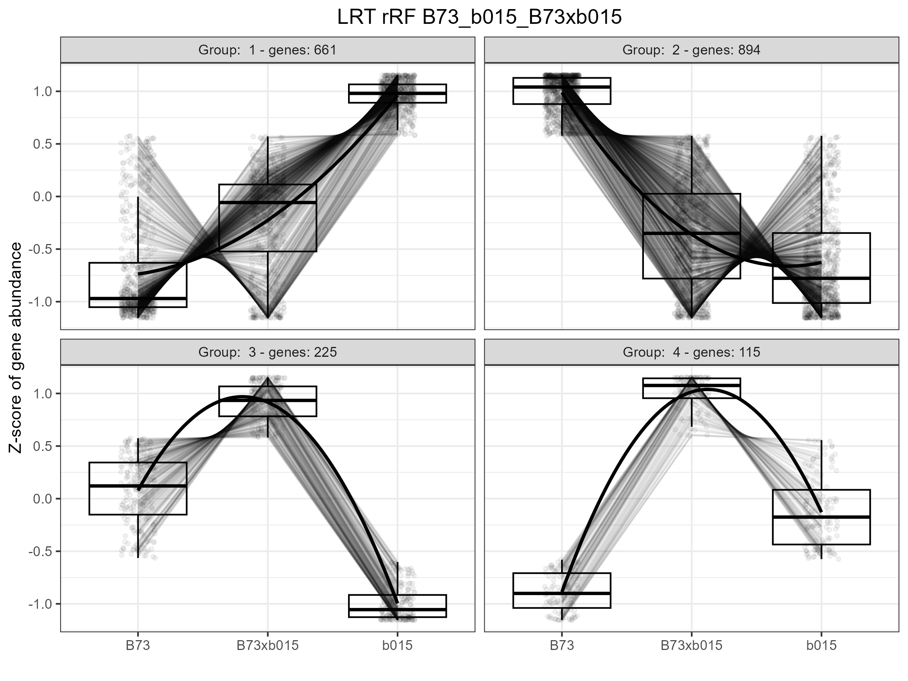

## b131, B73, b131xB73

``` r
cts_rRF_20_24nt_TraPR <- readRDS("data/srnaseq/cts_rRF_20_24nt_TraPR.Rds")

selection <- coldata %>% filter(genotype %in% c("b131","B73","b131xB73")) %>% filter(lane %in% c("lane2","lane3")) %>% pull(sample)

cts_sub <- cts_rRF_20_24nt_TraPR[, selection]

coldata_sub <- coldata %>% filter(sample %in% selection)

all(colnames(cts_sub) == coldata_sub$sample)

dds <- DESeqDataSetFromMatrix(countData = cts_sub,
                              colData = coldata_sub,
                              design= ~ genotype)

# Perform differential expression analysis
dds_lrt <- DESeq(dds, test="LRT", reduced = ~ 1)

# Get results
res_LRT <- results(dds_lrt)

sigDEG_ID <- as.data.frame(res_LRT) %>% rownames_to_column("geneID") %>% 
  filter(padj < 0.05) %>% pull(geneID)
# 115

# Subset DESeqDataSet to only include DEGs only
dds_subset <- dds[rownames(dds) %in% sigDEG_ID, ]

# Apply rlog transformation to the subsetted DESeqDataSet
rld <- rlog(dds_subset) #, blind = TRUE)

# Extract the rlog values as a matrix
rlog_values <- assay(rld)

# If you want the rlog values as a data frame, you can do this:
rlog_df <- as.data.frame(rlog_values)

# Use the `degPatterns` function from the 'DEGreport' package to show gene clusters across sample groups
cluster_rlog <- rlog_df[sigDEG_ID, ]

design <- as.data.frame(colData(dds))

design$genotype <- factor(design$genotype,levels = c("b131","b131xB73","B73"))

clusters <- degPatterns(cluster_rlog, metadata = design, time = "genotype", col=NULL)

saveRDS(clusters, "data/srnaseq/clusters_b131_b131xB73_B73.Rds")

clusters <- readRDS("data/srnaseq/clusters_B73_b015_B73xb015.Rds")

#cluster_up_het <- clusters$df[clusters$df$cluster==1,]

#cluster_down_het <- clusters$df[clusters$df$cluster==2,]

p <- clusters$plot
p$layers$geom_point$aes_params$alpha <- 0.05
p$layers$geom_line$aes_params$alpha <- 0.05
p1 <- p + scale_color_manual(values = "black") + theme(legend.position = "none") + ggtitle("LRT rRF b131_b131xB73_B73") + theme(plot.title = element_text(hjust = 0.5))

ggsave("images/clusters_rRF_b131_b131xB73_B73.png", p1, width = 8, height = 6)
```

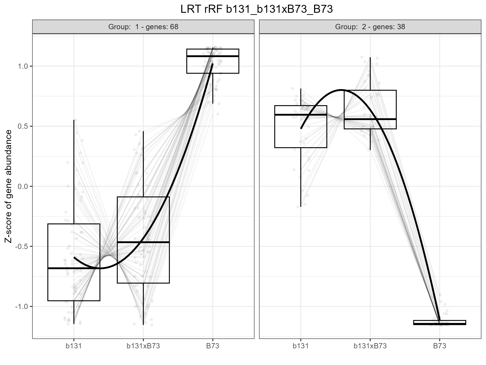

## b172, B73, B73xb172

``` r
cts_rRF_20_24nt_TraPR <- readRDS("data/srnaseq/cts_rRF_20_24nt_TraPR.Rds")

selection <- coldata %>% filter(genotype %in% c("b172","B73","B73xb172")) %>% filter(lane %in% c("lane2","lane3")) %>% pull(sample)

cts_sub <- cts_rRF_20_24nt_TraPR[, selection]

coldata_sub <- coldata %>% filter(sample %in% selection)

all(colnames(cts_sub) == coldata_sub$sample)

dds <- DESeqDataSetFromMatrix(countData = cts_sub,
                              colData = coldata_sub,
                              design= ~ genotype)

# Perform differential expression analysis
dds_lrt <- DESeq(dds, test="LRT", reduced = ~ 1)

# Get results
res_LRT <- results(dds_lrt)

sigDEG_ID <- as.data.frame(res_LRT) %>% rownames_to_column("geneID") %>% 
  filter(padj < 0.05) %>% pull(geneID)
# 176

# Subset DESeqDataSet to only include DEGs only
dds_subset <- dds[rownames(dds) %in% sigDEG_ID, ]

# Apply rlog transformation to the subsetted DESeqDataSet
rld <- rlog(dds_subset) #, blind = TRUE)

# Extract the rlog values as a matrix
rlog_values <- assay(rld)

# If you want the rlog values as a data frame, you can do this:
rlog_df <- as.data.frame(rlog_values)

# Use the `degPatterns` function from the 'DEGreport' package to show gene clusters across sample groups
cluster_rlog <- rlog_df[sigDEG_ID, ]

design <- as.data.frame(colData(dds))

design$genotype <- factor(design$genotype,levels =c("B73","B73xb172", "b172"))

clusters <- degPatterns(cluster_rlog, metadata = design, time = "genotype", col=NULL)

saveRDS(clusters, "data/srnaseq/clusters_B73_B73xb172_b172.Rds")

clusters <- readRDS("data/srnaseq/clusters_B73_B73xb172_b172.Rds")

#cluster_up_het <- clusters$df[clusters$df$cluster==1,]

#cluster_down_het <- clusters$df[clusters$df$cluster==2,]

p <- clusters$plot
p$layers$geom_point$aes_params$alpha <- 0.05
p$layers$geom_line$aes_params$alpha <- 0.05
p1 <- p + scale_color_manual(values = "black") + theme(legend.position = "none") + ggtitle("LRT rRF B73_B73xb172_b172") + theme(plot.title = element_text(hjust = 0.5))

ggsave("images/clusters_rRF_B73_B73xb172_b172.png", p1, width = 8, height = 6)
```

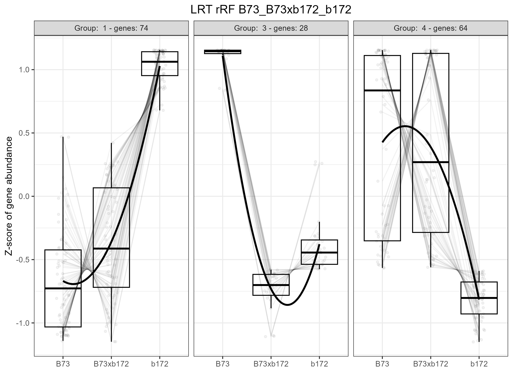

## b172, B73, b172xB73

``` r
cts_rRF_20_24nt_TraPR <- readRDS("data/srnaseq/cts_rRF_20_24nt_TraPR.Rds")

selection <- coldata %>% filter(genotype %in% c("b172","B73","b172xB73")) %>% filter(lane %in% c("lane2","lane3")) %>% pull(sample)

cts_sub <- cts_rRF_20_24nt_TraPR[, selection]

coldata_sub <- coldata %>% filter(sample %in% selection)

all(colnames(cts_sub) == coldata_sub$sample)

dds <- DESeqDataSetFromMatrix(countData = cts_sub,
                              colData = coldata_sub,
                              design= ~ genotype)

# Perform differential expression analysis
dds_lrt <- DESeq(dds, test="LRT", reduced = ~ 1)

# Get results
res_LRT <- results(dds_lrt)

sigDEG_ID <- as.data.frame(res_LRT) %>% rownames_to_column("geneID") %>% 
  filter(padj < 0.05) %>% pull(geneID)
# 150

# Subset DESeqDataSet to only include DEGs only
dds_subset <- dds[rownames(dds) %in% sigDEG_ID, ]

# Apply rlog transformation to the subsetted DESeqDataSet
rld <- rlog(dds_subset) #, blind = TRUE)

# Extract the rlog values as a matrix
rlog_values <- assay(rld)

# If you want the rlog values as a data frame, you can do this:
rlog_df <- as.data.frame(rlog_values)

# Use the `degPatterns` function from the 'DEGreport' package to show gene clusters across sample groups
cluster_rlog <- rlog_df[sigDEG_ID, ]

design <- as.data.frame(colData(dds))

design$genotype <- factor(design$genotype,levels =c("b172","b172xB73", "B73"))

clusters <- degPatterns(cluster_rlog, metadata = design, time = "genotype", col=NULL)

saveRDS(clusters, "data/srnaseq/clusters_b172_b172xB73_B73.Rds")

clusters <- readRDS("data/srnaseq/clusters_b172_b172xB73_B73.Rds")

#cluster_up_het <- clusters$df[clusters$df$cluster==1,]

#cluster_down_het <- clusters$df[clusters$df$cluster==2,]

p <- clusters$plot
p$layers$geom_point$aes_params$alpha <- 0.05
p$layers$geom_line$aes_params$alpha <- 0.05
p1 <- p + scale_color_manual(values = "black") + theme(legend.position = "none") + ggtitle("LRT rRF b172_b172xB73_B73") + theme(plot.title = element_text(hjust = 0.5))

ggsave("images/clusters_rRF_b172_b172xB73_B73.png", p1, width = 8, height = 6)
```

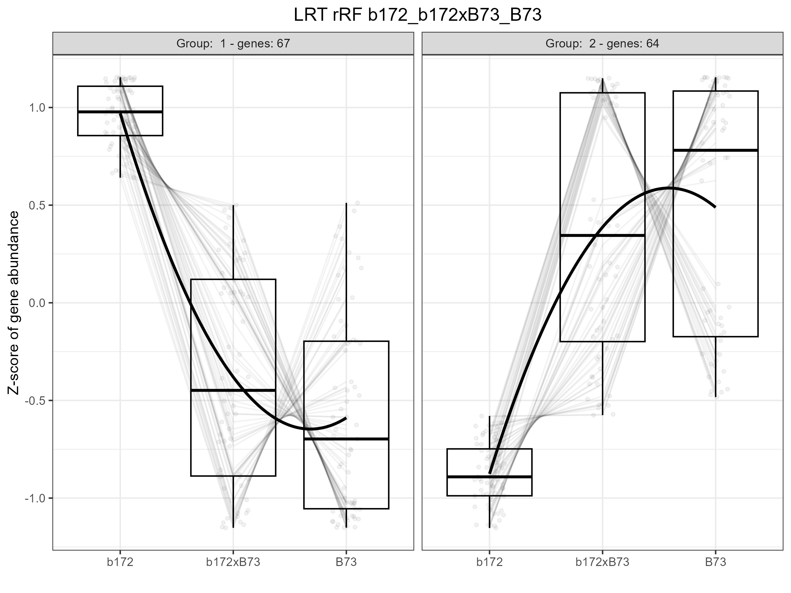

## Mo17, m047, m047xMo17

``` r
cts_rRF_20_24nt_TraPR <- readRDS("data/srnaseq/cts_rRF_20_24nt_TraPR.Rds")

selection <- coldata %>% filter(genotype %in% c("Mo17","m047","m047xMo17")) %>% filter(lane %in% c("lane2","lane3")) %>% pull(sample)

cts_sub <- cts_rRF_20_24nt_TraPR[, selection]

coldata_sub <- coldata %>% filter(sample %in% selection)

all(colnames(cts_sub) == coldata_sub$sample)

dds <- DESeqDataSetFromMatrix(countData = cts_sub,
                              colData = coldata_sub,
                              design= ~ genotype)

# Perform differential expression analysis
dds_lrt <- DESeq(dds, test="LRT", reduced = ~ 1)

# Get results
res_LRT <- results(dds_lrt)

sigDEG_ID <- as.data.frame(res_LRT) %>% rownames_to_column("geneID") %>% 
  filter(padj < 0.05) %>% pull(geneID)
# 116

# Subset DESeqDataSet to only include DEGs only
dds_subset <- dds[rownames(dds) %in% sigDEG_ID, ]

# Apply rlog transformation to the subsetted DESeqDataSet
rld <- rlog(dds_subset) #, blind = TRUE)

# Extract the rlog values as a matrix
rlog_values <- assay(rld)

# If you want the rlog values as a data frame, you can do this:
rlog_df <- as.data.frame(rlog_values)

# Use the `degPatterns` function from the 'DEGreport' package to show gene clusters across sample groups
cluster_rlog <- rlog_df[sigDEG_ID, ]

design <- as.data.frame(colData(dds))

design$genotype <- factor(design$genotype,levels =c("m047","m047xMo17", "Mo17"))

clusters <- degPatterns(cluster_rlog, metadata = design, time = "genotype", col=NULL)

saveRDS(clusters, "data/srnaseq/clusters_m047_m047xMo17_Mo17.Rds")

clusters <- readRDS("data/srnaseq/clusters_m047_m047xMo17_Mo17.Rds")

#cluster_up_het <- clusters$df[clusters$df$cluster==1,]

#cluster_down_het <- clusters$df[clusters$df$cluster==2,]

p <- clusters$plot
p$layers$geom_point$aes_params$alpha <- 0.05
p$layers$geom_line$aes_params$alpha <- 0.05
p1 <- p + scale_color_manual(values = "black") + theme(legend.position = "none") + ggtitle("LRT rRF m047_m047xMo17_Mo17") + theme(plot.title = element_text(hjust = 0.5))

ggsave("images/clusters_rRF_m047_m047xMo17_Mo17.png", p1, width = 8, height = 6)
```

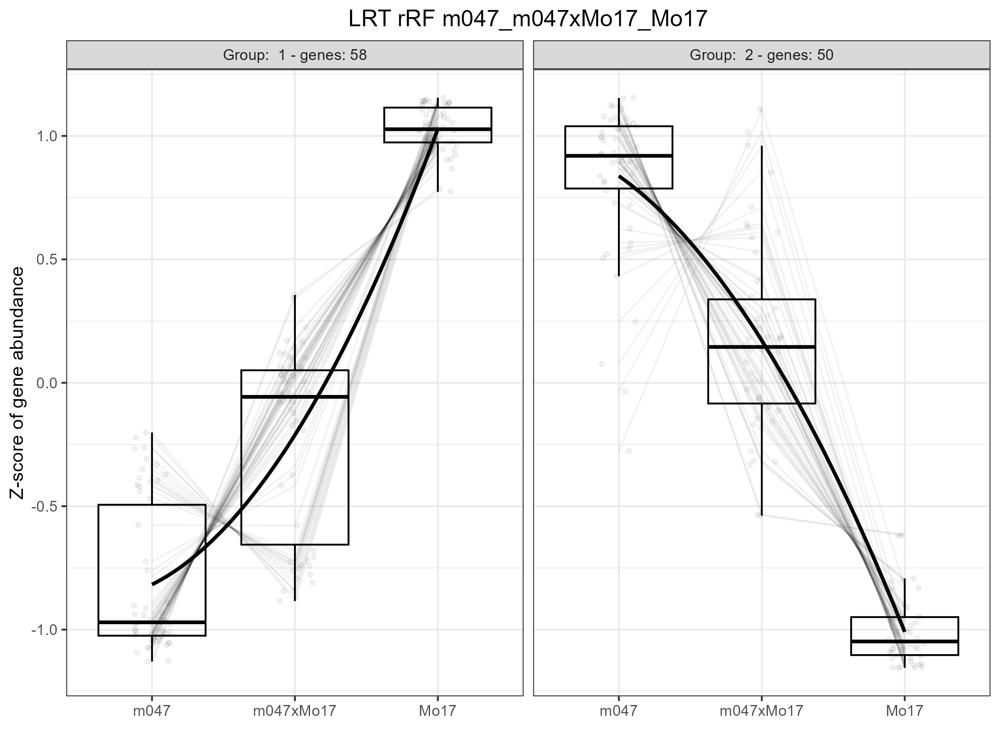

1.  ## rRF analysis

### rRFs mapping to 35S (T active allele)

``` bash
# Get B73 NAM5 genome (chromosome and contigs)
wget https://download.maizegdb.org/Zm-B73-REFERENCE-NAM-5.0/Zm-B73-REFERENCE-NAM-5.0.fa.gz
gunzip Zm-B73-REFERENCE-NAM-5.0.fa.gz

echo -e "chr6\t16802261\t16808035\t35SS\t.\t-" > seq_35S_B73_T_allele.bed

bedtools getfasta -s -fi /mnt/ceph-hdd/projects/scc_uanp_scholten/data/databases/genomes/B73_NAM5/Zm-B73-REFERENCE-NAM-5.0.fa -bed seq_35S_B73_T_allele.bed > seq_35S_B73_T_allele.fa

# Rename sequence rDNA_35S_allele_T
sed -i '1 s/.*/>rDNA_35S_allele_T/' seq_35S_B73_T_allele.fa

bowtie-build -f seq_35S_B73_T_allele.fa seq_35S_B73_T_allele
```

``` bash
cd /mnt/ceph-hdd/workspaces/ws/scc_uanp_scholten/u14929-nor_nil_project/sRNA_data/mapping_35S

# Load needed softwares
module load gcc/14.2.0 bowtie/1.3.1 samtools/1.21

index="/mnt/ceph-hdd/workspaces/ws/scc_uanp_scholten/u14929-nor_nil_project/rnaseq/mapping_35S_T_allele/seq_35S_B73_T_allele"

# Map with 1 mismatch allollwed
bowtie -n 1 -l 40 -S --threads 4 -S -x $index -f ../all_sRNAs_18_40nt.fa | samtools view -F 4 -b | samtools sort -o all_sRNAs_18_40nt_mapped_35S.bam -

# reads processed: 4534719
# reads with at least one alignment: 627548 (13.84%)
# reads that failed to align: 3907171 (86.16%)

# 626362 map to + strand (0), 1186 map to - strand
samtools view all_sRNAs_18_40nt_mapped_35S.bam | cut -f2 | sort | uniq -c
 626362 0
   1186 16

# Retrieve seq in fasta
samtools view all_sRNAs_18_40nt_mapped_35S.bam | cut -f1 > seqID.txt

seqkit grep -n -f seqID.txt ../all_sRNAs_18_40nt.fa > all_sRNAs_18_40nt_35S.fa

# Get seq sRNA and start coordinate
# SAM file are 1-based start coordinate
samtools view all_sRNAs_18_40nt_mapped_35S.bam | cut -f10,4 > all_sRNAs_18_40nt_mapped_35S_start_map.txt
```

``` r
df_RPM_long <- readRDS("data/srnaseq/df_RPM_long_all.Rds")

all_sRNAs_18_40nt_mapped_35S_start_map <- read.delim("data/srnaseq/all_sRNAs_18_40nt_mapped_35S_start_map.txt", header=FALSE)

colnames(all_sRNAs_18_40nt_mapped_35S_start_map) <- c("pos","sequence")

# Now merge dataset
df_35S_mapped <- merge(all_sRNAs_18_40nt_mapped_35S_start_map, df_RPM_long, by="sequence")

# Save Rds
saveRDS(df_35S_mapped, "data/srnaseq/df_35S_mapped_all.Rds")
```

BED 35S

    cat annotations_35S.bed
    35S     0       1811    18S
    35S     2030    2186    5_8S
    35S     2407    5790    25S

Now plot RPM in function of position

``` r
df_35S_mapped <- readRDS("data/srnaseq/df_35S_mapped.Rds")

df1 <- df_35S_mapped %>% group_by(sample, genotype, sequence, pos) %>% summarize(RPM_sum=sum(RPM), .groups='drop')

df2  <- df1 %>% group_by(pos, sequence, genotype) %>% 
  summarize(RPM_mean=sum(RPM_sum)/n(), nb_sequence=n(), sd=sd(RPM_sum), .groups='drop')

df2 <- reorder_samples(df2)

saveRDS(df2, "data/srnaseq/df_35S_mapped_summary.Rds")
```

``` r
# Keep only B73, Mo17, and B73xMo17

df2 <- readRDS("data/srnaseq/df_35S_mapped_summary.Rds")

df2 %>% filter(RPM_mean > 10) %>% filter(genotype %in% c("B73","Mo17","B73xMo17")) %>% 
  ggplot(aes(x = pos, y = RPM_mean)) +
  geom_point(aes(colour=genotype),size = 1.5) +
  annotate("rect", xmin = 0, xmax = 1811, ymin = 0, ymax = 5000, alpha = 0.1) +
  annotate("rect", xmin = 2030, xmax = 2186, ymin = 0, ymax = 5000, alpha = 0.1) +
  annotate("rect", xmin = 2407, xmax = 5790, ymin = 0, ymax = 5000, alpha = 0.1) +
  theme_bw() +
  ylab("RPM") +
  xlab("Position 45S") +
  ggtitle("RPM 45S-mapped sRNAs") +
  theme(axis.text.x = element_text(color = "black"), axis.text.y = element_text(color = "black"), axis.ticks = element_line(color = "black")) +
  theme(plot.title = element_text(hjust = 0.5)) +
  scale_y_continuous(labels = scales::comma_format()) +
  scale_x_continuous(labels = scales::comma_format())
```

``` r
# Keep only B73, Mo17, and B73xMo17

df2 %>% filter(RPM_mean > 10) %>% filter(genotype %in% c("B73","b015","B73xb015")) %>% 
  ggplot(aes(x = pos, y = RPM_mean)) +
  geom_point(aes(colour=genotype),size = 1.5) +
  annotate("rect", xmin = 0, xmax = 1811, ymin = 0, ymax = 5000, alpha = 0.1) +
  annotate("rect", xmin = 2030, xmax = 2186, ymin = 0, ymax = 5000, alpha = 0.1) +
  annotate("rect", xmin = 2407, xmax = 5790, ymin = 0, ymax = 5000, alpha = 0.1) +
  theme_bw() +
  ylab("RPM") +
  xlab("Position 45S") +
  ggtitle("RPM 45S-mapped sRNAs") +
  theme(axis.text.x = element_text(color = "black"), axis.text.y = element_text(color = "black"), axis.ticks = element_line(color = "black")) +
  theme(plot.title = element_text(hjust = 0.5)) +
  scale_y_continuous(labels = scales::comma_format()) +
  scale_x_continuous(labels = scales::comma_format())
```

``` r
# Keep only B73, Mo17, and B73xMo17

df2 %>% filter(RPM_mean > 10) %>% filter(genotype %in% c("B73","b131","b131xB73")) %>% 
  ggplot(aes(x = pos, y = RPM_mean)) +
  geom_point(aes(colour=genotype),size = 1.5) +
  annotate("rect", xmin = 0, xmax = 1811, ymin = 0, ymax = 5000, alpha = 0.1) +
  annotate("rect", xmin = 2030, xmax = 2186, ymin = 0, ymax = 5000, alpha = 0.1) +
  annotate("rect", xmin = 2407, xmax = 5790, ymin = 0, ymax = 5000, alpha = 0.1) +
  theme_bw() +
  ylab("RPM") +
  xlab("Position 45S") +
  ggtitle("RPM 45S-mapped sRNAs") +
  theme(axis.text.x = element_text(color = "black"), axis.text.y = element_text(color = "black"), axis.ticks = element_line(color = "black")) +
  theme(plot.title = element_text(hjust = 0.5)) +
  scale_y_continuous(labels = scales::comma_format()) +
  scale_x_continuous(labels = scales::comma_format())
```

``` r
# Keep only B73, Mo17, and B73xMo17

df2 %>% filter(RPM_mean > 10) %>% filter(genotype %in% c("B73","b172","B73xb172")) %>% 
  ggplot(aes(x = pos, y = RPM_mean)) +
  geom_point(aes(colour=genotype),size = 1.5) +
  annotate("rect", xmin = 0, xmax = 1811, ymin = 0, ymax = 5000, alpha = 0.1) +
  annotate("rect", xmin = 2030, xmax = 2186, ymin = 0, ymax = 5000, alpha = 0.1) +
  annotate("rect", xmin = 2407, xmax = 5790, ymin = 0, ymax = 5000, alpha = 0.1) +
  theme_bw() +
  ylab("RPM") +
  xlab("Position 45S") +
  ggtitle("RPM 45S-mapped sRNAs") +
  theme(axis.text.x = element_text(color = "black"), axis.text.y = element_text(color = "black"), axis.ticks = element_line(color = "black")) +
  theme(plot.title = element_text(hjust = 0.5)) +
  scale_y_continuous(labels = scales::comma_format()) +
  scale_x_continuous(labels = scales::comma_format())
```

``` r
# Keep only B73, Mo17, and B73xMo17

df2 %>% filter(RPM_mean > 10) %>% filter(genotype %in% c("B73","b172","b172xB73")) %>% 
  ggplot(aes(x = pos, y = RPM_mean)) +
  geom_point(aes(colour=genotype),size = 1.5) +
  annotate("rect", xmin = 0, xmax = 1811, ymin = 0, ymax = 5000, alpha = 0.1) +
  annotate("rect", xmin = 2030, xmax = 2186, ymin = 0, ymax = 5000, alpha = 0.1) +
  annotate("rect", xmin = 2407, xmax = 5790, ymin = 0, ymax = 5000, alpha = 0.1) +
  theme_bw() +
  ylab("RPM") +
  xlab("Position 45S") +
  ggtitle("RPM 45S-mapped sRNAs") +
  theme(axis.text.x = element_text(color = "black"), axis.text.y = element_text(color = "black"), axis.ticks = element_line(color = "black")) +
  theme(plot.title = element_text(hjust = 0.5)) +
  scale_y_continuous(labels = scales::comma_format()) +
  scale_x_continuous(labels = scales::comma_format())
```

``` r
# Keep only B73, Mo17, and B73xMo17

df2 %>% filter(RPM_mean > 10) %>% filter(genotype %in% c("Mo17","m047","m047xMo17")) %>% 
  ggplot(aes(x = pos, y = RPM_mean)) +
  geom_point(aes(colour=genotype),size = 1.5) +
  annotate("rect", xmin = 0, xmax = 1811, ymin = 0, ymax = 5000, alpha = 0.1) +
  annotate("rect", xmin = 2030, xmax = 2186, ymin = 0, ymax = 5000, alpha = 0.1) +
  annotate("rect", xmin = 2407, xmax = 5790, ymin = 0, ymax = 5000, alpha = 0.1) +
  theme_bw() +
  ylab("RPM") +
  xlab("Position 45S") +
  ggtitle("RPM 45S-mapped sRNAs") +
  theme(axis.text.x = element_text(color = "black"), axis.text.y = element_text(color = "black"), axis.ticks = element_line(color = "black")) +
  theme(plot.title = element_text(hjust = 0.5)) +
  scale_y_continuous(labels = scales::comma_format()) +
  scale_x_continuous(labels = scales::comma_format())
```

### 35S-mapped rRFs RPM

``` r
df1 <- df_35S_mapped %>% filter(sample!="b131xB73_rep1") %>% group_by(sample, genotype) %>% summarize(RPM_sum=sum(RPM), .groups='drop')

df2 <- reorder_samples(df1)

df2 %>%  ggplot(aes(x = genotype, y = RPM_sum)) +
  stat_summary(
    fun = mean,
    geom = "col",
    fill="#33a02c",
    width = 0.7
  ) +
  stat_summary(
    fun.data = mean_sdl,
    fun.args = list(mult = 1),
    geom = "errorbar",
    width = 0.15
  ) +
  geom_jitter(
    width = 0.08,
    size = 2
  ) +
    theme_bw() +
    theme(plot.title = element_text(hjust = 0.5)) +
    ylab("Reads per million") +
    xlab("Genotype") +
    theme(axis.text.x = element_text(angle = 40, hjust = 1)) +  theme(axis.text.x = element_text(color="black"), 
        axis.text.y = element_text(color="black"),
        axis.ticks = element_line(color = "black")) + 
        theme(plot.title = element_text(hjust = 0.5)) + 
        scale_y_continuous(labels = scales::comma_format())
```

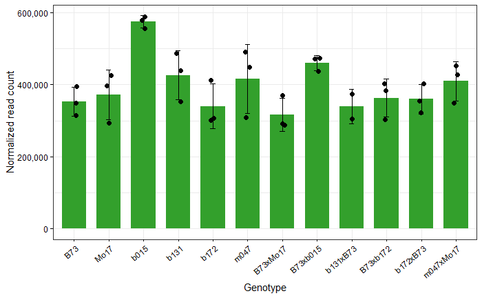

#### Statistics

Compare expression in each cross with mid-parent value

##### B73xMo17

``` r
data_sub <- df2 %>% filter(genotype %in% c("B73","Mo17","B73xMo17"))
data_sub_2 <- merge.data.frame(data_sub, coldata, by="sample")

# Test homoscedasticity
bartlett.test(RPM_sum~NOR, data=data_sub_2)

# Compare means
with(data_sub_2, t.test(RPM_sum[NOR=="heterozygous"], RPM_sum[NOR=="homozygous"], var.equal=TRUE))
```

        Bartlett test of homogeneity of variances

    data:  RPM_sum by NOR
    Bartlett's K-squared = 0.03315, df = 1, p-value = 0.8555


        Two Sample t-test

    data:  RPM_sum[NOR == "heterozygous"] and RPM_sum[NOR == "homozygous"]
    t = -1.3106, df = 7, p-value = 0.2313
    alternative hypothesis: true difference in means is not equal to 0
    95 percent confidence interval:
     -130802.04   37511.72
    sample estimates:
    mean of x mean of y 
     316230.1  362875.3 

##### b015xB73

``` r
data_sub <- df2 %>% filter(genotype %in% c("B73","b015","B73xb015"))
data_sub_2 <- merge.data.frame(data_sub, coldata, by="sample")

# Test homoscedasticity
bartlett.test(RPM_sum~NOR, data=data_sub_2)

# Compare means
with(data_sub_2, t.test(RPM_sum[NOR=="heterozygous"], RPM_sum[NOR=="homozygous"], var.equal=FALSE))
```

        Bartlett test of homogeneity of variances

    data:  RPM_sum by NOR
    Bartlett's K-squared = 4.1319, df = 1, p-value = 0.04208


        Welch Two Sample t-test

    data:  RPM_sum[NOR == "heterozygous"] and RPM_sum[NOR == "homozygous"]
    t = -0.074823, df = 5.5257, p-value = 0.943
    alternative hypothesis: true difference in means is not equal to 0
    95 percent confidence interval:
     -134260.0  126453.2
    sample estimates:
    mean of x mean of y 
     460221.9  464125.3 

##### b131xB73

``` r
data_sub <- df2 %>% filter(genotype %in% c("B73","b131","b131xB73"))
data_sub_2 <- merge.data.frame(data_sub, coldata, by="sample")

# Test homoscedasticity
bartlett.test(RPM_sum~NOR, data=data_sub_2)

# Compare means
with(data_sub_2, t.test(RPM_sum[NOR=="heterozygous"], RPM_sum[NOR=="homozygous"], var.equal=TRUE))
```

        Bartlett test of homogeneity of variances

    data:  RPM_sum by NOR
    Bartlett's K-squared = 0.087771, df = 1, p-value = 0.767


        Two Sample t-test

    data:  RPM_sum[NOR == "heterozygous"] and RPM_sum[NOR == "homozygous"]
    t = -1.0074, df = 6, p-value = 0.3526
    alternative hypothesis: true difference in means is not equal to 0
    95 percent confidence interval:
     -173305.89   72221.05
    sample estimates:
    mean of x mean of y 
     339109.3  389651.7 

##### B73xb172

``` r
data_sub <- df2 %>% filter(genotype %in% c("B73","b172","B73xb172"))
data_sub_2 <- merge.data.frame(data_sub, coldata, by="sample")

# Test homoscedasticity
bartlett.test(RPM_sum~NOR, data=data_sub_2)

# Compare means
with(data_sub_2, t.test(RPM_sum[NOR=="heterozygous"], RPM_sum[NOR=="homozygous"], var.equal=TRUE))
```

        Bartlett test of homogeneity of variances

    data:  RPM_sum by NOR
    Bartlett's K-squared = 0.028729, df = 1, p-value = 0.8654


        Two Sample t-test

    data:  RPM_sum[NOR == "heterozygous"] and RPM_sum[NOR == "homozygous"]
    t = 0.46889, df = 7, p-value = 0.6534
    alternative hypothesis: true difference in means is not equal to 0
    95 percent confidence interval:
     -66170.73  98904.12
    sample estimates:
    mean of x mean of y 
     363168.3  346801.6 

##### b172xB73

``` r
data_sub <- df2 %>% filter(genotype %in% c("B73","b172","b172xB73"))
data_sub_2 <- merge.data.frame(data_sub, coldata, by="sample")

# Test homoscedasticity
bartlett.test(RPM_sum~NOR, data=data_sub_2)

# Compare means
with(data_sub_2, t.test(RPM_sum[NOR=="heterozygous"], RPM_sum[NOR=="homozygous"], var.equal=TRUE))
```

        Bartlett test of homogeneity of variances

    data:  RPM_sum by NOR
    Bartlett's K-squared = 0.057463, df = 1, p-value = 0.8106


        Two Sample t-test

    data:  RPM_sum[NOR == "heterozygous"] and RPM_sum[NOR == "homozygous"]
    t = 0.39678, df = 7, p-value = 0.7033
    alternative hypothesis: true difference in means is not equal to 0
    95 percent confidence interval:
     -63820.31  89556.80
    sample estimates:
    mean of x mean of y 
     359669.9  346801.6 

##### m047xMo17

``` r
data_sub <- df2 %>% filter(genotype %in% c("Mo17","m047","m047xMo17"))
data_sub_2 <- merge.data.frame(data_sub, coldata, by="sample")

# Test homoscedasticity
bartlett.test(RPM_sum~NOR, data=data_sub_2)

# Compare means
with(data_sub_2, t.test(RPM_sum[NOR=="heterozygous"], RPM_sum[NOR=="homozygous"], var.equal=TRUE))
```

        Bartlett test of homogeneity of variances

    data:  RPM_sum by NOR
    Bartlett's K-squared = 0.27903, df = 1, p-value = 0.5973


        Two Sample t-test

    data:  RPM_sum[NOR == "heterozygous"] and RPM_sum[NOR == "homozygous"]
    t = 0.30293, df = 7, p-value = 0.7708
    alternative hypothesis: true difference in means is not equal to 0
    95 percent confidence interval:
     -105753.6  136830.4
    sample estimates:
    mean of x mean of y 
     409928.7  394390.3 

``` r
df1 <- df_35S_mapped %>% group_by(sample, genotype, size) %>% summarize(RPM_sum=sum(RPM), .groups='drop')

df2  <- df1 %>% group_by(genotype, size) %>% 
  summarize(RPM_mean=sum(RPM_sum)/n(), sd=sd(RPM_sum), .groups='drop')

col <- c("#8c2d04","#fec44f", "#7fcdbb","#41b6c4","#1d91c0","#225ea8","#0c2c84")

df2 <- reorder_samples(df2)

ggplot(df2, aes(x = size, y = RPM_mean, fill = genotype)) +
  geom_bar(stat = "identity", position=position_dodge()) +
  geom_errorbar(aes(ymin = RPM_mean - sd, ymax = RPM_mean + sd),
    width = .5,
    position = position_dodge(.9)
  ) +
  theme_bw() +
  ggtitle("45S-mapped sRNA RPM") +
  ylab("RPM") +
  xlab("Size in nt") +
  theme(axis.text.x = element_text(color = "black"), 
        axis.text.y = element_text(color = "black"), 
        axis.ticks = element_line(color = "black")) + 
  theme(plot.title = element_text(hjust = 0.5)) + 
  scale_y_continuous(labels = scales::comma_format())
```


1.  # miRNA analysis

Check expression of annotated miRNAs in the datasets.

``` bash
# Download list of mature miRNAs
wget https://www.mirbase.org/download/mature.fa

# Subset only miRNAs annotated in maize
seqkit grep -n -r -p '"Zea mays"' mature.fa > mature_zma.fa

# Replace U by T
cut -d' ' -f1 mature_zma.fa | sed 's/U/T/g' > mature_zma_U_to_T.fa

# Check number of sequences
grep -v ">" mature_zma_U_to_T.fa | sort | wc -l
325

# Unique sequences
grep -v ">" mature_zma_U_to_T.fa | sort | uniq | wc -l
207
```

### Expression levels

``` r
df_RPM_long <- readRDS("data/srnaseq/df_RPM_long.Rds")

df_miRNA <- fasta_to_df("data/annotations/mature_zma_U_to_T.fa")

df_miRNA$size <- nchar(df_miRNA$sequence)

df_miRNA$miR_family <- sub(".*(miR[0-9]+)[a-z]?.*", "\\1", df_miRNA$id)

# Keep only one entry by sequence
df_miRNA_RPM_annotated <- merge(df_RPM_long, df_miRNA, by="sequence")

df_miRNA_RPM_annotated$miR_family <- sub(".*(miR[0-9]+)[a-z]?.*", "\\1", df_miRNA_RPM_annotated$id)

df_miRNA_RPM_annotated_dup_removed <- df_miRNA_RPM_annotated %>% dplyr::select(sequence, RPM, sample, genotype, miR_family) %>% unique()

df_miRNA_unique <- df_miRNA_RPM_annotated_dup_removed %>% select(sequence) %>% unique() %>% droplevels()

make_fasta(vector_sequence = as.vector(df_miRNA_unique$sequence), path_output = "data/annotations/miRNA.fa")

df1 <- df_miRNA_RPM_annotated_dup_removed %>% group_by(miR_family, sample, genotype) %>% summarize(RPM_sum=sum(RPM), .groups='drop')

df2  <- df1 %>% group_by(miR_family, genotype) %>% 
  summarize(RPM_mean=sum(RPM_sum)/n(), nb_sequence=n(), sd=sd(RPM_sum), .groups='drop')

# Create family by splitting miRNA name
df_miRNA_RPM_annotated_high <- df_miRNA_RPM_annotated %>% filter(RPM>150)


df2$genotype <- factor(df2$genotype, levels = c("B73", "Mo17", "b015", "b131", "b172", "m047", "B73xMo17", "B73xb015", "b131xB73", "B73xb172", "b172xB73", "m047xMo17"), ordered = T)

# Keep famililes with miRNA with RPM > 50
list_family_to_keep <- unlist(as.vector(df2 %>% filter(RPM_mean > 50) %>% select(miR_family) %>% unique()))

df2 %>% filter(miR_family %in% list_family_to_keep) %>% 
ggplot(aes(x = genotype, y = RPM_mean, fill = miR_family)) +
  geom_bar(stat = "identity", position=position_dodge()) +
  geom_errorbar(aes(ymin = RPM_mean - sd, ymax = RPM_mean + sd),
    width = .5,
    position = position_dodge(.9)) + 
  theme_bw() +
  ylab("RPM") +
  ggtitle("miRNA abundance") + 
   theme(axis.text.x = element_text(color = "black"), 
        axis.text.y = element_text(color = "black"), 
        axis.ticks = element_line(color = "black")) + 
  theme(plot.title = element_text(hjust = 0.5)) + 
  scale_y_continuous(labels = scales::comma_format()) +
  theme(axis.text.x = element_text(angle=40, hjust=1))
```

### DEG analysis

``` r
cts <- readRDS("data/srnaseq/cts.Rds")

# Upload the coldata file
coldata <- read.table("data/srnaseq/coldata.txt", header=T)

# Convert the variables into factors
col_names <- names(coldata)
coldata[,col_names] <- lapply(coldata[,col_names] , factor)

### Check that sample names match in both files
all(colnames(cts) == coldata$sample)

coldata_sub <- coldata %>% filter(lane!="lane1") %>% filter(sample!="b131xB73_rep1") %>% droplevels()
idx <- colnames(cts) %in% coldata_sub$sample
cts_sub <- cts[,idx]

all(colnames(cts_sub) == coldata_sub$sample)

coldata <- coldata_sub
cts <- cts_sub

# Filter to retrieve only miRNAs
df_miRNA <- fasta_to_df("data/annotations/mature_zma_U_to_T.fa")

idx <- rownames(cts) %in% df_miRNA$sequence

cts_sub <- cts[idx,]

dds <- DESeqDataSetFromMatrix(countData = cts_sub,
                              colData = coldata,
                              design= ~ NOR)

# Perform differential expression analysis
dds <- DESeq(dds)

# Create a DESeqResults object
res <- results(dds, contrast = c("NOR","heterozygous","homozygous"))

summary(res)

DEG <- as.data.frame(res) %>% rownames_to_column("geneID")

sigDEG <- as.data.frame(res) %>% rownames_to_column("geneID") %>% filter(padj < 0.05)
```

``` r
dds <- DESeq(dds)

mat <- counts(dds, normalized=T)

# How many genes are not expressed at all
sum(rowSums(mat)==0)
# 12

# Keep only genes with som expression (otherwise, scaling will results in NaN)
mat_cleaned <- mat[rowSums(mat) != 0,]

# Transpose and z-scaled
mat.z <- t(apply(mat_cleaned, 1, scale))
colnames(mat.z) <- coldata$sample

Heatmap(mat.z, cluster_rows = T, cluster_columns = T, 
        column_labels = colnames(mat.z), name = "Z-score")
```

1.  # 

    # A/T allele-specific expression analysis

    # 

Gather summaries from the RNA-seq and sRNA-seq data and plot % of T for
each sample.

``` r
df_AT_expression <- read.delim("data/AT_allele_specific_expression.txt")
df_AT_expression <- df_AT_expression %>% mutate_at(c(1,2,3), as_factor)
df_AT_expression <- df_AT_expression %>% mutate_at(4:8, as.numeric)

# Order genotype
df_AT_expression$genotype <- factor(df_AT_expression$genotype, levels = c("B73", "Mo17", "b015", "b131", "b172", "m047", "B73xMo17", "B73xb015", "b131xB73", "B73xb172", "b172xB73", "m047xMo17"), ordered = T)


df_AT_expression$genotype <- factor(df_AT_expression$genotype, levels = c("B73", "m047", "Mo17", "b015", "b131", "b172",  "B73xMo17", "m047xMo17", "B73xb015", "b131xB73", "B73xb172", "b172xB73"), ordered = T)

col <- c("#1f78b4","#33a02c")


df_AT_expression %>% ggplot(aes(x = genotype, y = fraction_T, fill = data)) +
  stat_summary(fun.y = mean, geom = "bar", position = "dodge") +
  stat_summary(fun.data = mean_se, geom = "errorbar", position = "dodge") +
  geom_point(aes(x = genotype), shape = 19, position = position_jitterdodge()) +
  scale_y_continuous(labels = scales::percent) +
  scale_fill_manual(values=col) +
  theme_light() +
  ylab("T/A allele expression ratio") +
  ggtitle("Allele T/A expression ratio") +
  theme(
    axis.text.x = element_text(color = "black"),
    axis.text.y = element_text(color = "black"),
    axis.ticks = element_line(color = "black")
  ) +
  theme(plot.title = element_text(hjust = 0.5)) +
  theme(axis.text.x = element_text(angle = 45, hjust = 1)) 
```

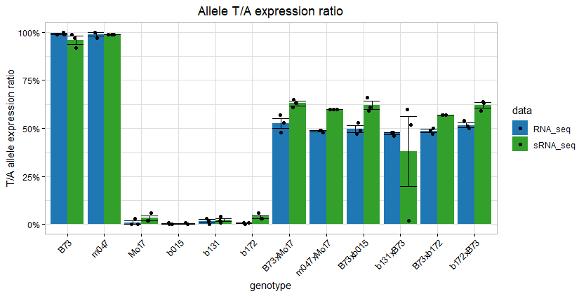

Remove b131xB73_rep1 that seems to be the wrong sample (probably b131
was used twice to make the sRNA-seq library b131xB73_rep1).

``` r
col <- c("#1f78b4","#33a02c")

df_AT_expression %>% filter(sample!="b131xB73_rep1") %>% ggplot(aes(x = genotype, y = fraction_T, fill = data)) +
  stat_summary(fun.y = mean, geom = "bar", position = "dodge") +
  stat_summary(fun.data = mean_se, geom = "errorbar", position = "dodge") +
  geom_point(aes(x = genotype), shape = 19, position = position_jitterdodge()) +
  scale_y_continuous(labels = scales::percent) +
  scale_fill_manual(values=col) +
  theme_light() +
  ylab("T/A allele expression ratio") +
  ggtitle("Allele T/A expression ratio") +
  theme(
    axis.text.x = element_text(color = "black"),
    axis.text.y = element_text(color = "black"),
    axis.ticks = element_line(color = "black")
  ) +
  theme(plot.title = element_text(hjust = 0.5)) +
  theme(axis.text.x = element_text(angle = 45, hjust = 1)) 
```

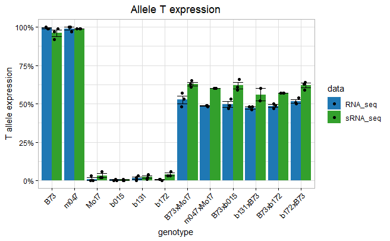 Now the values across
biological replicates are consistant for each genotype.

1.  

# 

# Degradome analysis

# 

# Data

Degradome library was made according to [Li et al.,
2018](https://doi.org/10.1186/s13007-019-0524-7).

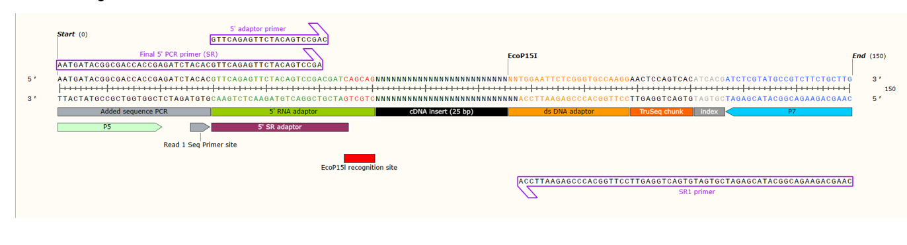

Rename files and move them to workspace

``` bash

# Create a workspace to store data
cd /mnt/ceph-hdd/workspaces/ws/scc_uanp_scholten/u14929-nor_nil_project/degradome_data/

while read i; do 
find /mnt/ceph-hdd/projects/scc_uanp_scholten/data/ngs_data/BGI_data/F22FTSEUHT1495_LIBogelR_degradome_NOR_NIL_pollen -type f -name $i -exec cp {} . \;
done < file_to_find

# Rename file for consistent names
while read i; do
$i
done < rename.txt

\ls -1 *gz
B73.fq.gz
B73xMo17.fq.gz
Mo17.fq.gz
b131.fq.gz
b131xB73.fq.gz
```

## Fastqc raw reads

``` bash

#!/bin/bash
#
#SBATCH --job-name=fastqc
#SBATCH --nodes=1
#SBATCH --cpus-per-task=8
#SBATCH --mem=10000
#SBATCH --output=log/fastqc.%A.%a.out
#SBATCH --error=log/fastqc.%A.%a.err
#SBATCH --partition=scc-cpu
#SBATCH --time=04:00:00
#SBATCH --mail-type=END
#SBATCH --mail-user=johan.zicola@uni-goettingen.de
#SBATCH --array=1-5

module load miniforge3

source activate bioinfo

input_path=$(find . -type f -name "*.fq.gz" | sed -n ${SLURM_ARRAY_TASK_ID}p)

fastqc $input_path -o fastqc_reports -t 8
```

``` bash

source activate bioinfo

multiqc .
```

## Trimming

Remove the 5’ sequence matching the EcoP15I recognition site, then the
3’ sequence containing the 3’ adaptor sequence, then remove all trimmed
sequences that are not 27-nt in length (expected length of the cutting
site of EcoP15I downstream of the recognition site).

``` bash
#!/bin/bash
#
#SBATCH --job-name=trimming_cutadapt
#SBATCH --nodes=1
#SBATCH --ntasks=6
#SBATCH --mem=16000
#SBATCH --output=log/slurm.%A.%a.out
#SBATCH --error=log/slurm.%A.%a.err
#SBATCH --partition=medium
#SBATCH --time=01:00:00
#SBATCH --array=1-5

module load apptainer/1.3.4

app_shortcut="apptainer run --bind /mnt/ceph-hdd/workspaces/ws/scc_uanp_scholten/u14929-nor_nil_project/degradome_data /sw/container/bioinformatics/cutadapt-5.0.sif"

input_path=$(find raw_fastq -type f -name "*.fq.gz" | sed -n ${SLURM_ARRAY_TASK_ID}p)
input_file=$(basename $input_path)
name_fastq=$(echo "$input_file" | cut -d_ -f1-3)

echo "Processing file $input_path"

if [ -e "trimmed_fastq/${name_fastq}.trimmed.fq.gz" ]; then
  echo "$trimmed_fastq/${name_fastq}.trimmed.fq.gz already exists, skip $input_path"
else
  $app_shortcut cutadapt -j 0 -g AGCAG --discard-untrimmed $input_path | \
  $app_shortcut cutadapt -j 0 -a AGATCGGAAGAGCACAC --discard-untrimmed - | \
  $app_shortcut cutadapt -j 0 -m 27 -M 27 -o trimmed_fastq/${name_fastq}.trimmed.fq.gz -
fi
```

``` bash
sbatch run_trimming.sh
```

## Fastqc trimmed reads

``` bash

#!/bin/bash
#
#SBATCH --job-name=fastqc
#SBATCH --nodes=1
#SBATCH --cpus-per-task=8
#SBATCH --mem=10000
#SBATCH --output=log/fastqc.%A.%a.out
#SBATCH --error=log/fastqc.%A.%a.err
#SBATCH --partition=scc-cpu
#SBATCH --time=04:00:00
#SBATCH --mail-type=END
#SBATCH --mail-user=johan.zicola@uni-goettingen.de
#SBATCH --array=1-5

module load miniforge3

source activate bioinfo

input_path=$(find . -type f -name "*.fq.gz" | sed -n ${SLURM_ARRAY_TASK_ID}p)

fastqc $input_path -o fastqc_reports -t 8
```

``` bash

source activate bioinfo

multiqc .
```

Report [here](data/degradome/fastqc/multiqc_report_trimmed.html)

``` bash

seqkit stats *gz
file                               format  type    num_seqs        sum_len  min_len  avg_len  max_len
B73_L1_1.fq.gz.trimmed.fq.gz       FASTQ   DNA   39,489,827  1,066,225,329       27       27       27
B73xMo17_L1_1.fq.gz.trimmed.fq.gz  FASTQ   DNA   34,685,260    936,502,020       27       27       27
Mo17_L1_1.fq.gz.trimmed.fq.gz      FASTQ   DNA   26,412,468    713,136,636       27       27       27
b131_L1_1.fq.gz.trimmed.fq.gz      FASTQ   DNA   34,601,558    934,242,066       27       27       27
b131xB73_L1_1.fq.gz.trimmed.fq.gz  FASTQ   DNA   23,530,070    635,311,890       27       27       27
```

I retrieved here between 47%-57% reads (23-39M reads):

| name     | raw        | filtered   | % left |
|----------|------------|------------|--------|
| b131     | 60,947,206 | 34,601,558 | 57%    |
| b131xB73 | 50,033,986 | 23,530,070 | 47%    |
| B73      | 69,981,483 | 39,489,827 | 56%    |
| B73xMo17 | 64,517,900 | 34,685,260 | 54%    |
| Mo17     | 46,577,577 | 26,412,468 | 57%    |

## Mapping

``` bash

mkdir -p mapped/fasta/collapsed/formated

#!/bin/bash
#SBATCH --job-name=bowtie2
#SBATCH --output=slurm/job-%x-%j.out
#SBATCH --error=slurm/job-%x-%j.err
#SBATCH --cpus-per-task=8
#SBATCH --mem=12G
#SBATCH --time=00:40:00
#SBATCH --partition=medium
#SBATCH --mail-type=END
#SBATCH --mail-user=johan.zicola@uni-goettingen.de
#SBATCH --array=1-5

module load gcc/14.2.0 samtools/1.21 bowtie/1.3.1

index="/mnt/ceph-hdd/projects/scc_uanp_scholten/data/databases/genomes/B73_NAM5/bowtie_index/index_Zm_B73_NAM5"

fastq_file=$(sed -n ${SLURM_ARRAY_TASK_ID}p list_files.txt)

bowtie -S -l 37 -n 1 -x $index --threads 8 -q $fastq_file | \
  samtools sort | samtools view -F 4 -b -o mapped/${fastq_file%%.*}.bam -

# Convert to fasta
samtools fasta -F 4 mapped/${fastq_file%%.*}.bam > mapped/fasta/${fastq_file%%.*}.fa
```

## Format data

``` bash

cd /mnt/ceph-hdd/workspaces/ws/scc_uanp_scholten/u14929-nor_nil_project/degradome_data/trimmed_fastq/mapped/fasta

# Collapse fasta files
for i in *fa; do
  srun -p medium --time=00:20:00 ~/bin/fastx_toolkit/fastx_collapser -i $i -o collapsed/${i%%.*}.fa &
done

seqkit stats *fa
processed files:  5 / 5 [======================================] ETA: 0s. done
file         format  type   num_seqs      sum_len  min_len  avg_len  max_len
B73.fa       FASTA   DNA   8,764,233  236,634,291       27       27       27
B73xMo17.fa  FASTA   DNA   7,519,844  203,035,788       27       27       27
Mo17.fa      FASTA   DNA   6,202,922  167,478,894       27       27       27
b131.fa      FASTA   DNA   8,090,611  218,446,497       27       27       27
b131xB73.fa  FASTA   DNA   6,526,856  176,225,112       27       27       27


# Format and sort data by sequence name
for i in *.fa; do
  prefix=$(basename ${i%%.*})
  awk -v RS='\n>' -v ORS='\n>' -v OFS='' -F'\n' '{$1=$1 "\t"}1' $i | \
          awk 'BEGIN {FS = "-"}{print $2}' | awk '{print $2"\t"$1}' | \
          sed '$ d' | sort -k1,1  > formated/${prefix}.txt
done
```

## Merge data

``` bash
# Convert underscore in hyphens so the suffix stay in the header
rename "_" "-" *txt

# specific the absolute path (. for current directory creates a bug). 
# Don't forget the final slash

# Load java
module load openjdk/17.0.11_9

directory="/mnt/ceph-hdd/workspaces/ws/scc_uanp_scholten/u14929-nor_nil_project/degradome_data/trimmed_fastq/mapped/fasta/collapsed/formated/"

java -jar /mnt/ceph-hdd/workspaces/ws/scc_uanp_scholten/u14929-nor_nil_project/sRNA_data/scripts/GenerateDatasetJoinShellScript/dist/GenerateDatasetJoinShellScript.jar \
    -fileEnding txt -directory $directory

# Remove txt suffix that are added in header of the file
sed -i 's/\.txt//g' header.csv

srun -p medium --time=01:00:00 bash merge_datasets.sh &

# I need to remove the name of the first column (sequence)
sed -i 's/sequence//' header.csv

# Put back underscores in header
sed -i 's/-/_/g' header.csv


wc -l merged_dataset.csv
22547584 merged_dataset.csv
# 22.5M sequences

# Add header
cat header.csv merged_dataset.csv > cts_with_header.txt

unix2dos cts_with_header.txt

cut -d' ' -f1 merged_dataset.csv > sequences_degradome.txt
```

## PCA expression

``` r
# Import the cts matrix (not gene name is now the row name => required)
cts <- read.table("data/degradome/cts_with_header.txt", header=TRUE, row.names=1, check.names = FALSE)

# Create a more compact R object
saveRDS(cts,"data/degradome/cts.Rds")
```

``` r
cts <- readRDS("data/degradome/cts.Rds")

# Upload the coldata file
coldata <- data.frame(
  sample = c("B73", "B73xMo17", "Mo17", "b131", "b131xB73"),
  NOR = c("homozygous", "heterozygous", "homozygous", "homozygous", "heterozygous")
, stringsAsFactors = FALSE)

# Convert the variables into factors
coldata[,names(coldata)] <- lapply(coldata[,names(coldata)] , factor)

### Check that sample names match in both files
all(colnames(cts) == coldata$sample)
```

``` r
# Create a DESeqDataSet object
dds <- DESeqDataSetFromMatrix(countData = cts,
                              colData = coldata,
                              design= ~NOR)

# Variance stabilizing transformation
vsd <- vst(dds, blind=TRUE)

# Create PCA
pcaData <- plotPCA(vsd, intgroup=c("sample", "NOR"), returnData=TRUE)

# Get percentage variation
percentVar <- round(100 * attr(pcaData, "percentVar"))

col <- c("#1b9e77","#d95f02")

ggplot(pcaData, aes(PC1, PC2, color = NOR, label = sample)) +
  xlab(paste0("PC1: ", percentVar[1], "% variance")) +
  ylab(paste0("PC2: ", percentVar[2], "% variance")) +
  ggtitle("PCA degradome") +
  theme_bw() +
  scale_color_manual(values=col) + 
  geom_text(size = 4) +
  theme(
    axis.text.x = element_text(color = "black"),
    axis.text.y = element_text(color = "black"),
    axis.ticks = element_line(color = "black")
  ) +
  theme(plot.title = element_text(hjust = 0.5)) +
  scale_y_continuous(labels = scales::comma_format())
```

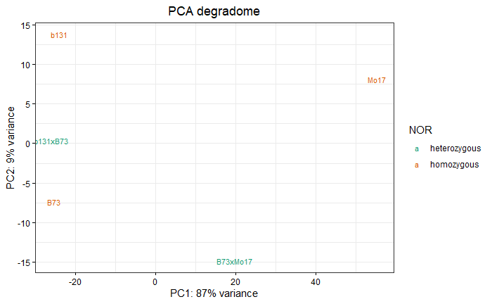 B73 and B73 NOR NILs cluster on one side,
Mo17 on the other and the canonical F1 in the middle. The patterns is
close to sRNA or RNA-seq PCAs and suggest that the samples are correct.

## Cleaveland analysis

### Installation

Clone Cleaveland repository from
<https://github.com/MikeAxtell/CleaveLand4> and install dependencies
(see Cleaveland documentation).

Install Cleaveland

``` bash
git clone  https://github.com/MikeAxtell/CleaveLand4
```

Install RNA-Vienna (2.7.1) <https://www.tbi.univie.ac.at/RNA/>

``` bash
wget https://www.tbi.univie.ac.at/RNA/download/sourcecode/2_7_x/ViennaRNA-2.7.1.tar.gz

tar -zxvf ViennaRNA-2.7.1.tar.gz
cd ViennaRNA-2.7.1
./configure --prefix=~/bin/ViennaRNA/bin
make install

# Test
RNAplex --version
RNAplex 2.7.1
```

Install Math::CDF perl module. This one was a pain to install on the
HPC. What is important is to use the same version of perl to install the
module and to run it and install it locally (`--local-lib=~/perl5`).

``` bash
# v5.40.0 => glogin11 and 12
module load perl/5.40.0-syohai7

# Install module with cpan minus
cpanm --local-lib=~/perl5 Math::CDF

# To uninstall the module
# cpanm --local-lib=~/perl5 --uninstall Module::Name

# Check installation
perl -mMath::CDF -e 'print "Success! Version: $Math::CDF::VERSION\n"'
# Success! Version: 0.1

# Add path in .bashrc
echo 'export PERL5LIB="$HOME/perl5/lib/perl5:$PERL5LIB"' >> ~/.bashrc
echo 'export PATH="$HOME/perl5/bin:$PATH"' >> ~/.bashrc
```

### Generate degradome density files

Convert fastq files into fasta files

``` bash

## Generate degradome density files
for i in *fq.gz; do
  seqkit fq2fa $i -o ${i%%.*}.trimmed.fa
done
```

Normal run to build of the degradome \_dd files using 2 miRNAs sequences
(doesn’t matter what sequences but cleaveland need the -u argument).

Get cDNA sequences of B73 NAM5

``` bash
# Get cDNA sequences
wget https://download.maizegdb.org/Zm-B73-REFERENCE-NAM-5.0/Zm-B73-REFERENCE-NAM-5.0_Zm00001eb.1.cdna.fa.gz
gunzip Zm-B73-REFERENCE-NAM-5.0_Zm00001eb.1.cdna.fa.gz
```

``` bash
# Generate miR168a_sRNA.fa
cat miR168a_sRNA.fa
>zma-miR168a-5p
AGAAUCUUGAUGAUGCUGCA
>zma-miR168a-3p
CCCGCCUUGCACCAAGUGAA
```

Run only one file first to generate the bowtie index. Run took 27 min.

``` bash
#!/bin/bash
#
#SBATCH --job-name=Cleaveland
#SBATCH --mem=10G
#SBATCH --time=01:00:00
#SBATCH --partition=scc-cpu
#SBATCH --output=slurm/job-%x-%j.out # will be saved as job-{name}-{jobid}.out
#SBATCH --error=slurm/job-%x-%j.err # will be saved as job-{name}-{jobid}.err
#SBATCH --mail-type=END
#SBATCH --mail-user=johan.zicola@uni-goettingen.de

module load gcc/14.2.0 openmpi/5.0.6 bowtie samtools perl/5.40.0 r/4.5.2

export PATH="$HOME/bin/CleaveLand4/GSTAr_v1-0:$PATH"

# Modify shebang to "#!/usr/bin/env perl" in CleaveLand4_v1.pl
perl ~/bin/CleaveLand4/CleaveLand4_v1.pl -e B73.trimmed.fa -u miR168a_sRNA.fa \
  -n Zm-B73-REFERENCE-NAM-5.0_Zm00001eb.1.cdna.fa \
  -o cleaveland_output/degradome_plots_miR166a_B73 -t > cleaveland_output/results_miR166a_B73.txt
```

Then process the other fasta files, one at a time due to overlapping
temporary bam files

``` bash
\ls -1 *.trimmed.fa | grep -w -v "B73.trimmed.fa" > list_fasta.txt
```

``` bash

#!/bin/bash
#
#SBATCH --job-name=Cleaveland
#SBATCH --mem=10G
#SBATCH --time=06:00:00
#SBATCH --partition=scc-cpu
#SBATCH --output=slurm/job-%x-%j.out # will be saved as job-{name}-{jobid}.out
#SBATCH --error=slurm/job-%x-%j.err # will be saved as job-{name}-{jobid}.err
#SBATCH --mail-type=END
#SBATCH --mail-user=johan.zicola@uni-goettingen.de

module load gcc/14.2.0 openmpi/5.0.6 bowtie samtools perl/5.40.0 r/4.5.2

export PATH="$HOME/bin/CleaveLand4/GSTAr_v1-0:$PATH"

while read fasta_file; do
perl ~/bin/CleaveLand4/CleaveLand4_v1.pl -e $fasta_file -u miR168a_sRNA.fa \
  -n Zm-B73-REFERENCE-NAM-5.0_Zm00001eb.1.cdna.fa \
  -o cleaveland_output/degradome_plots_miR166a_${fasta_file%%.*} -t > cleaveland_output/results_miR166a_${fasta_file%%.*}.txt
done < list_fasta.txt
```

#### Summary density files

    head -n 12 *_dd.txt
    ==> B73.trimmed.fa_dd.txt <==
    # CleaveLand4 degradome density
    # Thu Sep 24 11:55:55 CEST 2026
    # Degradome Reads:B73.trimmed.fa
    # Transcriptome:Zm-B73-REFERENCE-NAM-5.0_Zm00001eb.1.cdna.fa
    # TranscriptomeCharacters:131706600
    # Mean Degradome Read Size:27
    # Estimated effective Transcriptome Size:129748047
    # Category 0:38314
    # Category 1:40967
    # Category 2:2164938
    # Category 3:1304484
    # Category 4:4570551

    ==> B73xMo17.trimmed.fa_dd.txt <==
    # CleaveLand4 degradome density
    # Thu Sep 24 13:27:48 CEST 2026
    # Degradome Reads:B73xMo17.trimmed.fa
    # Transcriptome:Zm-B73-REFERENCE-NAM-5.0_Zm00001eb.1.cdna.fa
    # TranscriptomeCharacters:131706600
    # Mean Degradome Read Size:27
    # Estimated effective Transcriptome Size:129748047
    # Category 0:37731
    # Category 1:44325
    # Category 2:1928714
    # Category 3:1114587
    # Category 4:4110400

    ==> Mo17.trimmed.fa_dd.txt <==
    # CleaveLand4 degradome density
    # Thu Sep 24 13:44:53 CEST 2026
    # Degradome Reads:Mo17.trimmed.fa
    # Transcriptome:Zm-B73-REFERENCE-NAM-5.0_Zm00001eb.1.cdna.fa
    # TranscriptomeCharacters:131706600
    # Mean Degradome Read Size:27
    # Estimated effective Transcriptome Size:129748047
    # Category 0:33605
    # Category 1:42772
    # Category 2:1540436
    # Category 3:783302
    # Category 4:3639270

### Understand p-value calculation

file.fasta_dd.txt provides the following information in header:

    # TranscriptomeCharacters   131706600
    # Mean Degradome Read Size  27
    # Estimated effective Transcriptome Size    129748047
    # Category 0    20803
    # Category 1    27670
    # Category 2    725444
    # Category 3    577507
    # Category 4    1735961

The Estimated effective Transcriptome Size (in nt) and the number of
degradome peak of each category is given.

Description of p-value calculation from Cleaveland4 manual:

> The p-value takes into account both the noise in the degradome density
> file and the quality of the small RNA-transcriptome alignment. First,
> the chances of observing a degradome ‘peak’ of the given category by
> random chance is calculated. The chance is the total number of peaks
> of the given category divided by the effective transcriptome size\*.
> Then, the quality of the alignment is simply the rank of the alignment
> in the GSTAr alignment file (which is either sorted by MFE ratio
> \[default\] or by Allen et al. score). The p-value is calculated as
> the binomial probability of observing one or more ‘hits’ in ‘x’ trials
> given probability ‘c’, where ‘x’ is the rank of the alignment, and ‘c’
> is the chance described above.

> The effective transcriptome size is the total number of bases in the
> transcriptome - (n \* mean_read_size), where ‘n’ is the number of
> transcripts. This adjustment accounts for the fact that the very ends
> of the transcripts could not possibly have any mapped 5’ ends.

``` r
transcriptome_size <- 129748047
p_cat0 <- 20803/transcriptome_size
p_cat1 <- 27670/transcriptome_size
p_cat2 <- 725444/transcriptome_size
p_cat3 <- 577507/transcriptome_size
p_cat4 <- 1735961/transcriptome_size

# If the sRNA X returns 4 aligments in GSTaR, Cleaveland order them by decreasing MFEratio (or increasing Allen's score) and assign a p-value to each

# First alignment is category 0
pbinom(0, size=1, prob=p_cat0, lower.tail=F)
# 0.0001603338

# Second alignment is category 1
pbinom(0, size=2, prob=p_cat1, lower.tail=F)
# 0.0004264735

# Third alignment is category 3
pbinom(0, size=3, prob=p_cat3, lower.tail=F)
# 0.01329362

# Fourth alignment is category 4
pbinom(0, size=4, prob=p_cat4, lower.tail=F)
# 0.05245339
```

The 3 first alignments return a significant p-values but not the fourth.
This because it much more likely for a sRNA to map a degradome peak of
category 4 because there are many more of these peaks.

## HPC implementation

HPC implementation =\> See slide 776 Pollen PWT

- Change of script GSTAr.pl =\> GSTAr_v1.pl to create a more complex
  unique job identifier to avoid concurrent GSTAr runs to use the same
  temporary files.

``` bash
# Old job ID function
#my $id_file = int(rand(10000));
# New job ID function
my $id_file = int(gettimeofday * 100000000);
```

``` bash

cd /mnt/ceph-hdd/workspaces/ws/scc_uanp_scholten/u14929-nor_nil_project/degradome_data/

module load gcc/14.2.0 bowtie/1.3.1

srun --time=03:00:00 --mem=500M -p medium perl ~/bin/CleaveLand4/GSTAr_v1-0/GSTAr_v1.pl -t miRNA_present.fa Zm-B73-REFERENCE-NAM-5.0_Zm00001eb.1.cdna.fa > GSTAR_output/miRNA_present.gstar.txt &

# Do on ASUS (because HPC misses perl libraries)
perl ~/bin/CleaveLand4/CleaveLand4.pl -g GSTAR_output/miRNA_present.gstar.txt -d SRR28009042.trimmed.fasta_dd.txt -o degradome_plots -t > miRNA_results.txt
```

``` r
# Get significant hits
df_cleaveland_raw <- read.delim("data/degradome/miRNAs/miRNA_results.txt", 
                                header=TRUE, skip = 8)

# Retrieve query sRNAs and target region from column "Sequence"
df_cleaveland <- df_cleaveland_raw %>% 
  separate(Sequence, c("target_seq", "query_seq"),sep = "&", remove=F)

# Change Us to Ts
df_cleaveland$target_seq <- gsub("U", "T", df_cleaveland$target_seq)
df_cleaveland$query_seq <- gsub("U", "T", df_cleaveland$query_seq)

# Remove hyphens from sequences (prevent querying afterwards)
df_cleaveland$target_seq <- gsub("-", "", df_cleaveland$target_seq)
df_cleaveland$query_seq <- gsub("-", "", df_cleaveland$query_seq)

# Get unique geneID
df_cleaveland <- df_cleaveland %>% 
  separate(Transcript, c("geneID", "Tnum"),sep = "_", remove = F)


df_miRNA <- fasta_to_df("data/mature_zma_U_to_T.fa")
df_miRNA$size <- nchar(df_miRNA$sequence)
df_miRNA$miR_family <- sub(".*(miR[0-9]+)[a-z]?.*", "\\1", df_miRNA$id)

df_miRNA_sub <- df_miRNA %>% select(sequence,miR_family) %>% unique()

df_cleaveland_miRNA <- merge(df_cleaveland, df_miRNA_sub, by.x="query_seq", by.y="sequence")

df_cleaveland_miRNA <- df_cleaveland_miRNA %>% relocate(miR_family, .before="DegradomeCategory")

write_delim(df_cleaveland_miRNA, "data/cleaveland_analysis/miRNAs/miRNAs_results_summary.txt", delim="\t")

df_cleaveland_cleaned <- df_cleaveland_miRNA %>% filter(DegradomePval < 0.05) %>%
  filter(DegradomeCategory %in% c("0","1"))

# Number of genes targeted
length(unique(df_cleaveland_cleaned$geneID))
# 19

# Number of miRNAs overlapping target genes
length(unique(df_cleaveland_cleaned$query_seq))
# 11

writeLines(unique(df_cleaveland_cleaned$geneID))
```

## Cleaveland run on RISC-loaded rRFs

Focus on 20-24nt rDNA-mapped sRNAs also found in the TraPR dataset.

``` r
df_rRFs <- fasta_to_df("data/trapr/unitas/fasta/unitas.rRNA.fas")

cts_rRF_20_24nt_TraPR <- readRDS("data/srnaseq/cts_rRF_20_24nt_TraPR.Rds")
```

47,125 sequences. This a lot.

### RISC-loaded rRFs mapping cDNA with max 2 mismatches

try to reduce to keep only sequences mapping to cDNA

``` r
cts_rRF_20_24nt_TraPR <- readRDS("data/srnaseq/cts_rRF_20_24nt_TraPR.Rds")

# Export sequences as fasta

make_fasta(rownames(cts_rRF_20_24nt_TraPR), "data/srnaseq/rRF_20_24nt_TraPR.fa")
```

``` bash
cd /mnt/ceph-hdd/workspaces/ws/scc_uanp_scholten/u14929-nor_nil_project/trapr_data

seqkit stats rRF_20_24nt_TraPR.fa
file                  format  type  num_seqs    sum_len  min_len  avg_len  max_len
rRF_20_24nt_TraPR.fa  FASTA   DNA     47,125  1,038,131       20       22       24
```

``` bash

cd 

# Get cDNA sequences from B73 NAM5
wget https://download.maizegdb.org/Zm-B73-REFERENCE-NAM-5.0/Zm-B73-REFERENCE-NAM-5.0_Zm00001eb.1.cdna.fa.gz
gunzip Zm-B73-REFERENCE-NAM-5.0_Zm00001eb.1.cdna.fa.gz


module load gcc bowtie samtools

bowtie-build -f Zm-B73-REFERENCE-NAM-5.0_Zm00001eb.1.cdna.fa cDNA_B73
# reads processed: 47125
# reads with at least one alignment: 18856 (40.01%)
# reads that failed to align: 28269 (59.99%)


# Using -n option
# n/--seedmms <int> max mismatches in seed (can be 0-3, default: -n 2)
bowtie -n 2 -x cDNA_B73 -S -f ../rRF_20_24nt_TraPR.fa  > /dev/null

# reads processed: 47125
# reads with at least one alignment: 18856 (40.01%)
# reads that failed to align: 28269 (59.99%)

# Using -v option
# -v <int>           report end-to-end hits w/ <=v mismatches; ignore qualities
bowtie -v 2 -x cDNA_B73 -S -f ../rRF_20_24nt_TraPR.fa > /dev/null

# reads processed: 47125
# reads with at least one alignment: 19306 (40.97%)
# reads that failed to align: 27819 (59.03%)

# Try with one mismatch
bowtie -n 1 -x cDNA_B73 -S -f ../rRF_20_24nt_TraPR.fa > /dev/null
# reads processed: 47125
# reads with at least one alignment: 16416 (34.84%)
# reads that failed to align: 30709 (65.16%)

bowtie -v 1 -x cDNA_B73 -S -f ../rRF_20_24nt_TraPR.fa  | samtools view -F 4 -b -o rRF_20_24nt_TraPR_1_mismatch.bam -
# reads processed: 47125
# reads with at least one alignment: 16416 (34.84%)
# reads that failed to align: 30709 (65.16%)

samtools view rRF_20_24nt_TraPR_1_mismatch.bam | cut -f1 > seq_id.txt

seqkit grep -f seq_id.txt ../rRF_20_24nt_TraPR.fa  > rRF_20_24nt_TraPR_cDNA_mapped.fa 

seqkit stats rRF_20_24nt_TraPR_cDNA_mapped.fa
file                              format  type  num_seqs  sum_len  min_len  avg_len  max_len
rRF_20_24nt_TraPR_cDNA_mapped.fa  FASTA   DNA     16,416  362,389       20     22.1       24
```

From 47,125 sequences, we end up with 16,416. Still many …

## Parallel run HPC

### Parallel GSTAr runs

The HPC was not happy about my thousands of jobs sent to SLURM. I
therefore better analyze sequence in bigger number and do larger jobs.
Let’s say 5 min per sequence, 50 seq per job =\> 250 min =\> 5h job

``` bash

cd /mnt/ceph-hdd/projects/scc_uanp_scholten/people/zicola/projects/pollen_vesicles/data/degradome/cleaveland_analysis

fasta_rRFs="/mnt/ceph-hdd/projects/scc_uanp_scholten/people/zicola/projects/pollen_vesicles/data/sRNA/trimmed_fastq/fasta/mapped/fasta/collapsed/sRNA_18_26nt/mapped_cDNA_antisense/rRF_mapping/df_sRNA_mapped_cDNA_rRFs_filtered.fa"

# Keep only 21-22-nt sRNAs
seqkit seq -m 21 -M 22 $fasta_rRFs > df_sRNA_mapped_cDNA_21_22nt_rRFs_filtered.fa

seqkit stats df_sRNA_mapped_cDNA_21_22nt_rRFs_filtered.fa
file                                          format  type  num_seqs  sum_len  min_len  avg_len  max_len
df_sRNA_mapped_cDNA_21_22nt_rRFs_filtered.fa  FASTA   DNA      1,705   36,748       21     21.6       22

# Split by 50 sequences each
seqkit split df_sRNA_mapped_cDNA_21_22nt_rRFs_filtered.fa -s 50 -O fasta_files

cd fasta_files

rename "df_sRNA_mapped_cDNA_21_22nt_rRFs_filtered." "" *fa

ll *fa | wc -l
35
```

I end up analysing 1705 sequences splitted in 35 fasta files.

``` bash

#!/bin/bash
#
#SBATCH --job-name=GSTAR_mapping
#SBATCH --mem=500M
#SBATCH --time=05:00:00
#SBATCH --partition=medium
#SBATCH --output=slurm.%A.out
#SBATCH --error=slurm.%A.err
#SBATCH --array=1-35

module load gcc/14.2.0 bowtie/1.3.1

input_fasta=$(ls -1 fasta_files/*fa | sed -n ${SLURM_ARRAY_TASK_ID}p)
name_fasta=$(basename "$input_fasta")

perl ~/bin/CleaveLand4/GSTAr_v1-0/GSTAr_v1.pl -t $input_fasta Zm-B73-REFERENCE-NAM-5.0_Zm00001eb.1.cdna.fa > GSTAR_output/${name_fasta%.*}.gstar.txt 

mv $input_fasta fasta_processed
```

The jobs finished within 100 minutes.

1.  

# Author

- **Johan Zicola** - [johanzi](https://github.com/johanzi)

# License

This project is licensed under the MIT License - see the
[LICENSE](LICENSE) file for details
